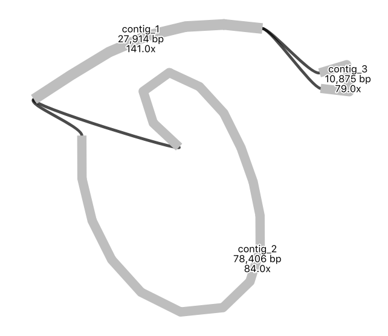

# Introduction


## What is genome assembly?

Genome assembly is the process of joining together DNA sequencing fragments into longer pieces, ideally up to chromosome lengths.The DNA fragments are produced by DNA sequencing machines, and are called "reads". These are in lengths of about 150 nucleotides (base pairs), to up to a million+ nucleotides, depending on the sequencing technology used. Currently, most reads are from Illumina (short), PacBio (long) or Oxford Nanopore (long and extra-long).

It is difficult to assemble plant genomes as they are often large (for example, 3,000,000,000 base pairs), have many repeat regions (such as transposons), and may be polyploid. This tutorial shows genome assembly for a smaller data set - the plant chloroplast genome - a single circular chromosome which is typically about 160,000 base pairs. It is thought that the the chloroplast evolved from a cyanobacteria that was living in plant cells.

In this tutorial, we will use a subset of a real data set from sweet potato, from the paper . To find out more about each of the tools used here, see the tool panel page for a summary and links to more information.

><agenda-title></agenda-title>
> In this tutorial we will deal with:
>
> 1. TOC
> {:toc}
>
{: .agenda}

# Upload data

Let's start with uploading the data.

> <hands-on-title>Import the data</hands-on-title>
> 1. Create a new history for this tutorial and give it a proper name
>
>    
>    
>
> 2. Import from [Zenodo](https://zenodo.org/record/3567224) or a data library (ask your instructor):
>   - FASTQ file with illumina reads: `sweet-potato-chloroplast-illumina-reduced.fastq`
>   - FASTQ file with nanopore reads: `sweet-potato-chloroplast-nanopore-reduced.fastq`
>   - Note: make sure to import the files with "reduced" in the names, not the ones with "tiny" in the names.
>    ```
>    https://zenodo.org/record/3567224/files/sweet-potato-chloroplast-illumina-reduced.fastq
>    https://zenodo.org/record/3567224/files/sweet-potato-chloroplast-nanopore-reduced.fastq
>    ```
>
>    
>    
{: .hands_on}

# Check read quality

We will look at the quality of the nanopore reads.

> <hands-on-title>Check read quality</hands-on-title>
>
> 1. :
>    - *"Select multifile mode"*: `batch`
>    - *"Type of file to work on"*: `fastq`
>    - *"files"*: select the `nanopore FASTQ file`
> 2. **View output**:
>    * There are five output files.
>    *  Look at the `HTML report` to learn about the read quality.
{: .hands_on}

> <question-title></question-title>
> What summary statistics would be useful to look at?
>
> > <solution-title></solution-title>
> > This will depend on the aim of your analysis, but usually:
> > * **Sequencing depth** (the number of reads covering each base position; also called "coverage"). Higher depth is usually better, but at very high depths it may be better to subsample the reads, as errors can swamp the assembly graph.
> > * **Sequencing quality** (the quality score indicates probability of base call being correct). You may trim or filter reads on quality. Phred quality scores are logarithmic: phred quality 10 = 90% chance of base call being correct; phred quality 20 = 99% chance of base call being correct. More detail [here](https://en.wikipedia.org/wiki/Phred_quality_score).
> > * **Read lengths** (read lengths histogram, and reads lengths vs. quality plots). Your analysis or assembly may need reads of a certain length.
> {: .solution}
{: .question}

*Optional further steps:*
* Find out the quality of your reads using other tools such as fastp or FastQC.
* To visualize base quality using emoji you can also use FASTQE.
* Run FASTQE for the illumina reads. In the output, look at the mean values (the middle row)
* Repeat FASTQE for the nanopore reads. In the tool settings, increase the maximum read length to 30000.
* To learn more, see the [Quality Control tutorial]({{site.baseurl}}/topics/sequence-analysis/tutorials/quality-control/tutorial.html)

# Assemble reads

We will assemble the long nanopore reads.

> <hands-on-title>Assemble reads</hands-on-title>
> 1. :
>    - *"Input reads"*: `sweet-potato-chloroplast-nanopore-reduced.fastq`
>    - *"Estimated genome size"*: `160000`
>    - *Leave other settings as default*
>
> 2. Re-name the `consensus` output file to `flye-assembly.fasta`
>
>    
>
> 3. **View output**:
>    * There are five output files.
>    * *Note: this tool is heuristic; your results may differ slightly from the results here, and if repeated.*
>    * View the `log` file and scroll to the end to see how many contigs (fragments) were assembled and the length of the assembly.
>    * View the `assembly_info` file to see contig names and lengths.
{: .hands_on}


> <hands-on-title>View the assembly</hands-on-title>
> 1. 
>    - *"Graphical Fragment Assembly"*: the Flye output file `Graphical Fragment Assembly` (not the "assembly_graph" file)
>    - *Leave other settings as default*
> 2. 
>    - *"Graphical Fragment Assembly"*: the Flye output file `Graphical Fragment Assembly` (not the "assembly_graph" file)
>    - *"Node length labels"*: `Yes`
>    - *Leave other settings as default*
{: .hands_on}

Your assembly graph may look like this:



*Note: a newer version of the Flye assembly tool now resolves this assembly into a single circle.*

> <question-title></question-title>
> What is your interpretation of this assembly graph?
> > <solution-title></solution-title>
> > One interpretation is that this represents the typical circular chloroplast structure: There is a long single-copy region (the node of around 78,000 bp), connected to the inverted repeat (a node of around 28,000 bp), connected to the short single-copy region (of around 11,000 bp). In the graph, each end loop is a single-copy region (either long or short) and the centre bar is the collapsed inverted repeat which should have about twice the sequencing depth.
> {: .solution}
{: .question}

> <comment-title>Further Learning</comment-title>
> * Repeat the Flye assembly with different parameters, and/or a filtered read set.
> * You can also try repeating the Flye assembly with an earlier version of the tool, to see the difference it makes. In the tool panel for Flye, click on the 'Versions' button at the top to change.
> * Try an alternative assembly tool, such as Canu or Unicycler.
{: .comment}

# Polish assembly

Short illumina reads are more accurate the nanopore reads. We will use them to correct errors in the nanopore assembly.

First, we will map the short reads to the assembly and create an alignment file.

> <hands-on-title>Map reads</hands-on-title>
> 1. :
>    - *"Will you select a reference genome from your history"*: `Use a genome from history`
>    - *"Use the following dataset as the reference sequence"*: `flye-assembly.fasta`
>    - *"Algorithm for constructing the BWT index"*: `Auto. Let BWA decide`
>    - *"Single or Paired-end reads"*: `Single`
>    - *"Select fastq dataset"*: `sweet-potato-illumina-reduced.fastq`
>    - *"Set read groups information?"*: `Do not set`
>    - *"Select analysis mode"*: `Simple Illumina mode`
>2. **Re-name output file**:
>   - Re-name this file `illumina.bam`
{: .hands_on}

Next, we will compare the short reads to the assembly, and create a polished (corrected) assembly file.

> <hands-on-title>Polish</hands-on-title>
> 1. :
>    - *"Source for reference genome used for BAM alignments"*: `Use a genome from history`
>    - *"Select a reference genome"*: `flye-assembly.fasta`
>    - *"Type automatically determined by pilon"*: `Yes`
>    - *"Input BAM file"*: `illumina.bam`
>    - *"Variant calling mode"*: `No`
>    - *"Create changes file"*: `Yes`
>
> 2. **View output**:
>   * What is in the `changes` file?
>   * Rename the fasta output to `polished-assembly.fasta`
>
>    
>
> 3. 
>    - Find and run the tool called "Fasta statistics" on both the original flye assembly and the polished version.
{: .hands_on}

> <question-title></question-title>
> How does the polished assembly compare to the unpolished assembly?
> > <solution-title></solution-title>
> > This will depend on the settings, but as an example: your polished assembly might be about 10-15 Kbp longer. Nanopore reads can have homopolymer deletions - a run of AAAA may be interpreted as AAA - so the more accurate illumina reads may correct these parts of the long-read assembly. In the changes file, there may be a lot of cases showing a supposed deletion (represented by a dot) being corrected to a base.
> {: .solution}
{: .question}

*Optional further steps:*
* Run a second round (or more) of Pilon polishing. Keep track of file naming; you will need to generate a new bam file first before each round of Pilon.
* Run an alternative polishing tool, such as Racon. This uses the long reads themselves to correct the long-read (Flye) assembly. It would be better to run this tool on the Flye assembly before running Pilon, rather than after Pilon.

# Annotate the assembly

We can now annotate our assembled genome with information about genomic features.

* A chloroplast genome annotation tool is not yet available in Galaxy; for an approximation, here we can use the tool for bacterial genome annotation, Prokka.

> <hands-on-title>Annotate with Prokka</hands-on-title>
>
> 1.  with the following parameters (leave everything else unchanged)
>    -  *"contigs to annotate"*: `polished-assembly.fasta`
> 2. **View output**:
>    * The GFF and GBK files contain all of the information about the features annotated (in different formats.)
>    * The .txt file contains a summary of the number of features annotated.
>    * The .faa file contains the protein sequences of the genes annotated.
>    * The .ffn file contains the nucleotide sequences of the genes annotated.
{: .hands_on}


Alternatively, you might want to use a web-based tool designed for chloroplast genomes.

* One option is the GeSeq tool, described here. Skip this step if you have already used Prokka above.

> <hands-on-title>Annotate with GeSeq</hands-on-title>
> * Download `polished-assembly.fasta` to your computer (click on the file in your history; then click on the disk icon).
> * In a new browser tab, go to [Chlorobox](https://chlorobox.mpimp-golm.mpg.de/geseq.html) where we will use the GeSeq tool () to annotate our sequence.
> * Upload the `fasta` file there. Information about how to use the tool is available on the page.
> * Once the annotation is completed, download the required files.
> * In Galaxy, import the annotation `GFF3` file.
{: .hands_on}

Now make a JBrowse file to view the annotations (the GFF3 file - produced from either Prokka or GeSeq) under the assembly (the polished-assembly.fasta file).

> <hands-on-title>View annotations</hands-on-title>
> 1. :
>    - *"Reference genome to display"*: `Use a genome from history`
>        - *"Select a reference genome"*: `polished-assembly.fasta`
>    - *"Produce Standalone Instance"*: `Yes`
>    - *"Genetic Code"*: `11. The Bacterial, Archaeal and Plant Plastid Code`
>    - *"JBrowse-in-Galaxy Action"*: `New JBrowse instance`
>    - *"Insert Track Group"*
>        - *"Insert Annotation Track"*
>            - *"Track Type"*: `GFF/GFF3/BED Features`
>            - *"GFF/GFF3/BED Track Data"*: the `GFF3` file
>            - *Leave the other track features as default*
> 2. **Re-name output file**:
>    - JBrowse may take a few minutes to run. There is one output file: re-name it `view-annotations`
> 3. **View output**:
>    * Click on the eye icon to view the annotations file.
>    * Select the right contig to view, in the drop down box.
>    * Zoom out (with the minus button) until annotations are visible.
{: .hands_on}

Here is an embedded snippet showing JBrowse and the annotations:



# View reads

We will look at the original sequencing reads mapped to the genome assembly. In this tutorial, we will import very cut-down read sets so that they are easier to view.

> <hands-on-title>Import cut-down read sets</hands-on-title>
> 1.  from [Zenodo](https://zenodo.org/record/3567224) or a data library (ask your instructor):
>   - FASTQ file with illumina reads: `sweet-potato-chloroplast-illumina-tiny.fastq`
>   - FASTQ file with nanopore reads: `sweet-potato-chloroplast-nanopore-tiny.fastq`
>   - Note: these are the "tiny" files, not the "reduced" files we imported earlier.
>    ```
>    https://zenodo.org/record/3567224/files/sweet-potato-chloroplast-illumina-tiny.fastq
>    https://zenodo.org/record/3567224/files/sweet-potato-chloroplast-nanopore-tiny.fastq
>    ```
{: .hands_on}

> <hands-on-title>Map the reads to the assembly</hands-on-title>
> * Map the Illumina reads (the new "tiny" dataset) to the `polished-assembly.fasta`, the same way we did before, using bwa mem.
> * This creates one output file: re-name it `illumina-tiny.bam`
> * Map the Nanopore reads (the new "tiny" dataset) to the `polished-assembly.fasta`. The settings will be the same, except `Select analysis mode` should be `Nanopore`
> * This creates one output file: re-name it `nanopore-tiny.bam`
{: .hands_on}

> <hands-on-title>Visualise mapped reads</hands-on-title>
> 1. :
>    - *"Reference genome to display"*: `Use a genome from history`
>        - *"Select a reference genome"*: `polished-assembly.fasta`
>    - *"Produce Standalone Instance"*: `Yes`
>    - *"Genetic Code"*: `11. The Bacterial, Archaeal and Plant Plastid Code`
>    - *"JBrowse-in-Galaxy Action"*: `New JBrowse instance`
>    - *"Insert Track Group"*
>        - *"Insert Annotation Track"*
>            - *"Track Type"*: `BAM pileups`
>            - *"BAM track data"*: `nanopore-tiny.bam`
>            - *"Autogenerate SNP track"*: `No`
>            - *Leave the other track features as default*
>        - *"Insert Annotation Track"*.
>            - *"Track Type"*: `BAM pileups`
>            - *"BAM track data"*: `illumina-tiny.bam`
>            - *"Autogenerate SNP track"*: `No`
>            - *Leave the other track features as default*
> 2. **Re-name output file**:
>    - JBrowse may take a few minutes to run. There is one output file: re-name it `assembly-and-reads`
> 3. **View output**:
>    * Click on the eye icon to view. (For more room, collapse Galaxy side menus with corner < > signs).
>    *  Make sure the bam files are ticked in the left hand panel.
>    * Choose a contig in the drop down menu. Zoom in and out with + and - buttons.
{: .hands_on}

Here is an embedded snippet showing JBrowse and the mapped reads:




> <question-title></question-title>
>
> 1. What are the differences between the nanopore and the illumina reads?
> 2. What are some reasons that the read coverage may vary across the reference genome?
>
> > <solution-title></solution-title>
> > 1. Nanopore reads are longer and have a higher error rate.
> > 2. There may be lots of reasons for varying read coverage. Some possibilities: In areas of high read coverage: this region may be a collapsed repeat. In areas of low or no coverage: this region may be difficult to sequence; or, this region may be a misassembly.
> {: .solution}
{: .question}

* To learn more about JBrowse and its features, see the [Genomic Data Visualisation with JBrowse tutorial]({{site.baseurl}}/topics/visualisation/tutorials/jbrowse/tutorial.html)


# Repeat with new data

*Optional extension exercise*

We can assemble another chloroplast genome using sequence data from a different plant species: the snow gum, *Eucalyptus pauciflora*. This data is from . It is a subset of the original FASTQ read files (Illumina - SRR7153063, Nanopore - SRR7153095).

> <hands-on-title>Assembly and annotation</hands-on-title>
> * Get data: at this [Zenodo link](https://doi.org/10.5281/zenodo.3600662), then upload to Galaxy.
> * Check reads: Run Nanoplot on the nanopore reads.
> * Assemble: Use Flye to assemble the nanopore reads, then get Fasta statistics *Note: this may take several hours.*
> * Polish assembly: Use Pilon to polish the assembly with short Illumina reads. *Note: Don't forget to map these Illumina reads to the assembly first using bwa-mem, then use the resulting `bam` file as input to Pilon.*
> * Annotate: Use the GeSeq tool at [Chlorobox](https://chlorobox.mpimp-golm.mpg.de/geseq.html) or the Prokka tool within Galaxy.
> * View annotations:Use JBrowse to view the assembled, annotated genome.
{: .hands_on}

# Conclusion

