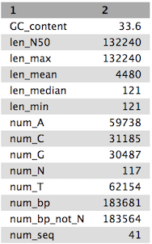

# Optimised de Bruijn Graph assemblies using the Velvet Optimiser and SPAdes
In this activity, we will perform *de novo* assemblies of a short read set using the Velvet Optimiser and the SPAdes assemblers. We are using the Velvet Optimiser for illustrative purposes. For real assembly work, a more suitable assembler should be chosen - such as SPAdes.

The Velvet Optimiser is a script written by Simon Gladman to optimise the k-mer size and coverage cutoff parameters for Velvet. More information can be found [here](https://github.com/slugger70/VelvetOptimiser)

SPAdes is a de novo genome assembler written by Pavel Pevzner's group in St. Petersburg. More details on it can be found [here](http://cab.spbu.ru/software/spades/)

> ### Agenda
>
> In this tutorial, we will deal with:
>
> 1. [Get the data](#get-the-data)
> 2. [Assemble with the Velvet Optimiser](#assembly-with-the-velvet-optimiser)
> 3. [Assemble with SPAdes](#assemble-with-spades)
{: .agenda}

# Get the data

We will be using the same data that we used in the introductory tutorial, so if you have already completed that and have the data, skip this section.

> ###  Hands-on: Getting the data
>
> 1. Create and name a new history for this tutorial.
> 2. Import the sequence read raw data (\*.fastq) from [Zenodo](https://zenodo.org/record/582600)
>
>    > ###  Tip: Importing data via links
>    >
>    > * Copy the link location (Right-click on the filename <i class="fa fa-long-arrow-right"></i> Copy Link Address)
>    > * Open the Galaxy Upload Manager
>    > * Select **Paste/Fetch Data**
>    > * Paste the link into the text field
>    > * Change the data-type to **fastqsanger**
>    > * Press **Start**    
>    {: .tip}
>
>
> 3. Once the files have been uploaded, change their names to Mutant_R1.fastq and Mutant_R2.fastq respectively by clicking on the  icon next to the relevant history entry.
>
> Click on the View Data button (the ) next to one of the FASTQ sequence files.
>
>    > ###  Questions
>    >
>    > 1. What are four key features of a FASTQ file?
>    > 2. What is the main difference between a FASTQ and a FASTA file?
>    {: .question}
>
>
{: .hands_on}

# Assembly with the Velvet Optimiser

We will perform an assembly with the Velvet Optimiser. It will automatically choose a suitable value for the k-mer size (**k**). It will then go on to optimise the coverage cutoff (**cov_cutoff**) which corrects for read errors. It will use the "*n50*" metric for optimising the k-mer size and the "*total number of bases in contigs*" for optimising the coverage cutoff.

> ###  Hands-on: Assemble with the Velvet Optimiser
>
> #### Use the **Velvet Optimiser**  tool.
>
> - Set the following parameters (leave other settings as they are):
>
>    - **Start k-mer size**: 45
>    - **End k-mer size**: 73
>    - **Input file type**: Fastq
>    - **Single or paired end reads**: Paired
>    - **Select first set of reads**: *mutant_R1.fastq*  
>    - **Select second set of reads**: *mutant_R2.fastq*
>
{: .hands_on}

Your history will now contain a number of new files:

* Velvet optimiser contigs
  * A fasta file of the final assembled contigs

* Velvet optimiser contig stats
  * A table of the lengths (in k-mer length) and coverages (k-mer coverages) for the final contigs.

Have a look at each file.

> ###  Hands-on: Get contig statistics for Velvet Optimiser contigs
>
> #### Use the **Fasta Statistics**  tool to produce a summary of the velvet optimiser contigs
>
> Look at the output file.
>
>    > ###  Questions
>    >
>    > Compare the output we got here with the output of the simple assemblies obtained in the introductory tutorial.
>    > 1. What are the main differences between them?
>    > 2. Which has a higher "n50"? What does this mean?
>    {: .question}
>
{: .hands_on}

Tables of results from **(a)** Simple assembly and **(b)** optimised assembly.

**(a)** 

**(b)** 

# Assemble with SPAdes

We will now perform an assembly with the much more modern SPAdes assembler. It goes through a similar process to Velvet in the fact that it uses and simplifies de Bruijn graphs but it uses multiple values for k-mer size and combines the resultant graphs. This combination produces very good assemblies. When using SPAdes it is typical to choose at least 3 k-mer sizes. One low, one medium and one high. We will use 33, 55 and 91.

> ###  Hands-on: Assemble with SPAdes
>
> #### Use the **SPAdes**  tool.
>
> - Set the following parameters (leave other settings as they are):
>
>    - **Run only assembly**: yes
>    - **K-mers to use separated by commas**: 33,55,91 *[note: no spaces!]*
>    - **Coverage cutoff**: auto
>    - **Files -> forward reads**: *mutant_R1.fastq*  
>    - **Files -> reverse reads**: *mutant_R2.fastq*
>
{: .hands_on}

You will now have 5 new files in your history:

* two Fasta files, one for contigs and one for scaffolds
* two statistics files, one for contigs and one for scaffolds
* the SPAdes log file.

Examine each file, especially the stats files.

> ###  Questions
>
> 1. Why would one of the contigs have much higher coverage than the others?
> 2. What could this represent?
>
{: .question}

> ###  Hands-on: Get contig statistics for SPAdes contigs
>
>
> #### Use the **Fasta Statistics**  tool to produce a summary of the SPAdes contigs
>
> Look at the output file.
>
>    > ###  Questions
>    >
>    > Compare the output we got here with the output of the simple assemblies obtained in the introductory tutorial.
>    > 1. What are the main differences between them?
>    > 2. Did SPAdes produce a better assembly than the Velvet Optimiser?
>    {: .question}
>
{: .hands_on}
