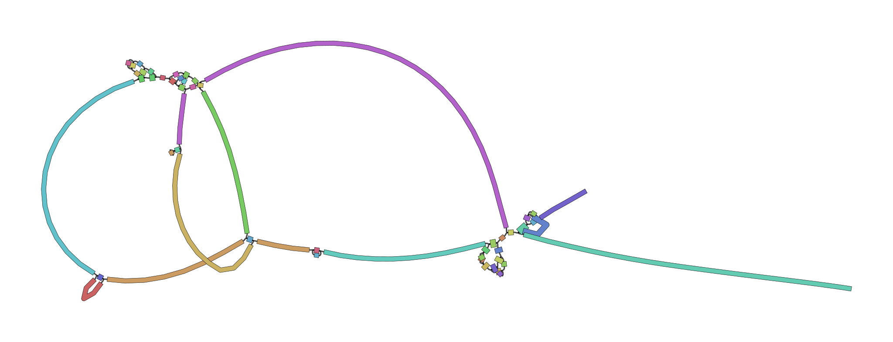
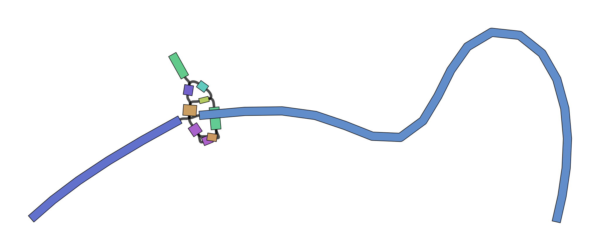

# Optimised de Bruijn Graph assemblies using the Velvet Optimiser and SPAdes

In this activity, we will perform *de novo* assemblies of a short read set using the Velvet Optimiser and the SPAdes assemblers. We are using the Velvet Optimiser for illustrative purposes. For real assembly work, a more suitable assembler should be chosen - such as SPAdes.

The Velvet Optimiser is a script written by Simon Gladman to optimise the k-mer size and coverage cutoff parameters for Velvet. More information can be found [here](https://github.com/slugger70/VelvetOptimiser)

SPAdes is a de novo genome assembler written by Pavel Pevzner's group in St. Petersburg. More details on it can be found [here](http://cab.spbu.ru/software/spades/)


> ### Agenda
>
> In this tutorial, we will deal with:
>
> 1. [Get the data](#get-the-data)
> 2. [Assemble with the Velvet Optimiser](#assembly-with-the-velvet-optimiser)
> 3. [Assemble with SPAdes](#assemble-with-spades)
{: .agenda}

# Get the data

We will be using the same data that we used in the introductory tutorial, so if you have already completed that and have the data, skip this section.

> ###  Hands-on: Getting the data
>
> 1. Create and name a new history for this tutorial.
>
>    
>
> 2. Import the sequence read raw data (\*.fastq) from [Zenodo](https://zenodo.org/record/582600)
>
>    ```
>    https://zenodo.org/record/582600/files/mutant_R1.fastq
>    https://zenodo.org/record/582600/files/mutant_R2.fastq
>    ```
>
>    
>
> 3. Rename the files 
>    - The name of the files are the full URL, let's make the names a little clearer
>    - Change the names to just the last part, `Mutant_R1.fastq`, `Mutant_R2.fastq`  respectively
>
>    
>
>    > ###  Questions
>    >
>    > 1. What are four key features of a FASTQ file?
>    > 2. What is the main difference between a FASTQ and a FASTA file?
>    {: .question}
>
>
{: .hands_on}

# Assembly with the Velvet Optimiser

We will perform an assembly with the Velvet Optimiser, which automatically runs and optimises the output of the Velvet assembler (). It will automatically choose a suitable value for the k-mer size (**k**). It will then go on to optimise the coverage cutoff (**cov_cutoff**) which corrects for read errors. It will use the "*n50*" metric for optimising the k-mer size and the "*total number of bases in contigs*" for optimising the coverage cutoff.

> ###  Hands-on: Assemble with the Velvet Optimiser
>
>  1. **Velvet Optimiser** : Optimise your assembly with the following parameters:
>    - *"Start k-mer size"*: `45`
>    - *"End k-mer size"*: `73`
>    - *"Input file type"*: `Fastq`
>    - *"Single or paired end reads"*: `Paired`
>    -  *"Select first set of reads"*: `mutant_R1.fastq`
>    -  *"Select second set of reads"*: `mutant_R2.fastq`
>
{: .hands_on}

Your history will now contain a number of new files:

* Velvet optimiser contigs
  * A fasta file of the final assembled contigs
* Velvet optimiser contig stats
  * A table of the lengths (in k-mer length) and coverages (k-mer coverages) for the final contigs.

Have a look at each file.


> ###  Hands-on: Get contig statistics for Velvet Optimiser contigs
>
> 1. **Fasta Statistics** : Produce a summary of the velvet optimiser contigs:
>    -  *"fasta or multifasta file"*: Select your velvet optimiser contigs file
>
> 2. View the output
>
>    > ###  Questions
>    >
>    > Compare the output we got here with the output of the simple assemblies obtained in the introductory tutorial.
>    > 1. What are the main differences between them?
>    > 2. Which has a higher "n50"? What does this mean?
>    {: .question}
>
{: .hands_on}

Tables of results from **(a)** Simple assembly and **(b)** optimised assembly.

**(a)** 

**(b)** 

> ###  Details: Further reading on assembly with Velvet
> - Heuristic Resolution of Repeats and Scaffolding in the Velvet Short-Read de Novo Assembler ()
>
{: .details}

## Visualisation of the Assembly

Now that we've assembled the genomes, let's visualise this assembly using [Bandage](https://rrwick.github.io/Bandage/) (). This tool will let us better understand how the assembly graph really looks, and can give us a feeling for if the genome was well assembled or not.

Currently VelvetOptimiser does not include the LastGraph output, so we will manually run `velveth` and `velvetg` with the optimised parameters.

> ###  Hands-on: Manually running velvetg/h
>
> 1. Locate the output called "VelvetOptimiser: Contigs" in your history
>
> 2. Click the (i) information icon
>
> 3. Check the tool `stderr` in the information page for the optimised k-mer value
{: .hands_on}

> ###  Question
> What was the optimal k-mer value? (referred to as *"hash"* in the stderr log)
> > ###  Solution
> > 55
> {: .solution}
{: .hands_on}

With this information in hand, let's run velvet:

> ###  Hands-on: Manually running velvetg/h
>
> 1. **velveth** : Prepare a dataset for the Velvet velvetg Assembler
>    - *"Hash length"*: `55`
>    - *"Insert Input Files"*:
>      - 1: Input Files
>        - *"file format"*: `fastq`
>        - *"read type"*: `shortPaired reads`
>        - *"Dataset"*: `mutant_R1.fastq`
>    - *"Insert Input Files"*:
>      - 2: Input Files
>        - *"file format"*: `fastq`
>        - *"read type"*: `shortPaired reads`
>        - *"Dataset"*: `mutant_R2.fastq`
>
> 2. **velvetg** : Velvet sequence assembler for very short reads
>    - *"Velvet dataset"*: output from **velveth** 
>    - *"Generate velvet LastGraph file"*: `Yes`
>    - *"Coverage cutoff"*: `Specify Cutoff Value`
>      - *"Remove nodes with coverage below"*: `1.44`
>    - *"Using Paired Reads"*: `Yes`
>
{: .hands_on}

The LastGraph contains a detailed representation of the De Bruijn graph, which can give us an idea how velvet has assembled the genome and potentially resolved any conflicts.

> ###  Hands-on: Bandage
>
> 1. **Bandage Image** : visualize de novo assembly graphs
>    - *"Graphical Fragment Assembly"*: The "LastGraph" output of **velvetg** 
>    - *"Produce jpg, png or svg file?"*: `.svg`
>
> 2. Execute
> 3. View the output file
{: .hands_on}

And now you should be able to see the graph that velvet produced:


## Interpreting Bandage Graphs

k-mer size has a [significant effect](https://github.com/rrwick/Bandage/wiki/Effect-of-kmer-size) on the assembly. You can play around with various k-mers to see this effect in practice.

k-mer | graph
----- | -----
21    | [](../../images/bandage-velvet-21.svg)
33    | [](../../images/bandage-velvet-33.svg)
53    | [](../../images/bandage-velvet-53.svg)
77    | [](../../images/bandage-velvet-77.svg)

The next thing to be aware of is that there can be multiple valid interpretations of a graph, all equally valid in absence of other data. The following is taken verbatim [from Bandage's wiki](https://github.com/rrwick/Bandage/wiki/Simple-example):

> For a simple case, imagine a bacterial genome that contains a single repeated element in two separate places in the chromosome:
>
> 
>
> A researcher (who does not yet know the structure of the genome) sequences it, and the resulting 100 bp reads are assembled with a de novo assembler:
>
> 
>
> Because the repeated element is longer than the sequencing reads, the assembler was not able to reproduce the original genome as a single contig. Rather, three contigs are produced: one for the repeated sequence (even though it occurs twice) and one for each sequence between the repeated elements.
>
> Given only the contigs, the relationship between these sequences is not clear. However, the assembly graph contains additional information which is made apparent in Bandage:
>
> 
>
> There are two principal underlying sequences compatible with this graph: two separate circular sequences that share a region in common, or a single larger circular sequence with an element that occurs twice:
>
> 
>
> Additional knowledge, such as information on the approximate size of the bacterial chromosome, can help the researcher to rule out the first alternative. In this way, Bandage has assisted in turning a fragmented assembly of three contigs into a completed genome of one sequence.
{: .quote}

# Assemble with SPAdes

We will now perform an assembly with the much more modern SPAdes assembler (). It goes through a similar process to Velvet in the fact that it uses and simplifies de Bruijn graphs but it uses multiple values for k-mer size and combines the resultant graphs. This combination produces very good assemblies. When using SPAdes it is typical to choose at least 3 k-mer sizes. One low, one medium and one high. We will use 33, 55 and 91.

> ###  Hands-on: Assemble with SPAdes
>
> 1. **SPAdes** : Assemble the reads:
>
>    - *"Run only assembly"*: `yes`
>    - *"K-mers to use separated by commas"*: `33,55,91` [note: no spaces!]
>    - *"Coverage cutoff"*: `auto`
>    -  *"Files -> forward reads"*: `mutant_R1.fastq`
>    -  *"Files -> reverse reads"*: `mutant_R2.fastq`
>    - *"Output final assembly graph with scaffolds?"*: `Yes`
>
{: .hands_on}

You will now have 5 new files in your history:

* two Fasta files, one for contigs and one for scaffolds
* two statistics files, one for contigs and one for scaffolds
* the SPAdes log file.

Examine each file, especially the stats files.


> ###  Questions
>
> 1. Why would one of the contigs have much higher coverage than the others?
> 2. What could this represent?
>
{: .question}


> ###  Hands-on: Visualize assembly with Bandage
>
> 1. **Bandage**  with the following parameters:
>    - *"Graphical Fragment Assembly"*: `assembly graph with scaffolds` output from **SPAdes** 
>
> 2. Examine the output image 
>
{: .hands_on}

The visualized assembly should look something like this:




> ###  Questions
>
> Which assembly looks better to you? Why?
>
{: .question}


> ###  Hands-on: Get contig statistics for SPAdes contigs
>
> 1. **Fasta Statistics** : Produce a summary of the SPAdes contigs:
>    -  *"fasta or multifasta file"*: Select your velvet optimiser contigs file
>
> 2. Look at the output file.
>
>    > ###  Questions
>    >
>    > Compare the output we got here with the output of the simple assemblies obtained in the introductory tutorial.
>    > 1. What are the main differences between them?
>    > 2. Did SPAdes produce a better assembly than the Velvet Optimiser?
>    {: .question}
>
{: .hands_on}
