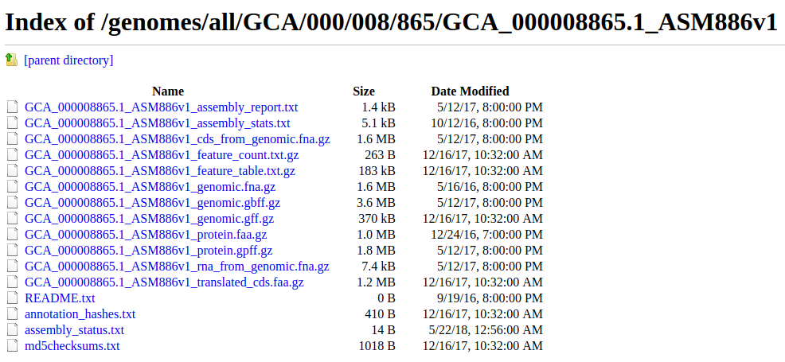
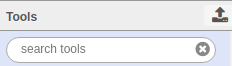
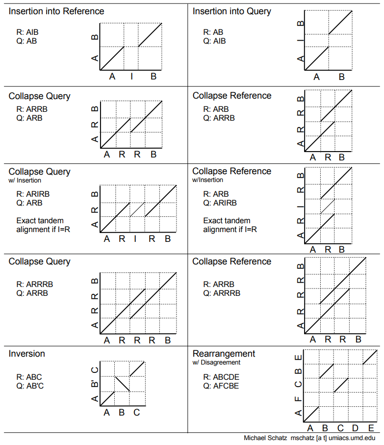
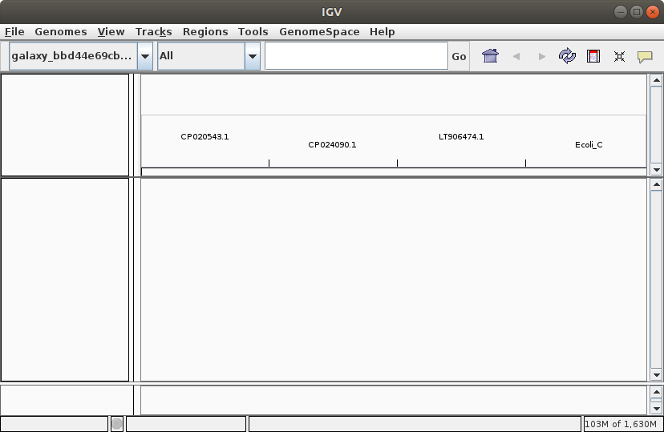
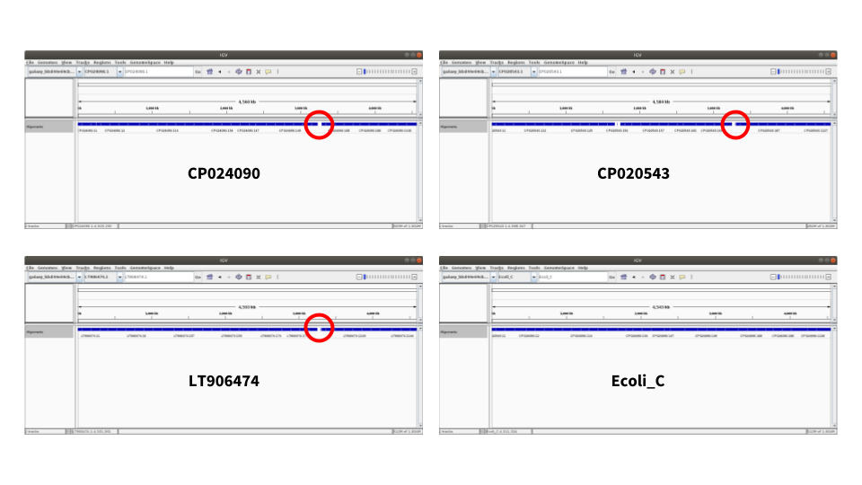
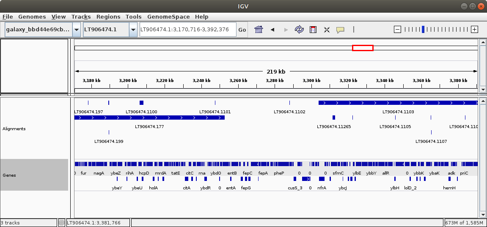
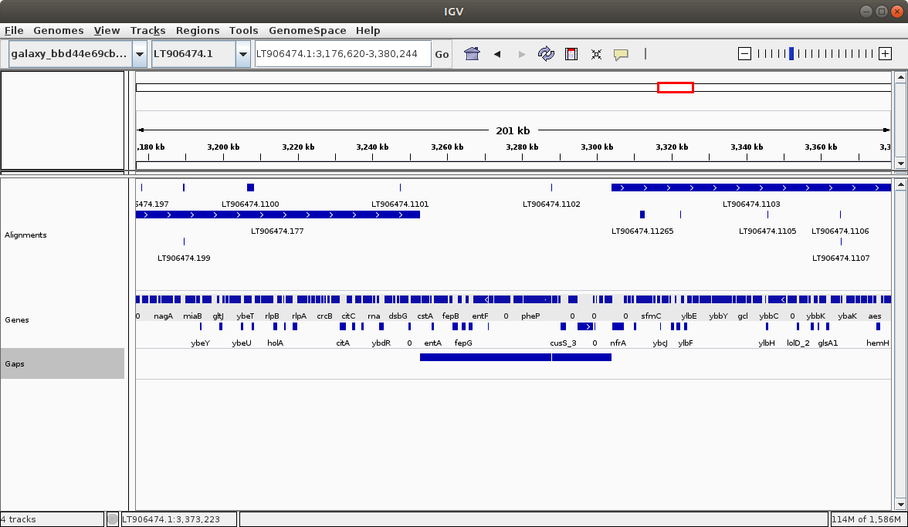

> ### Outline of this tutorial
>
> In this tutorial we begin with a new genome assembly just produced in the [Unicycler tutorial]({{site.baseurl}}/topics/assembly/tutorials/unicycler-assembly/tutorial.html). This is an assembly of *E. coli* C, which we will be comparing to assemblies of all other complete genes of this species.
>
> 1. TOC
> {:toc}
>
{: .agenda}

# Finding closely related genomes

*E. coli* is one of the most studied organisms. There are hundreds of complete genomes (in fact, the total number of *E. coli* assemblies in Genbank is over 10,500). Here we will shows how to uploaded all (!) complete *E. coli* genomes at once.

## Getting complete *E. coli* genomes into Galaxy


Our initial objective is to compare our assembly against all complete *E. coli* genomes to identify the most related ones and to find any interesting genome alterations. In order to do this we need to align our assembly against all other genomes. And in order to do that we need to first obtain all these other genomes.

[NCBI](https://www.ncbi.nlm.nih.gov/) is the resource that would store all complete *E. coli* genomes. Specifically, they can be found [here](https://www.ncbi.nlm.nih.gov/genome/genomes/167). As we will see, this list contains over 500 genomes and so uploading them by hand will likely result in carpal tunnel syndrome, which we want to prevent. Galaxy has several features that are specifically designed for uploading and managing large sets of similar types of data. The following two **Hands-on** sections show how they can be used to import all completed *E. coli* genomes into Galaxy.

> ###  Hands-on: Preparing a list of all complete *E. coli* genomes
>
>Open [the NCBI list of of *E. coli* genomes](https://www.ncbi.nlm.nih.gov/genome/genomes/167) in a new window and position two browser windows (one the tutorial and the one you just opened) side by side. Then follow the steps in the following video.
>
>
><div style="padding:56.25% 0 0 0;position:relative;"><iframe src="https://player.vimeo.com/video/271328293?title=0&byline=0&portrait=0" style="position:absolute;top:0;left:0;width:100%;height:100%;" frameborder="0" webkitallowfullscreen mozallowfullscreen allowfullscreen></iframe></div><script src="https://player.vimeo.com/api/player.js"></script>
>
{: .hands_on}

Now that the list is formatted as a table in a spreadsheet, it is time to upload it into Galaxy. There is a problem though: the URLs (web addresses) in the list do not actually point to sequence files that we would need to perform alignments. Instead they point to directories. For example, this URL:

```
ftp://ftp.ncbi.nlm.nih.gov/genomes/all/GCA/000/008/865/GCA_000008865.1_ASM886v1
```

points to a directory (rather than a file) containing many files, most of which we do not need:



So to download sequence files we need to edit URLs by adding filenames to them. For example, in the case of the URL shown above we need to add `/GCA_000008865.1_ASM886v1` and `_genomic.fna.gz` to the end to get this:

```
ftp://ftp.ncbi.nlm.nih.gov/genomes/all/GCA/000/008/865/GCA_000008865.1_ASM886v1/GCA_000008865.1_ASM886v1_genomic.fna.gz
```

This can be done as a two step process where we first copy the end part of the existing URL (`/GCA_000008865.1_ASM886v1`) and then add a fixed string `_genomic.fna.gz` to the end of it. Doing this by hand is crazy and trying to do it in a spreadsheet is complicated. Fortunately, Galaxy's new rule-based uploader can help, as shown in the next **Hands-on** section:

> ###  Hands-on: Data upload
>
>Here we copy data from the spreadsheet described in the previous section into Galaxy's rule-based uploader to download several hunder complete genomes into a Collection. Follow the steps in the video below.
>
>
><div style="padding:56.25% 0 0 0;position:relative;"><iframe src="https://player.vimeo.com/video/271336444?title=0&byline=0&portrait=0" style="position:absolute;top:0;left:0;width:100%;height:100%;" frameborder="0" webkitallowfullscreen mozallowfullscreen allowfullscreen></iframe></div><script src="https://player.vimeo.com/api/player.js"></script>
{: .hands_on}

Now we have all complete *E. coli* genomes in Galaxy's history. It is time to do a few things to our assembly.

## Preparing assembly


Before starting any analyses we need to upload the assembly produced in [Unicycler tutorial]({{site.baseurl}}/topics/assembly/tutorials/unicycler-assembly/tutorial.html) from Zenodo:

 > ###  Uploading *E. coli* assembly into Galaxy
 >
 > 1. **Upload** :
 >   - Click **Paste/Fetch data** button (Bottom of the interface box)
 >   - **Paste** `https://zenodo.org/record/1306128/files/Ecoli_C_assembly.fna` into the box.
 >   - *"Type"*: `fasta`
 >   - Click **Start**
{: .hands_on}

 > ###  Tip: Finding tools mentioned in this tutorial
 >Galaxy instances contain hundreds of tools. As a result, it can be hard to find tools mentioned in tutorials such as this one. To help with this challenge, Galaxy has a search box at the top of the left panel. Use this box to find the tools mentioned here.
 >
 {: .tip}

The assembly we just uploaded has two issues that need to be addressed before proceeding with our analysis:

 1. It contains two sequences: the one of *E. coli* C genome (the one we really need) and another representing phage phiX174 (a by product of Illumina sequencing where it is used as a spike-in DNA).
 2. Sequences have unwieldy names like `>1 length=4576293 depth=1.00x circular=true`. We need to rename it to something more meaningful.

 Let's fix these two problems.

Because phiX173 is around 5,000bp, we can remove those sequences by setting a minimum length of 10,000:

> ###  Hands-on: Fixing assembly
>
> 1. **Filter sequences by length**  with the following parameters:
>   - *"Fasta file"*: the dataset you've just uploaded. (`https://zenodo.org/record/1306128/files/Ecoli_C_assembly.fna`).
>   - *"Minimal length"*: `10000`
>
>
> 2. **Text transformation with sed**  with the following parameters:
>   - *"File to process"*: the output of the previous step
>   - *"SED program"*: `s/^>1.*$/>Ecoli_C/`
>
{: .hands_on}


> ###  Details: SED editor and Regular Expressions
>
> The program we just entered is a so-called [Regular Expression](https://en.wikipedia.org/wiki/Regular_expression)
>
> The expression `s/^>1.*$/>Ecoli_C/` contains several pieces that you need to understand. Let's write it top-to-bottom and explain:
>
> - `s` - tells SED to *Substitute*
> - `/` - opens a section of the commands telling SED *what* to substitute
> - `^` - tell SED to start looking at *the beginning* of each line
> - `>` - is the first character we want to match. Remember that name of the sequence in FASTA files starts with `>`
> - `1` - is the number present is our old name (`>1 length=4576293 depth=1.00x circular=true` to `>Ecoli_C`)
> - `.` - dot has a special meaning. It signifies *any* character
> - `*` - is a *quantifier*. From [Wikipedia](https://en.wikipedia.org/wiki/Regular_expression): "The asterisk indicates zero or more occurrences of the preceding element. For example, ab*c matches `ac`, `abc`, `abbc`, `abbbc`, and so on."
> - `$` - signifies *the end* of a line
> - `/` - is *the end* of the *what to substitute* section. It also serves as the beginning of *what to substitute WITH* section
> - `>` - is the required element of the FASTA sequence name
> - `Ecoli_C` is the *name* we want the sequence to have
> - `/` - is the end of the SED command
>
>So in short we are replacing `>1 length=4576293 depth=1.00x circular=true` with `>Ecoli_C`. The *Regular expression* `^>1.*$` is used here to represent `>1 length=4576293 depth=1.00x circular=true`.<br>
>Detailed description of regular expressions is outside of the scope of this tutorial, but there are other great resources. Start with [Software Carpentry Regular Expressions tutorial](http://v4.software-carpentry.org/regexp/index.html).
{: .tip}

> ###  Questions
>
> 1. What is the meaning of `^` character is SED expression?
> 2. Where do you go to learn more about regular expressions?
>
> > ###  Solution
> >
> > 1. It tells SED to start matching from the beginning of the string.
> > 2. [Software Carpentry](https://software-carpentry.org)
> >
> {: .solution}
{: .question}


## Generating alignments


Now everything is loaded and ready to go. We will now align our assembly against each of the *E. coli* genomes we have uploaded into the collection. To do this we will use [LASTZ](https://lastz.github.io/lastz/)&mdash;an aligner designed for long sequences.

> ###  Hands-on: Running LASTZ
> 1. **LASTZ**  with the following parameters:
>   - *"Select TARGET sequence(s) to align against"*: `from your history`
>   - *"Select a reference dataset"*: the *E. coli* genomes we uploaded earlier (collection input)
>   - *"Select QUERY sequence(s)"*: our assembly which was prepared in the previous step.
>   - *"Perform chaining of HSPs with no penalties"*: `Yes` (in **Chaining** section)
>   - *"Specify the output format"*: `blastn` (in **Output** section)
{: .hands_on}

Note that because we started LASTZ on *a collection* of *E. coli* genomes, it will output alignment information as *a collection* as well. A collection is simply a way to represent large sets of similar data in a compact way within Galaxy's interface.

> ###  It will take a while!
> Please understand that alignment is not an instantaneous process: allow several hours for these jobs to clear.
{: .warning-box}

## Finding closely related assemblies


### Understanding LASTZ output

LASTZ produced data in so-called `blastn` format (because we explicitly told LASTZ to output in this format, see previous step), which looks like this:

```
         1       2     3   4  5 6       7       8    9   10      11    12
-------------------------------------------------------------------------
BA000007.2 Ecoli_C 66.81 232 51 6 3668174 3668397 5936 6149 3.2e-40 162.7
BA000007.2 Ecoli_C 57.77 206 38 8  643802  643962 5945 6146 1.6e-18  90.6
BA000007.2 Ecoli_C 67.03 185 32 6 4849373 4849528 5965 6149 2.9e-28 122.9
BA000007.2 Ecoli_C 63.06 157 33 3 1874604 1874735 5991 6147 5.8e-26 115.3
```

where columns are:

 1. `qseqid` - query (e.g., gene) sequence id
 2.	`sseqid` - subject (e.g., reference genome) sequence id
 3.	`pident` - percentage of identical matches
 4.	`length` - alignment length
 5.	`mismatch` - number of mismatches
 6.	`gapopen` - number of gap openings
 7.	`qstart` - start of alignment in query
 8.	`qend` - end of alignment in query
 9.	`sstart` - start of alignment in subject
 10. `send` - end of alignment in subject
 11. `evalue` - [expect value](https://blast.ncbi.nlm.nih.gov/Blast.cgi?CMD=Web&PAGE_TYPE=BlastDocs&DOC_TYPE=FAQ#expect)
 12. `bitscore`	- [bit score](https://www.ncbi.nlm.nih.gov/BLAST/tutorial/Altschul-1.html)

 The alignment information produced by LASTZ is a collection. In this collection each element contains alignment data between each of the *E. coli* genomes and our assembly:

.").

## Collapsing collection

Collections are a wonderful way to organize large sets of data and parallelize data processing like we did here with LASTZ. However, at this point we need to combine all data into one dataset. Follow the steps below to accomplish this:

> ###  Hands-on: Combining collection into a single dataset
> 1. **Collapse Collection**  with the following parameters:
>   - *"Collection of files to collapse"*: the output of **LASTZ** (collecion input)
{: .hands_on}

This will produce one gigantic table (over 12 million lines) containing combined LASTZ output for all genomes.

## Getting taste of the alignment data

To make further analyses we need to get an idea about alignment data generated with LASTZ. To do this let's select a random subsample of the large dataset we've generated above. This is necessary because processing the entire dataset will take time and will not give us a better insight anyway. So first we will select 10,000 lines from the alignment data:

> ###  Hands-on: Selecting random subset of data
> 1. **Select random lines from a file**  with the following parameters:
>   -  *"Randomly select"*: `10000`
>   -  *"from"*: the output from `Collapse Collection`
{: .hands_on}

Now we can visualize this dataset to discover generalities:

> ###  Hands-on: Graphing alignment data
> 1. Expand random subset of alignment data generated on the previous step by clicking on it.
> 2. You will see "chart" button (). Click on it.
> 3. In the central panel you will see a list of visualizations. Select **Scatter plot (NVD3)**
> 4. Click **Select data** button ()
> 5. Set **Values for x-axis** to `Column: 3` (alignment identity)
> 6. Set **Values for y-axis** to `Column: 4` (alignment length)
> 7. You can also click on configuration button () and specify axis labels etc.
{: .hands_on}

The relationship between the alignment identity and alignment length looks like this (remember that this is only a subsample of the data):

 versus length (bp). This graph is truncated at the top")

You can see that most alignments are short and have relatively low identity. Thus we can filter the original dataset by identity and length. Judging from this graph we can select alignment longer than 10,000 bp with identity above 90%.

> ###  Hands-on: Filtering data
> 1. **Filter data on any column using simple expressions**  with the following parameters:
>   - *"Filter"*: the full dataset.
>   - *"With following condition"*: `c3 >= 90 and c4 >= 10000` (here `c` stands for *column*).
>
>  NOTE: You need to select the full dataset; not the down-sampled one, but [the one generated by the collection collapsing operation](#hands_on-hands-on-combining-collection-into-a-single-dataset).
>
{: .hands_on}

## Aggregating data

Remember, our objective is to find the genomes that are most similar to ours. Given the alignment data in the table we just created we can define similarity as follows:

*Genomes that have the smallest number of alignment blocks but the highest overall alignment length are most similar to our assembly. This essentially means that they have longest uninterrupted region of high similarity to our assembly.*

However, to extract this information from our data we need to aggregate it. In other words, for each *E. coli* genome we need to calculate the total number of alignment blocks, their combined length, and average identity. The following section explains how to do this:

> ###  Hands-on: Aggregating the data
> 1. **Datamash (operations on tabular data)**  with the following parameters:
>     - *"Input tabular dataset"*: output of the previous `Filter` step.
>     - *"Group by fields"*: `1`. (column 1 contains name of the *E. coli* genome we mapped against)
>     - *"Sort input"*: `Yes`
>     - *"Operation to perform on each group"*:
>         - *"Type"*: `Count`
>         - *"On column"*: `Column: 1`
>     - Click **Insert operation to perform on each group** button twice to add two more input boxes.
>     - *"Operation to perform on each group"*:
>         - *"Type"*: `Mean`
>         - *"On column"*: `Column: 3`.
>     - *"Operation to perform on each group"*:
>         - *"Type"*: `Sum`
>         - *"On column"*: `Column: 4`
{: .hands_on}

## Finding closest relatives

The dataset generated above lists each *E. coli* genome accession only once and will have aggregate information for the number of alignment blocks, mean identity, and total length. Let's graph these data:

> ###  Hands-on: Graphing aggregated data
> 1. Expand the aggregated data generated on the previous step by clicking on it.
> 2. You will see "chart" button (). Click on it.
> 3. In the central panel you will see a list of visualizations. Select **Scatter plot (NVD3)**
> 4. Click **Select data** button ()
> 5. Set **Data point labels** to `Column: 1` (Accession number of each *E. coli* genome)
> 5. Set **Values for x-axis** to `Column: 2` (# of alignment blocks)
> 6. Set **Values for y-axis** to `Column: 4` (Total alignment length)
> 7. You can also click on configuration button () and specify axis labels etc.
{: .hands_on}

The relationship between the number of alignment blocks and total alignment length looks like this:

.")

A group of three dots in the upper left corner of this scatter plot represents genomes that are most similar to our assembly: they have a SMALL number of alignment blocks but HIGH total alignment length. Mousing over these three dots (if you set **Data point labels** correctly in the previous step) will reveal their accession numbers: `LT906474.1`, `CP024090.1`, and `CP020543.1`.

> ###  Things change
> It is possible that when you repeat these steps the set of sequences in NCBI will have changed and you will obtain different accession numbers. Keep this in mind.
{: .warning-box}

Let's find table entries corresponding to these:

> ###  Hands-on: Extracting into about best hits
> 1. **Select lines that match an expression**  with the following parameters:
>   - *"Select lines from"*: to the output from `Datamash`
>   - *"the pattern"*: `LT906474|CP024090|CP020543`. (Here `|` means `or`).
{: .hands_on}

This will generate a short table like this:

```
CP020543.1 11 99.91	4487098
CP024090.1 12 99.91	4540487
LT906474.1  8 99.94	4575223
```

From this it appears that `LT906474.1` is closest to our assembly because it has eight alignment blocks, the longest total alignment length (4,575,223) and highest mean identity (99.94%).

# Comparing genome architectures

Now that we know the three genomes most closely related to ours, let's take a closer look at them. First we will re-download sequence and annotation data.

## Getting sequences and annotations

> ###  Hands-on: Uploading sequences and annotations
> Using the three accession listed above we will fetch necessary data from NCBI. Follow the steps in the video below:
>
><div style="padding:56.25% 0 0 0;position:relative;"><iframe src="https://player.vimeo.com/video/272379016?title=0&byline=0&portrait=0" style="position:absolute;top:0;left:0;width:100%;height:100%;" frameborder="0" webkitallowfullscreen mozallowfullscreen allowfullscreen></iframe></div><script src="https://player.vimeo.com/api/player.js"></script>
>
>At the end of this you should have two collections: one containing genomic sequences and another containing annotations.
{: .hands_on}

## Visualizing rearrangements

Now we will perform alignments between our assembly and the three most closely related genomes to get a detailed look at any possible genome architecture changes. We will again use LASTZ:

> ###  Hands-on: Aligning again
>
> 1. **LASTZ**  with the following parameters:
>   - *"Select TARGET sequence(s) to align against"*: `from your history`
>   - *"Select a reference dataset"*: dataset collection of the three genomes (in the video above we called it `DNA`)
>   - *"Select QUERY sequence(s)"*: our assembly which was prepared in the beginning (`Text transformation on data...`)
>   - *"Perform chaining of HSPs with no penalties"*: `Yes` (section **Chaining**)
>   - *"Specify the output format"*: to `Customized general` (section **Output**)
>   - *"Select which fields to include"*: select the following
>        - `score` alignment score
>        - `name1` name of the *target* sequence
>        - `strand` strand for the *target* sequence
>        - `zstart` 0-based start of alignment in *target*
>        - `end1` end of alignment in *target*
>        - `length1` length of alignment in *target*
>        - `name2` name of *query* sequence
>        - `strand2` strand for the *query* sequence
>        - `zstart2` 0-based start of alignment in *query*
>        - `end2` end of alignment in *query*
>        - `identity` alignment identity
>        - `number` alignment number
>   - *"Create a dotplot representation of alignments?"*: `Yes`
>
>   Note: for more information about chaining [look here](https://lastz.github.io/lastz/#ex_stages)
>
{: .hands_on}

Because we chose to produce Dot Plots as well, LASTZ will generate two collections: one containing alignment data and the other containing DotPlots in PNG format:

 is indicated above each dot plot. Query (Y-axis) is our assembly. Red circle indicates a region deleted in our assembly.")

A quick conclusion that can be drawn here is that there is a large inversion in CP020543 and deletion in our assembly. If you are not sure how to interpret Dot Plots here is a great explanation by [Michael Schatz](http://schatz-lab.org/):



For a moment let's leave LASTZ result and create a browser that would allows us to display our results.

## Producing a Genome Browser for this experiment

The dot plots we've produced above are great, but they are static. It would be wonderful to load these data into a genome browser where one can zoom in and out as well as add tracks such as those containing genes. To create a browser we need a genome and a set of tracks. Tracks are features such as genes or SNPs with start and end positions corresponding to a coordinate system provided by the genome. Thus the first thing to do is to create a *genome* that would represent our experiment. We can create such a genome by simply combining the three genomes of closely related strains with our assembly in a single dataset&mdash;a hybrid genome.

The first step will be collapsing the collection containing the three genomes into a single file:

> ###  Hands-on: Creating a single FASTA dataset with all genomes
>
> 1. **Collapse Collection**  with the following parameters:
>   - *"Collection of files to collapse"* the three genomes (collection) (in the video above we called it `best hits`).
{: .hands_on}

This will produce a single FASTA dataset containing the three genomes. There is one problem though. If we look at the data in this file, we will see that FASTA headers look like this:
```
>CP020543.1 Escherichia coli C, complete genome
```
This is a problem because a browser will "think" that this particular genome is called `CP020543.1 Escherichia coli C, complete genome` while in the alignment files produced by LASTZ the same genome will be listed as simply `CP020543.1`. Because these two seemingly identical things are technically different it will not be possible to render alignment results (or any other annotation) within a browser. To solve this issue we simply need to remove `Escherichia coli C, complete genome` from `>CP020543.1 Escherichia coli C, complete genome` and convert it into `>CP020543.1`. For this we will use **sed** tool we already used above to [prepare assembly files](#preparing-assembly):

> ###  Hands-on: Cleaning sequence names
> 1. **Text transformation with sed**  with the following parameters:
>   -  *"File to process"*: output of `collapse collection`
>   -  *"SED program"*: `s/\ Esc.*$//`
>
>   Note: Here we are matching from space (`\ `) separating `CP020543.1` and `Escherichia coli C, complete genome` and substituting this with nothing.
{: .hands_on}

To make sure that everything completed correctly let's grab FASTA headers from all sequences in the dataset produced by the last tool:

> ###  Hands-on: "Grepping" FASTA headers
> 1. **Search in textfiles (grep)**  with the following parameters:
>   - *"Select lines from"*: output of the previous step (`Text transformation`)
>   - *"Regular Expression"*: `^>`
>
> Note: This tells to return all line that begin with `>` (`^` signifies beginning of a line).
{: .hands_on}

If everything went well we will see something like this:
 ```
 >CP020543.1
 >CP024090.1
 >LT906474.1
 ```

Finally, we need to add our own assembly to the FASTA dataset containing the three genomes. This can be done by a simple concatenation:

> ###  Hands-on: Concatenate FASTA files
> 1. **Concatenate datasets tail-to-head (cat)**  with the following parameters:
>   - *"Datasets to concatenate"*: output of **sed** tool we performed one step ago (*before* last step; it is called `Text transformation on...`)
>   - Click **Insert Dataset** button
>        - *"Select"*: our assembly (its name also begins with `Text transformation on...` but is located earlier in the history)
{: .hands_on}

The resulting dataset contains four sequences: three genomes plus our assembly. Let's start a browser using these sequences:

> ###  Hands-on: Starting a custom IGV browser
> 1. Go to [IGV web page](http://software.broadinstitute.org/software/igv/download) and launch a browser appropriate for your platform. Wait for it to start. It will display human genome, but we will change that.
> 2. Go back to your Galaxy session and expand the dataset generated during the last step.
> 3. Click on `local` link in **display with IGV local**
> 4. Wait a bit and IGV will refresh displaying "chromosomes" of our *hybrid* genome:
>
>
> 
{: .hands_on}

## Preparing and displaying alignments

[Above](#hands_on-hands-on-aligning-again) we computed alignments using LASTZ. Because we ran LASTZ on a collection containing genomic sequences, LASTZ produced a collection as well (actually two collections: one containing alignments an the other with dot plots). To display alignments in the browser we need to do several things:

 1. Fix unwanted `%` signs in LASTZ output
 2. Create names for alignment blocks
 3. Convert LASTZ output into [BED](https://genome.ucsc.edu/FAQ/FAQformat.html#format1) format
 4. Create a single BED track containing alignments against all four genomes.

To begin, let's look at the LASTZ output:

```
       1          2 3      4      5      6       7 8      9     10            11    12  13
------------------------------------------------------------------------------------------
10141727 CP020543.1 +     48 106157 106109 Ecoli_C +      0 106109 106107/106109 100.0%  1
    5465 CP020543.1 + 121267 121367    100 Ecoli_C + 109317 109418    76/100     76.0%   2
    4870 CP020543.1 + 159368 159512    144 Ecoli_C + 128706 128828    95/115     82.6%   3
```

One immediate problem is `%` character in column 12 (alignment identity). We need to remove it. For this we will use **SED** tool that should be familiar to us from [previous hands-on exercises](#hands_on-hands-on-cleaning-sequence-names):

> ###  Hands-on: Removing `%` character from LASTZ output
>
> 1. **Text transformation with sed**  with the following parameters:
>   - *"File to process"*: output of LASTZ (`LASTZ on collection ...: mapped reads`)
>   - *"SED program"*: `s/\%//`
>
> Note: Here we are matching percent character `%` (it is pre-pended with `\` because it is a special character, but we want `sed` to interpret it literally, as the percentage sign) and substituting this with nothing.
{: .hands_on}

As a result LASTZ output will look like this (no `%` signs):

```
      1          2 3      4      5      6       7 8      9     10            11    12  13
------------------------------------------------------------------------------------------
10141727 CP020543.1 +     48 106157 106109 Ecoli_C +      0 106109 106107/106109 100.0  1
    5465 CP020543.1 + 121267 121367    100 Ecoli_C + 109317 109418    76/100     76.0   2
    4870 CP020543.1 + 159368 159512    144 Ecoli_C + 128706 128828    95/115     82.6   3
```

One of the fields chosen by us for [LASTZ run](#hands_on-hands-on-aligning-again) is `number`. This is an incrementing number given by LASTZ to every alignment block so it can be uniquely identified. The problem is that by running LASTZ on a collection of three genomes it generated a number for each output independently starting with `1` each time. So these alignments identified are unique within each individual run but are redundant for multiple runs. We can fix that by pre-pending each alignment identified (column 13) with the name of the target sequence (column 2). This would create alignments that are truly unique. For example, in the case of the LASTZ output shown above alignment identifier `1` will become `CP020543.11`, `2` will become `CP020543.12` and so on. Here is how we will do that:

> ###  Hands-on: Creating unique alignment identifiers
>
> 1. **Merge Columns together**  with the following parameters:
>   - *"Select data"*: the output of the previous step (`Text transformation of collection ...`)
>   - *"Merge column"*: `Column: 2` (this is the Target sequence name)
>   - *"with column"*: `Column: 13` (this is the alignment block created by LASTZ)
{: .hands_on}

The output will look like this:

```
     1          2 3      4      5      6       7 8      9     10            11    12  13           14
-----------------------------------------------------------------------------------------------------
10141727 CP020543.1 +     48 106157 106109 Ecoli_C +      0 106109 106107/106109 100.0  1 CP020543.11
    5465 CP020543.1 + 121267 121367    100 Ecoli_C + 109317 109418    76/100     76.0   2 CP020543.12
    4870 CP020543.1 + 159368 159512    144 Ecoli_C + 128706 128828    95/115     82.6   3 CP020543.13
```

The tool added a new column (Column 14) containing a merge between the target name and alignment id. Now we can differentiate between alignment blocks that exist between, for example, `CP020543.1` and `LT906474.1` because they will have accessions embedded within alignment block IDs. For example, the first alignment between `CP020543.1` and our assembly `Ecoli_C` will have alignment block id `CP020543.11`, while the 225th alignment between `LT906474.1` and `Ecoli_C` will have ID `LT906474.1225`. Because of this we can collapse the entire collection of alignments into a single dataset:

> ###  Hands-on: Collapsing all alignment info into a single dataset
> 1. **Collapse Collection**  with the following parameters:
>   - *"Collection of files to collapse"*: the output of the previous step, `Merge Columns on collection...` (collection input)
{: .hands_on}

This will produce a single dataset combining all alignment info. We can tell which alignments are between which genomes because we have set identifiers such as `CP020543.13`.

> ###  Tip: BED format
> Our next goal is to convert this into a format that will be acceptable to the genome browser [created above](#producing-a-genome-browser-for-this-experiment). One of such formats is [BED](https://genome.ucsc.edu/FAQ/FAQformat.html#format1). In one of its simplest forms (there is one even simpler - 3 column BED) it has six columns:
>
> 1. Chromosome ID
> 2. Start
> 3. End
> 4. Name of the feature
> 5. Score (must be between 0 and 1000)
> 6. Strand (`+`, `-`, or `.` for no strand data).
{: .tip}

Let's look again at the data we generated in the last step:

```
     1          2 3      4      5      6       7 8      9     10            11    12  13           14
-----------------------------------------------------------------------------------------------------
10141727 CP020543.1 +     48 106157 106109 Ecoli_C +      0 106109 106107/106109 100.0  1 CP020543.11
    5465 CP020543.1 + 121267 121367    100 Ecoli_C + 109317 109418    76/100     76.0   2 CP020543.12
    4870 CP020543.1 + 159368 159512    144 Ecoli_C + 128706 128828    95/115     82.6   3 CP020543.13
```

Alignments are regions of high similarity between two sequences. Therefore each alignment block has two sets of coordinates associated with it: start/end in the first sequences (target) and start/end in the second sequence (query). But BED only has one set of coordinates. Thus we can create two BEDs: one using coordinates from the target and the other one from query. The first file will depict alignment data from the standpoint of target sequences `CP020543.1`, `CP024090.1`, `LT906474.1` and the second from the standpoint of query - our own assembly [we called](#hands_on-hands-on-fixing-assembly) `Ecoli_C`. In the first BED, column 1 will contain names of targets (`CP020543.1`, `CP024090.1`, and `LT906474.1`). In the second BED, column 1 will contain name of our assembly: `Ecoli_C`. To create the first BED we will cut six columns from the dataset produced at the last step. Specifically, to produce the target BED we will cut columns 2, 4, 5, 14, 12, and 8. To produce the query BED columns 7,9,10,14,12,8 will be cut.

> ###  There are multiple **CUT** tools!
> The Hands-On box below uses **Cut** tool. Beware that some Galaxy instances contain multiple **Cut** tools. The one that is used below is called **Cut columns from a table** while the other one, which we will NOT use is called **Cut columns from a table (cut)**. It is a small difference, but the tools are different.
{: .warning-box}

> ###  Hands-on: Creating target BED
> 1. **Cut columns from a table**  with the following parameters:
>  - *"Cut columns"*: `c2,c4,c5,c14,c12,c8` (look at the data shown above and the definition of BED to see why we make these choices.)
>  - *"From"*: the output of the previous step (`Collapse Collection on data ...`)
{: .hands_on}

This will produce a dataset looking like this:

```
         1      2      3           4     5 6
--------------------------------------------
CP020543.1     48 106157 CP020543.11 100.0 +
CP020543.1 121267 121367 CP020543.12  76.0 +
CP020543.1 159368 159512 CP020543.13  82.6 +
```

Now let's do a similar operation to create query BED:

> ###  Hands-on: Creating query BED
> 1. **Cut columns from a table**  with the following parameters
>  - *"Cut columns"*: `c7,c9,c10,c14,c12,c8` (look at the data shown above and the definition of BED to see why we make these choices.)
>  - *"From"*: the output of **collection collapse** (a step before the last step!) (`Collapse Collection on data ...`)
>
> Note: In fact you can just click the rerun button () at the previous step and change column names
{: .hands_on}

This will produce a dataset looking like this:

```
Ecoli_C      0 106109 CP020543.11 100.0 +
Ecoli_C 109317 109418 CP020543.12  76.0 +
Ecoli_C 128706 128828 CP020543.13  82.6 +
```

Now we can merge these two datasets into a single BED dataset that will be ready for display in the browser:

> ###  Hands-on: Merging Target and Query BEDs
>
> 1. **Concatenate datasets tail-to-head**  with the following parameters:
>   - *"Concatenate Dataset"*: the output of the step before last (`Cut on data...`)
>   - Click *"Insert Dataset"* button
>        - *"1: Dataset"*: the output of the previous step (also `Cut on data...`)
{: .hands_on}

Now we have a single BED that combines everything. Before displaying it in the browser we need to tell Galaxy that it is in fact a BED dataset:

> ###  Hands-on: Changing dataset type
>
> 1. Click the pencil () icon next to the last dataset in the history.
> 2. Once we are at it let's also rename the dataset to `Alignments BED` by changing the content of the **Name** box.
> 3. Click **Datatypes** () tab
> 4. In the dropdown **New Type** find `bed`
> 5. Click **Change datatype** button.
{: .hands_on}

Now we are ready to display these data in the browser (make sure the browser we've created [above](#hands_on-hands-on-starting-a-custom-igv-browser) is open):

> ###  Hands-on: Display alignments in the browser
>
> 1. Expand the latest data (the one we just changed to `bed` above)
> 2. You will see **display with IGV local**. Click this.
> 3. After a few minutes you will see alignments rendered within the browser.
> 4. If you get `Could not locate genome:` error ignore it and click **OK**.
{: .hands_on}

> ###  Tip: Naming IGV tracks
> At the time of writing the datasets sent by Galaxy to IGV have uninformative names such as `galaxy_bbd44h445645h45454`. While this will soon be fixed we can deal with it by renaming the displayed track manually by right clicking on IGV sidebar and choosing the **Rename Track..** option.
>
{: .tip}

The result will look like this:



Now it is time to think about the genes.

## Analyzing the deletion for gene content

Earlier we [downloaded](#hands_on-hands-on-uploading-sequences-and-annotations) gene annotations for the three genomes most closely related to our assembly. The data was downloaded as a collection containing annotations for `CP020543.1`, `CP024090.1`, and `LT906474.1`. The annotation data contains multiple columns described by NCBI as follows (you can look at the actual data by finding the annotation collection from above (called `GENES` if you followed [the video](#hands_on-hands-on-uploading-sequences-and-annotations))):

```
Tab-delimited text file reporting locations and attributes for a subset of
annotated features. Included feature types are: gene, CDS, RNA (all types),
operon, C/V/N/S_region, and V/D/J_segment.

The file is tab delimited (including a #header) with the following columns:
col 1: feature: INSDC feature type
col 2: class: Gene features are subdivided into classes according to the gene
       biotype computed based on the set of child features for that gene. See
       the description of the gene_biotype attribute in the GFF3 documentation
       for more details: ftp://ftp.ncbi.nlm.nih.gov/genomes/README_GFF3.txt
       ncRNA features are subdivided according to the ncRNA_class. CDS features
       are subdivided into with_protein and without_protein, depending on
       whether the CDS feature has a protein accession assigned or not. CDS
       features marked as without_protein include CDS features for C regions and
       V/D/J segments of immunoglobulin and similar genes that undergo genomic
       rearrangement, and pseudogenes.
col 3: assembly: assembly accession.version
col 4: assembly_unit: name of the assembly unit, such as "Primary Assembly",
       "ALT_REF_LOCI_1", or "non-nuclear"
col 5: seq_type: sequence type, computed from the "Sequence-Role" and
       "Assigned-Molecule-Location/Type" in the *_assembly_report.txt file. The
       value is computed as:
       if an assembled-molecule, then reports the location/type value. e.g.
       chromosome, mitochondrion, or plasmid
       if an unlocalized-scaffold, then report "unlocalized scaffold on <type>".
       e.g. unlocalized scaffold on chromosome
       else the role, e.g. alternate scaffold, fix patch, or novel patch
col 6: chromosome
col 7: genomic_accession
col 8: start: feature start coordinate (base-1). start is always less than end
col 9: end: feature end coordinate (base-1)
col10: strand
col11: product_accession: accession.version of the product referenced by this
       feature, if exists
col12: non-redundant_refseq: for bacteria and archaea assemblies, the
       non-redundant WP_ protein accession corresponding to the CDS feature. May
       be the same as column 11, for RefSeq genomes annotated directly with WP_
       RefSeq proteins, or may be different, for genomes annotated with
       genome-specific protein accessions (e.g. NP_ or YP_ RefSeq proteins) that
       reference a WP_ RefSeq accession.
col13: related_accession: for eukaryotic RefSeq annotations, the RefSeq protein
       accession corresponding to the transcript feature, or the RefSeq
       transcript accession corresponding to the protein feature.
col14: name: For genes, this is the gene description or full name. For RNA, CDS,
       and some other features, this is the product name.
col15: symbol: gene symbol
col16: GeneID: NCBI GeneID, for those RefSeq genomes included in NCBI's Gene
       resource
col17: locus_tag
col18: feature_interval_length: sum of the lengths of all intervals for the
       feature (i.e. the length without introns for a joined feature)
col19: product_length: length of the product corresponding to the
       accession.version in column 11. Protein product lengths are in amino acid
       units, and do not include the stop codon which is included in column 18.
       Additionally, product_length may differ from feature_interval_length if
       the product contains sequence differences vs. the genome, as found for
       some RefSeq transcript and protein products based on mRNA sequences and
       also for INSDC proteins that are submitted to correct genome
       discrepancies.
col20: attributes: semi-colon delimited list of a controlled set of qualifiers.
       The list currently includes:
       partial, pseudo, pseudogene, ribosomal_slippage, trans_splicing,
       anticodon=NNN (for tRNAs), old_locus_tag=XXX
```

Our objective is to convert these data into BED. In this analysis we want to initially concentrate on protein coding regions. To do this let's select all lines from the annotation datasets that contain the term `CDS`:

> ###  Hands-on: Retain CDS rows in annotation datasets
> 1. **Select lines that match an expression**  with the following parameters:
>  - *"Select lines from"*: the collection containing annotations (called `GENES`)
>  - *"the pattern"*: `^CDS`
>
> Note: This is because we want to retain all lines that begin (`^`) with `CDS`.
{: .hands_on}

This will produce a collection with three datasets just like the original `GENES` collection but containing only CDS data. Next we need to cut out only those columns that need to be included in the BED format. There is one problem with this. We are trying to convert these data into [6 column BED](#tip-tip-bed-format). In this format the fifth column (score) must have a value between 0 and 1000. To satisfy this requirement we will create a dummy column that will always have a value of `0`:

> ###  Hands-on: Creating a dummy score column
>
> 1. **Add column to an existing dataset**  with the following parameters:
>   - *"Add this value"*: `0`
>   - *"to Dataset"*: the collection produced by the previous step (`Select on collection...`)
{: .hands_on}

This will create a 21st column containing `0` for all rows. Now we can cut necessary columns from these datasets. These columns are 8 (start), 9 (end), 15 (gene symbol), 21 (dummy column we just created), and c10 (strand). **Note** that we do not select a column corresponding to genome name. We will add this information on the next step.

> ###  Hands-on: Cutting columns form annotation data
>
> 1. **Cut columns from a table**  with the following parameters:
>   - *"Cut columns"*: `c8,c9,c14,c19,c10`
>   - *"From"* the collection produced at the previous step (`Select on collection...`)
{: .hands_on}

This will produce a collection with each element containing data like this:

```
   1    2                                              3 4 5
------------------------------------------------------------
  49 1452 chromosomal replication initiator protein DnaA 0 +
1457 2557 DNA polymerase III subunit beta                0 +
2557 3630 DNA replication and repair protein RecF        0 +
```

As we mentioned above these datasets lack genome IDs such as `CP020543.1`. However, the individual elements in the collection we've created already have genome IDs (if you are unsure make sure you followed the directions when [creating collection containing annotations](#hands_on-hands-on-uploading-sequences-and-annotations)). We will leverage this when collapsing this collection into a single dataset:

> ###  Hands-on: Collapsing annotations into a single BED dataset
> 1. **Collapse Collection**  with the following parameters:
>   - *"Collection of files to collapse"*: the output of the previous step (`Cut on collection...`)
>   - *"Append File name"*: `Yes`
>   - *"Where to add dataset name"*: `Same line and each line in dataset`
{: .hands_on}

Resulting data looks like this:

```
         1    2    3                                              4 5 6
-----------------------------------------------------------------------
CP020543.1   49 1452 chromosomal replication initiator protein DnaA 0 +
CP020543.1 1457 2557 DNA polymerase III subunit beta                0 +
CP020543.1 2557 3630 DNA replication and repair protein RecF        0 +
```

You can see that the genome ID is now appended at the beginning and this dataset looks like a legitimate BED that can be displayed in IGV. The one thing that remains is to tell Galaxy that it is BED as [we did before](#hands_on-hands-on-changing-dataset-type). After the format of the last dataset is set to BED it can be displayed in IGV by clicking the **display with IGV local** link (remember to give this new track a ["human" name](#tip-tip-naming-igv-tracks)):



## Extracting genes programmatically

Above we've been able to look at genes that appear to be deleted in our assembly. But what we really need is to create a list that can be interrogated further. For example, which of these genes are essential? We can easily create such a list by overlapping coordinates of genes with coordinates of our deletion. But to do this we first need to create a set of coordinates corresponding to the deletion. This can be done by complementing coordinates of alignments we created [above](#hands_on-hands-on-changing-dataset-type):

.")

However, before we convert coordinates of alignments into their complements we need to prepare a so called *genome file*, which is a list of "chromosomes" and their lengths in our [hybrid genome](#hands_on-hands-on-concatenate-fasta-files):

> ###  Hands-on: Creating a genome file
>
> 1. **Compute sequence length**  with the following parameters:
>   - *"Compute length for these sequences"*: the FASTA dataset we generated [concatenated "hybrid" genome](#hands_on-hands-on-concatenate-fasta-files)
{: .hands_on}

This will generate a dataset that looks like this:

```
         1       2
------------------
CP020543.1 4617024
CP024090.1 4592887
LT906474.1 4625968
Ecoli_C    4576293
```

Next, we need to sort this file lexicographically:

> ###  Hands-on: Sorting genome file
>
> 1. **Sort data in ascending or descending order**  with the following parameters:
>  - *"Sort Dataset"*: the output of the previous step (`Compute sequence length on ...`)
>  - *"on column"*: `Column: 1`
>  - *"with flavor"*: `Alphabetical sort`
>  - *"everything in"*: `Ascending order`
{: .hands_on}

You will get a sorted version of the above dataset:

```
         1       2
------------------
CP020543.1 4617024
CP024090.1 4592887
Ecoli_C    4576293
LT906474.1 4625968
```

Next we need to go back to the BED file containing [alignment data](#hands_on-hands-on-changing-dataset-type) and sort it as well:

> ###  Hands-on: Sorting BED file
> 1. **SortBED order the intervals**  with the following parameters
>   -  *"Sort the following BED file"*: our [alignment BED](#hands_on-hands-on-changing-dataset-type)
>   -  *"Sort by"* on its default setting (`chromosome, then by start position (asc)`)
{: .hands_on}

Now we can finally compute the complement of the sorted BED dataset:

> ###  Hands-on: Sorting BED file
>
> 1. **ComplementBed Extract intervals not represented by an interval file**  with the following parameters:
>  - *"BED/VCF/GFF file"*: output of the previous step
>  - *"Genome file"*: `Genome file from your history`
>  - *"Genome file"*: sorted genome file we've generated [two steps ago](#hands_on-hands-on-sorting-genome-file)
{: .hands_on}

The output of this step can directly viewed in IGV by clicking on **display with IGV** link:



At this point we have two BEDs: one just created and the other containing [gene annotations](#hands_on-hands-on-collapsing-annotations-into-a-single-bed-dataset). We can simply intersect the two:

.")

But before we do that let's filter all small intervals below 10,000 kb to remove noise:

> ###  Hands-on: Filtering BED on interval length
>
> 1. **Filter data on any column using simple expressions**  with the following parameters:
>  - *"Filter"*: dataset from the last step (`Complement of SortBed on ...`)
>  - *"With following condition"*: `c3-c2>=10000`
>
> Note: Here we are computing the length (difference between end (column 3) and start (column 2) and making sure it is above 10,000).
{: .hands_on}

The resulting dataset will look like this:

```
         1       2       3
--------------------------
CP020543.1 1668702 1697834
CP020543.1 1700832 1742068
CP020543.1 3253711 3288956
CP020543.1 3289091 3304937
CP024090.1 3233375 3283074
LT906474.1 3252785 3288031
LT906474.1 3288166 3304009
```

You will notice that all three genomes have a region starting past 3,200,000 and only `CP020543.1` has another region starting at 1,668,702. However, this region reflects some unique feature of `CP020543.1` rather than that of our assembly. This is why we will concentrate on the *common* region which is deleted in our genome, but is present in the three closely related *E. coli* strains:

> ###  Hands-on: Restricting list of deleted regions to the *common* deletion
>
> 1. **Filter data on any column using simple expressions**  with the following parameters:
>  - *"Filter"*: dataset from the last step (`Filter on data...`)
>  - *"With following condition"*: `c2 > 2000000`.
{: .hands_on}

The new set of regions will look like this:

```
         1       2       3
--------------------------
CP020543.1 3253711 3288956
CP020543.1 3289091 3304937
CP024090.1 3233375 3283074
LT906474.1 3252785 3288031
LT906474.1 3288166 3304009
```

We can look closely at these using IGV:

. In CP0205543 and LT906474 the continuity of the region is interrupted by a small aligned region that has relatively low identity (~72%). This is a spurious alignment and can be ignored.")

Now we are ready to intersect these regions with gene coordinates we formatted [earlier](#hands_on-hands-on-collapsing-annotations-into-a-single-bed-dataset):

> ###  Hands-on: Finding genes deleted in our assembly
>
> 1. **Intersect intervals find overlapping intervals in various ways**  with the following parameters:
>  - *"File A to intersect with B"*: output of the previous step
>  - *"File(s) B to intersect with A"*: gene annotations in [BED format](#hands_on-hands-on-collapsing-annotations-into-a-single-bed-dataset)
>  - *"What should be written to the output file?"*: `Write the original A and B entries plus the number of base pairs of overlap between the two features. Only A features with overlap are reported. Restricted by the fraction- and reciprocal option (-wo)`
{: .hands_on}

As a result we will get a list of all genes that overlap with the positions of the deletion. Because of the parameters we have selected, the tool joins rows from the two datasets if their coordinates overlap:

```
         1       2       3          4       5       6    7 8 9   10
-------------------------------------------------------------------
LT906474.1 3252785 3288031 LT906474.1 3252764 3252961 ybdD 0 -  176
LT906474.1 3252785 3288031 LT906474.1 3253144 3255249 cstA 0 - 2105
LT906474.1 3252785 3288031 LT906474.1 3255430 3255843 entH 0 -  413
```

## Are any of these genes essential?

[Goodall et al. (2018)](http://mbio.asm.org/content/9/1/e02096-17) have recently published a list of essential genes for *E. coli* K-12. We can use their data to answer this question. This paper contains a supplementary file in Excel format listing genes and whether they are essential or not. To actually use these data we need to first convert it into TAB-delimited format. This can be done using any spreadsheet application such as Google Sheets:

> ###  Hands-on: Converting a list of essential genes to TAB-delimited format
>
> 1. Download [this file](http://mbio.asm.org/content/9/1/e02096-17/DC7/embed/inline-supplementary-material-7.xlsx) to your computer.
> 2. Open your Google Drive and create a new Google Sheet
> 3. Go to **File** and select **Import**
> 4. Within the **Import** dialog box select **Upload** and use it to upload the file downloaded at step 1
> 5. You will see the contents of the file
> 6. Remove the first two header rows so that there is only data and nothing else
> 7. Go to **File** and choose **Download as ... TAB-separated values**
> 8. Upload this file into Galaxy using its upload tool.
> 9. Once it uploads click on it and use the pencil () button to rename it as "Essential list"
{: .hands_on}

This dataset will look like this:

```
   1           2           3     4    5     6
---------------------------------------------
thrL 0.242424242 54.62640955 FALSE TRUE FALSE
thrA 0.149817296 32.64262069 FALSE TRUE FALSE
thrB 0.177920686 39.389847   FALSE TRUE FALSE
```

The two truly important columns here are 1 (gene name) and 4 (is gene essential?). Let's join the results of the [intersection](#hands_on-hands-on-finding-genes-deleted-in-our-assembly) with this list:

> ###  Hands-on: Are there essential genes?
>
> 1. **Join two Datasets side by side on a specified field**  with the following parameters:
>   - *"Join"*: the results of the [intersect operation](#hands_on-hands-on-finding-genes-deleted-in-our-assembly)(`Intersect intervals on data...`)
>   - *"using column"*: `Column: 7` (because it contains gene names)
>   - *"with"*: the newly uploaded dataset with essential gene data
>   - *"and column"*: `Column: 1` (as in this dataset the first column contains gene names)
{: .hands_on}

Once the tool is finished we will find that there are no essential genes deleted from our assembly. So our version of *E. coli* C is safe!

```
CP020543.1	3253711	3288956	CP020543.1	3258389	3259999	entE	0	-	1610	entE	0.105524519	21.77552317	FALSE	TRUE	FALSE
CP020543.1	3253711	3288956	CP020543.1	3268031	3271912	entF	0	-	3881	entF	0.121329212	25.69567228	FALSE	TRUE	FALSE
CP020543.1	3289091	3304937	CP020543.1	3303016	3305253	nfrB	0	+	1921	nfrB	0.124218052	26.40641127	FALSE	TRUE	FALSE
CP024090.1	3233375	3283074	CP024090.1	3238053	3239663	entE	0	-	1610	entE	0.105524519	21.77552317	FALSE	TRUE	FALSE
CP024090.1	3233375	3283074	CP024090.1	3247695	3251576	entF	0	-	3881	entF	0.121329212	25.69567228	FALSE	TRUE	FALSE
CP024090.1	3233375	3283074	CP024090.1	3282681	3284918	nfrB	0	+	393	nfrB	0.124218052	26.40641127	FALSE	TRUE	FALSE
LT906474.1	3252785	3288031	LT906474.1	3252764	3252961	ybdD	0	-	176	ybdD	0.045454545	5.962226281	FALSE	TRUE	FALSE
LT906474.1	3252785	3288031	LT906474.1	3253144	3255249	cstA	0	-	2105	cstA	0.126305793	26.91906538	FALSE	TRUE	FALSE
LT906474.1	3252785	3288031	LT906474.1	3255430	3255843	entH	0	-	413	entH	0.120772947	25.55862649	FALSE	TRUE	FALSE
LT906474.1	3252785	3288031	LT906474.1	3255846	3256592	entA	0	-	746	entA	0.104417671	21.49872632	FALSE	TRUE	FALSE
LT906474.1	3252785	3288031	LT906474.1	3256592	3257449	entB	0	-	857	entB	0.088578089	17.49770599	FALSE	TRUE	FALSE
LT906474.1	3252785	3288031	LT906474.1	3257463	3259073	entE	0	-	1610	entE	0.105524519	21.77552317	FALSE	TRUE	FALSE
LT906474.1	3252785	3288031	LT906474.1	3259083	3260258	entC	0	-	1175	entC	0.102891156	21.11643881	FALSE	TRUE	FALSE
LT906474.1	3252785	3288031	LT906474.1	3260633	3261589	fepB	0	+	956	fepB	0.056426332	9.033369483	FALSE	TRUE	FALSE
LT906474.1	3252785	3288031	LT906474.1	3261593	3262843	entS	0	-	1250	entS	0.10871303	22.57111617	FALSE	TRUE	FALSE
LT906474.1	3252785	3288031	LT906474.1	3262954	3263958	fepD	0	+	1004	fepD	0.058706468	9.656014307	FALSE	TRUE	FALSE
LT906474.1	3252785	3288031	LT906474.1	3263955	3264947	fepG	0	+	992	fepG	0.057401813	9.30031147	FALSE	TRUE	FALSE
LT906474.1	3252785	3288031	LT906474.1	3264944	3265759	fepC	0	+	815	fepC	0.053921569	8.343849462	FALSE	TRUE	FALSE
LT906474.1	3252785	3288031	LT906474.1	3265756	3266889	fepE	0	-	1133	fepE	0.207231041	46.34828202	FALSE	TRUE	FALSE
LT906474.1	3252785	3288031	LT906474.1	3267105	3270986	entF	0	-	3881	entF	0.121329212	25.69567228	FALSE	TRUE	FALSE
LT906474.1	3252785	3288031	LT906474.1	3271204	3272406	fes	0	-	1202	fes	0.073150457	13.5095101	FALSE	TRUE	FALSE
LT906474.1	3252785	3288031	LT906474.1	3272649	3274889	fepA	0	+	2240	fepA	0.115573405	24.27454047	FALSE	TRUE	FALSE
LT906474.1	3252785	3288031	LT906474.1	3274941	3275684	entD	0	+	743	entD	0.111111111	23.16781243	FALSE	TRUE	FALSE
LT906474.1	3252785	3288031	LT906474.1	3277760	3278878	ybdK	0	+	1118	ybdK	0.124218052	26.40641127	FALSE	TRUE	FALSE
LT906474.1	3252785	3288031	LT906474.1	3280480	3281727	mscM	0	+	1247	mscM	0.189530686	42.15435344	FALSE	TRUE	FALSE
LT906474.1	3252785	3288031	LT906474.1	3281795	3283171	pheP	0	-	1376	pheP	0.12345679	26.21927547	FALSE	TRUE	FALSE
LT906474.1	3252785	3288031	LT906474.1	3286428	3287651	cusB	0	-	1223	cusB	0.14624183	31.77751373	FALSE	TRUE	FALSE
LT906474.1	3288166	3304009	LT906474.1	3288157	3289530	cusC	0	-	1364	cusC	0.237991266	53.58750384	FALSE	TRUE	FALSE
```

# The End!
