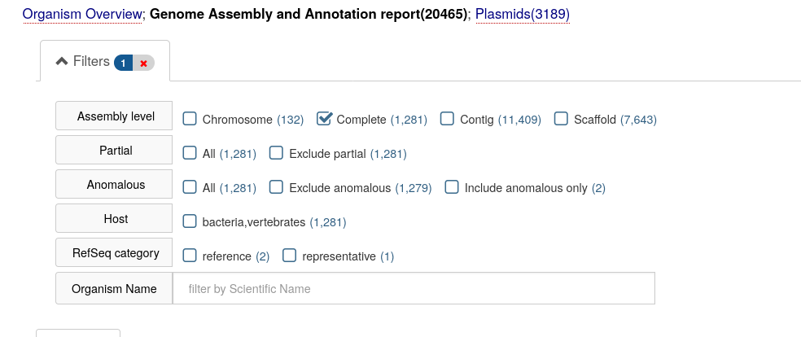

In this tutorial we begin with a new genome assembly just produced in the [Unicycler tutorial]({{site.baseurl}}/topics/assembly/tutorials/unicycler-assembly/tutorial.html). This is an assembly of *E. coli* C, which we will be comparing to assemblies of all other complete genes of this species.

> <agenda-title></agenda-title>
>
> 1. TOC
> {:toc}
>
{: .agenda}

# Finding closely related genomes

[*E. coli*](https://en.wikipedia.org/wiki/Escherichia_coli) is one of the most studied organisms. There are thousands of complete genomes (in fact, the total number of *E. coli* assemblies in Genbank is over 10,500). Here we will shows how to uploaded all (!) complete *E. coli* genomes at once.

> <comment-title>Slow steps ahead</comment-title>
> The first part of this tutorial can take a significant amount of time to find the most related genomes. If you want, you can upload this (outdated) copy of the NCBI E. Coli Genomes table to your history:
>
> 1. Import the following URL:
>
>    ```
>    https://zenodo.org/record/3382053/files/genomes_proks.txt
>    ```
>
>    
>
> 2. And skip ahead to [comparing the most related genomes](#comparing-genome-architectures).
{: .comment}


## Getting complete *E. coli* genomes into Galaxy

Our initial objective is to compare our assembly against all complete *E. coli* genomes to identify the most related ones and to find any interesting genome alterations. In order to do this we need to align our assembly against all other genomes. And in order to do that we need to first obtain all these other genomes.

[NCBI](https://www.ncbi.nlm.nih.gov/) is the resource that would store [all complete *E. coli* genomes](https://www.ncbi.nlm.nih.gov/genome/genomes/167). This list contains over 500 genomes and so uploading them by hand will likely result in carpal tunnel syndrome, which we want to prevent. Galaxy has several features that are specifically designed for uploading and managing large sets of similar types of data. The following two **Hands-on** sections show how they can be used to import all completed *E. coli* genomes into Galaxy.

> <hands-on-title>Preparing a list of all complete <i>E. coli</i> genomes</hands-on-title>
>
> 1. Import the genome list from Zenodo:
>
>    ```
>    https://zenodo.org/record/3382053/files/genomes_proks.txt
>    ```
>
{: .hands_on}


> <details-title>Getting the data directly from NCBI</details-title>
>
> For this tutorial we made this dataset available from Zenodo, but it is of course also possible to obtain the data directly from NCBI.
> Note that the format of the files on NCBI may change, which means some of the parameter settings of tools in this tutorial will need
> to be altered (e.g. column numbers) when using data directly from NCBI.
>
> Below we describe how you could obtain this data from NCBI.
>
> 1. Open [the NCBI list of of *E. coli* genomes](https://www.ncbi.nlm.nih.gov/genome/genomes/167) in a new window
>
> 2. Click on "Filters" at the top right:
>
>    
>
> 3. Select only the "Complete" genomes with the filter at the top
>
>    
>
> 3. At the top right, click "Download"
>
> 4. Upload this table to Galaxy
>
> 5. As this file is a CSV file, we need to convert it to TSV before Galaxy can use it.
>
>    
>
> 6. Rename this file to `genomes.tsv`
>
>    
>
{: .details}


> <hands-on-title>Preparing a list of all complete <i>E. coli</i> genomes</hands-on-title>
>
> 1.    columns from a table:
>
>    - *"Cut columns"*: `c8,c20`
>    - *"From"*: `genome_proks.txt`
>
> > <question-title></question-title>
> >
> > How does your data look?
> >
> > > <solution-title></solution-title>
> > >
> > > It should look like this:
> > > 1               | 2
> > > --              | --
> > > GCA_000005845.2 | ftp://ftp.ncbi.nlm.nih.gov/genomes/all/GCA/000/005/845/GCA_000005845.2_ASM584v2
> > > GCA_000008865.2 | ftp://ftp.ncbi.nlm.nih.gov/genomes/all/GCA/000/008/865/GCA_000008865.2_ASM886v2
> > > GCA_003697165.2 | ftp://ftp.ncbi.nlm.nih.gov/genomes/all/GCA/003/697/165/GCA_003697165.2_ASM369716v2
> > > GCA_003018455.1 | ftp://ftp.ncbi.nlm.nih.gov/genomes/all/GCA/003/018/455/GCA_003018455.1_ASM301845v1
> > > GCA_001650295.1 | ftp://ftp.ncbi.nlm.nih.gov/genomes/all/GCA/001/650/295/GCA_001650295.1_ASM165029v1
> > > GCA_003018035.1 | ftp://ftp.ncbi.nlm.nih.gov/genomes/all/GCA/003/018/035/GCA_003018035.1_ASM301803v1
> > > GCA_003112225.1 | ftp://ftp.ncbi.nlm.nih.gov/genomes/all/GCA/003/112/225/GCA_003112225.1_ASM311222v1
> > > GCA_001695515.1 | ftp://ftp.ncbi.nlm.nih.gov/genomes/all/GCA/001/695/515/GCA_001695515.1_ASM169551v1
> > > GCA_001721125.1 | ftp://ftp.ncbi.nlm.nih.gov/genomes/all/GCA/001/721/125/GCA_001721125.1_ASM172112v1
> > > GCA_000091005.1 | ftp://ftp.ncbi.nlm.nih.gov/genomes/all/GCA/000/091/005/GCA_000091005.1_ASM9100v1
> > > GCA_005037725.2 | ftp://ftp.ncbi.nlm.nih.gov/genomes/all/GCA/005/037/725/GCA_005037725.2_ASM503772v2
> > > GCA_005037815.2 | ftp://ftp.ncbi.nlm.nih.gov/genomes/all/GCA/005/037/815/GCA_005037815.2_ASM503781v2
> > > GCA_004358405.1 | ftp://ftp.ncbi.nlm.nih.gov/genomes/all/GCA/004/358/405/GCA_004358405.1_ASM435840v1
> > > GCA_003018575.1 | ftp://ftp.ncbi.nlm.nih.gov/genomes/all/GCA/003/018/575/GCA_003018575.1_ASM301857v1
> > >
> > {: .solution}
> {: .question}
>
>
{: .hands_on}

Now that the list is formatted as a table in a spreadsheet, it is time to upload it into Galaxy. There is a problem though: the URLs (web addresses) in the list do not actually point to sequence files that we would need to perform alignments. Instead they point to directories. For example, this URL: [GCA_000008865.1_ASM886v1](ftp://ftp.ncbi.nlm.nih.gov/genomes/all/GCA/000/008/865/GCA_000008865.1_ASM886v1) points to a directory (rather than a file) containing many files, most of which we do not need.


So to download sequence files we need to edit URLs by adding filenames to them. For example, in the case of the URL shown above we need to add `/GCA_000008865.1_ASM886v1` and `_genomic.fna.gz` to the end to get this:

```
ftp://ftp.ncbi.nlm.nih.gov/genomes/all/GCA/000/008/865/GCA_000008865.1_ASM886v1/GCA_000008865.1_ASM886v1_genomic.fna.gz
```

This can be done as a two step process where we first copy the end part of the existing URL (`/GCA_000008865.1_ASM886v1`) and then add a fixed string `_genomic.fna.gz` to the end of it. Doing this by hand is crazy and trying to do it in a spreadsheet is complicated. Fortunately, Galaxy's new rule-based uploader can help, as shown in the next **Hands-on** section:

> <hands-on-title>Data upload</hands-on-title>
>
> 1. Again **Upload**  data
>
> 2. Switch to the `Rule-based` tab on the right
>
>    > <tip-title>Using the Rule-based Uploader</tip-title>
>    > There is a detailed tutorial on using the [Rule based Uploader](../../../galaxy-data-manipulation/tutorials/upload-rules/tutorial.html) if you want to learn about the more advanced features available.
>    {: .tip}
>
>    - *"Upload data as"*: `Collection(s)`
>    - *"Load tabular data from"*: `History Dataset`
>    - *"Select dataset to load"*: output of the cut tool
>
>    > <tip-title>dataset not there?</tip-title>
>    > If the dataset doesn't appear in the select list, refresh your page.
>    {: .tip}
>
> 3. From **Column**, select `Using a Regular Expression`
>    - *"From Column"*: `B`
>    - Select `Create columns matching expression groups`
>    - *"Regular Expression"*: `.*(\/GCA.*$)`
>    - *"Number of Groups"*: `1`
>    - Click `Apply`
> 4. From **Column**, select `Concatenate Columns`
>    - *"From Column"*: `B`
>    - *"From Column"*: `C`
>    - Click `Apply`
> 6. From **Column**, select `Fixed Value`
>    - *"Value"*: `_genomic.fna.gz`
>    - Click `Apply`
> 7. From **Column**, select `Concatenate Columns`
>    - *"From Column"*: `D`
>    - *"From Column"*: `E`
>    - Click `Apply`
> 9. From **Rules** menu, select `Add / Modify Column Definitions`
>    - `Add Definition`, `List Identifier(s)`, Select Column `A`
>    - `Add Definition`, `URL`, Column `F`
>    - Click `Apply`
> 10. Set the **Type** in the bottom left to `fasta.gz`
> 11. Give the upload a name like `Complete genomes`
> 12. **Upload**
>
>
{: .hands_on}

Now we have all complete *E. coli* genomes in Galaxy's history. It is time to do a few things to our assembly.

## Preparing assembly


Before starting any analyses we need to upload the assembly produced in [Unicycler tutorial]({{site.baseurl}}/topics/assembly/tutorials/unicycler-assembly/tutorial.html) from Zenodo:

> <hands-on-title>Uploading <i>E. coli</i> assembly into Galaxy</hands-on-title>
>
> 1.   :
>   - Click **Paste/Fetch data** button (Bottom of the interface box)
>   - **Paste** `https://zenodo.org/record/1306128/files/Ecoli_C_assembly.fna` into the box.
>   - *"Type"*: `fasta`
>   - Click **Start**
{: .hands_on}

> <tip-title>Finding tools mentioned in this tutorial</tip-title>
>Galaxy instances contain hundreds of tools. As a result, it can be hard to find tools mentioned in tutorials such as this one. To help with this challenge, Galaxy has a search box at the top of the left panel. Use this box to find the tools mentioned here.
>
{: .tip}

The assembly we just uploaded has two issues that need to be addressed before proceeding with our analysis:

1. It contains two sequences: the one of *E. coli* C genome (the one we really need) and another representing phage phiX174 (a by product of Illumina sequencing where it is used as a spike-in DNA).
2. Sequences have unwieldy names like `>1 length=4576293 depth=1.00x circular=true`. We need to rename it to something more meaningful.

Let's fix these two problems.

Because phiX173 is around 5,000bp, we can remove those sequences by setting a minimum length of 10,000:

> <hands-on-title>Fixing assembly</hands-on-title>
>
> 1.  with the following parameters:
>   - *"Fasta file"*: the dataset you've just uploaded. (`https://zenodo.org/record/1306128/files/Ecoli_C_assembly.fna`).
>   - *"Minimal length"*: `10000`
>
>
> 2.  in entire line:
>    - *"File to process"*: the output of the Filter sequences by length 
>    - *"1: Replacement"*
>      - *"Find Pattern"*: `^>1.*`
>      - *"Replace with"*: `>Ecoli_C`
>
>    
>
>    > <tip-title>Regular Expressions</tip-title>
>    >
>    > The program we just entered is a so-called [Regular Expression](https://en.wikipedia.org/wiki/Regular_expression)
>    >
>    > The expression `^>1.*` contains several pieces that you need to understand. Let's write it top-to-bottom and explain:
>    >
>    > - `^` - says start looking at *the beginning* of each line
>    > - `>` - is the first character we want to match. Remember that name of the sequence in FASTA files starts with `>`
>    > - `1` - is the number present is our old name (`>1 length=4576293 depth=1.00x circular=true` to `>Ecoli_C`)
>    > - `.` - dot has a special meaning. It signifies *any* character
>    > - `*` - is a *quantifier*. From [Wikipedia](https://en.wikipedia.org/wiki/Regular_expression): "The asterisk indicates zero or more occurrences of the preceding element. For example, ab*c matches `ac`, `abc`, `abbc`, `abbbc`, and so on."
>    >
>    >So in short we are replacing `>1 length=4576293 depth=1.00x circular=true` with `>Ecoli_C`. The *Regular expression* `^>1.*` is used here to represent `>1 length=4576293 depth=1.00x circular=true`.<br>
>    >Detailed description of regular expressions is outside of the scope of this tutorial, but there are other great resources. Start with [Software Carpentry Regular Expressions tutorial](http://v4.software-carpentry.org/regexp/index.html).
>    {: .tip}
>
> > <question-title></question-title>
> >
> > 1. What is the meaning of `^` character is SED expression?
> >
> > > <solution-title></solution-title>
> > >
> > > 1. It tells SED to start matching from the beginning of the string.
> > >
> > {: .solution}
> {: .question}
>
{: .hands_on}

## Generating alignments


Now everything is loaded and ready to go. We will now align our assembly against each of the *E. coli* genomes we have uploaded into the collection. To do this we will use [LASTZ](https://lastz.github.io/lastz/)&mdash;an aligner designed for long sequences.

> <hands-on-title>Running LASTZ</hands-on-title>
> 1.  with the following parameters:
>   - *"Select TARGET sequence(s) to align against"*: `from your history`
>   -  *"Select a reference dataset"*: the "Complete genomes" collection we uploaded earlier
>   -  *"Select QUERY sequence(s)"*: our *E. coli* assembly which was prepared in the previous step.
>   - **Chaining**
>        - *"Perform chaining of HSPs with no penalties"*: `Yes`
>   - **Output**
>        - *"Specify the output format"*: `blastn`
>
{: .hands_on}

Note that because we started LASTZ on *a collection* of *E. coli* genomes, it will output alignment information as *a collection* as well. A collection is simply a way to represent large sets of similar data in a compact way within Galaxy's interface.

> <warning-title>It will take a while!</warning-title>
> Please understand that alignment is not an instantaneous process: allow several hours for these jobs to clear.
{: .warning}

## Finding closely related assemblies


### Understanding LASTZ output

LASTZ produced data in so-called `blastn` format (because we explicitly told LASTZ to output in this format, see previous step), which looks like this:

```
      1          2     3   4  5 6       7       8    9   10      11    12
-------------------------------------------------------------------------
Ecoli_C BA000007.2 66.81 232 51 6 3668174 3668397 5936 6149 3.2e-40 162.7
Ecoli_C BA000007.2 57.77 206 38 8  643802  643962 5945 6146 1.6e-18  90.6
Ecoli_C BA000007.2 67.03 185 32 6 4849373 4849528 5965 6149 2.9e-28 122.9
Ecoli_C BA000007.2 63.06 157 33 3 1874604 1874735 5991 6147 5.8e-26 115.3
```

where columns are:

1. `qseqid` - query (e.g., gene) sequence id
2. `sseqid` - subject (e.g., reference genome) sequence id
3. `pident` - percentage of identical matches
4. `length` - alignment length
5. `mismatch` - number of mismatches
6. `gapopen` - number of gap openings
7. `qstart` - start of alignment in query
8. `qend` - end of alignment in query
9. `sstart` - start of alignment in subject
10. `send` - end of alignment in subject
11. `evalue` - [expect value](https://blast.ncbi.nlm.nih.gov/Blast.cgi?CMD=Web&PAGE_TYPE=BlastDocs&DOC_TYPE=FAQ#expect)
12. `bitscore` - [bit score](https://www.ncbi.nlm.nih.gov/BLAST/tutorial/Altschul-1.html)

The alignment information produced by LASTZ is a collection. In this collection each element contains alignment data between each of the *E. coli* genomes and our assembly:

.").

## Collapsing collection

Collections are a wonderful way to organize large sets of data and parallelize data processing like we did here with LASTZ. However, at this point we need to combine all data into one dataset. Follow the steps below to accomplish this:

> <hands-on-title>Combining collection into a single dataset</hands-on-title>
> 1.  with the following parameters:
>   - *"Collection of files to collapse"*: the output of **LASTZ** (collecion input)
{: .hands_on}

This will produce one gigantic table (over 12 million lines) containing combined LASTZ output for all genomes.

## Getting taste of the alignment data

To make further analyses we need to get an idea about alignment data generated with LASTZ. To do this let's select a random subsample of the large dataset we've generated above. This is necessary because processing the entire dataset will take time and will not give us a better insight anyway. So first we will select 10,000 lines from the alignment data:

> <hands-on-title>Selecting random subset of data</hands-on-title>
> 1.    with the following parameters:
>   -  *"Randomly select"*: `10000`
>   -  *"from"*: the output from `Collapse Collection`
{: .hands_on}

Now we can visualize this dataset to discover generalities:

> <hands-on-title>Graphing alignment data</hands-on-title>
> 1. Expand random subset of alignment data generated on the previous step by clicking on it.
> 2. You will see "chart" button . Click on it.
> 3. In the central panel you will see a list of visualizations. Select **Scatter plot (NVD3)**
> 4. Click **Select data** 
> 5. Set **Values for x-axis** to `Column: 3` (alignment identity)
> 6. Set **Values for y-axis** to `Column: 4` (alignment length)
> 7. You can also click on configuration button  and specify axis labels etc.
{: .hands_on}

The relationship between the alignment identity and alignment length looks like this (remember that this is only a subsample of the data):

 versus length (bp). This graph is truncated at the top")

You can see that most alignments are short and have relatively low identity. Thus we can filter the original dataset by identity and length. Judging from this graph we can select alignment longer than 10,000 bp with identity above 90%.

> <hands-on-title>Filtering data</hands-on-title>
> 1.  data on any column using simple expressions:
>   - *"Filter"*: the full dataset, from the output of the **Collapse Collection** .
>   - *"With following condition"*: `c3 >= 90 and c4 >= 10000` (here `c` stands for *column*).
>
>  NOTE: You need to select the full dataset; not the down-sampled one, but [the one generated by the collection collapsing operation](#hands-on-combining-collection-into-a-single-dataset).
>
{: .hands_on}

## Aggregating data

Remember, our objective is to find the genomes that are most similar to ours. Given the alignment data in the table we just created we can define similarity as follows:

> Genomes that have the smallest number of alignment blocks but the highest overall alignment length are most similar to our assembly. This essentially means that they have longest uninterrupted region of high similarity to our assembly.
{: .quote}

However, to extract this information from our data we need to aggregate it. In other words, for each *E. coli* genome we need to calculate the total number of alignment blocks, their combined length, and average identity. The following section explains how to do this:

> <hands-on-title>Aggregating the data</hands-on-title>
> 1.    with the following parameters:
>     - *"Input tabular dataset"*: output of the previous `Filter` step.
>     - *"Group by fields"*: `2`. (column 1 contains name of the *E. coli* genome we mapped against)
>     - *"Sort input"*: `Yes`
>     - *"Operation to perform on each group"*:
>         - *"Type"*: `Count`
>         - *"On column"*: `Column: 2`
>     -  *"Insert operation to perform on each group"*
>       - *"Operation to perform on each group"*:
>           - *"Type"*: `Mean`
>           - *"On column"*: `Column: 3`.
>     -  *"Insert operation to perform on each group"*
>       - *"Operation to perform on each group"*:
>           - *"Type"*: `Sum`
>           - *"On column"*: `Column: 4`
{: .hands_on}

## Finding closest relatives

The dataset generated above lists each *E. coli* genome accession only once and will have aggregate information for the number of alignment blocks, mean identity, and total length. Let's graph these data:

> <hands-on-title>Graphing aggregated data</hands-on-title>
> 1. Expand the aggregated data generated on the previous step by clicking on it.
> 2. You will see "chart" button . Click on it.
> 3. In the central panel you will see a list of visualizations. Select **Scatter plot (NVD3)**
> 4. Click **Select data** 
> 5. Set **Data point labels** to `Column: 1` (Accession number of each *E. coli* genome)
> 5. Set **Values for x-axis** to `Column: 2` (# of alignment blocks)
> 6. Set **Values for y-axis** to `Column: 4` (Total alignment length)
> 7. You can also click on configuration button  and specify axis labels etc.
{: .hands_on}

The relationship between the number of alignment blocks and total alignment length looks like this:

.")

A group of three dots in the upper left corner of this scatter plot represents genomes that are most similar to our assembly: they have a SMALL number of alignment blocks but HIGH total alignment length. Mousing over these three dots (if you set **Data point labels** correctly in the previous step) will reveal their accession numbers: `LT906474.1`, `CP024090.1`, and `CP020543.1`.

> <warning-title>Things change</warning-title>
> It is possible that when you repeat these steps the set of sequences in NCBI will have changed and you will obtain different accession numbers. Keep this in mind.
{: .warning}

Let's find table entries corresponding to these:

> <hands-on-title>Extracting into about best hits</hands-on-title>
> 1.  with the following parameters:
>   - *"Select lines from"*: to the output from `Datamash`
>   - *"the pattern"*: `LT906474|CP024090|CP020543`. (Here `|` means `or`).
{: .hands_on}

This will generate a short table like this:


CP020543.1 | 11 | 99.926363636364 | 4486976
CP024090.1 | 12 | 99.911666666667 | 4540487
LT906474.1 | 8  | 99.94           | 4575200

From this it appears that `LT906474.1` is closest to our assembly because it has eight alignment blocks, the longest total alignment length (4,575,223) and highest mean identity (99.94%).

# Comparing genome architectures

Now that we know the three genomes most closely related to ours, let's take a closer look at them. First we will re-download sequence and annotation data.

## Getting sequences and annotations

> <hands-on-title>Uploading sequences and annotations</hands-on-title>
> Using the three accession listed above we will fetch necessary data from NCBI. We will use the spreadsheet we uploaded at the start to accomplish this.
>
> 1.  the *E. coli* C genome if you have not done so already:
>   - Click **Paste/Fetch data** button (Bottom of the interface box)
>   - **Paste** `https://zenodo.org/record/1306128/files/Ecoli_C_assembly.fna` into the box.
>   - *"Type"*: `fasta`
>   - Click **Start**
>
> 1.  with the following parameters:
>   - *"Select lines from"*: the `genomes.tsv` you uploaded earlier
>   - *"the pattern"*: `LT906474|CP024090|CP020543`
>
> 2.  columns from a table:
>
>    - *"Cut columns"*: `c8,c20`
>    - *"From"*: the output of the **select lines** 
>
>      It should look like:
>
>      ```
>      GCA_002079225.1	ftp://ftp.ncbi.nlm.nih.gov/genomes/all/GCA/002/079/225/GCA_002079225.1_ASM207922v1
>      GCA_002761835.1	ftp://ftp.ncbi.nlm.nih.gov/genomes/all/GCA/002/761/835/GCA_002761835.1_ASM276183v1
>      GCA_900186905.1	ftp://ftp.ncbi.nlm.nih.gov/genomes/all/GCA/900/186/905/GCA_900186905.1_49923_G01
>      ```
>
> 1. Again **Upload**  data
>
>    2. Switch to the `Rule-based` tab on the right
>
>       - *"Upload data as"*: `Collection(s)`
>       - *"Load tabular data from"*: `History Dataset`
>       - *"Select dataset to load"*: output of the cut tool
>
>       > <tip-title>dataset not there?</tip-title>
>       > If the dataset doesn't appear in the select list, refresh your page.
>       {: .tip}
>
>       > <tip-title>Take a Shortcut</tip-title>
>       > This step is quite long and potentially error prone. If you want to skip those steps, you can copy and paste this bit of text:
>       >
>       > ```json
>       > {"rules":[{"type":"add_column_regex","target_column":1,"expression":".*(\\/GCA.*$)","group_count":1},{"type":"add_column_concatenate","target_column_0":1,"target_column_1":2},{"type":"remove_columns","target_columns":[1,2]},{"type":"add_column_value","value":"_feature_table.txt.gz"},{"type":"add_column_value","value":"_genomic.fna.gz"},{"type":"add_column_concatenate","target_column_0":1,"target_column_1":2},{"type":"add_column_concatenate","target_column_0":1,"target_column_1":3},{"type":"remove_columns","target_columns":[1,2,3]},{"type":"add_column_value","value":"Genes"},{"type":"add_column_value","value":"DNA"},{"type":"add_column_regex","target_column":1,"expression":".*\\/(.*)","group_count":1},{"type":"swap_columns","target_column_0":0,"target_column_1":5},{"type":"remove_columns","target_columns":[5]},{"type":"split_columns","target_columns_0":[1,3],"target_columns_1":[2,4]}],"mapping":[{"type":"list_identifiers","columns":[0],"editing":false},{"type":"url","columns":[1]},{"type":"collection_name","columns":[2]}]}
>       > ```
>       >
>       > You can click the  next to the header **Rules** , and paste the contents there, before clicking **Apply**, checking "Add nametag for name" and then **Upload**.
>       {: .tip}
>
>    3. From **Column**, select `Using a Regular Expression`
>       - *"From Column"*: `B`
>       - Select `Create columns matching expression groups`
>       - *"Regular Expression"*: `.*(\/GCA.*$)`
>       - *"Number of Groups"*: `1`
>       - Click `Apply`
>    4. From **Column**, select `Concatenate Columns`
>       - *"From Column"*: `B`
>       - *"From Column"*: `C`
>       - Click `Apply`
>    5. From **Rules**, select `Remove Columns(s)`
>       - *"From Column"*: `B`, `C`
>       - Click `Apply`
>    6. From **Column**, select `Fixed Value`
>       - *"Value"*: `_feature_table.txt.gz`
>       - Click `Apply`
>    6. From **Column**, select `Fixed Value`
>       - *"Value"*: `_genomic.fna.gz`
>       - Click `Apply`
>    7. From **Column**, select `Concatenate Columns`
>       - *"From Column"*: `B`
>       - *"From Column"*: `C`
>       - Click `Apply`
>    7. From **Column**, select `Concatenate Columns`
>       - *"From Column"*: `B`
>       - *"From Column"*: `D`
>       - Click `Apply`
>    8. From **Rules**, select `Remove Columns(s)`
>       - *"From Column"*: `B`, `C`, `D`
>       - Click `Apply`
>    6. From **Column**, select `Fixed Value`
>       - *"Value"*: `Genes`
>       - Click `Apply`
>    6. From **Column**, select `Fixed Value`
>       - *"Value"*: `DNA`
>       - Click `Apply`
>    3. From **Column**, select `Using a Regular Expression`
>       - *"From Column"*: `B`
>       - Select `Create columns matching expression groups`
>       - *"Regular Expression"*: `.*\/(.*)`
>       - *"Number of Groups"*: `1`
>       - Click `Apply`
>    9. From **Rules** menu, select `Swap Column(s)`
>       - *"Swap Column"*: `A`
>       - *"With Column"*: `F`
>       - Click `Apply`
>    8. From **Rules**, select `Remove Columns(s)`
>       - *"From Column"*: `F`
>       - Click `Apply`
>    9. From **Rules** menu, select `Split Column(s)`
>       - *"Odd Row Column(s)"*: `B`, `D`
>       - *"Even Row Column(s)"*: `C`, `E`
>       - Click `Apply`
>    9. From **Rules** menu, select `Add / Modify Column Definitions`
>       - `Add Definition`, `List Identifier(s)`, Select Column `A`
>       - `Add Definition`, `URL`, Column `B`
>       - `Add Definition`, `Collection Name`, Column `C`
>       - Click `Apply`
>    12. Check **Add nametag for name**
>    12. **Upload**
>
> At the end of this you should have two collections: one containing genomic sequences and another containing annotations.
{: .hands_on}

## Visualizing rearrangements

Now we will perform alignments between our assembly and the three most closely related genomes to get a detailed look at any possible genome architecture changes. We will again use LASTZ:

> <hands-on-title>Aligning again</hands-on-title>
>
> 1.  with the following parameters:
>   - *"Select TARGET sequence(s) to align against"*: `from your history`
>   -  *"Select a reference dataset"*: `DNA`, the *E. coli* genomes we uploaded earlier
>   -  *"Select QUERY sequence(s)"*: `E. coli C` fasta file
>   - **Chaining**
>        - *"Perform chaining of HSPs with no penalties"*: `Yes`
>          > <tip-title>What does chaining do?</tip-title>
>          > For more information about chaining [look here](https://lastz.github.io/lastz/#ex_stages)
>          {: .tip}
>
>   - **Output**
>        - *"Specify the output format"*: `Customized general`
>        - *"Select which fields to include"*: select the following
>             - `score` alignment score
>             - `name1` name of the *target* sequence
>             - `strand1` strand for the *target* sequence
>             - `zstart1` 0-based start of alignment in *target*
>             - `end1` end of alignment in *target*
>             - `length1` length of alignment in *target*
>             - `name2` name of *query* sequence
>             - `strand2` strand for the *query* sequence
>             - `zstart2` 0-based start of alignment in *query*
>             - `end2` end of alignment in *query*
>             - `identity` alignment identity
>             - `number` alignment number
>        - *"Create a dotplot representation of alignments?"*: `Yes`
>
> 2. Rename the `LASTZ on collection... mapped reads` something more memorable like `LASTZ Alignments`
>
>    
>
{: .hands_on}

Because we chose to produce Dot Plots as well, LASTZ will generate two collections: one containing alignment data and the other containing DotPlots in PNG format:

 is indicated above each dot plot. Query (Y-axis) is our assembly. Red circle indicates a region deleted in our assembly.")

A quick conclusion that can be drawn here is that there is a large inversion in CP020543 and deletion in our assembly.

> <details-title>Interpreting Dot Plots</details-title>
> If you are not sure how to interpret Dot Plots here is a great explanation by [Michael Schatz](http://schatz-lab.org/):
>
> 
{: .details}

For a moment let's leave LASTZ result and create a browser that would allows us to display our results.

## Producing a Genome Browser for this experiment

The dot plots we've produced above are great, but they are static. It would be wonderful to load these data into a genome browser where one can zoom in and out as well as add tracks such as those containing genes. To create a browser we need a genome and a set of tracks. Tracks are features such as genes or SNPs with start and end positions corresponding to a coordinate system provided by the genome. Thus the first thing to do is to create a *genome* that would represent our experiment. We can create such a genome by simply combining the three genomes of closely related strains with our assembly in a single dataset&mdash;a hybrid genome.

### Collecting the genomes

The first step will be collapsing the collection containing the three genomes into a single file:

> <hands-on-title>Creating a single FASTA dataset with all genomes</hands-on-title>
>
> 1. 
>
>    -  *"Collection of files to collapse"* the three genomes (collection) named `DNA`
>
> 2. Convert the datatype of this output to uncompress it
>
>    
>
> 3.  tail-to-head (cat):
>    - *"Datasets to concatenate"*: `Collapse collection ... uncompressed`, the output from the uncompression step.
>    - Click **Insert Dataset** button
>        - *"Select"*: the `E. coli C` file from the start of the history
>
> 4. Rename the output to `DNA (E. coli C + Relatives)`
>
>    
{: .hands_on}

The resulting dataset contains four sequences: three genomes plus our assembly.

### Preparing the alignments

Above we computed alignments using LASTZ. Because we ran LASTZ on a collection containing genomic sequences, LASTZ produced a collection as well (actually two collections: one containing alignments an the other with dot plots). To display alignments in the browser we need to do several things:

1. Fix unwanted `%` signs in LASTZ output
2. Create names for alignment blocks
3. Convert LASTZ output into [BED](https://genome.ucsc.edu/FAQ/FAQformat.html#format1) format
4. Create a single BED track containing alignments against all four genomes.

To begin, let's look at the LASTZ output:

1        | 2            | 3 | 4      | 5      | 6      | 7         | 8 | 9      | 10     | 11            | 12     | 13
-------- | ----------   | - | ------ | ------ | ------ | -------   | - | ------ | ------ | -------       | ------ | --
10141727 | `CP020543.1` | + | 48     | 106157 | 106109 | `Ecoli_C` | + | 0      | 106109 | 106107/106109 | 100.0% | 1
    5465 | `CP020543.1` | + | 121267 | 121367 | 100    | `Ecoli_C` | + | 109317 | 109418 | 76/100        | 76.0%  | 2
    4870 | `CP020543.1` | + | 159368 | 159512 | 144    | `Ecoli_C` | + | 128706 | 128828 | 95/115        | 82.6%  | 3

One immediate problem is `%` character in column 12 (alignment identity). We need to remove it as we will use this for the score column of the BED file, and that must be a normal number and not a percentage.

Column 13 of the fields chosen by us for [LASTZ run](#hands-on-aligning-again) is `number`. This is an incrementing number given by LASTZ to every alignment block so it can be uniquely identified. The problem is that by running LASTZ on a collection of three genomes it generated a number for each output independently starting with `1` each time. So these alignments identified are unique within each individual run but are redundant for multiple runs. We can fix that by pre-pending each alignment identified (column 12) with the name of the target sequence (column 2). This would create alignments that are truly unique. For example, in the case of the LASTZ output shown above alignment identifier `1` will become `CP020543.11`, `2` will become `CP020543.12` and so on.

> <comment-title>BED format</comment-title>
> Our goal is to convert this into a format that will be acceptable to the genome browser. One of such formats is [BED](https://genome.ucsc.edu/FAQ/FAQformat.html#format1). In one of its simplest forms (there is one even simpler - 3 column BED) it has six columns:
>
> 1. Chromosome ID
> 2. Start
> 3. End
> 4. Name of the feature
> 5. Score (must be between 0 and 1000)
> 6. Strand (`+`, `-`, or `.` for no strand data).
{: .comment}

> <hands-on-title>Convert LASTZ output to BED</hands-on-title>
>
> 1.  in a specific column:
>    -  *"File to process"*: output of LASTZ (`LASTZ Alignments`)
>    - *"in column"*: `Column 12`
>    - *"Find pattern"*: `%`
>    - *"Replace with"*: leave empty
>
> 2.  with the following parameters:
>    -  *"Select data"*: the output of the previous step, `Replace Text on collection ...`
>    - *"Merge column"*: `Column: 2` (this is the Target sequence name)
>    - *"with column"*: `Column: 13` (this is the alignment block created by LASTZ)
>
>    > <details-title>Output information</details-title>
>    > The tool added a new column (Column 14) containing a merge between the target name and alignment id. Now we can differentiate between alignment blocks that exist between, for example, `CP020543.1` and `LT906474.1` because they will have accessions embedded within alignment block IDs. For example, the first alignment between `CP020543.1` and our assembly `Ecoli_C` will have alignment block id `CP020543.11`, while the 225th alignment between `LT906474.1` and `Ecoli_C` will have ID `LT906474.1225`. Because of this we can collapse the entire collection of alignments into a single dataset:
>    {: .details}
>
> 3.  with the following parameters:
>    -  *"Collection of files to collapse"*: the output of the previous step, `Merge Columns on collection...`
>
>    This will produce a single dataset combining all alignment info. We can tell which alignments are between which genomes because we have set identifiers such as `CP020543.13`.
>
> 4. We will reuse this file later so let's rename it `Unprocessed Alignments`
>
>    
>
> 4.  columns from a table:
>
>    - *"Cut columns"*: `c2,c4,c5,c14,c12,c8`
>    -  *"From"*: the output of the previous step (`Unprocessed alignments`)
>
>    > <details-title>Converting to BED</details-title>
>    > Let's look again at the data we generated in the last step:
>    >
>    > 1        | 2          | 4 | 4      | 5      | 6      | 7       | 8 | 9      | 10     | 11            | 12    | 13 | 14
>    > -------- | ---------- | - | ------ | ------ | ------ | ------- | - | ------ | ------ | --            | ----- | -- | -----------
>    > 10141727 | CP020543.1 | + | 48     | 106157 | 106109 | Ecoli_C | + | 0      | 106109 | 106107/106109 | 100.0 | 1  | CP020543.11
>    >     5465 | CP020543.1 | + | 121267 | 121367 | 100    | Ecoli_C | + | 109317 | 109418 | 76/100        | 76.0  | 2  | CP020543.12
>    >     4870 | CP020543.1 | + | 159368 | 159512 | 144    | Ecoli_C | + | 128706 | 128828 | 95/115        | 82.6  | 3  | CP020543.13
>    >
>    > Alignments are regions of high similarity between two sequences. Therefore each alignment block has two sets of coordinates associated with it: start/end in the first sequences (target) and start/end in the second sequence (query). But BED only has one set of coordinates. Thus we can create two BEDs: one using coordinates from the target and the other one from query. The first file will depict alignment data from the standpoint of target sequences `CP020543.1`, `CP024090.1`, `LT906474.1` and the second from the standpoint of query - our own assembly [we called](#hands-on-fixing-assembly) `Ecoli_C`.
>    > In the first BED, column 1 will contain names of targets (`CP020543.1`, `CP024090.1`, and `LT906474.1`).
>    > In the second BED, column 1 will contain name of our assembly: `Ecoli_C`.
>    >
>    > To create the first BED we will cut six columns from the dataset produced at the last step. Specifically, to produce the target BED we will cut columns 2, 4, 5, 14, 12, and 8. To produce the query BED columns 7, 9, 10, 14, 12, 8 will be cut.
>    {: .details}
>
>    > <warning-title>There are multiple <b>CUT</b> tools!</warning-title>
>    > The Hands-On box below uses **Cut** tool. Beware that some Galaxy instances contain multiple **Cut** tools. The one that is used below is called **Cut columns from a table** while the other one, which we will NOT use is called **Cut columns from a table (cut)**. It is a small difference, but the tools are different.
>    {: .warning}
>
>    This will produce a dataset looking like this:
>
>    1          | 2      | 3      | 4           | 5     | 6
>    ---------- | ------ | ------ | ----------- | ----- | -
>    CP020543.1 | 48     | 106157 | CP020543.11 | 100.0 | +
>    CP020543.1 | 121267 | 121367 | CP020543.12 | 76.0  | +
>    CP020543.1 | 159368 | 159512 | CP020543.13 | 82.6  | +
>
>    > <tip-title>Not exactly the same?</tip-title>
>    > Depending on the steps and other choices, the genomes may be in a different order here. This is unimportant, as all of the same alignments are contained in the file, just the ordering is different. As long as these columns look correct (start/end in column 2/3 are reasonable, a number between 0-100 in column 5, and a + or - in column 6) then it is OK.
>    {: .tip}
>
> 5. Rename this "Target Alignments"
>
>    
>
> 6.  with the following parameters
>    - *"Cut columns"*: `c7,c9,c10,c14,c12,c8` (look at the data shown above and the definition of BED to see why we make these choices.)
>    - *"From"*: `Unprocessed alignments`, the output of **collection collapse**
>
> 5. Rename this "Query Alignments"
>
>    
>
> 6. 
>    - *"Concatenate Dataset"*: `Query Alignments`
>    - Click "Insert Dataset" button
>    - *"1: Dataset"*: `Target Alignments`
>
> 7. Change the datatype of the output to BED and rename the output "Target & Query Alignments"
>
>    
>
>    
>
{: .hands_on}

This will produce a dataset looking like this:

1       | 2      | 3      | 4           | 5     | 6
------- | ------ | ------ | ----------- | ----- | -
Ecoli_C | 0      | 106109 | CP020543.11 | 100.0 | +
Ecoli_C | 109317 | 109418 | CP020543.12 | 76.0  | +
Ecoli_C | 128706 | 128828 | CP020543.13 | 82.6  | +


### Extracting Genes

Earlier we [downloaded](#hands-on-uploading-sequences-and-annotations) gene annotations for the three genomes most closely related to our assembly. The data was downloaded as a collection containing annotations for `CP020543.1`, `CP024090.1`, and `LT906474.1`. The annotation data contains multiple columns described by NCBI as follows (you can look at the actual data by finding the annotation collection from above (called `Genes`)):

> Tab-delimited text file reporting locations and attributes for a subset of
> annotated features. Included feature types are: gene, CDS, RNA (all types),
> operon, C/V/N/S_region, and V/D/J_segment.
>
> The file is tab delimited (including a #header) with the following columns:
>
> Column | Definition
> ---    | ---
> 1      | feature: INSDC feature type
> 2      | class: Gene features are subdivided into classes according to the gene biotype computed based on the set of child features for that gene. See the description of the gene_biotype attribute in the GFF3 documentation for more details: ftp://ftp.ncbi.nlm.nih.gov/genomes/README_GFF3.txt ncRNA features are subdivided according to the ncRNA_class. CDS features are subdivided into with_protein and without_protein, depending on whether the CDS feature has a protein accession assigned or not. CDS features marked as without_protein include CDS features for C regions and V/D/J segments of immunoglobulin and similar genes that undergo genomic rearrangement, and pseudogenes.
> 3      | assembly: assembly accession.version
> 4      | assembly_unit: name of the assembly unit, such as "Primary Assembly", "ALT_REF_LOCI_1", or "non-nuclear"
> 5      | seq_type: sequence type, computed from the "Sequence-Role" and "Assigned-Molecule-Location/Type" in the `*_assembly_report.txt` file. The value is computed as: if an assembled-molecule, then reports the location/type value. e.g. chromosome, mitochondrion, or plasmid if an unlocalized-scaffold, then report "unlocalized scaffold on <type>". e.g. unlocalized scaffold on chromosome else the role, e.g. alternate scaffold, fix patch, or novel patch
> 6      | chromosome
> 7      | genomic_accession
> 8      | start: feature start coordinate (base-1). start is always less than end
> 9      | end: feature end coordinate (base-1)
> 10     | strand
> 11     | product_accession: accession.version of the product referenced by this feature, if exists
> 12     | non-redundant_refseq: for bacteria and archaea assemblies, the non-redundant `WP_` protein accession corresponding to the CDS feature. May be the same as column 11, for RefSeq genomes annotated directly with `WP_` RefSeq proteins, or may be different, for genomes annotated with genome-specific protein accessions (e.g. `NP_` or `YP_` RefSeq proteins) that reference a `WP_` RefSeq accession.
> 13     | related_accession: for eukaryotic RefSeq annotations, the RefSeq protein accession corresponding to the transcript feature, or the RefSeq transcript accession corresponding to the protein feature.
> 14     | name: For genes, this is the gene description or full name. For RNA, CDS, and some other features, this is the product name.
> 15     | symbol: gene symbol
> 16     | GeneID: NCBI GeneID, for those RefSeq genomes included in NCBI's Gene resource
> 17     | locus_tag
> 18     | feature_interval_length: sum of the lengths of all intervals for the feature (i.e. the length without introns for a joined feature)
> 19     | product_length: length of the product corresponding to the accession.version in column 11. Protein product lengths are in amino acid units, and do not include the stop codon which is included in column 18. Additionally, product_length may differ from feature_interval_length if the product contains sequence differences vs. the genome, as found for some RefSeq transcript and protein products based on mRNA sequences and also for INSDC proteins that are submitted to correct genome discrepancies.
> 20     | attributes: semi-colon delimited list of a controlled set of qualifiers. The list currently includes: partial, pseudo, pseudogene, ribosomal_slippage, trans_splicing, anticodon=NNN (for tRNAs), old_locus_tag=XXX
>
> *from [ftp.ncbi.nlm.nih.gov/genomes/genbank/README.txt](ftp://ftp.ncbi.nlm.nih.gov/genomes/genbank/README.txt)*
{: .quote}


Our objective is to convert these data into BED. In this analysis we want to initially concentrate on protein coding regions. To do this let's select all lines from the annotation datasets that contain the term `CDS`, then
we will produce a collection with three datasets just like the original `Genes` collection but containing only CDS data. Next we need to cut out only those columns that need to be included in the BED format. There is one problem with this. We are trying to convert these data into [6 column BED](#comment-bed-format). In this format the fifth column (score) must have a value between 0 and 1000. To satisfy this requirement we will create a dummy column that will always have a value of `0`.
Finally we can cut necessary columns from these datasets. These columns are 8 (start), 9 (end), 15 (gene symbol), 21 (dummy column we just created), and c10 (strand), and then we can add the genome name.

> <hands-on-title>Extract CDSs from annotation datasets</hands-on-title>
> 1.  with the following parameters:
>    -  *"Select lines from"*: the collection containing annotations, `Genes`
>    - *"the pattern"*: `^CDS`
>
>    This is because we want to retain all lines that begin (`^`) with `CDS`.
>
> 2.    with the following parameters:
>    - *"Add this value"*: `0`
>    -  *"to Dataset"*: the collection produced by the previous step (`Select on collection...`)
>
>    This will be used for the "score" field of the BED file since we do not have a proper "score"
>
> 3.  with the following parameters:
>
>    We will produce two BED files, one using the product name (e.g. "chromosomal replication initiator protein DnaA") and one using the symbol (e.g. "thrA"). The product name is much more interesting to see in visualisations, but the symbol is more often used in other analyses and we will use that file later. We will start with the product name:
>
>    - *"Cut columns"*: `c8,c9,c14,c21,c10`
>    -  *"From"* the collection produced at the previous step (`Add column on collection...`)
>
>    This will produce a collection with each element containing data like this:
>
>    1    | 2    | 3                                              | 4 | 5
>    ---- | ---- | ---------------------------------------------- | - | -
>      49 | 1452 | chromosomal replication initiator protein DnaA | 0 | +
>    1457 | 2557 | DNA polymerase III subunit beta                | 0 | +
>    2557 | 3630 | DNA replication and repair protein RecF        | 0 | +
>
>    As we mentioned above these datasets lack genome IDs such as `CP020543.1`. However, the individual elements in the collection we've created already have genome IDs. We will leverage this when collapsing this collection into a single dataset:
>
> 4.    with the following parameters:
>   - *"Collection of files to collapse"*: the output of the previous step (`Cut on collection...`)
>   - *"Prepend File name"*: `Yes`
>   - *"Where to add dataset name"*: `Same line and each line in dataset`
>
> 5.  in a specific column
>
>    Many bed parsers do not like whitespace in the `Name` column, so we will replace that
>
>    -  *"File to process"*: output of the previous **Collapse Collection**  step
>    - *"in column"*: `Column 4`
>    - *"Find pattern"*: `[^A-Za-z0-9_-]` (any character that isn't a number or letter or underscore or minus)
>    - *"Replace with"*: `_`
>
> 6. Change the datatype of the collection to `bed` and rename it to `Genes (E. coli Relatives)`
>
>    
>
>    
>
>    > <question-title></question-title>
>    > How does your output look?
>    > > <solution-title></solution-title>
>    > >
>    > > The resulting dataset should look like this:
>    > >
>    > > 1          | 2    | 3     | 4                                              | 5 | 6
>    > > ---------- | ---- | ----- | ---------------------------------------------- | - | -
>    > > CP020543.1 | 49   | 1452  | chromosomal_replication_initiator_protein_DnaA | 0 | +
>    > > CP020543.1 | 1457 | 2557  | DNA_polymerase_III_subunit_beta                | 0 | +
>    > > CP020543.1 | 2557 | 3630  | DNA_replication_and_repair_protein_RecF        | 0 | +
>    > >
>    > > You can see that the genome ID is now appended at the beginning and this dataset looks like a legitimate BED that can be visualized.
>    > {: .solution}
>    {: .question}
>
> For the BED file with the symbol:
>
> 1.  with the following parameters:
>
>    We will produce two BED files, one using the product name (e.g. "chromosomal replication initiator protein DnaA") and one using the symbol (e.g. "thrA"). The product name is much more interesting to see in visualisations, but the symbol is more often used in other analyses and we will use that file later. We will start with the product name:
>
>    - *"Cut columns"*: `c8,c9,c15,c21,c10`
>    -  *"From"* the collection produced at the previous step (`Add column on collection...`)
>
>    This will produce a collection with each element containing data like this:
>
>    1    | 2    | 3    | 4 | 5
>    ---- | ---- | ---  | - | -
>      49 | 1452 | dnaA | 0 | +
>    1457 | 2557 |      | 0 | +
>    2557 | 3630 |      | 0 | +
>
> 2.  with the following parameters:
>   - *"Collection of files to collapse"*: the output of the previous step (`Cut on collection...`)
>   - *"Append File name"*: `Yes`
>   - *"Where to add dataset name"*: `Same line and each line in dataset`
>
> 3. Change the datatype of the collection to `bed` and rename it to `Genes (E. coli Relatives) with Symbol Name`
>
>    
>
>    
>
{: .hands_on}

### Extracting Gap Regions

It can be useful to have the complement of the aligned regions, to know which regions are unique.

.")

> <hands-on-title>Creating a genome file</hands-on-title>
>
> 1. :
>    -  *"Compute length for these sequences"*: `DNA (E. coli + Relatives)`, the FASTA dataset we generated from **Collapse Collection** 
>    - *"Strip fasta description from header"*: `Yes`
>
> 2.  data in ascending or descending order:
>    -  *"Sort Dataset"*: the output of the previous step (`Compute sequence length on ...`)
>    - *"on column"*: `Column: 1`
>    - *"with flavor"*: `Alphabetical sort`
>    - *"everything in"*: `Ascending order`
>
>    > <question-title></question-title>
>    > How does the output look?
>    > > <solution-title></solution-title>
>    > >
>    > > This will generate a dataset that looks like this:
>    > >
>    > > 1          | 2
>    > > ---------- | -------
>    > > CP020543.1 | 4617024
>    > > CP024090.1 | 4592887
>    > > Ecoli_C    | 4576293
>    > > LT906474.1 | 4625968
>    > {: .solution}
>    {: .question}
>
> 3.  with the following parameters
>    -   *"Sort the following BED file"*: `Target & Query Alignments`
>    -  *"Sort by"* on its default setting (`chromosome, then by start position (asc)`)
>
> 4.  with the following parameters:
>    - *"BED/VCF/GFF file"*: output of the **SortBED**  in the previous step
>    - *"Genome file"*: `Genome file from your history`
>        - *"Genome file"*: sorted genome file we've generated two steps age, `Sort on ...`
>
> 6.   data on any column using simple expressions
>    - *"Filter"*: dataset from the last step (`Complement of SortBed on ...`)
>    - *"With following condition"*: `c3-c2>=10000`
>
>    Note: Here we are computing the length (difference between end (column 3) and start (column 2) and making sure it is above 10,000).
>
>    > <question-title></question-title>
>    > How does your output look?
>    > > <solution-title></solution-title>
>    > >
>    > > The resulting dataset should look like this:
>    > >
>    > > 1          | 2       | 3
>    > > ---------- | ------- | -------
>    > > CP020543.1 | 1668702 | 1697834
>    > > CP020543.1 | 1700832 | 1742068
>    > > CP020543.1 | 3253711 | 3288956
>    > > CP020543.1 | 3289091 | 3304937
>    > > CP024090.1 | 3233375 | 3283074
>    > > LT906474.1 | 3252785 | 3288031
>    > > LT906474.1 | 3288166 | 3304009
>    > {: .solution}
>    {: .question}
{: .hands_on}


You will notice that all three genomes have a region starting past 3,200,000 and only `CP020543.1` has another region starting at 1,668,702. However, this region reflects some unique feature of `CP020543.1` rather than that of our assembly. This is why we will concentrate on the *common* region which is deleted in our genome, but is present in the three closely related *E. coli* strains:

> <hands-on-title>Restricting list of deleted regions to the <i>common</i> deletion</hands-on-title>
>
> 1.  with the following parameters:
>  - *"Filter"*: dataset from the last step (`Filter on data...`)
>  - *"With following condition"*: `c2 > 2000000`.
>
>    > <question-title></question-title>
>    > How does your output look?
>    > > <solution-title></solution-title>
>    > >
>    > > The new set of regions will look like this:
>    > >
>    > > 1          | 2       | 3
>    > > ---------- | ------- | -------
>    > > CP020543.1 | 3253711 | 3288956
>    > > CP020543.1 | 3289091 | 3304937
>    > > CP024090.1 | 3233375 | 3283074
>    > > LT906474.1 | 3252785 | 3288031
>    > > LT906474.1 | 3288166 | 3304009
>    > {: .solution}
>    {: .question}
>
> 2. Rename this dataset `Gaps`
>
>    
{: .hands_on}


## Visualising the Genome

### JBrowse

JBrowse is an interactive genome browser, which has been integrated into Galaxy as a workflow-compatible tool that you can use to summarise all of the datasets we've created thusfar:

> <hands-on-title>View genomes</hands-on-title>
> 1.  genome browser:
>    - *"Reference genome to display"*: `Use a genome from history`
>        - *"Select the reference genome"*: `DNA (E. coli C + Relatives)`
>    - *"Genetic code"*: `11. The Bacterial, Archael and Plant Plastid Code`
>    -  Insert Track Group
>        -  Insert Annotation Track
>            - *"Track Type"*: `GFF/GFF3/BED Features`
>            -  *"GFF/GFF3/BED Track Data"*: `Genes (E. coli Relatives)` from **Collapse Collection** 
>            - *"JBrowse Track Type"*: `Canvas Features`
>        -  Insert Annotation Track
>            - *"Track Type"*: `GFF/GFF3/BED Features`
>            -  *"GFF/GFF3/BED Track Data"*: `Target & Query Alignments`
>            - *"JBrowse Track Type"*: `Canvas Features`
>            - *"JBrowse Feature Score Scaling & Colouring Options"*
>                - *"Color Score Algorithm"*: `Based on score`
>                - *"How should minimum and maximum values be determined for the scores of the features"*: `Manually Specify`
>                - *"Minimum expected score"*: `0`
>                - *"Maximum expected score"*: `100`
>        -  Insert Annotation Track
>            - *"Track Type"*: `GFF/GFF3/BED Features`
>            -  *"GFF/GFF3/BED Track Data"*: `Gaps`
>
{: .hands_on}

We have embedded a copy of the resulting JBrowse here, if something went wrong during one of the steps you can always just check this output:




Let's start by looking at the gaps in our alignments. The deletion from our assembly is easy to see. It looks like a gap in alignments because target genomes are longer than our assembly by the amount equal to the length of the deletion. Clicking on the following links to jump to the right locations in the genome browser above:

DNA%2C45ccd03761795e5db829b6ab104c6a5a_0%2C0b4cc6e1931ece5bd0f487148c40ba37_0%2C36c31c84288257f526dbf55dc63fac9e_0

<ul>
  <li></li>
  <li></li>
  <li></li>
</ul>

Close ups of deleted region (this region is deleted from our assembly and looks like a gap when our assembly is aligned to genomic sequences shown here). In CP0205543 and LT906474 the continuity of the region is interrupted by a small aligned region that has relatively low identity (~72%). This is a spurious alignment and can be ignored.

### Circos

Alternatively to JBrowse, we can use Circos to create a nice image of the alignments:

> <hands-on-title>Circos</hands-on-title>
>
> 1.  with the following parameters:
>   - *"Select TARGET sequence(s) to align against"*: `from your history`
>   -  *"Select a reference dataset"*: `DNA`, the *E. coli* genomes we uploaded earlier
>   -  *"Select QUERY sequence(s)"*: `E. coli C` fasta file
>   - **Chaining**
>        - *"Perform chaining of HSPs with no penalties"*: `Yes`
>   - **Output**
>        - *"Specify the output format"*: `MAF`
>
> 1.  with the following parameters:
>   - *"Collection of files to collapse"*: the MAF output of **LASTZ** (collecion input)
>
> 2.  reformats alignment files to prepare for Circos:
>    - *"Alignment file"*: the output of the **Collapse Collection**  step
>
> 2.  reformats interval files for Circos' use:
>    - *"BED File"*: `Genes (E. coli Relatives)`
>
> 3.  genome browser:
>
>    - In the section *"Karyoytype"*
>        - *"Reference genome source"*: `FASTA File from History`
>            - *"Source FASTA sequence"*: `DNA (E. coli + Relatives)`
>    - In the section *"Ideogram"*
>        - *"Limit/Filter Chromosomes"*: `Ecoli_C;LT906474.1;CP020543.1;CP024090.1` (This specifies the precise ordering in which we wish to see our genomes)
>        - *"Reverse these Chromosomes"*: `Ecoli_C` (It is not readily apparent from the tables or the Genome browser, but the sequence of the E. coli C genome we have is backwards relative to the others)
>        - In the section *"Labels"*
>            - *"Radius"*: `0.125`
>            - *"Font size"*: `48`
>        - *"Spacing Between Ideograms (in chromosome units)"*: `0.1`
>    - In the section *"2D Data Tracks"*
>        -  Insert 2D Data Plot
>            - *"Outside Radius"*: `0.99`
>            - *"Inside Radius"*: `0.94`
>            - *"Plot Type"*: `Tiles`
>            - *"Tile Data Source"*: the output of the **Circos: Interval to Tiles**  above
>            - In the section *"Plot Format Specific Options"*
>                - *"Fill Colour"*: select a nice colour like a middle blue 
>                - *"Stroke Thickness"*: `0`
>            - *"Orient Inwards"*: `Yes`
>    - In the section *"Link Tracks"*
>        -  Insert Link Data
>            - *"Inside Radius"*: `0.93`
>            - *"Link Data Source"*: the output of the **Circos: Alignments to links**  above
>            - *"Link Type"*: `Ribbon`
>            - *"Link Colour"*: pick another nice colour you like, it could be a green 
>            - *"Link Color Transparency"*: `0.3`
>    - In the section *"Ticks"*
>        - *"Show Ticks"*: `Yes`
>            -  Insert Tick Group
>                - *"Tick Spacing"*: `0.05`
>                - *"Tick Size"*: `5.0`
>                - *"Color"*: `grey` 
>            -  Insert Tick Group
>                - *"Tick Spacing"*: `0.5`
>                - *"Tick Size"*: `10.0`
>                - *"Color"*: `black` 
>                - *"Show Tick Labels"*: `Yes`
>                    - *"Label Format"*: `Float (one decmial)`
>
{: .hands_on}

This should produce a lovely Circos plot of your data:


## Extracting genes programmatically

Above we've been able to look at genes that appear to be deleted in our assembly. But what we really need is to create a list that can be interrogated further. For example, which of these genes are essential? We can easily create such a list by overlapping coordinates of genes with coordinates of our deletion. But to do this we first need to create a set of coordinates corresponding to the deletion. We could do this by inspecting the genome browser, or we can do it automatically by intersecting the gap regions with the list of genes:

.")

> <hands-on-title>Finding genes deleted in our assembly</hands-on-title>
>
> 1.  with the following parameters:
>  - *"File A to intersect with B"*: `Gaps`
>  - *"File(s) B to intersect with A"*: `Genes (E. coli Relatives) with Symbol Name`
>  - *"What should be written to the output file?"*: `Write the original A and B entries plus the number of base pairs of overlap between the two features. Only A features with overlap are reported. Restricted by the fraction- and reciprocal option (-wo)`
{: .hands_on}

As a result we will get a list of all genes that overlap with the positions of the deletion. Because of the parameters we have selected, the tool joins rows from the two datasets if their coordinates overlap:

1          | 2       | 3       | 4          | 5       | 6       | 7    | 8 | 9 | 10
---        | ---     | ---     | ---        | ---     | ---     | ---  | - | - | ---
CP020543.1 | 3253711 | 3288956 | CP020543.1 | 3253690 | 3253887 |      | 0 | - | 176
CP020543.1 | 3253711 | 3288956 | CP020543.1 | 3254070 | 3256175 |      | 0 | - | 2105
CP020543.1 | 3253711 | 3288956 | CP020543.1 | 3256356 | 3256769 |      | 0 | - | 413
CP020543.1 | 3253711 | 3288956 | CP020543.1 | 3256772 | 3257518 |      | 0 | - | 746
CP020543.1 | 3253711 | 3288956 | CP020543.1 | 3257518 | 3258375 |      | 0 | - | 857
CP020543.1 | 3253711 | 3288956 | CP020543.1 | 3258389 | 3259999 | entE | 0 | - | 1610

## Are any of these genes essential?

Goodall et al. have recently published a list of essential genes for *E. coli* K-12 (). We can use their data to answer this question. This paper contains a supplementary file in Excel format listing genes and whether they are essential or not. We have converted this to a <kbd>tab</kbd> delimited file for you, but you could do this in any spreadsheet application:

> <hands-on-title>Import data</hands-on-title>
>
> 1. Import the table:
>
>    ```
>    https://zenodo.org/record/3382053/files/inline-supplementary-material-7.tsv
>    ```
>
>    
>
{: .hands_on}

This dataset will look like this:

Gene | Insertion Index Score | Log Likelihood Ratio | Essential | Non-essential | Unclear
---- | -----------           | -----------          | -         | -             | -
thrL | 0.242424242           | 54.62640955          | 0         | 1             | 0
thrA | 0.149817296           | 32.64262069          | 0         | 1             | 0
thrB | 0.177920686           | 39.389847            | 0         | 1             | 0

The two truly important columns here are 1 (gene name) and 4 (is gene essential?). Let's join the results of the intersection with this list:

> <hands-on-title>Are there essential genes?</hands-on-title>
>
> 1.  side by side on a specified field:
>   - *"Join"*: the results of the [intersect operation](#hands-on-finding-genes-deleted-in-our-assembly)(`Intersect intervals on data...`)
>   - *"using column"*: `Column: 7` (because it contains gene names. If it is not a drop down enter `7`.)
>   - *"with"*: the newly uploaded dataset with essential gene data
>   - *"and column"*: `Column: 1` (as in this dataset the first column contains gene names)
{: .hands_on}

Once the tool is finished we will find that every gene found in the gap regions is non-essential so our version of *E. coli* C is safe!

Chrom      | Gap Start | Gap End | Chrom      | Start   | End     | Name | Score | Strand | Overlap | Gene | Insertion Index Score | Log Likelihood Ratio | Essential | Non-essential | Unclear
CP020543.1 | 3253711   | 3288956 | CP020543.1 | 3258389 | 3259999 | entE | 0     | -      | 1610    | entE | 0.105524519           | 21.7755231717594     | 0         | 1             | 0
CP020543.1 | 3253711   | 3288956 | CP020543.1 | 3268031 | 3271912 | entF | 0     | -      | 3881    | entF | 0.121329212           | 25.6956722811455     | 0         | 1             | 0
CP020543.1 | 3289091   | 3304937 | CP020543.1 | 3303016 | 3305253 | nfrB | 0     | +      | 1921    | nfrB | 0.124218052           | 26.4064112702847     | 0         | 1             | 0
CP024090.1 | 3233375   | 3283074 | CP024090.1 | 3238053 | 3239663 | entE | 0     | -      | 1610    | entE | 0.105524519           | 21.7755231717594     | 0         | 1             | 0
CP024090.1 | 3233375   | 3283074 | CP024090.1 | 3247695 | 3251576 | entF | 0     | -      | 3881    | entF | 0.121329212           | 25.6956722811455     | 0         | 1             | 0
CP024090.1 | 3233375   | 3283074 | CP024090.1 | 3282681 | 3284918 | nfrB | 0     | +      | 393     | nfrB | 0.124218052           | 26.4064112702847     | 0         | 1             | 0
LT906474.1 | 3252785   | 3288031 | LT906474.1 | 3252764 | 3252961 | ybdD | 0     | -      | 176     | ybdD | 0.045454545           | 5.96222628062725     | 0         | 1             | 0
LT906474.1 | 3252785   | 3288031 | LT906474.1 | 3253144 | 3255249 | cstA | 0     | -      | 2105    | cstA | 0.126305793           | 26.9190653824143     | 0         | 1             | 0
LT906474.1 | 3252785   | 3288031 | LT906474.1 | 3255430 | 3255843 | entH | 0     | -      | 413     | entH | 0.120772947           | 25.5586264884819     | 0         | 1             | 0
LT906474.1 | 3252785   | 3288031 | LT906474.1 | 3255846 | 3256592 | entA | 0     | -      | 746     | entA | 0.104417671           | 21.4987263249306     | 0         | 1             | 0
LT906474.1 | 3252785   | 3288031 | LT906474.1 | 3256592 | 3257449 | entB | 0     | -      | 857     | entB | 0.088578089           | 17.4977059908147     | 0         | 1             | 0
LT906474.1 | 3252785   | 3288031 | LT906474.1 | 3257463 | 3259073 | entE | 0     | -      | 1610    | entE | 0.105524519           | 21.7755231717594     | 0         | 1             | 0
LT906474.1 | 3252785   | 3288031 | LT906474.1 | 3259083 | 3260258 | entC | 0     | -      | 1175    | entC | 0.102891156           | 21.1164388080323     | 0         | 1             | 0
LT906474.1 | 3252785   | 3288031 | LT906474.1 | 3260633 | 3261589 | fepB | 0     | +      | 956     | fepB | 0.056426332           | 9.03336948257186     | 0         | 1             | 0
LT906474.1 | 3252785   | 3288031 | LT906474.1 | 3261593 | 3262843 | entS | 0     | -      | 1250    | entS | 0.10871303            | 22.5711161654709     | 0         | 1             | 0
LT906474.1 | 3252785   | 3288031 | LT906474.1 | 3262954 | 3263958 | fepD | 0     | +      | 1004    | fepD | 0.058706468           | 9.65601430679132     | 0         | 1             | 0
LT906474.1 | 3252785   | 3288031 | LT906474.1 | 3263955 | 3264947 | fepG | 0     | +      | 992     | fepG | 0.057401813           | 9.30031146997753     | 0         | 1             | 0
LT906474.1 | 3252785   | 3288031 | LT906474.1 | 3264944 | 3265759 | fepC | 0     | +      | 815     | fepC | 0.053921569           | 8.34384946192657     | 0         | 1             | 0
LT906474.1 | 3252785   | 3288031 | LT906474.1 | 3265756 | 3266889 | fepE | 0     | -      | 1133    | fepE | 0.207231041           | 46.3482820150569     | 0         | 1             | 0
LT906474.1 | 3252785   | 3288031 | LT906474.1 | 3267105 | 3270986 | entF | 0     | -      | 3881    | entF | 0.121329212           | 25.6956722811455     | 0         | 1             | 0
LT906474.1 | 3252785   | 3288031 | LT906474.1 | 3271204 | 3272406 | fes  | 0     | -      | 1202    | fes  | 0.073150457           | 13.5095101001907     | 0         | 1             | 0
LT906474.1 | 3252785   | 3288031 | LT906474.1 | 3272649 | 3274889 | fepA | 0     | +      | 2240    | fepA | 0.115573405           | 24.274540471134      | 0         | 1             | 0
LT906474.1 | 3252785   | 3288031 | LT906474.1 | 3274941 | 3275684 | entD | 0     | +      | 743     | entD | 0.111111111           | 23.1678124325764     | 0         | 1             | 0
LT906474.1 | 3252785   | 3288031 | LT906474.1 | 3277760 | 3278878 | ybdK | 0     | +      | 1118    | ybdK | 0.124218052           | 26.4064112702847     | 0         | 1             | 0
LT906474.1 | 3252785   | 3288031 | LT906474.1 | 3280480 | 3281727 | mscM | 0     | +      | 1247    | mscM | 0.189530686           | 42.1543534360729     | 0         | 1             | 0
LT906474.1 | 3252785   | 3288031 | LT906474.1 | 3281795 | 3283171 | pheP | 0     | -      | 1376    | pheP | 0.12345679            | 26.2192754708456     | 0         | 1             | 0
LT906474.1 | 3252785   | 3288031 | LT906474.1 | 3286428 | 3287651 | cusB | 0     | -      | 1223    | cusB | 0.14624183            | 31.7775137251818     | 0         | 1             | 0
LT906474.1 | 3288166   | 3304009 | LT906474.1 | 3288157 | 3289530 | cusC | 0     | -      | 1364    | cusC | 0.237991266           | 53.5875038409488     | 0         | 1             | 0
{: style="display:block"}
