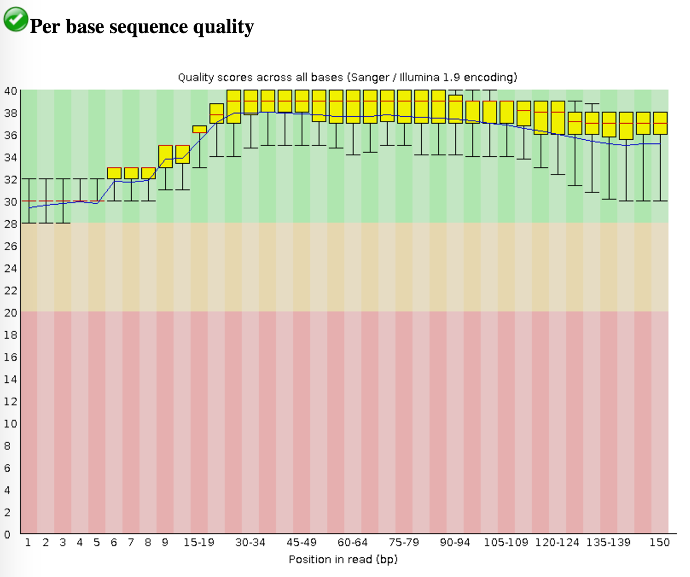
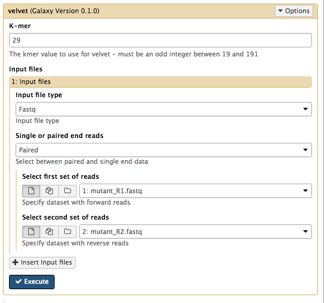

# Genome assembly with Velvet: Background
{:.no_toc}

Velvet is one of a number of *de novo* assemblers that use short read sets as input (e.g. Illumina Reads), and the assembly method is based on de Bruijn graphs. For information about Velvet see this [link](https://en.wikipedia.org/wiki/Velvet_assembler).

In this activity, we will perform a *de novo* assembly of a short read set using the Velvet assembler.

> ### Agenda
>
> In this tutorial, we will deal with:
>
> 1. TOC
> {:toc}
>
{: .agenda}

# Get the data

We will now import the data that we will use for the tutorial.

> ### :pencil2: Hands-on: Getting the data
>
> 1. Create and name a new history for this tutorial.
> 2. Import the sequence read raw data (\*.fastq) from [Zenodo](https://doi.org/10.5281/zenodo.582600)
>
>    > ### :bulb: Tip: Importing data via links
>    >
>    > * Copy the link location (Right-click on the filename <i class="fa fa-long-arrow-right"></i> Copy Link Address)
>    > * Open the Galaxy Upload Manager
>    > * Select **Paste/Fetch Data**
>    > * Paste the link into the text field
>    > * Change the data-type to **fastqsanger**
>    > * Press **Start**    
>    {: .tip}
>
>    
>    <figcaption><b>Figure 1:</b> Data can be imported directly with links.</figcaption>
>
>
>
> 3. Once the files have been uploaded, change their names to Mutant_R1.fastq and Mutant_R2.fastq respectively by clicking on the  icon next to the relevant history entry.
>
>    
>    
>    <figcaption><b>Figure 2:</b> Imported datasets will appear in the history panel.</figcaption>
>
> Click on the View Data button (the ) next to one of the FASTQ sequence files.
>
>    > ### :question: Questions
>    >
>    > 1. What are four key features of a FASTQ file?
>    > 2. What is the main difference between a FASTQ and a FASTA file?
>    {: .question}
>
>
{: .hands_on}

The history will now appear in your Current History pane, and the files are ready to use in Galaxy analyses.

The read set for today is from an imaginary *Staphylococcus aureus* bacterium with a miniature genome. The whole genome shotgun method used to sequence our mutant strain read set. It was produced on an Illumina DNA sequencing instrument.

The files we need for assembly are the ***mutant_R1.fastq*** and ***mutant_R2.fastq***.

-   The reads are paired-end.
-   Each read is 150 bases long. <!--(before trimming)-->
-   The number of bases sequenced is equivalent to 19x the genome sequence of the wildtype strain. (Read coverage 19x - rather low!).

# Evaluate the input reads

Questions you might ask about your input reads include:

- How good is my read set?
- Do I need to ask for a new sequencing run?  
- Is it suitable for the analysis I need to do?

We will evaluate the input reads using the FastQC tool.

The FastQC tool:

- Runs a standard series of tests on your read set and returns a relatively easy-to-interpret report.
- We will use the FastQC tool in Galaxy to evaluate the quality of one of our FASTQ files.

> ### :pencil2: Hands-on: Run FastQC on a fastq file
>
>We will now run the FastQC tool on one of our fastq files. Normally we would run it on all of them but we will do 1 as an example here.
>
> #### 1. Run **FastQC** :wrench: on **mutant_R1.fastq** to assess the quality of the input data.
>
> - Once finished, examine the output called ***FastQC on data1:webpage*** (Hint:). It has a summary at the top of the page and a number of graphs.
>
> Some of the important outputs of FastQC for our purposes are:
>
> -   **Basic Statistics: Sequence length**: will be important in setting maximum k-mer size value for assembly
> -   **Basic Statistics: Encoding**: Quality encoding type: important for quality trimming software
> - **Basic Statistics: % GC**: high GC organisms don’t tend to assemble well and may have an uneven read coverage distribution.
> - **Basic Statistics: Total sequences**: Total number of reads: gives you an idea of coverage.
> - **Per base sequence quality**: Dips in quality near the beginning, middle or end of the reads: determines possible trimming/cleanup methods and parameters and may indicate technical problems with the sequencing process/machine run.
> - **Per base N content**: Presence of large numbers of Ns in reads: may point to poor quality sequencing run. You would need to trim these reads to remove Ns.
> - **Kmer content**: Presence of highly recurring k-mers: may point to contamination of reads with barcodes or adapter sequences.
>
>
>   
>    <figcaption><b>Figure 3:</b> Sequence quality per base generated by FastQC.</figcaption>
>    
>    > ### :question: Questions
>    >
>    > 1. What does the y-axis represent in Figure 3?
>    > 2. Why is the quality score decreasing across the length of the reads?
>    {: .question}
>
{: .hands_on}

Although we have warnings for two outputs (per base sequence content; Kmer content), we can ignore these for now.

For a fuller discussion of FastQC outputs and warnings, see the [FastQC website link](https://www.bioinformatics.babraham.ac.uk/projects/fastqc/), including the section on each of the output [reports](https://www.bioinformatics.babraham.ac.uk/projects/fastqc/Help/3%20Analysis%20Modules/), and examples of ["good"](https://www.bioinformatics.babraham.ac.uk/projects/fastqc/good_sequence_short_fastqc.html) and ["bad"](https://www.bioinformatics.babraham.ac.uk/projects/fastqc/bad_sequence_fastqc.html) Illumina data.

We won’t be doing anything to these data to clean it up as there isn’t much need. Therefore we will get on with the assembly!

# Assemble reads with Velvet

We will perform a *de novo* assembly of the mutant FASTQ reads into long contiguous sequences (in FASTA format) using the Velvet short read assembler.

Velvet requires the user to input a value of *k* (k-mer size) for the assembly process. K-mers are fragments of sequence reads. Small k-mers will give greater connectivity, but large k-mers will give better specificity. We will discuss this more later.

> ### :pencil2: Hands-on: Run Velvet on the input reads
>
> #### 1. Run **Velvet** :wrench: Run **velvet** on both the input read files **mutant_R1.fastq** and **mutant_R2.fastq**
>
>   - Set the following parameters (leave other settings as they are):
>     - **K-mer**: 29
>     - **Input file type**: Fastq
>     - **Single or paired end reads**: Paired
>     - **Select first set of reads**: *mutant_R1.fastq*  
>     - **Select second set of reads**: *mutant_R2.fastq*
>
> Your tool interface should look something like this (you will most likely have a different value for k):
>
> 
>
>
>   - Galaxy is now running velvet on the reads for you.
>   - Press the refresh button in the history pane to see if it has finished.
>   - When it is finished, you will have some new files in your history.  
>     - a *Contigs* file
>     - a *Contigs stats* file
>     - a *Last Graph* file
>     - the velvet *log* file
>
>
> #### 2. Examine the output
>
>   - Click on the View Data button  on each of the files.
>   - The *Contigs* file will show each contig with the *k-mer length* and *k-mer coverage* listed as part of the header (however, these are just called *length* and *coverage*).
>     - *K-mer length*: For the value of k chosen in the assembly, a measure of how many k-mers overlap (by 1 bp each overlap) to give this length.
>     - *K-mer coverage*: For the value of k chosen in the assembly, a measure of how many k-mers overlap each base position (in the assembly).
>
> 
>
>   - The *Contigs stats* file will show a list of these k-mer lengths and k-mer coverages.
>
> 
>
{: .hands_on}

# Collect some statistics on the contigs

We will now collect some basic statistics on our assembly.

> ### :pencil2: Hands-on: Collect fasta statistics on our contigs
>
> #### Run **Fasta statistics** :wrench: on our contigs file
>
> - A new file will appear called *Fasta summary stats*
> - Click the eye icon to look at this file. (It will look something like - but not exactly like - this.)
>
> 
>
> - Look at:
>    - *num_seq*: the number of contigs in the FASTA file.
>    - *num_bp*: the number of assembled bases. Roughly proportional to genome size.
>    - *len_max*: the biggest contig.  
>    - *len_N50*: N50 is a contig size. If contigs were ordered from small to large, half of all the nucleotides will be in contigs this size or larger.
>
{: .hands_on}

# Discussion

We have completed an assembly on this data set for a number of k values ranging from 29 to 101. The results a few of the assembly metrics appear below.

This chart shows the number of contigs in the assembly for various k-mer sizes.

This chart shows the largest contig in each of the assemblies by k-mer size.

This chart shows the total number of base pairs in all the contigs for each assembly by k-mer size.

This chart shows the n50 metric for each of the assemblies by k-mer size.

> ### :question: Questions
>
> 1. Are there any distinct features in the charts?
> 2. Does it look like one assembly might be better than some of the others?
> 3.
{: .question}

The reasons for these patterns will be discussed in detail in the De Bruijn graph assembly slides and tutorial.
