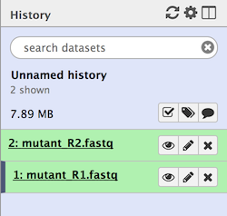
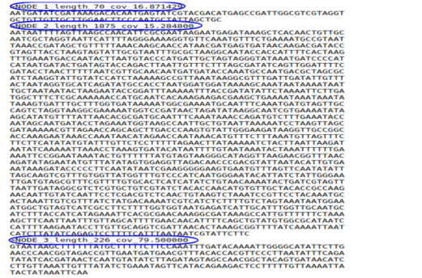
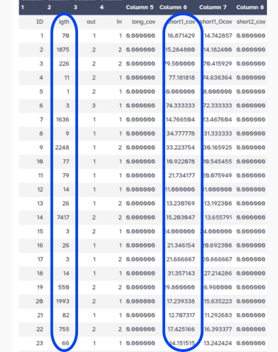
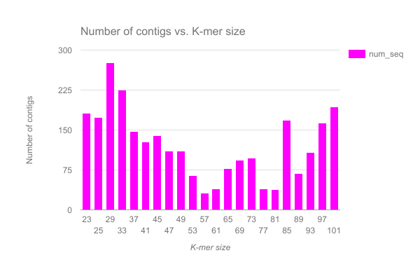
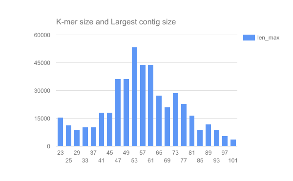
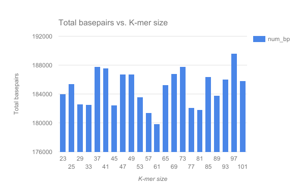
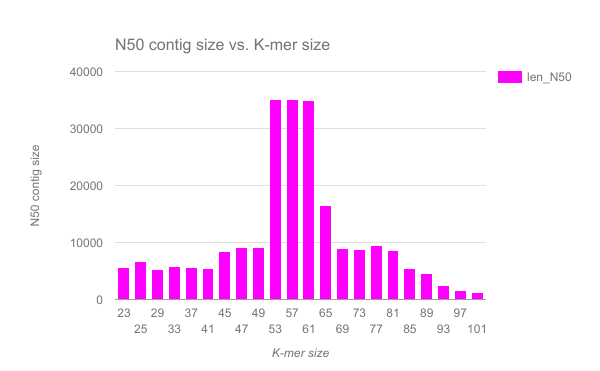

# Genome assembly with Velvet: Background
{:.no_toc}

Velvet is one of a number of *de novo* assemblers that use short read sets as input (*e.g.* Illumina Reads). The assembly method is based on the manipulation of de Bruijn graphs, via the removal of errors and the simplication of repeated regions.

> ###  Comment
>
> For information about Velvet, you can check its (nice) [Wikipedia page](https://en.wikipedia.org/wiki/Velvet_assembler).
{: .comment}

For this tutorial, we have a set of reads from an imaginary *Staphylococcus aureus* bacterium with a miniature genome (197,394 bp). Our mutant strain read set was sequenced with whole genome shotgun method, using an Illumina DNA sequencing instrument. From these reads, we would like to rebuild our imaginary *Staphylococcus aureus* bacterium via a *de novo* assembly of a short read set using the Velvet assembler.

> ### Agenda
>
> In this tutorial, we will deal with:
>
> 1. TOC
> {:toc}
>
{: .agenda}

# Get the data

We will now import the data that we will use for the tutorial.

> ###  Hands-on: Getting the data
>
> 1. Create and name a new history for this tutorial.
> 2. Import from [Zenodo](https://doi.org/10.5281/zenodo.582600) or from the data library the files:
>    - [`mutant_R1.fastq`](https://zenodo.org/record/582600/files/mutant_R1.fastq)
>    - [`mutant_R2.fastq`](https://zenodo.org/record/582600/files/mutant_R2.fastq)
>
>    > ###  Tip: Importing data via links
>    >
>    > * Copy the link location (Right-click on the filename then "Copy Link Address")
>    > * Open the Galaxy Upload Manager
>    > * Select **Paste/Fetch Data**
>    > * Paste the link into the text field
>    > * Change the data-type to **fastqsanger**
>    > * Press **Start**    
>    {: .tip}
>
> 3. Change the name of the files to `mutant_R1` and `mutant_R2`
>
>    As default, Galaxy uses the link as the name of the new dataset. It also does not link the dataset to a database or a reference genome.
>
>    > ###  Tip: Changing the name of a dataset
>    >
>    > * Click on **Edit attributes**  icon next to the relevant history entry
>    > * Change the **Name** in `Attributes` panel
>    {: .tip}
>
>    
>
> 4. Inspect the content of a file
>
>    > ###  Tip: Inspecting the content of a dataset
>    >
>    > * Click on **View Data** (the ) icon next to the relevant history entry
>    > * View the content of the file in the middle panel
>    {: .tip}
>
>    > ###  Questions
>    >
>    > 1. What are four key features of a FASTQ file?
>    > 2. What is the main difference between a FASTQ and a FASTA file?
>    >
>    >    

>    >    
Click to view answers

>    >    <ol type="1">
>    >    <li>Each sequence in a FASTQ file is represented into 4 lines: 1st line with the id, 2nd line with the sequence, 3rd line with no information here, 4th line with quality of sequencing per nucleotide</li>
>    >    <li>In a FASTQ file, not only the sequences are present but also information about the quality of sequencing</li>
>    >    </ol>
>    >    

>    {: .question}
>
{: .hands_on}

The reads have been sequenced from an imaginary *Staphylococcus aureus* bacterium using an Illumina DNA sequencing instrument. We obtained the 2 files we imported (`mutant_R1` and `mutant_R2`)

> ###  Question
>
> Why do we have 2 files here if we only sequenced once the bacteria?
>
>    

>    
Click to view answer

>    <ol type="1">
>    <li>The bacteria has been sequenced using paired-end sequencing. The first file correspond to forward reads and the second file to reverse reads</li>
>    </ol>
>    

{: .question}

# Evaluate the input reads

The first questions you might ask about your input reads (before doing any assembly) include:

- What is the coverage of my genome?
- How good is my read set?
- Do I need to ask for a new sequencing run?  
- Is it suitable for the analysis I need to do?

We will evaluate the input reads using the FastQC tool. This tool runs a standard series of tests on your read set and returns a relatively easy-to-interpret report. We will use it to evaluate the quality of our FASTQ files and combine the results with MultiQC.

> ###  Hands-on: FastQC on a fastq file
>
> 1. **FastQC**  with the following parameters
>    - "Short read data from your current history" to (**Multiple datasets**) `mutant_R1.fastq` and `mutant_R2.fastq`
> 
> 2. **MultiQC**  with the following parameters
>    - "Software name" to `FastQC`
>    - "Result file" to the raw data files generated by FastQC
>
{: .hands_on}

MultiQC generates a webpage combining the report of FastQC on both datasets. It is including graphs and tables:

- General statistics

    It will be important in setting maximum k-mer size value for assembly

    > ###  Tip: Having the length of sequences
    >
    > * Click on **Configure Columns**
    > * Check **Length**
    > * Close the window
    {: .tip}

    > ###  Questions
    >
    > 1. How long are the sequences?
    > 2. What is the average coverage of the genome, given our imaginary *Staphylococcus aureus* bacterium has a genome of 197,394 bp?
    >
    >    

    >    
Click to view answer

    >    <ol type="1">
    >    <li>The sequences are 150 bp long</li>
    >    <li>We have 2 x 12,480 sequences of 150 bp long. So the average genome coverage is: 2 * 12480 * 150 / 197394 ~ 19 X</li>
    >    </ol>
    >    

    {: .question}

- Sequence Quality Histograms

    Dips in quality near the beginning, middle or end of the reads: determines possible trimming/cleanup methods and parameters and may indicate technical problems with the sequencing process/machine run

    

    > ###  Questions
    >
    > 1. What does the y-axis represent?
    > 2. Why is the quality score decreasing across the length of the reads?
    >
    >    

    >    
Click to view answer

    >    <ol type="1">
    >    <li>The y-axis represents the quality score for each base (an estimate of the error during sequencing)</li>
    >    <li>The quality score is decreasing accross the length of the reads because the sequencing become less and less reliable at the end of the reads</li>
    >    </ol>
    >    

    {: .question}

- Per Sequence GC Content
    High GC organisms don't tend to assemble well and may have an uneven read coverage distribution.
- Per Base N Content
    Presence of large numbers of Ns in reads: may point to poor quality sequencing run. You would need to trim these reads to remove Ns.
- Kmer content
    Presence of highly recurring k-mers: may point to contamination of reads with barcodes or adapter sequences.

> ###  Comment
>
> For a fuller discussion of FastQC outputs and warnings, see the [FastQC website link](https://www.bioinformatics.babraham.ac.uk/projects/fastqc/), including the section on each of the output [reports](https://www.bioinformatics.babraham.ac.uk/projects/fastqc/Help/3%20Analysis%20Modules/), and examples of ["good"](https://www.bioinformatics.babraham.ac.uk/projects/fastqc/good_sequence_short_fastqc.html) and ["bad"](https://www.bioinformatics.babraham.ac.uk/projects/fastqc/bad_sequence_fastqc.html) Illumina data.
{: .comment}

We won't be doing anything to these data to clean it up as there isn't much need. Therefore we will get on with the assembly!

# Assemble reads with Velvet

Now, we want to assemble our reads to find the sequence of our imaginary *Staphylococcus aureus* bacterium. We will perform a *de novo* assembly of the reads into long contiguous sequences using the Velvet short read assembler. 

The first step of the assembler is to build a de Bruijn graph. For that, it will break our reads into k-mers, *i.e.* fragments of length *k*. Velvet requires the user to input a value of *k* (k-mer size) for the assembly process. Small k-mers will give greater connectivity, but large k-mers will give better specificity.

> ###  Hands-on: Assemble the reads
>
> 1. **FASTQ interlacer**  with the following parameters
>    - "Type of paired-end datasets" to `2 separate datasets`
>    - "Left-hand mates" to `mutant_R1.fastq`
>    - "Right-hand mates" to `mutant_R2.fastq`
>
>    Currently our paired-end reads are into 2 files (one with the forward reads and one with the reverse reads). But Velvet requires only one file where each read is next to its mate read. In other words, if the reads are indexed from 0, then reads 0 and 1 are paired, 2 and 3, 4 and 5, etc. Before doing the assembly *per se*, we need to prepare the files by combining them.
> 
> 2. **velveth**  with the following parameters
>    - "Hash Length" to `29`
>    - "Input Files": click on `Insert Input Files`
>    - "file format" to `fastq`
>    - "read type" to `shortPaired reads`
>    - "Dataset" to the pairs output of **FASTQ interlacer** 
>
>    The tool takes our reads and break them into k-mers.
>   
> 3. **velvetg**  with the following parameters
>    - "Velvet Dataset" to the output of **velveth**
>    - "Using Paired Reads" to `Yes`
>   
>    This tool does the assembly *per se*.
{: .hands_on}

2 files are generated:

- A "Contigs" file

    This file contains the sequences of the contigs longer than 2k. In the header of each contig, several information is added
    - the k-mer length (called "length"): For the value of k chosen in the assembly, a measure of how many k-mers overlap (by 1 bp each overlap) to give this length
    - the k-mer coverage (called "coverage"): For the value of k chosen in the assembly, a measure of how many k-mers overlap each base position (in the assembly).

    

- A "Stats" file

    It is tabular file with for each contigur the k-mer lengths, k-mer coverages and other measures.

    

# Collect some statistics on the contigs

> ###  Question
>
> 1. How many contigs has been built?
> 2. What is the mean, min and max length of the contigs?
>
>    

>    
Click to view answer

>    <ol type="1">
>    <li>190</li>
>    <li>To compute this information, we can use the Datamash tool and do operation on the 2nd columns (length). But be careful with the first line: the header. As a result, we obtain: 597.82 as mean, 1 as min and 12904 as max. It would mean that the smallest contig has a length of 1 bp, even smaller than k. The length on the 2nd column correspond to length of the contig in k-mers. It means that the smallest contig has a length of 1k = 29. So to obtain the real length, we need to add k-1 to the length. We obtain then a mean contig length of 625.82 bp, a min contig of 29 bp and a max contig of 12,932 bp</li>
>    </ol>
>    

{: .question}

But we are quite limited with this table. We will now collect more basic statistics on our assembly.

> ###  Hands-on: Collect fasta statistics on our contigs
>
> 1. **Quast**  with
>    - "Contigs/scaffolds output file" to the output of **velvetg**
>    - "Type of data" to `contig`
>    - "Reference File" to `wildtype.fna`
>    - "Type of organism" to `Prokaryotes`
>    - "Lower Threshold" to `500`
>    - "Thresholds" to `0,1000`
{: .hands_on}

This tool generates 5 output files, but we will focus on the HTML report and the Icarus viewer.

> ###  Question
>
> 1. What is represented in the Icarus viewer?
>
>    

>    
Click to view answer

>    <ol type="1">
>    <li>Icarus is a novel genome visualizer for accurate assessment and analysis of genomic draft assemblies. It draws contigs ordered from longest to shortest, highlights N50, N75 (NG50, NG75) and long contigs larger than a user-specified threshold</li>
>    </ol>
>    

{: .question}

The HTML report reports many statistics computed by QUAST to assess the quality of the assembly:

- Statistics about the quality of the assembly when compare to the reference (fraction of the genome, duplication ratio, etc)
- Misassembly statistics with for example the number of misassemblies

    A misassembly is a position in the contigs (breakpoints) that satisfy one of the following criteria:
    - the left flanking sequence aligns over 1 kbp away from the right flanking sequence on the reference;
    - flanking sequences overlap on more than 1 kbp
    - flanking sequences align to different strands or different chromosomes

- Unaligned regions in the assembly 
- Mismatches compared to the reference genomes
- Statistics about the assembly *per se*, such as the number of contigs, the length of the largest contig

> ###  Question
>
> 1. How many contigs have been constructed?
> 2. Which proportion of the reference genome do they represent?
> 3. How many misassemblies have been found?
> 4. Has the assembly introduced mismatches and indels?
> 5. What are N50 and L50?
> 6. Is there a bias in GC percentage induced by the assembly?
>
>    

>    
Click to view answer

>    <ol type="1">
>    <li>190 contigs have been constructed, but only 47 have a length > 500 bp</li>
>    <li>The contigs represents 87.965 % of the reference genome</li>
>    <li>1 misassembly has been found: it correspond to a relocation, *i.e.* a misassembly event (breakpoint) where the left flanking sequence aligns over 1 kbp away from the right flanking sequence on the reference genome</li>
>    <li>8.06 mismatches per 100 kbp and 4.03 indels per 100 kbp are found</li>
>    <li>N50 is the length for which the collection of all contigs of that length or longer covers at least half an assembly. In other words, if contigs were ordered from small to large, half of all the nucleotides will be in contigs this size or larger. And L50 is the number of contigs equal to or longer than N50: L50 is the minimal number of contigs that cover half the assembly</li>
>    <li>The GC % in the assembly is 33.64%, really similar to the one of the reference genome (33.43%)</li>
>    </ol>
>    

{: .question}

# Discussion

> ###  (Optional) Hands-on: Rerun for values *k* ranging from 31 to 101
>
> 1. **velveth**  with the same parameters as before except
>    - "Hash Length" to a value between 31 and 101
> 2. **velvetg**  with the same parameters as before
> 3. **Quast**  with the same parameters as before
{: .hands_on}

We have completed an assembly on this data set for a number of k values ranging from 29 to 101. The results a few of the assembly metrics appear below.

> ###  Questions
>
> 1. Are there any distinct features in the charts?
> 2. Does it look like one assembly might be better than some of the others?
>
{: .question}

The reasons for these patterns will be discussed in detail in the De Bruijn graph assembly slides and tutorial.
