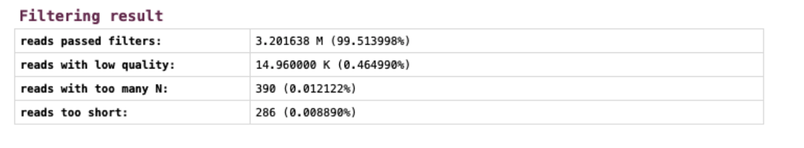
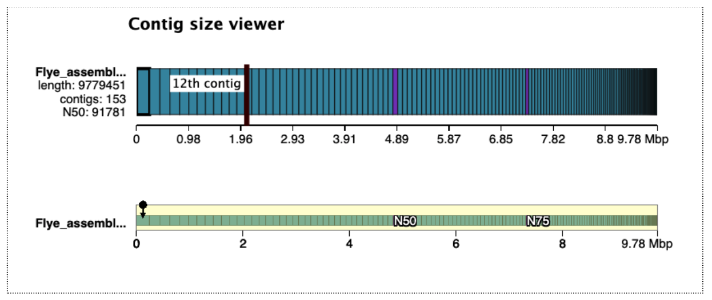

*Note: We recommend running this tutorial on either the Galaxy Europe or Galaxy Australia servers. Other servers (such as Galaxy main) have not yet been configured fully for all the tools in this analysis.*

## What is genome assembly?

A genome is a representation of the set of DNA in an organism, such as the set of chromosomes. When the DNA is extracted from the sample, it is broken up into fragments much smaller than the lengths of DNA in the chromosomes. After being sequenced, these fragments (and their copies) are called sequencing reads. To assemble the genome, we need to join the reads back into, ideally, chromosome-sized lengths.

{: width="800"}

### Assembly challenges

In reality, we rarely get chromosome-length assemblies, due to many challenges. Here are some examples of particular challenges in a diploid genome assembly:

{: width="800"}


Even though most assemblies are not chromosome-length, the assembly in contigs is still valuable for many research questions. Lengths of assembled contigs are increasing as sequencing technology and assembly tools improve. 

### Can I use my own data with these workflows?

This tutorial has been tested on real-sized data sets and should work with your own data. However, there will most likely be some modifications required to tools and settings. Furthermore, as most species have never had their genome sequenced, it is not possible to guarantee existing workflows are optimal for new data.

It is most likely that any new genome assembly will have its own set of required workflow and analysis customisations to account for things such as ploidy and repeats. Usually, an assembly workflow will need testing and customising, in concert with reading the biological domain literature.

Before using these workflows on real datasets, we recommend completing all the relevant GTN tutorials about Data QC and Asssembly to give extra familiarity with the concepts. Then, we suggest creating subsampled data sets from your full-sized data, for testing. For best results, it is recommended to test each tool separately, and consider the parameters and their relevance and suitability for your own research questions. 

> <agenda-title></agenda-title>
> In this tutorial we will deal with:
>
> 1. TOC
> {:toc}
>
{: .agenda}


# Analysis workflow

In this tutorial, we will follow these steps: 

{: width="800"}

* Each of these steps is described in a section in this tutorial. 
* For each step, we will run a workflow. 
* We will stay in the same Galaxy history throughout. 

## How to run a workflow in Galaxy

* All of these workflows have been uploaded to [workflowhub.eu](https://workflowhub.eu/) and have been tagged with "Large-genome-assembly". There, each workflow is accompanied by an image of the workflow canvas and the tool connections. 
* The workflows are also linked to this tutorial - see above and import them into your own Galaxy Account. 
* If you are using Galaxy Australia, the workflows are published with the tag "lg-wf".
* A note: as of September 2022, these workflows have been tested on Galaxy Australia and we are now in the process of testing them on Galaxy Europe and Galaxy Main. 

Here is a list of the workflows:

|Tutorial section | Workflow name|
|-----------------|--------------|
|Quality Control | Data QC|
|Kmer counting | kmer counting - meryl|
|Trim and filter reads | Trim and filter reads - fastp|
|Assembly | Assembly with Flye |
|Polish assembly | Assembly polishing |
|Assess quality | Assess genome quality|




After importing the workflows into your account:

* Look at your of Workflows. (Galaxy top panel: Workflow) 
* For the workflow you want to run, go to the right hand side and see the arrow button (a triangle), click
* This brings up the workflow in the centre Galaxy panel
* Click "Expand to full workflow form"
* For "Send results to a new history", leave it as "No".
* Each time you run a workflow, you need to specify the input data set (or sets). Galaxy will try to guess which file this is, but change if required using the drop-down arrow. 
* At the top right, click "Run Workflow". 
* The result files will appear at the top of your current history

Each workflow will be discussed in a separate section.

# Upload data

Let's start with uploading the data.

## What sequence data are we using in the tutorial?

* The data sets for genome projects can be very large and tools can take some time to run. It is a good idea to test that your planned tools and workflows will work on smaller-sized test data sets, as it is much quicker to find out about any problems. 
* In this tutorial we will use a subset of real sequencing data from a plant genome, the snow gum, *Eucalyptus pauciflora*, from a genome project described in this paper: . Data is hosted at NCBI BioProject number: PRJNA450887.

## How has this data subset been prepared?

* From NCBI, three read files were imported into Galaxy for this tutorial: nanopore reads (SRR7153076), and paired Illumina reads (SRR7153045). 
* These were randomly subsampled to 10% of the original file size. 
* Plant genomes may contain an excess of reads from the chloroplast genome (of which there are many copies per cell). To ensure our test data sets are not swamped from excessive chloroplast-genome reads, reads that mapped to a set of known chloroplast gene sequences were discarded.

We are also using a reference genome *Arabidopsis thaliana* for a later comparison step - file TAIR10_chr_all.fas downloaded from [The Arabidopsis Information Resource](https://www.arabidopsis.org/download/index-auto.jsp?dir=%2Fdownload_files%2FGenes%2FTAIR10_genome_release%2FTAIR10_chromosome_files).

## Import the data

> <hands-on-title>Import the data</hands-on-title>
> 1. Create a new history for this tutorial and give it a proper name
>
>    
>
>    
>
> 2. Import from [Zenodo](https://zenodo.org/record/7055935) or a data library (ask your instructor):
>
>    - 2 FASTQ files with illumina reads: these files have a R1 or R2 in the name
>    - 1 FASTQ file with nanopore reads: this file has nano in the name
>    - 1 FASTQ file for the genome Arabidopsis
>   
>    ```
>    https://zenodo.org/record/7055935/files/Eucalyptus_subsample_ten_pc_SRR7153045_R1.fastq.gz
>    https://zenodo.org/record/7055935/files/Eucalyptus_subsample_ten_pc_SRR7153045_R2.fastq.gz
>    https://zenodo.org/record/7055935/files/Eucalyptus_subsample_ten_pc_nano_SRR7153076.fastq.gz
>    https://zenodo.org/record/7055935/files/Ref_genome_Arabidopsis.fasta
>    ```
>
>    
>
>    
>    
> 3. Check that the datatypes for the three files of sequencing reads are `fastq.gz`, not `fastqsanger.gz` and change datatype if needed.
>
>    
>
{: .hands_on}

* This tutorial uses these input files and gives some examples from the results.
* It is likely that your results will differ slightly (e.g. number of bases in the genome assembly). This is common, because many tools start from different random seeds. 
* Also, tool versions are being constantly updated.  Newer versions may be available since this tutorial was written and could give slightly different results. 

# Check read quality

Let's look at how many reads we have and their quality scores using the Data QC workflow.

## Data QC workflow

What it does: Reports statistics from sequencing reads

Inputs: 
* long reads (fastq.gz format)
* short reads (R1 and R2) (fastq.gz format)

Outputs: 
* For long reads: a nanoplot report (the HTML report summarizes all the information). 
* For short reads: a MultiQC report 

Tools used: 
* Nanoplot
* FastQC
* MultiQC

Workflow steps: 
* Long reads are analysed by Nanoplot. 
* Short reads (R1 and R2) are analysed by FastQC
* the resulting reports are processed by MultiQC

Options: 
* See the tool settings options at runtime and change as required. 
* Alternative tool option: fastp

> <hands-on-title>Run the Data QC workflow</hands-on-title>
>
> 1. **Import the workflow** into Galaxy:
>
>    
>
>    - Click "Expand to full workflow form"
>
> 2. Run **Data QC**  using the following parameters:
>    - *"Send results to a new history"*: `No`
>    -  *"1: Input file: long reads"*: the nanopore fastq.gz file
>    -  *"2: Input file: Illumina reads R1"*: the illumina R1 fastq.gz file
>    -  *"3: Input file: Illumina reads R2"*: the illumina R2 fastq.gz file
>
>    
{: .hands_on}

## Data QC results

> <question-title></question-title>
>
> 1. What are the results from the two output files? Are the reads long enough and of high enough quality for our downstream analyses?  Will reads need any trimming or filtering?
>
> > <solution-title></solution-title>
> >
> > 1. Common things to check are average read length, average quality, and whether quality varies by position in the reads.
> > * Look at the plot for MultiQC for the Sequence Quality Histograms. This shows how the read quality of Illumina reads (y axis) varies according to base position (x axis).You may see for Illumina reads that there is some drop-off in quality towards the end of the reads, which may benefit from trimming. 
> > * Look at the plot from Nanoplot for "Read lengths vs Average read quality". The nanopore reads have a mean read quality of 9.0. Depending on the size of our input read sets and the research question, we may filter out reads below a certain average quality. If we had a lot of reads, we may be able to set a higher threshold for filtering according to read quality.  
> {: .solution}
{: .question}

> <comment-title>Additional information about the tools</comment-title>
> More about interpreting nanoplot plots: 
> * [Nanoplot on Github](https://github.com/wdecoster/NanoPlot)
> * [Example nanoplots](https://gigabaseorgigabyte.wordpress.com/2017/06/01/example-gallery-of-nanoplot/)
> 
> More about FastQC results: 
> * [FastQC webpage](https://www.bioinformatics.babraham.ac.uk/projects/fastqc/)
> * [FastQC tips](https://timkahlke.github.io/LongRead_tutorials/QC_F.html)
{: .comment}

# Determine genome characteristics

To prepare for genome assembly you might want to know things about your genome such as size, ploidy level (how many sets of chromosomes) and heterozygosity (how variable the sequence is between homologous chromosomes). A relatively fast way to estimate these things is to count small fragments of the sequencing reads (called kmers).

A read broken into kmers:

{: width="650"}

> <comment-title>What is kmer counting?</comment-title>
>
> Kmer counting is usually done with high-accuracy short reads, not long reads which may have high error rates.  After counting how many times each kmer is seen in the reads, we can see what sorts of counts are common. For example, lots of kmers may have been found 24 or 25 times. A graph shows the number of different kmers (y axis) found at different counts, or depths (x axis). 
>
> Many different kmers will be found the same number of times; e.g. X25. If kmer length approaches read length, this means the average depth of your sequencing is also ~X25, and there would be a peak in the graph at this position (smaller kmers = higher kmer depth). There may be smaller peaks of kmer counts at higher depths, e.g. X50 or X100, indicating repeats in the genome. There may be other smaller peaks of kmers found at half the average depth, indicating a diploid genome with a certain amount of difference between the homologous chromosomes - this is known as heterozygosity. Thus, the plot of how many different kmers are found at all the depths will help inform estimates of sequencing depth, ploidy level, heterozygosity, and genome size. 
{: .comment}

## Kmer counting workflow

What it does: Estimates genome size and heterozygosity based on counts of kmers

Inputs: One set of short reads: e.g. R1.fq.gz

Outputs: GenomeScope graphs

Tools used: 
* Meryl
* GenomeScope

Workflow steps:
* The tool meryl counts kmers in the input reads (k=21), then converts this into a histogram.
* GenomeScope: runs a model on the histogram; reports estimates. k-mer size set to 21. 

Options: 
* Use a different kmer counting tool. e.g. khmer. If so, for the settings, advanced parameters: 
* k-mer size: 21 (as per [this recommendation](https://github.com/schatzlab/genomescope/issues/32)). 
* n_tables: 4. tablesize: set at 8 billion (as per [this recommendation](https://khmer.readthedocs.io/en/v1.0/choosing-table-sizes.html)). 
* Will also need to run some formatting steps to convert khmer output to a two-column matrix, for the  Genomscope. See [this workflow](https://usegalaxy.org.au/u/anna/w/kmer-counting-khmer). 
* Note: khmer: to use both R1 and R2 read sets, khmer needs these paired reads in interleaved format. 


> <hands-on-title>Run the Kmer counting workflow</hands-on-title>
>
> 1. **Import the Kmer counting workflow** into Galaxy:
>    - Copy the URL (e.g. via right-click) of [this workflow]({{ site.baseurl }}{{ page.dir }}workflows/Galaxy-Workflow-kmer_counting.ga) or download it to your computer.
>    - Import the workflow into Galaxy
>
> 1. **Import the workflow** into Galaxy:
>
>    
>
>    - Click "Expand to full workflow form"
>
> 2. Run **Kmer counting**  using the following parameters:
>    - *"Send results to a new history"*: `No`
>    -  *"1: Input file: Illumina reads R1"*: the illumina R1 fastq.gz file
>
>    
{: .hands_on}


## Kmer counting results

GenomeScope transformed linear plot:

{: width="800"}

Here we can see a central peak - showing that most of the different kmers were found at counts of ~ 120. These are kmers from single-copy homozygous alleles. To the left, a smaller peak at around half the coverage, showing kmers from heterozygous alleles (note that this peak gets higher than the main peak when heterozygosity is only ~ 1.2%). To the right, another smaller peak showing kmers at higher coverage, from repeat regions. Information from these three peaks provide a haploid genome length estimate of ~240,000 bp (note this is test data so smaller than whole plant genome size). 

The output Summary file shows more detail: 
* Genome unique length: from single copy homozygous and heterozygous alleles (under the main and left peak).
* Genome repeat length: from repeat copies (under the graph to the right of the main peak).
* Genome haploid length: unique length + repeat length

More about kmer counting: See [this tutorial](https://bioinformatics.uconn.edu/genome-size-estimation-tutorial/#)

For more about Meryl see .

For more about Genomescope see (Note: the supplementary information is very informative).

# Trim and filter reads

Using information from Data QC and kmer counting, we may want to trim and/or filter reads. The settings for trimming and filtering depend on many things, including: 
* your aim (accuracy; contiguity)
* your data: type, error rate, read depth, lengths, quality (average, variation by position)
* the ploidy and heterozygosity of your sample
* choice of assembly tool (e.g. it may automatically deal with adapters, low qualities, etc.)

Because of all these factors, few specific recommendations are made here, but the workflow is provided and can be customised. If you are unsure how to start, use your test data to try different settings and see the effect on the resulting size and quality of the reads, and the downstream assembly contigs. Newer assemblers are often configured to work well with long-read data and in some cases, read trimming/filtering for long reads may be unnecessary. 

Trimming and filtering reads:

{: width="800"}

## Trimming and filtering workflow


What it does: Trims and filters raw sequence reads according to specified settings. 

Inputs: 
* Long reads (format fastq)
* Short reads R1 and R2 (format fastq) 

Outputs: Trimmed and filtered reads: 
* fastp_filtered_long_reads.fastq.gz (But note: no trimming or filtering is on by default)
* fastp_filtered_R1.fastq.gz
* fastp_filtered_R2.fastq.gz

Tools used:  fastp (Note. The latest version (0.20.1) of fastp has an issue displaying plot results. Using version 0.19.5 here instead until this is rectified). 

Input parameters: None required, but recommend removing the long reads from the workflow if not using any trimming/filtering settings. 

Workflow parameter settings: 
* Long reads: fastp settings: 
  * These settings have been changed from the defaults (so that all filtering and trimming settings are now disabled). 
  * Adapter trimming options: Disable adapter trimming: yes. 
  * Filter options: Quality filtering options: Disable quality filtering: yes. 
  * Filter options: Length filtering options: Disable length filtering: yes. 
  * Read modification options: PolyG tail trimming: Disable. 
  * Output options: output JSON report: yes
* Short reads: fastp settings:
  * adapter trimming (default setting: adapters are auto-detected)
  * quality filtering (default: phred quality 15), unqualified bases limit (default = 40%), number of Ns allowed in a read (default = 5)
  * length filtering (default length = min 15)
  * polyG tail trimming (default = on for NextSeq/NovaSeq data which is auto detected)
* Output options: output JSON report: yes

Options: 
* Change any settings in fastp for any of the input reads.
* Adapter trimming: input the actual adapter sequences. (Alternative tool for long read adapter trimming: Porechop.) 
* Trimming n bases from ends of reads if quality less than value x  (Alternative tool for trimming long reads: NanoFilt.) 
* Discard post-trimmed reads if length is < x (e.g. for long reads, 1000 bp)
* Example filtering/trimming that you might do on long reads: remove adapters (can also be done with Porechop), trim bases from ends of the reads with low quality (can also be done with NanoFilt), after this can keep only reads of length x (e.g. 1000 bp) 
* If not running any trimming/filtering on nanopore reads, could delete this step from the workflow entirely.


> <hands-on-title>Run the Trim and Filter Reads workflow</hands-on-title>
>
> 1. **Import the workflow** into Galaxy:
>
>    
>
>    - Click "Expand to full workflow form"
>
> 2. Run **Trim and Filter Reads**  using the following parameters:
>    - *"Send results to a new history"*: `No`
>    -  *"1: Input file: long reads"*: the nanopore fastq.gz file
>    -  *"2: Input file: Illumina reads R1"*: the illumina R1 fastq.gz file
>    -  *"3: Input file: Illumina reads R2"*: the illumina R2 fastq.gz file
>    - *Note: the workflow parameter settings described above are already set, and don't need to be changed when running the workflow, unless you wish to.* 
>
>    
{: .hands_on}

## Trim and filter reads: results

There are two fastp reports - one for the illumina reads and one for the nanopore reads. We have only processed illumina reads in this example. Look at the fastp illumina report. (Note: the title in the report refers to only one of the input read sets but the report is for both read sets. This is a known issue under investigation.)

Filtering results from fastp on short reads:

{: width="800"}

Here we can see that less than 0.5 % of the reads were discarded based on quality. If our read set had high enough coverage for downstream analyses, we might choose to apply a stricter quality filter. 

## Summary of read data for genome assembly

> <question-title></question-title>
> 1. How many reads do we have now for our genome assembly? Is the read coverage high enough? 
>
> > <solution-title></solution-title>
> > * Genome size: From kmer counting, the estimated genome size is ~ 240,000 bp  (this is only subsampled data; full data would likely suggest a size of 0.5 - 1 Gbp for a typical plant genome)
> > * Genome coverage (or depth):  total base pairs in the reads / base pairs in genome
> > * Short reads: From the fastp report after trimming and filtering short reads, there are 3.2 million reads, comprising 482 million base pairs 
> > * Short read coverage:  = X2008
> > * Long reads: From the fastp report of the long reads (although no filtering and trimming performed) there are 85 thousand reads, comprising 761 million base pairs.  From the nanoplot tool we ran in the Data QC section , we know that the mean read length is almost 9,000 base pairs, and the longest read is > 140,000 base pairs. 
> > * Long read coverage:  = X3170
> > These coverages are very high but are ok to use with tutorial data. With a typical full data set, coverage would be more in the order of X40 to X200. 
> >
> {: .solution}
{: .question}

# Genome Assembly

Genome assembly means joining the reads up to make contiguous sections of the genome. A simplified way to imagine this is overlapping all the different sequencing reads to make a single length or contig, ideally one for each original chromosome. The output is a set of contigs and a graph showing how contigs are connected.

Extreme simplification of genome assembly:

{: width="800"}

Genome assembly algorithms use different approaches to work with the complexities of large sequencing read data sets, large genomes, different sequencing error rates, and computational resources. Many use graph-based algorithms.  For more about genome assembly algorithms see [these tutorials by Ben Langmead](https://langmead-lab.org/teaching-materials/).

## Which assembly tool and approach to use?

Here, we will use the assembly tool called Flye to assemble the long reads. This is fast and deals well with the high error rate. Then, we will polish (correct) the assembly using information from the long reads (in their unassembled state), as well as the more accurate short Illumina reads.

There are many other approaches and combinations of using short and long reads, and the polishing steps. For example, the long reads can be polished before assembly (with themselves, or with short reads). This may increase accuracy of the assembly, but it may also introduce errors if similar sequences are "corrected" into an artificial consensus. Long reads are usually used in the assembly, but it is possible to assemble short reads and then scaffold these into longer contigs using information from long reads. 

For more about the differences between current assembly and polishing tools see  and .

## Assembly with Flye workflow


What it does: Assembles long reads with the tool Flye

Inputs: long reads (may be raw, or filtered, and/or corrected); fastq.gz format

Outputs: 
* Flye assembly fasta. 
* Fasta stats on assembly.fasta
* Assembly graph image from Bandage
* Bar chart of contig sizes
* Quast reports of genome assembly

Tools used: 
* Flye
* Fasta statistics
* Bandage
* Bar chart
* Quast

Input parameters: None required, but recommend setting assembly mode to match input sequence type

Workflow steps: 
* Long reads are assembled with Flye, using default tool settings. Note: the default setting for read type ("mode") is nanopore raw. Change this at runtime if required. 
* Statistics are computed from the assembly.fasta file output, using Fasta Statistics and Quast (is genome large: Yes; distinguish contigs with more that 50% unaligned bases: no)
* The graphical fragment assembly file is visualized with the tool Bandage. 
* Assembly information sent to bar chart to visualize contig sizes

Options
* See other Flye options. 
* Use a different assembler (in a different workflow). 
* Bandage image options - change size (max size is 32767), labels - add (e.g. node lengths). You can also install Bandage on your own computer and download the "graphical fragment assembly" file to view in greater detail. 


> <hands-on-title>Run the Assembly with Flye workflow</hands-on-title>
>
> 1. **Import the workflow** into Galaxy:
>
>    
>
>    - Click "Expand to full workflow form"
>
> 2. Run **Assembly with Flye**  using the following parameters:
>    - *"Send results to a new history"*: `No`
>    -  *"1: Input file: long reads"*: the fastp filtered long reads fastq.gz file
>
>    
{: .hands_on}


## Assembly results

The assembled contigs are in the "Flye assembly on data X (consensus)" (X is a number that will vary depending on where it sits in your history).  
Open the Quast tabular report to see the assembly statistics:

{: width="800"}

There are 153 contigs, largest is ~246,000 bp, and total length almost 10 million bp. This is a fair bit longer than the estimated genome size from kmer counting (which was ~240,000 bp), but the difference is likely mainly due to idiosyncrasies of using a subsampled data set. The read coverage was likely <1, causing many kmers to have frequency of <1 and be classed as errors, rather than contributing to the genome size estimate. 

Open the Quast HTML report, then click on "View in Icarus contig browser".  This is a way to visualize the contigs and their sizes:

{: width="800"}

View the Bandage image of the assembly graph:

{: width="800"}

As this is a subsampled data set, it is not surprising that most of the contigs are unjoined. The joined contigs at the top left are likely to be part of the mitochondrial genome as these reads were probably over-represented in our subsampled data set.

### What about centromeres and telomeres?

Some genomic areas such as centromeres, telomeres, and ribosomal DNA arrays, are much harder to assemble. These are long stretches of very similar repeats. With improved sequencing accuracy, length, and technologies (particularly long-range scaffolding), these may soon be much easier to assemble. The latest human genome assembly has a good demonstration of the techniques used for this.   See , and in particular, Figure 2: Bandage graphs of the human genome chromosomes, with the grey shading showing centromeric regions. 

### What about haplotigs?

Although our sample may be diploid, with pairs of chromosomes, the resulting assembly is often a haploid (or "collapsed") assembly. This is not the sequence of one of the chromosomes, but a mix of the two. 

Some assemblers will produce extra contigs called haplotigs. These are parts of the assembly from heterozygous regions (that is, the sequence is relatively different between the chromosome pair). There are tools to remove haplotigs from the assembly if that is preferred. 

For more on differences between collapsed, primary/alternate and partially-phased assemblies, with a great visual representation: see [Heng Li's Github page](http://lh3.github.io/2021/04/17/concepts-in-phased-assemblies)

For more on the phased assemblies, particularly for diploids or polyploids, see .

# Assembly polishing

We will polish the assembly using both the long reads and short reads. This process aligns the reads to the assembly contigs, and makes corrections to the contigs where warranted.  For more, see , particularly for a discussion about polishing diploid genomes.

Assembly polishing:

{: width="800"}

## Polishing workflow

Workflow structure: The workflow includes two subworkflows: 
* Racon polish with long reads, x 4
* Racon polish with illumina reads, x2

What it does: Polishes (corrects) an assembly, using long reads (with the tools Racon and Medaka) and short reads (with the tool Racon). (Note: medaka is only for nanopore reads, not PacBio reads). 

Inputs:
* assembly to be polished:  assembly.fasta
* long reads - the same set used in the assembly (e.g. may be raw or filtered) fastq.gz format 
* short reads, R1 only, in fastq.gz format

Outputs: 
* Racon+Medaka+Racon polished_assembly. fasta
* Fasta statistics after each polishing tool

Tools used:
* Minimap2
* Racon
* Fasta statistics
* Medaka

Input parameters: None required, but recommended to set the Medaka model correctly (default = r941_min_high_g360). See drop down list for options. 

Workflow steps for Part 1, Polish with long reads: using Racon
* Long reads and assembly contigs => Racon polishing (subworkflow): 
* minimap2 : long reads are mapped to assembly => overlaps.paf. 
* overaps, long reads, assembly => Racon => polished assembly 1
* using polished assembly 1 as input; repeat minimap2 + racon => polished assembly 2
* using polished assembly 2 as input, repeat minimap2 + racon => polished assembly 3
* using polished assembly 3 as input, repeat minimap2 + racon => polished assembly 4
* Racon long-read polished assembly => Fasta statistics
* Note: The Racon tool panel can be a bit confusing and is under review for improvement. Presently it requires sequences (= long reads), overlaps (= the paf file created by minimap2), and target sequences (= the contigs to be polished) as per "usage" described at this link [https://github.com/isovic/racon/blob/master/README.md](https://github.com/isovic/racon/blob/master/README.md)
* Note: Racon: the default setting for "output unpolished target sequences?" is No. This has been changed to Yes for all Racon steps in these polishing workflows.  This means that even if no polishes are made in some contigs, they will be part of the output fasta file. 
* Note: the contigs output by Racon have new tags in their headers. For more on this see [this issue](https://github.com/isovic/racon/issues/85).

Workflow steps for Part 2, Polish with long reads: using Medaka
* Racon polished assembly + long reads => medaka polishing X1 => medaka polished assembly
* Medaka polished assembly => Fasta statistics

Workflow steps for Part 3, Polish with short reads: using Racon
* Short reads and Medaka polished assembly =>Racon polish (subworkflow):
* minimap2: short reads (R1 only) are mapped to the assembly => overlaps.paf. Minimap2 setting is for short reads.
* overlaps + short reads + assembly => Racon => polished assembly 1
* using polished assembly 1 as input; repeat minimap2 + racon => polished assembly 2
* Racon short-read polished assembly => Fasta statistics

Options:
* Change settings for Racon long read polishing if using PacBio reads:  The default profile setting for Racon long read polishing: minimap2 read mapping is "Oxford Nanopore read to reference mapping", which is specified as an input parameter to the whole Assembly polishing workflow, as text: map-ont. If you are not using nanopore reads and/or need a different setting, change this input. To see the other available settings, open the minimap2 tool, find "Select a profile of preset options", and click on the drop down menu. For each described option, there is a short text in brackets at the end (e.g. map-pb). This is the text to enter into the assembly polishing workflow at runtime instead of the default (map-ont).
* Other options: change the number of polishes (in Racon and/or Medaka). There are ways to assess how much improvement in assembly quality has occurred per polishing round (for example, the number of corrections made; the change in Busco score - see section "Genome quality assessment" for more on Busco).
* Option: change polishing settings for any of these tools. Note: for Racon - these will have to be changed within those subworkflows first. Then, in the main workflow, update the 

> <hands-on-title>Run the Assembly polishing workflow</hands-on-title>
>
> 1. **Import the workflow** into Galaxy:
>
>    
>
>    - Click "Expand to full workflow form"
>
> 2. Run **Assembly polishing**  using the following parameters:
>    - *"Send results to a new history"*: `No`
>    -  *"1: Assembly to be polished"*: the assembly fasta file
>    -  *"2: long reads"*: the nanopore reads, the same set that was used for the assembly
>    -  *"3: Illumina reads R1"*: the illumina R1 fastq.gz file
>    - No other settings need to be changed, as they are set as described above, but recommended to set the Medaka model correctly (default = r941_min_high_g360). See drop down list for options. 
>
>    
{: .hands_on}


## Polishing results

The polished assembly is the final Racon file. 

Look at the Fasta Statistics output files for the status of the assemblies after each polishing tool. From these, we can see that some polishes decrease or increase the size of the assembly. The final size is approximately 300,000 bp shorter than the original Flye assembly. (These numbers may vary slightly even if the same input data is used). 

# Genome quality assessment

The polished genome is in 145 contigs with a total length of ~ 9.6 million base pairs.  We have some idea of how these contigs may be joined (or not) from the Bandage assembly graph. 

> <question-title></question-title>
>
> 1. How good is the assembly?
>
> > <solution-title></solution-title>
> >
> > 1.  One measure is the N50, a number that indicates how large the contigs are (although, have the contigs been joined correctly)? Another measure is to see if expected gene sequences are found in the assembly, using a tool called BUSCO. For a discussion on these and other methods, see .
> >
> {: .solution}
{: .question}

Here, we will use the BUSCO tool to annotate the genome and then assess whether expected genes are found. Note: this is a brief annotation only, not the full genome annotation that would typically be done following genome assembly. 

For more about Busco see .

Genome assessment:

{: width="800"}

We will also map the assembled contigs to a known reference genome using the tool Quast, to see how they align. For more about quast see [the manual](http://quast.sourceforge.net/docs/manual.html). 

For more about the Icarus browser see .

## Genome assessment workflow

What it does: 
* Assesses the quality of the genome assembly: generate some statistics and determine if expected genes are present
* Align contigs to a reference genome.

Inputs: 
* polished assembly
* reference_genome.fasta (e.g. of a closely-related species, if available). 

Outputs
* Busco table of genes found
* Quast HTML report, and link to Icarus contigs browser, showing contigs aligned to a reference genome

Tools used: 
* Busco
* Quast

Input parameters: None required

Workflow steps:
* Polished assembly => Busco:
* First: predict genes in the assembly: using Metaeuk
* Second: compare the set of predicted genes to the set of expected genes in a particular lineage. Default setting for lineage: Eukaryota
* Polished assembly and a reference genome => Quast:
* For the tutorial we will use the Arabidopsis genome. This is not closely related to our Eucalyptus species but will give an idea of how to use Quast. 
* Contigs/scaffolds file: polished assembly
* Type of assembly: Genome
* Use a reference genome: Yes
* Reference genome: Arabidopsis genome
* Is the genome large (> 100Mbp)? Yes. (Our test data set won't be, but this will still give us some results). 
* All other settings as defaults, except second last setting: Distinguish contigs with more than 50% unaligned bases as a separate group of contigs?: change to No

Options:
* **Gene prediction:** 
* Change tool used by Busco to predict genes in the assembly: instead of Metaeuk, use Augustus (Metaeuk is meant to be faster; unsure which is better). 
* select: Use Augustus; Use another predefined species model; then choose from the drop down list. 
* select from a database of trained species models. Link to lists of species models: [https://github.com/Gaius-Augustus/Augustus/tree/master/config/species](https://github.com/Gaius-Augustus/Augustus/tree/master/config/species)
* Note: if using Augustus: it may fail if the input assembly is too small (e.g. a test-size data assembly). It can't do the training part properly. 
* **Compare genes found to other lineage:**
* Busco has databases of lineages and their expected genes. Option to change lineage. Not all lineages are available - there is a mix of broader and narrower lineages.
* link to list of lineages [https://busco.ezlab.org/list_of_lineages.html](https://busco.ezlab.org/list_of_lineages.html) 
* link to groups in taxonomic hierarchies [https://busco.ezlab.org/frames/euka.htm](https://busco.ezlab.org/frames/euka.htm)
* For example,  if you have a plant species from Fabales, you could set that as the lineage. 
* The narrower the taxonomic group, the more total genes are expected. 


> <hands-on-title>Run the Assess Genome Quality workflow</hands-on-title>
>
> 1. **Import the workflow** into Galaxy:
>
>    
>
>    - Click "Expand to full workflow form"
>
> 2. Run **Assess Genome Quality**  using the following parameters:
>    - *"Send results to a new history"*: `No`
>    -  *"1: Input file: Polished assembly"*: the polished assembly fasta file from the previous polishing workflow
>    -  *"2: Input file: Reference genome"*: Arabidopsis.fasta
>
>    
{: .hands_on}


## Assessment results

The output is a set of Quast and Busco reports. 

Busco: As this is a test dataset, the assembly is small (~ 10 million base pairs, rather than ~ 1 billion base pairs), and likely missing most of the real genome (and genes). Thus, for this test case, we would expect most of the genes not to be found, but we can view the Busco results to see an example of how it works. Open the Busco short summary file: only 1 complete BUSCO has been found, out of 255 expected. You can re-run the workflow and change the lineage to "Embryophyta" to see that more BUSCOs are found (8 out of 1614). 

Open the Quast HTML report, and at the top of this, click on "View in Icarus contig browser".  This shows how our assembly contigs have mapped to the reference genome. For this reference genome there are 5 chromosomes and two organelles. As this reference genome species is not closely related, not many contigs have mapped well. But we can see that some of them match the organelles (which is expected, as these reads are likely to be overrepresented in the test data). For the nuclear genome, there are some matches to parts of chromosome 2 and 3. 

{: width="650"}

Click on the "mitochondria" to see how the assembly contigs align to the reference mitochondrial genome. Click the -5x button to zoom out to the full length.

{: width="650"}

# Combining workflows

We can combine these galaxy workflows into a single workflow. (See [this GTN tutorial]() for more information.) 

## Combined assembly and polishing workflow

> <hands-on-title>Run the Combined Assembly and Polishing workflow</hands-on-title>
> * Find this workflow, enter the correct input files, and run.
> * What it does:  A workflow for genome assembly, containing subworkflows:
>   * Data QC
>   * Kmer counting
>   * Trim and filter reads
>   * Assembly with Flye
>   * Assembly polishing
>   * Assess genome quality
> * Inputs
>   * long reads and short reads in fastq format
>   * reference genome for Quast
> * Outputs
>   * Data information - QC, kmers
>   * Filtered, trimmed reads
>   * Genome assembly, assembly graph, stats
>   * Polished assembly, stats
>   * Quality metrics - Busco, Quast
> * Tools used: Sum of tools in each of the subworkflows
> * Input parameters: None required
> * Workflow steps: For detail see each subworkflow
> * Options: 
>   * Omit some steps - e.g. Data QC and kmer counting
>   * Replace a module with one using a different tool - e.g. change assembly tool
{: .hands_on}

# Summary

In this tutorial we have assembled sequencing reads into contigs, using tools and workflows in Galaxy. Although we have used test data, these tools and workflows should work on real-sized eukaryotic data sets although please see our recommendations in the Introduction section. 

A summary of the workflow steps and the main tools used:

{: width="650"}

We hope this has been useful for both learning about genome assembly concepts and as a customisable example for your own assembly data. 

