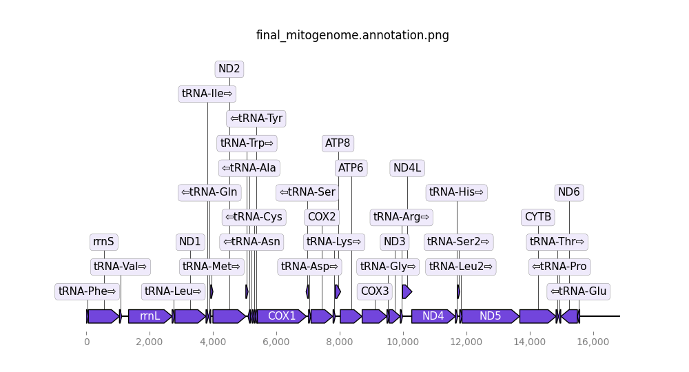

# Introduction

This tutorial will show you how to assemble a mitochondrial genome from PacBio HiFi data using MitoHiFi . 
Combined with the tutorials "VGP assembly pipeline - short version" and "Decontamination of a genome assembly", this allows you to produce a reference assembly for both the nuclear and the mitochondrial DNA of a vertebrate species. 

This tutorial uses data from the Zebra Finch (*Taeniopygia guttata*) generated by the [Vertebrate Genome Project](https://vertebrategenomesproject.org/). We downsampled the reads that didn't align with the mitochondrial genome so that the tutorial can run faster. 

> <comment-title>Run this analysis on "real" data</comment-title>
>
> If you want to run this analysis on a real sequencing library generated by the [Vertebrate Genome Project](https://vertebrategenomesproject.org/) you can find the PacBio HiFi data on [Genome Ark](https://www.genomeark.org/) as a remote repository and upload it to Galaxy (available on the three main Public Galaxy instances: .org, .eu, .org.au).
>
> 
>
>
{: .comment}

The assembly is using the wrapped workflow MitoHiFi. 
MitoHiFi: 
- Extracts mitochondrial reads (based on a BLAST against an existing reference mitogenome) and uses Hifiasm  to assemble them. 
- Removes nuclear mitochondrial DNA sequences (NUMTs) from the potential mitogenome contigs
- Generates a circularized and annotated genome for all potential mitogenome contigs
- Selects a representative for the final mitochondrial assembly


> <agenda-title></agenda-title>
>
> In this tutorial, we will cover:
>
> 1. TOC
> {:toc}
>
{: .agenda}


## Get data

> <hands-on-title> Data Upload </hands-on-title>
>
> 1. Create a new history for this tutorial
> 2. Import the files from [Zenodo]({{ page.zenodo_link }}):
>
>    ```
>    https://zenodo.org/records/13345315/files/PacBio_reads.fastqsanger.gz
>    ```
>
>    
>
> 3. Check that the datatype is `fastqsanger.gz`
>
>    
>
>
{: .hands_on}

# Download the mitogenome for a related species

To assemble the mitogenome from our PacBio Data,  MitoHiFi needs a reference mitogenome to fish out mitochondrial reads (the reads are blasted against the related reference). To download this reference, we use the tool MitoHiFi with the operation `Find a closely related species`.


> <hands-on-title>  Find a related mitogenome reference  </hands-on-title>
>
> 1.  with the following parameters:
>    - *"Operation type selector"*: `Find a close-related mitochondrial reference genome`
>        - *"Species name"*: `Taeniopygia guttata` Enter the latin name of the species you are assembling
>        - *"Email"*: `your.email@service.com` Enter your email 
>        - *"Minimal appropriate length"*: `15000` As vertebrate mitochondrial genomes are typically at least 14kbp long, we are using a value in this range so that we get complete mitogenome results as our reference. 
>
>
{: .hands_on}


## Assemble the  mitochondrial genome with **MitoHiFi**

> <hands-on-title> Assemble the mitochondrial genome </hands-on-title>
>
> 1. Create a collection with your PacBio HiFi Reads
>
>    
> 
> 2.  with the following parameters:
>    - *"Operation type selector"*: `Run MitoHiFi`
>        - *"Input mode"*: `Pacbio Hifi Reads`
>            -  *"Pacbio Hifi reads"*: `PacBio Reads` (Input dataset collection)
>        -  *"Close-related mitogenome in fasta format"*: `MitoHiFi on : reference genome (FASTA)` (output of **MitoHiFi** )
>        -  *"Close-related mitogenome in genbank format"*: `MitoHiFi on : reference genome (genbank)` (output of **MitoHiFi** )
>        - *"Genetic code"*: `Vertebrate mitochondrial code`
>        - In *"Advanced options"*:
>            - *"Blast percentage identity"*: `70` This setting filters the potential mito contigs -- setting it to 70 means that we are retaining contigs with at least 70% of its length in the BLAST match. This parameter can be lowered if you are expecting more sequence divergence among mitogenomes of your taxa, or vice versa.
>
>
{: .hands_on}


Outputs of MitoHiFi:
- Final mitogenome (FASTA). Mitochondrial genome circularized and rotated to start at tRNA-Phe.
- Final mitogenome (genbank). The final mitogenome annotated in GenBank format.
- Final mitogenome annotation (png). The predicted genes in the final mitogenome.
- Final mitogenome coverage (png). The sequencing coverage along the final mitogenome.
- Contigs stats (TSV). Contains the statistics of your assembled mitogenomes such as the number of genes, size, whether it was circularized or not, if the sequence has frameshifts, and other metrics.
- Reads mapped to close-related mtDNA (FASTA). All and filtered by size.
- Hifiasm contigs (fasta). The results of running Hifiasm on the mitochondrial reads. 




# Conclusion

In this tutorial, we learned how to assemble the mitochondrial genome using PacBio HiFi reads and MitoHiFi. You can try this tutorial on your own data using the full HiFi read set you'd use for the nuclear genome assembly, since the filtering for mitochondrial reads happens within MitoHiFi. 