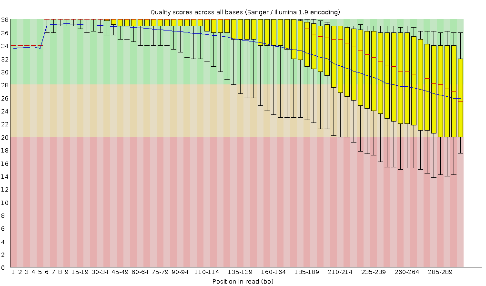

Sequencing (determining of DNA/RNA nucleotide sequence) is used all over
the world for all kinds of analysis. The product of these sequencers are
reads, which are sequences of detected nucleotides. Depending on the
technique these have specific lengths (30-500bp) or using Oxford
Nanopore Technologies sequencing have much longer variable lengths.



In this training we will build an assembly of a bacterial genome, from data produced in
"Complete Genome Sequences of Eight Methicillin-Resistant
*Staphylococcus aureus* Strains Isolated from Patients in
Japan" :

> Methicillin-resistant *Staphylococcus aureus* (MRSA) is a major pathogen
> causing nosocomial infections, and the clinical manifestations of MRSA
> range from asymptomatic colonization of the nasal mucosa to soft tissue
> infection to fulminant invasive disease. Here, we report the complete
> genome sequences of eight MRSA strains isolated from patients in Japan.
{: .quote cite=""}

> <agenda-title></agenda-title>
>
> In this tutorial, we will cover:
>
> 1. TOC
> {:toc}
>
{: .agenda}

# Galaxy and data preparation

Any analysis should get its own Galaxy history. So let's start by creating a new one and get the data into it.

> <hands-on-title>History creation</hands-on-title>
>
> 1. Create a new history for this analysis
>
>    
>
> 2. Rename the history
>
>    
>
{: .hands_on}

Now, we need to import the data: 2 FASTQ files containing the reads from the sequencer.

> <hands-on-title>Import datasets</hands-on-title>
> 1.  the files from [Zenodo]({{ page.zenodo_link }}) or from Galaxy shared data libraries:
>
>    ```
>    {{ page.zenodo_link }}/files/DRR187559_1.fastqsanger.bz2
>    {{ page.zenodo_link }}/files/DRR187559_2.fastqsanger.bz2
>    ```
>
>    
>
>    
>
>
> 2. Rename the datasets to remove `.fastqsanger.bz2` and keep only the sequence run ID (`DRR187559_1` and `DRR187559_2`)
>
>    
>
> 3. Tag both datasets `#unfiltered`
>
>    
>
> 4. **View**  the renamed file
>
{: .hands_on}

The datasets are both FASTQ files.

> <question-title></question-title>
>
> 1. What are the 4 main features of each read in a FASTQ file.
> 2. What does the `_1` and `_2` mean in your filenames?
>
> > <solution-title></solution-title>
> > 1. The following:
> >
> >    -   A `@` followed by a name and sometimes information of the read
> >    -   A nucleotide sequence
> >    -   A `+` (optional followed by the name)
> >    -   The quality score per base of nucleotide sequence (Each symbol
> >        represents a quality score, which will be explained later)
> >
> > 2. Forward and reverse reads, by convention, are labelled `_1` and `_2`, but they might also be `_f`/`_r` or `_r1`/`_r2`.
> {: .solution}
{: .question}

# Quality Control

During sequencing, errors are introduced, such as incorrect nucleotides being called. These are due to the technical limitations of each sequencing platform. Sequencing errors might bias the analysis and can lead to a misinterpretation of the data. Adapters may also be present if the reads are longer than the fragments sequenced and trimming these may improve the number of reads mapped. **Sequence quality control is therefore an essential first step in any analysis.**

Assessing the quality by hand would be too much work. That's why tools like
[NanoPlot](https://github.com/wdecoster/NanoPlot) or
[FastQC](http://www.bioinformatics.babraham.ac.uk/projects/fastqc/) are made, as they  generate a summary and plots of the data statistics. NanoPlot is
mainly used for long-read data, like ONT and PACBIO and FastQC for short read,
like Illumina and Sanger. You can read more in our dedicated [Quality Control
Tutorial]().

Before doing any assembly, the first questions we should ask about the input
reads include:

- What is the coverage of my genome?
- How good are my reads?
- Do I need to ask/perform for a new sequencing run?
- Is it suitable for the analysis I need to do?

> <hands-on-title>Quality Control</hands-on-title>
>
> 1.  with the following parameters:
>    -  *"Short read data from your current history"*: both `DRR187559_1` and `DRR187559_2`
>
>    
>
> 2. Inspect the webpage outputs
>
{: .hands_on}

FastQC combines quality statistics from all separate reads and combines them in plots. An important plot is the Per base sequence quality. 

DRR187559_1 | DRR187559_2
----------- | -----------
 | 

Here you have the reads sequence length on the x-axes against the quality score (Phred-score) on the y-axis. The y-axis is divided in three sections: 
- Green = good quality, 
- Orange = mediocre quality, and 
- Red = bad quality.

For each position, a boxplot is drawn with:

- the median value, represented by the central red line
- the inter-quartile range (25-75%), represented by the yellow box
- the 10% and 90% values in the upper and lower whiskers
- the mean quality, represented by the blue line

For Illumina data it is normal that the first few bases are of some lower quality and how longer the reads get the worse the quality becomes. This is often due to signal decay or phasing during the sequencing run.


Before doing any assembly, the first questions we should ask about the input
reads include:

- What is the coverage of my genome?
- How good are my reads?
- Do I need to ask/perform for a new sequencing run?
- Is it suitable for the analysis I need to do?

Depending on the analysis it could be possible that a certain quality or length
is needed. In this case we are going to trim the data using **fastp** ():

- Trim the start and end of the reads if those fall below a quality score of 20

  Different trimming tools have different algorithms for deciding when to cut but trimmomatic will cut based on the quality score of one base alone. Trimmomatic starts from each end, and as long as the base is below 20, it will be cut until it reaches one greater than 20. A sliding window trimming will be performed where if the average quality of 4 bases drops below 20, the read will be truncated there. 
  
- Filter for reads to keep only reads with at least 30 bases: Anything shorter will complicate the assembly

> <hands-on-title>Quality improvement</hands-on-title>
>
> 1.  with the following parameters:
>    - *"Single-end or paired reads"*: `Paired`
>        -  *"Input 1"*: `DRR187559_1`
>        -  *"Input 2"*: `DRR187559_2`
>    - In *"Filter Options"*:
>        - In *"Length filtering Options"*:
>            - *Length required*: `30`
>    - In *"Read Modification Options"*:
>        - In *"Per read cuitting by quality options"*:
>            - *Cut by quality in front (5')*: `Yes`
>            - *Cut by quality in front (3')*: `Yes`
>            - *Cutting window size*: `4`
>            - *Cutting mean quality*: `20`
>    - In *"Output Options"*:
>        - *"Output JSON report"*: `Yes`
>
> 2. Edit the tags of the **fastp** FASTQ outputs to 
>    1. Remove the `#unfiltered` tag
>    2. Add a new tag `#filtered`
{: .hands_on}

**fastp** generates also a report, similar to FASTQC, useful to compare the impact of the trimming and filtering.

> <question-title></question-title>
>
> Looking at **fastp** HTML report
>
> 1. How did the average read length change before and after filtering?
> 3. Did trimming improve the mean quality scores?
> 4. Did trimming affect the GC content?
> 5. Is this data ok to assemble? Do we need to re-sequence it?
>
> > <solution-title></solution-title>
> >
> > 1. Read lengths went down more significantly:
> >    - Before filtering: 190bp, 221bp
> >    - After filtering: 189bp, 219bp
> > 3. It increased the percentage of Q20 and Q30 bases (bases with quality score above 20 and 30 respectively)
> > 4. No, it did not. If it had, that would be unexpected.
> > 5. This data looks OK. The number of short reads in R1 is not optimal but assembly should partially work but not the entire, closed genome.
> >
> {: .solution}
{: .question}


# Assembly

Now that the quality of the reads is determined and the data is filtered and/or trimmed, we can try to assemble the reads together to build longer sequences.

There are many tools that create assembly for short-read data, e.g. SPAdes (), Abyss (). In this tutorial, we use **Shovill**. Shovill is a SPAdes-based genome assembler, improved to work faster and only for smaller (bacterial) genomes.

## Assembly



> <hands-on-title>Assembly using Shovill</hands-on-title>
>
> 1.  with the following parameters:
>    - *"Input reads type, collection or single library"*: `Paired End`
>        -  *"Forward reads (R1)"*: **fastp** `Read 1 output`
>        -  *"Reverse reads (R2)"*: **fastp** `Read 2 output`
>    - In *"Advanced options"*:
>        - *"Estimated genome size"*: `2914567`
><!--        - *"Minimum contig length"*: `500`
>-->
{: .hands_on}

**Shovill* generates 3 outputs:
- A log file
- A FASTA file with contigs, i.e. contiguous length of genomic sequences in which bases are known to a high degree of certainty.

  > <question-title></question-title>
  > Inspect the `Contigs` file
  >
  > 1. How big is the first contig?
  > 2. What is the coverage of your biggest (first) contig?
  >
  > > <solution-title></solution-title>
  > > Both of these can be found in the header line of the Contigs produced by Shovill
  > >
  > > *The results can differ from this example, because Shovill can differ a bit per assembly*
  > >
  > > 1. 589,438 bp, almost 6 times lower than the estimated genome size
  > > 2. 17.7
  > {: .solution}
  {: .question}

- A file with the contig graph or assembly graph

  The assembly graph is more information-rich because it not only contains the sequences of all assembled fragments (including the ones shorter than the threshold length defined for inclusion of the fragments into the FASTA output), but also indicates the relative average coverage of the fragments by sequenced reads and how some of the fragments could potentially be bridged after resolving ambiguities manually.

## Assembly inspection

Th assembly graph format takes some getting used to before you can make sense out of the information it provides. This issue can be alleviated through the use of **Bandage** (), a package for exploring assembly graphs through summary reports and visualizations of their contents.

> <hands-on-title>Assembly inspection</hands-on-title>
> 1.  with the following parameters:
>    -  *"Graphical Fragment Assembly"*: **Shovill** `Contig Graph`
>
{: .hands_on}

Let's look at the assembly statistics

> <question-title></question-title>
>
> 1. What is the number of dead end?
> 2. What is the number of nodes?
>
> > <solution-title></solution-title>
> >
> > 1. Only 2
> > 2. 131: a bit disapointing as it should be encoded in one contig
> {: .solution}
{: .question}

Let's now visualize the graph.

> <hands-on-title>Assembly inspection</hands-on-title>
> 1.  with the following parameters:
>    -  *"Graphical Fragment Assembly"*: **Shovill** `Contig Graph`
>    
{: .hands_on}


> <question-title></question-title>
> First read [this page in the Bandage wiki](https://github.com/rrwick/Bandage/wiki/Simple-example) to help understand what the graph means.
>
> What do you think of this assembly? Is it useful? Is it good enough?
>
> > <solution-title></solution-title>
> >
> > This is a very messy assembly, with a lot of potential paths through the sequence. We cannot feel confident in the output FASTA file (as it is much smaller than the expected 2.9Mbp). In real life we might consider doing a hybrid assembly with Nanopore or other long read data to help resolve these issues.
> >
> {: .solution}
{: .question}


## Assembly Evaluation

To evaluate the assembly, we use also [Quast](http://quast.bioinf.spbau.ru/) () (QUality ASsessment Tool), a tool providing quality metrics for assemblies. This tool can be used to compare multiple assemblies, can take an optional reference file as input to provide complementary metrics, etc

> <hands-on-title>Quality Control of assembly using Quast</hands-on-title>
>
> 1.  with the following parameters:
>    - *Assembly mode?*: `Co-assembly`
>       - *"Use customized names for the input files?"*: `No, use dataset names`
>          -  *"Contigs/scaffolds file"*: **Shovill** `Contigs` output
>
{: .hands_on}

QUAST outputs assembly metrics as an HTML file with metrics and graphs. 

This fasta file contains 

> <question-title></question-title>
>
> 1. How many contigs is there?
> 2. What is the total length of all contigs?
> 1. What is you GC content?
>
> > <solution-title></solution-title>
> >
> > 1. 32 contigs, meaning the chromosome is separated over multiple contigs. These contigs can also contain (parts of) plasmids.
> > 2. 2,911,349 (*Total length (>= 0 bp)*). Not far from the estimated genome size: 2,914,567 
> > 1. The GC content for our assembly was 32.77%. For comparison [MRSA Isolate HC1335 Strain](https://www.ncbi.nlm.nih.gov/pmc/articles/PMC5174738/) GC% is 32.89%.
> >
> {: .solution}
{: .question}

The total length and the GC content of the assembly are coherent with expectations. 

# Conclusion

In this tutorial, we prepared short reads, assembled them, and inspect the produced assembly for its quality. The assembly, even if uncomplete, is reasonable good to be used in downstream analysis, like [AMR gene detection]()
