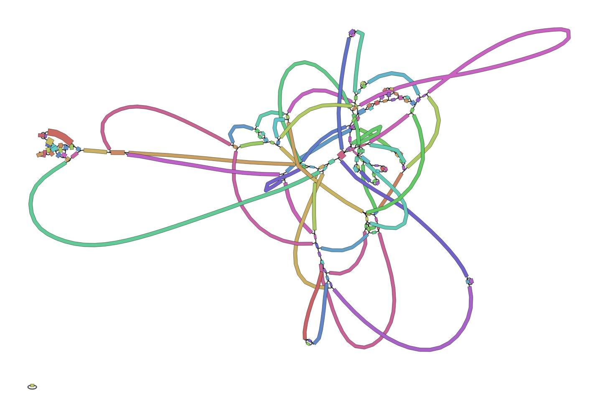
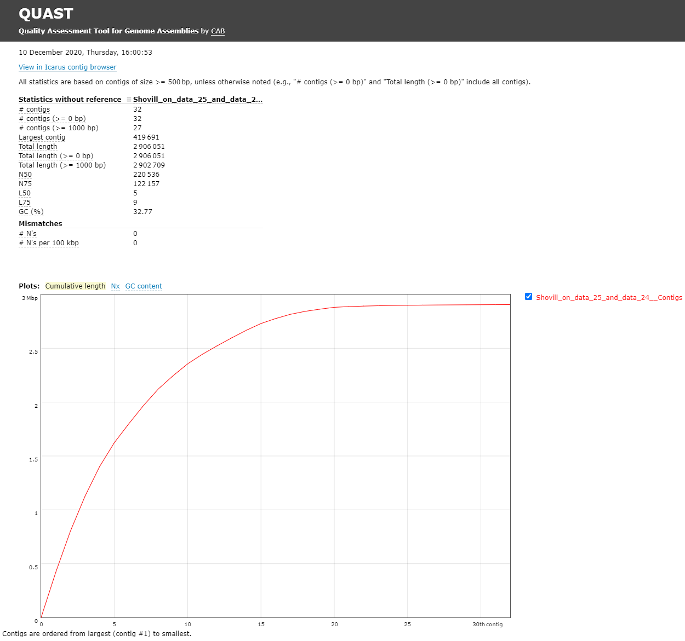

# Introduction
{:.no_toc}

In this training you're going to make an assembly of data produced by
"Complete Genome Sequences of Eight Methicillin-Resistant
Staphylococcus aureus Strains Isolated from Patients in
Japan" from  which describes:

> Methicillin-resistant Staphylococcus aureus (MRSA) is a major pathogen
causing nosocomial infections, and the clinical manifestations of MRSA
range from asymptomatic colonization of the nasal mucosa to soft tissue
infection to fulminant invasive disease. Here, we report the complete
genome sequences of eight MRSA strains isolated from patients in Japan.

> ### Agenda
>
> In this tutorial, we will cover:
>
> 1. TOC
> {:toc}
>
{: .agenda}

# Background

Sequencing (determining of DNA/RNA nucleotide sequence) is used all over
the world for all kinds of analysis. The product of these sequencers are
reads, which are sequences of detected nucleotides. Depending on the
technique these have specific lengths (30-500bp) or using Oxford
Nanopore Technologies sequencing have much longer variable lengths.



> ###  Hands-on: Data upload
>
> 1. Create a new history for this tutorial
> 2.  the files from [Zenodo](https://zenodo.org/record/4304328/) or from the shared data library
>
>    ```
>    https://zenodo.org/record/4304328/files/DRR187567_1.fastq.bz2
>    https://zenodo.org/record/4304328/files/DRR187567_2.fastq.bz2
>    ```
>
>    
>    
>
> 3. Convert the datatype of this output to uncompress it
>
>    
>
> 4. Rename the uncompressed dataset to just the sequence run ID: `DRR187567_1` and `DRR187567_2`
>
>    
>
> 5. Tag the dataset `#unfiltered`
>
>    
>
> 6. **View**  the renamed file
>
>    > ###  Question
>    >
>    > 1. What are the 4 main features of each read in a fastq file.
>    > 2. What does the `_1` and `_2` mean in your filenames?
>    >
>    > > ###  Solution
>    > > 1. The following:
>    > >
>    > >    -   A `@` followed by a name and sometimes information of the read
>    > >    -   A nucleotide sequence
>    > >    -   A `+` (optional followed by the name)
>    > >    -   The quality score per base of nucleotide sequence (Each symbol
>    > >        represents a quality score, which will be explained later)
>    > >
>    > > 2. Forward and reverse reads, by convention, are labelled `_1` and `_2`, but they might also be `_f`/`_r` or `_r1`/`_r2`.
>    > {: .solution}
>    {: .question}
{: .hands_on}

# Quality Control

When assessing the fastq files all bases had their own quality (or Phred score)
represented by symbols. You can read more in our dedicated [Quality Control
Tutorial]().

To assess the quality by hand would be too much work. That's why tools like
[NanoPlot](https://github.com/wdecoster/NanoPlot) or
[FastQC](http://www.bioinformatics.babraham.ac.uk/projects/fastqc/) are made,
which will generate a summary and plots of the data statistics. NanoPlot is
mainly used for long-read data, like ONT and PACBIO and FastQC for short read,
like Illumina and Sanger.

> ###  Hands-on: QC & Filtering
>
> 1.  with the following parameters:
>    -  *"Short read data from your current history"*: `DRR187567_1` and `DRR187567_2`
>
> 2. Examine the output "WebPage" files
>
{: .hands_on}

DRR187559_1 | DRR187559_2
----------- | -----------
 | 

FastQC combines all quality statistics from all separate reads and combines them in plots. An important plot is the Per base sequence quality. Here you have the reads sequence length on the x-axes against the quality score (Phred-score) on the y-axis. The y-axis is divided in three sections: Green = good quality, Orange = mediocre quality and red = bad quality. For Illumina data it is normal that the first few bases are of some lower quality and how longer the reads get the worse the quality becomes. This is often due to signal decay or phasing during the sequencing run.

For each position, a boxplot is drawn with:

- the median value, represented by the central red line
- the inter-quartile range (25-75%), represented by the yellow box
- the 10% and 90% values in the upper and lower whiskers
- the mean quality, represented by the blue line

Depending on the analysis it could be possible that a certain quality or length is needed. In this case we’re going to trim the data using Trimmomatic.


> ###  Hands-on: Assessing the data quality of the trimmed reads and comparing to the input reads
>
> 1. **Trimmomatic**  with the following parameters:
>    - *"Single-end or paired-end reads?"*: `Paired-end (two separate input files)`
>        -  *"Input FASTQ file (R1/first of pair)"*: `DRR187559_1 uncompressed`
>        -  *"Input FASTQ file (R2/second of pair)"*: `DRR187559_1 uncompressed`
>    - *"Perform initial ILLUMINACLIP step?"*: `Yes`
>    - In *"Trimmomatic Operation"*:
>        -  *"Insert Trimmomatic Operation"*
>            - *"Select Trimmomatic operation to perform"*: `Cut bases off the start of a read, if below a threshold quality (LEADING)`
>                - *"Minimum quality required to keep a base"*: `20`
>        -  *"Insert Trimmomatic Operation"*
>            - *"Select Trimmomatic operation to perform"*: `Cut bases off the end of a read, if below a threshold quality (TRAILING)`
>                - *"Minimum quality required to keep a base"*: `20`
>        -  *"Insert Trimmomatic Operation"*
>            - *"Select Trimmomatic operation to perform"*: `Sliding window trimming (SLIDINGWINDOW)`
>                - *"Number of bases to average across"*: `4`
>                - *"Average quality required"*: `20`
>        -  *"Insert Trimmomatic Operation"*
>            - *"Select Trimmomatic operation to perform"*: `Drop reads below a specified length (MINLEN)`
>                - *"Minimum length of reads to be kept"*: `30`
>
>    This produces two sets of output files, the R1/R2 paired, and R1/R2 unpaired.
>
>    - The first first two are the paired reads, the reads in each of those files match up.
>    - The second two are the unpaired reads where one of the two reads was discarded.
>
> 2. Edit the tags of the trimmomatic outputs. Remove the `#unfiltered` tag and add a new tag, `#filtered`
>
>    
>
> 3.  with the following parameters:
>    -  *"Short read data from your current history"*: `Trimmomatic on DRR187567_1 (R1 Paired)` and `Trimmomatic on DRR187567_2 (R2 Paired)`
>
> 4.  with the following parameters:
>    - In *"Results"*:
>        -  *"Insert Results"*
>            - *"Which tool was used generate logs?"*: `FastQC`
>                - In *"FastQC output"*:
>                    -  *"Insert FastQC output"*
>                        -  *"FastQC output"*: select **all** of the RawData files.
>
{: .hands_on}

MultiQC is a tool to combine multiple outputs in one clear and easy to read overview. It generates plots to easily visualize the different quality statistics of all your fastq files.

> ###  Question
>
> 1. How many reads do all files have? Is it a coincidence that the forward and reverse files have the same number of reads?
> 2. What is the decrease in total bases for your forward and reverse file?
> 3. What would be the coverage before and after trimming, based on a genome size of 2,914,567bp?
>
> > ###  Solution
> > 1. This can be found in the original FastQC reports most easily.
> >
> >    File                | Reads
> >    ----                | -----
> >    DRR187559_1         | 451782 reads
> >    DRR187559_2         | 451782 reads
> >    Trimmed DRR187559_1 | 437144 reads
> >    Trimmed DRR187559_1 | 437144 reads
> >
> > 2. The calculations follow. We're asked for total bases, and none of the tools report this, so we need to infer this from the mean read lengths. Using the original numbers in the above table combined with the "Length" column of MultiQC's "General Statistics" section.
> >
> >    - Forward: (451782 * 190) – (437144 * 151) = 19829836 bp (23.18% decrease)
> >    - Reverse: (451782 * 221) – (437144 * 191) = 16349318 bp (16.25% decrease)
> >
> > 3. What would be the coverage before and after trimming, based on a genome size of 2,914,567bp?
> >
> >    - Forward: (451782 * 190.8503437) = 86,222,750 bases
> >    - Reverse: (451782 * 221.4850348) = 100,062,952 bases
> >    - 86,222,750 + 100,062,952 = 186,285,702 bases
> >    - 186,285,702 /2,914,567 = 63.9 coverage
> >    - Trim Forward: (437144 * 151.5129889) = 66,232,994 bases
> >    - Trim Reverse: (437144 * 191.6990374) = 83,800,084 bases
> >    - 66,232,944 + 83,800,084 = 150,033,078 bases
> >    - 150,033,078/2,914,567 = 51.5 coverage
> >
> {: .solution}
{: .question}


# Assembly

When the quality of the reads is determined and the data is filtered and/or
trimmed an assembly can be made. There are many tools that create assembly for
long-read data, but in this tutorial Shovill will be used. Shovill is a SPAdes
based genome assembler, improved to work faster and only for smaller
(bacterial) genomes.



> ###  Hands-on: Assembly using Shovill
>
> 1. **Shovill**  with the following parameters:
>    - *"Input reads type, collection or single library"*: `Paired End`
>        -  *"Forward reads (R1)"*: `Trimmomatic on DRR187567_1 uncompressed (R1 paired)`
>        -  *"Reverse reads (R2)"*: `Trimmomatic on DRR187567_2 uncompressed (R2 paired)`
>    - In *"Advanced options"*:
>        - *"Estimated genome size"*: `2914567`
>        - *"Minimum contig length"*: `500`
>
> 2. View  the `Contigs` file:
>
>    > ###  Question
>    > 1. How big is the first contig?
>    > 2. What is the coverage of your biggest (first) contig?
>    >
>    > > ###  Solution
>    > > Both of these can be found in the header line of the Contigs produced by Shovill
>    > >
>    > > *NOTE: The results can differ from this example, because Shovill can differ a bit per assembly*
>    > >
>    > > 1. 419691 bp
>    > > 2. 14.1
>    > {: .solution}
>    {: .question}
>
> 3.  with the following parameters:
>
>    -  *"Graphical Fragment Assembly"*: `Shovill on ... Contig Graph`
>
> 4. View  the assembly graph image
>
>    
{: .hands_on}

## QC

[Quast](http://quast.bioinf.spbau.ru/) ({% cite Gurevich2013% %})
is a tool providing quality metrics for assemblies, and can also be used
to compare multiple assemblies. The tool can also take an optional
reference file as input, and will provide complementary metrics. QUAST
stands for QUality ASsessment Tool. With later updates gene annotation
also possible with QUAST.

> ###  Hands-on: Quality Control of assembly using Quast
>
> 1.  with the following parameters:
>    - *"Use customized names for the input files?"*: `No, use dataset names`
>        -  *"Contigs/scaffolds file"*: `Shovill on ... Contigs`
>
> 2. View  the HTML report from QUAST
>
>    The Quast tool outputs assembly metrics as an html file with metrics and
>    graphs. The image below looks exceptionally boring. This is a good
>    thing, because each corner means one contig. A contig is the contiguous
>    sequence made by combining all separate reads in the assembly
>
>    
>
{: .hands_on}


This fasta file contains 32 contigs, meaning the chromosome is separated over multiple contigs. These contigs can also contain (parts of) plasmids.

> ###  Question
> 1. What is you GC content?
> 2. Is your GC content similar compared to other MRSA strains?
>
> > ###  Solution
> > 1. The GC content for our assembly was 32.77% (for comparison [MRSA Isolate HC1335 Strain](https://www.ncbi.nlm.nih.gov/pmc/articles/PMC5174738/) GC% is 32.89%). This means the length and GC% of the assembly could be good!
> >
> > 2. Compare your own data vs the above.
> {: .solution}
{: .question}

# Identification of AMR Genes

Because we are working with a MRSA we are curious to see which resistance genes are located on the genome or on the plasmid. To determine whether the contigs contain antimicrobial resistance (AMR) genes [staramr](https://github.com/phac-nml/staramr) can be used  **Staramr** scans bacterial genome contigs against both the **ResFinder** (), **PointFinder** (), and **PlasmidFinder** () databases (used by the ResFinder webservice) and compiles a summary report of detected antimicrobial resistance genes.

> ###  Hands-on: Run staramr
>
> 1.  with the following parameters:
>    -  *"genomes"*: `Shovill on data ... Contigs`
>
>    There are 7 different output files produced by **staramr** tool:
>
>    File                  | Contents
>    --------------------- | ---
>    summary.tsv           | A summary of all detected AMR genes/mutations in each genome, one genome per line.
>    detailed_summary.tsv  | A detailed summary of all detected AMR genes/mutations of each genome, one line per feature and multiple lines per genome.
>    resfinder.tsv         | A tabular file of each AMR gene and additional BLAST information from the **ResFinder** database, one gene per line.
>    Plasmidfinder.tsv     | A tabular file of each plastid sequences with additional BLAST information from the **PlasmidFinder** database, one sequence per line.
>    settings.txt          | The command-line, database versions, and other settings used to run staramr.
>    mlst.tsv              | A tabular file of the found loci per genome with its specified MLST scheme.
>    results.xlsx          | An Excel spreadsheet containing the previous 4 files as separate worksheets.
>
> 2. View  the detailed_summary.tsv file
>    - In this example the ST-typing could not be obtained. Multi-locus sequence type (MLST) is based on specific locus/alleles, which is sometimes hard to determine with error rich sequence data (like NanoPore).
>    - For the plasmid and resistance results the identity, overlap, length and the location on the contig can be found here.
>    - Multiple rep sequences are located on the second contig. (See "plasmid typing for gram-positive bacteria"  for more information)
>    - Multiple resistance genes can be found on both contig 1 and contig 2.
>
{: .hands_on}


## CARD database

To get more information about these antibiotic resistant genes, you can check the [CARD database](https://card.mcmaster.ca) (**C**omprehensive **A**ntibiotic **R**esistance **D**atabase) ()


CARD can be very helpful to check all the resistance genes and check if
it is logical to find the resistance gene in a specific bacteria.

> ###  Question
> 1. To what family does [mecA](https://card.mcmaster.ca/ontology/36911) belong?
> 2. Do you aspect to find this gene in this MRSA strain and why?
> > ###  Solution
> > 1. [Methicillin resistant PBP2](https://card.mcmaster.ca/ontology/37589)
> > 2. The strain we use is a Methicillin(multi) resistant Staphylococcus aureus. As `mecA` has a perfect resistome mach with *S. aureus*, and the AMR Gene Family is methicillin resistant PBP2, we expect to see mecA in MRSA.
> {: .solution}
{: .question}

## Gene annotation using Prokka

[Prokka](https://github.com/tseemann/prokka/blob/master/README.md) is a
tool software tool to rapidly annotate bacterial, archaeal and viral
genomes. Prokka will be used on your own made genome (assembly). Prokka
will try to annotate the bacteria based on related species and starting
codons can be chosen or default of the species can be used.

[JBrowse](https://jbrowse.org/docs/tutorial.html) is used to visualize
your genome file and merge multiple outputs.\
In this case you will use your assembly as your reference and the output
from prokka as an information track.


> ###  Hands-on: Annotating the Genome
>
> 1.  with the following parameters:
>    -  *"Contigs to annotate"*: `Shovill on data ... Contigs`
>    - *"Genus name (--genus)"*: `staphylococcus `
>    - *"Species name (--species)"*: `aureus`
>    - *"Kingdom (--kingdom)"*: `Bacteria`
>    - *"Additional outputs"*: Select only the "Annotation in GFF3 format contaianing both sequences and annotations"
>
> 2.  with the following parameters:
>    -  *"Select lines from"*: `staramr on data .. detailed_summary.tsv`
>    - *"that"*: Matching
>    - *"the pattern"*: `[0-9]+\.[0-9]+\t`
>
>    This will select lines with a decimal value (###.##) followed by a tab character, the column separator in Galaxy. As a result, any lines without an identity value will be filtered out.
>
> 3. 
>    -  *"Table"*: the output of the above **Select lines**  step.
>    - *"Record ID column or value"*: `8`
>    - *"Feature start column or value"*: `9`
>    - *"Feature end column or value"*: `10`
>    - *"Feature score column or value"*: `5`
>    - *"Feature source column or value"*: `3`
>    -  *"Insert Qualifiers"*
>        - *"Name"*: `Name`
>        - *"Qualifier value column or raw text"*: `2`
>    -  *"Insert Qualifiers"*
>        - *"Name"*: `phenotype`
>        - *"Qualifier value column or raw text"*: `4`
>
> 4.  with the following parameters:
>    - *"Is this single or paired library"*: `Paired-end`
>        -  *"FASTA/Q file #1"*: `Trimmomatic on DRR187567_1 uncompressed (R1 paired)` (output of **Trimmomatic** )
>        -  *"FASTA/Q file #2"*: `Trimmomatic on DRR187567_2 uncompressed (R2 paired)` (output of **Trimmomatic** )
>    - *"Will you select a reference genome from your history or use a built-in index?"*: `Use a genome from the history and build index`
>        -  *"Select reference genome"*: `contigs` (output of **Shovill** )
>    - *"Select analysis mode"*: `1: Default setting only` - You should have a look at the non-default parameters and try to understand them, but they don't need to be changed currently.
>    - *"Save the bowtie2 mapping statistics to the history"*: `Yes`
>
> 5.  with the following parameters:
>    - *"Reference genome to display"*: `Use a genome from history`
>        -  *"Select the reference genome"*: `consensus` (output of **Shovill assembly** )
>    - *"Genetic Code"*: `11. The Bacterial, Archaeal and Plant Plastid Code`
>    - In *"Track Group"*:
>        -  *"Insert Track Group"*
>            - *"Track Category"*: `Prokka`
>            - In *"Annotation Track"*:
>                -  *"Insert Annotation Track"*
>                    - *"Track Type"*: `GFF/GFF3/BED Features`
>                        -  *"GFF/GFF3/BED Track Data"*: `out_gff` (output of **Prokka** )
>                        - *"JBrowse Track Type [Advanced]"*: `Neat Canvas Features`
>                        - *"Track Visibility"*: `On for new users`
>        -  *"Insert Track Group"*
>            - *"Track Category"*: `AMR`
>            - In *"Annotation Track"*:
>                -  *"Insert Annotation Track"*
>                    - *"Track Type"*: `GFF/GFF3/BED Features`
>                        -  *"GFF/GFF3/BED Track Data"*: `Table to GFF3 on ...`, the output of the table to gff3 step
>                        - *"JBrowse Track Type [Advanced]"*: `Neat Canvas Features`
>                        - *"Track Visibility"*: `On for new users`
>        -  *"Insert Track Group"*
>            - *"Track Category"*: `Sequencing`
>            - In *"Annotation Track"*:
>                -  *"Insert Annotation Track"*
>                    - *"Track Type"*: `BAM Pileups`
>                        -  *"BAM Track Data"*: Bowtie2's output
>                        - *"Autogenerate SNP Track"*: `Yes`
>
> 3. View the output of JBrowse
>
{: .hands_on}

In the output of the JBrowse you can view the mapped reads and the found genes against the reference genome. With the search tools you can easily find genes of interest. JBrowse can handle many inputs and can be very useful. Using the bowtie2 mapping output, low coverage regions can be detected. This SNP detection can also give a clear view of where the data was less reliable or where variations were located.

If it takes too long to build the JBrowse instance, you can view an embedded one here. (**Warning**: feature name search will not work.)



# Conclusion
{:.no_toc}
