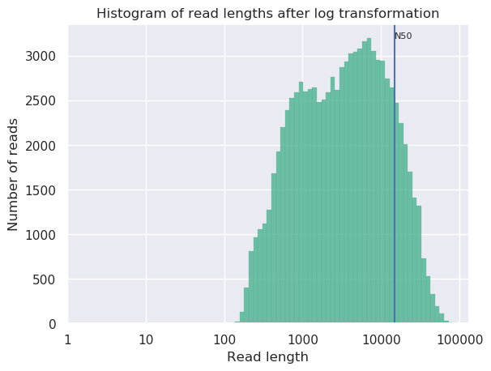
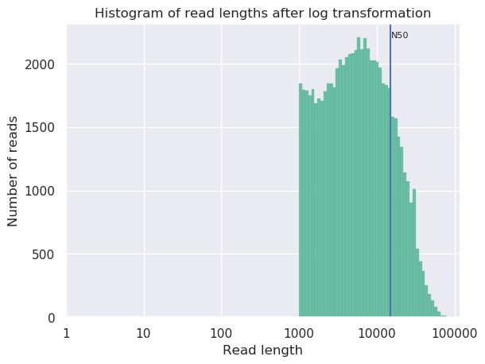
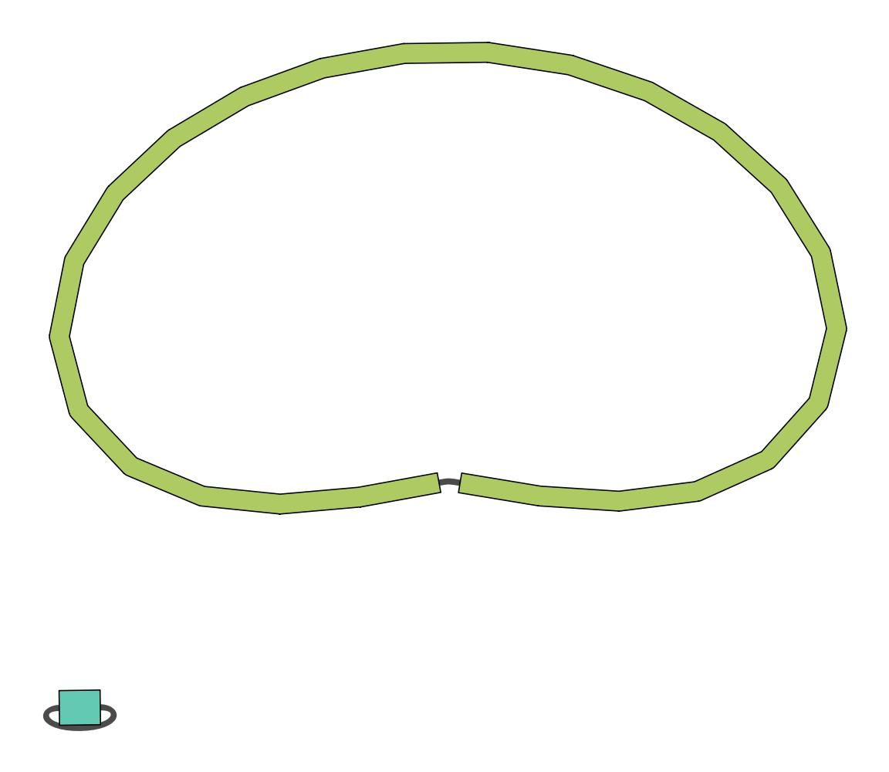
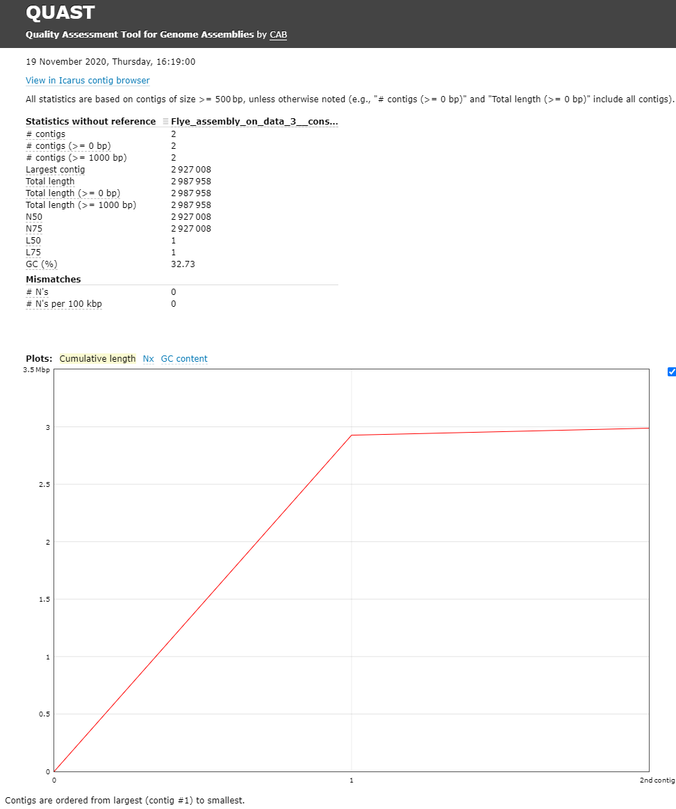
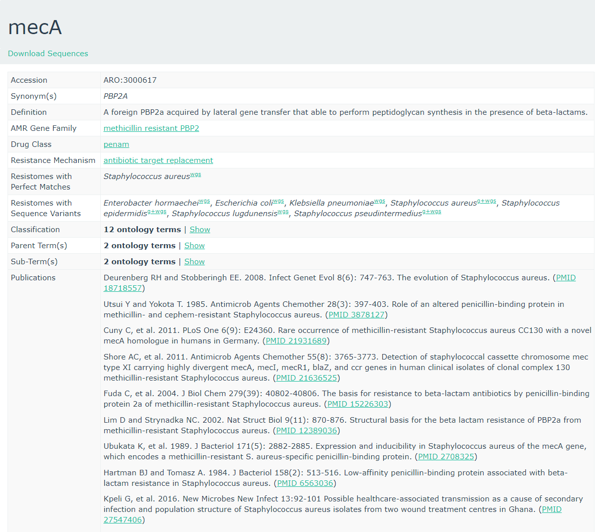
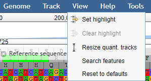
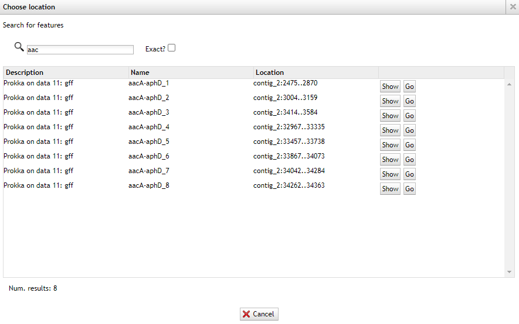
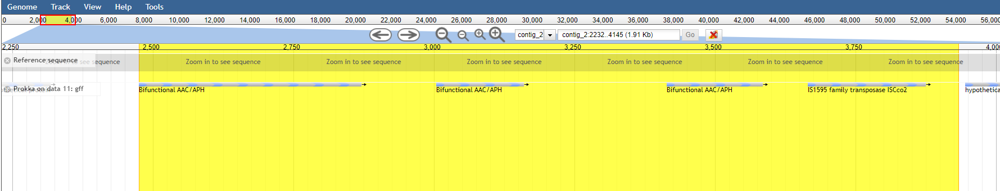

# Introduction
{:.no_toc}

In this training you're going to make an assembly of data produced by
"Complete Genome Sequences of Eight Methicillin-Resistant
*Staphylococcus aureus* Strains Isolated from Patients in
Japan" from  which describes:

> Methicillin-resistant *Staphylococcus aureus* (MRSA) is a major pathogen
causing nosocomial infections, and the clinical manifestations of MRSA
range from asymptomatic colonization of the nasal mucosa to soft tissue
infection to fulminant invasive disease. Here, we report the complete
genome sequences of eight MRSA strains isolated from patients in Japan.

> ### Agenda
>
> In this tutorial, we will cover:
>
> 1. TOC
> {:toc}
>
{: .agenda}

# Background

Sequencing (determining of DNA/RNA nucleotide sequence) is used all over
the world for all kinds of analysis. The product of these sequencers are
reads, which are sequences of detected nucleotides. Depending on the
technique these have specific lengths (30-500bp) or using Oxford
Nanopore Technologies sequencing have much longer variable lengths.



> ###  Hands-on: Data upload
>
> 1. Create a new history for this tutorial
> 2.  the files from [Zenodo]({{ page.zenodo_link }}) or from the shared data library
>
>    ```
>    {{ page.zenodo_link }}/files/DRR187567.fastq.bz2
>    ```
>
>    
>
>    
>
> 3. Convert the datatype of this output to uncompress it
>
>    
>
> 4. Rename the dataset to just the sequence run ID: `DRR187567`
>
>    
>
> 5. Tag the dataset `#unfiltered`
>
>    
>
> 6. **View**  the renamed file
>
>    > ###  Question
>    >
>    > 1. What are the 4 main features of each read in a fastq file.
>    > 2. What is the name of your first read?
>    >
>    > > ###  Solution
>    > > 1. The following:
>    > >
>    > >    -   A `@` followed by a name and sometimes information of the read
>    > >    -   A nucleotide sequence
>    > >    -   A `+` (optional followed by the name)
>    > >    -   The quality score per base of nucleotide sequence (Each symbol
>    > >        represents a quality score, which will be explained later)
>    > >
>    > > 2. `DRR187567.1`
>    > {: .solution}
>    {: .question}
{: .hands_on}

# Quality Control

When assessing the fastq files all bases had their own quality (or Phred score)
represented by symbols. You can read more in our dedicated [Quality Control
Tutorial]().

To assess the quality by hand would be too much work. That's why tools like
[NanoPlot](https://github.com/wdecoster/NanoPlot) or
[FastQC](http://www.bioinformatics.babraham.ac.uk/projects/fastqc/) are made,
which will generate a summary and plots of the data statistics. NanoPlot is
mainly used for long-read data, like ONT and PACBIO and FastQC for short read,
like Illumina and Sanger.

Depending on the analysis it could be possible that a certain quality or length
is needed. The reads can be filtered using the tool
[Filtlong](https://github.com/rrwick/Filtlong). In this training all reads
below 1000bp will be filtered.

Before doing any assembly, the first questions you should ask about your input
reads include:

- What is the coverage of my genome?
- How good are my reads?
- Do I need to ask/perform for a new sequencing run?
- Is it suitable for the analysis I need to do?

> ###  Hands-on: QC & Filtering
>
> 1.  with the following parameters:
>    -  *"Input FASTQ"*: `DRR187567` (output of **Convert compressed file to uncompressed.** )
>    - In *"Output thresholds"*:
>        - *"Min. length"*: `1000`
>
> 2. Rename the dataset to `DRR187567-filtered`
>
>    
>
> 3. Tag the dataset `#filtered`
>
>    
>
> 3.  with the following parameters:
>    - *"Select multifile mode"*: `batch`
>        - *"Type of the file(s) to work on"*: `fastq`
>            -  *"files"*: **both** `DRR187567` and `DRR187567-filtered`
>    - In *"Options for customizing the plots created"*:
>        - *"Show the N50 mark in the read length histogram."*: `Yes`
>
{: .hands_on}

In principle we just ran the NanoPlot 2 times. For this reason, we have two
reports we want to view and compare!

Comparing different output files is easier if we can view more than one dataset
simultaneously. The Scratchbook function allows us to build up a collection of
datasets that will be shown on the screen together.



Open both NanoPlot HTML Reports and check the **General summary** section of each to compare the results:

General summary     | Not Filtered   | Filtered (Filtlong) | Change (%)
------------------- | -------------- | ------------------- | ----------
Mean read length    | 6,813.0        | 8,721.1             | 28.0%
Mean read quality   | 9              | 9                   | 0.0%
Median read length  | 3,400.0        | 5,451.0             | 60.3%
Median read quality | 8.9            | 9.0                 | -1.1%
Number of reads     | 91,288.0       | 69,906.0            | -23.4%
Read length N50     | 14,810.0       | 15,102.0            | 2.0%
Total bases         | 621,945,741.0  | 609,657,642.0       | -2.0%

Before | After
------ | ----
 | 

> ###  Question
>
> 1. What is the increase of your median read length?
> 2. What is the decrease in total bases?
> 3. What is coverage?
> 4. What would be the coverage before and after trimming, based on a genome size of 2.9 Mbp?
>
> > ###  Solution
> > 1. 3,400.0 to 5,451.0, a 60.3% increase
> > 2. -2.0% decrease, not a very significant decrease so our data was quite good to start with and didn't have many short reads which were removed.
> > 3. Coverage is a measure of, on average, how many reads 'cover' a single base in the genome. If you divide the total reads, by the genome size, you will get a number how many times your genomes could theoretically be ‘covered’ by reads.
> > 4. Before $$ \frac{621,945,741}{2,900,000} = 214.4$$ and after $$ \frac{609,657,642}{2,900,000} = 210.2$$. This is *not* a very big decrease in coverage, so no cause for concern. Generally in sequencing experiments you have some minimum coverage you expect to see based on how much of your sample you sequenced. If it falls below that threshold it might be cause for concern.
> >
> > Additionally many people do not do any filtering or QC steps with their NanoPore data, it is expected that the quality is low, and often the focus is on assembling large <abbr title="structural variations">SVs</abbr> rather than having high quality reads and base-level variation analyses.
> {: .solution}
{: .question}

While there is currently no community consensus over
the best trimming or filtering practices with long read data, there are still
some steps that can be beneficial to do for the assembly process.

is a commonly used tool for removing adapter sequences, and we used

for removing shorter reads which might make the assembly process more difficult.

# Assembly

When the quality of the reads is determined and the data is filtered (like we
did with filtlong) and/or trimmed (like is more often done with short read data)
an assembly can be made.

There are many tools that create assembly for long-read data, but in this
tutorial [Flye](https://github.com/fenderglass/Flye) will be used. Flye is a de
novo assembler for single molecule sequencing reads. It can be used from
bacteria to human assemblies. The Flye assembly is based on finding overlapping
reads with variable length with high error tolerance. Flye will output the
assembly in a .fasta file, which looks like a .fastq file without the 3rd and
4th line for the "+" sign and the quality score.



> ###  Hands-on: Assembly using Flye
>
> 1.  with the following parameters:
>    -  *"Input reads"*: `DRR187567-filtered` (output of **filtlong** )
>    - *"estimated genome size (for example, 5m or 2.6g)"*: `2.8m` or `2800000` (average genome size of MRSA)
>
> 2. View  the `assembly_info` output and check the *General summary* table in the assembly info file, and compare the results.
>
>    #seq_name | length  | cov. | circ. | repeat | mult. | graph_path
>    --------- | ------  | ---- | ----- | ------ | ----- | ----------
>    contig_1  | 60303   | 1504 | +     | +      | 6     | 1
>    contig_2  | 2927029 | 181  | +     | -      | 1     | 2
>
>    *NOTE: The results can differ from this example, because Flye can differ a bit per assembly*
>
> 3.  with the following parameters:
>
>    -  *"Graphical Fragment Assembly"*: `Flye assembly on data .. (Graphical Fragment Assembly)`
>
> 4. View  the assembly graph image
>
>    
{: .hands_on}

> ###  Question
>
> 1. How many contigs do you have?
> 2. What is the coverage of your longest contig?
> 3. What is the length of your longest contig?
> 4. Does this feel like potentially a MRSA genome?
>
> > ###  Solution
> > While results may vary due to randomness in the assembly process, in our case we had:
> >
> > 1. 2
> > 2. 181
> > 2. 2.9mb
> > 3. Yes, you've got one 2.9Mb genome which is approximately the size of a MRSA genome, and one small potential plasmid genome.
> {: .solution}
{: .question}

## QC

[Quast](http://quast.bioinf.spbau.ru/) ()
is a tool providing quality metrics for assemblies, and can also be used
to compare multiple assemblies. The tool can also take an optional
reference file as input, and will provide complementary metrics. QUAST
stands for QUality ASsessment Tool. With later updates gene annotation
also possible with QUAST.

> ###  Hands-on: Quality Control of assembly using Quast
>
> 1.  with the following parameters:
>    - *"Use customized names for the input files?"*: `No, use dataset names`
>        -  *"Contigs/scaffolds file"*: `consensus` (output of **Flye assembly** )
>
> 2. View  the HTML report from QUAST
>
>    The Quast tool outputs assembly metrics as an html file with metrics and
>    graphs. The image below looks exceptionally boring. This is a good
>    thing, because each corner means one contig. A contig is the contiguous
>    sequence made by combining all separate reads in the assembly
>
>    
>
{: .hands_on}

One can see that there are two contigs. The largest contig is 2,927,008
bp (for comparison [MRSA Isolate HC1335
Strain](https://www.ncbi.nlm.nih.gov/pmc/articles/PMC5174738/) genome
length was 2,976,370 bp) and the smallest is 2,987,958 (total length) -
2,927,008 (length of the largest) = 60,950 bp. sequencing. The length of
the largest contig can mean that it is the total chromosomal DNA of the *S. aureus*.

> ###  Question
>
> 1. What is you GC content?
>
> > ###  Solution
> >
> > 1. The GC content for our assembly was 32.73% (for comparison [MRSA Isolate HC1335 Strain](https://www.ncbi.nlm.nih.gov/pmc/articles/PMC5174738/) GC% is 32.89%). This means the length and GC% of the assembly could be good!
> >
> {: .solution}
{: .question}

# Identification of AMR Genes

Because we are working with a MRSA we are curious to see which resistance genes are located on the genome or on the plasmid. To determine whether the contigs contain antimicrobial resistance (AMR) genes [staramr](https://github.com/phac-nml/staramr) can be used  **Staramr** scans bacterial genome contigs against both the **ResFinder** (), **PointFinder** (), and **PlasmidFinder** () databases (used by the ResFinder webservice) and compiles a summary report of detected antimicrobial resistance genes.

> ###  Hands-on: Run staramr
>
> 1.  with the following parameters:
>    -  *"genomes"*: `consensus` (output of **Flye assembly** )
>
>    There are 7 different output files produced by **staramr** tool:
>
>    File                  | Contents
>    --------------------- | ---
>    summary.tsv           | A summary of all detected AMR genes/mutations in each genome, one genome per line.
>    detailed_summary.tsv  | A detailed summary of all detected AMR genes/mutations of each genome, one line per feature and multiple lines per genome.
>    resfinder.tsv         | A tabular file of each AMR gene and additional BLAST information from the **ResFinder** database, one gene per line.
>    Plasmidfinder.tsv     | A tabular file of each plastid sequences with additional BLAST information from the **PlasmidFinder** database, one sequence per line.
>    settings.txt          | The command-line, database versions, and other settings used to run staramr.
>    mlst.tsv              | A tabular file of the found loci per genome with its specified MLST scheme.
>    results.xlsx          | An Excel spreadsheet containing the previous 4 files as separate worksheets.
>
> 2. View  the detailed_summary.tsv file
>    - In this example the ST-typing could not be obtained. Multi-locus sequence type (MLST) is based on specific locus/alleles, which is sometimes hard to determine with error rich sequence data (like NanoPore).
>    - For the plasmid and resistance results the identity, overlap, length and the location on the contig can be found here.
>    - Multiple rep sequences are located on the second contig. (See "plasmid typing for gram-positive bacteria"  for more information)
>    - Multiple resistance genes can be found on both contig 1 and contig 2.
>    - In the last column there are "Accession" numbers. These are references to NCBI, and you can search for these numbers there. E.g. [M13771](https://www.ncbi.nlm.nih.gov/nuccore/M13771)
>
{: .hands_on}


## CARD database

To get more information about these antibiotic resistant genes, you can check the [CARD database](https://card.mcmaster.ca) (**C**omprehensive **A**ntibiotic **R**esistance **D**atabase) ()



CARD can be very helpful to check all the resistance genes and check if
it is logical to find the resistance gene in a specific bacteria.

> ###  Question
>
> 1. To what family does [mecA](https://card.mcmaster.ca/ontology/36911) belong?
> 2. Do you expect to find this gene in this MRSA strain and why?
> 3. Is the accession number of the entry related to the accession reported by staramr?
>
> > ###  Solution
> >
> > 1. [Methicillin resistant PBP2](https://card.mcmaster.ca/ontology/37589)
> > 2. The strain we use is a Methicillin(multi) resistant Staphylococcus aureus. As `mecA` has a perfect resistome mach with *S. aureus*, and the AMR Gene Family is methicillin resistant PBP2, we expect to see mecA in MRSA.
> > 3. No, these are completely unrelated. Unfortunately this is a **very** common issue in bioinformatics. Everyone builds their own numbering system for entries in their database (usually calling them 'accessions'), and then someone else needs to build a service to link these databases.
> >
> {: .solution}
{: .question}

## Gene annotation using Prokka

[Prokka](https://github.com/tseemann/prokka/blob/master/README.md) is a
tool software tool to rapidly annotate bacterial, archaeal and viral
genomes. Prokka will be used on your own made genome (assembly). Prokka
will try to annotate the bacteria based on related species and starting
codons can be chosen or default of the species can be used.

[JBrowse](https://jbrowse.org/docs/tutorial.html) is used to visualize
your genome file and merge multiple outputs.\
In this case you will use your assembly as your reference and the output
from prokka as an information track.


> ###  Hands-on: Annotating the Genome
>
> 1.  with the following parameters:
>    -  *"Contigs to annotate"*: `consensus` (output of **Flye assembly** )
>    - *"Genus name (--genus)"*: `staphylococcus `
>    - *"Species name (--species)"*: `aureus`
>    - *"Kingdom (--kingdom)"*: `Bacteria`
>    - *"Additional outputs"*: Select only the "Annotation in GFF3 format containing both sequences and annotations"
>
> 2.  with the following parameters:
>    -  *"Select lines from"*: `staramr on data .. detailed_summary.tsv`
>    - *"that"*: Matching
>    - *"the pattern"*: `[0-9]+\.[0-9]+\t`
>
>    This will select lines with a decimal value (###.##) followed by a tab character, the column separator in Galaxy. As a result, any lines without an identity value will be filtered out.
>
> 3. 
>    -  *"Table"*: the output of the above **Select lines**  step.
>    - *"Record ID column or value"*: `8`
>    - *"Feature start column or value"*: `9`
>    - *"Feature end column or value"*: `10`
>    - *"Feature score column or value"*: `5`
>    - *"Feature source column or value"*: `3`
>    -  *"Insert Qualifiers"*
>        - *"Name"*: `Name`
>        - *"Qualifier value column or raw text"*: `2`
>    -  *"Insert Qualifiers"*
>        - *"Name"*: `phenotype`
>        - *"Qualifier value column or raw text"*: `4`
>    -  *"Insert Qualifiers"*
>        - *"Name"*: `accession`
>        - *"Qualifier value column or raw text"*: `11`
>
> 4.  with the following parameters:
>    - *"Will you select a reference genome from your history or use a built-in index?"*: `Use a genome from history and build index`
>        -  *"FASTA/Q file #2"*: `Trimmomatic on DRR187567_2 uncompressed (R2 paired)` (output of **Trimmomatic** )
>    - *"Will you select a reference genome from your history or use a built-in index?"*: `Use a genome from the history and build index`
>        -  *"Use the following dataset as the reference sequence"*: `consensus` (output of **Flye assembly** )
>    - *"Single or Paired-end reads"*: `Single`
>    - *"Select fastq dataset"*: `DRR187567-filtered`
>    - *"Select a profile of preset options"*: `Oxford Nanopore read to reference mapping. Slightly more sensitive for Oxford Nanopore to reference mapping (-k15). For PacBio reads, HPC minimizers consistently leads to faster performance and more sensitive results in comparison to normal minimizers. For Oxford Nanopore data, normal minimizers are better, though not much. The effectiveness of HPC is determined by the sequencing error mode. (map-ont)`
>
> 5.  with the following parameters:
>    - *"Reference genome to display"*: `Use a genome from history`
>        -  *"Select the reference genome"*: `consensus` (output of **Flye assembly** )
>    - *"Genetic Code"*: `11. The Bacterial, Archaeal and Plant Plastid Code`
>    - In *"Track Group"*:
>        -  *"Insert Track Group"*
>            - *"Track Category"*: `Prokka`
>            - In *"Annotation Track"*:
>                -  *"Insert Annotation Track"*
>                    - *"Track Type"*: `GFF/GFF3/BED Features`
>                        -  *"GFF/GFF3/BED Track Data"*: `out_gff` (output of **Prokka** )
>                        - *"JBrowse Track Type [Advanced]"*: `Neat Canvas Features`
>                        - *"Track Visibility"*: `On for new users`
>        -  *"Insert Track Group"*
>            - *"Track Category"*: `AMR`
>            - In *"Annotation Track"*:
>                -  *"Insert Annotation Track"*
>                    - *"Track Type"*: `GFF/GFF3/BED Features`
>                        -  *"GFF/GFF3/BED Track Data"*: `Table to GFF3 on ...`, the output of the table to gff3 step
>                        - *"JBrowse Track Type [Advanced]"*: `Neat Canvas Features`
>                        - *"Track Visibility"*: `On for new users`
>        -  *"Insert Track Group"*
>            - *"Track Category"*: `Sequencing`
>            - In *"Annotation Track"*:
>                -  *"Insert Annotation Track"*
>                    - *"Track Type"*: `BAM Pileups`
>                        -  *"BAM Track Data"*: Minimap2's output
>                        - *"Autogenerate SNP Track"*: `Yes`
>
> 3. View the output of JBrowse
>
{: .hands_on}

If it takes too long to build the JBrowse instance, you can view an embedded one here. (**Warning**: feature name search will not work.)



A useful option is the "search features" option

1. Under the **View** menu click on the **Search Features** option

   

   Now we are going to search for the aac(6')-aph(2'') gene (the resistance gene we found with the staramr (resfinder) results)

2. Type in the search bar: aac(6')-aph(2'')

   You won't find any results, because the names can be different for different database.

3. Now only type: `aac` and you'll find multiple results.

   


4. Now go back to the staramr (resfinder) results and check the starting position of the aac(6')-aph(2'') genes match the prokka results.

5. You can also use the location from the resfinder results by typing
   your coordinates, and you also can highlight specific
   parts.

   For example if an aac(6')-aph(2'') region was found on contig_2 with start 39209 and end 37755, you could write `contig_2:39209..37755` in the search box to go directly to that region.

   

6. After browsing to the region, under **view** press **Set highlight** and use the current region

   Now you can easily see that the aac(6')-aph(2'') gene in
   resfinder is much bigger than the genes found by prokka.

   

   So always know what you're searching for and specify which tools
   were used with which databases!

In this tutorial Jbrowse was only used for showing the locations of your
found genes, but it can be used with many more inputs.

> ###  Question
>
> 1. Did the location of the aac(6')-aph(2'') regions in staramr correspond with any of the found genes in the prokka/jbrowse output?
>
> > ###  Solution
> > 1. Yes, multiple aacA-aphD genes are found within the staramr annotated aac(6')-aph(2'') region
> {: .solution}
{: .question}


# Conclusion
{:.no_toc}
