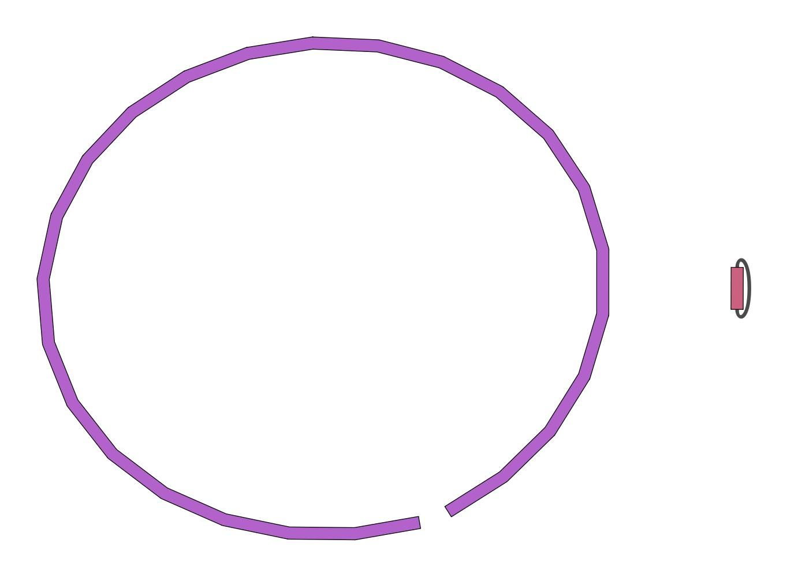

Sequencing (determining of DNA/RNA nucleotide sequence) is used all over
the world for all kinds of analysis. The product of these sequencers are
reads, which are sequences of detected nucleotides. Depending on the
technique these have specific lengths (30-500bp) or using Oxford
Nanopore Technologies sequencing have much longer variable lengths.



In this training we will build an assembly of a bacterial genome, from data produced in
"Complete Genome Sequences of Eight Methicillin-Resistant
*Staphylococcus aureus* Strains Isolated from Patients in
Japan" :

> Methicillin-resistant *Staphylococcus aureus* (MRSA) is a major pathogen
> causing nosocomial infections, and the clinical manifestations of MRSA
> range from asymptomatic colonization of the nasal mucosa to soft tissue
> infection to fulminant invasive disease. Here, we report the complete
> genome sequences of eight MRSA strains isolated from patients in Japan.
{: .quote cite=""}

> <agenda-title></agenda-title>
>
> In this tutorial, we will cover:
>
> 1. TOC
> {:toc}
>
{: .agenda}

# Galaxy and data preparation

Any analysis should get its own Galaxy history. So let's start by creating a new one and get the data into it.

> <hands-on-title>History creation</hands-on-title>
>
> 1. Create a new history for this analysis
>
>    
>
> 2. Rename the history
>
>    
>
{: .hands_on}

Now, we need to import the data: 1 FASTQ file containing the reads from the sequencer.

> <hands-on-title>Data upload</hands-on-title>
> 1.  the files from [Zenodo]({{ page.zenodo_link }}) or from the shared data library
>
>    ```
>    {{ page.zenodo_link }}/files/DRR187567.fastq.bz2
>    ```
>
>    
>
>    
>
> 2. Rename the dataset to keep only the sequence run ID (`DRR187567`)
>
>    
>
> 3. Tag the dataset `#unfiltered`
>
>    
>
> 4. **View**  the renamed file
>
{: .hands_on}

The dataset is a FASTQ file.

> <question-title></question-title>
>
> 1. What are the 4 main features of each read in a fastq file.
> 2. What is the name of your first read?
>
> > <solution-title></solution-title>
> > 1. The following:
> >
> >    -   A `@` followed by a name and sometimes information of the read
> >    -   A nucleotide sequence
> >    -   A `+` (optional followed by the name)
> >    -   The quality score per base of nucleotide sequence (Each symbol
> >        represents a quality score, which will be explained later)
> >
> > 2. `DRR187567.1`
> {: .solution}
{: .question}



<div class="Existing-Illumina-MiSeq-data" markdown="1">

> <hands-on-title>Illumina Data upload</hands-on-title>
> 1.  the files from [Zenodo]({{ page.zenodo_link }}) or from the shared data library
>
>    ```
>    {{ page.zenodo_link }}/files/DRR187559_1.fastqsanger.bz2
>    {{ page.zenodo_link }}/files/DRR187559_2.fastqsanger.bz2
>    ```
>
>    
>
>    
>
> 2. Rename the datasets to remove `.fastqsanger.bz2` and keep only the sequence run ID (`DRR187559_1` and `DRR187559_2`)
>
>    
>
{: .hands_on}

</div>

# Quality Control

During sequencing, errors are introduced, such as incorrect nucleotides being called. These are due to the technical limitations of each sequencing platform. Sequencing errors might bias the analysis and can lead to a misinterpretation of the data. **Sequence quality control is therefore an essential first step in any analysis.**

When assessing the fastq files all bases had their own quality (or Phred score) represented by symbols. You can read more in our dedicated [Quality Control Tutorial]().

To assess the quality by hand would be too much work. That's why tools like [NanoPlot](https://github.com/wdecoster/NanoPlot) or
[FastQC](http://www.bioinformatics.babraham.ac.uk/projects/fastqc/) are made, which will generate a summary and plots of the data statistics. NanoPlot is mainly used for long-read data, like ONT and PACBIO and FastQC for any read.

> <hands-on-title>Quality Control</hands-on-title>
>
> 1.  with the following parameters:
>    -  *"Short read data from your current history"*: `DRR187567`
>
> 2. Inspect the webpage output
>
{: .hands_on}

FastQC combines quality statistics from all separate reads and combines them in plots. An important plot is the Per base sequence quality. 


<div class="Existing-Illumina-MiSeq-data" markdown="1">

Here, we are going to trim the Illumina data using **fastp** ():

- Trim the start and end of the reads if those fall below a quality score of 20
- Filter for reads to keep only reads with at least 30 bases: Anything shorter will complicate the assembly

> <hands-on-title>Quality improvement of the Illumina reads</hands-on-title>
>
> 1.  with the following parameters:
>    - *"Single-end or paired reads"*: `Paired`
>        -  *"Input 1"*: `DRR187559_1`
>        -  *"Input 2"*: `DRR187559_2`
>    - In *"Filter Options"*:
>        - In *"Length filtering Options"*:
>            - *Length required*: `30`
>    - In *"Read Modification Options"*:
>        - In *"Per read cuitting by quality options"*:
>            - *Cut by quality in front (5')*: `Yes`
>            - *Cut by quality in front (3')*: `Yes`
>            - *Cutting window size*: `4`
>            - *Cutting mean quality*: `20`
>    - In *"Output Options"*:
>        - *"Output JSON report"*: `Yes`
>
{: .hands_on}

</div>

Depending on the analysis it could be possible that a certain quality or length is needed. The reads can be filtered using the [Filtlong](https://github.com/rrwick/Filtlong) tool. In this training all reads below 1000bp will be filtered.

<div class="Existing-Illumina-MiSeq-data" markdown="1">

When Illumina reads are available, we can use them **if they are good Illumina reads (high depth and complete coverage)**  as external reference. In this case, Filtlong ignores the Phred quality scores and instead judges read quality using k-mer matches to the reference (a more accurate gauge of quality).

</div>

> <hands-on-title>Filtering</hands-on-title>
> 1.  with the following parameters:
>    -  *"Input FASTQ"*: `DRR187567`
>    - In *"Output thresholds"*:
>        - *"Min. length"*: `1000`
>
>    <div class="Existing-Illumina-MiSeq-data" markdown="1">
>    - In *"External references"*:
>        -  *"Reference Illumina read"*: **fastp** `Read 1 output`
>        -  *"Reference Illumina read"*: **fastp** `Read 2 output` 
>    </div>
>
> 2. Rename the dataset to `DRR187567-filtered`
>
>    
>
{: .hands_on}

The output can be evaluated using **NanoPlot** for plotting long read sequencing data and alignments

> <hands-on-title>Filtering</hands-on-title>
> 1. Convert the datatype of `DRR187567` to uncompress it
>
>    
>
> 2.  with the following parameters:
>    - *"Select multifile mode"*: `batch`
>        - *"Type of the file(s) to work on"*: `fastq`
>            -  *"files"*: **both** `DRR187567 uncompressed` and `DRR187567-filtered`
>    - In *"Options for customizing the plots created"*:
>        - *"Show the N50 mark in the read length histogram."*: `Yes`
>
{: .hands_on}

We ran the **NanoPlot** two times: one for the raw reads (`DRR187567`) and one for the reads after filtering (`DRR187567-filtered`). 

For each run, **NanoPlot** generates 5 outputs:

- 2 plots: 
   - Histogram Read Length
   - Histogram Read Length after log transformation

      
      
      


- 2 tabular files with statistics: one general and one after filtering.

   The second one is empty because we did not used **NanoPlot** filtering options.

- A HTML report summarizing above information

   We can compare the two generated reports. Galaxy allows to view several datasets side-by-side using the Window Manager function

   > <hands-on-title>Inspect NanoPlot reports</hands-on-title>
   >
   > 1. Enable Window Manager
   >
   >    
   >
   > 2. Open both NanoPlot HTML Reports
   > 3. Check the **Summary statistics** section of each to compare the results
   >
   {: .hands_on}

   Summary statistics  | Not Filtered   | Filtered (Filtlong) | Change (%)
   ------------------- | -------------- | ------------------- | ----------
   Number of reads     | 91,288         | 69,906              | -23.4%
   Number of bases     | 621,945,741.0  | 609,657,642.0       | -2.0%
   Median read length  | 3,400.0        | 5,451.0             | 60.3%
   Mean read length    | 6,813.0        | 8,721.1             | 28.0%
   Read length N50     | 14,810.0       | 15,102.0            | 2.0%
   Mean read quality   | 9              | 9                   | 0.0%
   Median read quality | 8.9            | 9.0                 | 1.1%

   > <question-title></question-title>
   >
   > 1. What is the increase of your median read length?
   > 2. What is the decrease in the number of bases?
   > 3. What is coverage?
   > 4. What would be the coverage before and after trimming, based on a genome size of 2.9 Mbp?
   >
   > > <solution-title></solution-title>
   > > 1. 3,400 bp to 5,451 bp, a 60.3% increase
   > > 2. A -2.0% decrease is not a very significant decrease. Our data was quite good to start with and didn't have many short reads which were removed (23.4%)
   > > 3. The coverage is a measure of how many reads 'cover' on average a single base in the genome. If you divide the total reads by the genome size, you will get a number how many times your genomes could theoretically be "covered" by reads.
   > > 4. Before $$ \frac{621,945,741}{2,900,000} = 214.4$$ and after $$ \frac{609,657,642}{2,900,000} = 210.2$$. This is *not* a very big decrease in coverage, so no cause for concern. Generally in sequencing experiments you have some minimum coverage you expect to see based on how much of your sample you sequenced. If it falls below that threshold it might be cause for concern.
   > >
   > {: .solution}
   {: .question}

While there is currently no community consensus over the best trimming or filtering practices with long read data, there are still some steps that can be beneficial to do for the assembly process.  is a commonly used tool for removing adapter sequences, and we used  for removing shorter reads which might make the assembly process more difficult.

Many people do not do any trimming of their NanoPore data based on the quality as it is expected that the quality is low, and often the focus is on assembling large {SVs} rather than having high quality reads and base-level variation analyses.

# Assembly

When the quality of the reads is determined and the data is filtered (like we
did with filtlong) and/or trimmed (like is more often done with short read data)
an assembly can be made.

There are many tools that create assembly for long-read data, e.g. Canu (), Raven (), Miniasm  (). In this tutorial, we use [**Flye**](https://github.com/fenderglass/Flye) (). **Flye** is a de
novo assembler for single molecule sequencing reads. It can be used from bacteria to human assemblies. The Flye assembly is based on finding overlapping reads with variable length with high error tolerance. 



> <hands-on-title>Assembly using Flye</hands-on-title>
>
> 1.  with the following parameters:
>    -  *"Input reads"*: `DRR187567-filtered` (output of **filtlong** )
>    - *"Mode"*: `Nanopore corrected (--nano-corr)`
>    - *"Reduced contig assembly coverage"*: `Disable reduced coverage for initial disjointing assembly`
>
{: .hands_on}

**Flye** generates 4 outputs:

- A FASTA file called `consensus` with contigs, i.e. the contiguous sequences made by combining separate reads in the assembly, and possibly scaffolds built by **Flye**

   > <question-title></question-title>
   > 
   > How many contigs are there?
   > > <solution-title></solution-title>
   > >
   > > There are 2 sequences in the `consensus` dataset
   > {: .solution}
   {: .question}

- 2 assembly graph files: `assembly graph` and `graphical fragment assembly`

   We can visualize the assembly graph using the `graphical fragment assembly` with **Bandage** (), a package for exploring assembly graphs through summary reports and visualizations of their contents.

   > <hands-on-title>Assembly inspection</hands-on-title>
   > 1.  with the following parameters:
   >    -  *"Graphical Fragment Assembly"*: `graphical fragment assembly` (output of **Flye**)
   >
   {: .hands_on}

   

- A table `assembly info` with assembly information

   It should be something similar but probably sligtly different because Flye can differ a bit per assembly:

   #seq_name | length  | cov. | circ. | repeat | mult. | alt_group | graph_path
   --------- | ------  | ---- | ----- | ------ | ----- | --------- | ----------
   contig_1  | 2927029 | 183  | Y     | N      | 2     | *         | 1
   contig_2  | 60115   | 379  | Y     | Y      | 2     | *         | 2

   > <question-title></question-title>
   > 1. What is the coverage of your longest contig?
   > 2. What is the length of your longest contig?
   > 3. Could this contig potentially be a MRSA genome?
   >
   > > <solution-title></solution-title>
   > > While results may vary due to randomness in the assembly process, in our case we had:
   > > 1. 183
   > > 2. 2.9Mb
   > > 3. 2.9Mb is approximately the size of a MRSA genome. So contig 1 could be the genome. Contig 2 could be one small potential plasmid genome.
   > {: .solution}
   {: .question}

## Assembly Evaluation

To evaluate the assembly, we use also [Quast](http://quast.bioinf.spbau.ru/) () (QUality ASsessment Tool), a tool providing quality metrics for assemblies. This tool can be used to compare multiple assemblies, can take an optional reference file as input to provide complementary metrics, etc

> <hands-on-title>Quality Control of assembly using Quast</hands-on-title>
>
> 1.  with the following parameters:
>    - *Assembly mode?*: `Co-assembly`
>       - *"Use customized names for the input files?"*: `No, use dataset names`
>         -  *"Contigs/scaffolds file"*: `consensus` output of **Flye**
>
{: .hands_on}

QUAST outputs assembly metrics as an HTML file with metrics and graphs. 

> <question-title></question-title>
>
> 1. How many contigs is there?
> 2. How long is the largest contig?
> 3. What is the total length of all contigs?
> 4. What is you GC content?
> 5. How does it compare to results for KUN1163 in [Table 1](https://journals.asm.org/doi/10.1128/mra.01212-19#tab1) in ?
>
> > <solution-title></solution-title>
> >
> > 1. 2 contigs
> > 2. The largest contig is 2,907,099 bp.
> > 3. 2,967,214 (*Total length (>= 0 bp)*). 
> > 4. The GC content for our assembly is 32.91%. 
> > 5. KUN1163 has a genome size of 2,914,567 bp (not far from the length of the largest contig), with a GC content of 32.91% (as in our assembly)
> >
> {: .solution}
{: .question}

<div class="Existing-Illumina-MiSeq-data" markdown="1">

## Assembly Polishing

We can now polish the assembly using both the short reads and/or long reads. This process aligns the reads to the assembly contigs, and makes corrections to the contigs where warranted. 

Several tools exist for polishing, e.g. Racon (). Here we will use **Polypolish** (), a tool for polishing genome assemblies with short reads.

**Polypolish** needs as input the assembly but also SAM/BAM files where each read has been aligned to *all* possible locations (not just a single best location). Errors in repeats will be covered by short-read alignments, and **Polypolish** can therefore fix those errors. 

To get the SAM/BAM files, we need to map the short reads on the assembly. We will use **BWA-MEM** (, , ).

We need to set up **BWA-MEM** so it aligns each read to all possible locations, not just the best location. This option does not work with paired-end alignment. We will then need to align forward and reverse read files separately, instead of aligning both read files with a single BWA-MEM run as usually recommended.

> <hands-on-title> Align short-reads on assembly </hands-on-title>
> 1. Change the datatype of both FASTQ outputs of **fastp** to `fastqsanger.gz`
>
>    
>
> 2.  with the following parameters:
>    - *"Will you select a reference genome from your history or use a built-in index?"*: `Use a genome from history and build index`
>        -  *"Use the following dataset as the reference sequence"*: `consensus` output of **Flye**
>    - *"Single or Paired-end reads"*: `Single`
>        -  *"Select fastq dataset"*: both outputs of **fastp**
>    - *"Set read groups information?"*: `Do not set`
>    - *"Select analysis mode"*: `5.Full list of options`
>        - *"Set algorithmic options?"*: `Do not set`
>        - *"Set scoring options?"*: `Do not set`
>        - *"Set input/output options"*: `Set`
>            - *"Output all alignments for single-ends or unpaired paired-ends"*: `Yes`
>    - *"BAM sorting mode"*: `Not sorted (sorted as input)`
>
{: .hands_on}

We can now run **Polypolish**.

> <hands-on-title> Polish assembly </hands-on-title>
>
> 1.  with the following parameters:
>    - In *"Input sequences"*:
>        -  *"Select a draft genome for polishing"*: `consensus` output of **Flye**
>        - *"Select aligned data to polish"*: `Paired SAM/BAM files`
>            -  *"Select forward SAM/BAM file"*: output of **BWA-MEM2** on the `Read 1` output of **fastp**
>            -  *"Select reverse SAM/BAM file"*: output of **BWA-MEM2** on the `Read 2` output of **fastp**
>
{: .hands_on}

To check the impact of the polishing, let's run **QUAST** on both **Flye** and **Polypolish** outputs.

> <hands-on-title>Quality Control of polished assembly</hands-on-title>
>
> 1.  with the following parameters:
>    - *Assembly mode?*: `Co-assembly`
>       - *"Use customized names for the input files?"*: `No, use dataset names`
>         -  *"Contigs/scaffolds file"*: `consensus` output of **Flye** and output of **Polypolish**
>
{: .hands_on}

The HTML report generated by **QUAST** gives metrics for both assembly side-by-side

Statistics | **Flye** output | **Polypolish** output
--- | --- | ---
Number of contigs | 2 | 2
Largest contig | 2,907,099 | 2,915,230
Total length (>= 0 bp) | 2,967,214 | 2,975,666
GC (%) | 32.91 | 32.84

> <question-title></question-title>
>
> Is the assembly after polishing better than before given the results for KUN1163 in [Table 1](https://journals.asm.org/doi/10.1128/mra.01212-19#tab1) in ?
>
> > <solution-title></solution-title>
> >
> > The largest contig after polishing has a length of 2,915,230 bp, which closr to the expected 2,914,567 bp. But the GC content (32.84% after polishing) is slightly worst given the  expected 32.91% also found in the assembly before polishing.
> >
> {: .solution}
{: .question}

</div>

# Conclusion

In this tutorial, we prepared long reads (using short reads if we had some) assembled them, inspect the produced assembly for its quality, and polished it (if short reads where provided). The assembly, even if uncomplete, is reasonable good to be used in downstream analysis, like [AMR gene detection]()