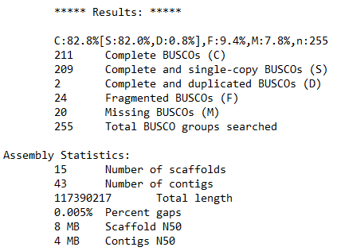
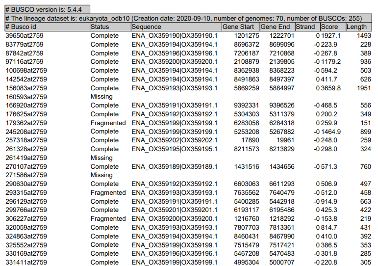
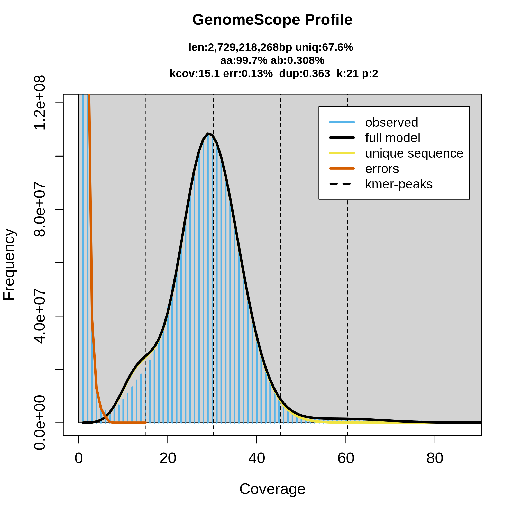
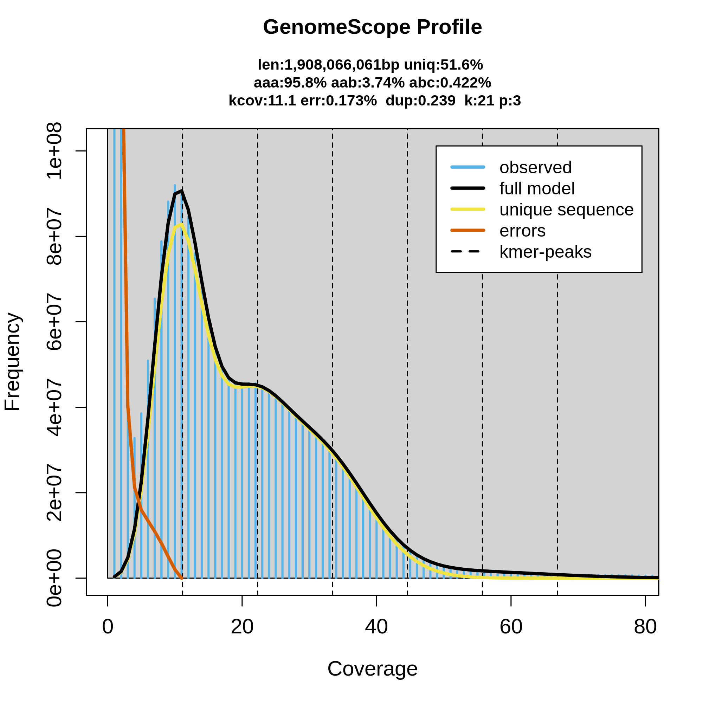
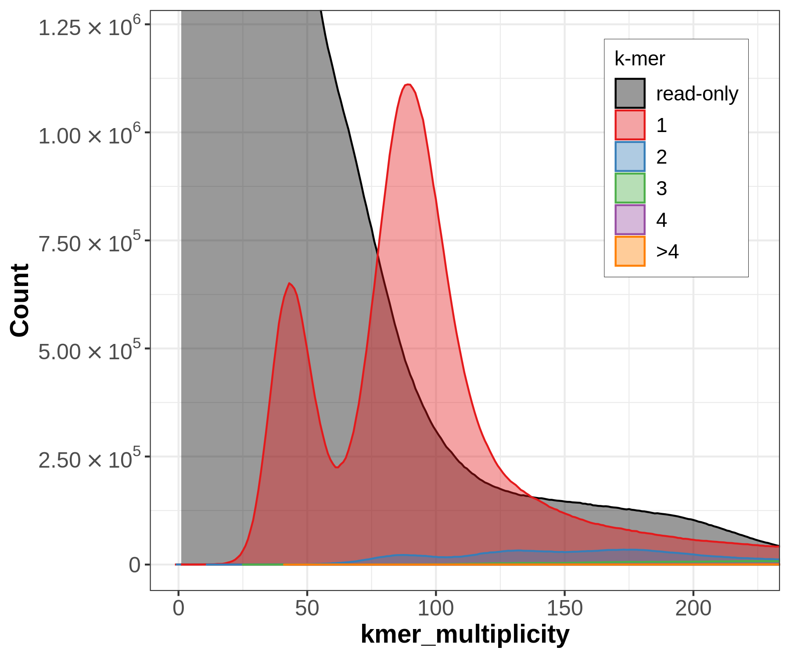
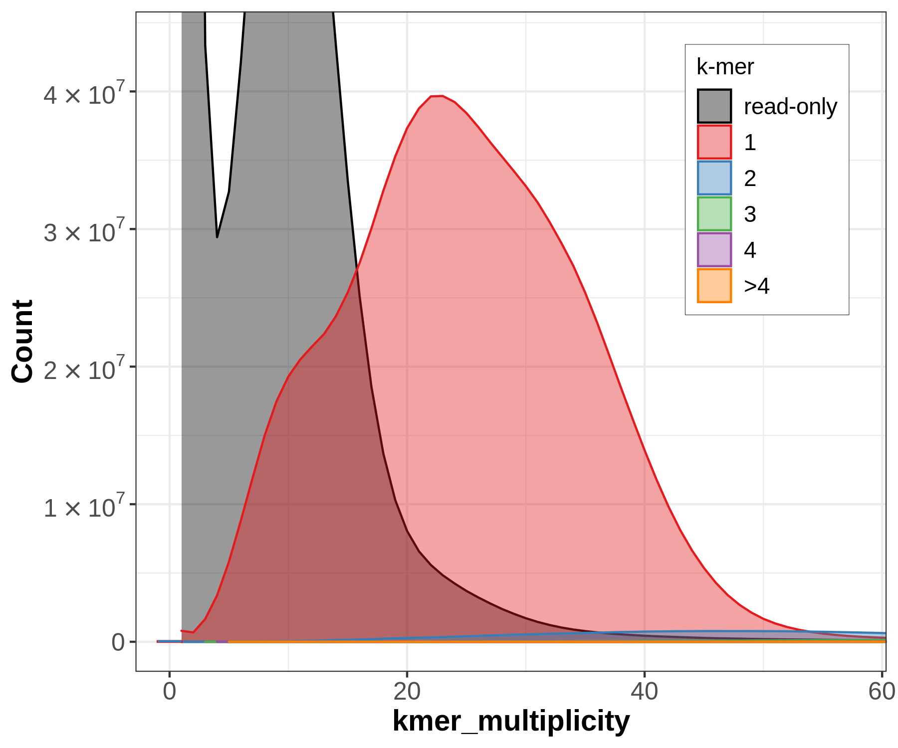
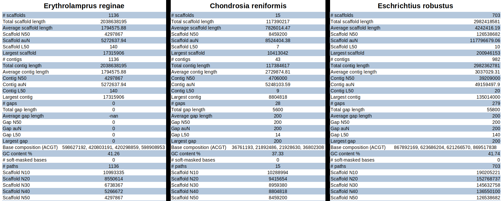

# Introduction

The European Reference Genome Atlas (ERGA) is a large-scale project aimed at generating and integrating high-quality reference genomes for a wide range of European organisms. The project will use state-of-the-art sequencing technologies and advanced bioinformatics tools to produce high-quality genome assemblies.

Reference genomes provide a baseline for understanding genetic diversity within and among populations, and can be used to identify populations at risk of genetic erosion. This information is crucial for developing effective conservation strategies and management plans for threatened and endangered species (). Additionally, by better understanding the genetic basis of important traits, such as disease resistance and adaptation to changing environments, researchers can develop targeted interventions to mitigate the effects of environmental change and prevent the loss of genetic diversity (% cite Frankham2011 %}). The ERGA project has the potential to greatly benefit biodiversity conservation efforts and advance our understanding of the genetic basis of biodiversity.

Genome post-assembly quality control (GPAQC) is a crucial step for evaluating the accuracy and completeness of newly assembled genomes. This involves assessing the contiguity, completeness, accuracy, and consistency of the genome assembly using various bioinformatic tools and methods (, , , , ). GPAQC aims to ensure that genomic data is reliable and useful for downstream analyses such as annotation, comparative genomics, and functional studies.

Several metrics can be used to evaluate the quality of a genome assembly. Some commonly used metrics are:

1. Genome completeness: the fraction of the expected genes that are present and complete in the assembly.
2. Genome contiguity: the degree to which the genome is represented in contiguous sequences (i.e., scaffolds or chromosomes) rather than in fragmented contigs. Metrics for contiguity include N50, L50, and the number of scaffolds or contigs. N50 is the length of the shortest contig or scaffold that covers 50% of the assembly, and L50 is the number of contigs or scaffolds needed to reach the N50 value. 
3. Genome size estimation: Accurate estimation of genome size is important for downstream analyses such as gene annotation and comparative genomics.
4. Contamination rate: Contamination occurs when foreign DNA sequences are introduced into the assembly, which can skew downstream analyses.

These metrics can help researchers to evaluate the quality of their eukaryotic genome assemblies and identify potential issues that may impact downstream analyses.

In this tutorial you will learn how to implement the ERGA post-assembly quality control pipeline, and how to interpretate the potential outcomes.


> <agenda-title></agenda-title>
>
> In this tutorial, we will cover:
>
> 1. TOC
> {:toc}
>
{: .agenda}

# Study cases

In this tutorial we will evaluate three genome assemblies, belonging to three different taxonomic groups, in order to illustrate the different scenarios that can be identified. The characteristics of each of them are described briefly below.

##### Case 1: ***Chondrosia reniformis***:

*Chondrosia reniformis* is a slow-growing marine sponge cosmopolitan species which can be found in the Mediterranean Sea and the eastern Atlantic Ocean in shallow waters; it is considered to playing an important ecological role in the marine ecosystem by filtering large volumes of water and providing habitat for other species (). The members of this species are gonochoristic and oviparous, whose physiology and behavious seems to be highly influence for the presence of endosymbiosis heterotrophic bacteria (). 

The [assembly](odChoReni1.1 is based on 70x PacBio HiFi and Arima2 Hi-C data generated by the Aquatic [Symbiosis Genomics Project](https://www.aquaticsymbiosisgenomics.org/). The assembly process included the following sequence of steps: initial PacBio assembly generation with Hifiasm, retained haplotig separation with purge_dups, and Hi-C based scaffolding with YaHS. The mitochondrial genome was assembled using MitoHiFi. Finally, the primary assembly was analysed and manually improved using gEVAL.

##### Case 2: ***Erythrolamprus reginae***:

*Erythrolamprus reginae* is a species of colubrid snake found in South America. This species has been reported to include triploid individuals with parthenogenic reproduction; this type of seems to be associated with higher mutation rate tandem dupliation (). 

The [assembly](https://genomeark.s3.amazonaws.com/species/Erythrolamprus_reginae/rEryReg1/assembly_curated/) used in this tutorial correspond to the curated primary assembly generated by the [VGP project](https://vertebrategenomesproject.org/), based on 34x Pacbio HiFi and Arima2 Hi-C data, by using the [VGP assembly pipeline](https://training.galaxyproject.org/training-material/topics/assembly/tutorials/vgp_genome_assembly/tutorial.html). 

##### Case 3: ***Eschrichtius robustus***:

*Eschrichtius robustus*, commonly known as the gray whale, is a species of whale found primarily in the North Pacific Ocean. Adult gray whales can reach lengths of up to 14.9 meters and weights of up to 36,000 kilograms. It is a diploid specie, genetically characterized by high homozygosity as a result of imbreeding ().

The [assembly](https://genomeark.s3.amazonaws.com/species/Eschrichtius_robustus/mEscRob2/assembly_curated/) used in this tutorial correspond to the curated primary assembly generated by the [VGP project](https://vertebrategenomesproject.org/), based on 29x Pacbio HiFi data, by using the [VGP assembly pipeline](https://training.galaxyproject.org/training-material/topics/assembly/tutorials/vgp_genome_assembly/tutorial.html). 


# Get data

As a first step we will get the data from zenodo.

> <hands-on-title> Data Upload </hands-on-title>
>
> 1. Create a new history for this tutorial
> 2. Import the files from [Zenodo]({{ page.zenodo_link }}) or from
>    the shared data library (`GTN - Material` -> `{{ page.topic_name }}`
>     -> `{{ page.title }}`):
>
>    ```
>    
>    ```
>    ***TODO***: *Add the files by the ones on Zenodo here (if not added)*
>
>    ***TODO***: *Remove the useless files (if added)*
>
>    
>
>    
>
> 3. Rename the datasets
> 4. Check that the datatype
>
>    
>
> 5. Add to each database a tag corresponding to ...
>
>    
>
{: .hands_on}

# Genome assembly ovierwiew with Blobtoolkit

BlobToolKit is a tool designed to assist researchers in analyzing and visualizing genome assembly data. The tool uses information from multiple data sources such as read coverage, gene expression, and taxonomic annotations to generate a comprehensive overview of genome assembly data (). One of the key characteristics of BlobToolKit is its ability to provide with a user-friendly interactive interface for analyzing complex genome assembly data.

In this tutorial, we will use Blobtoolkit in order to integrate the following data:

- Read coverage data: BlobToolKit can use read coverage information to identify potential errors or gaps in the genome assembly. By comparing the depth of coverage across the genome, it can highlight regions that may be overrepresented or underrepresented, which can indicate potential issues with the assembly.
- Taxonomic annotations: BlobToolKit can use taxonomic information to identify potential contaminants or foreign DNA in the genome assembly. It does this by comparing the taxonomic profile of the genome assembly to a reference database of known organisms.
- Sequence similarity data: Sequence similarity data can be used to identify potential misassemblies or contaminants in the genome assembly. BlobToolKit can use BLAST/DIAMOND searches to compare the genome assembly to reference databases and identify regions that may be problematic.
- BUSCO reports: BlobToolKit can use BUSCO data to provide additional information about the quality of a genome assembly. It can generate plots of the number of complete and partial BUSCO genes in the genome assembly, as well as the number of missing and fragmented genes.

> <comment-title>Why should be evaluate contaminants?</comment-title>
>
> A significant proportion of the genome sequences in both GenBank and RefSeq (0.54% and 0.34% of entries, respectively) include sequences from contaminants; the contamination primarily exists in the form of short contigs, flanking regions on longer contigs, or areas of larger scaffolds that are flanked by Ns, although a few longer sequences with contamination were also detected ().
>
{: .comment}

In the next steps, we will generate the data required for generating the visualization plots with Blobtoolkit.

## Generate read coverage data with **HISAT2**

Read coverage is an essential metric for evaluating the quality of genome assemblies, and it provides valuable information for identifying regions of high and low quality, detecting misassemblies, and identifying potential contaminants. Thus, for example, unexpected regions of low coverage suggests potential errors, such as misassemblies, gaps, or low complexity regions ().

In this tutorial we will use HISAT2 for generation the coverage data. This tool uses a indexing scheme based on the Burrows-Wheeler transform (BWT) and the Ferragina-Manzini (FM) index, which enables efficient and accurate alignment (). It then provides the alignment output in BAM file format which we will then use as an input for Blobtoolkit.

> <comment-title>How is coverage information encoded in the BAM file?</comment-title>
>
> Coverage information is encoded in the BAM file format through the number of reads that align to each position in the reference genome. Specifically, the BAM file stores each read's start and end position in the genome, as well as the length and orientation of the read, among other information. To calculate coverage, the number of reads that overlap each position in the reference genome is counted.
>
{: .comment}

> <hands-on-title>Generate BAM file with HISAT2</hands-on-title>
>
> 1.  with the following parameters:
>    -  *"Collection of files to collapse into single dataset"*: `output` (Input dataset collection)
>
{: .hands_on}


## Pattern **Replace**

> <hands-on-title> Preperation for BUSCO </hands-on-title>
>
> 1.  with the following parameters:
>    -  *"File to process"*: `output` (Input dataset)
>    - In *"Find and Replace"*:
>        -  *"Insert Find and Replace"*
>            - *"Find pattern"*: `|`
>            - *"Replace with"*: `_`
>            - *"Replace all occurences of the pattern"*: `Yes`
>            - *"Find and Replace text in"*: `entire line`
>
>
>    > <comment-title> short description </comment-title>
>    > Before performing the mapping, it is necessary to collapse all the sequencing datasets into a single one, in order to generate a single BAM file.
>    {: .comment}
>
> 2.  with the following parameters:
>    - *"Source for the reference genome"*: `Use a genome from history`
>        -  *"Select the reference genome"*: `output` (Input dataset)
>    - *"Is this a single or paired library"*: `Single-end`
>        -  *"FASTA/Q file"*: `output` (output of **Collapse Collection** )
>
{: .hands_on}

## Generate sequence similarity data with DIAMOND

DIAMOND is a sequence alignment tool that utilizes a more efficient algorithm compared to BLAST, allowing for much faster searches of large sequence databases. Specifically, DIAMOND uses a sensitive seed-extension approach that compares a set of small segments (seeds) from the query sequence to a database, and then extends the alignments based on the highest-scoring hits. This approach allows DIAMOND to perform up to 20,000 times faster than BLAST, with comparable or improved sensitivity and accuracy ().

## Generate **BUSCO** report

BUSCO(Benchmarking Universal Single-Copy Orthologs) is a tool that will assess gene annotation completeness and the completeness of a genome assembly. The tool has a database of orthologs which will be compared to orthologs found in the assembly. As a result the output provides information about the completeness and quality of the recovered genes and which genes are completely missing. ()

> <comment-title> Orthologs </comment-title>
>
> Orthologs are genes in different species which have usually the same function and have evolved from a common ancestral gene. They are important for new genome assemblies in order to predict gene functions and help with gene annotation. ().
>
{: .comment}

> <hands-on-title> Estimate single copy gene representation completeness </hands-on-title>
>
> 1.  with the following parameters:
>    -  *"Sequences to analyse"*: `outfile` (output of **Replace** )
>    - *"Mode"*: `Genome assemblies (DNA)`
>        - *"Use Augustus instead of Metaeuk"*: `Use Metaeuk`
>    - *"Auto-detect or select lineage?"*: `Auto-detect`
>    - *"Which outputs should be generated"*: ``
>
>
>    > <details-title> Additional information </details-title>
>    >
>    > BUSCO sets represent 3023 genes for vertebrates, 2675 for arthropods, 843 for metazoans, 1438 for fungi and 429 for eukaryotes. An intuitive metric is provided 	in BUSCO notation - C:complete[D:dublicated], F:fragmented, M:missing, n:number of genes used.
>    {: .details}
>
>
{: .hands_on}

The following images are screenshots of the BUSCO output files.





## Generate interactive plots with **BlobToolKit**

BlobToolKit is a tool designed to assist researchers in analyzing and visualizing genome assembly data. The tool uses information from multiple data sources such as read coverage, gene expression, and taxonomic annotations to generate a comprehensive overview of genome assembly data (). One of the key characteristics of BlobToolKit is its ability to provide with a user-friendly interactive interface for analyzing complex genome assembly data. 

To work with Blobtoolkit we need to create a new dataset structure called BlobDir. Therefore the minimum requirement is a fasta file which contains the sequence of our assembly. A list of sequence identifiers and some statistics like length, GC proportion and undefined bases will then be generated.
To get a more meaningful analysis and therefore more useful information about our assembly, it is better to provide as much data as we can get. In our case we will also provide a Metadata file if possible, NCBI taxonomy ID and the NCBI taxdump directory. ()

> <hands-on-title> Creating the BlobDir dataset </hands-on-title>
>
> 1.  with the following parameters:
>    - *"Select mode"*: `Create a BlobToolKit dataset`
>        -  *"Genome assembly file"*: `output` (Input dataset)
>        -  *"Metadata file"*: `output` (Input dataset)
>        - *"NCBI taxonomy ID"*: `{'id': 2, 'output_name': 'output'}`
>        -  *"NCBI taxdump directory"*: `output` (Input dataset)
>
>
>
> 2.  with the following parameters:
>    - *"Select mode"*: `Add data to a BlobToolKit dataset`
>        -  *"Blobdir.tgz file"*: `blobdir` (output of **BlobToolKit** )
>        -  *"BUSCO full table file"*: `busco_table` (output of **Busco** )
>        - *"BLAST/Diamond hits"*: `Disabled`
>        -  *"BAM/SAM/CRAM read alignment file"*: `output_alignments` (output of **HISAT2** )
>        - *"Genetic text file"*: `Disabled`
>
>    > <comment-title> BUSCO </comment-title>
>    >
>    > comparing assembly to preserved genes, how can we evaluate the quality?
>    {: .comment}
>
>    > <comment-title> Coverage </comment-title>
>    >
>    > Coverage information/how can comparing the assembly against those information can help us analyse completeness 
>    {: .comment}
>
> 3.  with the following parameters:
>    -  *"Blobdir file"*: `blobdir` (output of **BlobToolKit** )
>
>
>    > <comment-title> short description </comment-title>
>    >
>    > Using the interactive tool of BlobToolKit allows one to view the created BlobDir dataset as plots. Thus we can analyse and evaluate the genome assembly.
>    {: .comment}
>
{: .hands_on}


# Providing analysis information/statistics using k-mers:

It is common to analyse assemblies with the help of k-mer counting. During the assembling process, the DNA fragments are broken down into k-mers. Then they are compared to identify regions of overlap. By aligning overlapping k-mers it's possible to piece the original DNA sequence together and generate a complete genome.
K-mers are also useful for genome analysis. The frequency and distribution of k-mers can be used to estimate the genome size, rate of heterozygosity and to identify repetitive sequences. K-mer counting can also be used to detect and correct errors and it can point out possible contaminations in genome assemblies. ()


> <comment-title> k-mers </comment-title>
>
> K-mers are contiguous substrings of DNA sequences of length k.
> Example:
> The sequence ACGT has four monomers (A, C, G, T), three 2-mers (AC, CG, GT), two 3-mers (ACG, CGT) and one 4-mer (ACGT)
>
{: .comment}
>
> <comment-title> Counting k-mers </comment-title>
>
> Given the length L of a sequence and the number n of all possible monomers, there are n^k total possible k-mers and L-k+1 k-mers.
>
{: .comment}


## Generating k-mer profile with **Meryl**

DNA is double stranded and normally only one strand is sequenced. For our assembly we want to consider the other strand as well. Therefore canonical k-mers are used in most counting tools, exactly like in Meryl. A full k-mer pair is a sequence and the reverse complement of the sequence (e.g. ATG/CAT). The canonical sequence of a k-mer pair is the lexicographically smaller of the two reverse complementary sequences. So if CAT appears it will be counted as ATG. ()

Meryl is a k-mer counter. It is a powerful tool for counting k-mers in large-scale genomic datasets. Meryl uses a sorting-based approach that sorts the k-mers in lexicographical order.

> <hands-on-title> Generating k-mer profile </hands-on-title>
>
> 1.  with the following parameters:
>    - *"Operation type selector"*: `Count operations`
>        -  *"Input sequences"*: `output` (Input dataset collection)
>        - *"K-mer size selector"*: `Set a k-mer size`
>            - *"K-mer size"*: `21`
>
>    > <comment-title> compute k </comment-title>
>    >
>    > In general k can be computed as k=log4 (G(1-p)/p), with G as genome size and p as tolerable collision rate.
>    > In our case we set the k-mer size to 21.
>    {: .comment}
>
>
> 2. Run  again with the following parameters:
>    - *"Operation type selector"*: `Operations on sets of k-mers`
>        - *"Operations on sets of k-mers"*: `Union-sum: return k-mers that occur in any input, set the count to the sum of the counts`
>        -  *"Input meryldb"*: `read_db` (output of **Meryl** )
>
> 3. Run  a third time with the following parameters:
>    - *"Operation type selector"*: `Generate histogram dataset`
>        -  *"Input meryldb"*: `read_db` (output of **Meryl** )
>
>
{: .hands_on}


## K-mer profile analysis with **GenomeScope**

Genomescope is used for analysing genomes with the help of k-mer profile analysis. It estimates the overall genome characteristics and the overall read characteristics. The tool will use a given k-mer profile which is calculated only from raw reads sequencing data. It then generates a plot with the calculated data giving us information about the completeness and quality of the to be assembled data.()

> <hands-on-title> Generate plots for analysis </hands-on-title>
>
> 1.  with the following parameters:
>    -  *"Input histogram file"*: `read_db_hist` (output of **Meryl** )
>    - *"Ploidy for model to use"*: `{'id': 3, 'output_name': 'output'}`
>
>
>    > <comment-title> Plots </comment-title>
>    >
>    > The generated plots will have the coverage on the x-axis and the frequency on the y-axis. It shows the fitted model in the observed k-mer data as well as the k-mer peaks and other information like some estimated parameters of the assembly.
>    {: .comment}
>
{: .hands_on}

Lete's have a look at the plots of the three species. Genomescope only uses k-mers generated by the raw sequencing data.


The error rate is high with 0.641%. This is because the sponge does have an abundance of symbiotic organisms. When extracting DNA from the sponge, DNA from these organisms get into the sequencing data causing errors in the assembly process. This is also why the value of unique sequences is that low.
Having a high first peak indicates high heterozygosity (at coverage 44).

Genome size should be 117.39 Mbp. Estimated genome size is relatively much larger: 294.72 Mbp.




The error rate is not high with 0.13%. There are also many unique sequences.
The first peak is at 15.1 coverage and is tiny in comparison to the second peak at 29.61 coverage.
This means that the whale has a high homozygous level of k-mers. The result can be described by the fact that this species is inbreeding. Autozygosity and low genetic diversity can be concluded by that.

Genome size should be 2.87 Gbp. Estimated genome size is relatively close: 2.73 Gbp.



The error rate is not high with 0.173%. But there are only 51.6% unique sequences. In this case the low value is attributed to the parthenogenesis and the polyploidy of this snake which causes tandem duplications and higher DNA replication among the other things.
The first peak at 11.1 coverage the highest. Therefore high heterozygosity is inferred.

Genome size should be 1.97 Gbp. Estimated genome size is relatively close: 1.91 Gbp.


## K-mer profile evaluation with **Merqury**

Merqury is designed for evaluating the completeness and accuracy of long-read genome assemblies using short-read sequencing data. Thus the quality of assemblies which are generated by using third-generation sequencing technologies can be reviewed and assessed by the tool.
Merqury works by comparing k-mers of an assembly to those from unassembled high-accuracy reads of the raw sequencing data. K-mer-based methods are also used to identify errors and missing sequences. ()

> <hands-on-title> Generating stats and plots </hands-on-title>
>
> 1.  with the following parameters:
>    - *"Evaluation mode"*: `Default mode`
>        -  *"K-mer counts database"*: `read_db` (output of **Meryl** )
>        - *"Number of assemblies"*: `One assembly (pseudo-haplotype or mixed-haplotype)`
>            -  *"Genome assembly"*: `output` (Input dataset)
>
>
>    > <comment-title> Output </comment-title>
>    >
>    > Merqury will now generate following outputs:
>    >
>    >  1. stats with completeness statistics
>    >  2. QV stats with quality value statistics
>    >  3. plots
>    >
>    {: .comment}
>
{: .hands_on}

Let's have a closer look at the copy number plots for each of the three species. In contrast to genomescope, merqury will generate k-mers from the raw sequencing data (in the following called the 'read set') and compare them to the assembly. Despite being diploid or triploid the species only got plotted with the primary assembly. This is why only one-copy k-mers get evaluated.



The large black area indicates that there is a high amount of k-mers in the reads set, which are not used in the assembly. This can indicate a high amount of contamination or sequencing errors in the read set. It could also mean that there are missing sequences in the assembly. The red area represents the one-copy k-mers in the genome (heterozygous part). This plot indicates a sequencing coverage at ~90x.


The small black area indicates that most of the k-mers found in the reads set are also found in the assembly (but not all). This plot indicates a sequencing coverage at ~30x.



As before with chondrosia reniformis here the large black area can indicate the same: a high amount of k-mers in the reads set is not used in the assembly. This can indicate a high amount of contamination or sequencing errors in the read set. It could also mean that there are missing sequences in the assembly. This plot indicates a sequencing coverage at ~23x.


## Providing assembly statistics with **gfastats**

gfastats is a tool for providing summary statistics and genome file manipulation. In our case it will generate genome assembly statistics in a tabular-format output. Metrics like N50/L50, GC-content and lengths of contigs, scaffolds and gaps as well as other statistical information are provided for assessing the contiguity of the assembly.

> <hands-on-title> Generate summary statistics </hands-on-title>
>
> 1.  with the following parameters:
>    -  *"Input file"*: `output` (Input dataset)
>    - *"Specify target sequences"*: `Disabled`
>    - *"Tool mode"*: `Summary statistics generation`
>        - *"Report mode"*: `Genome assembly statistics (--nstar-report)`
>
>
>    > <comment-title> N50/NG50 </comment-title>
>    >
>    > Consider taking all contigs and sorting them by size. Starting with the largest and ending with the smallest. Now add up the length of each contig beginning with the largest, then the second largest and so on. When reaching 50% of the total length of all contigs it's done. The length of the contig you stopped is the N50 value. ()
>    >
>    > NG50 or more general NG(X) is based on the same idea as N50. The difference is that in this case the whole genome size or estimated genome size is taken into account. Through this comparisons can be made over different assemblies and genome sizes.
>    >
>    {: .comment}
>
>    > <comment-title> L50 </comment-title>
>    >
>    > Remember adding up the length of each contig until reaching the 50%. The L50 value is the number of the contig you have stopped.
>    >
>    > Example: The sum of all contigs together is 2000 kbp. The contig at 50% has length 300 kbp and is the third one and thus the third largest.
>    > Then N50 = 300 kbp and L50 = 3.
>    >
>    {: .comment}
>
> In the best case a high quality assembly should consist of just a few and large contigs to represent the genome as a whole. Therefore a good assembly should lead to a high N50 value and in contrast a low quality assembly with tiny, fragmented contigs would lead to a low N50 value. ()
>
> The metric doesn't only rely on measuring the 50% mark. The general case is N(X) where X ranges from 0 - 100 mostly in ten steps. However the NX metric is not suitable for comparing different species with different genome lengths.
>
>    > <details-title> GC-content </details-title>
>    >
>    > The GC-content or guanine-cytosine ratio tells one about the occurrence of guanine and cytosine in a genome. It is stated in percent. The two nucleobases are held together by three hydrogen bonds. A high GC-content makes DNA more stable than a low GC-content. Because the ratio of most species and organisms has been found out by now, it is also a good metric to gauge completeness.()
>    {: .details}
>
>    > <details-title> CC(contig/chromosome) ratio </details-title>
>    >
>    > Another good metric for gauging contiguity is the CC ratio. The value is calculated by dividing contig counts by the chromosome pair number. A perfect score would be 1. Therefore the lower the value the better the contiguity of the assembly.
>    {: .details}
{: .hands_on}





# Conclusion

Sum up the tutorial and the key takeaways here. We encourage adding an overview image of the
pipeline used.

