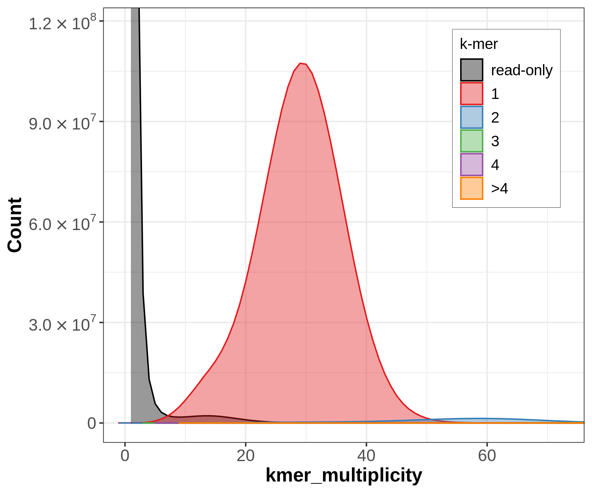

# Introduction

An important part in genome assembly is quality control. During the whole process of DNA sequencing and assembling the genome, errors like mismatches and gaps can occur. This can affect the accuracy and completeness of the genome. Quality control helps to identify and correct these errors by evaluating the quality of the sequences and by detecting and removing potential contaminations. 
A high-quality end-product as a result also ensures to avoid errors and false conclusions in downstream analyses.

Since there are many different ways how errors can occur there are also many different tools to identify and remove potential problems. The difficult part is to choose between them and to know when it's time to move on. It is important because time and resources play a big role in genome assembly.

But how can we gauge the quality of an assembly? To answer this question we first have to find out the properties to evaluate the quality of an assembly. It turned out to be a good idea to focus on the following aspects: contiguity, completeness and correctness. To gauge those properties some metrics are needed. It is necessary to aim for a value like a score to have the information of the measured quality as one number. This is useful in order to have an easy overview and make it easier for comparisons.()

Length metrics like NG50, CC(contig/chromosome) ratio and sizes of contigs, scaffolds and gaps are common for contiguity and completeness analysis. Also a popular and common method to evaluate completeness is by comparing already known genes stored in databases, against those found in the newly assembled genome. K-mer counting and the resulting k-mer profile analysis additionally helps us to evaluate correctness of a genome assembly. When talking about correctness, another association would be accuracy. Another proposed standard to assess the genomes quality is by checking base-level errors and structural errors. By gauging these metrics, a high level of accuracy can be obtained.
This can be done by mapping the raw sequencing reads to the target assembly and then calculating the error rate or by comparing the assembly to a set of k-mers from raw sequencing reads.()

In this tutorial you will learn how to use the tools for the post-assembly quality control
workflow. It's part of a post-assembly pipeline from ERGA to ensure high quality assemblies in appropriate time and resources.

> <agenda-title></agenda-title>
>
> In this tutorial, we will cover:
>
> 1. TOC
> {:toc}
>
{: .agenda}


# Get data

In this tutorial we will evaluate three different genome assemblies, belonging to three different taxonomic groups, in order to illustrate the different scenarios that can be identified. The characteristics of each of them are described briefly below.

Case 1: *Chondrosia reniformis*: # Here include the information about the technologies used, poliploidy and perhaps some additional characteristics such as the abundance of symbiotic organisms in the sponge, distribution, etc (see recommended doc)

Case 2: *Erythrolamprus reginae*: # Here include the information about the technologies used, poliploidy and perhaps some additional characteristics such as the partenogenesis (see recomended doc)

Case 3: *Eschrichtius robustus*: # Here include the information about the technologies used, poliploidy and perhaps some additional characteristics

As a first step we will get the data from zenodo.

> <hands-on-title> Data Upload </hands-on-title>
>
> 1. Create a new history for this tutorial
> 2. Import the files from [Zenodo]({{ page.zenodo_link }}) or from
>    the shared data library (`GTN - Material` -> `{{ page.topic_name }}`
>     -> `{{ page.title }}`):
>
>    ```
>    
>    ```
>    ***TODO***: *Add the files by the ones on Zenodo here (if not added)*
>
>    ***TODO***: *Remove the useless files (if added)*
>
>    
>
>    
>
> 3. Rename the datasets
> 4. Check that the datatype
>
>    
>
> 5. Add to each database a tag corresponding to ...
>
>    
>
{: .hands_on}


# Assembly contaminant/cobiont detection

Extracted DNA from an organism always contains DNA from other species. This is why most assemblies need to go through a decontamination process to remove the non-target DNA for a higher-quality end product.
Contamination can also have a significant impact on downstream analysis and interpretation of the genome assembly. For example, host contamination can lead to misinterpretation of gene content and functional annotation. Another point is that environmental contamination can affect the accuracy of taxonomic classification. Therefore, it is important to identify and minimise contamination in genome assemblies using appropriate quality control measures.
Our goal for the post-assembly quality control workflow is to assess the completeness and the quality of the given assembly and remove potential errors and contaminations to ensure a high-quality end product.


## Sub-step with **BlobToolKit**

Blobtoolkit is a tool for decontamination, analysing and visualising assemblies. It's a great tool to review the quality of an assembled genome. In our case optimal suited for the post-assembly quality control.
Blobtoolkit can help to identify contaminants by creating a dataset with taxonomic information and then comparing the assembly with the provided data from known contigs or scaffolds. ()

To work with Blobtoolkit we need to create a new dataset structure called BlobDir. Therefore the minimum requirement is a fasta file which contains the sequence of our assembly. A list of sequence identifiers and some statistics like length, GC proportion and undefined bases will then be generated.
To get a more meaningful analysis and therefore more useful information about our assembly, it is better to provide as much data as we can get. In our case we will also provide a Metadata file if possible, NCBI taxonomy ID and the NCBI taxdump directory. ()

> <comment-title> FASTA file format </comment-title>
>
> The FASTA file format consists of a description row starting with '>', followed by a text. The next row/rows consist of a sequence. The file can have more than one description and sequence rows.
Example:
    > Sequence 1
    AATCGGCTATTA
    GGCAGCGATTAC
    > Sequence 2
    GACTCAGCGTAT
>
{: .comment}

> <comment-title> assembly.yaml </comment-title>
>
> The assembly.yaml metadata file contains metadata information about the assembly. In general you have to look up those information on your own. Usually the information is available on the official gene databases where the assembly is provided.
Here an example content of an assembly.yaml file:
assembly:
  accession: GCA_947172415.1
  alias: odChoReni1.1
  bioproject: PRJEB56892
  biosample: SAMEA9362004
  record_type: Chromosome
taxon:
  name: Chondrosia reniformis
  id: 68574
>
{: .comment}

> <hands-on-title> Creating the BlobDir dataset </hands-on-title>
>
> 1.  with the following parameters:
>    - *"Select mode"*: `Create a BlobToolKit dataset`
>        -  *"Genome assembly file"*: `output` (Input dataset)
>        -  *"Metadata file"*: `output` (Input dataset)
>        - *"NCBI taxonomy ID"*: `{'id': 6, 'output_name': 'output'}`
>        -  *"NCBI taxdump directory"*: `output` (Input dataset)
>
>
>    > <details-title> BlobDir structure </details-title>
>    >
>    > Here you can have a more detailed look on the structure of the BlobDir dataset:

>    > DatasetID
>    > meta.json                       # Dataset metadata
>    > identifiers.json                # Sequence names
>    > gc.json                         # Sequence GC-content (variable)
>    > length.json                     # Sequence lengths (variable)
>    > ncount.json                     # Portion of N bases (variable)
>    > {LIBRARYNAME}_cov.json          # Average per-base coverage in {LIBRARYNAME} read mapping file (variable)
>    > {LIBRARYNAME}_read_cov.json     # Read coverage in {LIBRARYNAME} read mapping file (variable)
>    > {TAXRULE}_{RANK}.json           # Taxonomic assignments from sequence similarity searches at {RANK} using {TAXRULE} (category)
>    > {TAXRULE}_{RANK}_cindex.json    # Number of alternative taxa at {RANK} (variable)
>    > {TAXRULE}_{RANK}_positions.json # Start/end position, NCBI taxon ID and bitscore for each hit (array of arrays)
>    > {TAXRULE}_{RANK}_score.json.    # Sum of bitscores for assigned taxon at {RANK} (variable)
>    > {LINEAGE}_busco.json            # Complete and fragmented {LINEAGE} BUSCOs (array of arrays) 
>    {: .details}
>
{: .hands_on}


## Sub-step with **HISAT2**

HISAT2 is currently one of the fastest RNA-seq mapper available. The tool will use hierarchically indexing methods to align reads to a reference genome (). It then provides the alignment output in BAM file format which we will then use as an input for Blobtoolkit for analysing the correctness/accuracy of the assembly.

> <comment-title> BAM/SAM file format </comment-title>
>
> SAM is short for Sequence Alignment Map. The file stores alignments of sequences which are often mapped with the help of reference sequences. The information is stored in a text-based format.
> 
> BAM contains the same information as SAM files but is in binary format thus it is not readable for humans. However those files are smaller and tools can work faster with it.
>
{: .comment}

> <hands-on-title> Generate BAM file </hands-on-title>
>
> 1.  with the following parameters:
>    - *"Source for the reference genome"*: `Use a genome from history`
>        -  *"Select the reference genome"*: `output` (Input dataset)
>    - *"Is this a single or paired library"*: `Single-end`
>        -  *"FASTA/Q file"*: `output` (Input dataset collection)
>    - In *"Advanced Options"*:
>        - *"Input options"*: `Use default values`
>        - *"Alignment options"*: `Use default values`
>        - *"Scoring options"*: `Use default values`
>        - *"Spliced alignment options"*: `Use default values`
>        - *"Reporting options"*: `Use default values`
>        - *"Output options"*: `Use default values`
>        - *"SAM options"*: `Use default values`
>        - *"Other options"*: `Use default values`
>
>
{: .hands_on}


## Sub-step with **Busco**

BUSCO(Benchmarking Universal Single-Copy Orthologs) is a tool that will assess gene annotation completeness and the completeness of a genome assembly. The tool has a database of orthologs which will be compared to orthologs found in the assembly. As a result the output provides information about the completeness and quality of the recovered genes and which genes are completely missing. ()
We will later use these information and provide the output to blobtoolkit for further analysis.


> <comment-title> Orthologs </comment-title>
>
> Orthologs are genes in different species which have usually the same function and have evolved from a common ancestral gene. They are important for new genome assemblies in order to predict gene functions and help with gene annotation. ()
>
{: .comment}

> <hands-on-title> Estimate single copy gene representation completeness </hands-on-title>
>
> 1.  with the following parameters:
>    -  *"Sequences to analyse"*: `output` (Input dataset)
>    - *"Mode"*: `Genome assemblies (DNA)`
>        - *"Use Augustus instead of Metaeuk"*: `Use Metaeuk`
>    - *"Auto-detect or select lineage?"*: `Auto-detect`
>    - *"Which outputs should be generated"*: ``
>
>
>    > <details-title> Additional information </details-title>
>    >
>    > BUSCO sets represent 3023 genes for vertebrates, 2675 for arthropods, 843 for metazoans, 1438 for fungi and 429 for eukaryotes. An intuitive metric is provided 	in BUSCO notation - C:complete[D:dublicated], F:fragmented, M:missing, n:number of genes used.
>    {: .details}
>
>
{: .hands_on}

The following images are screenshots of the BUSCO output files.


## Sub-step with **BlobToolKit**

In the previous steps we generated and prepared the data which we will provide now in Blobtoolkit. With the given information the tool can now detect possible contaminations. Once detected the tool can also filter the assembly and generate plots to give an overview of the assemblies analysis and therfore of the overall quality. ()

> <hands-on-title> Adding data to dataset </hands-on-title>
>
> 1.  with the following parameters:
>    - *"Select mode"*: `Add data to a BlobToolKit dataset`
>        -  *"Blobdir.tgz file"*: `blobdir` (output of **BlobToolKit** )
>        -  *"BUSCO full table file"*: `busco_table` (output of **Busco** )
>        - *"BLAST/Diamond hits"*: `Disabled`
>        -  *"BAM/SAM/CRAM read alignment file"*: `output_alignments` (output of **HISAT2** )
>        - *"Genetic text file"*: `Disabled`
>
>    > <comment-title> BUSCO </comment-title>
>    >
>    > comparing assembly to preserved genes, how can we evaluate the quality?
>    {: .comment}
>
>    > <comment-title> Coverage </comment-title>
>    >
>    > Coverage information/how can comparing the assembly against those information can help us analyse completeness 
>    {: .comment}
>
> 2. Run  again with the following parameters:
>    - *"Select mode"*: `Generate plots`
>        -  *"Blobdir file"*: `blobdir` (output of **BlobToolKit** )
>
>
>    > <comment-title> Generate plots </comment-title>
>    >
>    > Blobtoolkit can generate plots to make the analysis of the assembly visible.
>    {: .comment}
>
{: .hands_on}


# Providing analysis information/statistics using k-mers:

It is common to analyse assemblies with the help of k-mer counting. During the assembling process, the DNA fragments are broken down into k-mers. Then they are compared to identify regions of overlap. By aligning overlapping k-mers it's possible to piece the original DNA sequence together and generate a complete genome.
K-mers are also useful for genome analysis. The frequency and distribution of k-mers can be used to estimate the genome size, rate of heterozygosity and to identify repetitive sequences. K-mer counting can also be used to detect and correct errors and it can point out possible contaminations in genome assemblies. ()


> <comment-title> k-mers </comment-title>
>
> K-mers are contiguous substrings of DNA sequences of length k.
> Example:
> The sequence ACGT has four monomers (A, C, G, T), three 2-mers (AC, CG, GT), two 3-mers (ACG, CGT) and one 4-mer (ACGT)
>
{: .comment}

> <comment-title> Counting k-mers </comment-title>
>
> Given the length L of a sequence and the number n of all possible monomers, there are n^k total possible k-mers and L-k+1 k-mers.
>
{: .comment}


## Sub-step with **Meryl**

DNA is double stranded and normally only one strand is sequenced. For our assembly we want to consider the other strand as well. Therefore canonical k-mers are used in most counting tools, exactly like in Meryl. A full k-mer pair is a sequence and the reverse complement of the sequence (e.g. ATG/CAT). The canonical sequence of a k-mer pair is the lexicographically smaller of the two reverse complementary sequences. So if CAT appears it will be counted as ATG. ()

Meryl is a k-mer counter. It is a powerful tool for counting k-mers in large-scale genomic datasets. Meryl uses a sorting-based approach that sorts the k-mers in lexicographical order.

> <hands-on-title> Generating k-mer profile </hands-on-title>
>
> 1.  with the following parameters:
>    - *"Operation type selector"*: `Count operations`
>        -  *"Input sequences"*: `output` (Input dataset collection)
>        - *"K-mer size selector"*: `Set a k-mer size`
>            - *"K-mer size"*: `21`
>
>    > <comment-title> compute k </comment-title>
>    >
>    > In general k can be computed as k=log4 (G(1-p)/p), with G as genome size and p as tolerable collision rate.
>    > In our case we set the k-mer size to 21.
>    {: .comment}
>
>
> 2. Run  again with the following parameters:
>    - *"Operation type selector"*: `Operations on sets of k-mers`
>        - *"Operations on sets of k-mers"*: `Union-sum: return k-mers that occur in any input, set the count to the sum of the counts`
>        -  *"Input meryldb"*: `read_db` (output of **Meryl** )
>
> 3. Run  a third time with the following parameters:
>    - *"Operation type selector"*: `Generate histogram dataset`
>        -  *"Input meryldb"*: `read_db` (output of **Meryl** )
>
>
{: .hands_on}


## Sub-step with **GenomeScope**

Genomescope is used for analysing genomes with the help of k-mer profile analysis. It estimates the overall genome characteristics and the overall read characteristics. The tool will use a given k-mer profile which is calculated only from raw reads sequencing data. It then generates a plot with the calculated data giving us information about the completeness and quality of the to be assembled data.()

> <hands-on-title> Generate plots for analysis </hands-on-title>
>
> 1.  with the following parameters:
>    -  *"Input histogram file"*: `read_db_hist` (output of **Meryl** )
>    - *"Ploidy for model to use"*: `{'id': 3, 'output_name': 'output'}`
>
>
>    > <comment-title> Plots </comment-title>
>    >
>    > The generated plots will have the coverage on the x-axis and the frequency on the y-axis. It shows the fitted model in the observed k-mer data as well as the k-mer peaks and other information like some estimated parameters of the assembly.
>    {: .comment}
>
{: .hands_on}


## Sub-step with **Merqury**

Merqury is designed for evaluating the completeness and accuracy of long-read genome assemblies using short-read sequencing data. Thus the quality of assemblies which are generated by using third-generation sequencing technologies can be reviewed and assessed by the tool.
Merqury works by comparing k-mers of an assembly to those from unassembled high-accuracy reads of the raw sequencing data. K-mer-based methods are also used to identify errors and missing sequences. ()

> <hands-on-title> Generating stats and plots </hands-on-title>
>
> 1.  with the following parameters:
>    - *"Evaluation mode"*: `Default mode`
>        -  *"K-mer counts database"*: `read_db` (output of **Meryl** )
>        - *"Number of assemblies"*: `One assembly (pseudo-haplotype or mixed-haplotype)`
>            -  *"Genome assembly"*: `output` (Input dataset)
>
>
>    > <comment-title> Output </comment-title>
>    >
>    > Merqury will now generate following outputs:
- stats with completeness statistics
- QV stats with quality value statistics
- plots

>    {: .comment}
>
{: .hands_on}

Let's have a closer look at the copy number plots. For each of our three species a primary and alternate sequence got plotted for comparison.





## Sub-step with **gfastats**

gfastats is a tool for providing summary statistics and genome file manipulation. In our case it will generate genome assembly statistics in a tabular-format output. Metrics like N50/L50, GC-content and lengths of contigs, scaffolds and gaps as well as other statistical information are provided for assessing the contiguity of the assembly.

> <hands-on-title> Generate summary statistics </hands-on-title>
>
> 1.  with the following parameters:
>    -  *"Input file"*: `output` (Input dataset)
>    - *"Specify target sequences"*: `Disabled`
>    - *"Tool mode"*: `Summary statistics generation`
>        - *"Report mode"*: `Genome assembly statistics (--nstar-report)`
>
>
>    > <comment-title> N50 </comment-title>
>    >
>    > Consider taking all contigs and sorting them by size. Starting with the largest and ending with the smallest. Now add up the length of each contig beginning with the largest, then the second largest and so on. When reaching 50% of the total length of all contigs it's done. The length of the contig you stopped is the N50 value. ()

>    {: .comment}
>
>    > <comment-title> L50 </comment-title>
>    >
>    > Remember adding up the length of each contig until reaching the 50%. The L50 value is the number of the contig you have stopped.

>    > Example: The sum of all contigs together is 2000 kbp. The contig at 50% has length 300 kbp and is the third one and thus the third largest.
>    > Then N50 = 300 kbp and L50 = 3.

>    {: .comment}
>
> In the best case a high quality assembly should consist of just a few and large contigs to represent the genome as a whole. Therefore a good assembly should lead to a high N50 value and in contrast a low quality assembly with tiny, fragmented contigs would lead to a low N50 value. ()

> The metric doesn't only rely on measuring the 50% mark. The general case is N(X) where X ranges from 0 - 100 mostly in ten steps. However the NX metric is not suitable for comparing different species with different genome lengths. NG50 or more general NG(X) is based on the same idea as N50. The difference is that in this case the whole genome size or estimated genome size is taken into account. This is why comparisons can be made over different assemblies and genome sizes.

>
>    > <details-title> GC-content </details-title>
>    >
>    > The GC-content or guanine-cytosine ratio tells one about the occurrence of guanine and cytosine in a genome. It is stated in percent. The two nucleobases are held together by three hydrogen bonds. A high GC-content makes DNA more stable than a low GC-content. Because the ratio of most species and organisms has been found out by now, it is also a good metric to gauge completeness.()

>    {: .details}

>    > <details-title> CC(contig/chromosome) ratio </details-title>
>    >
>    > Another good metric for gauging contiguity is the CC ratio. The value is calculated by dividing contig counts by the chromosome pair number. A perfect score would be 1. Therefore the lower the value the better the contiguity of the assembly.

>    {: .details}
{: .hands_on}


# Conclusion

Sum up the tutorial and the key takeaways here. We encourage adding an overview image of the
pipeline used.