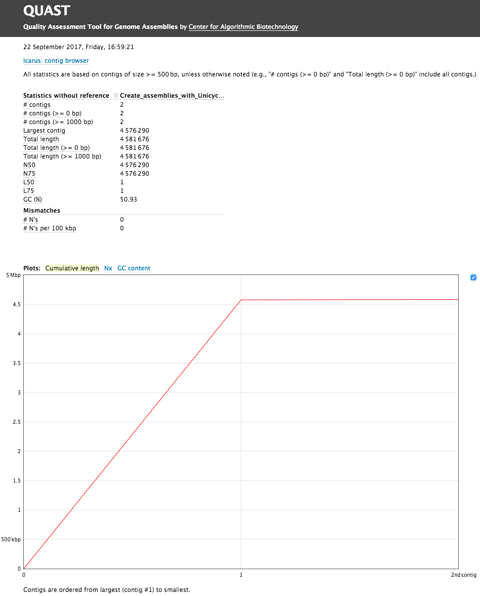

# The goal: *E. coli* C-1 assembly

In this tutorial we assemble and annotate genome of *E. coli* strain [C-1](http://cgsc2.biology.yale.edu/Strain.php?ID=8232). This strain is routinely used in experimental evolution studies involving bacteriophages. For instance, now classical works by Holly Wichman and Jim Bull ([Bull et al. 1997](https://www.ncbi.nlm.nih.gov/pubmed/9409816), [Bull & Wichman 1998](https://www.ncbi.nlm.nih.gov/pubmed/9767038), [Wichman et al. 1999](https://www.ncbi.nlm.nih.gov/pubmed/10411508)) have been performed using this strain and bacteriophage phiX174. 

To sequence the genome we have obtained the strain from the [Yale E. coli Stock Center](http://cgsc2.biology.yale.edu/). The stock center sent us a filter paper disk infused with cells. The disk was placed in the center of an LB-agar plate. A single colony was picked and resuspended in a liquid LB medium, grown overnight, and genomic DNA was isolated. The DNA was then sequenced using two methods. To obtain high coverage, high accuracy data we used Illumina miSEQ to generated 250-bp paired end reads. To generate high length reads we used the Oxford Nanopore MinIon machine.

Our goal is to reconstruct and annotate the full genome of *E. coli* C-1. As you will see in this tutorial a combination of many short, high accuracy reads with long, error-prone reads helps us produce an almost perfect assembly.

> ### Outline step-by-step
>
> In this tutorial, we will deal with:
>
>
> 1. TOC
> {:toc}
>
{: .agenda}

# Background on data and tools

## The data

In this tutorial we assemble genome using two types of input data: (1) Illumina 250 bp paired-end reads and (2) Oxford Nanopore reads.

### Illumina data

We generated 9,345,897 250 bp read pairs (library preparation performed on genomic DNA fragmented to mean size of 600 bp). However, to make sure that you can complete this tutorial in a finite amount of time we have downsampled (reduced in size) this to 1,000,000 paired end reads - just enough to produce an accurate assembly.

### Oxford Nanopore Data

There are 12,738 [2d-reads](http://www.nature.com/nmeth/journal/v12/n4/fig_tab/nmeth.3290_SF13.html). Maximum read length is 27,518. The distribution of reads lengths looks like this:

You can see that there many reads under the second peak with median of approximately 7.5 kb.

> ### <i class="fa fa-warning" aria-hidden="true"></i> Oxford Nanopore Data Format
> Oxford Nanopore machines output
 data in [fast5](http://bioinformatics.cvr.ac.uk/blog/exploring-the-fast5-format/) format that contains additional information besides sequence data. In this tutorial we assume that these data are *already* converted into [fastq](https://en.wikipedia.org/wiki/FASTQ_format). An additional tutorial dedicated to handling of fast5 datasets will be developed shortly.
{: .warning-box}

## The tools

In this analysis we will perform two tasks: (1) assembly and (2) annotation. Below we will briefly outline main ideas behind these two procedures and will describe the tools we will be using.

### Assembly

> ###  Knowing your assembly
>
> Here we assume that you know a thing or two about assembly process. If you don't: look at the slides accompanying this tutorial as well as other tutorials is this section.
{: .comment}

For assembly we will be using [Unicycler](https://github.com/rrwick/Unicycler) (also see publication by Wick:[2017](http://journals.plos.org/ploscompbiol/article?id=10.1371/journal.pcbi.1005595)). Unicycler is designed specifically for *hybrid assembly* (the one combines short and long read sequencing data) of small (e.g., bacterial, viral, organellar) genomes. In our hands it has produced complete high quality assemblies. Unicycler employs a multi-step process that utilizes a number of software tools:

. In short, Unicycler uses SPAdes (see below) to produce an assembly graph, which is then bridged (simplified) using long reads to produce longest possible set of contigs. These are then polished by aligning original short reads against produced contigs and feeding these alignment to Pilon - an assembly improvement tool.")

As you can see Unicycler relies heavily on [SPAdes](http://cab.spbu.ru/software/spades/) and [Pilon](https://github.com/broadinstitute/pilon/wiki). We will briefly describe these two tools.

#### Spades

##### Multisized deBruijn graph

Assemblers usually constructing graphs for *k*-mers of a fixed size. We have noted that when *k* is small it is difficult to resolve the repeats. If *k* is too large a corresponding graph may become fragments (especially if read coverage is low). SPAdes uses several values for *k* (that are either manually set or inferred automatically) to create a *multisized* graph that minimized tangledness and fragmentation by combining various *k*-mers (see [Bankevich:2012](http://online.liebertpub.com/doi/full/10.1089/cmb.2012.0021)):

, but all 3-mers from Genome are present in Reads. (A) The outside circle shows a separate black edge for each 3-mer from Reads. Dotted red lines indicate vertices that will be glued. The inner circle shows the result of applying some of the glues. (B) The graph DB(Reads, 3) resulting from all the glues is tangled. The three h-paths of length 2 in this graph (shown in blue) correspond to h-reads ATAG, AGGA, and GACA. Thus Reads3,4 contains all 4-mers from Genome. (C) The outside circle shows a separate edge for each of the nine 4-mer reads. The next inner circle shows the graph DB(Reads, 4), and the innermost circle represents the Genome. The graph DB(Reads, 4) is fragmented into 3 connected components. (D) The multisized de Bruijn graph DB (Reads, 3, 4). Figure from [Bankevich:2012]")

##### Read pair utilization

While the use of paired reads and mate pairs is not new (and key) to genome assembly, SPAdes utilizes so called paired DeBruin graphs to take the advantage of the paired end data. One of the key issues with paired DeBruin graphs is the resulting genome assemblies do not tolerate variability in insert sizes (the initial formulation of paired DeBruijn graphs assumed constant distance between pairs of reads). In practice this distance is always variable. SPAdes performs *k*-bimer (these are *k*-mers derived from *paired* reads) adjustment to identify exact of nearly-exact distances for each *k*-bimer pair.

##### Error correction

Sequencing data contains a substantial number of sequencing errors that manifest themselves as deviations (bulges and non-connected components) within the assembly graph. One of the ways to improve the graph even constructing it is to minimize the amount sequencing errors by performing error correction. SPAdes uses [BayesHammer](https://goo.gl/1iGkMe) to correct the reads. Here is a brief summary of what it does (see [Nikolenko:2013](https://goo.gl/1iGkMe)):

1. SPAdes (or rather BayesHammer) counts *k*-mers in reads and computed *k*-mer statistics that takes into account base quality values.
2. [Hamming graph](https://en.wikipedia.org/wiki/Hamming_graph) is constructed for *k*-mers is which *k*-mers are nodes. In this graph edges connect nodes (*k*-mers) is they differ from each other by a number of nucleotides up to a certain threshold (the [Hamming distance](https://en.wikipedia.org/wiki/Hamming_distance)). The graph is central to the error correction algorithm.
3. At this step Bayesian subclustering of the graph produced in the previous step. For each *k*-mer we now know the center of its subcluster.
4. **Solid** *k*-mers are derived from cluster centers and are assumed to be *error free*.
5. Solid *k*-mers are mapped back to the reads.
6. Reads are corrected using solid *k*-mers:

. As a result, one nucleotide is changed based on majority rule. (From [Nikolenko:2013])")

In the case of the full dataset SPAdes error correction changed 14,013,757 bases in 3,382,337 reads - a substantial fraction of the full ~18 million read dataset.

#### Pilon

Pilon improves draft assemblies by using the information from the original reads aligned to the draft assembly. The following image from a publication by [Walker:2014](http://journals.plos.org/plosone/article?id=10.1371/journal.pone.0112963) highlights the steps of this process:

, Pilon scans the read alignments for evidence where the sequencing data disagree with the input genome and makes corrections to small errors and detects small variants. During the second step (second row), Pilon looks for coverage and alignment discrepancies to identify potential mis-assemblies and larger variants. Finally (bottom row), Pilon uses reads and mate pairs which are anchored to the flanks of discrepant regions and gaps in the input genome to reassemble the area, attempting to fill in the true sequence including large insertions. The resulting output is an improved assembly and/or a VCF file of variants. (From Walker:2014)")

### Annotation

For annotation we are using [Prokka](http://www.vicbioinformatics.com/software.prokka.shtml) (also see [Seeman:2014](https://academic.oup.com/bioinformatics/article-lookup/doi/10.1093/bioinformatics/btu153)). It scans the assembly generated with Unicycler with a set of feature prediction tools and compiles a list of genome annotation. It predicts the following features (Table from [Seeman:2014](https://academic.oup.com/bioinformatics/article-lookup/doi/10.1093/bioinformatics/btu153)):

| Feature | Tool used by Prokka |
|---------|----------------------|
| Protein-coding sequences (CDS) | [Prodigal](https://github.com/hyattpd/Prodigal) |
| Ribosomal RNA genes | [RNAmmer](https://www.ncbi.nlm.nih.gov/pmc/articles/PMC1888812) |
| Transfer RNA genes | [Aragorn](https://www.ncbi.nlm.nih.gov/pubmed/14704338) |
| Signal leader peptides | [SignalP](https://www.ncbi.nlm.nih.gov/pubmed/21959131) |
| Non-coding RNA genes | [Infernal](http://eddylab.org/infernal/) |

Prokka predicts protein-coding regions using a two step process. It first identifies coordinates of putative genes using [Prodigal](https://github.com/hyattpd/Prodigal) and then compares the gene sequence against databases of known sequences at protein level using [Blast+](https://www.ncbi.nlm.nih.gov/books/NBK279690/) and [HMMer](http://hmmer.org/).

# Let's try it

## Load data and assess quality

In this example we will use a downsampled version of *E. coli* C-1 Illumina and ONT sequencing data. These include 3 files: forward and reverse reads for Illumina, and Long read file produced by ONT. All data are in [fastq](https://en.wikipedia.org/wiki/FASTQ_format) format.

> ###  Hands-on: Load data into History
>
> 1. To load data into your Galaxy instance:
>   - Log in into Galaxy
>   - Create new history (if you are new to Galaxy see [Galaxy 101 tutorial](/topics/introduction/tutorials/galaxy-intro-101/tutorial.html) first).
>
> 2. **Get data**  as shown below (see [these slides](/topics/introduction/tutorials/galaxy-intro-get-data/slides.html) for an introduction on how to load data into Galaxy):
>
>       
>
> 3. Open Zenodo 
 link in a **new browser window** and right-click on dataset links:
>       
> 4. And paste them into the **Galaxy upload**:
>
>
>        click <b>Paste/Fetch data</b> link. Next (2), paste URL copied from Zenodo. Finally (3), set type of all datasets to <tt>fastqsanger</tt>. Click <b>Start</b> (4).")
>
{: .hands_on}

If all goes well you will see datasets uploading and changing states from gray to green as shown below. The figure below also shows how datasets can be tagged.

 to green (all OK) state is shown. To make it easier to identify datasets as we progress through the analysis we use so called <em>Hashtags</em>. To tag a dataset: click on dataset to expand it (as shown in panel four); click tag icon (<i class='fa fa-tags' aria-hidden='true'></i>) and a text field will appear. Add a tag (in this case <b>F</b>) pre-pended with hash (#). Hit enter. Do this for all three datasets and it will look like it is shown in panel five.")

### Assess Read Quality

To assess quality we will use two tools: [FastQC](https://www.bioinformatics.babraham.ac.uk/projects/fastqc/) to generate quality statistics and [multiQC](http://multiqc.info/) to summarize these statistics.

> ###  Hands-on: Quality Control
>
> 1. **FastQC**  on all three fastq datasets simultaneously using the multi-datasets button
>
> 2. **MultiQC**  on FastQC outputs. Although FastQC generated graphical reports for each dataset we can look at everything at once using multiQC with the following parameters :
>   - "Software name" to `FastQC`
>   - "Result file" to all Multiple datasets selection button an `RawData` outputs of FastQC
>
{: .hands_on}

A quick look at quality score distribution will show a confusing picture:

 are <b>much</b> shorter that ONT reads (red) the plot looks strange. ONT reads generally have low quality scores and so they are not really meaningful in the context of this technology. However, in case of Illumina data they mean a lot...")

So let's zoom in into Illumina data:

## Assembly with Unicycler

Now it is time to perform assembly.

> ###  Hands-on: Unicycler Assembly
>
> 1. **Unicycler**  with the following parameters :
>   - "Paired or Single end data?" to `Paired`
>   - "First Set of reads" to the forward reads file `f`
>   - "Second Set of reads" to the reverse reads file `r`
>   - "Long reads" to the minion file
>   - Use default parameters
>
{: .hands_on}

> ### <i class="fa fa-cutlery" aria-hidden="true"></i> <i class="fa fa-coffee" aria-hidden="true"></i> Assembly takes time!
>
> There is no such thing as Assembly in real time. It takes time so it is a good time to have lunch or at least coffee. This Unicycler run will take anywhere between 90 min to two hours.
{: .warning-box}

## Assess Assembly quality with Quast

[Quast](http://quast.bioinf.spbau.ru) is a tool providing quality metrics for assemblies, and can also be used to compare multiple assemblies. The tool can also take an optional reference file as input, and will provide complementary metrics.

> ###  Hands-on: Assembly Quality
>
> 1. **Quast**  with the following parameters :
>   - "Input assembly file" to the fasta file resulting from the Unicycler assembly.
>   - Other parameters at default settings
>
{: .hands_on}

The Quast tool outputs assembly metrics as an html file with metrics and graphs. The image below looks exceptionally boring. This is a **good** thing:

One can see that there are two (!) contigs. The largest contig is 4,576,290 bp (for comparison *E. coli* K12 MG1655 strain genome length is [4,656,144 bp](https://www.ncbi.nlm.nih.gov/nuccore/NZ_APIN00000000.1)) and the smallest is 4,581,676 (total length) - 4,576,290 (length of the largest) = 5,386 bp. When we analyzed this dataset for the first time we were initially puzzled by this second contig. But we quickly realized that this is simply the genome of bacteriophage [phiX174](https://www.ncbi.nlm.nih.gov/nuccore/NC_001422.1) which is routinely used as a spike-in in Illumina sequencing. Thus we have two genomes: the one of *E.coli* C-1 and phiX174! We can now use Prokka to annotate our two genomes.

## Annotation with Prokka

> ###  Hands-on: Annotation
>
> 1. **Prokka**  with the following parameters:
>   - "Contigs to annotate" parameter to the assembly ouput of `Unicycler`
>   - "Genus name" parameter to `Escherichia`
>   - "Species name" parameter to `coli`
>   - "Strain name" parameter to `C-1`
>   - "Use genus" parameter to `yes`
>
{: .hands_on}

Prokka outputs 10 datasets (including two log files). These are in various formats:

* **txt** : Provides Statistics on the annotation : number of CDS predicted, number of rRNA etc.
* **tbl** : Provides a tabulated list of annotated features.
* **fsa** : Nucleotide fasta file of the input contig sequence.
* **sqn** : [ASN.1](https://www.ncbi.nlm.nih.gov/Structure/asn1.html) format file for submission to GenBank.
* **ffn** : Nucleotide FASTA file of all the prediction transcripts.
* **faa** : Protein FASTA file of the translated CDS sequences.
* **fna** : Nucleotide fasta file of the input contig sequence.
* **gbk** : [GenBank](https://www.ncbi.nlm.nih.gov/Sitemap/samplerecord.html) file.
* **gff** : [gff3](http://gmod.org/wiki/GFF3) file.

## Visualize the results in IGV

Let's look at the entire assembly and its annotation in the genome browser. We can do this using Integrated Genome Browser ([IGV](http://software.broadinstitute.org/software/igv/)).

Visualization requires a local installation of IGV. If you have IGV installed - just start it. If you don't - read on.

#### Starting IGV

Go to IGV [download page](http://software.broadinstitute.org/software/igv/download) and select one of the options. The one I would try first would be **Jave Web Start**.Simply click the **Launch** button for 10 GB distribution.

> ###  Hands-on: Visualization in IGV
>
>
> 1. Start IGV, it will look something like this:
>
>       build. This is obviously <b>not</b> what we want.")
>
> 2. Locate the output of Unicycler and expand it :
>
>      
>
> 3. Click on the *local* link highlighted with orange outline. The browser will change:
>
>      
>
> 4. Let's add Prokka annotations to the browser image. For this simply expand Prokka's GFF3 dataset and click on the *local* link:
>
>       to display this dataset within IGV.")
>      
{: .hands_on}

You will now see the annotations within the browser window:

