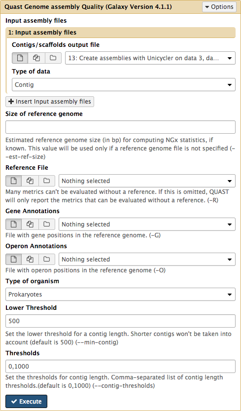

# Introduction
{:.no_toc}
# Small genome assembly with Unicycler

A few definitions to start:

 * **Alignment** : Similarity-based arrangement of DNA, RNA or protein sequences. In this context, subject and query sequence should be orthologous and reflect evolutionary, not functional or structural relationships
 * **Assembly** : Computational reconstruction of a longer sequence from smaller sequence reads
 * **Contig** : A contiguous linear DNA or RNA consensus sequence. Constructed from the assembly of smaller, partially overlapping, sequence fragments (reads)
 * **Coverage** : Also known as ‘sequencing depth’. Sequence coverage refers to the average number of reads per locus.
 * **De novo assembly** : Refers to the reconstruction of contiguous sequences without making use of any reference sequence
 * **Library** : Collection of DNA (or RNA) fragments modified in a way that is appropriate for downstream analyses
 * **Mapping** : Alignment of short sequence reads to a longer reference sequence
 * **Masking** : Converting a DNA sequence [A,C,G,T] (usually repetitive or of low quality) to the uninformative character state N or to lower case characters [a,c,g,t] (soft masking)
 * **Mate-pair** : Sequence information from two ends of a DNA fragment, usually several thousand base-pairs long
 * **N50** : A statistic of a set of contigs or scaffolds : the length for which the collection of all contigs of that length or longer contains at least half of the total of the lengths of the contigs
 * **N90** : Equivalent to the N50 statistic describing the length for which the collection of all contigs of that length or longer contains at least 90% of the total of the lengths of the contigs
 * **Paired-end sequencing** : Sequence information from two ends of a short DNA fragment, usually a few hundred base pairs long
 * **Read** : Short base-pair sequence inferred from the DNA/RNA template by sequencing
 * **Scaffold** : Two or more contigs joined together using read-pair information
 
There are two types of genome assembly: *de novo* (from scratch) are reference assisted. Reference-assisted assembly is performed by mapping sequencing reads against a reference genome from the same or a closely-related species.
*De novo* genome assembly is performed by inferring all information from overlaps between sequencing reads only. These overlaps are extended to ultimately cover all chromsomes. 

")

To understand how genome assembly works, look at our previous trainings : 
* [Introduction to Genome Assembly](https://galaxyproject.github.io/training-material/topics/assembly/tutorials/general-introduction/slides.html#1)
* [De Bruijn Graph Assembly](https://galaxyproject.github.io/training-material/topics/assembly/tutorials/debruijn-graph-assembly/slides.html#1)

Two currently available technologies are the most suitable for small genome sequencing. Illumina’s reversible terminator process offers high coverage and accuracy at relatively low cost but can at most generate reads 300 bp in length. On the other hand, Oxford Nanopore’s molecular ratcheting through nanopore generates multi-kilobase reads that often surpass 100,000 bp in length. 

The two technologies produce different types of data. Illumina's reads are short and of higher quality, while much longer Oxford Nanopore have high error rate.  Combining both technologies amplifies their relative strengths and enables to produce complete, high qulaity assemblies. 

*De novo* assembly involves several steps described in the following image:

, or paired-end reads with variable insert size like mate pair librairies that have larger insert (2 to 20 kb insert). The long read technologies allow to sequences up to several thousand of basesFrom this fragments, an assembly allows to merge reads into contigs and then scaffolds. Once the genome assembli has been made, an annotation is performed by comparing to related genome or using RNA-seq data for example.")

## QC

The Oxford Nanopore Technology produces [fast5](http://bioinformatics.cvr.ac.uk/blog/tag/fast5/) files, one for each read, that need to be converted to fastq format. The [poretools](https://poretools.readthedocs.io/en/latest/) suite provides utilities for working with ONT data, and allows to convert from fast5 to fastq and to assess the read quality.  In this tutorial we will assume that this step has been completed and that we are already in the possession of fastq data.

The quality of Illumina reads can be assessed with tools such as [FastQC](http://www.bioinformatics.babraham.ac.uk/projects/fastqc). A wide variety of tools can be used to improve the quality of the reads that won't be discussed in this tutorial (More info [here](https://galaxyproject.org/tutorials/ngs/)).

## Assembly with Unicycler

[Unicycler](https://github.com/rrwick/Unicycler) is an assembly pipeline for bacterial genomes, based on [Spades Assembler](http://cab.spbu.ru/software/spades/) to which it adds a cicularisation process. Unicycler provides an assembly graph in addition to the fasta file and can handle plasmid rich genomes. Like Spades, it can assemble Illumina-only or hybrid datasets. For Illumina assembly, Unicycler optimises Spades by selecting a range of *k*-mer sizes and selecting the best, and applying several filters to refine the results. For hybrid assembly, Unicycler uses long reads to build bridges to resolve high repeat regions and obtain longer assemblies. You can find more informations in 
[Wick:2017](http://journals.plos.org/ploscompbiol/article/file?id=10.1371/journal.pcbi.1005595&type=printable)

## Annotation with Prokka

The annotation of the newly assembled genomes will allow the identification of genomic features such as proptein-coding and RNA genes. In this tutorial we will use [Prokka](http://www.vicbioinformatics.com/software.prokka.shtml) designed for rapid annotation of small genomes. Prokka uses [Blast+](https://www.ncbi.nlm.nih.gov/books/NBK279690/) or [HMMer](http://hmmer.org/) on databases derived from [UniProtKB](http://www.uniprot.org/help/uniprotkb) to assign function to the predicted coding regions.

## Let's try it

> ### Agenda
>
> In this tutorial, we will deal with:
>
> 1. [Get the data](#get-the-data)
> 2. [Assess reads quality](#assess-read-quality)
> 3. [Assembly with Unicycler](#assemble-with-unicycler)
> 4. [Assess Assembly quality with Quast](#quast)
> 5. [Annotate with Prokka](#annotate-with-prokka)
> 6. [Visualize the results](#visualize-the-result)
{: .agenda}

### <a name="get-the-data">Get the data

In this example we will use a downsampled version of *E. coli* C Illumina and ONT sequencing data. These include 3 files: forward and reverse reads for Illumina, and Long read file produced by ONT.

Here is what to do to load the data:

> ### :pencil2: Hands-on: Getting the data
>
> 1. Create and name a new history for this tutorial.
> 2. Go to the [data library](https://usegalaxy.org/library/list#folders/Ff4ce53393dae30ee) and select all fastq files. Then Click `to History` button:
>  
> 3. Once the files have been uploaded, change their types to fastqsanger 
>
>    > ### :bulb: Tip: Changing a dataset datatype
>    >
>    > * Click on the pencil icon of the dataset in the history 
>    > * Open the Datatype tab
>    > * Change the data-type to **fastqsanger**
>    > * Save
>    {: .tip}
>
>
{: .hands_on}

The datasets will appear in your history:

### <a name="assess-read-quality">Assess Read Quality

You can assess the quality of Illumina reads by using FastQC.

FastQC will provide you with an html report about your read quality. In addition to basic informations about the data (type of file, encoding read range of lengths and percentage of GC in the sequences), the report contains graphs for several quality metrics. One of them is a boxplot showing the sequence quality per base. 

Another plot shows the quality per sequence.

The Quality read per tile represent the flowcell tiles from which the reads came.  

The metrics on Illumina read shows a library of high quality reads, we can now perform the assembly with Unicycler.

### Assembly with Unicycler 

The Unicycler tool takes fastqsanger files as inputs. If your files are identified as generic fastq files you will need to change the type of your files.

Repeat the process for the three datasets.

You can now run Unicycler to perform the assembly with the following parameters: 

* **Paired or Single end data?** : Select the appropriate option to describe you data. In this example we are using Paired end Data.
* **Select first set of reads** : Specify the dataset containing the forward reads, often specified by a "-1" in the file name, but specified here by the "R1".
* **Select second set of reads** : Specify the dataset containing the forward reads, often specified by a "-2" in the file name, but specified here by the "R2".
* **Select long reads** : Optional, here specify you Oxford Nanopore dataset.

Unicycler returns two output files: a fasta file containing the result of the assembly, and a graph file.  You can then evaluate the quality of the resulting alignments by using the Quast tool on the fasta file.

## <a name="quast">Assess Assembly quality with Quast

[Quast](http://bioinf.spbau.ru/quast) is a tool providing quality metrics for assemblies, and can also be used to compare multiple assemblies. The tool can also take an optional reference file as input, and will provide complementary metrics.
For this tutorial we will simply use quast on the fasta file resulting from the Unicycler assembly.

The Quast tool outputs assembly metrics as an html file with metrics and graphs.

We can now use Prokka to annotate our genome.

### <a name="annotate-with-prokka">Annotation with Prokka

Run Prokka with the following paramters:

* **Contigs to annotate** : Specify the fasta file resulting from your assembly with Unicycler.
* **Locus tag prefix** : Specify the format you desire for your locus tags. By Default PROKKA.
* **Locus tag counter increment** : By default 1, but a 10 increment facilitate the insertion of new genes when manually correcting the annotation.
* **Force GenBank/ENA/DDJB compliance** : Select "yes" if you desire to force the GenFank Locus tag formatting. If you do so be aware of the length limitation. Here we select no for more convenience.
* **Add 'gene' features for each 'CDS' feature** : Select yes to get the gene feature in addition to the CDS feature in the gff3.
* **Genus name** : Specify the Genus of your organism. Here "Escherichia".
* **Species name** : Specify the species of your organism. Here "Coli".
* **Strain name** : Specify the strain of your organism. Here "C".
* **Kingdom** : Select the kingdom to which your organism belong. Here "Bacteria".
* **Use genus-specific BLAST database** : Select "yes" to use the genus-specific Blast.

Prokka outputs 10 datasets. One of the is the Prokka log, another is the error repport,  but 8 are diverse result files : 
* **txt file** : Provides Statistics on the annotation : number of CDS predicted, number of rRNA etc.
* **tbl file** : Provides a tabulated list of annotated features.
* **fsa file** : Nucleotide fasta file of the input contig sequence.
* **sqn file** : ASN1 format file for submission to GenBank.
* **ffn file** : Nucleotide FASTA file of all the prediction transcripts.
* **faa file** : Protein FASTA file of the translated CDS sequences.
* **fna file** : Nucleotide fasta file of the input contig sequence.
* **gbk file** : GenBank file.
* **gff file** : gff3 file.

### <a name="visualize-the-result">Visualization

You can visualize Prokka annotations using Integrative Genome Browser (IGV).
First, download and install [IGV](http://software.broadinstitute.org/software/igv/) Open an instance of IGV on you computer, and then import the genome file from galaxy by clicking on the "display with IGV local" 

You can then send the gff file resulting from the annotation with Prokka.

You can then visualize the result of your analysis in IGV 

