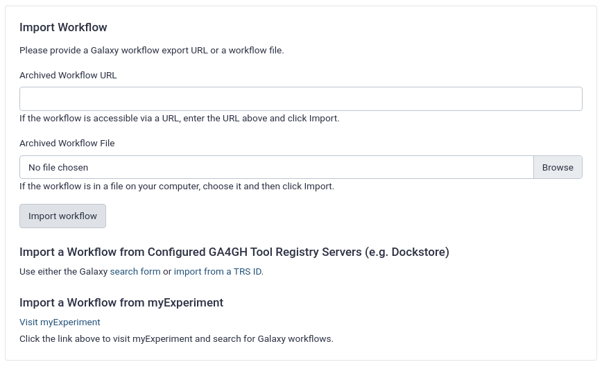

# Introduction
{:.no_toc}

Advances in sequencing technologies over the last few decades have revolutionised the field of genomics, allowing for a reduction in both the time and resources required to *de novo* genome assembly. Until recently, second-generation sequencing technologies (also known as Next Generation Sequencing or NGS) allowed to produce highly accurate but short (up to 800bp), whose extension was not long enough to cope with the difficulties associated with repetitive regions. Today, so-called third-generation sequencing (TGS) technologies, usually known as single-molecule real-time (SMRT) sequencing, have become dominant in de novo assembly of large genomes. TGS can use native DNA without amplication, reducing sequencing error and bias (, ). Very recently, Pacific Biosciences introducedHigh-Fidelity (HiFi) sequencing, which produces reads 10-20 kpb in length with a minimum accuracy of 99% (Q20). In this tutorial you will use HiFi reads in combination with data from additional sequencing technologies to generate a high-quality reference genome assembly.

Deciphering the structural organisation of complex vertebrate genomes is currently one of the most challenges in genomics (). Despite the significant progress made in recent years, a key question remains: what combination of data and tools can produce the highest quality assembly? In order to adequately answer it, it is necessary to analyse two of the main factors that determine the difficulty of genome assembly processes: repetitive content and heterozigosity.

Repetitive elements can be grouped into two categories: interspersed repeats, such as transposable elements (TE) that occur at multiple loci throughout the genome, and tandem repeats (TR), that occur at a single locus (). Repetitive elements are an important component of eukariotyc genomes, constituting over a third of the genome in the case of mammals (, ). In the case of tamdem repeats, various estimates suggest that they are present in at least one third of human protein sequences (). TE content is among the main factors contributing to the lack of continuity in the reconstruction of genomes, especially in the case of large ones, as its content is highly correlated with genome size (). On the other hand, TR usually lead to local genome assembly collapse, especially when their length is close to that of the reads ().

Heterozygosity is also an important factor in genome assembly. Haplotype phasing, that is, the identification of alleles that are co-located on the same chromosome, has become a fundamental problem in heterozygous and polyploid genome assemblies (). When there's not a reference sequence available, the *state-of-the--art* strategy consist in constructing a string graph with vertexes representing reads and edges representing consistent overlaps. In this kind of graph, after transitive reduction, heterozigous alleles in the string graph are represented by bubbles. When combined with Hi-C data, this approach allows complete diploid reconstruction (, , ).

The G10K consortium launched the Vertebrate Genomes Project (VGP), whose goal is generating high-quality, near-error-free, gap-free, chromosome-level, haplotype-phased, annotated reference genome assembly for each of the vertebrate species (). Thhis tutorial will guide you step by step to assemble a high-quality referece genome by using the VGP assembly pipeline.


> ### Agenda
>
> In this tutorial, we will cover:
>
> 1. TOC
> {:toc}
>
{: .agenda}

# VGP assembly pipeline overview

The figure 1 represents the VGP assembly pipeline. 


The tutorial is structured in four main sections:

- Genome profile analysis
- HiFi phased assembly with Hifiasm
- Hybrid scaffolding based using Bionano data
- Hi-C scaffolding

## Run the VGP workflows automatically

The pipeline proposed in this training is an adaption of the [current workflow versions](https://github.com/Delphine-L/iwc/tree/VGP/workflows/VGP-assembly-v2), whose purpuse is to explain each of the stages in with VGP assembly pipeline is structured. If you desire to run the *state-of-art* VGP pipelines, just follow the following instructions:

> ###  Hands-on: Run workflow
>
> 1. Dowload the worflow files (whose extesion is *ga*) from this [GitHub repository](https://github.com/Delphine-L/iwc/tree/VGP/workflows/VGP-assembly-v2).
> 2. Click on Workflow on the top menu bar of Galaxy. You will see a list of all your workflows.
> 3. Click on the upload icon  at the top-right of the screen.
> 
> 4. Provide your workflow:
>    - Option 1: Upload the workflow file in the box labelled “Archived Workflow File”
>    - Option 2: Paste the URL of the workflow into the box labelled “Archived Workflow URL”
> 5. Click the **import workflow** button.
>
{: .hands_on}

> ###  Comments
> The Galaxy workflows include additional steps (e.g. parse parameter value) required for running it automatically, but which are not necessary when we run the pipeline step by step manually.
{: .comment}
    
## Background on datasets

To reduce compute times, we will use samples from the yeast _Saccharomyces cerevisiae_, one of the most intensively studied eukaryotic model organisms in molecular and cell biology. Yeast can be haploid or diploid, depending the stage of its life cycle. Both cell types are stable and can reproduce asexually by mitosis.

The VGP assembly pipeline uses data generated by a variery of technologies, including PacBio HiFi reads, Bionano optical maps, and Hi-C chromatin interaction maps.

PacBio HiFi reads rely on the Single Molecule Real-Time (SMRT) sequencing technology. SMRT is based on real-time imaging of fluorescently tagged nucleotides as they are added to a newly synthesized DNA strand. HiFi further combine multiple subreads from the same circular template to produce one highly accurate consensus sequence (fig. 3). This technology allows to generate long-read sequencing data with read lengths in the range of 10-25 kb and minimum read consensus accuracy  greater than 99% (Q20).

<!--

-->
    
Bionano technology relies on the isolation of kilobase-long DNA fragments, which are labeled at specific sequence motifs with a fluorescent dye, resulting in a unique fluorescent pattern for each genome. DNA molecules are stretched into nanoscale channels and imaged with a high-resolution camera, allowing to build optical maps based on the distance between motif-specific patterns (, ).

Linkage information provided by optical maps is integrated with primary assembly sequences, and the overlaps are used to orient and order the contigs, resolve chimeric joins, and estimate the length of gaps between adjacent contigs (fig. 4).
    


    
Finally, the thigh-throughput chromosome conformation capture (Hi-C) technology is based on the capture of the chromatin three-dimensional. During Hi-C library preparation, DNA is crosslinked the chromatin in its 3D conformation. The crosslinked DNA is digested using restriction enzymes, and the digested ends are filled with biotinylated nucleotides. Next, the blunt ends of spatially proximal digested end are ligated. This provides contact information that can be used to reconstruct the proximity of genomic sequences belonging to the same chromosome ().

# Get data

Now we can start with the pipeline. The first step is to get the datasets from Zenodo:
    
> ###  Hands-on: Data upload
>
> 1. Create a new history for this tutorial
> 2. Import the files from [Zenodo]({{ page.zenodo_link }})
>
>    - Open the file  __upload__ menu
>    - Click on **Rule-based** tab
>    - *"Upload data as"*: `Datasets`
>    - Copy the tabular data, paste it into the textbox and press <kbd>Build</kbd>
>
>       ```
>   Hi-C_dataset_F   https://zenodo.org/record/5550653/files/SRR7126301_1.fastq.gz?download=1   fastqsanger.gz    Hi-C
>   Hi-C_dataset_R   https://zenodo.org/record/5550653/files/SRR7126301_2.fastq.gz?download=1   fastqsanger.gz    Hi-C
>   Bionano_dataset    https://zenodo.org/record/5550653/files/bionano.cmap?download=1   cmap    Bionano
>       ```
>
>    - From **Rules** menu select `Add / Modify Column Definitions`
>       - Click `Add Definition` button and select `Name`: column `A`
>       - Click `Add Definition` button and select `URL`: column `B`
>       - Click `Add Definition` button and select `Type`: column `C`
>       - Clich `Add Definition` button and select `Name Tag`: column `D`
>    - Click `Apply` and press <kbd>Upload</kbd>
>   
> 3. Import the remaining datasets from [Zenodo]({{ page.zenodo_link }})
>
>    - Open the file  __upload__ menu
>    - Click on **Rule-based** tab
>    - *"Upload data as"*: `Collections`
>    - Copy the tabular data, paste it into the textbox and press <kbd>Build</kbd>
>
>       ```
>   SRR13577846_1    https://zenodo.org/record/5550653/files/SRR13577846_1.30x.wgaps.fastq.gz?download=1  fastqsanger.gz    HiFi  HiFi_collection
>   SRR13577846_2    https://zenodo.org/record/5550653/files/SRR13577846_2.30x.wgaps.fastq.gz?download=1  fastqsanger.gz    HiFi  HiFi_collection
>   SRR13577846_3    https://zenodo.org/record/5550653/files/SRR13577846_3.30x.wgaps.fastq.gz?download=1  fastqsanger.gz    HiFi  HiFi_collection
>       ```
>
>    - From **Rules** menu select `Add / Modify Column Definitions`
>       - Click `Add Definition` button and select `List Identifier(s)`: column `A`
>       - Click `Add Definition` button and select `URL`: column `B`
>       - Click `Add Definition` button and select `Type`: column `C`
>       - Clich `Add Definition` button and select `Group Tag`: column `D`
>       - Clich `Add Definition` button and select `Collection Name`: column `E`
>    - Click `Apply` and press <kbd>Upload</kbd>
>
{: .hands_on}

    

## Primer removal from HiFi reads

Now, we will trim the residual adaptors sequences by using Cutadapt, in order remove the reads  that could interfere with the assembly process.

> ###  Hands-on: Primer removal
>
> 1.  with the following parameters:
>    - *"Single-end or Paired-end reads?"*: `Single-end`
>        -  *"FASTQ/A file"*: `HiFi_collection`
>        - In *"Read 1 Options"*:
>            - In *"5' or 3' (Anywhere) Adapters"*:
>                -  *"Insert 5' or 3' (Anywhere) Adapters"*
>                    - *"Source"*: `Enter custom sequence`
>                        - *"Enter custom 5' or 3' adapter name"*: `First adapter`
>                        - *"Enter custom 5' or 3' adapter sequence"*: `ATCTCTCTCAACAACAACAACGGAGGAGGAGGAAAAGAGAGAGAT`
>                -  *"Insert 5' or 3' (Anywhere) Adapters"*
>                    - *"Source"*: `Enter custom sequence`
>                        - *"Enter custom 5' or 3' adapter name"*: `Second adapter`
>                        - *"Enter custom 5' or 3' adapter sequence"*: `ATCTCTCTCTTTTCCTCCTCCTCCGTTGTTGTTGTTGAGAGAGAT`
>    - In *"Adapter Options"*:
>        - *"Match times"*: `3`
>        - *"Maximum error rate"*: `0.1`
>        - *"Minimum overlap length"*: `35`
>        - *"Look for adapters in the reverse complement"*: `True`
>    - In *"Filter Options"*:
>        - *"Discard Trimmed Reads"*: `Yes`
>
> 2. Rename the output file as `HiFi_collection (trim)`. To rename an output file, click on the result, and then click again on the title to change it. After closing, you may need to refresh the history to see the name change.
>
{: .hands_on}

# Genome profile analysis

Before starting a de novo genome assembly project, it useful to collect metrics on the properties of the genome under consideration, such as the expected genome size. Traditionally DNA flow citometry was considered the golden standard for estimating the genome size. Nowadays experimental methods have been replaced by computational approaches . One of the widely used genome profilling methods is based on the analysis of k-mer frequencies. It allows to provide information not only about the genomic complexity, such as the genome size, levels of heterozygosity and repeat content, but also about the data quality.

> ###  K-mer size, sequencing coverage and genome size
>
>K-mers are unique substrings of length k contained within a DNA sequence. For example, the DNA sequence *TCGATCACA* can be decomposed into six unique k-mers that have five bases long: *TCGAT*, *CGATC*, *GATCA*, *ATCAC* and *TCACA*. A sequence of length L will have  L-k+1 k-mers. On the other hand, the number of possible k-mers can be calculated as  n<sup>k</sup>, where n is number of possible monomers and k is the k-mer size.
>
>
>---------| -------------|-----------------------
>  Bases  |  K-mer size  |  Total possible k-mers
>---------| -------------|-----------------------
>    4    |       1      |            4          
>    4    |       2      |           16          
>    4    |       3      |           64          
>    4    |       4      |          256          
>    4    |      ...     |          ...          
>    4    |      10      |    1.048.576         
>---------|--------------|-----------------------
>
> Thus, the k-mer size is a key parameter, which must be large enough to map  uniquely to the genome, but not too large, since it can lead to wasting computational resources. In the case of the human genome, k-mers of 31 bases in length lead to 96.96% of unique k-mers.
>
>Each unique k-mer can be assigned a value for coverage based on the number of times it occurs in a sequence, whose distribution will approximate a Poisson distribution, with the peak corresponding to the average genome sequencing depth. From the genome coverage, the genome size can be easily computed.
{: .details}

    
In section we will use two basic tools to computationally estimate the genome features: Meryl and GenomeScope.

## Generation of k-mer spectra with **Meryl**

Meryl will allow us to generate the *k*-mer profile by decomposing the sequencing data into *k*-lenght substrings, counting the ocurrence of each *k*-mer and determining its frequency. The original version of Meryl was developed for the Celera Assembler. The current Meryl version compises three main modules: one for generating *k*-mer databases, one for filtering and combining databases, and one for searching databases. *K*-mers are stored in lexicographical order in the database, similar to words in a dictionary ().

> ###  *k*-mer size estimation
>
>  Given an estimated genome size (G) and a tolerable collision rate (p), an appropriate k can be computed as k = log4 (G(1 − p)/p).
>
{: .comment}

> ###  Hands-on: Generate *k*-mers count distribution
>
> 1.  with the following parameters:
>    - *"Operation type selector"*: `Count operations`
>        - *"Count operations"*: `Count: count the ocurrences of canonical *k*-mers`
>        -  *"Input sequences"*: `HiFi_collection (trim)`
>        - *"*k*-mer size selector"*: `Set a *k*-mer size`
>            - "**k*-mer size*": `21`
>
>    > ###  Election of *k*-mer size
>    >
>    > We used 21 as *k*-mer size, as this length has demonstrated to be sufficiently long that most *k*-mers are not repetitive and is short enough to be more robust to sequencing errors. For very large (haploid size > 10 Gb) and/or very repetitive genomes, larger *k*-mer length is recommended to increase the number of unique *k*-mers. 
>    {: .comment}
>
> 2. Rename it `Collection meryldb`
>
> 3.  with the following parameters:
>    - *"Operation type selector"*: `Operations on sets of *k*-mers`
>        - *"Operations on sets of *k*-mers"*: `Union-sum: return *k*-mers that occur in any input, set the count to the sum of the counts`
>        -  *"Input meryldb"*: `Collection meryldb`
>
> 4. Rename it as `Merged meryldb`    
>
> 5.  with the following parameters:
>    - *"Operation type selector"*: `Generate histogram dataset`
>        -  *"Input meryldb"*: `Merged meryldb`
>
> 6. Finally, rename it as `Meryldb histogram`.
>
{: .hands_on}


## Genome profiling with **GenomeScope2**

The next step is to infer the genome properties from the *k*-mer histogram generated by Meryl, for which we willl use GenomeScope2. Genomescope2 relies on a nonlinear least-squares optimization to fit a mixture of negative binomial distributions, generating estimated values for genome size, repetitiveness, and heterozygosity rates ().

> ###  Hands-on: Estimate genome properties
>
> 1.  with the following parameters:
>    -  *"Input histogram file"*: `Meryldb histogram`
>    - *"*k*-mer length used to calculate *k*-mer spectra"*: `21`
>
>   - In "*Output options*": mark `Summary of the analysis`
>   - In "*Advanced options*":
>       - *"Create testing.tsv file with model parameters"*: `true`
>
>    {: .comment}
>
{: .hands_on}

Genomescope will generate six outputs:
    
- Plots
    - *Linear plot*: *k*-mer spectra and fitted models: frequency (y-axis) versus coverage.
    - *Log plot*: logarithmic transformation of the previous plot.
    - Transformed linear plot: *k*-mer spectra and fitted models: frequency times coverage (y-axis) versus coverage (x-axis). It allows to increases the heights of higher-order peaks, overcoming the effect of high heterozygosity.
    - Transformed log plot: logarithmic transformation of the previous plot.
- Model: this file includes a detailed report about the model fitting.
- Summary: it includes the properties infered from the model, such as genome haploid length and the percentage of heterozygosity.

Now, let's analyze the *k*-mer profiles, fitted models and estimated parameters:


This distribution is the result of the Poisson process underlying the generation of sequencing reads. As we can see, there is an unique peak centered around 28x, the modal *k*-mer coverage. The absence of a secondary peak at half diploid coverage is suggestive of the haploid nature of this genome, but could generally result also from very low heterozygosity. Low frequency *k*-mers are the result of sequencing errors.

Before proceeding to the next section, we need to carry out some operations on the output generated by GenomeScope2. The goal is to extract some parameters which at a later stage will be used by **purge_dups** (). The first relevant parameter is the `estimated genome size`.

> ###  Hands-on: Get estimated genome size
>
> 1.  with the following parameters:
>    -  *"File to process"*: `summary` (output of **GenomeScope** )
>    - *"Find pattern"*: `bp`
>    - *"Replace all occurences of the pattern"*: `Yes`
>    - *"Find and Replace text in"*: `entire line`
>
> 2.  with the following parameters:
>    -  *"File to process"*: output file of **Replace** )
>    - *"Find pattern"*: `,`
>    - *"Replace all occurences of the pattern"*: `Yes`
>    - *"Find and Replace text in"*: `entire line`
>
> 3.  with the following parameters:
>    -  *"Select lines from"*: output file of the previous step.
>    - *"Type of regex"*: `Basic`
>    - *"Regular Expression"*: `Haploid`
>
> 4.  with the following parameters:
>    -  *"in Dataset"*: output of **Search in textfiles** 
>
> 5.  with the following parameters:
>    -  *"File to cut"*: output of **Convert delimiters to TAB** 
>    - *"Cut by"*: `fields`
>        - *"List of Fields"*: `Column: 5`
>
> 6. Rename the output as `Estimated genome size`.
>
> > ###  Questions
> >
> > What is the estimated genome size?
> >
> > > ###  Solution
> > >
> > > The estimated genome size is 12664060 bp.
> > >
> > {: .solution}
> >
> {: .question}
> 
{: .hands_on}

Now let's parse the `upper bound for the read depth estimation` parameter.
       
> ###  Hands-on: Get maximum read depth
>
> 1.  with the following parameters:
>    - *"Add expression"*: `1.5*c3`
>    -  *"as a new column to"*: `model_params` (output of **GenomeScope** )
>    - *"Round result?"*: `Yes`
>    - *"Input has a header line with column names?"*: `No`
>
> 2.  with the following parameters:
>    - *"Add expression"*: `3*c7`
>    -  *"as a new column to"*: output of the previous step.
>    - *"Round result?"*: `Yes`
>    - *"Input has a header line with column names?"*: `No`
>
> 3. Rename it as `Parsing temporal output`
>
> 4.  with the following parameters:
>    -  *"File to cut"*: `Parsing temporal output`
>    - *"Cut by"*: `fields`
>        - *"List of Fields"*: `Column 8`
>
> 6. Rename the output as `Maximum depth`
>
> > ###  Questions
> >
> > What is the estimated maximum depth?
> >
> > > ###  Solution
> > >
> > > The estimated maximum depth is  63 reads.
> > >
> > {: .solution}
> >
> {: .question}
>
{: .hands_on}

Finally, let's parse the `transition between haploid and diploid coverage depths` parameter.

> ###  Hands-on: Get transition parameter        
> 1.  with the following parameters:
>    -  *"File to cut"*: `Parsing temporal output`
>    - *"Cut by"*: `fields`
>        - *"List of Fields"*: `Column 7`
>
> 2. Rename the output as `Transition parameter`
>
> > ###  Questions
> >
> > What is the estimated transition parameter?
> >
> > > ###  Solution
> > >
> > > The estimated transition parameter is  21 reads.
> > >
> > {: .solution}
> >
> {: .question}
>
{: .hands_on}


# HiFi phased assembly with hifiasm

Once we have done genome profiling stage, we can start the genome assembly with **hifiasm**,  a fast open-source de novo assembler specifically developed for PacBio HiFi reads.

## Genome assembly with **hifiasm**

One of the key advantages of hifiasm is that it allows to resolve near-identical, but not exacly identical sequences, such as repeats and segmental duplications ().

> ###  Hifiasm algorithm details
>
>By default hifiasm performs three rounds of haplotype-aware error correction to correct sequence errors but keeping heterozygous alleles. A position on the target read to be corrected is considered informative if there are two different nucleotides at that position in the alignment, and each allele is supported by at least tree reads.
>
> 
>
>Then, hifiasm builds a phased assembly string graph with local phasing information from the corrected reads. Only the reads coming from the same haplotype are connected in the phased assembly graph. After transitive reduction, a pair of heterozygous alleles is represented by a _bubble_ in the string graph. If there is no additional data, hifiasm arbitrarily selects one side of each bubble and outputs a primary assembly. In the case of a heterozygous genome, the primary assembly generated at this step may still retain haplotigs from the alternate allele.
>
>
{: .comment}

> ###  Hands-on: Phased assembly with **hifiasm**
>
> 1.  with the following parameters:
>    - *"Assembly mode"*: `Standard`
>        -  *"Input reads"*: `HiFi_collection (trim)` (output of **Cutadapt** )
>    - *"Options for purging duplicates"*: `Specify`
>       - *"Coverage upper bound"*: `63` (maximum depth previously obtained)
>    - *"Options for Hi-C partition"*: `Specify`
>       - *"Hi-C R1 reads"*: `Hi-C_dataset_F`
>       - *"Hi-C R2 reads"*: `Hi-C_dataset_R`
>
> 2. Rename the `Hi-C hap1 contig graph` as `Primary contig graph` and add a `#primary` tag
> 3. Rename the `Hi-C hap2 contig graph` as `Alternate contig graph` and  add a `#alternate` tag
>
{: .hands_on}

Hifiasm generates four outputs in GFA format; this format is designed to represent genome variation, splice graphs in genes, and even overlaps between reads.


    
## Convert GFA format to FASTA with **GFA to FASTA** 

We have obtained the fully phased contig graphs of the primary and alternate haplotypes, but the output format of **hifiasm** is not adequate for the subsequent steps, so we will convert them into fasta format.

> ###  Hands-on: convert GFA to FASTA
>
> 1.  with the following parameters:
>    -  *"Input GFA file"*: select `Primary contig graph` and the `Alternate contig graph` datasets
>
> 2. Rename the outputs as `Primary contig FASTA` and `Alternate contig FASTA`
>
{: .hands_on}

## Initial assembly evaluation

The VGP assembly pipeline contains several built-in QC steps, including QUAST, BUSCO, Merqury and Pretext. QUAST will generate summary statistics, BUSCO will search for universal single-copy ortholog genes, Merqury will evaluate assembly copy-numbers using k-mers, and Pretext will be used to evaluate the assembly contiguity.

> ###  QUAST statistics
>
> QUAST will provide us with the following statistics:
> 
> - No. of contigs: The total number of contigs in the assembly.
> - Largest contig: The length of the largest contig in the assembly.
> - Total length: The total number of bases in the assembly.
> - Nx: The largest contig length, L, such that using contigs of length >= L accounts for at least x% of the bases of the assembly.
> - NGx: The contig length such that using equal or longer length contigs produces x% of the length of the reference genome, rather than x% of the assembly length.
> - GC content: the percentage of nitrogenous bases which are either guanine or cytosine.
>
{: .comment}
    
> ###  Hands-on: assembly evaluation with QUAST
>
> 1.  with the following parameters:
>    - *"Use customized names for the input files?"*: `Yes, specify custom names`
>    - In *"1. Contigs/scaffolds"*:
>        -  *"Contigs/scaffolds file"*: `Primary contig FASTA`
>        - *"Name"*: `Primary assembly`
>    - Click in *"Insert Contigs/scaffolds"*
>    - In *"2. Contigs/scaffolds"*:
>        -  *"Contigs/scaffolds file"*: `Alternate contig FASTA`
>        - *"Name"*: `Alternate assembly`
>    - *"Reads options"*: `Pacbio SMRT reads`
>        -  *"FASTQ file"*: `HiFi collection (trim)`
>    - *"Type of assembly"*: `Genome`
>        - *"Use a reference genome?"*: `No`
>            - *"Estimated reference genome size (in bp) for computing NGx statistics"*: `12664060` (previously estimated)
>        - *"Type of organism"*: `Eukaryote: use of GeneMark-ES for gene finding, Barrnap for ribosomal RNA genes prediction, BUSCO for conserved orthologs finding (--eukaryote)`
>    - *"Is genome large (>100Mpb)?"*: `No`
>
>    > ###  Comment
>    >
>    > Remember that for this training we are using _S. cerevisiae_, a reduced genome. In the case of assembling a vertebrate genome, you must select `yes` in the previous option.
>    {: .comment}
>
> 2. Rename the HTML report as `QUAST initial report`
>
{: .hands_on}

Let's have a look at the report generated by QUAST.


According with the plot, the primary assembly includes 40 contigs, whose accumulative length is around 12 Mbp. On the other hand, the accumulative length of the secondary assembly is much smaller, despite including more than 120 contigs. This is expected, since we are working with an haploid organism.

> ###  Questions
>
> 1. What is the longest contig in the primary assembly? And in the alternate one?
> 2. What is the N50 of the primary assembly?
> 3. Which percentage of reads mapped to each assembly? 
>
> > ###  Solution
> >
> > 1. The longest contig in the primary assembly is 914.549 bp, and 15.845 bp in the alternate assembly.
> > 2. The N50 of the primary assembly is 425.706 bp.
> > 3. According the report, 100% of reads mapped to the primary assembly, but only around 57% mapped to the alternate assembly.
> > 
> {: .solution}
>
{: .question}

Next, we will use BUSCO, which will allow us to quantitative assessment of the completeness of a genome assembly in terms of expected gene content. It relies in the analysis of genes that should be present only once in a complete assembly or gene set, while allowing for rare gene duplications or losses ().

> ###  Hands-on: assessing assembly completness with BUSCO
>
> 1.  with the following parameters:
>    -  *"Sequences to analyse"*: `Primary contig FASTA` and `Alternate contig FASTA`
>    - *"Mode"*: `Genome assemblies (DNA)`
>        - *"Use Augustus instead of Metaeuk"*: `Use Metaeuk`
>    - *"Auto-detect or select lineage?"*: `Select lineage`
>       - *"Lineage"*: `Saccharomycetes`
>    - *"Which outputs should be generated"*: `short summary text`
>
>    > ###  Comment
>    >
>    > Remember to modify the lineage option if you are working with vertebrate genomes.
>    {: .comment}
>
> 2. Rename the summary as `BUSCO initial report`
>
{: .hands_on}

BUSCO generates two outputs, a tabular file which contains the complete results with scores, descriptions, lengths and coordinates of matches (fig. 8), and a short summary.


As we can see in the report, the results are simplified into four categories: *complete and single-copy*, *complete and duplicated*, *fragmented* and  *Missing BUSCOs*.
    
> ###  Questions
>
> 1. How many complete BUSCO genes have been identified?
> 2. How many BUSCOs gene are absent?
>
> > ###  Solution
> >
> > 1. According the report, our assembly contains the complete sequence of  2121 complete BUSCO genes.
> > 2. 8 BUSCO genes are missing.
> > 
> {: .solution}
>
{: .question}

Despite BUSCO is robust for species that have been widely studied, it can be inaccurate when the newly assembled genome belong to taxas that are not well represented in the [OrtologDB](https://www.orthodb.org/). Merqury provides a complementary approach for assessing genome assembly quality metrics in a reference-free manner via k-mer copy number analysis.
    
> ###  Hands-on: *k*-mer based evaluation with Merqury
>
> 1.  with the following parameters:
>    - *"Evaluation mode"*: `Default mode`
>        -  *"k-mer counts database"*: `Merged meryldb`
>        - *"Number of assemblies"*: `Two assemblies
>            -  *"First genome assembly"*: `Primary contig FASTA`
>            -  *"Second genome assembly"*: `Alternate contig FASTA`    
>
{: .hands_on}

By default, Merqury generates three collections as output: stats, plots and QV stats.
    
The copy number spectum plot, known as *spectra-cn* plot (fig. 9a), tracks the multiplicity of each k-mer found in the Hi-Fi read set and colors it by the number of times it is found in a given assembly . Merqury connects the midpoint of each histogram bin with a line, giving the illusion of a smooth curve. Remember that the histogram dataset was generated previously by Meryl.


The black region in the left side corresponds to k-mers found only in the read set; it is usually indicative of sequencing error in the read set, although also can be indicative of missing sequences in the assembly. The read area represents one-copy k-mers in the genome, while blue area represents two-copy k-mers originating. from homozygous sequence or haplotype-specific duplications. From that figure we can state that the sequencing coverage is around 30x. 

The figure 1b corresponds to the assembly spectrum plot. This plot is helpful for measuring diploid assembly completeness as it shows the fraction of k-mers specific to both the primary and alternate assemblies ().

# Post-assembly processing

An ideal haploid representation would consist of one allelic copy of all heterozygous regions in the two haplomes, as well as all hemizygous regions from both haplomes (). However, in high heterozygous genomes, assembly algorithms are frequently not able identify the highly divergent allelic sequences, resulting in the assembly of those regions as separate contigs, which can lead to issues in downstream analysis, such as scaffolding, gene annotation and read mapping in general (, , ). In order to solve this problem, we are going to use purge_dups; this tool will allow us to identify and reassign allelic contigs.

## Remove haplotypic duplication with **purge_dups**
        
This stage can consist in three substages: coverage related calculation, generation of all versus all self-alignment and resolution of haplotigs and overlaps (fig. 10).


### Read-depth analysis

Initially we need to collapse the collection into a single dataset.
    
> ###  Hands-on: Collapse the collection
>
> 1.  with the following parameters:
>    -  *"Collection of files to collapse into single dataset"*:`HiFi_collection (trim)`
> 2. Rename de output as `HiFi reads collapsed`
{: .hands_on}

Now, we will map the reads against the primary assembly by using Minimap2 (), an alignment program designed to map long sequences. 
   
> ###  Hands-on: Map the reads to contigs with **Minimap2**
>
> 1.  with the following parameters:
>    - *"Will you select a reference genome from your history or use a built-in index?"*: `Use a genome from history and build index`
>        -  *"Use the following dataset as the reference sequence"*: `Primary contig FASTA`
>    - *"Single or Paired-end reads"*: `Single`
>        -  *"Select fastq dataset"*: `HiFi reads collapsed`
>        - *"Select a profile of preset options"*: `Long assembly to reference mapping (-k19 -w19 -A1 -B19 -O39,81 -E3,1 -s200 -z200 --min-occ-floor=100). Typically, the alignment will not extend to regions with 5% or higher sequence divergence. Only use this preset if the average divergence is far below 5%. (asm5)`
>    - In *"Set advanced output options"*:
>        - *"Select an output format"*: `paf`
>
> 2. Rename the output as `Reads mapped to contigs`
{: .hands_on}

Finally, we will use the `Reads mapped to contigs` PAF file for calculating some statistics required in a later stage. In this step, purge_dups initially produces a read-depth histogram from base-level coverages. This information is used for estimating the coverage cutoffs, taking on the fact that for collapsed haplotype contigs the reads from both alleles will map, whereas if the alleles have assembled as separate contigs the reads will be split over the two contigs, resulting in half the read-depth (). 
    
> ###  Hands-on: Read-depth analsys
> 1.  with the following parameters:
>    - *"Function mode"*: `Calculate coverage cutoff, base-level read depth and create read depth histogram for PacBio data (calcuts+pbcstats)`
>        -  *"PAF input file"*: `Reads mapped to contigs`
>        - In *"Calcuts options"*:
>            - *"Upper bound for read depth"*: `63` (the previously estimated maximum depth)
>            - *"Ploidity"*: `Haploid`
>
>    > ###  Comment
>    >
>    > In case you are working with a diploid organism, you should select `diploid` in the ploidy option.
>    {: .comment}
{: .hands_on}

Purge_dups generates three outputs:

- PBCSTAT base coverage: it contains the base-level coverage information.
- Calcuts-cutoff: it includes the thresholds calculated by purge_dups.
- Histagram plot.

As we can see in the histogram plot, the read depth distribution follows a simetric and unimodal distribution (fig. 11). This result is expected, since we are assemblying an haploid genome.
    


> ###  Expected results in diploid organisms
>
> For diploid organisms, it is frequent to observe bimodal distributions when allelic sequences from the same genomic region are assembled separately.
>
> 
>
{: .details}


### Generation of all versus all self-alignmnet

Now, we will segment the draft assembly into contigs by cutting at blocks of ‘N’s, and use minimap2 to generate an all by all self-alignment.

> ###  Hands-on: purge_dups pipeline    
> 1.  with the following parameters:
>    - *"Function mode"*: `split assembly FASTA file by 'N's (split_fa)`
>        -  *"Assembly FASTA file"*: `Primary contig FASTA`
>
> 2. Rename the output as `Split FASTA`
>
> 3.  with the following parameters:
>    - *"Will you select a reference genome from your history or use a built-in index?"*: `Use a genome from history and build index`
>        -  *"Use the following dataset as the reference sequence"*: `Split FASTA`
>    - *"Single or Paired-end reads"*: `Single`
>        -  *"Select fastq dataset"*: `Split FASTA`
>        - *"Select a profile of preset options"*: `Construct a self-homology map - use the same genome as query and reference (-DP -k19 -w 19 -m200) (self-homology)`
>    - In *"Set advanced output options"*:
>        - *"Select an output format"*: `PAF`
> 
> 4. Rename the output as `Self-homology map`
{: .hands_on}

        
### Resolution of haplotigs and overlaps        

During the final step of the purge_dups pipeline, it will use the self alignments and the cutoffs for identifying the haplotypic duplications.

> ###  Purge_dups algorithm details
>
> In order to identify the haplotypic duplications, purge_dups uses the  base-level coverage information to flag the contigs according the following criteria:
> - If more than 80% bases of a contig are above the high read depth cutoff or below the noise cutoff, it is discarted.
> - If more than 80% bases are in the diploid depth interval, it is labelled as a primary contig, otherwise it is considered further as a possible haplotig.
>
> Contigs that were flagged for further analysis according to read-depth are then evaluated to attempt to identify synteny with its allelic companion contig. In this step, purge_dups uses the information contained in the self alignments:
> - If the alignment score is larger than the cutoff *s* (default 70), the contig is marked for reassignment as haplotig. Contigs marked for reassignment with a maximum match score greater than the cutoff *m* (default 200) are further flagged as repetitive regions.
> 
> - Otherwise contigs are considered as a candidate primary contig.
>
> Once all matches associated with haplotigs have been removed from the self-alignment set, purge_dups ties consistent matches between the remaining candidates to find collinear matches, filtering all the matches whose score is less than the minimum chaining score *l*.
>
> Finally, purge-dups calculates the average coverage of the matching intervals for each overlap, and mark an unambiguous overlap as heterozygous when the average coverage on both contigs is less than the read-depth cutoff, removing the sequences corresponding to the matching interval in the shorter contig.
>
{: .comment}

> ###  Hands-on: Resolution of haplotigs and overlaps
>    
> 1.  with the following parameters:
>    - *"Select the purge_dups function"*: `Purge haplotigs and overlaps for an assembly (purge_dups)`
>        -  *"PAF input file"*: `Self-homology map`
>        -  *"Base-level coverage file"*: `PBCSTAT base coverage` (output of the fifth step)
>        -  *"Cutoffs file"*: `calcuts cutoff` (output of the fifth step)
>
> 2.  with the following parameters:
>    - *"Select the purge_dups function"*: `Obtain sequences after purging (get_seqs)`
>        -  *"Assembly FASTA file"*: `Primary contig FASTA`
>        -  *"BED input file"*: `purge_dups BED` (output of the previous step)
> 
> 3. Rename the output `get_seq purged sequences` as `Primary contigs purged` and the `get_seq haplotype` file as `Alternate haplotype contigs`.
>
{: .hands_on}


### Process the alternative assembly: optional

Now we should repeat the same procedure with the alternate contigs generated by hifiasm.  In that case, we should start by merging the merging the `Purged sequences` generated in the previos step and the `Alternate contigs FASTA` file.
    
> ###  Hands-on: Merge the purged sequences and the Alternate contigs
>
> 1.  with the following parameters:
>    -  *"Concatenate Dataset"*: `Alternate contigs FASTA`
>    - In *"Dataset"*:
>        -  *"Insert Dataset"*
>            -  *"Select"*: `Purged sequences`
>
>    > ###  Comment
>    >
>    > Remember that the `Purged sequences` file contains those contigs that were considered to be haplotypic duplications of the primary contigs.
>    {: .comment}
>
> 2. Rename the output as `Alternate contigs full`
>
{: .hands_on}

Once we have merged the files, we should run the pipeline again, but using the `Alternate contigs full` file as input.

> ###  Hands-on: Process the alternate assembly with *purge_dups*
>
> 1.  with the following parameters:
>    - *"Will you select a reference genome from your history or use a built-in index?"*: `Use a genome from history and build index`
>        -  *"Use the following dataset as the reference sequence"*: `Alternate contigs full`
>    - *"Single or Paired-end reads"*: `Single`
>        -  *"Select fastq dataset"*: `HiFi reads collapsed`
>        - *"Select a profile of preset options"*: `Long assembly to reference mapping (-k19 -w19 -A1 -B19 -O39,81 -E3,1 -s200 -z200 --min-occ-floor=100). Typically, the alignment will not extend to regions with 5% or higher sequence divergence. Only use this preset if the average divergence is far below 5%. (asm5)`
>    - In *"Set advanced output options"*:
>        - *"Select an output format"*: `paf`
>
> 2. Rename the output as `Reads mapped to contigs alternate`
>
> 3.  with the following parameters:
>    - *"Function mode"*: `Calculate coverage cutoff, base-level read depth and create read depth histogram for PacBio data (calcuts+pbcstats)`
>        -  *"PAF input file"*: `Reads mapped to contigs alternate`
>        - In *"Calcuts options"*:
>            - *"Upper bound for read depth"*: `63`
>            - *"Ploidity"*: `Haploid`
>
>    > ###  Comment
>    >
>    > In case you are working with a diploid organism, you should select `diploid`.
>    {: .comment}
>
> 4.  with the following parameters:
>    - *"Function mode"*: `split assembly FASTA file by 'N's (split_fa)`
>        -  *"Assembly FASTA file"*: `Alternate contig full`
>
> 2. Rename the output as `Split FASTA alternate`
>
> 3.  with the following parameters:
>    - *"Will you select a reference genome from your history or use a built-in index?"*: `Use a genome from history and build index`
>        -  *"Use the following dataset as the reference sequence"*: `Split FASTA alternate`
>    - *"Single or Paired-end reads"*: `Single`
>        -  *"Select fastq dataset"*: `Split FASTA alternate`
>        - *"Select a profile of preset options"*: `Construct a self-homology map - use the same genome as query and reference (-DP -k19 -w 19 -m200) (self-homology)`
>    - In *"Set advanced output options"*:
>        - *"Select an output format"*: `PAF`
> 
> 4. Rename the output as `Self-homology map alternate`
>        
> 5.  with the following parameters:
>    - *"Select the purge_dups function"*: `Purge haplotigs and overlaps for an assembly (purge_dups)`
>        -  *"PAF input file"*: `Self-homology map`
>        -  *"Base-level coverage file"*: `PBCSTAT base coverage alternate`
>        -  *"Cutoffs file"*: `calcuts cutoff alternate`
>
> 6.  with the following parameters:
>    - *"Select the purge_dups function"*: `Obtain sequences after purging (get_seqs)`
>        -  *"Assembly FASTA file"*: `Alternate contig full`
>        -  *"BED input file"*: `purge_dups BED alternate`
> 
> 3. Rename the outputs as `Purged sequences` and `Alternate haplotype`.
>
{: .hands_on}


## Second round of assembly evaluation

Once we have run purge_dups, we can evaluate assembly again, and compare the results before and after purging. In that case, we will only evaluate the primary assembly.

> ###  Hands-on: assembly evaluation with QUAST
>
> 1.  with the following parameters:
>    - *"Use customized names for the input files?"*: `Yes, specify custom names`
>    - In *"1. Contigs/scaffolds"*:
>        -  *"Contigs/scaffolds file"*: `Primary contigs purged`
>        - *"Name"*: `Primary assembly`
>    - *"Reads options"*: `Pacbio SMRT reads`
>        -  *"FASTQ file"*: `HiFi reads collapsed`
>    - *"Type of assembly"*: `Genome`
>        - *"Use a reference genome?"*: `No`
>            - *"Estimated reference genome size (in bp) for computing NGx statistics"*: `12664060` (previously estimated)
>        - *"Type of organism"*: `Eukaryote: use of GeneMark-ES for gene finding, Barrnap for ribosomal RNA genes prediction, BUSCO for conserved orthologs finding (--eukaryote)`
>    - *"Is genome large (>100Mpb)?"*: `No`
>
>
> 2. Rename the HTML report as `QUAST second report`
>
{: .hands_on}

In the figure 13 we can see the accumulative length plot corresponding to the primary assembly after being processed with purge_dups.


> ###  Questions
>
> 1. How many contigs include the primary assembly after being processed with purge_dups? And before?
> 2. Which percentage of reads mapped to the primary assembly?
>
> > ###  Solution
> >
> > 1. The primary assembly includes 37 contigs after being processed. The original assembly included 40 contigs.
> > 2. According the report, 100% of reads mapped to the primary assembly. 
> > 
> {: .solution}
>
{: .question}

Now, let's evaluate the assemby with BUSCO.

> ###  Hands-on: assessing assembly completness with BUSCO
>
> 1.  with the following parameters:
>    -  *"Sequences to analyse"*: `Primary contigs purged`
>    - *"Mode"*: `Genome assemblies (DNA)`
>        - *"Use Augustus instead of Metaeuk"*: `Use Metaeuk`
>    - *"Auto-detect or select lineage?"*: `Select lineage`
>       - *"Lineage"*: `Saccharomycetes`
>    - In *"Advanced Options"*:
>        - *"Which outputs should be generated"*: `short summary text` and `summary image`
>
> 2. Rename the summary as `BUSCO second report`
>
{: .hands_on}

> ###  Questions
>
> How many complete BUSCO genes have been identified?
>
> > ###  Solution
> >
> > According the report, the primary assembly contains 2021 complete BUSCO genes.
> > 
> {: .solution}
>
{: .question}

# Hybrid scaffolding based using Bionano data


## Sub-step with **Bionano Hybrid Scaffold**

> ###  Hands-on: Task description
>
> 1.  with the following parameters:
>    -  *"NGS FASTA"*: `output` (Input dataset)
>    -  *"BioNano CMAP"*: `output` (Input dataset)
>    - *"Configuration mode"*: `VGP mode`
>    -  *"Conflict resolution file"*: `output` (Input dataset)
>
>    ***TODO***: *Check parameter descriptions*
>
>    ***TODO***: *Consider adding a comment or tip box*
>
>    > ###  Comment
>    >
>    > A comment about the tool or something else. This box can also be in the main text
>    {: .comment}
>
{: .hands_on}

***TODO***: *Consider adding a question to test the learners understanding of the previous exercise*

> ###  Questions
>
> 1. Question1?
> 2. Question2?
>
> > ###  Solution
> >
> > 1. Answer for question1
> > 2. Answer for question2
> >
> {: .solution}
>
{: .question}

## Sub-step with **Concatenate datasets**

> ###  Hands-on: Task description
>
> 1.  with the following parameters:
>    -  *"Concatenate Dataset"*: `ngs_contigs_scaffold_trimmed` (output of **Bionano Hybrid Scaffold** )
>    - In *"Dataset"*:
>        -  *"Insert Dataset"*
>            -  *"Select"*: `ngs_contigs_not_scaffolded_trimmed` (output of **Bionano Hybrid Scaffold** )
>
>    ***TODO***: *Check parameter descriptions*
>
>    ***TODO***: *Consider adding a comment or tip box*
>
>    > ###  Comment
>    >
>    > A comment about the tool or something else. This box can also be in the main text
>    {: .comment}
>
{: .hands_on}

***TODO***: *Consider adding a question to test the learners understanding of the previous exercise*

> ###  Questions
>
> 1. Question1?
> 2. Question2?
>
> > ###  Solution
> >
> > 1. Answer for question1
> > 2. Answer for question2
> >
> {: .solution}
>
{: .question}

## Sub-step with **Quast**

> ###  Hands-on: Task description
>
> 1.  with the following parameters:
>    - *"Use customized names for the input files?"*: `No, use dataset names`
>        -  *"Contigs/scaffolds file"*: `out_file1` (output of **Concatenate datasets** )
>    - *"Type of assembly"*: `Genome`
>        - *"Use a reference genome?"*: `No`
>            - *"Estimated reference genome size (in bp) for computing NGx statistics"*: `{'id': 7, 'output_name': 'integer_param'}`
>        - *"Type of organism"*: `Eukaryote (--eukaryote): use of GeneMark-ES for gene finding, Barrnap for ribosomal RNA genes prediction, BUSCO for conserved orthologs finding`
>    - In *"Genes"*:
>        - *"Tool for gene prediction"*: `Don't predict genes`
>
>    ***TODO***: *Check parameter descriptions*
>
>    ***TODO***: *Consider adding a comment or tip box*
>
>    > ###  Comment
>    >
>    > A comment about the tool or something else. This box can also be in the main text
>    {: .comment}
>
{: .hands_on}

# Hybrid scaffolding based on a phased assembly and HiC mapping data

***TODO***: need to re-name a lot of the inputs and outputs here. They have been auto-generated from the workflow but I think we want people to be able to run this step by step. I've taken out some of the steps that are "parse parameter value" etc. 

In this section we map Hi-C reads to scaffold the genome assembly. During Hi-C library preparation, the DNA is fragmented and re-ligated, leading to region of the genome that are closer in the 3D space being prefentially joined. Each DNA fragment is then sequenced from each end of this artificial junction, generating read pairs, with most of the contacts in the kpb range, bu with many contacts in the Mbp range as well. This information can be used to reconstruct the order and orientation of the contigs/scaffolds generated in the previous steps.
    

## Pre-processing Hi-C data

Even though Hi-C generated paired-end reads, we need to map each read separately. The reason is that most aligners assumes that the ends of a single continuous genomic fragment are being sequenced, and the distance between these two ends
fits a known distribution, but in Hi-C data,  the insert size of the ligation product can vary between
1bp to hundreds of megabases ().

> ###  Hands-on: Mapping Hi-C reads
>
> 1.  with the following parameters:
>    - *"Will you select a reference genome from your history or use a built-in index?"*: `Use a genome from history and build index`
>        -  *"Use the following dataset as the reference sequence"*: `output` (Input dataset)
>    - *"Single or Paired-end reads"*: `Single`
>        -  *"Select fastq dataset"*: `output` (Input dataset)
>    - *"Set read groups information?"*: `Do not set`
>    - *"Select analysis mode"*: `1.Simple Illumina mode`
>    - *"BAM sorting mode"*: `Sort by read names  (i.e., the QNAME field) `
>
> 2. Rename the output as `BAM forward`
>
> 3.  with the following parameters:
>    - *"Will you select a reference genome from your history or use a built-in index?"*: `Use a genome from history and build index`
>        -  *"Use the following dataset as the reference sequence"*: `output` (Input dataset)
>    - *"Single or Paired-end reads"*: `Single`
>        -  *"Select fastq dataset"*: `output` (Input dataset)
>    - *"Set read groups information?"*: `Do not set`
>    - *"Select analysis mode"*: `1.Simple Illumina mode`
>    - *"BAM sorting mode"*: `Sort by read names  (i.e., the QNAME field) `
>
> 4. Rename the output as `BAM reverse`
>
> 5.  with the following parameters:
>    -  *"First set of reads"*: `BAM forward` 
>    -  *"Second set of reads"*: `Bam reverse`
>
> 6. Rename it as `BAM Hi-C reads`
{: .hands_on}

Finally, we need to convert the BAM file to BED format, and sorting it.

> ###  Hands-on: BAM to BED conversion
>
> 1.  with the following parameters:
>    -  *"Convert the following BAM file to BED"*: `outfile` (output of **Filter and merge** )
>    - *"What type of BED output would you like"*: `Create a full, 12-column "blocked" BED file`
>
> 2.  with the following parameters:
>    -  *"Sort Dataset"*: `output` (output of **bedtools BAM to BED** )
>    - *"on column"*: `c4`
>    - *"with flavor"*: `Alphabetical sort`
>    - *"everything in"*: `Ascending order`
>
{: .hands_on}


## Generate Hi-C contact map

Most of the paired reads from HiC will map to the same  contigs. In a typic Hi-C contact map, contigs are ordered by size and are evaluated against each other in a triangular matrix. Most contacts should appear close to the diagonal (mapping to self). Off-diagonal signal is indicative of chromosomal interactions in non-chromosome level assemblies, or of assembly mis-joints. We will now generate a Hi-C contact map before scaffolding the assembly to compare the Hi-C contact map after scaffolding.

> ###  Hands-on: Generate a contact map with PretextMap
>
> 1.  with the following parameters:
>    -  *"Input dataset in SAM or BAM format"*: `outfile` (output of **Filter and merge** )
>    - *"Sort by"*: `Don't sort`
>
> 2.  with the following parameters:
>    -  *"Input Pretext map file"*: `pretext_map_out` (output of **PretextMap** )
>    - *"Output image format"*: `png`
>    - *"Show grid?"*: `Yes`
>
{: .hands_on}

***TODO***: explain the output here. What does it mean. What does this show about our data/assembly so far (e.g. do the contigs look fairly well ordered, or not). 


## Salsa scaffolding

> ###  Hands-on: Salsa scaffolding
>
> 1.  with the following parameters:
>    -  *"File to process"*: `output` (Input dataset)
>    - *"Find pattern"*: `:`
>    - *"Replace all occurences of the pattern"*: `Yes`
>    - *"Find and Replace text in"*: `entire line`
>
> 2.  with the following parameters:
>    -  *"Initial assembly file"*: `outfile` (output of **Replace** )
>    -  *"Bed alignment"*: `out_file1` (output of **Sort** )
>    -  *"Sequence graphs"*: `output` (Input dataset)
>    - *"Restriction enzyme sequence(s)"*: add the enzyme sequence(s) here
>
{: .hands_on}


## Evaluate the Salsa scaffolding results

Now, the scaffolded assembly will be evaluated using BUSCO and QUAST.

> ###  Hands-on: Evaluation with BUSCO
>
> 1.  with the following parameters:
>    -  *"Sequences to analyse"*: `scaffolds_fasta` (output of **SALSA** )
>    - *"Mode"*: `Genome assemblies (DNA)`
>        - *"Use Augustus instead of Metaeuk"*: `Use Metaeuk`
>    - *"Lineage"*: ``
>    - In *"Advanced Options"*:
>        - *"Which outputs should be generated"*: ``
>
{: .hands_on}


There are four outputs: short summary, summary as an image, and two tables (full results and missing buscos). 

***TODO***: explain what these outputs mean; are the results "good" ?

> ###  Hands-on: Evaluation with QUAST
>
> 1.  with the following parameters:
>    - *"Use customized names for the input files?"*: `No, use dataset names`
>        -  *"Contigs/scaffolds file"*: `scaffolds_fasta` (output of **SALSA** )
>    - *"Type of assembly"*: `Genome`
>        - *"Use a reference genome?"*: `No`
>            - *"Estimated reference genome size (in bp) for computing NGx statistics"*: `enter estimated genome size`
>        - *"Type of organism"*: `Eukaryote (--eukaryote): use of GeneMark-ES for gene finding, Barrnap for ribosomal RNA genes prediction, BUSCO for conserved orthologs finding`
>    - *"Is genome large (> 100 Mbp)?"*: `Yes`
>    - In *"Genes"*:
>        - *"Tool for gene prediction"*: `Don't predict genes`
>
{: .hands_on}


There are four outputs: the Quast report in three formats, and a log file. 

***TODO***: explain what these outputs mean; are the results "good" ?


## Generate a Hi-C contact map after Salsa2 scaffolding

Now, we repeat the producedure described previously for generating the optical maps, but in that case, we will use the scaffold generated by Salsa2.
    
> ###  Hands-on: Mapping reads against the scaffold
>
> 1.  with the following parameters:
>    - *"Will you select a reference genome from your history or use a built-in index?"*: `Use a genome from history and build index`
>        -  *"Use the following dataset as the reference sequence"*: `scaffolds_fasta` (output of **SALSA** )
>    - *"Single or Paired-end reads"*: `Single`
>        -  *"Select fastq dataset"*: `output` (Input dataset)
>    - *"Set read groups information?"*: `Do not set`
>    - *"Select analysis mode"*: `1.Simple Illumina mode`
>
> 2.  with the following parameters:
>    - *"Will you select a reference genome from your history or use a built-in index?"*: `Use a genome from history and build index`
>        -  *"Use the following dataset as the reference sequence"*: `scaffolds_fasta` (output of **SALSA** )
>    - *"Single or Paired-end reads"*: `Single`
>        -  *"Select fastq dataset"*: `output` (Input dataset)
>    - *"Set read groups information?"*: `Do not set`
>    - *"Select analysis mode"*: `1.Simple Illumina mode`
>
> 3.  with the following parameters:
>    -  *"First set of reads"*: `bam_output` (output of **Map with BWA-MEM** )
>    -  *"Second set of reads"*: `bam_output` (output of **Map with BWA-MEM** )
>
>
> 4.  with the following parameters:
>    -  *"Input dataset in SAM or BAM format"*: `outfile` (output of **Filter and merge** )
>    - *"Sort by"*: `Don't sort`
>
> 5.  with the following parameters:
>    -  *"Input Pretext map file"*: `pretext_map_out` (output of **PretextMap** )
>    - *"Output image format"*: `png`
>    - *"Show grid?"*: `Yes`
>
>
{: .hands_on}


***TODO***: explain the output here. What does the pretext map show. How does it compare to the pre-scaffolding map. 

***TODO***: overall, explain what the scaffolding section results mean. What are the next possible steps.


***TODO***: *Consider adding a question to test the learners understanding of the previous exercise*

> ###  Questions
>
> 1. Question1?
> 2. Question2?
>
> > ###  Solution
> >
> > 1. Answer for question1
> > 2. Answer for question2
> >
> {: .solution}
>
{: .question}


***TODO***: *Consider adding a question to test the learners understanding of the previous exercise*

> ###  Questions
>
> 1. Question1?
> 2. Question2?
>
> > ###  Solution
> >
> > 1. Answer for question1
> > 2. Answer for question2
> >
> {: .solution}
>
{: .question}


# Conclusion
{:.no_toc}

Sum up the tutorial and the key takeaways here. We encourage adding an overview image of the
pipeline used.
