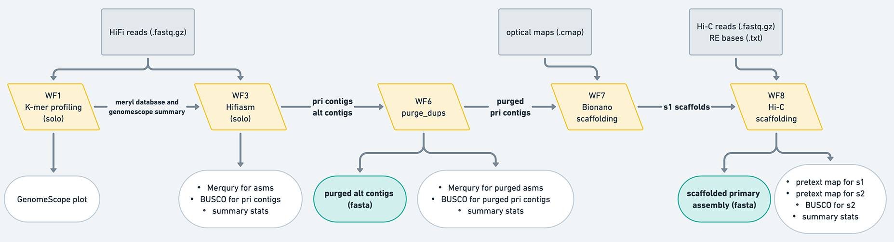
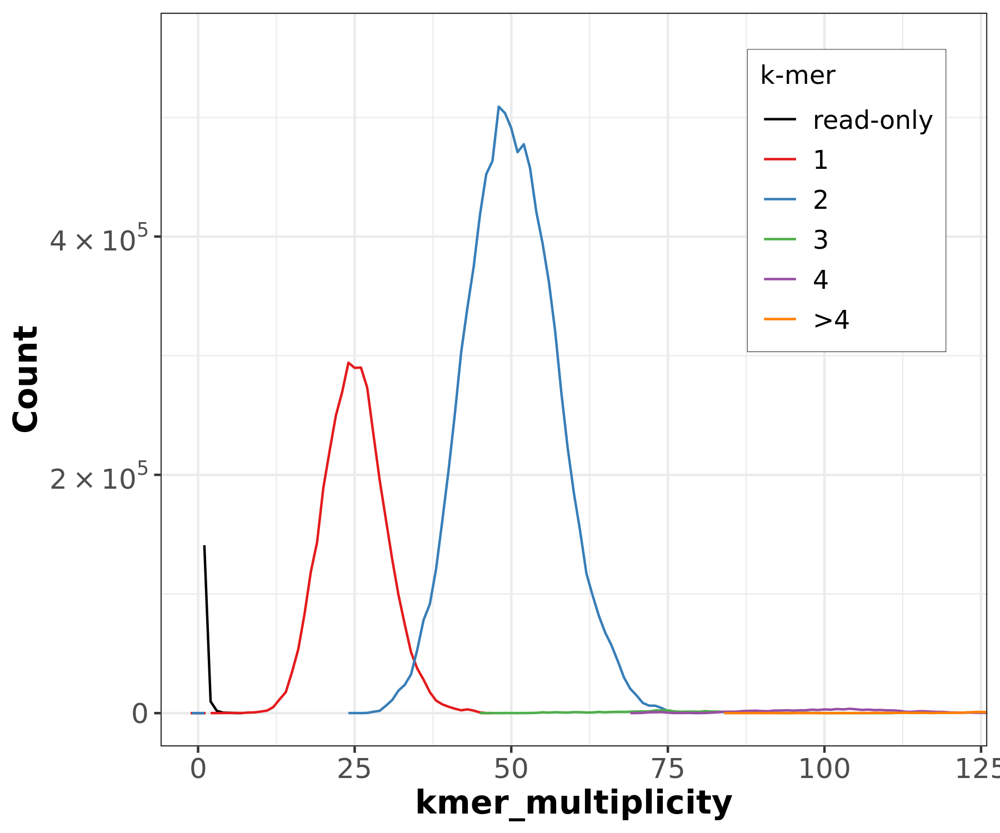
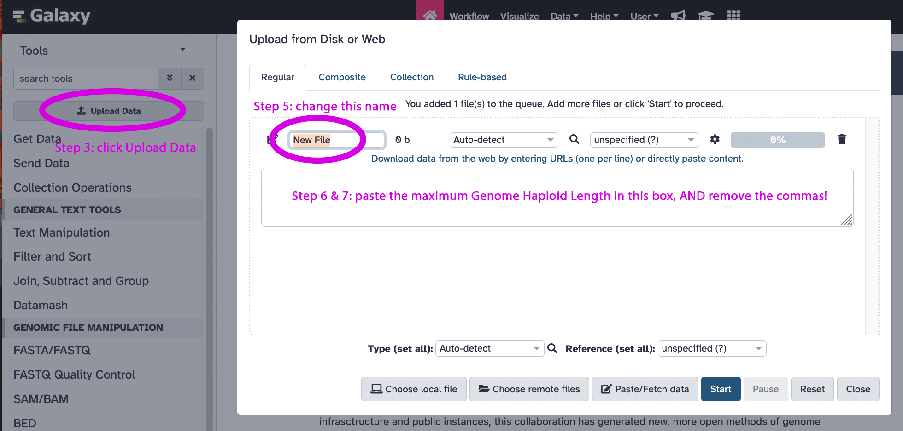
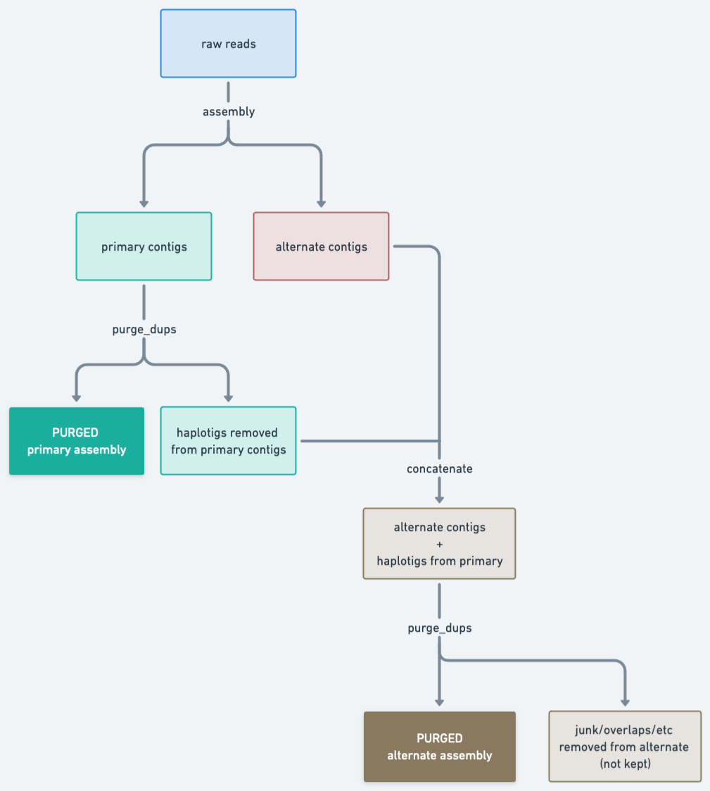
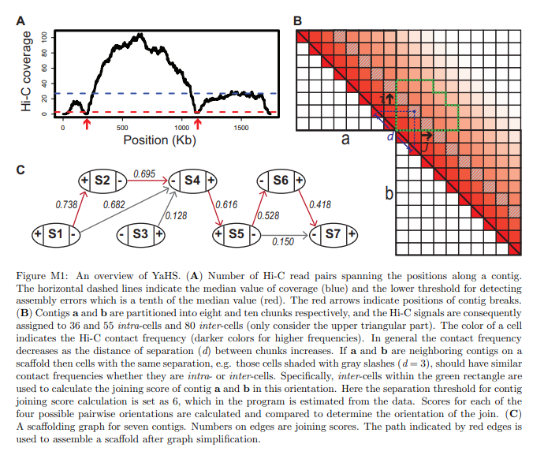

Advances in sequencing technologies over the last few decades have revolutionized the field of genomics, allowing for a reduction in both the time and resources required to perform *de novo* genome assembly. Until recently, second-generation sequencing technologies (also known as {NGS}) produced highly accurate but short (up to 800bp) reads. These read lengths were not long enough to cope with the difficulties associated with repetitive regions. Today, so-called {TGS} technologies, also known as {SMRT} sequencing, have become dominant in *de novo* assembly of large genomes. TGS can use native DNA without amplification, reducing sequencing error and bias (, ). In 2020, PacBio introduced {HiFi} sequencing, which produces reads 10-25 kbp in length with a minimum accuracy of 99% (Q20). In this tutorial, you will use HiFi reads in combination with data from additional sequencing technologies to generate a high-quality genome assembly.

Deciphering the structural organization of complex vertebrate genomes is currently one of the largest challenges in genomics (). Despite the significant progress made in recent years, a key question remains: what combination of data and tools can produce the highest quality assembly? In order to adequately answer this question, it is necessary to analyse two of the main factors that determine the difficulty of genome assembly processes: repetitive content and heterozygosity.

Repetitive elements can be grouped into two categories: interspersed repeats, such as {TE} that occur at multiple loci throughout the genome, and {TR} that occur at a single locus (). Repetitive elements are an important component of eukaryotic genomes, constituting over a third of the genome in the case of mammals (, ). In the case of tandem repeats, various estimates suggest that they are present in at least one third of human protein sequences (). {TE} content is among the main factors contributing to the lack of continuity in the reconstruction of genomes, especially in the case of large ones, as TE content is highly correlated with genome size (). On the other hand, {TR} usually lead to local genome assembly collapse, especially when their length is close to that of the reads ().

Heterozygosity is also an important factor impacting genome assembly. Haplotype phasing, the identification of alleles that are co-located on the same chromosome, has become a fundamental problem in heterozygous and polyploid genome assemblies (). When no reference sequence is available, the state-of-the-art strategy consists of constructing a string graph with vertices representing reads and edges representing consistent overlaps. In this kind of graph, after transitive reduction, heterozygous alleles in the string graph are represented by bubbles. When combined with {Hi-C} data, this approach allows complete diploid reconstruction (, , ).

The {G10K} launched the Vertebrate Genome Project ({VGP}), whose goal is generating high-quality, near-error-free, gap-free, chromosome-level, haplotype-phased, annotated reference genome assemblies for every vertebrate species (). This tutorial will guide you step by step to assemble a high-quality genome using the VGP assembly pipeline, including multiple {QC} evaluations.

> <warning-title>Your results may differ!</warning-title>
>
> Some of your results may slightly differ from the results shown in this tutorial, depending on the versions of the tools used, since algorithms can change between versions.
>
{: .warning}

> <agenda-title></agenda-title>
>
> In this tutorial, we will cover:
>
> 1. TOC
> {:toc}
>
{: .agenda}

# Important terms to know

Before getting into the thick of things, let's go over some terms you will often hear when learning about genome assembly. These concepts will be used often throughout this tutorial as well, so please refer to this section as necessary to help your understanding.

**Pseudohaplotype assembly**: A genome assembly that consists of long-phased haplotype blocks separated by regions where the haplotype cannot be distinguished (often homozygous regions). This can result in "switch errors", when the parental haplotypes alternate along the same sequence. These types of assemblies are usually represented by a _primary assembly_ and an _alternate assembly_. (This definition is largely taken from the [NCBI's Genome Assembly Model](https://www.ncbi.nlm.nih.gov/assembly/model/#asmb_def).)

**Primary assembly**: The primary assembly is traditionally the more complete representation of an individual's genome and consists of homozygous regions and one set of loci for heterozygous regions. Because the primary assembly contains both homo- and heterozygous regions, it is more complete than the _alternate assambly_ which often reports only the other allele for heterozygous regions. Thus, the primary assembly is usually what one would use for downstream analyses.

**Alternate assembly**: The alternate assembly consists of the alternate alleles not represented in the _primary assembly_ (heterozygous loci from the other haplotype). These types of sequences are often referred to as haplotigs. Traditionally, the alternate assembly is less complete compared to the primary assembly since homozygous regions are not represented.

**Phasing**: Phasing aims to partition the contigs for an individual according to the haplotype they are derived from. When parental data is available, this is done by identifying parental alleles using read data from the parents. Locally, this is achieved using linkage information in long read datasets. Recent approaches have managed to phase using long-range {Hi-C} linkage information from the same individual ().

**Assembly graph**: A representation of the genome inferred from sequencing reads. Sequencing captures the genome as many fragmented pieces, instead of whole entire chromosomes at once (we eagerly await the day when this statement will be outdated!). The start of the assembly process pieces together these genome fragments to generate an assembly graph, which is a representation of the sequences and their overlaps. Visualizing assembly graphs can show where homozygous regions branch off into alternate paths on different haplotypes.

**Unitig**: Usually the smallest unit of an assembly graph, consistent with all the available sequencing data. A unitig is often constructed from an unambiguous path in the assembly graph where all the vertices have exactly one incoming and one outgoing edge, except the first vertex can have any number of incoming edges, while the last vertex can have any number of outgoing edges (). In other words, the internal vertices in the unitig path can only be walked one way, so unitigs represent a path of confident sequence. In the assembly graph, unitig nodes can then have overlap edges with other unitigs.

**Contig**: A contiguous (*i.e.*, gapless) sequence in an assembly, usually inferred algorithmically from the unitig graph.

**False duplications**: Assembly errors that result in one region of the genome being represented twice in the same assembly as two separate regions. Not to be confused with optical or technical duplicates from PCR from short-read sequencing. False duplications can further be classified as either _haplotypic duplications_ or _overlaps_.

**Haplotypic duplication** can happen when a region that is heterozygous in the individual has the two haplotypes showing enough divergence that the assembler fails to interpret them as homologous. For example, say an individual is heterozygous in the region Chr1[1:100] and has Haplotype A from their mother and Haplotype B from their father; a false duplication can arise when the haplotypes are not recognized as being from the same region, and the assembler ends up placing both haplotypes in the same assembly, resulting in Chr1[1:100] being represented twice in one assembly. Ideally, a properly phased assembly would have Haplotype A in one assembly, *e.g.*, the primary, while Haplotype B is in the alternate.

False duplications via **overlaps** result from unresolved overlaps in the assembly graph. In this case, two different contigs end up representing the same sequence, effectively duplicating it. Overlaps happen when a branching point in an assembly graph is resolved such that the contig before the vertex and a contig after the vertex share the same overlapping sequence.


**Purging**: Purging aims to remove false duplications, collapsed repeats, and very low support/coverage regions from an assembly. When performed on a primary assembly, the haplotigs are removed from the primary and typically placed in the alternate assembly.

**Scaffold**: A scaffold refers to one or more contigs separated by gap (unknown) sequence. Scaffolds are usually generated with the aid of additional information, such as Bionano optical maps, linked reads, Hi-C chromatin information, etc. The regions between contigs are usually of unknown sequence, thus they are represented by sequences of _N_'s. Gap length in the sequence can be sized or arbitrary, depending on the technology used for scaffolding (*e.g.*, optical maps can introduce sized gaps, while scaffolding software using {Hi-C} information usually uses an arbitrary number of N's, such as 500 or 200).

For more about the specific scaffolding technologies used in the VGP pipeline (currently Bionano optical maps and Hi-C chromatin conformation data), please refer to those specific sections within this tutorial.

**HiFi reads**: PacBio {HiFi} reads are the focus of this tutorial. First described in 2019, they have revolutionized genome assembly by combining long (about 10-20 kbp) read lengths with high accuracy (>Q20) typically associated with short-read sequencing (). These higher read lengths enable HiFi reads to traverse some repeat regions that are problematic to assemble with short reads.

**Ultra-long reads**: Ultra-long reads are typically defined as reads of over 100 kbp, and are usually generated using Oxford Nanopore Technology. Read quality is often lower than HiFi or Illumina (*i.e.*, have a higher error rate), but they are often significantly longer than any other current sequencing technology, and can help assembly algorithms walk complex repeat regions in the assembly graphs.

**Manual curation**: This term refers to manually evaluating and manipulating an assembly based on the raw supporting evidence (*e.g.*, using Hi-C contact map information). The user takes into account the original sequencing data to resolve potential _misassemblies_ and _missed joins_.

**Misassembly**: Misassemblies are a type of assembly error that usually refers to any structural error in the genome reconstruction, *e.g.*, sequences that are not adjacent in the genome being placed next to each other in the sequence. Misassemblies can be potentially identified and remedied by manual curation.

**Missed join**: A missed join happens when two sequences are adjacent to each other in the genome but are not represented contiguously in the final sequence. Missed joins can be identified and remedied in manual curation with Hi-C data.

**Telomere-to-telomere assembly**: Often abbreviated as "T2T", this term refers to an assembly where each chromosome is completely gapless from telomere to telomere. The term usually refers to the recently completed CHM13 human genome (), though there is an increasing number of efforts to generate T2T genomes for other species.

# VGP assembly pipeline overview

The {VGP} assembly pipeline has a modular organization, consisting of ten workflows (Fig. 1). It can used with the following types of input data:

|  Input data | Assembly quality  | Analysis trajectory <br>([Fig. 2)](#figure-2)|
|------|---------------|-----|
| HiFi | The minimum requirement | A |
| HiFi + HiC | Better haplotype resolution (fewer switch errors) | B |
| HiFi + BioNano | Better contiguity | C |
| HiFi + Hi-C + BioNano | Even better contiguity | D |
| HiFi + parental data | Properly phased | E |
| HiFi + parental data + Hi-C | Better haplotype resolution | F |
| HiFi + parental + BioNano | Properly phased with improved contiguity | G |
| HiFi + parental data + Hi-C + BioNano | Properly phased with even more improved contiguity | H |

In this table, *HiFi* and *Hi-C* refer to HiFi and Hi-C data derived from the individual whose genome is being assembled. **This tutorial assumes you are assembling the genome of one individual; there are special considerations necessary for pooled data that are not covered in this tutorial.** *HiFi* and *Hi-C* are derived from the individual whose genome is being assembled. (Note: you can use Hi-C data from another individual of the same species to scaffold, but you *cannot* use that data to phase the contigs in hifiasm.) *Parental data* is high-coverage Illumina data derived from the parents of the individual being assembled, and is the key component of trio-based genome assembly. Each combination of input datasets is demonstrated in Fig. 2 by an *analysis trajectory*: a combination of workflows designed for generating the best assembly given a particular combination of inputs. These trajectories are listed in the table above and shown in the figure below.

.")
<br>
The first stage of the pipeline is the generation of *k*-mer profiles of the raw reads to estimate genome size, heterozygosity, repetitiveness, and error rate. **This is useful for getting an idea of the genome that lies within your reads, and is also useful for necessary for parameterizing downstream workflows.** The generation of *k*-mer counts can be done from HiFi data only (Workflow 1), or include data from parental reads for trio-based phasing (Workflow 2), if one wants to generate *k*-mer spectra for the individual's parents, as well. The second stage is contig assembly. In addition to using only {HiFi} reads (Workflow 3), the contig building (contiging) step can leverage {Hi-C} (Workflow 4) or parental read data (Workflow 5) to produce fully-phased haplotypes (hap1/hap2 or parental/maternal assigned haplotypes), using [`hifiasm`](https://github.com/chhylp123/hifiasm). The contiging workflows also produce a number of critical quality control (QC) metrics such as *k*-mer multiplicity profiles. Inspection of these profiles provides information to decide whether the third stage—purging of false duplication—is required. Purging (Workflow 6), using [`purge_dups`](https://github.com/dfguan/purge_dups) identifies and resolves haplotype-specific assembly segments incorrectly labeled as primary contigs, as well as heterozygous contig overlaps. This increases contiguity and the quality of the final assembly. The purging stage is generally unnecessary for trio data, as haplotype resolution is attained using set operations done on parental *k*-mers. The fourth stage, scaffolding, produces chromosome-level scaffolds using information provided by Bionano (Workflow 7, with [`Bionano Solve`](https://bionano.com/software-downloads/) (optional)) and Hi-C (Workflow 8, with [`YaHS`](https://github.com/c-zhou/yahsscaffolding) algorithms). A final stage of decontamination (Workflow 9) removes non-target sequences (e.g., contamination as well as mitochondrial sequences) from the scaffolded assembly. A separate workflow (WF0) is used for mitochondrial assembly.

> <comment-title>A note on data quality</comment-title>
> For diploids, we suggest at least 30✕ PacBio HiFi coverage & around 60✕ Hi-C coverage, and up to 60✕ HiFi coverage to accurately assemble highly repetitive regions.
{: .comment}
This training has been organized into four main sections: genome profile analysis, assembly of {HiFi} reads with hifiasm, scaffolding with Bionano optical maps, and scaffolding with {Hi-C} data. Additionally, the **assembly with hifiasm** section has two possible paths in this tutorial: solo contiging or solo w/HiC contiging.

Throughout this tutorial, there will be **detail boxes** with additional background information on the science behind the sequencing technologies and software we use in the pipeline. These boxes are minimized by default, but please expand them to learn more about the data we utilize in this pipeline.

# Get data

In order to reduce computation time, we will assemble samples from the yeast _Saccharomyces cerevisiae_ S288C, a widely used laboratory strain isolated in the 1950s by Robert Mortimer. Using _S. cerevisae_, one of the most intensively studied eukaryotic model organisms, has the additional advantage of allowing us to evaluate the final result of our assembly with great precision. For this tutorial, we generated a set of synthetic HiFi reads corresponding to a theoretical diploid genome.

> <details-title>Generation of synthetic reads</details-title>
> The synthetic HiFi reads were generated by using the [S288C assembly](https://www.ncbi.nlm.nih.gov/genome/15?genome_assembly_id=22535) as reference genome. With this objective we used [HIsim](https://github.com/thegenemyers/HI.SIM), a HiFi shotgun simulator. The commands used are detailed below:
>
> ```bash
> ./FastK -T8 -Nsynthetic -k40 -t4 ./hifi_reads.fastq.gz
> ./FastK -T8 -Nsynthetic -k40 -p:synthetic.ktab .hifi_reads.fastq.gz
> ./Histex -G synthetic > synthetic.histogram
> ./GeneScopeFK.R -i synthetic.histogram -o ./synthetic -k 40 -p 1
> ./HImodel -v -osynthetic -g10:55 -e5 -T8 ./synthetic
> ./HIsim ./GCF_000146045.2_R64_genomic.fasta ./synthetic.model -p.2,.2 -c30 -r1 -U -f -h -e
> ```
> The selected mutation rate was 2%. Note that HIsim generates the synthetic reads in FASTA format. This is perfectly fine for illustrating the workflow, but you should be aware that usually you will work with HiFi reads in FASTQ format.
>
{: .details}

The first step is to get the datasets from Zenodo. Specifically, we will be uploading two datasets:

1. A set of PacBio {HiFi} reads in `fasta` format
2. A set of Illumina {Hi-C} reads in `fastqsanger.gz` format

## Uploading `fasta` datasets from Zenodo

The following two steps demonstrate how to upload three PacBio {HiFi} datasets into your Galaxy history.

> <hands-on-title><b>Uploading <tt>FASTA</tt> datasets from Zenodo</b></hands-on-title>
>
> 1. Create a new history for this tutorial
>
>    
>
> 2. Copy the following URLs into the clipboard.
>    - you can do this by clicking on  button in the right upper corner of the box below. It will appear if you mouse over the box.
>
>    ```
>    https://zenodo.org/record/6098306/files/HiFi_synthetic_50x_01.fasta
>    https://zenodo.org/record/6098306/files/HiFi_synthetic_50x_02.fasta
>    https://zenodo.org/record/6098306/files/HiFi_synthetic_50x_03.fasta
>    ```
>
> 3. Upload datasets into Galaxy.
>    - set the datatype to `fasta`
>
> 
>
> 
>
{: .hands_on}

## Uploading `fastqsanger.gz` datasets from Zenodo

Illumina {Hi-C} data is uploaded in essentially the same way as shown in the following two steps.

> <warning-title>DANGER: Make sure you choose the correct format!</warning-title>
> When selecting datatype in "**Type (set all)**" drop-down, make sure you select `fastaqsanger` or `fastqsanger.gz` BUT NOT `fastqcssanger` or anything else!
{: .warning}

> <hands-on-title><b>Uploading <tt>fastqsanger.gz</tt> datasets from Zenodo</b></hands-on-title>
>
> 1. Copy the following URLs into the clipboard. You can do this by clicking on  button in the right upper corner of the box below. It will appear if you mouse over the box.
>
>    ```
>    https://zenodo.org/record/5550653/files/SRR7126301_1.fastq.gz
>    https://zenodo.org/record/5550653/files/SRR7126301_2.fastq.gz
>    ```
>
> 2. Upload datasets into Galaxy and set the datatype to `fastqsanger.gz`
>
>    
>
>    
>
> 3. Rename the datasets as follow: 
>     -  Rename `SRR7126301_1.fastq.gz` as `Hi-C_dataset_F`. It contains the forward reads.
>     -  Rename `SRR7126301_2.fastq.gz` as `Hi-C_dataset_R`. It contains the reverse reads.
>
{: .hands_on}

> <warning-title>These datasets are large!</warning-title>
> Hi-C datasets are large. It will take some time (~15 min) for them to be fully uploaded. Please, be patient.
{: .warning}

## Organizing the data

If everything goes smoothly your history will look like shown in the figure below. The three {HiFi} fasta files are better represented as a collection: {collection}. Also, importantly,
the workflow we will be using for the analysis of our data takes collection as input (it does not access individual datasets). So let's create a collection using steps outlined in the Tip  "Creating a dataset collection":



The view of your history should transition from what is shown in the left pane below to what looks like the right pane:

. Creation of a list (collection) combines all HiFi datasets into a single history item called 'HiFi data' (right). See below for instructions on how to make this collection.")

> <details-title>Other ways to upload the data</details-title>
> You can obviously upload your own datasets via URLs as illustrated above or from your own computer. In addition, you can upload data from a major repository called [GenomeArk](https://genomeark.org). GenomeArk is integrated directly into Galaxy Upload. To use GenomeArk follow the steps in the Tip  below:
>
> 
{: .details}

# HiFi reads preprocessing with **cutadapt**

Adapter trimming usually means trimming the adapter sequence off the ends of reads, which is where the adapter sequence is usually located in {NGS} reads. However, due to the nature of {SMRT} sequencing technology, adapters do not have a specific, predictable location in  {HiFi} reads. Additionally, the reads containing adapter sequences could be of generally lower quality compared to the rest of the reads. Thus, we will use **cutadapt** not to trim, but to remove the entire read if a read is found to have an adapter inside of it.

> <details-title>Background on PacBio HiFi reads</details-title>
>
> PacBio HiFi reads rely on {SMRT} sequencing technology. SMRT is based on real-time imaging of fluorescently tagged nucleotides as they are added to a newly synthesized DNA strand. HiFi further uses multiple subreads from the same circular template to produce one highly accurate consensus sequence (fig. 2).
>
> 
>
> This technology allows to generate long-read sequencing data with read lengths in the range of 10-25 kb and minimum read consensus accuracy greater than 99% (Q20).
>
{: .details}

> <hands-on-title>Primer removal with Cutadapt</hands-on-title>
>
> 1. Run  with the following parameters:
>    - *"Single-end or Paired-end reads?"*: `Single-end`
>    -  *"FASTQ/A file"*: `HiFi_collection`
>    - In *"Read 1 Options"*:
>        - In *"5' or 3' (Anywhere) Adapters"*:
>            -  *"Insert 5' or 3' (Anywhere) Adapters"*
>                - *"Source"*: `Enter custom sequence`
>                - *"Enter custom 5' or 3' adapter name"*: `First adapter`
>                - *"Enter custom 5' or 3' adapter sequence"*: `ATCTCTCTCAACAACAACAACGGAGGAGGAGGAAAAGAGAGAGAT`
>            -  *"Insert 5' or 3' (Anywhere) Adapters"*
>                - *"Source"*: `Enter custom sequence`
>                - *"Enter custom 5' or 3' adapter name"*: `Second adapter`
>                - *"Enter custom 5' or 3' adapter sequence"*: `ATCTCTCTCTTTTCCTCCTCCTCCGTTGTTGTTGTTGAGAGAGAT`
>    - In *"Adapter Options"*:
>        - *"Maximum error rate"*: `0.1`
>        - *"Minimum overlap length"*: `35`
>        - *"Look for adapters in the reverse complement"*: `Yes`
>    - In *"Filter Options"*:
>        - *"Discard Trimmed Reads"*: `Yes`
>
>    
>
> 2. Rename the output file as `HiFi_collection (trimmed)`.
>
>    
>
{: .hands_on}

# Genome profile analysis

Before starting a *de novo* genome assembly project, it is useful to collect metrics on the properties of the genome under consideration, such as the expected genome size, so that you know what to expect from your assembly. Traditionally, DNA flow cytometry was considered the golden standard for estimating the genome size. Nowadays, experimental methods have been replaced by computational approaches (). One of the widely used genome profiling methods is based on the analysis of *k*-mer frequencies. It allows one to provide information not only about the genomic complexity, such as the genome size and levels of heterozygosity and repeat content, but also about the data quality.

> <details-title><i>K</i>-mer size, sequencing coverage and genome size</details-title>
>
>*K*-mers are unique substrings of length *k* contained within a DNA sequence. For example, the DNA sequence *TCGATCACA* can be decomposed into five unique *k*-mers that have five bases long: *TCGAT*, *CGATC*, *GATCA*, *ATCAC* and *TCACA*. A sequence of length L will have  L-k+1 *k*-mers. On the other hand, the number of possible *k*-mers can be calculated as  n<sup>k</sup>, where n is the number of possible monomers and k is the *k*-mer size.
>
>
>---------| -------------|-----------------------
>  Bases  |  *k*-mer size  |  Total possible *k*-mers
>---------| -------------|-----------------------
>    4    |       1      |            4
>    4    |       2      |           16
>    4    |       3      |           64
>    4    |      ...     |          ...
>    4    |      10      |    1.048.576
>---------|--------------|-----------------------
>
> Thus, the *k*-mer size is a key parameter, which must be large enough to map uniquely to the genome, but not too large, since it can lead to wasting computational resources. In the case of the human genome, *k*-mers of 31 bases in length lead to 96.96% of unique *k*-mers.
>
> Each unique *k*-mer can be assigned a value for coverage based on the number of times it occurs in a sequence, whose distribution will approximate a Poisson distribution, with the peak corresponding to the average genome sequencing depth. From the genome coverage, the genome size can be easily computed.
{: .details}

## Generation of _k_-mer spectra with **Meryl**

Meryl will allow us to generate the *k*-mer profile by decomposing the sequencing data into *k*-length substrings, counting the occurrence of each *k*-mer and determining its frequency. The original version of Meryl was developed for the Celera Assembler. The current Meryl version comprises three main modules: one for generating *k*-mer databases, one for filtering and combining databases, and one for searching databases. *K*-mers are stored in lexicographical order in the database, similar to words in a dictionary ().

> <comment-title><i>k</i>-mer size estimation</comment-title>
>
>  Given an estimated genome size (*G*) and a tolerable collision rate (*p*), an appropriate *k* can be computed as $$ k = \log_4\left(\frac{G(1-p)}{p}\right) $$ .
>
{: .comment}

In order to identify some key characteristics of the genome, we do genome profile analysis. To do this, we start by generating a histogram of the *k*-mer distribution in the raw reads (the *k*-mer spectrum). Then, GenomeScope creates a model fitting the spectrum that allows for estimation of genome characteristics. We work in parallel on each set of raw reads, creating a database of each file's *k*-mer counts, and then merge the databases of counts in order to build the histogram.


> <hands-on-title>Generate <i>k</i>-mers count distribution</hands-on-title>
>
> 1. Run  with the following parameters:
>    - *"Operation type selector"*: `Count operations`
>    - *"Count operations"*: `Count: count the occurrences of canonical k-mers`
>    -  *"Input sequences"*: `HiFi_collection (trim)`
>    - *"k-mer size selector"*: `Set a k-mer size`
>    - "*k-mer size*": `31`
>
>    > <comment-title>Selection of <i>k</i>-mer size</comment-title>
>    >
>    > We used 31 as *k*-mer size, as this length has demonstrated to be sufficiently long that most *k*-mers are not repetitive and is short enough to be more robust to sequencing errors. For very large (haploid size > 10 Gb) and/or very repetitive genomes, larger *k*-mer length is recommended to increase the number of unique *k*-mers.
>    {: .comment}
>
> 2. Rename output as `meryldb`
>
> 3. Run  again with the following parameters:
>    - *"Operation type selector"*: `Operations on sets of *k*-mers`
>    - *"Operations on sets of k-mers"*: `Union-sum: return k-mers that occur in any input, set the count to the sum of the counts`
>    -  *"Input meryldb"*: `Collection meryldb`
>
> 4. Rename it as `Merged meryldb`
>
> 5. Run  for the third time with the following parameters:
>    - *"Operation type selector"*: `Generate histogram dataset`
>        -  *"Input meryldb"*: `Merged meryldb`
>
> 6. Finally, rename it as `meryldb histogram`.
>
{: .hands_on}

## Genome profiling with **GenomeScope2**

The next step is to infer the genome properties from the *k*-mer histogram generated by Meryl, for which we will use GenomeScope2. GenomeScope2 relies on a nonlinear least-squares optimization to fit a mixture of negative binomial distributions, generating estimated values for genome size, repetitiveness, and heterozygosity rates ().

> <hands-on-title>Estimate genome properties</hands-on-title>
>
> 1. Run  with the following parameters:
>    -  *"Input histogram file"*: `meryldb histogram`
>    - *Ploidy for model to use*: `2`
>    - *"k-mer length used to calculate k-mer spectra"*: `31`
>    - In "*Output options*":
>        - Check `Summary of the analysis`
>    - In "*Advanced options*":
>        - *"Create testing.tsv file with model parameters"*: `Yes`
>
{: .hands_on}

Genomescope will generate six outputs:

- **Plots**:
    - Linear plot: *k*-mer spectra and fitted models: frequency (y-axis) versus coverage.
    - Log plot: logarithmic transformation of the previous plot.
    - Transformed linear plot: *k*-mer spectra and fitted models: frequency times coverage (y-axis) versus coverage (x-axis). This transformation increases the heights of higher-order peaks, overcoming the effect of high heterozygosity.
    - Transformed log plot: logarithmic transformation of the previous plot.
- **Model**: this file includes a detailed report about the model fitting.
- **Summary**: it includes the properties inferred from the model, such as genome haploid length and the percentage of heterozygosity.

Now, let's analyze the *k*-mer profiles, fitted models and estimated parameters shown below:

, genome unique length percent ('uniq'), overall heterozygosity rate ('ab'), mean *k*-mer coverage for heterozygous bases ('kcov'), read error rate ('err'), and average rate of read duplications ('dup'). It also reports the user-given parameters of *k*-mer size ('k') and ploidy ('p')."){:width="65%"}

This distribution is the result of the Poisson process underlying the generation of sequencing reads. As we can see, the *k*-mer profile follows a bimodal distribution, indicative of a diploid genome. The distribution is consistent with the theoretical diploid model (model fit > 93%). Low frequency *k*-mers are the result of sequencing errors. GenomeScope2 estimated a haploid genome size is around 11.7 Mb, a value reasonably close to *Saccharomyces* genome size. Additionally, it revealed that the variation across the genomic sequences is 0.576%. Some of these parameters can be used later on to parameterize running `purge_dups`. This is covered in the [**solo** contiging section](#solo_hic_switch) section of the tutorial.


# Assembly with **hifiasm**

Once we have finished the genome profiling stage, we can start the genome assembly with hifiasm,  a fast open-source *de novo* assembler specifically developed for PacBio HiFi reads. One of the key advantages of hifiasm is that it allows us to resolve near-identical, but not exactly identical, sequences, such as repeats and segmental duplications ().

> <details-title>Hifiasm algorithm details</details-title>
>
> By default hifiasm performs three rounds of haplotype-aware error correction to correct sequence errors but keeping heterozygous alleles. A position on the target read to be corrected is considered informative if there are two different nucleotides at that position in the alignment, and each allele is supported by at least three reads.
>
> 
>
> Then, hifiasm builds a phased assembly string graph with local phasing information from the corrected reads. Only the reads coming from the same haplotype are connected in the phased assembly graph. After transitive reduction, a pair of heterozygous alleles is represented by a _bubble_ in the string graph. If there is no additional data, hifiasm arbitrarily selects one side of each bubble and outputs a primary assembly. In the case of a heterozygous genome, the primary assembly generated at this step may still retain haplotigs from the alternate allele.
>
{: .details}

The output of hifiasm will be [GFA](https://github.com/GFA-spec/GFA-spec) files. These differ from FASTA files in that they are a representation of the assembly graph instead of just linear sequences, so the GFA contains information about sequences, nodes, and edges (*i.e.*, overlaps). This output preserves the most information about how the reads assemble in graph space, and is useful to visualize in tools such as Bandage; however, our QV tools will expect FASTA files, so we will cover the GFA to FASTA conversion step later.

## `hifiasm` assembly modes

Hifiasm can be run in multiple modes depending on data availability

### **Solo** mode

**Solo**: generates a pseudohaplotype assembly, resulting in a primary & an alternate assembly.
- _Input: PacBio HiFi reads_
- _Output: scaffolded primary assembly, and alternate contigs_


### **Hi-C** phased mode

**Hi-C-phased**: generates a hap1 assembly and a hap2 assembly, which are phased using the {Hi-C} reads from the same individual.
- _Input: PacBio HiFi & Illumina HiC reads_
- _Output: scaffolded hap1 assembly, and scaffolded hap2 assembly (assuming you run the scaffolding on **both** haplotypes)_


### **Trio** mode

**Trio**: generates a maternal assembly and a paternal assembly, which are phased using reads from the parents.
- _Input: PacBio HiFi reads from child, Illumina reads from both parents._
- _Output: scaffolded maternal assembly, and scaffolded paternal assembly (assuming you run the scaffolding on **both** haplotypes)_


No matter which way you run hifiasm, you will have to evaluate the assemblies' {QC} to ensure your genome is in good shape. The VGP pipeline features several reference-free ways of evaluating assembly quality, all of which are automatically generated with our workflows; however, we will run them manually in this tutorial so we can familiarize ourselves with how each QC metric captures a different aspect of assembly quality.

## Assembly evaluation

There are several tools for assessing various aspects of assembly quality:

- **gfastats**: manipulation & evaluation of assembly graphs and FASTA files, particularly used for summary statistics (*e.g.*, contig count, N50, NG50, etc.) ().

- **{BUSCO}**: assesses completeness of a genome from an evolutionarily informed functional point of view. BUSCO genes are genes that are expected to be present at single-copy in one haplotype for a certain clade, so their presence, absence, or duplication can inform scientists about if an assembly is likely missing important regions, or if it has multiple copies of them, which can indicate a need for purging ().
- **Merqury**: reference-free assessment of assembly completeness and phasing based on *k*-mers. Merqury compares *k*-mers in the reads to the *k*-mers found in the assemblies, as well as the {CN} of each *k*-mer in the assemblies ().

<div id="solo_hic_switch">
<!-- For use as an anchor -->
</div>



<div class = "hic" markdown="1">

<!---- BEGINNING OF HiC SECTION --->
<!---- BEGINNING OF HiC SECTION --->
<!---- BEGINNING OF HiC SECTION --->
<!---- BEGINNING OF HiC SECTION --->
<!---- BEGINNING OF HiC SECTION --->

## HiC-phased assembly with **hifiasm**

If you have the {Hi-C} data for the individual you are assembling with {HiFi} reads, then you can use that information to phase the {contigs}.

> <hands-on-title>Hi-C-phased assembly with <b>hifiasm</b></hands-on-title>
> 1. Run  with the following parameters:
>    - *"Assembly mode"*: `Standard`
>    -  *"Input reads"*: `HiFi_collection (trimmed)` (output of **Cutadapt** )
>    - In *"Options for Hi-C-partition*" select `Specify`
>        - *"Hi-C R1 reads"*: `Hi-C_dataset_F`
>        - *"Hi-C R2 reads"*: `Hi-C_dataset_R`
>
> 2. After the tool has finished running, rename its outputs as follows:
>    - Rename the `Hi-C hap1 balanced contig graph` as `Hap1 contigs graph` and add a `#hap1` tag
>    - Rename the `Hi-C hap2 balanced contig graph` as `Hap2 contigs graph` and  add a `#hap2` tag
>
{: .hands_on}

We have obtained the fully phased contig graphs (as {GFA} files) of hap1 and hap2, but these must be converted to FASTA format for subsequent steps. We will use a tool developed from the VGP: [`gfastats`](https://github.com/vgl-hub/gfastats). `gfastats` is a tool suite that allows for manipulation and evaluation of FASTA and GFA files, but in this instance we will use it to convert our GFAs to FASTA files. Later on, we will use it to generate standard summary statistics for our assemblies.

> <hands-on-title>GFA to FASTA conversion for hifiasm Hi-C assembly</hands-on-title>
>
> 1. Run  with the following parameters:
>    -  *"Input GFA file"*: select `Hap1 contigs graph` and the `Hap2 contigs graph` datasets
>
>    
>
>    - *"Tool mode"*: `Genome assembly manipulation`
>    - *"Output format"*: `FASTA`
>    - *"Generates the initial set of paths*": toggle to `yes`
>
> 2. Rename the outputs as `Hap1 contigs FASTA` and `Hap2 contigs FASTA`
>
{: .hands_on}

> <comment-title>Summary statistics</comment-title>
>
> gfastats will provide us with the following statistics:
>
> - **No. of contigs**: The total number of contigs in the assembly.
> - **Largest contig**: The length of the largest contig in the assembly.
> - **Total length**: The total number of bases in the assembly.
> - **Nx**: The largest contig length, *L*, such that contigs of length > *L* account for at least *x*% of the bases of the assembly.
> - **NGx**: The contig length such that using equal or longer length contigs produces *x*% of the length of the reference genome, rather than *x*% of the assembly length.
> - **GC content**: the percentage of nitrogenous bases which are either guanine or cytosine.
>
{: .comment}

Let's use gfastats to get a basic idea of what our assembly looks like. We'll run gfastats on the {GFA} files because gfastats can report graph-specific statistics as well. After generating the stats, we'll be doing some text manipulations to get the stats side-by-side in a pretty fashion.

> <hands-on-title>Assembly evaluation with gfastats</hands-on-title>
>
> 1. Run assembly statistics generation with  using the following parameters:
>
>    -  *"Input file"*: select `Hap1 contigs graph` and the `Hap2 contigs graph` datasets
>    - *"Tool mode": `Summary statistics generation`
>    - *"Expected genome size"*: `11747160` (remember we calculated this value [earlier using `GenomeScope2`](#genome-profiling-with-genomescope2). It is contained within `GenomeScope2` **Summary** output that should be in your history!)
>    - *"Thousands separator in output"*: Set to "No"
>
>
> 2. Rename outputs of `gfastats` step to as `Hap1 stats` and `Hap2 stats`
>
>    >    > This would generate summary files that look like this (only the first six rows are shown):
>    >    >
>    >    > ```
>    >    > Expected genome size    11747160
>    >    > # scaffolds                    0
>    >    > Total scaffold length          0
>    >    > Average scaffold length      nan
>    >    > Scaffold N50                   0
>    >    > Scaffold auN                0.00
>    >    > ```
>    >    >
>    >    > Because we ran `gfastats` on hap1 and hap2 outputs of `hifiasm` we need to join the two outputs together for easier interpretation:
>
> 3. Run  with the following parameters:
>    -  *"Input file"*: select `Hap1 stats` and the `Hap2 stats` datasets. Keep all other settings as they are.
>
> 4. Rename the output as `gfastats on hap1 and hap2 (full)`
>
>    >    > This would generate a joined summary file that looks like this (only the first five rows are shown):
>    >    > 
>    >    > ```
>    >    > # gaps               0  0
>    >    > # gaps in scaffolds  0  0
>    >    > # paths              0  0
>    >    > # segments          17 16
>    >    > ```
>    >    > 
>    >    > Now let's extract only relevant information by excluding all lines containing the word `scaffold` since there are no scaffolds at this stage of the assembly process (only contigs):
>
> 5. Run  with the following parameters:
>    -  *"Input file"*: select `gfastats on hap1 and hap2 (full)`
>    - *"that"*: `Don't Match`
>    - *"Type of regex"*: `Basic`
>    - *"Regular Expression"*: enter the word `scaffold`
>    - *"Match type*": leave as `case insensitive`
>
>
> 6. Rename the output as `gfastats on hap1 and hap2 contigs`
>
{: .hands_on}

Take a look at the `gfastats on hap1 and hap2 contigs` output — it has three columns:

  1. Name of statistic
  2. Value for haplotype 1 (hap1)
  3. Value for haplotype 2 (hap2)

According to the report, both assemblies are quite similar; the hap1 assembly includes 16 contigs, totalling ~11.3Mbp of sequence (the `Total contig length` statistic), while the hap2 assembly includes 17 contigs, whose total length is ~12.2Mbp. (**NB**: Your values may differ slightly, or be reversed between the two haplotypes!)

> <question-title></question-title>
>
> 1. What is the length of the longest contigs in the assemblies?
> 2. What are the N50 values of the two assemblies? Are they very different from each other?
>
> > <solution-title></solution-title>
> >
> > 1. One assembly's longest contig is 1,532,843 bp, and the other one's is 1,531,728 bp.
> > 2. One assembly has a N50 of 922,430 and the other's is 923,452. These are pretty close to each other!
> >
> {: .solution}
>
{: .question}

Next, we will use {BUSCO}, which will provide quantitative assessment of the completeness of a genome assembly in terms of expected gene content. It relies on the analysis of genes that should be present only once in a complete assembly or gene set, while allowing for rare gene duplications or losses ().

> <hands-on-title>Assessing assembly completeness with BUSCO</hands-on-title>
>
> 1. Run  with the following parameters:
>    -  *"Sequences to analyze"*: `Hap1 contigs FASTA` and `Hap2 contigs FASTA`
>    - *"Lineage data source"*: `Use cached lineage data`
>    - *"Cached database with lineage"*: `Busco v5 Lineage Datasets`
>    - *"Mode"*: `Genome assemblies (DNA)`
>    - *"Use Augustus instead of Metaeuk"*: `Use Metaeuk`
>    - *"Auto-detect or select lineage?"*: `Select lineage`
>    - *"Lineage"*: `Saccharomycetes`
>    - *"Which outputs should be generated"*: `short summary text` and `summary image`
>
>    > <comment-title></comment-title>
>    >
>    > Remember to modify the *"Lineage"* option if you are working with vertebrate genomes.
>    {: .comment}
>
>
> 2. Rename the outputs as `BUSCO hap1` and `BUSCO hap2`.
>
{: .hands_on}

We have asked {BUSCO} to generate two particular outputs: the short summary, and a summary image.
.")

> <question-title></question-title>
>
> 1. How many complete and single copy BUSCO genes have been identified in the hap1 assembly? What percentage of the total BUSCO gene set is that?
> 2. How many BUSCO genes are absent in the hap1 assembly?
>
>    > <solution-title></solution-title>
>    >
>    > 1. Hap1 has 2,047 complete and single-copy BUSCO genes, which is 95.8% of the gene set.
>    > 2. 29 BUSCO genes are missing.
>    >
>    {: .solution}
>
{: .question}

Despite BUSCO being robust for species that have been widely studied, it can be inaccurate when the newly assembled genome belongs to a taxonomic group that is not well represented in [OrthoDB](https://www.orthodb.org/). Merqury provides a complementary approach for assessing genome assembly quality metrics in a reference-free manner via *k*-mer copy number analysis. Let's run Merqury evaluation as shown below.

> <hands-on-title><i>k</i>-mer based evaluation with Merqury</hands-on-title>
>
> 1. Run  with the following parameters:
>    - *"Evaluation mode"*: `Default mode`
>    -  *"k-mer counts database"*: `Merged meryldb`
>    - *"Number of assemblies"*: `Two assemblies`
>    -  *"First genome assembly"*: `Hap1 contigs FASTA`
>    -  *"Second genome assembly"*: `Hap2 contigs FASTA`
>
{: .hands_on}

By default, Merqury generates three collections as output: stats, plots and {QV} stats. The "stats" collection contains the completeness statistics, while the "QV stats" collection contains the quality value statistics. Let's have a look at the assembly {CN} spectrum plot, known as the *spectra-cn.fl* plot:

{:width="65%"}

The grey region in the left side corresponds to *k*-mers found only in the read set; it is usually indicative of sequencing error in the read set, although it can also be a result of missing sequences in the assembly. The red area represents one-copy *k*-mers in the genome, while the blue area represents two-copy *k*-mers originating from homozygous sequences or haplotype-specific duplications. From this figure, we can state that the diploid sequencing coverage is around 50✕, which we also know from the GenomeScope2 plot we looked at [earlier](#figure-5).

To get an idea of how the *k*-mers have been distributed between our hap1 and hap2 assemblies, we should look at the *spectra-asm.fl* output of Merqury.

{:width="65%"}

The large green peak is centered at 50✕ coverage (remember that's our diploid coverage!), indicating that *k*-mers suggested by the reads to be from diploid regions are in fact shared between the two assemblies, as they should be if they are from homozygous regions. The haploid coverage *k*-mers (around ~25✕ coverage) are split between hap1 and hap2 assemblies, somewhat unevenly but still not as bad as it would be in an assembly without phasing data.

</div>

<!---- BEGINNING OF SOLO SECTION --->
<!---- BEGINNING OF SOLO SECTION --->
<!---- BEGINNING OF SOLO SECTION --->
<!---- BEGINNING OF SOLO SECTION --->
<!---- BEGINNING OF SOLO SECTION --->

<div class="solo" markdown="1">

## Pseudohaplotype assembly with **hifiasm**

When hifiasm is run without any additional phasing data, it will do its best to generate a pseudohaplotype primary/alternate set of assemblies. These assemblies will typically contain more contigs that switch between parental blocks. Because of this, the primary assembly generated with this method can have a higher $$ N50 $$ value than an assembly generated with haplotype-phasing, but the contigs will contain more switch errors.

> <hands-on-title>Pseudohaplotype assembly with <b>hifiasm</b></hands-on-title>
>
> 1. Run   with the following parameters:
>    - *"Assembly mode"*: `Standard`
>    -  *"Input reads"*: `HiFi_collection (trim)` (output of **Cutadapt** )
>    - *"Options for purging duplicates"*: `Specify`
>    - *"Purge level"*: `Light (1)`
>
>    > <comment-title>A note on hifiasm purging level</comment-title>
>    > Hifiasm has an internal purging function, which we have set to `Light` here. The VGP pipeline currently disables the hifiasm internal purging, in favor of using the <b>purge_dups</b> suite after the fact in order to have more control over the parameters used for purging.
>    {: .comment}
>
> 2. After the tool has finished running, rename its outputs as follows:
>    - Rename the `primary assembly contig graph for pseudohaplotype assembly` as `Primary contigs graph` and add a `#pri` tag
>    - Rename the `alternate assembly contig graph for pseudohaplotype assembly` as `Alternate contigs graph` and add a `#alt` tag
>
{: .hands_on}

We have obtained the primary and alternate contig graphs (as {GFA} files), but these must be converted to FASTA format for subsequent steps. We will use a tool developed from the VGP: **gfastats**. gfastats is a tool suite that allows for manipulation and evaluation of FASTA and GFA files, but in this instance we will use it to convert our GFAs to FASTA files. Later on we will use it to generate standard summary statistics for our assemblies.

<div id ='gfa2fasta_solo'>
<!--- this is for linking --->
</div>

> <hands-on-title>Convert GFA to FASTA</hands-on-title>
>
> 1. Run  with the following parameters:
>    -  *"Input GFA file"*: select `Primary contigs graph` and the `Alternate contigs graph` datasets
>    - *"Tool mode"*: `Genome assembly manipulation`
>    - *"Output format"*: `FASTA`
>    - *"Generates the initial set of paths*": toggle to `yes`
>
>    
> 
> 2. Rename the outputs as `Primary contigs FASTA` and `Alternate contigs FASTA`
>
{: .hands_on}

> <comment-title>Summary statistics</comment-title>
>
> gfastats will provide us with the following statistics:
>
> - No. of contigs: The total number of contigs in the assembly.
> - Largest contig: The length of the largest contig in the assembly.
> - Total length: The total number of bases in the assembly.
> - Nx: The largest contig length, *L*, such that contigs of length >= *L* account for at least *x*% of the bases of the assembly.
> - NGx: The contig length such that using equal or longer length contigs produces *x*% of the length of the reference genome, rather than *x*% of the assembly length.
> - GC content: the percentage of nitrogenous bases which are either guanine or cytosine.
>
{: .comment}

Let's use gfastats to get a basic idea of what our assembly looks like. We'll run gfastats on the {GFA} files because gfastats can report graph-specific statistics as well. After generating the stats, we'll be doing some text manipulation to get the stats side-by-side in a pretty fashion.


> <hands-on-title>Assembly evaluation with gfastats</hands-on-title>
>
> 1. Run assembly statistics generation with  using the following parameters:
>    -  *"Input file"*: select `Primary contigs graph` and the `Alternate contigs graph` datasets
>    - *"Tool mode": `Summary statistics generation`
>    - *"Expected genome size"*: `11747160` (remember we calculated this value earlier using [`GenomeScope2`](#genome-profiling-with-genomescope2). It is contained within `GenomeScope2` **Summary** output that should be in your history!)
>    - *"Thousands separator in output"*: Set to "No"
>    - *"Generates the initial set of paths*": toggle to `yes`
>
> 2. Rename outputs of `gfastats` step to as `Primary stats` and `Alternate stats`
>
>    >    > This would generate summary files that look like this (only the first six rows are shown):
>    >    > 
>    >    > ```
>    >    > Expected genome size     11747160
>    >    > # scaffolds                    25
>    >    > Total scaffold length    18519764
>    >    > Average scaffold length    740790.56
>    >    > Scaffold N50               813311
>    >    > Scaffold auN               913050.77
>    >    > ```
>    >    > 
>    >    > Because we ran `gfastats` on Primary and Alternate outputs of `hifiasm` we need to join the two outputs together for easier interpretation:
>
> 3. Run  with the following parameters:
>    -  *"Input file"*: select `Primary stats` and the `Alternate stats` datasets (these are from **Step 2** above). Keep all other setting as they are.
>
> 4. Rename the output as `gfastats on Pri and Alt (full)`
>
>    >    > This would generate a joined summary file that looks like this (only  five rows are shown):
>    >    > 
>    >    > ```
>    >    > # contigs                 25  10
>    >    > # dead ends                .  16
>    >    > # disconnected components  .   7
>    >    > # edges                    .   6
>    >    > # gaps                     0   0
>    >    > ```
>    >    > 
>    >    > Now let's extract only relevant information by excluding all lines containing the word `scaffold` since there are no scaffolds at this stage of the assembly process (only contigs):
>
> 5. Run  with the following parameters:
>    -  *"Input file"*: select `gfastats on Pri and Alt (full)`
>    - *"that"*: `Don't Match`
>    - *"Type of regex"*: `Basic`
>    - *"Regular Expression"*: enter the word `scaffold`
>    - *"Match type*": leave as `case insensitive`
>
> 6. Rename the output as `gfastats on Pri and Alt contigs`
>
{: .hands_on}

Take a look at the `gfastats on Pri and Alt contigs` output — it has three columns:

  1. Name of statistic
  2. Value for haplotype 1 (Pri)
  3. Value for haplotype 2 (Alt)

The report makes it clear that the two assemblies are markedly uneven: the primary assembly has 25 contigs totalling ~18.5 Mbp, while the alternate assembly has 8 contigs totalling only about 4.95 Mbp. If you'll remember that our estimated genome size is ~11.7 Mbp, then you'll see that the primary assembly has almost 2/3 more sequence than expected for a haploid representation of the genome! This is because a lot of heterozygous regions have had *both* copies of those loci placed into the primary assembly, as a result of incomplete purging. The presence of false duplications can be confirmed by looking at {BUSCO} and Merqury results.

> <question-title></question-title>
>
> 1. What is the length of the longest contigs in the assemblies?
> 2. What are the N50 values of the two assemblies? Are they very different from each other? What might explain the difference between the two?
>
> > <solution-title></solution-title>
> >
> > 1. The primary's longest contig is 1,532,843 bp while the alternate's longest contig is 1,090,521.
> > 2. The primary assembly has a N50 of 813,311, while the alternate's is 1,077,964. These are not that far apart. The alternate might have a bigger N50 due to having fewer contigs.
> >
> {: .solution}
>
{: .question}

Next, we will use {BUSCO}, which will provide quantitative assessment of the completeness of a genome assembly in terms of expected gene content. It relies on the analysis of genes that should be present only once in a complete assembly or gene set, while allowing for rare gene duplications or losses ().

> <hands-on-title>Assessing assembly completeness with BUSCO</hands-on-title>
>
> 1. Run  with the following parameters:
>    -  *"Sequences to analyze"*: `Primary contigs FASTA` and `Alternate contigs FASTA`
>    - *"Lineage data source"*: `Use cached lineage data`
>    - *"Cached database with lineage"*: `Busco v5 Lineage Datasets`
>    - *"Mode"*: `Genome assemblies (DNA)`
>    - *"Use Augustus instead of Metaeuk"*: `Use Metaeuk`
>    - *"Auto-detect or select lineage?"*: `Select lineage`
>    - *"Lineage"*: `Saccharomycetes`
>    - *"Which outputs should be generated"*: `short summary text` and `summary image`
>
>    > <comment-title></comment-title>
>    >
>    > Remember to modify the *"Lineage"* option if you are working with vertebrate genomes.
>    {: .comment}
>
> 2. Rename the outputs as `BUSCO Pri` and `BUSCO Alt`.
>
{: .hands_on}

We have asked {BUSCO} to generate two particular outputs: the short summary, and a summary image.

 gives a good overall idea of the status of BUSCO genes within the assembly, while the short summary (right) lists these as percentages as well. In this case, this primary assembly seems to have a large amount of duplicated BUSCO genes, but is otherwise complete (<i>i.e.</i>, not much missing content).")

The BUSCO results support our hypothesis that the primary assembly is so much larger than expected due to improper purging, resulting in false duplications.

> <question-title></question-title>
>
> 1. How many complete and single copy BUSCO genes have been identified in the pri assembly? What percentage of the total BUSCO gene set is that?
> 2. How many complete and duplicated BUSCO genes have been identified in the pri assembly? What percentage of the total BUSCO gene set is that?
> 3. What is the percentage of complete BUSCO genes for the primary assembly?
>
> > <solution-title></solution-title>
> >
> > 1. The primary assembly has 1159 complete and single-copy BUSCO genes, which is 54.2% of the gene set.
> > 2. The primary assembly has 927 complete and duplicated BUSCO genes, which is 43.4% of the gene set.
> > 3. 97.6% of BUSCOs are complete in the assembly.
> >
> {: .solution}
>
{: .question}

Despite BUSCO being robust for species that have been widely studied, it can be inaccurate when the newly assembled genome belongs to a taxonomic group that is not well represented in [OrthoDB](https://www.orthodb.org/). Merqury provides a complementary approach for assessing genome assembly quality metrics in a reference-free manner via *k*-mer copy number analysis.

> <hands-on-title><i>k</i>-mer based evaluation with Merqury</hands-on-title>
>
> 1. Run  with the following parameters:
>
>    - *"Evaluation mode"*: `Default mode`
>    -  *"k-mer counts database"*: `Merged meryldb`
>    - *"Number of assemblies"*: `Two assemblies`
>    -  *"First genome assembly"*: `Primary contigs FASTA`
>    -  *"Second genome assembly"*: `Alternate contigs FASTA`
> 
>    >    > (REMINDER: `Primary contigs FASTA` and `Alternate contigs FASTA` were generated [earlier](#gfa2fasta_solo))
>
{: .hands_on}

By default, Merqury generates three collections as output: stats, plots and {QV} stats. The "stats" collection contains the completeness statistics, while the "QV stats" collection contains the quality value statistics. Let's have a look at the assembly {CN} spectrum plot, known as the *spectra-cn* plot:

{:width="65%"}

The black region in the left side corresponds to *k*-mers found only in the read set; it is usually indicative of sequencing error in the read set, although it can also be indicative of missing sequences in the assembly. The red area represents one-copy *k*-mers in the genome, while the blue area represents two-copy *k*-mers originating from homozygous sequences or haplotype-specific duplications. From this figure, we can state that the diploid sequencing coverage is around 50✕, which we also know from the GenomeScope2 plot we looked at earlier.

To get an idea of how the *k*-mers have been distributed between our Primary and Alternate assemblies, we should look at the *spectra-asm* output of Merqury.

{:width="65%"}

For an idea of what a properly phased spectra-asm plot would look like, **please [go over](#solo_hic_switch) to the Hi-C phasing version of this tutorial**. A properly phased spectra-asm plot should have a large green peak centered around the point of diploid coverage (here ~50✕), and the two assembly-specific peaks should be centered around the point of haploid coverage (here ~25✕) and resembling each other in size.

The spectra-asm plot we have for our primary & alternate assemblies here does not resemble one that is properly phased. There is a peak of green (shared) *k*-mers around diploid coverage, indicating that some homozygous regions have been properly split between the primary and alternate assemblies; however, there is still a large red peak of primary-assembly-only *k*-mers at that coverage value, too, which means that some homozygous regions are being represented twice in the primary assembly, instead of once in the primary and once in the alternate. Additionally, for the haploid peaks, the primary-only peak (in red) is much larger than the alternate-only peak (in blue), indicating that a lot of heterozygous regions might have both their alternate alleles represented in the primary assembly, which is false duplication.

For further confirmation, we can also look at the individual, assembly-specific {CN} plots. In the Merqury outputs, the `output_merqury.assembly_01.spectra-cn.fl` is a {CN} spectra with *k*-mers colored according to their copy number in the primary assembly:

{:width="65%"}

In the primary-only {CN} plot, we observe a large 2-copy (colored blue) peak at diploid coverage. Ideally, this would not be here, because these diploid regions would be *1-copy in both assemblies*. Purging this assembly should reconcile this by removing one copy of false duplicates, making these 2-copy *k*-mers 1-copy. You might notice the 'read-only' peak at haploid coverage — this is actually expected, because 'read-only' here just means that the *k*-mer in question is not seen in this specific assembly while it was in the original readset. **Often, these 'read-only' _k_-mers are actually present as alternate loci in the other assembly.**

Now that we have looked at our primary assembly with multiple {QC} metrics, we know that it should undergo purging. The VGP pipeline uses **purge_dups** to remove false duplications from the primary assembly and put them in the alternate assembly to reconcile the haplotypes. Additionally, purge_dups can also find collapsed repeats and regions of suspiciously low coverage.

## Purging the primary and alternate assemblies

Before proceeding to purging, we need to carry out some text manipulation operations on the output generated by GenomeScope2 to make it compatible with downstream tools. The goal is to extract some parameters which at a later stage will be used by **purge_dups**.

### Getting **purge_dups** cutoffs from **GenomeScope2** output

The first relevant parameter is the `Estimated genome size`.

> <hands-on-title>Get estimated genome size</hands-on-title>
>
> 1. Look at the `GenomeScope summary` output (generated during *k*-mer profiling [step](#genome-profiling-with-genomescope2)). The file should have content that looks like this (it may not be exactly like this):
>     > ```
>     > GenomeScope version 2.0
>     > input file = ....
>     > output directory = .
>     > p = 2
>     > k = 31
>     > TESTING set to TRUE
>     > 
>     > property                      min               max
>     > Homozygous (aa)               99.4165%          99.4241%
>     > Heterozygous (ab)             0.575891%         0.583546%
>     > Genome Haploid Length         11,739,321 bp     11,747,160 bp
>     > Genome Repeat Length          722,921 bp        723,404 bp
>     > Genome Unique Length          11,016,399 bp     11,023,755 bp
>     > Model Fit                     92.5159%          96.5191%
>     > Read Error Rate               0.000943206%      0.000943206%
>     > ```
>
> 2. Copy the number value for the maximum Genome Haploid Length to your clipboard (CTRL + C on Windows; CMD + C on MacOS).
> 3. Click on "Upload Data" in the toolbox on the left.
> 4. Click on "Paste/Fetch data".
> 5. Change `New File` to `Estimated genome size`.
> 6. Paste the maximum Genome Haploid Length into the text box.
> 7. Remove the commas from the number! We only want integers.
> 8. Click "Start".
> 
> 
>
>> <question-title></question-title>
>> 
>> What is the estimated genome size?
>> 
>> > <solution-title></solution-title>
>> >
>> > The estimated genome size is 11,747,160 bp.
>> >
>> {: .solution}
>> 
>{: .question}
>
{: .hands_on}

Now let's parse the `transition between haploid & diploid` and `upper bound for the read depth estimation` parameters. The transition between haploid & diploid represents the coverage value halfway between haploid and diploid coverage, and helps purge_dups identify *haplotigs*. The upper bound parameter will be used by purge_dups as high read depth cutoff to identify *collapsed repeats*. When repeats are collapsed in an assembly, they are not as long as they actually are in the genome. This results in a pileup of reads at the collapsed region when mapping the reads back to the assembly.

> <hands-on-title>Get maximum read depth</hands-on-title>
>
> 1. Run  with the following parameters:
>    -  *"Input file"*: `model_params` (output of **GenomeScope** )
>    - For "*1: Expressions*":
>        - *"Add expression"*: `round(1.5*c3)`
>        - *"Mode of the operation"*: `Append`
>    - Click  Insert Expressions
>    - For "*2: Expressions*":
>        - *"Add expression"*: `3*c7`
>        - *"Mode of the operation"*: `Append`
>
> 2. Rename it as `Parsing purge parameters`
>
> 3. Run   with the following parameters:
>    -  *"File to cut"*: `Parsing purge parameters`
>    - *"Cut by"*: `fields`
>    - *"List of Fields"*: `Column: 8`
>
> 4. Rename the output as `Maximum depth`
>
>    > <question-title></question-title>
>    >
>    > 1. What is the estimated maximum depth?
>    > 2. What does this parameter represent?
>    >
>    > > <solution-title></solution-title>
>    > >
>    > > 1. The estimated maximum depth is 114 reads.
>    > > 2. The maximum depth indicates the maximum number of sequencing reads that align to specific positions in the genome.
>    > >
>    > {: .solution}
>    >
>    {: .question}
>
>    > Now let's get the transition parameter.
>
> 5. Run  with the following parameters:
>    -  *"File to cut"*: `Parsing purge parameters`
>    - *"Cut by"*: `fields`
>    - *"List of Fields"*: `Column: 7`
>
> 6. Rename the output as `Transition parameter`
>
>    > <question-title></question-title>
>    >
>    > What is the estimated transition parameter?
>    >
>    > > <solution-title></solution-title>
>    > >
>    > > The estimated transition parameter is 38 reads.
>    > >
>    > {: .solution}
>    >
>    {: .question}
>
{: .hands_on}


## Purging with **purge_dups**

An ideal haploid representation would consist of one allelic copy of all heterozygous regions in the two haplomes, as well as all hemizygous regions from both haplomes (). However, in highly heterozygous genomes, assembly algorithms are frequently not able to identify the highly divergent allelic sequences as belonging to the same region, resulting in the assembly of those regions as separate contigs. This can lead to issues in downstream analysis, such as scaffolding, gene annotation and read mapping in general (, , ). In order to solve this problem, we are going to use purge_dups; this tool will allow us to identify and reassign allelic contigs.

This stage consists of three substages: read-depth analysis, generation of all versus all self-alignment and resolution of haplotigs and overlaps (fig. 8). This is meant to try to resolve the {false duplications} depicted in **Figure 1**.


Purging may be used in the VGP pipeline when there are suspicions of false duplications (Figure 1). In such cases, we start by purging the **primary assembly**, resulting in a clean (purged) primary assembly and a set of contigs that were *removed* from those contigs. These removed contigs will often contain haplotigs representing alternate alleles. We would like to keep that in the alternate assembly, so the next step is adding (concatenating) this file to the original alternate assembly. To make sure we don't introduce redundancies in the alternate assembly that way, we then purge that alternate assembly, which will also remove any junk or overlaps.



### Read-depth analysis

Initially, we need to collapse our HiFi trimmed reads collection into a single dataset.

> <hands-on-title>Collapse the collection</hands-on-title>
>
> 1. Run  with the following parameters:
>    -  *"Collection of files to collapse into single dataset"*:`HiFi_collection (trim)`
>
> 2. Rename the output as `HiFi reads collapsed`
> 
{: .hands_on}

Now, we will map the reads against the primary assembly by using Minimap2 (), an alignment program designed to map long sequences.

> <hands-on-title>Map the reads to contigs with <b>Minimap2</b></hands-on-title>
>
> 1. Run  with the following parameters:
>    - *"Will you select a reference genome from your history or use a built-in index?"*: `Use a genome from history and build index`
>    -  *"Use the following dataset as the reference sequence"*: `Primary contigs FASTA`
>    - *"Single or Paired-end reads"*: `Single`
>    -  *"Select fastq dataset"*: `HiFi reads collapsed`
>    - *"Select a profile of preset options"*: `Long assembly to reference mapping (-k19 -w19 -A1 -B19 -O39,81 -E3,1 -s200 -z200 --min-occ-floor=100). Typically, the alignment will not extend to regions with 5% or higher sequence divergence. Only use this preset if the average divergence is far below 5%. (asm5)`
>    - In *"Set advanced output options"* set *"Select an output format"*: `PAF`
>
> 2. Rename the output as `Reads mapped to contigs`
> 
{: .hands_on}

Finally, we will use the `Reads mapped to contigs` pairwise mapping format (PAF) file for calculating some statistics required in a later stage. In this step, purge_dups (listed as **Purge overlaps** in Galaxy tool panel) initially produces a read-depth histogram from base-level coverages. This information is used for estimating the coverage cutoffs, taking into account that collapsed haplotype contigs will lead to reads from both alleles mapping to those contigs, whereas if the alleles have assembled as separate contigs, then the reads will be split over the two contigs, resulting in half the read-depth ().

> <hands-on-title>Read-depth analisys</hands-on-title>
> 1. Run  with the following parameters:
>    - *"Function mode"*: `Calculate coverage cutoff, base-level read depth and create read depth histogram for PacBio data (calcuts+pbcstats)`
>    -  *"PAF input file"*: `Reads mapped to contigs`
>    - In *"Calcuts options"*:
>        - *"Transition between haploid and diploid"*: 38
>        - *"Upper bound for read depth"*: `114` (the previously estimated maximum depth)
>        - *"Ploidy"*: `Diploid`
>
> 2. Rename the outputs as `PBCSTAT base coverage primary`, `Histogram plot primary` and `Calcuts cutoff primary`.
{: .hands_on}

Purge overlaps (purge_dups) generates three outputs:

- PBCSTAT base coverage: it contains the base-level coverage information.
- Calcuts-cutoff: it includes the thresholds calculated by purge_dups.
- Histogram plot.

### Generation of all versus all self-alignment

Now, we will segment the draft assembly into contigs by cutting at blocks of *N*s, and use minimap2 to generate an all by all self-alignment.

> <hands-on-title>purge_dups pipeline    </hands-on-title>
> 1. Run  with the following parameters:
>    - *"Function mode"*: `split assembly FASTA file by 'N's (split_fa)`
>    -  *"Assembly FASTA file"*: `Primary contigs FASTA`
>
> 2. Rename the output as `Split FASTA`
>
> 3. Run  with the following parameters:
>    - *"Will you select a reference genome from your history or use a built-in index?"*: `Use a genome from history and build index`
>    -  *"Use the following dataset as the reference sequence"*: `Split FASTA`
>    - *"Single or Paired-end reads"*: `Single`
>    -  *"Select fastq dataset"*: `Split FASTA`
>    - *"Select a profile of preset options"*: `Construct a self-homology map - use the same genome as query and reference (-DP -k19 -w 19 -m200) (self-homology)`
>    - In *"Set advanced output options"*: set *"Select an output format"* to `PAF`
>
> 4. Rename the output as `Self-homology map primary`
{: .hands_on}


### Resolution of haplotigs and overlaps

During the final step of the purge_dups pipeline, it will use the self alignments and the cutoffs for identifying the haplotypic duplications.

> <details-title>Purge overlaps (purge_dups) algorithm details</details-title>
>
> In order to identify the haplotypic duplications, purge_dups uses the  base-level coverage information to flag the contigs according to the following criteria:
> - If more than 80% bases of a contig are above the high read depth cutoff or below the noise cutoff, it is discarded.
> - If more than 80% bases are in the diploid depth interval, it is labeled as a primary contig, otherwise it is considered further as a possible haplotig.
>
> Contigs that were flagged for further analysis according to read-depth are then evaluated to attempt to identify synteny with its allelic companion contig. In this step, purge_dups uses the information contained in the self alignments:
> - If the alignment score is larger than the cutoff *s* (default 70), the contig is marked for reassignment as haplotig. Contigs marked for reassignment with a maximum match score greater than the cutoff *m* (default 200) are further flagged as repetitive regions.
>
> - Otherwise contigs are considered as a candidate primary contig.
>
> Once all matches associated with haplotigs have been removed from the self-alignment set, purge_dups ties consistent matches between the remaining candidates to find collinear matches, filtering all the matches whose score is less than the minimum chaining score *l*.
>
> Finally, purge_dups calculates the average coverage of the matching intervals for each overlap, and mark an unambiguous overlap as heterozygous when the average coverage on both contigs is less than the read-depth cutoff, removing the sequences corresponding to the matching interval in the shorter contig.
>
{: .details}

> <hands-on-title>Resolution of haplotigs and overlaps</hands-on-title>
>
> 1.  with the following parameters:
>    - *"Select the purge_dups function"*: `Purge haplotigs and overlaps for an assembly (purge_dups)`
>    -  *"PAF input file"*: `Self-homology map primary`
>    -  *"Base-level coverage file"*: `PBCSTAT base coverage primary`
>    -  *"Cutoffs file"*: `calcuts cutoff primary`
>
> 2. Rename the output as `purge_dups BED`
>
> 3.  with the following parameters:
>    - *"Select the purge_dups function"*: `Obtain sequences after purging (get_seqs)`
>    -  *"Assembly FASTA file"*: `Primary contigs FASTA`
>    -  *"BED input file"*: `purge_dups BED` (output of the previous step)
>
> 4. Rename the output `get_seq purged sequences` as `Primary contigs purged` and the `get_seq haplotype` file as `Alternate haplotype contigs`
>
{: .hands_on}


### Process the alternate assembly

Now we should repeat the same procedure with the alternate contigs generated by hifiasm.  In that case, we should start by merging the `Alternate haplotype contigs` generated in the previous step and the `Alternate contigs FASTA` file.

> <hands-on-title>Merge the purged sequences and the Alternate contigs</hands-on-title>
>
> 1.  with the following parameters:
>    -  *"Concatenate Dataset"*: `Alternate contigs FASTA`
>    - In *"Dataset"*:
>    -  *"Insert Dataset"*
>    -  *"Select"*: `Alternate haplotype contigs`
>
>    > <comment-title></comment-title>
>    >
>    > Remember that the `Alternate haplotype contigs` file contains those contigs that were considered to be haplotypic duplications of the primary contigs.
>    {: .comment}
>
> 2. Rename the output as `Alternate contigs full`
>
{: .hands_on}

Once we have merged the files, we should run the purge_dups pipeline again, but using the `Alternate contigs full` file as input.

> <hands-on-title>Process the alternate assembly with <i>purge_dups</i></hands-on-title>
>
> 1. Run  with the following parameters:
>    - *"Will you select a reference genome from your history or use a built-in index?"*: `Use a genome from history and build index`
>    -  *"Use the following dataset as the reference sequence"*: `Alternate contigs full`
>    - *"Single or Paired-end reads"*: `Single`
>    -  *"Select fastq dataset"*: `HiFi reads collapsed`
>    - *"Select a profile of preset options"*: `Long assembly to reference mapping (-k19 -w19 -A1 -B19 -O39,81 -E3,1 -s200 -z200 --min-occ-floor=100). Typically, the alignment will not extend to regions with 5% or higher sequence divergence. Only use this preset if the average divergence is far below 5%. (asm5)` (**Note** `asm5` at the end!)
>    - In *"Set advanced output options"* set *"Select an output format"* to `PAF`
>
> 2. Rename the output as `Reads mapped to contigs alternate`
>
> 3.  with the following parameters:
>    - *"Function mode"*: `Calculate coverage cutoff, base-level read depth and create read depth histogram for PacBio data (calcuts+pbcstats)`
>    -  *"PAF input file"*: `Reads mapped to contigs alternate`
>    - In *"Calcuts options"*:
>    - *"Upper bound for read depth"*: `114`
>    - *"Ploidy"*: `Diploid`
>
> 4. Rename the outputs as `PBCSTAT base coverage alternate`, `Histogram plot alternate` and `Calcuts cutoff alternate`.
>
> 5. Run  with the following parameters:
>    - *"Function mode"*: `split assembly FASTA file by 'N's (split_fa)`
>    -  *"Assembly FASTA file"*: `Alternate contigs full`
>
> 5. Rename the output as `Split FASTA alternate`
>
> 6. Run  with the following parameters:
>    - *"Will you select a reference genome from your history or use a built-in index?"*: `Use a genome from history and build index`
>    -  *"Use the following dataset as the reference sequence"*: `Split FASTA alternate`
>    - *"Single or Paired-end reads"*: `Single`
>    -  *"Select fastq dataset"*: `Split FASTA alternate`
>    - *"Select a profile of preset options"*: `Construct a self-homology map - use the same genome as query and reference (-DP -k19 -w 19 -m200) (self-homology)`
>    - In *"Set advanced output options"* set *"Select an output format"* to `PAF`
>
> 7. Rename the output as `Self-homology map alternate`
>
> 8. Run  with the following parameters:
>    - *"Select the purge_dups function"*: `Purge haplotigs and overlaps for an assembly (purge_dups)`
>    -  *"PAF input file"*: `Self-homology map alternate`
>    -  *"Base-level coverage file"*: `PBCSTAT base coverage alternate`
>    -  *"Cutoffs file"*: `calcuts cutoff alternate`
>
> 9. Rename the output as `purge_dups BED alternate`
>
> 10. Run  with the following parameters:
>    - *"Select the purge_dups function"*: `Obtain sequences after purging (get_seqs)`
>    -  *"Assembly FASTA file"*: `Alternate contigs full`
>    -  *"BED input file"*: `purge_dups BED alternate`
>
> 11. Rename the outputs as `Alternate contigs purged` and `Alternate haplotype contigs`.
>
{: .hands_on}

### Post-purge quality control

Recall that, prior to purging, our primary assembly showed it needed to be purged due to several quality metrics: there was a large amount of BUSCO duplicated genes, many 2-copy *k*-mers that were primary-only instead of shared, and the primary was ~2/3 times larger than the expected genome size. Let's check if these metrics changed after purging.

> <hands-on-title>Evaluating the purged assemblies</hands-on-title>
>
> 1. Run  with the following parameters:
>    -  *"Input file"*: select `Primary contigs purged` and the `Alternate contigs purged` datasets
>    - *"Expected genome size"*: `11747160` (remember we calculated this value earlier, so it should be in your history!)
>
> 2. Rename the outputs as `Primary purged stats` and `Alternate purged stats`
>
> 3. Run  with the following parameters:
>    -  *"Input file"*: select `Primary purged stats` and the `Alternate purged stats` datasets
>
> 4. Rename the output as `gfastats on purged pri and alt (full)`
>
> 5.  with the following parameters:
>    -  *"Input file"*: select `gfastats on purged pri and alt (full)`
>    - *"that"*: `Don't Match`
>    - *"Type of regex"*: `Basic`
>    - *"Regular Expression"*: `[Ss]caffold`
>
> 6. Rename the output as `gfastats on purged pri and alt contigs`
>
> 7.  with the following parameters:
>    -  *"Sequences to analyze"*: `Primary contigs purged`
>    - *"Mode"*: `Genome assemblies (DNA)`
>    - *"Use Augustus instead of Metaeuk"*: `Use Metaeuk`
>    - *"Auto-detect or select lineage?"*: `Select lineage`
>    - *"Lineage"*: `Saccharomycetes`
>    - *"Which outputs should be generated"*: `short summary text` and `summary image`
>
> 8.  with the following parameters:
>    - *"Evaluation mode"*: `Default mode`
>    -  *"k-mer counts database"*: `Merged meryldb`
>    - *"Number of assemblies"*: `Two assemblies
>    -  *"First genome assembly"*: `Primary contigs purged`
>    -  *"Second genome assembly"*: `Alternate contigs purged`
>
{: .hands_on}

The summary statistics indicate that both assemblies are now of a similar size that is much closer to the expected genome size: the purged primary assembly is 17 contigs totalling ~12.1 Mbp, while the purged alternate assembly is 16 contigs that amount to ~11.3 Mbp. This makes sense since, during purging, we removed sequences from the primary assembly and added them to the alternate assembly. But did we remove the *right* sequences? Remember, the sequences we are aiming to re-distribute are the false duplications that were flagged by BUSCO.


The {BUSCO} results for the purged primary assembly look much better, since we no longer have the large amount of duplicate BUSCOs that we previously had. Additionally, there is no large increase in missing BUSCOs, indicating that we have *not* over-purged the primary assembly.

The previous metrics tell us that the primary is likely fixed after purging, but what about the previously incomplete alternate assembly? Let's see if the Merqury spectra plots show any change in how *k*-mers are split up between the two assemblies:

{:width="65%"}

This looks a lot better! The diploid regions are all shared between the two assemblies (the large green peak centered at 50x, the diploid coverage value), and the haplotypic variation is shared between the primary and alternate assemblies (the red and blue peaks centered around 25✕, the haploid coverage value).

{:width="65%"}

Additionally, when we look at the primary-only {CN} plot, we see that the large peak of 2-copy *k*-mers is now gone, since those regions are now represented at 1-copy only in the primary assembly, as they should be.

</div>

# Scaffolding

At this point, we have a set of contigs, which may or may not be fully phased, depending on how we ran hifiasm. Next, the contigs will be assembled into scaffolds, *i.e.*, sequences of contigs interspaced with gaps. The VGP pipeline currently scaffolds using two additional technologies: Bionano optical maps and {Hi-C} data.

> <comment-title>What assembly am I scaffolding??</comment-title>
>
>  For the purposes of this tutorial, the scaffolding hands-on exercises will be <b>referring to a Hap1 assembly</b> produced with the Hi-C mode of hifiasm. You can try the tutorial on hap2, if you want. And if you have a pseudohaplotype assembly, then you can also follow along with your purged (if necessary) primary contigs. (NB: The alternate assembly *is not* scaffolded, as it is an incomplete assembly.) <b>Either way, wherever the tutorial refers to hap1 contigs, just replace that with whichever haplotype you are scaffolding.</b>
>
{: .comment}

{:width="70%"}

## Hybrid scaffolding with Bionano optical maps

In this step, the linkage information provided by optical maps is integrated with primary assembly sequences, and the overlaps are used to orient and order the contigs, resolve chimeric joins, and estimate the length of gaps between adjacent contigs. One of the advantages of optical maps is that they can easily span genomic regions that are difficult to resolve using DNA sequencing technologies (, ).

> <details-title>What are Bionano optical maps?</details-title>
>
> Bionano technology relies on the isolation of kilobase-long DNA fragments, which are labeled at specific sequence motifs with a fluorescent dye, resulting in a unique fluorescent pattern for each genome. DNA molecules are stretched into nanoscale channels and imaged with a high-resolution camera, allowing us to build optical maps that include the physical locations of labels rather than base-level information (, , ).
>
> 
>
> The average optical map molecule length, around 225 kbp, is substantially larger than the PacBio HiFi reads, with read lengths averaging 10-25 kbp.
>
{: .details}

The *Bionano Hybrid Scaffold* tool automates the scaffolding process, which includes five main steps:

1. Generate *in silico* maps for sequence assembly.
2. Align *in silico* sequence maps against Bionano genome maps to identify and resolve potential conflicts.
3. Merge the non-conflicting maps into hybrid scaffolds.
4. Align sequence maps to the hybrid scaffolds
5. Generate AGP and FASTA files for the scaffolds.

Before we begin, we need to upload BioNano data:

> <hands-on-title><b>Uploading BioNano datasets from Zenodo</b></hands-on-title>
>
> 1. Copy the following URLs into clipboard. You can do this by clicking on  button in the right upper corner of the box below. It will appear if you mouse over the box.
>
>    > ```
>    > https://zenodo.org/records/5887339/files/bionano.cmap
>    > ```
>
> 2.  Upload datasets into Galaxy
>    - set the datatype to `cmap`
>
> 
>
{: .hands_on}

> <hands-on-title>Bionano hybrid scaffolding</hands-on-title>
>
> 1. Run  with the following parameters:
>    -  *"NGS FASTA"*: `Hap1 contigs FASTA` generated during [hifiasm contigging](#hic-phased-assembly-with-hifiasm).
>    -  *"BioNano CMAP"*: `Bionano_dataset` we just uploaded
>    - *"Configuration mode"*: `VGP mode`
>    - *"Genome maps conflict filter"*: `Cut contig at conflict`
>    - *"Sequences conflict filter"*: `Cut contig at conflict`
>
>    > <comment-title></comment-title>
>    >
>    > If your data are not associated with VGP, make sure that the configuration mode fits with your samples.
>    {: .comment}
>
> 2. Run  with the following parameters:
>    -  *"Concatenate Dataset"*: `NGScontigs scaffold NCBI trimmed` (output of **Bionano Hybrid Scaffold** )
>    -  *"Insert Dataset"*
>        -  *"Select"*: `NGScontigs not scaffolded trimmed` (output of **Bionano Hybrid Scaffold** )
>
> 3. Rename the output as `Hap1 assembly bionano`
> 
{: .hands_on}

## Evaluating Bionano scaffolds

Let's evaluate our scaffolds to see the impact of scaffolding on some key assembly statistics.

> <hands-on-title>Bionano assembly evaluation gfastats</hands-on-title>
>
> 1.  with the following parameters:
>    -  *"Input file"*: select `Primary assembly bionano`
>    - *"Expected genome size"*: `11747160` (remember we calculated this value earlier, so it should be in your history!)
> 2. Rename the outputs as `Bionano stats`.
>
{: .hands_on}

> <question-title></question-title>
>
> 1. How many scaffolds are in the primary assembly after the hybrid scaffolding?
> 2. What is the size of the largest scaffold? Has improved with respect to the previous evaluation?
>
> > <solution-title></solution-title>
> >
> > 1. The number of contigs is 17.
> > 2. The largest contig is 1,531,728 bp long. This value hasn't changed. This is likely due to the fact that this is a downsampled training dataset.
> >
> {: .solution}
>
{: .question}

# Hi-C scaffolding

Hi-C is a sequencing-based molecular assay designed to identify regions of frequent physical interaction in the genome by measuring the contact frequency between all pairs of loci, allowing us to provide an insight into the three-dimensional organization of a genome  (, ). In this final stage, we will exploit the fact that the contact frequency between a pair of loci strongly correlates with the one-dimensional distance between them with the objective of linking the Bionano scaffolds to a chromosome scale.

> <details-title>How does Hi-C sequencing work?</details-title>
>
> The high-throughput chromosome conformation capture (Hi-C) technology is based on the capture of the chromatin in three-dimensional space. During Hi-C library preparation, DNA is crosslinked in its 3D conformation. Then, the DNA is digested using restriction enzymes, and the digested ends are filled with biotinylated nucleotides. The biotinylated nucleotides enable the specific purification of the ligation junctions, preventing the sequencing of DNA molecules that do not contain such junctions which are thus mostly uninformative ().
>
> 
>
> Next, the blunt ends of the spatially proximal digested end are ligated. Each DNA fragment is then sequenced from each end of this artificial junction, generating read pairs. This provides contact information that can be used to reconstruct the proximity of genomic sequences belonging to the same chromosome (). Hi-C data are in the form of two-dimensional matrices (contact maps) whose entries quantify the intensity of the physical interaction between genome regions.
>
>
> 
{: .details}


## Pre-processing Hi-C data

Despite Hi-C generating paired-end reads, we need to map each read separately. This is because most aligners assume that the distance between paired-end reads fit a known distribution, but in Hi-C data the insert size of the ligation product can vary between one base pair to hundreds of megabases ().

> <hands-on-title>Mapping Hi-C reads</hands-on-title>
>
> 1. Run  with the following parameters:
>    - *"Will you select a reference genome from your history or use a built-in index?"*: `Use a genome from history and build index`
>    -  *"Use the following dataset as the reference sequence"*: `Hap1 assembly bionano`
>    - *"Single or Paired-end reads"*: `Single`
>    -  *"Select fastq dataset"*: `Hi-C_dataset_F`
>    - *"Set read groups information?"*: `Do not set`
>    - *"Select analysis mode"*: `1.Simple Illumina mode`
>    - *"BAM sorting mode"*: `Sort by read names  (i.e., the QNAME field) `
>
> 2. Rename the output as `BAM forward`
>
>    > Now let's do the same for reverse Hi-C reads:
>
> 3. Run  with the following parameters:
>    - *"Will you select a reference genome from your history or use a built-in index?"*: `Use a genome from history and build index`
>    -  *"Use the following dataset as the reference sequence"*: `Hap1 assembly bionano`
>    - *"Single or Paired-end reads"*: `Single`
>    -  *"Select fastq dataset"*: `Hi-C_dataset_R`
>    - *"Set read groups information?"*: `Do not set`
>    - *"Select analysis mode"*: `1.Simple Illumina mode`
>    - *"BAM sorting mode"*: `Sort by read names  (i.e., the QNAME field) `
>
> 4. Rename the output as `BAM reverse`
>
> 5.  chimeric reads from Arima Genomics with the following parameters:
>    -  *"First set of reads"*: `BAM forward`
>    -  *"Second set of reads"*: `BAM  reverse`
>
> 6. Rename it as `BAM Hi-C reads`
{: .hands_on}

## Generate initial Hi-C contact map

After mapping the Hi-C reads, the next step is to generate an initial Hi-C contact map, which will allow us to compare the Hi-C contact maps before and after using the Hi-C for scaffolding.

> <comment-title>Biological basis of Hi-C contact maps</comment-title>
>
> Hi-C contact maps reflect the interaction frequency between genomic loci. In order to understand the Hi-C contact maps, it is necessary to take into account two factors: the higher interaction frequency between loci that reside in the same chromosome (_i.e._, in *cis*), and the distance-dependent decay of interaction frequency ().
>
> The higher interaction between *cis* regions can be explained, at least in part, by the territorial organization of chromosomes in interphase (chromosome territories), and in a genome-wide contact map, this pattern appears as blocks of high interaction centered along the diagonal and matching individual chromosomes (, ):
>
>  {:width="10%"}
>
> On the other hand, the distance-dependent decay may be due to random movement of the chromosomes, and in the contact map appears as a gradual decrease of the interaction frequency the farther away from the diagonal it moves ().
>
{: .comment}

> <hands-on-title>Generate a contact map with <b>PretextMap</b> and <b>Pretext Snapshot</b></hands-on-title>
>
> 1. Run  with the following parameters:
>    -  *"Input dataset in SAM or BAM format"*: `BAM Hi-C reads`
>    - *"Sort by"*: `Don't sort`
>
> 2. Rename the output as `PretextMap output`
>
> 3. Run  with the following parameters:
>    -  *"Input Pretext map file"*: `PretextMap output`
>    - *"Output image format"*: `png`
>    - *"Show grid?"*: `Yes`
> 
{: .hands_on}

Let's have a look at the Hi-C contact maps generated by Pretext Snapshot.

 Hi-C map representative of a typical missasembly (b).")

In the contact generated from the Bionano-scaffolded assembly can be identified 17 scaffolds, representing each of the haploid chromosomes of our genome (panel **a** above). The fact that all the contact signals are found around the diagonal suggest that the contigs were scaffolded in the right order. However, during the assembly of complex genomes, it is common to find in the contact maps indicators of errors during the scaffolding process, as shown in panel **b**. In that case, a contig belonging to the second chromosome has been misplaced as part of the fourth chromosome. We can also note that the final portion of the second chromosome should be placed at the beginning, as the off-diagonal contact signal suggests.

Once we have evaluated the quality of the scaffolded genome assembly, the next step consists in integrating the information contained in the HiC reads into our assembly, so that any errors identified can be resolved. For this purpose we will use YaHS ().

## **YaHS** scaffolding

YaHS is an open source software that makes use of Hi-C to linearly orient and order assembled contigs along entire chromosomes (). One of the advantages of Yahs with respect to most existing Hi-C scaffolding tools is that it doesn't require the estimated number of chromosomes.

> <comment-title>YAHS algorithm overview</comment-title>
>
>YaHS takes the alignment between Hi-C reads and contigs, breaking contigs at positions lacking Hi-C coverage to address potential assembly errors.
>
>Scaffolding occurs in multiple rounds, with YaHS creating a contact matrix for each contig by splitting it into chunks. Hi-C contact signals are assigned to cells within contigs (intra-cells) and between contigs (inter-cells; see figure below). Joining scores for contig pairs are calculated based on normalized contact frequencies, aiming for similar inter-cell frequencies between neighboring contigs.
>
>Optionally considering Hi-C library restriction enzymes, YaHS normalizes contact frequencies by the corresponding number of cutting sites. A scaffolding graph is constructed with contigs as nodes and contig joins as weighted edges. The graph undergoes simplification steps, including edge filtering, tip and blunt end trimming, repeat resolution, transitive edge removal, bubble and ambiguous orientation resolution, weak edge trimming, and ambiguous edge removal.
>
>Finally, the graph is traversed to assemble scaffolds along continuous paths. Optionally, a second step of assembly error correction breaks scaffolds at positions lacking sufficient Hi-C coverage. YaHS employs a hierarchical joining process with multiple rounds of scaffolding at decreasing resolutions (increasing chunk sizes), using previous round scaffolds as input.
>
>
>See  for exact details.
{: .comment}

Now we can launch YaHS in order to generate the hybrid scaffolding based on the Hi-C data.

> <hands-on-title>YaHS scaffolding</hands-on-title>
>
> 1. Run  with the following parameters:
>    -  *"Input contig sequences"*: `Hap1 assembly bionano`
>    -  *"Alignment file of Hi-C reads to contigs*"*: `BAM Hi-C reads`
>    - *"Restriction enzyme used in Hi-C experiment"*: set to `Enter a specific sequence`
>    - *"Restriction enzyme sequence(s)"*: Enter `CTTAAG`
>
> 2. Rename `YAHS on data NNN and data NNN: Final scaffolds fasta output` as `YaHS Scaffolds FASTA`
>
{: .hands_on}

## Evaluate the final genome assembly with Pretext

Finally, we should repeat the procedure described previously for generating the contact maps, but in that case, we will use the scaffold generated by YaHS.

> <hands-on-title>Mapping reads against the scaffold</hands-on-title>
>
> 1. Run  with the following parameters:
>    - *"Will you select a reference genome from your history or use a built-in index?"*: `Use a genome from history and build index`
>    -  *"Use the following dataset as the reference sequence"*: `YaHS Scaffolds FASTA`
>    - *"Single or Paired-end reads"*: `Single`
>    -  *"Select fastq dataset"*: `Hi-C_dataset_F`
>    - *"Set read groups information?"*: `Do not set`
>    - *"Select analysis mode"*: `1.Simple Illumina mode`
>    - *"BAM sorting mode"*: `Sort by read names  (i.e., the QNAME field) `
>
> 2. Rename the output as `BAM forward YaHS`
>
> 3. Run  with the following parameters:
>    - *"Will you select a reference genome from your history or use a built-in index?"*: `Use a genome from history and build index`
>    -  *"Use the following dataset as the reference sequence"*: `YaHS Scaffolds FASTA`
>    - *"Single or Paired-end reads"*: `Single`
>    -  *"Select fastq dataset"*: `Hi-C_dataset_R`
>    - *"Set read groups information?"*: `Do not set`
>    - *"Select analysis mode"*: `1.Simple Illumina mode`
>    - *"BAM sorting mode"*: `Sort by read names  (i.e., the QNAME field) `
>
> 4. Rename the output as `BAM reverse YaHS`
>
> 5. Run  chimeric reads from Arima Genomics with the following parameters:
>    -  *"First set of reads"*: `BAM forward YaHS`
>    -  *"Second set of reads"*: `BAM reverse YaHS`
>
> 6. Rename the output as `BAM Hi-C reads YaHS`
>
> 7. Run  with the following parameters:
>    -  *"Input dataset in SAM or BAM format"*: `BAM Hi-C reads YaHS`
>    - *"Sort by"*: `Don't sort`
>
> 8. Rename the output as `PretextMap output YaHS`
>
> 9. Run  with the following parameters:
>    -  *"Input Pretext map file"*: `PretextMap output YaHS`
>    - *"Output image format"*: `png`
>    - *"Show grid?"*: `Yes`
>
{: .hands_on}

In order to evaluate the Hi-C hybrid scaffolding, we are going to compare the contact maps before and after running YaHS:

 and before (b) Hi-C hybrid scaffolding.")

Among the most notable differences that can be identified between the contact maps, it can be highlighted the regions marked with red circles, where inversion can be identified.

# Conclusion

To sum up, it is worthwhile to compare the final assembly with the [S. cerevisiae_ S288C reference genome](https://ftp.ncbi.nlm.nih.gov/genomes/all/GCF/000/146/045/GCF_000146045.2_R64/GCF_000146045.2_R64_assembly_stats.txt).

. Assembly statistics (b).")

With respect to the total sequence length, we can conclude that the size of our genome assembly is almost identical to the reference genome (figure above). Regarding the number of scaffolds, the obtained value is similar to the reference assembly, which consists of 16 chromosomes plus the mitochondrial DNA, which consists of 85,779 bp. The remaining statistics exhibit very similar values (panel **b** above).

 and the reference genome (b).")

If we compare the contact map of our assembled genome (panel **a** above) with the reference assembly (panel **b** above), we can see that the two are essentially identical. This means that we have achieved an almost perfect assembly at the chromosome level.


