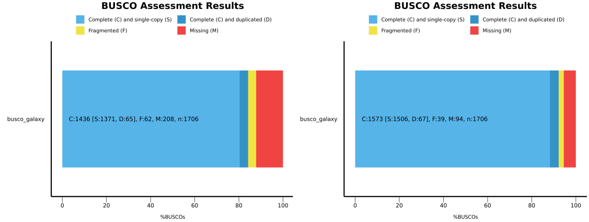

The {VGP}, a project of the {G10K} Consortium, aims to generate high-quality, near error-free, gap-free, chromosome-level, haplotype-phased, annotated reference genome assemblies for every vertebrate species (). The VGP has developed a fully automated *de-novo* genome assembly pipeline, which uses a combination of three different technologies: Pacbio {HiFi}, {Hi-C} data, and (optionally) BioNano optical map data. The pipeline consists of nine distinct workflows. This tutorial provides a quick example of how to run these workflows for one particular scenario, which is, based on our experience, the most common: assembling genomes using {HiFi} Reads combined with {Hi-C} data (both generated from the same individual).

> <agenda-title></agenda-title>
>
> In this tutorial, we will cover:
>
> 1. TOC
> {:toc}
>
{: .agenda}

# Getting started on Galaxy

This tutorial assumes you are comfortable getting data into Galaxy, running jobs, managing history, etc. If you are unfamiliar with Galaxy, we recommend you visit the [Galaxy Training Network](https://training.galaxyproject.org). Consider starting with the following trainings:
- [Introduction to Galaxy]()
- [Galaxy 101]()
- [Getting Data into Galaxy]()
- [Using Dataset Collections]()
- [Understanding the Galaxy History System]()
- [Introduction to Galaxy Analyses]()
- [Downloading and Deleting Data in Galaxy]()

# The VGP-Galaxy pipeline

The {VGP} assembly pipeline has a modular organization, consisting in ten workflows (Fig. 1). It can used with the following types of input data:

|  Input data | Assembly quality  | Analysis trajectory <br>([Fig. 1)](#figure-1)|
|------|---------------|-----|
| HiFi | The minimum requirement | A |
| HiFi + HiC| Better continuity | B |
| HiFi + BioNano | Better continuity | C |
| HiFi + Hi-C + BioNano | Even better continuity | D |
| HiFi + parental data| Better haplotype resolution | E |
| HiFi + parental data + Hi-C| Better haplotype resolution and improved continuity | F |
| HiFi + parental + BioNano | Better haplotype resolution and improved continuity | G |
| HiFi + parental data + Hi-C + BioNano | Better haplotype resolution and ultimate continuity | H |

If this table "HiFi" and "Hi-C" are derived from the individual whose genome is being assembled. "Parental data" is high coverage Illumina data derived from parents of the individual being assembled. Datasets containing parental data are also called "*Trios*". Each combination of input datasets is supported by an *analysis trajectory*: a combination of workflows designed for generating assembly given a particular combination of inputs. These trajectories are listed in the table above and shown in the figure below. We suggest at least 30✕ PacBio HiFi coverage and 30✕ Hi-C coverage per haplotype (parental genome); and up to 60✕ coverage to accurately assemble highly repetitive regions.

.")
<br>
The first stage of the pipeline is the generation of *k*-mer profiles of the raw reads to estimate genome size, heterozygosity, repetitiveness, and error rate necessary for parameterizing downstream workflows. The generation of *k*-mer counts can be done from HiFi data only (Workflow 1) or include data from parental reads for trio-based phasing (Workflow 2; trio is a combination of paternal sequencing data with that from an offspring that is being assembled). The second stage is the phased contig assembly. In addition to using only {HiFi} reads (Workflow 3), the contig building (contiging) step can leverage {Hi-C} (Workflow 4) or parental read data (Workflow 5) to produce fully-phased haplotypes (hap1/hap2 or parental/maternal assigned haplotypes), using [`hifiasm`](https://github.com/chhylp123/hifiasm). The contiging workflows also produce a number of critical quality control (QC) metrics such as *k*-mer multiplicity profiles. Inspection of these profiles provides information to decide whether the third stage—purging of false duplication—is required. Purging (Workflow 6), using [`purge_dups`](https://github.com/dfguan/purge_dups) identifies and resolves haplotype-specific assembly segments incorrectly labeled as primary contigs, as well as heterozygous contig overlaps. This increases continuity and the quality of the final assembly. The purging stage is generally unnecessary for trio data for which reliable haplotype resolution is performed using *k*-mer profiles obtained from parental reads. The fourth stage, scaffolding, produces chromosome-level scaffolds using information provided by Bionano (Workflow 7), with [`Bionano Solve`](https://bionano.com/software-downloads/) (optional) and Hi-C (Workflow 8) data and [`YaHS`](https://github.com/c-zhou/yahsscaffolding) algorithms. A final stage of decontamination (Workflow 9) removes exogenous sequences (e.g., viral and bacterial sequences) from the scaffolded assembly. A separate workflow (WF0) is used for mitochondrial assembly.

> <comment-title>A note on data quality</comment-title>
> We suggest at least 30✕ PacBio HiFi coverage and 30✕ Hi-C coverage per haplotype (parental genome); and up to 60✕ coverage to accurately assemble highly repetitive regions.
{: .comment}

# Getting the data

The following steps use PacBio {HiFi} and Illumina {Hi-C} data from baker's yeast ([*Saccharomyces cerevisiae*](https://en.wikipedia.org/wiki/Saccharomyces_cerevisiae)). The tutorial represents trajectory **B** from Fig. 1 above. For this tutorial, the first step is to get the datasets from Zenodo. Specifically, we will be uploading two datasets:

1. A set of PacBio {HiFi} reads in `fasta` format
2. A set of Illumina {Hi-C} reads in `fastqsanger.gz` format

## Uploading `fasta` datasets from Zenodo

The following two steps demonstrate how to upload three PacBio {HiFi} datasets into you Galaxy history.


> <hands-on-title><b>Uploading <tt>FASTA</tt> datasets from Zenodo</b></hands-on-title>
>
> 1. Create a new history for this tutorial
>
>    
>
> 2. Copy the following URLs into clipboard.
>    - you can do this by clicking on  button in the right upper corner of the box below. It will appear if you mouse over the box.)
>
>     ```
>     https://zenodo.org/record/6098306/files/HiFi_synthetic_50x_01.fasta
>     https://zenodo.org/record/6098306/files/HiFi_synthetic_50x_02.fasta
>     https://zenodo.org/record/6098306/files/HiFi_synthetic_50x_03.fasta
>     ```
>
> 3. Upload datasets into Galaxy.
>    - set the datatype to `fasta`
>
>    
>
>    
>
{: .hands_on}


## Uploading `fastqsanger.gz` datasets from Zenodo

Illumina {Hi-C} data is uploaded in essentially the same way as shown in the following two steps.

> <warning-title>DANGER: Make sure you choose correct format!</warning-title>
> When selecting datatype in "**Type (set all)**" drop-down, make sure you select `fastaqsanger` or `fastqsanger.gz` BUT NOT `fastqcssanger` or anything else!
{: .warning}

> <hands-on-title><b>Uploading <tt>fastqsanger.gz</tt> datasets from Zenodo</b></hands-on-title>
>
> 1. Copy the following URLs into clipboard.
>     - you can do this by clicking on  button in the right upper corner of the box below. It will appear if you mouse over the box.
>
>    ```
>    https://zenodo.org/record/5550653/files/SRR7126301_1.fastq.gz
>    https://zenodo.org/record/5550653/files/SRR7126301_2.fastq.gz
>    ```
>
> 2. Upload datasets into Galaxy.
>    - set the datatype to `fastqsanger.gz`
>
>    
>
>    
>
{: .hands_on}


> <warning-title>These datasets are large!</warning-title>
> Hi-C datasets are large. It will take some time (~15 min) for them to be fully uploaded. Please, be patient.
{: .warning}

## Organizing the data

If everything goes smoothly you history will look like shown in Fig. 4 below. The three {HiFi} fasta files are better represented as a collection: {collection}. Also, importantly, the workflow we will be using for the analysis of our data takes collection as an input (it does not access individual datasets). So let's create a collection using steps outlines in the Tip  "Creating a dataset collection" that you can find below Fig. 4.

. Creation of a list (collection) combines all HiFi datasets into a single history item called 'HiFi data' (right). See below for instruction on how to make this collection.")



> <details-title>Other ways to upload the data</details-title>
> You can obviously upload your own datasets via URLs as illustrated above or from your own computer. In addition, you can upload data from a major repository called [GenomeArk](https://genomeark.org). GenomeArk is integrated directly into Galaxy Upload. To use GenomeArk following the steps in the Tip  below:
>
> 
{: .details}


Once we have imported the datasets, the next step is to import the workflows necessary for the analysis of our data from [DockStore](https://dockstore.org).

# Importing workflows

All analyses described in this tutorial are performed using *workflows*--chains of tools--shown in [Fig. 1](#figure-1). Specifically, we will use four workflows corresponding to analysis trajectory **B**: 1, 4, 6, and 8. To use these four workflows you need to import them into your Galaxy account following the steps below:

> <hands-on-title><b>Importing workflows from GitHub</b></hands-on-title>
>
> Links to the four workflows that will be used in this tutorial are listed in the table. Follow the procedure described below the table to import each of them into your Galaxy account.
> <br>
>
> | Workflow | Link |
> |---------|---------|
> | *K*-mer profiling workflow (WF1) | [https://raw.githubusercontent.com/iwc-workflows/kmer-profiling-hifi-VGP1/v0.1.4/kmer-profiling-hifi-VGP1.ga](https://raw.githubusercontent.com/iwc-workflows/kmer-profiling-hifi-VGP1/v0.1.4/kmer-profiling-hifi-VGP1.ga) |
> | Assembly (contiging) with Hi-C workflow (WF4) | [https://raw.githubusercontent.com/iwc-workflows/Assembly-Hifi-HiC-phasing-VGP4/v0.1.6/Assembly-Hifi-HiC-phasing-VGP4.ga](https://raw.githubusercontent.com/iwc-workflows/Assembly-Hifi-HiC-phasing-VGP4/v0.1.6/Assembly-Hifi-HiC-phasing-VGP4.ga) |
> | Purge duplicate contigs workflow (WF6) | [https://raw.githubusercontent.com/iwc-workflows/Purge-duplicate-contigs-VGP6/v0.3.2/Purge-duplicate-contigs-VGP6.ga](https://raw.githubusercontent.com/iwc-workflows/Purge-duplicate-contigs-VGP6/v0.3.2/Purge-duplicate-contigs-VGP6.ga) |
> | Scaffolding with Hi-C workflow (WF8) | [https://raw.githubusercontent.com/iwc-workflows/Scaffolding-HiC-VGP8/v0.2/Scaffolding-HiC-VGP8.ga](https://raw.githubusercontent.com/iwc-workflows/Scaffolding-HiC-VGP8/v0.2/Scaffolding-HiC-VGP8.ga)|
>
> <br>
>
> **Step 1: Copy the workflow URL into clipboard**
>
> 1. Right click on a URL in the table above.
> 2. Select "Copy link address" option in the dropdown menu that appears.
> 3. Go to Galaxy
>
>> <warning-title>Make sure you are logged in!</warning-title>
>> Ensure that you are logged in into your Galaxy account!
> {: .warning}
>
> <br>
>
> **Step 2: Import the workflow**
>
> 1. Click "Workflow" on top of the Galaxy interface.
> 2. On top-right of the middle pane click " Import" button.
> 3. Paste the URL you copied into the clipboard at Step 1 above to "Archived Workflow URL" box.
> 4. Click "Import workflow" button.
>
> This entire procedure is shown in the animated figure below.  **You need to repeat this process for all four workflows**
>
> 
>
{: .hands-on}

> <details-title>Other ways to import workflows the data</details-title>
> You can import workflows from a variety of different sources including [DockStore](https://dockstore.org), [WorkflowHub](https://workflowhub.eu), or a URL:
>
> 
>
> 
>
> 
>
{: .details}

Once all four workflows are imported, your workflow list should look like this:


Once we have imported the datasets and the workflows, we can start with the genome assembly.

# Performing the assembly

Workflows listed in [Fig. 1](#figure-1) support a variety of "analysis trajectories". The majority of species that were sequenced by the {VGP} usually contain {HiFi} reads for the individual being sequenced supplemented with {Hi-C} data. As a result most assemblies performed by us follow the trajectory **B**. This is why this tutorial was designed to follow this trajectory as well.

## Genome profile analysis (WF1)

Now that our data and workflows are imported, we can run our first workflow. Before the assembly can be run, we need to collect metrics on the properties of the genome under consideration, such as the expected genome size according to our data. The present pipeline uses **Meryl** for generating the *k*-mer database and **Genomescope2** for determining genome characteristics based on a *k*-mer analysis.

### Launching the workflow

> <hands-on-title><b>Launching <i>K</i>-mer profile analysis workflow</b></hands-on-title>
>
> **Step 1: Identify inputs**
>
> The profiling workflow takes the following inputs:
>
> 1. {HiFi} reads as a collection
> 2. *K*-mer length
> 3. Ploidy
>
> **Step 2: Launch *k*-mer profiling workflow**
>
> 1. Click in the **Workflow** menu, located in the top bar
> 2. Click in the  **Run workflow** buttom corresponding to `K-mer profiling and QC (WF1)`
> 3. In the **Workflow: VGP genome profile analysis** menu:
>  -  "*Collection of Pacbio Data*": `7: HiFi_collection`
>  - "*K-mer length*": `31`
>  - "*Ploidy*": `2`
> 4. Click on the <kbd>Run workflow</kbd> buttom
>
> This should like this:
>
>
>
>
>
>> <comment-title>K-mer length</comment-title>
>> In this tutorial, we are using a *k*-mer length of 31. This can vary, but the VGP pipeline tends to use a *k*-mer length of 21, which tends to work well for most mammalian-size genomes. There is more discussion about *k*-mer length trade-offs in the extended VGP pipeline tutorial.
> {: .comment}
>
><br>
>
> **Step 3: Refill your coffee**
>
> Assembly is not exactly an instantaneous type of analysis - this workflow will take approx 15 minutes to complete. The same is true for all analyses in tutorial.
{: .hands_on}

### Interpreting the results

 Once the workflow has finished, we can evaluate the linear plot generated by [**`Genomescope`**](https://github.com/schatzlab/`Genomescope`), which includes valuable information such as the observed *k*-mer profile, fitted models and estimated parameters. This file corresponds to the dataset `15` in this [history](https://usegalaxy.org/u/cartman/h/k-mer-profiling).
<br>
, genome unique length percent (uniq), overall heterozygosity rate (ab), mean <i>k</i>-mer coverage for heterozygous bases (kcov), read error rate (err), average rate of read duplications (dup) and <i>k</i>-mer size (k).")
<br>
This distribution is the result of the Poisson process underlying the generation of sequencing reads. As we can see, the *k*-mer profile follows a bimodal distribution, indicative of a diploid genome. The distribution is consistent with the theoretical diploid model (model fit > 93%). Low frequency *k*-mers are the result of sequencing errors, and are indicated by the red line. Genomescope2 estimated a haploid genome size of around 11.7 Mbp, a value reasonably close to the *Saccharomyces* genome size.


## Assembly (contiging) with `hifiasm` (WF4)

To generate {contigs} we will use [**hifiasm**](https://github.com/chhylp123/hifiasm) assembler. It is a part of the `Assembly with HiC (WF4)` workflow . This workflow uses **hifiasm** (HiC mode) to generate HiC-phased haplotypes (hap1 and hap2). This is in contrast to its default mode, which generates primary and alternate pseudohaplotype assemblies. This workflow includes three tools for evaluating assembly quality: [**`gfastats`**](https://github.com/vgl-hub/gfastats), [**`BUSCO`**](https://busco.ezlab.org/) and [**`Merqury`**](https://github.com/marbl/merqury).

### Launching the workflow

> <hands-on-title><b>Launching assembly (contiging) workflow</b></hands-on-title>
>
>**Step 1: Identify inputs**
>
>The assembly workflow takes the following inputs:
>
> 1. {HiFi} reads as a collection
> 2. Forward Hi-C reads
> 3. Reverse Hi-C reads
> 4. `Genomescope` Model Parameters generated by previous (*k*-mer profiling) workflow
> 5. `Genomescope` Summary generated by previous (*k*-mer profiling) workflow
> 6. Meryl *k*-mer database generated by previous (*k*-mer profiling) workflow
> 7. Busco lineage
><br>
>
>**Step 2: Launch the workflow**
>
> 1. Click in the **Workflow** menu, located in the top bar
> 2. Click in the  **Run workflow** button corresponding to `VGP HiFi phased assembly with hifiasm and HiC data`
> 3. In the **Workflow: Assembly with HiC (WF4)** menu fill the following parameters:
>   -  "*Pacbio Reads Collection*": Collection with original HiFi data
>   -  "*Meryl database*": Meryl *k*-mer database: one of the outputs of the previous workflow  (contains tag "`MerylDatabase`")
>   -  "*HiC forward reads*": Forward Hi-C reads
>   -  "*HiC reverse reads*": Reverse Hi-C reads
>   -  "*Provide lineage for BUSCO (e.g., Vertebrata)*": `Ascomycota`
>   -  "*GenomeScope Summary*": GenomeScope summary: one of the outputs of the previous workflow (contains tag "`GenomeScopeSummary`")
>   -  "*GenomeScope Model Parameters*": GenomeScope model parameters: one of the outputs of the previous workflow (contains tag "`GenomeScopeParameters`")
> 4. Click on the <kbd>Run workflow</kbd> button
{: .hands_on}

### Interpreting the results

> <warning-title>There will be two assemblies!</warning-title>
> Because we are assembling a diploid organism this workflow will produce two assemblies: hap1 and hap2!
{: .warning}

Let's have a look at the stats generated by **gfastats**. This output summarizes some main assembly statistics, such as contig number, N50, assembly length, etc. Below we provide a partial output of `gfastats` in which information about both assemblies is shown side-by-side:

>| Statistic | Hap 1 | Hap 2 |
>|-----------|----------:|------:|
>| # contigs | 16 | 19 |
>| Total contig length | 12,050,076 | 12,360,746 |
>| Average contig length | 753,129.75  | 650,565.58 |
>| Contig N50 |  923,452 | 922,430 |
>| Contig N50 | 923,452 | 922,430 |
>| Contig auN | 909,022.62  | 891,508.36 |
>| Contig L50 | 6 | 6 |
>| Contig L50 | 6 | 6 |
>| Contig NG50 | 923,452 | 922,430 |
>| Contig NG50 | 923,452 | 922,430 |
>| Contig auNG | 932,462.97 | 938,074.26 |
>| Contig LG50 | 6 | 6 |
>| Contig LG50 | 6 | 6 |
>| Largest contig | 1,532,843 | 1,531,728 |
>| Smallest contig | 231,313 | 26,588 |
{: .matrix}

According to the report, both assemblies are quite similar; the primary assembly includes 16 {contigs}, whose cumulative length is around 12 Mbp. The alternate assembly includes 19 contigs, whose total length is 12.3Mbp. Both assemblies come close to the estimated genome size, which is as expected since we used hifiasm-HiC mode to generate phased assemblies which lowers the chance of false duplications that can inflate assembly size.

> <comment-title>Are you working with pri/alt assemblies?</comment-title>
> This tutorial uses the hifiasm-HiC workflow, which generates phased hap1 and hap2 assemblies. The phasing helps lower the chance of false duplications, since the phasing information helps the assembler know which genomic variation is heterozygosity at the same locus versus being two different loci entirely. If you are working with primary/alternate assemblies (especially if there is no internal purging in the initial assembly), you can expect higher false duplication rates than we observe here with the yeast HiC hap1/hap2.
{: .comment}

> <question-title></question-title>
>
> 1. What is the longest contig in the primary assembly? And in the alternate one?
> 2. What is the N50 of the primary assembly?
>
> > <solution-title></solution-title>
> >
> > 1. The longest contig in the primary assembly is 1,532,843 bp, and 1,531,728 bp in the alternate assembly.
> > 2. The N50 of the primary assembly is 923.452 bp.
> >
> {: .solution}
>
{: .question}

Next, we are going to evaluate the outputs generated by **BUSCO**. This tool provides quantitative assessment of the completeness of a genome assembly in terms of expected gene content. It relies on the analysis of genes that should be present only once in a complete assembly or gene set, while allowing for rare gene duplications or losses ().

<br>



<br>

As we can see in the report, the results are simplified into four categories: *complete and single-copy*, *complete and duplicated*, *fragmented* and *missing*.

> <question-title></question-title>
>
> 1. How many complete BUSCO genes have been identified in the primary assembly?
> 2. How many BUSCOs genes are absent?
>
> > <solution-title></solution-title>
> >
> > 1. According to the report, our assembly contains the complete sequence of 1,562 complete BUSCO genes.
> > 2. 92 BUSCO genes are missing.
> >
> {: .solution}
>
{: .question}

Despite **BUSCO** being robust for species that have been widely studied, it can be inaccurate when the newly assembled genome belongs to a taxonomic group that is not well represented in [OrthoDB](https://www.orthodb.org/). `Merqury` provides a complementary approach for assessing genome assembly quality metrics in a reference-free manner via *k*-mer copy number analysis. Specifically, it takes our hap1 as the first genome assembly, hap2 as the second genome assembly, and the merylDB generated previously for *k*-mer counts.

By default, `Merqury` generates three collections as output: stats, plots and {QV} stats. The "stats" collection contains the completeness statistics, while the "QV stats" collection contains the quality value statistics. Let's have a look at the copy number (CN) spectrum plot, known as the *spectra-cn* plot. The spectra-cn plot looks at both of your assemblies (here, your haplotypes) taken *together* (fig. 6a).  We can see a small amount of false duplications here: at the 50 mark on the x-axis, there is a small amount of *k*-mers present at 3-copy across the two assemblies (the green bump).
<br>
</b>. <i>K</i>-mer distribution of both haplotypes. <b>b)</b>. <i>K</i>-mer distribution of an individual haplotype (hap2)."){:width="100%"}
<br>

Thus, we know there is some false duplication (the 3-copy green bump) present as 2-copy in one of our assemblies, but we don't know which one. We can look at the individual copy number spectrum for each haplotype in order to figure out which one contains the 2-copy *k*-mers (*i.e.*, the false duplications). In the Merqury spectra-CN plot for hap2 we can see the small bump of 2-copy *k*-mers (blue) at around the 50 mark on the x-axis (fig. 6b).

Now that we know which haplotype contains the false duplications, we can run the purging workflow to try to get rid of these duplicates.

## Purging duplicates with `purge_dups`

An ideal haploid representation would consist of one allelic copy of all heterozygous regions in the two haplotypes, as well as all hemizygous regions from both haplotypes (). However, in highly heterozygous genomes, assembly algorithms are frequently not able to identify the highly divergent allelic sequences as belonging to the same region, resulting in the assembly of those regions as separate contigs. In order to prevent potential issues in downstream analysis, we are going to run the **Purge duplicate contigs (WF6)**, which will allow to identify and reassign heterozygous contigs. This step is only necessary if haplotypic duplications are observed, and the output should be carefully checked for overpurging.

### Launching the workflow

> <hands-on-title><b>Launching duplicate purging workflow</b></hands-on-title>
>
>**Step 1: Identify inputs**
>
>The purging workflow takes the following inputs:
>
> 1. {HiFi} reads as a collection
> 2. Primary assembly produced by `hifiasm` in the previous run of assembly workflow (WF4).
> 3. Alternate assembly produced by `hifiasam` in the previous run of assembly workflow (WF4).
> 4. `Genomescope` Model Parameters generated by previous (*k*-mer profiling) workflow
> 5. Estimated genome size parsed from GenoeScope summary by the previous run of assembly workflow (WF4).
> 6. Meryl *k*-mer database generated by previous (*k*-mer profiling, WF1) workflow
> 7. Busco lineage
>
>**Step 2: Launch Purge duplicate contigs workflow (WF6)**
>
> 1. Click in the **Workflow** menu, located in the top bar
> 2. Click in the  **Run workflow** button corresponding to `Purge duplicate contigs (WF6)`
> 3. In the **Workflow: VGP purge assembly with purge_dups pipeline** menu:
>  -  "*Pacbio Reads Collection - Trimmed*": One of the outputs of the assembly workflow is a trimmed collection of HiFi reads. It has a tag `trimmed_hifi`.
>  -  "*Hifiasm Primary assembly*": An output of the assembly workflow (WF4) containing contigs for Hap1 in FASTA format. This dataset has a tag `hifiasm_Assembly_Haplotype_1`.
>  -  "*Hifiasm Alternate assembly*": An output of the assembly workflow (WF4) containing contigs for Hap2 in FASTA format. This dataset has a tag `hifiasm_Assembly_Haplotype_2`
>  -  "*Meryl database*": Meryl *k*-mer database: one of the outputs of the previous workflow  (contains tag "`MerylDatabase`")
>  -  "*GenomeScope Model Parameters*": GenomeScope model parameters: one of the outputs of the previous workflow (contains tag "`GenomeScopeParameters`")
>  -  "*Estimated genome size*": A dataset produced with the assembly workflow (WF4). It contains a tag `estimated_genome_size`.
>  -  "*Provide lineage for BUSCO (e.g., Vertebrata)*": `Ascomycota`
> 4. Click in the <kbd>Run workflow</kbd> buttom
{: .hands_on}

### Interpreting results

The two most important outputs of the purging workflow are purged versions of Primary and Alternate assemblies. These have tags <kbd>PurgedPrimaryAssembly</kbd> and <kbd>PurgedAlternateAssembly</kbd> for Primary and Alternate assemblies, respectively. This step also provides QC metrics for evaluating the effect of purging (Figure below).

<br>

</b> and <b>c)</b>) and post-purging (<b>b)</b> and <b>d)</b>) Merqury CN spectra   . The two top plots (<b>a)</b> and <b>b)</b>) for our dataset (yeast) and the two bottom plots (<b>c)</b> and <b>d)</b>) for a Chub mackerel (<i>Scomber japonicus</i>) -- a much larger genome. In the case of yeast the difference is not profound because our training dataset has been downsized and groomed to be as small as possible. In the case of zebra finch the green bump (<i>k</i>-mers appearing in three copies) is smaller after purging (Although potential overpurging can be seen by the new read-only (grey) bump that was not there before). Given the scale of the Y-axis this difference is substantial."){:width="100%"}

<br>

## Hi-C scaffolding

In this final stage, we will run the **Scaffolding HiC YAHS (WF8)**, which exploits the fact that the contact frequency between a pair of loci strongly correlates with the one-dimensional distance between them. This information allows [**YAHS**](https://github.com/c-zhou/yahs) -- the main tool in this workflow -- to generate scaffolds that are often chromosome-sized.

### Launching Hi-C scaffolding workflow

> <warning-title>The scaffolding workflow is run on <b>ONE</b> haplotype at a time.</warning-title>
> Contiging (WF4) and purging (WF6) workflows work with both (hap1/hap2, primary/alternate) assemblies simultaneously. This is not the case for contiging -- it hgas to be run independently for each haplotype assembly. In this example (below) we run contiging on hap1 (Primary) assembly only.
{: .warning}

> <hands-on-title><b>Launching Hi-C scaffolding workflow</b></hands-on-title>
>
>**Step 1: Identify inputs**
>
>The scaffolding workflow takes the following inputs:
>
> 1. An assembly graph
> 2. Forward Hi-C reads
> 3. Reverse Hi-C reads
> 4. Estimated genome size parsed from GenoeScope summary by the previous run of assembly workflow (WF4).
> 5. Restriction enzymes used in Hi-C library preparation procedure
> 6. Busco lineage
>
> **Step 2: Launch scaffolding workflow (WF8)**
>
> 1. Click in the **Workflow** menu, located in the top bar
> 2. Click in the  **Run workflow** button corresponding to `Scaffolding HiC YAHS (WF8)`
> 3. In the **Scaffolding HiC YAHS (WF8)** menu:
>  -  "*input GFA*": Output of purging workflow (WF6) with a tag `PurgedPrimaryAssembly` (or `PurgedPrimaryAssembly` of scaffolding the Alternate assembly).
>  -  "*HiC forward reads*": Forward Hi-C reads
>  -  "*HiC reverse reads*": Reverse Hi-C reads
>  -  "*Estimated genome size - Parameter File*": An output of the contiging workflow (WF4) with a tag `estimated_genome_size`.
>  -  "*Provide lineage for BUSCO (e.g., Vertebrata)*": `Ascomycota`
> 4. Click in the <kbd>Run workflow</kbd> button
{: .hands_on}


> <comment-title>Bypassing purging workflow</comment-title>
> In some situations (such as assemblies utilizing Trio data (Fig. 1) you do not need to perform purging and can go directly from contiging to scaffolding. In this case you will need to use an output of contiging workflow that has a tag `hic_hap1_gfa` for primary assembly or `hic_hap2_gfa` for alternate assembly:
>
>In other words, the only parameter that you will need to set differently (relative to setting above) is this:
> <hr>
>  "*input GFA*": Output of contiging workflow (WF4) with a tag `hic_hap1_gfa` for primary assembly or `hic_hap2_gfa` for alternate assembly.
> <hr>
{: .comment}

### Interpreting the results

In order to evaluate the Hi-C hybrid scaffolding, we are going to compare the contact maps before and after running the HiC hybrid scaffolding workflow (Fig. below). They will have the following tags:

- Before scaffolding: `pretext_s1`
- After scaffolding: `pretext_s2`

Below is the comparison of the two maps obtained from our data a more profound "real live" example from assembly of zebra finch (*Taeniopygia guttata*) genome:

<br>


<br>

The regions marked with red circles highlight the most notable difference between the two contact maps, where inversion has been fixed.

# Conclusion

To sum up, it is worthwhile to compare the final assembly with the [_S. cerevisiae_ S288C reference genome](https://ftp.ncbi.nlm.nih.gov/genomes/all/GCF/000/146/045/GCF_000146045.2_R64/GCF_000146045.2_R64_assembly_stats.txt):

<br>

 with existing yeast reference (black dotted line). Our assembly is slightly smaller (11,287,131 bp versus 12,071,326. Our assembly is lacking the mitochondrial genome (~86 kb) beacuse the initial data does include mitochondrial reads. This is partially responsible for this discrepancy. ")

<br>

With respect to the total sequence length, we can conclude that the size of our genome assembly is very similar to the reference genome. It is noteworthy that the reference genome consists of 17 sequences, while our assembly includes only 16 chromosomes. This is due to the fact that the reference genome also includes the sequence of the mitochondrial DNA, which consists of 85,779 bp. (The above comparison is performed using  using Primary assembly generated with scaffolding workflow (WF8) and yeast reference.)

<br>

 and the reference genome (right).")

<br>

If we compare the contact map of our assembled genome with the reference assembly (Fig. above), we can see that the two are indistinguishable, suggesting that we have generated a chromosome level genome assembly.


