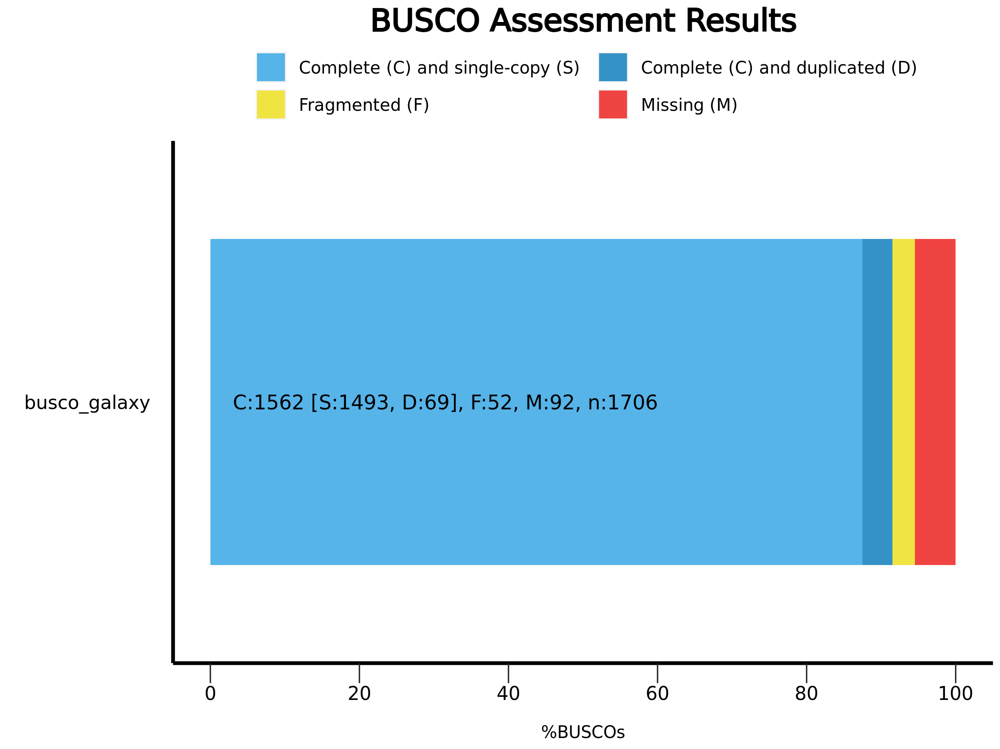

# Introduction


The Vertebrate Genome Project (VGP), a project of the G10K Consortium, aims to generate high-quality, near error-free, gap-free, chromosome-level, haplotype-phased, annotated reference genome assemblies for every vertebrate species (). The VGP has developed a fully automated *de-novo* genome assembly pipeline, which uses a combination of three different technologies: Pacbio HiFi, Bionano optical maps and Hi-C chromatin interaction data.

As a result of a collaboration with the VGP team, a training including a step-by-step detailed description of parameter choices for each step of assembly was developed for the Galaxy Training Network (). This tutorial instead provides a quick walkthrough on how the workflows can be used to rapidly assemble a genome using the VGP pipeline with the Galaxy Workflow System (GWS).

GWS facilitates analysis repeatability, while minimizing the number of manual steps required to execute an analysis workflow, and automating the process of inputting parameters and software tool version tracking. The objective of this training is to explain how to run the VGP workflow, focusing on what are the required inputs and which outputs are generated and delegating how the steps are executed to the GWS.

> <agenda-title></agenda-title>
>
> In this tutorial, we will cover:
>
> 1. TOC
> {:toc}
>
{: .agenda}

# Getting Started on Galaxy

This tutorial assumes you are comfortable getting data into Galaxy, running jobs, managing history, etc. If you are unfamiliar with Galaxy, we recommed you to visit the [Galaxy Training Network](https://training.galaxyproject.org). Consider starting with the following trainings:
- [Introduction to Galaxy]()
- [Galaxy 101]()
- [Getting Data into Galaxy]()
- [Using Dataset Collections]()
- [Introduction to Galaxy Analyses](https://training.galaxyproject.org/training-material/topics/introduction)
- [Understanding the Galaxy History System]()
- [Downloading and Deleting Data in Galaxy]()


# VGP assembly workflow structure

The VGP assembly pipeline has a modular organization, consisting in five main subworkflows (fig. 1), each one integrated by a series of data manipulation steps. Firstly, it allows the evaluation of intermediate steps, which facilitates the modification of parameters if necessary, without the need to start from the initial stage. Secondly, it allows to adapt the workflow to the available data.

> , required for exporting the results to GenomeArk.")

The VGP pipeline integrates two workflows to generate scaffolds from the contig level assemblies generated from the HiFi reads. When Hi-C data and Bionano data are available, the default pipeline is running the Bionano workflow first, followed by the Hi-C workflow. However, it is possible that Bionano data may not be available, in which case the HiC workflow can be used directly on the initial purged assembly.

> <comment-title>Input option order</comment-title>
> This tutorial assumes the input datasets are high-quality. QC on raw read data should be performed before it is used. QC on raw read data is outside the scope of this tutorial.
{: .comment}

## Get data

For this tutorial, the first step is to get the datasets from Zenodo. The VGP assembly pipeline uses data generated by a variety of technologies, including PacBio HiFi reads, Bionano optical maps, and Hi-C chromatin interaction maps.

> <hands-on-title>Data upload</hands-on-title>
>
> 1. Create a new history for this tutorial
> 2. Import the files from [Zenodo]({{ page.zenodo_link }})
>
>    - Open the file  __upload__ menu
>    - Click on **Rule-based** tab
>    - *"Upload data as"*: `Datasets`
>    - Copy the tabular data, paste it into the textbox and press <kbd>Build</kbd>
>
>       ```
>   Hi-C_dataset_F   https://zenodo.org/record/5550653/files/SRR7126301_1.fastq.gz?download=1   fastqsanger.gz    Hi-C
>   Hi-C_dataset_R   https://zenodo.org/record/5550653/files/SRR7126301_2.fastq.gz?download=1   fastqsanger.gz    Hi-C
>   Bionano_dataset    https://zenodo.org/record/5550653/files/bionano.cmap?download=1   cmap    Bionano
>       ```
>
>    - From **Rules** menu select `Add / Modify Column Definitions`
>       - Click `Add Definition` button and select `Name`: column `A`
>       - Click `Add Definition` button and select `URL`: column `B`
>       - Click `Add Definition` button and select `Type`: column `C`
>       - Click `Add Definition` button and select `Name Tag`: column `D`
>    - Click `Apply` and press <kbd>Upload</kbd>
>
> 3. Import the remaining datasets from [Zenodo]({{ page.zenodo_link }})
>
>    - Open the file  __upload__ menu
>    - Click on **Rule-based** tab
>    - *"Upload data as"*: `Collections`
>    - Copy the tabular data, paste it into the textbox and press <kbd>Build</kbd>
>
>       ```
>   dataset_01    https://zenodo.org/record/6098306/files/HiFi_synthetic_50x_01.fasta?download=1  fasta    HiFi  HiFi_collection
>   dataset_02    https://zenodo.org/record/6098306/files/HiFi_synthetic_50x_02.fasta?download=1  fasta    HiFi  HiFi_collection
>   dataset_03    https://zenodo.org/record/6098306/files/HiFi_synthetic_50x_03.fasta?download=1  fasta    HiFi  HiFi_collection
>       ```
>
>    - From **Rules** menu select `Add / Modify Column Definitions`
>       - Click `Add Definition` button and select `List Identifier(s)`: column `A`
>       - Click `Add Definition` button and select `URL`: column `B`
>       - Click `Add Definition` button and select `Type`: column `C`
>       - Click `Add Definition` button and select `Group Tag`: column `D`
>       - Click `Add Definition` button and select `Collection Name`: column `E`
>    - Click `Apply` and press <kbd>Upload</kbd>
>
{: .hands_on}


> <details-title>Working with your own data</details-title>
>
> If working on a genome other than the example yeast genome, you can upload the VGP data from the [VGP/Genome Ark AWS S3 bucket](https://genomeark.s3.amazonaws.com/index.html) as follows:
>
> > <hands-on-title>Import data from GenomeArk</hands-on-title>
> >
> > 1. Open the file  __upload__ menu
> > 2. Click on **Choose remote files** tab
> > 3. Click on the **Genome Ark** button and then click on **species**
> {: .hands_on}
>
> You can find the VGP data following this path: `/species/${Genus}_${species}/${specimen_code}/genomic_data`. Inside a given datatype directory (*e.g.* `pacbio`), select all the relevant files individually until all the desired files are highlighted and click the <kbd>Ok</kbd> button. Note that there may be multiple pages of files listed. Also note that you may not want every file listed.
>
> 
>
{: .details}

## Import workflows from WorkflowHub

Once we have imported the datasets, the next step is to import the VGP workflows from the [WorkflowHub server](https://workflowhub.eu/). WorkflowHub is a workflow management system which allows workflows to be FAIR (Findable, Accessible, Interoperable, and Reusable), citable, have managed metadata profiles, and be openly available for review and analytics.

> <hands-on-title>Import a workflow</hands-on-title>
>
> 1. Click on the **Workflow** menu, located in the top bar.
>   
> 2. Click on the <kbd>Import</kbd> button, located in the right corner.
> 3. In the section **Import a Workflow from Configured GA4GH Tool Registry Servers (e.g. Dockstore)**, click on *Search form*.
> 4. In the **TRS Server: *workflowhub.eu*** menu you should type `name:vgp`
>    
> 5. Click on the desired workflow, and finally select the latest available version.
{: .hands_on}

After that, the imported workflows will appear in the main workflow menu. In order to initialize the workflow, we just need to click in the  **Run workflow** icon, marked with a red square in figure 2.


Once we have imported the datasets and the workflows, we can start with the genome assembly.

> <comment-title>Workflow-centric Research Objects</comment-title>
>
> In WorkflowHub, workflows are packaged, registered, downloaded and exchanged as Research Objects using the RO-Crate specification, with test and example data, managed metadata profiles, citations and more.
>
{: .comment}

# Genome profile analysis

[ Switch to step by step version](#genome-profile-analysis)

Now that our data and workflows are imported, we can run our first workflow. Before the assembly can be run, we need to collect metrics on the properties of the genome under consideration, such as the expected genome size according to our data. The present pipeline uses **Meryl** for generating the k-mer database and **Genomescope2** for determining genome characteristics based on a k-mer analysis.

> <hands-on-title>VGP genome profile analysis workflow</hands-on-title>
>
> 1. Click in the **Workflow** menu, located in the top bar
> 2. Click in the  **Run workflow** buttom corresponding to `VGP genome profile analysis`
> 3. In the **Workflow: VGP genome profile analysis** menu:
>   -  "*Collection of Pacbio Data*": `7: HiFi_collection`
>   - "*K-mer length*": `31`
>   - "*Ploidy*": `2`
> 4. Click on the <kbd>Run workflow</kbd> buttom
>
> > <comment-title>K-mer length</comment-title>
> > In this tutorial, we are using a k-mer length of 31. This can vary, but the VGP pipeline tends to use a k-mer length of 21, which tends to work well for most mammalian-size genomes. There is more discussion about k-mer length trade-offs in the extended VGP pipeline tutorial.
> {: .comment}
>
{: .hands_on}

Once the workflow has finished, we can evaluate the linear plot generated by **Genomescope** (fig. 3), which includes valuable information such as the observed k-mer profile, fitted models and estimated parameters. This file corresponds to the dataset `26`.

, genome unique length percent (uniq), overall heterozygosity rate (ab), mean k-mer coverage for heterozygous bases (kcov), read error rate (err), average rate of read duplications (dup) and k-mer size (k).")

This distribution is the result of the Poisson process underlying the generation of sequencing reads. As we can see, the k-mer profile follows a bimodal distribution, indicative of a diploid genome. The distribution is consistent with the theoretical diploid model (model fit > 93%). Low frequency *k*-mers are the result of sequencing errors, and are indicated by the red line. GenomeScope2 estimated a haploid genome size of around 11.7 Mbp, a value reasonably close to the *Saccharomyces* genome size.


# HiFi phased assembly with hifiasm

[ Switch to step by step version](#hifi-phased-assembly-with-hifiasm)

After genome profiling, the next step is to run the **VGP HiFi phased assembly with hifiasm and HiC data workflow**. This workflow uses **hifiasm** (HiC mode) to generate HiC-phased haplotypes (hap1 and hap2). This is in contrast to its default mode, which generates primary and alternate pseudohaplotype assemblies. This workflow includes three tools for evaluating assembly quality: **QUAST**, **BUSCO** and **Merqury**.

> <hands-on-title>VGP HiFi phased assembly with hifiasm and HiC data workflow</hands-on-title>
> 1. Click in the **Workflow** menu, located in the top bar
> 2. Click in the  **Run workflow** buttom corresponding to `VGP HiFi phased assembly with hifiasm and HiC data`
> 3. In the **Workflow: VGP HiFi phased assembly with hifiasm and HiC data** menu:
>   -  "*Pacbio Reads Collection*": `7. HiFi_collection`
>   -  "*Meryl database*": `12: Meryl on data 11, data 10, data 9: read-db.meryldb`
>   -  "*HiC forward reads*": `3: Hi-C_dataset_F`
>   -  "*HiC reverse reads*": `2: Hi-C_dataset_R`
>   -  "*Genomescope summary dataset*": `19: Genomescope on data 13 Summary`
> 4. Click on the <kbd>Run workflow</kbd> button
>
> > <comment-title>Input option order</comment-title>
> > Note that the order of the inputs may differ slightly.
> {: .comment}
>
{: .hands_on}

Let's have a look at the HTML report generated by **QUAST** (fig. 4), which corresponds with the dataset  `52`. It summarizes some main assembly statistics, such as contig number, N50, assembly length, etc.

. Cumulative length plot (b).")

According to the report, both assemblies are quite similar; the primary assembly includes 18 contigs, whose cumulative length is around 12.2Mbp. The alternate assembly includes 17 contigs, whose total length is 11.3Mbp. As we can see in figure 4a, both assemblies come close to the estimated genome size, which is as expected since we used hifiasm-HiC mode to generate phased assemblies which lowers the chance of false duplications that can inflate assembly size.

> <comment-title>Are you working with pri/alt assemblies?</comment-title>
> This tutorial uses the hifiasm-HiC workflow, which generates phased hap1 and hap2 assemblies. The phasing helps lower the chance of false duplications, since the phasing information helps the assembler know which genomic variation is heterozygosity at the same locus versus being two different loci entirely. If you are working with primary/alternate assemblies (especially if there is no internal purging in the initial assembly), you can expect higher false duplication rates than we observe here with the yeast HiC hap1/hap2.
{: .comment}

> <question-title></question-title>
>
> 1. What is the longest contig in the primary assembly? And in the alternate one?
> 2. What is the N50 of the primary assembly?
> 3. Which percentage of reads mapped to each assembly?
>
> > <solution-title></solution-title>
> >
> > 1. The longest contig in the primary assembly is 1.532.843 bp, and 1.532.843 bp in the alternate assembly.
> > 2. The N50 of the primary assembly is 922.430 bp.
> > 3. According to the report, 100% of reads mapped to both the primary assembly and the alternate assembly.
> >
> {: .solution}
>
{: .question}

Next, we are going to evaluate the outputs generated by **BUSCO**. This tool provides quantitative assessment of the completeness of a genome assembly in terms of expected gene content. It relies on the analysis of genes that should be present only once in a complete assembly or gene set, while allowing for rare gene duplications or losses ().



As we can see in the report, the results are simplified into four categories: *complete and single-copy*, *complete and duplicated*, *fragmented* and *missing*.

> <question-title></question-title>
>
> 1. How many complete BUSCO genes have been identified in the primary assembly?
> 2. How many BUSCOs genes are absent?
>
> > <solution-title></solution-title>
> >
> > 1. According to the report, our assembly contains the complete sequence of 2080 complete BUSCO genes (97.3%).
> > 2. 19 BUSCO genes are missing.
> >
> {: .solution}
>
{: .question}

Despite **BUSCO** being robust for species that have been widely studied, it can be inaccurate when the newly assembled genome belongs to a taxonomic group that is not well represented in [OrthoDB](https://www.orthodb.org/). Merqury provides a complementary approach for assessing genome assembly quality metrics in a reference-free manner via *k*-mer copy number analysis. Specifically, it takes our hap1 as the first genome assembly, hap2 as the second genome assembly, and the merylDB generated previously for k-mer counts. Like the other QC metrics we have been looking at, the VGP Hifiasm-HiC workflow will automatically generate the Merqury analysis.

By default, **Merqury** generates three collections as output: stats, plots and QV stats. The "stats" collection contains the completeness statistics, while the "QV stats" collection contains the quality value statistics. Let's have a look at the copy number (CN) spectrum plot, known as the *spectra-cn* plot. The spectra-cn plot looks at both of your assemblies (here, your haplotypes) taken *together* (fig. 6a).  We can see a small amount of false duplications here: at the 50 mark on the x-axis, there is a small amount of k-mers present at 3-copy across the two assemblies (the green bump).

. K-mer distribution of an individual haplotype (b)"){:width="100%"}

 Thus, we know there is some false duplication (the 3-copy green bump) present as 2-copy in one of our assemblies, but we don't know which one. We can look at the individual copy number spectrum for each haplotype in order to figure out which one contains the 2-copy k-mers (*i.e.*, the false duplications). In the Merqury spectra-CN plot for hap2 we can see the small bump of 2-copy k-mers at around the 50 mark on the x-axis (fig. 6b).

Now that we know which haplotype contains the false duplications, we can run the purging workflow to try to get rid of these duplicates.

# Post-assembly processing

[ Switch to step by step version](#post-assembly-processing)

An ideal haploid representation would consist of one allelic copy of all heterozygous regions in the two haplotypes, as well as all hemizygous regions from both haplotypes (). However, in highly heterozygous genomes, assembly algorithms are frequently not able to identify the highly divergent allelic sequences as belonging to the same region, resulting in the assembly of those regions as separate contigs. In order to prevent potential issues in downstream analysis, we are going to run the **VGP purge assembly with purge_dups workflow**, which will allow to identify and reassign heterozygous contigs. This step is only necessary if haplotypic duplications are observed, and the output should be carefully checked for overpurging.

> <hands-on-title>VGP purge assembly with purge_dups pipeline  workflow</hands-on-title>
>
> 1. Click in the **Workflow** menu, located in the top bar
> 2. Click in the  **Run workflow** buttom corresponding to `VGP purge assembly with purge_dups pipeline`
> 3. In the **Workflow: VGP purge assembly with purge_dups pipeline** menu:
>   -  "*Hifiasm Primary assembly*": `39: Hifiasm HiC hap1`
>   -  "*Hifiasm Alternate assembly*": `40: Hifiasm HiC hap2`
>   -  "*Pacbio Reads Collection - Trimmed*": `22: Cutadapt`
>   -  "*Genomescope model parameters*": `20: Genomescope on data 13 Model parameters`
> 4. Click in the <kbd>Run workflow</kbd> buttom
>
{: .hands_on}

This workflow generates a large number of outputs, among which we should highlight the datasets `74` and `91`, which correspond to the purged primary and alternative assemblies respectively.

# Hybrid scaffolding with Bionano optical maps

[ Switch to step by step version](#hybrid-scaffolding-using-bionano-data)

Once the assemblies generated by **hifiasm** have been purged, the next step is to run the **VGP hybrid scaffolding with Bionano optical maps workflow**. It will integrate the information provided by optical maps with primary assembly sequences in order to detect and correct chimeric joins and misoriented contigs. In addition, this workflow includes some additonal steps for evaluating the outputs.

> <hands-on-title>VGP hybrid scaffolding with Bionano optical maps workflow</hands-on-title>
>
> 1. Click in the **Workflow** menu, located in the top bar
> 2. Click in the  **Run workflow** buttom corresponding to `VGP hybrid scaffolding with Bionano optical maps`
> 3. In the **Workflow: VGP hybrid scaffolding with Bionano optical maps** menu:
>   -  "*Bionano data*": `1: Bionano_dataset`
>   -  "*Hifiasm Purged Assembly*": `90: Purge overlaps on data 88 and data 33: get_seqs purged sequences` (note: the data numbers may differ in your workflow, but it should still be tagged `p1` from the purge_dups workflow)
>   -  "*Estimated genome size - Parameter File*": `60: Estimated Genome size`
>   - "*Is genome large (>100Mb)?*": `No`
> 4. Click on the <kbd>Run workflow</kbd> buttom
{: .hands_on}

Once the workfow has finished, let's have a look at the assembly reports.

As we can observe in the cumulative plot of the file `119` (fig. 7a), the total length of the assembly (12.160.926 bp) is slightly larger than the expected genome size. With respect to the NG50 statistic (fig. 7b), the value is 922.430 bp, which is significantly higher than the value obtained during the first evaluation stage (813.039 bp). This increase in NG50 means this scaffolded assembly is more contiguous compared to the non-scaffolded contigs.

. NGx plot. The y-axis represents the NGx values in Mbp, and the x-axis is the percentage of the genome (b). Assembly evaluation after runnig Bionano. BUSCO genes are defined as "Complete (C) and single copy (S)" when found once in the single-copy ortholog database, "Complete (C) and duplicated (D)" when found more than once, "Fragmented (F)" when genes are matching just partially, and "Missing (M)" when genes were expected but not detected (c).")

It is also recommended to examine **BUSCO** outputs. In the summary image (fig. 7c), which can be found in the daset `117`, we can appreciate that most of the universal single-copy orthologs are present in our assembly at the expected single-copy.

> <question-title></question-title>
>
> 1. How many scaffolds are in the primary assembly after the hybrid scaffolding?
> 2. What is the size of the largest scaffold? Has this changed with respect to the previous evaluation?
> 3. What is the percentage of completeness on the core set genes in BUSCO? Has Bionano scaffolding increased the completeness?
>
> > <solution-title></solution-title>
> >
> > 1. The number of contigs is 17.
> > 2. The largest contig is 1.531.728 bp long. This value hasn't changed. This is expected, as the VGP pipeline implementation of Bionano scaffolding does not allow for breaking contigs.
> > 3. The percentage of complete BUSCOs is 95.7%. Yes, it has increased, since in the previous evaluation the completeness percentage was 88.7%.
> >
> {: .solution}
>
{: .question}


# Hybrid scaffolding with Hi-C data

[ Switch to step by step version](#hybrid-scaffolding-based-on-hi-c-mapping-data)

In this final stage, we will run the **VGP hybrid scaffolding with HiC data**, which exploits the fact that the contact frequency between a pair of loci strongly correlates with the one-dimensional distance between them. This information allows further scaffolding the Bionano scaffolds using **SALSA2**, usually generating chromosome-level scaffolds.


> <hands-on-title>VGP hybrid scaffolding with HiC data</hands-on-title>
>
> 1. Click in the **Workflow** menu, located in the top bar
> 2. Click in the  **Run workflow** buttom corresponding to `VGP hybrid scaffolding with HiC data`
> 3. In the **Workflow: VGP hybrid scaffolding with HiC data** menu:
>   -  "*Scaffolded Assembly*": `114: Concatenate datasets on data 110 and data 109`
>   -  "*HiC Forward reads*": `3: Hi-C_dataset_F (as fastqsanger)`
>   -  "*HiC Reverse reads*": `2: Hi-C_dataset_R (as fastqsanger)`
>   -  "*Estimated genome size - Parameter File*": `50: Estimated Genome size`
>   - "*Is genome large (>100Mb)?*": `No`
> 4. Click in the <kbd>Run workflow</kbd> buttom
{: .hands_on}

In order to evaluate the Hi-C hybrid scaffolding, we are going to compare the contact maps before and after running the HiC hybrid scaffolding workflow (fig. 8), corresponding to the datasets `130` and `141` respectively.

 and before (b) Hi-C hybrid scaffolding.")


The regions marked with red circles highlight the most notable difference between the two contact maps, where inversion has been fixed.


# Conclusion

To sum up, it is worthwhile to compare the final assembly with the [_S. cerevisiae_ S288C reference genome](https://ftp.ncbi.nlm.nih.gov/genomes/all/GCF/000/146/045/GCF_000146045.2_R64/GCF_000146045.2_R64_assembly_stats.txt).

. Assemby statistics (b).")

With respect to the total sequence length, we can conclude that the size of our genome assembly is almost identical to the reference genome (fig.9a,b). It is noteworthy that the reference genome consists of 17 sequences, while our assembly includes only 16 chromosomes. This is due to the fact that the reference genome also includes the sequence of the mitochondrial DNA, which consists of 85,779 bp. The remaining statistics exhibit very similar values (fig. 9b).

 and the reference genome (b).")

If we compare the contact map of our assembled genome (fig. 10a) with the reference assembly (fig. 10b), we can see that the two are indistinguishable, suggesting that we have generated a chromosome level genome assembly.


