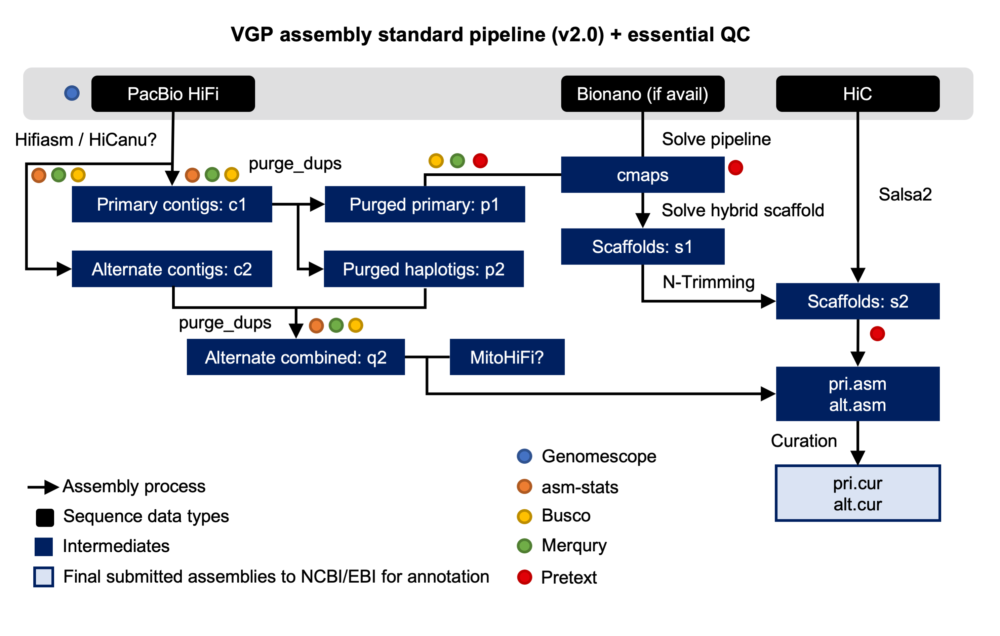

# Introduction
{:.no_toc}

Introductory content.

> ### Agenda
>
> In this tutorial, we will cover:
>
> 1. TOC
> {:toc}
>
{: .agenda}

# VGP assembly pipeline overview

This training is an adaptation of the VGP assembly pipeline 2.0 (fig. 1).



With the aim of making it easier to understand, the training has been organized into four main sections: genome profile analysis, HiFi phased assembly with hifiasm, post-assembly processing and hybrid scaffolding.    
    
# Get data

In order to reduce computation time, we will assemble samples from the yeast _Saccharomyces cerevisiae_ S288C, a widely used laboratory strain isolated in the 1950s by Robert Mortimer. Using _S. cerevisae_, one of the most intensively studied eukaryotic model organisms, has the additional advantage of allowing us to evaluate the final result of our assembly with great precision. For this tutorial, we generated a set of synthetic HiFi reads corresponding to a theoretical diploid genome.

The first step is to get the datasets from Zenodo. The VGP assembly pipeline uses data generated by a variety of technologies, including PacBio HiFi reads, Bionano optical maps, and Hi-C chromatin interaction maps.
    
> ###  Hands-on: Data upload
>
> 1. Create a new history for this tutorial
> 2. Import the files from [Zenodo]({{ page.zenodo_link }})
>
>    - Open the file  __upload__ menu
>    - Click on **Rule-based** tab
>    - *"Upload data as"*: `Datasets`
>    - Copy the tabular data, paste it into the textbox and press <kbd>Build</kbd>
>
>       ```
>   Hi-C_dataset_F   https://zenodo.org/record/5550653/files/SRR7126301_1.fastq.gz?download=1   fastqsanger.gz    Hi-C
>   Hi-C_dataset_R   https://zenodo.org/record/5550653/files/SRR7126301_2.fastq.gz?download=1   fastqsanger.gz    Hi-C
>   Bionano_dataset    https://zenodo.org/record/5550653/files/bionano.cmap?download=1   cmap    Bionano
>       ```
>
>    - From **Rules** menu select `Add / Modify Column Definitions`
>       - Click `Add Definition` button and select `Name`: column `A`
>       - Click `Add Definition` button and select `URL`: column `B`
>       - Click `Add Definition` button and select `Type`: column `C`
>       - Click `Add Definition` button and select `Name Tag`: column `D`
>    - Click `Apply` and press <kbd>Upload</kbd>
>   
> 3. Import the remaining datasets from [Zenodo]({{ page.zenodo_link }})
>
>    - Open the file  __upload__ menu
>    - Click on **Rule-based** tab
>    - *"Upload data as"*: `Collections`
>    - Copy the tabular data, paste it into the textbox and press <kbd>Build</kbd>
>
>       ```
>   dataset_01    https://zenodo.org/record/6098306/files/HiFi_synthetic_50x_01.fasta?download=1  fasta    HiFi  HiFi_collection
>   dataset_02    https://zenodo.org/record/6098306/files/HiFi_synthetic_50x_02.fasta?download=1  fasta    HiFi  HiFi_collection
>   dataset_03    https://zenodo.org/record/6098306/files/HiFi_synthetic_50x_03.fasta?download=1  fasta    HiFi  HiFi_collection
>       ```
>
>    - From **Rules** menu select `Add / Modify Column Definitions`
>       - Click `Add Definition` button and select `List Identifier(s)`: column `A`
>       - Click `Add Definition` button and select `URL`: column `B`
>       - Click `Add Definition` button and select `Type`: column `C`
>       - Click `Add Definition` button and select `Group Tag`: column `D`
>       - Click `Add Definition` button and select `Collection Name`: column `E`
>    - Click `Apply` and press <kbd>Upload</kbd>
>
{: .hands_on}


# Conclusion

Training conclusions.
        
{:.no_toc}
