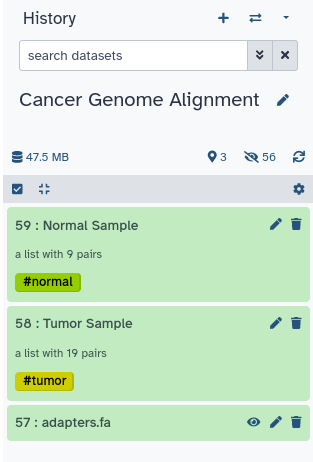

In this tutorial, we will present the main steps that are commonly used to process and to analyze cancer sequencing data. We will focus only on whole genome data and show tools that allow creating high quality alignment files usable for variant detection. This workshop will show you how to launch individual the first steps of a complete DNA-Seq SNV pipeline using to analyze cancer data


> <agenda-title></agenda-title>
>
> In this tutorial, we will cover:
>
> 1. TOC
> {:toc}
>
{: .agenda}


# Data Import

We will be working on a [CageKid](http://www.cng.fr/cagekid/) sample pair, patient `C0098`. The CageKid project is part of ICGC and is focused on renal cancer in many of it’s forms. The raw data can be found on EGA and calls, RNA and DNA, can be found on the [ICGC](https://dcc.icgc.org/) portal.

For practical reasons we sub-sampled the reads from the sample because running the whole dataset would take way too much time and resources.


> <question-title> Sequencing Data </question-title>
>
> 1. So you’ve just received an email saying that your data is ready for download from the sequencing center of your choice. **What should you do?**
>
> > <solution-title></solution-title>
> > 1. The first thing to do is to import the data. The second thing to do is to verify the quality of the data.
> {: .solution}
{: .question}


TODO: a CYOA step that uses the rule-based uploader?

> <hands-on-title>Obtaining our data</hands-on-title>
>
> 1. Make sure you have an empty analysis history. Give it a good name.
>
>    
>
> 2. **Import Sample Data**
>    - Import the sample FASTQ files to your history, either from a shared data library (if available on your Galaxy),
>      or from Zenodo using the URLs listed in the box below (click  to expand):
>
>      > <details-title>List of Zenodo URLs</details-title>
>      > ```
>      > {{page.zenodo_url}}/files/run62DPDAAXX_8-normal.64.pair1.fastq.gz
>      > {{page.zenodo_url}}/files/run62DPDAAXX_8-normal.64.pair2.fastq.gz
>      > {{page.zenodo_url}}/files/run62DU0AAXX_8-tumor.64.pair1.fastq.gz
>      > {{page.zenodo_url}}/files/run62DU0AAXX_8-tumor.64.pair2.fastq.gz
>      > {{page.zenodo_url}}/files/run62DU6AAXX_8-tumor.64.pair1.fastq.gz
>      > {{page.zenodo_url}}/files/run62DU6AAXX_8-tumor.64.pair2.fastq.gz
>      > {{page.zenodo_url}}/files/run62DUUAAXX_8-tumor.64.pair1.fastq.gz
>      > {{page.zenodo_url}}/files/run62DUUAAXX_8-tumor.64.pair2.fastq.gz
>      > {{page.zenodo_url}}/files/run62DUYAAXX_7-tumor.64.pair1.fastq.gz
>      > {{page.zenodo_url}}/files/run62DUYAAXX_7-tumor.64.pair2.fastq.gz
>      > {{page.zenodo_url}}/files/run62DVGAAXX_1-normal.64.pair1.fastq.gz
>      > {{page.zenodo_url}}/files/run62DVGAAXX_1-normal.64.pair2.fastq.gz
>      > {{page.zenodo_url}}/files/run62DVMAAXX_4-tumor.64.pair1.fastq.gz
>      > {{page.zenodo_url}}/files/run62DVMAAXX_4-tumor.64.pair2.fastq.gz
>      > {{page.zenodo_url}}/files/run62DVMAAXX_5-tumor.64.pair1.fastq.gz
>      > {{page.zenodo_url}}/files/run62DVMAAXX_5-tumor.64.pair2.fastq.gz
>      > {{page.zenodo_url}}/files/run62DVMAAXX_6-tumor.64.pair1.fastq.gz
>      > {{page.zenodo_url}}/files/run62DVMAAXX_6-tumor.64.pair2.fastq.gz
>      > {{page.zenodo_url}}/files/run62DVMAAXX_7-tumor.64.pair1.fastq.gz
>      > {{page.zenodo_url}}/files/run62DVMAAXX_7-tumor.64.pair2.fastq.gz
>      > {{page.zenodo_url}}/files/run62DVMAAXX_8-tumor.64.pair1.fastq.gz
>      > {{page.zenodo_url}}/files/run62DVMAAXX_8-tumor.64.pair2.fastq.gz
>      > {{page.zenodo_url}}/files/run62JREAAXX_3-tumor.64.pair1.fastq.gz
>      > {{page.zenodo_url}}/files/run62JREAAXX_3-tumor.64.pair2.fastq.gz
>      > {{page.zenodo_url}}/files/run62JREAAXX_4-tumor.64.pair1.fastq.gz
>      > {{page.zenodo_url}}/files/run62JREAAXX_4-tumor.64.pair2.fastq.gz
>      > {{page.zenodo_url}}/files/run62JREAAXX_5-tumor.64.pair1.fastq.gz
>      > {{page.zenodo_url}}/files/run62JREAAXX_5-tumor.64.pair2.fastq.gz
>      > {{page.zenodo_url}}/files/run62JREAAXX_6-tumor.64.pair1.fastq.gz
>      > {{page.zenodo_url}}/files/run62JREAAXX_6-tumor.64.pair2.fastq.gz
>      > {{page.zenodo_url}}/files/run62JREAAXX_7-tumor.64.pair1.fastq.gz
>      > {{page.zenodo_url}}/files/run62JREAAXX_7-tumor.64.pair2.fastq.gz
>      > {{page.zenodo_url}}/files/run62JREAAXX_8-tumor.64.pair1.fastq.gz
>      > {{page.zenodo_url}}/files/run62JREAAXX_8-tumor.64.pair2.fastq.gz
>      > {{page.zenodo_url}}/files/run62MK3AAXX_5-normal.64.pair1.fastq.gz
>      > {{page.zenodo_url}}/files/run62MK3AAXX_5-normal.64.pair2.fastq.gz
>      > {{page.zenodo_url}}/files/runA81DF6ABXX_1-normal.64.pair1.fastq.gz
>      > {{page.zenodo_url}}/files/runA81DF6ABXX_1-normal.64.pair2.fastq.gz
>      > {{page.zenodo_url}}/files/runA81DF6ABXX_2-normal.64.pair1.fastq.gz
>      > {{page.zenodo_url}}/files/runA81DF6ABXX_2-normal.64.pair2.fastq.gz
>      > {{page.zenodo_url}}/files/runAC0756ACXX_4-tumor.64.pair1.fastq.gz
>      > {{page.zenodo_url}}/files/runAC0756ACXX_4-tumor.64.pair2.fastq.gz
>      > {{page.zenodo_url}}/files/runAC0756ACXX_5-tumor.64.pair1.fastq.gz
>      > {{page.zenodo_url}}/files/runAC0756ACXX_5-tumor.64.pair2.fastq.gz
>      > {{page.zenodo_url}}/files/runAD08C1ACXX_1-tumor.64.pair1.fastq.gz
>      > {{page.zenodo_url}}/files/runAD08C1ACXX_1-tumor.64.pair2.fastq.gz
>      > {{page.zenodo_url}}/files/runBC04D4ACXX_2-normal.64.pair1.fastq.gz
>      > {{page.zenodo_url}}/files/runBC04D4ACXX_2-normal.64.pair2.fastq.gz
>      > {{page.zenodo_url}}/files/runBC04D4ACXX_3-normal.64.pair1.fastq.gz
>      > {{page.zenodo_url}}/files/runBC04D4ACXX_3-normal.64.pair2.fastq.gz
>      > {{page.zenodo_url}}/files/runBD06UFACXX_4-normal.64.pair1.fastq.gz
>      > {{page.zenodo_url}}/files/runBD06UFACXX_4-normal.64.pair2.fastq.gz
>      > {{page.zenodo_url}}/files/runBD06UFACXX_5-normal.64.pair1.fastq.gz
>      > {{page.zenodo_url}}/files/runBD06UFACXX_5-normal.64.pair2.fastq.gz
>      > {{page.zenodo_url}}/files/runBD08K8ACXX_1-tumor.64.pair1.fastq.gz
>      > {{page.zenodo_url}}/files/runBD08K8ACXX_1-tumor.64.pair2.fastq.gz
>      > ```
>      {: .details }
>
>      
>
>      
>
> 3. **Create adapters file** in the same way you uploaded the sample data, but pasting the following file contents instead of a URL.
>    - Name the file `adapters.fa`
>
>    ```
>    >PrefixTruseq/1
>    TACACTCTTTCCCTACACGACGCTCTTCCGATCT
>    >PrefixTruseq/2
>    GTGACTGGAGTTCAGACGTGTGCTCTTCCGATCT
>    ```
>
>    
>
>    > <question-title> </question-title>
>    >
>    > 1. Why are there two adapter sequences?
>    >
>    > > <solution-title></solution-title>
>    > > 1. Because both ends of the fragment don't have the same adapter.
>    > >
>    > {: .solution}
>    {: .question}
{: .hands_on}


Before we proceed, let's have a look at the data:


> <hands-on-title>Viewing our reads</hands-on-title>
>
> 1. **View**  one of the FASTQ files
>
>    
>
>    > <question-title> </question-title>
>    >
>    > 1. What did it look like?
>    >
>    > > <solution-title></solution-title>
>    > > 1. Each sequencing read is described in 4 lines:
>    > >
>    > > ```
>    > > Header 1
>    > > Sequence
>    > > Header 2
>    > > Quality Scores
>    > > ```
>    > {: .solution}
>    {: .question}
>
{: .hands_on}


## Understanding our data

Before we start, let's make sure we understand what all of these files are.

We have data from **2 samples**, a tumour sample, and a normal sample from the same patient (blood).

We performed **paired-end sequencing**, which means we will have 2 FASTQ files per sample, one with the forward reads, one with the reverse reads.

Depending on your sequencer or sequencing facility, you may receive more than these 2 FASTQ files per sample, namely 2 FASTQ files per sequencing *lane*.
These files are usuaally merged together during analysis. This is the case for our dataset as well.


These files were originally receive from the sequencing centre in a folder structure like below:

```
/home/experiment/raw_reads              # FASTQs from the sequencing center
├── normal                              # The blood sample directory
│   ├── run62DPDAAXX_8                  # Lane directory by run number.
│   │   ├── normal.64.pair1.fastq.gz    # Forward reads
│   │   └── normal.64.pair2.fastq.gz    # Reverse reads
│   ├── run62DVGAAXX_1
│   │   ├── normal.64.pair1.fastq.gz    # Forward reads
│   │   └── normal.64.pair2.fastq.gz    # Reverse reads
[..]
── tumor                                # The tumor sample directory
    ├── run62DU0AAXX_8                  # Lane directory by run number.
    │   ├── tumor.64.pair1.fastq.gz
    │   └── tumor.64.pair2.fastq.gz
    ├── run62DU6AAXX_8
    │   ├── tumor.64.pair1.fastq.gz
    │   └── tumor.64.pair2.fastq.gz
    ├── run62DUUAAXX_8
    │   ├── tumor.64.pair1.fastq.gz
    │   └── tumor.64.pair2.fastq.gz
[..]

```

If we upload all the files without renaming, the file names for each lane would be the same, and we would lose this lane information,
making it hard to know which files are a pair together. Therefore, we renamed the files to include the lane ID at the start of the file name
before uploading:

```
run62DPDAAXX_8-normal.64.pair1.fastq.gz
run62DPDAAXX_8-normal.64.pair2.fastq.gz
run62DU0AAXX_8-tumor.64.pair1.fastq.gz
run62DU0AAXX_8-tumor.64.pair2.fastq.gz
```

> <question-title> File Naming Scheme </question-title>
>
> Consider the file named `run62DPDAAXX_8-normal.64.pair1.fastq.gz`
>
> 1. Which lane did this file come from?
> 2. Which sample did this file come from (tumor or blood)?
> 3. Does this  file contain forward or reverse reads?
> 3. What is the name of the other file in this pair?
>
> > <solution-title></solution-title>
> > 1. The lane identifier is `run62DPDAAXX_8`
> > 2. This is a normal (blood) sample, we know because it has `normal` in the file name (not `tumor`)
> > 3. These are the forward reads (`pair1` in file name)
> > 4. Two files in a pair always have identical names, except for the `pair1` or `pair2` part.
> >    The other file in this pair will be named `run62DPDAAXX_8-normal.64.pair2.fastq.gz` and
> >    contain the reverse reads.
> >
> >    Note: you might also encounter other naming conventions such as `_R1` and `_R2`
> >    or `_1` and `_2` to indicate forward and reverse pairs.
> {: .solution}
{: .question}


## Organizing our data

To make our life easier in Galaxy, we will first organize our files into *dataset collections*.
These collections will let us perform analysis on all the files in the collections at once.

### Creating Dataset Collections

> <hands-on-title>Organizing our data into paired collections</hands-on-title>
>
> 1. Filter your history on the word *"tumor"* using the search bar at the top of the history panel
>
> 2. Click on the **checkmark icon**   at top of your history.
>
> 3. Select all the tumor FASTQ files (38 files in total)
>    - Click on **Select All** at the top of your history
>
> 4. Build a paired collection
>    - Click on **All 38 selected** at the top of your history
>    - Select **Build List of Dataset Pairs** from the dropdown menu
>
>    In the next dialog window you can create the list of pairs. By default Galaxy will look for pairs
>    of files that differ only by a `_1` and `_2` part in their names. In our case however, these
>    should be `pair1` and `pair2`.
>
> 4. Change **_1** to **pair1** in the top left text box. Do the same for the other side
>    - You should see suggested pairing in the center
>
> 5. Click on **Auto-pair** to create the suggested pairs.
>    - or you can click on "Pair these datasets" manually for all the pairs that look valid
>
>    You should now see the list of pairs that will be by Galaxy:
>    
>
> 6. **Name the pairs**
>    - The middle segment is the name for each pair.
>    - You can edit these names by clicking on them if you ever need to, but we will keep the automatic names
>
> 7. **Name your collection** at the bottom right of the screen
>    - Name your collection **Tumor Samples**
>
> 8. Click the **Create Collection** button.
>    - A new dataset collection item will now appear in your history
>
>    
>
> 9. Show your full history again by clicking on the **"x"** icon in the search bar at the top of your history to clear your filter
>    - You should see the tumor files have been moved to the new tumor collection, and the normal FASTQ files still separately. We will pair these next.
{: .hands_on}

Have a look at the collection in your history

> <question-title> </question-title>
>
> 1. How many pairs are in your `Tumor Samples` collection?
> 2. How many files?
>
> > <solution-title></solution-title>
> > 1. You should have a collection containing 19 pairs
> > 2. Each pair consists of a FASTQ file with forward reads, and a FASTQ file with reverse reads, so 38 files in total
> {: .solution}
{: .question}

Now we repeat the process for the normal files:

> <hands-on-title>Creating a paired collection for the normal samples</hands-on-title>
>
> 1. Repeat the steps from the previous hands-on box, but for the normal samples
>    - name your collection **Normal Samples**
>
>    > <question-title> </question-title>
>    >
>    > 1. How many pairs are in your normal collection?
>    > 2. How many files?
>    >
>    > > <solution-title></solution-title>
>    > > 1. You should have a collection containing 9 pairs
>    > > 2. Each pair consists of a FASTQ file with forward reads, and a FASTQ file with reverse reads, so 18 files in total
>    > {: .solution}
>    {: .question}
>
{: .hands_on}


### Tagging our data

Another thing we can do in Galaxy to simplify working with large datasets, is adding tags to our data.
Tags starting with a hash symbol (`#`) will propagate, meaning they will also be added to any outputs
of tools derived from this input data.


> <hands-on-title>Tag our collections</hands-on-title>
>
> 1. Add the tag `#normal` to the  *"Normal Samples"* collection in your history
>
>    
>
> 2. Add a tag `#tumor` to the tumor collection in the same way
>
{: .hands_on}


If you did everything correctly, your history should contain the following three items
- Tumor Samples collection (19 pairs)
- Normal Samples collection (9 pairs)
- `adapters.fa` file




## A first glance at the data

Let's have a closer look at one of the pairs

> <hands-on-title></hands-on-title>
>
> 1. Enable the Window Manager  via the top menu bar of Galaxy
>    - This will allow you to view multiple files side-by-side
>
> 2. View  both files the first pair in your normal collection
>    - Pair with name `run62DPDAAXX_8-normal.64.fastq`
>    - Click on the eye icon for both the forward and reverse file of this pair
>    - Two windows will pop up on top of Galaxy. Move these around so that you can view the two files
>      side-by-side
>
>    > <question-title> Read IDs </question-title>
>    >
>    > 1. Look at the first line of each read (header line) in both files, what do you notice?
>    > 2. How many reads are there in the forward file? how many in the reverse?
>    >
>    > > <solution-title></solution-title>
>    > > 1. The headers (read IDs) of each read are identical in the forward and reverse files, except for a `/1` and `/2` at the end.
>    > > 2. Expanding the datasets in Galaxy shows you the number of sequences in the file. Both files have 3045 sequences
>    > >
>    > >    Tools can use the read IDs to know which reads in the two files form a pair. Beware that not all tools actually use this header information, many tools blindly assume that the first read in your forward file corresponds to the first read in your reverse files. Therefore you should always be careful when filtering your FASTQ file; make sure to always filter both files of a pair at once, so that when tools discard one read in a pair for e.g. bad quality, they can remove the corresponding read in the other file of the pair as well. Otherwise a mismatch in read pairs may occur, leading to bad results.
>    > {: .solution}
>    {: .question}
>
> 3. Close the windows and disable the Window Manager  by clicking on the icon again.
>
{: .hands_on}


# Quality Control

The first step in every analysis should be quality control. For more detailed information on the topic of quality control, please see our [dedicated QC training materials]().

## Phred Scores

The quality score for each sequence is a string of characters, one for each base of the nucleic sequence, used to characterize the probability of mis-identification of each base. The score is encoded using the ASCII character table (with [some historical differences](https://en.wikipedia.org/wiki/FASTQ_format#Encoding)):


So there is an ASCII character associated with each nucleotide, representing its [Phred quality score](https://en.wikipedia.org/wiki/Phred_quality_score), the probability of an incorrect base call:

Phred Quality Score | Probability of incorrect base call | Base call accuracy
--- | --- | ---
10 | 1 in 10 | 90%
20 | 1 in 100 | 99%
30 | 1 in 1000 | 99.9%
40 | 1 in 10,000 | 99.99%
50 | 1 in 100,000 | 99.999%
60 | 1 in 1,000,000 | 99.9999%


## Assess Quality of Reads

To assess the quality of our reads, we use a tool called [FASTQC](https://www.bioinformatics.babraham.ac.uk/projects/fastqc/).


> <hands-on-title></hands-on-title>
>
> 1. {% tool [FASTQC](toolshed.g2.bx.psu.edu%2Frepos%2Fdevteam%2Ffastqc%2Ffastqc%2F0.73%2Bgalaxy0&version=0.73 galaxy0) %} with the following parameters
>    -  *"Raw read data from your current history"*: `Normal Samples`
>    -  *"Adapter list"*: `adapters`
>
> 2. View  the HTML output of FASTQC for one of the files
{: .hands_on}

TODO: set both collections to fastqsanger


# Alignment

BWA Mem -- remember to set read groups


--------------------

> <hands-on-title></hands-on-title>
>
> -   with the following parameters
>   -  *"parameter name"*: `parameter value`
>
{: .hands_on}

> <question-title> </question-title>
>
> > <solution-title></solution-title>
> >
> {: .solution}
{: .question}


