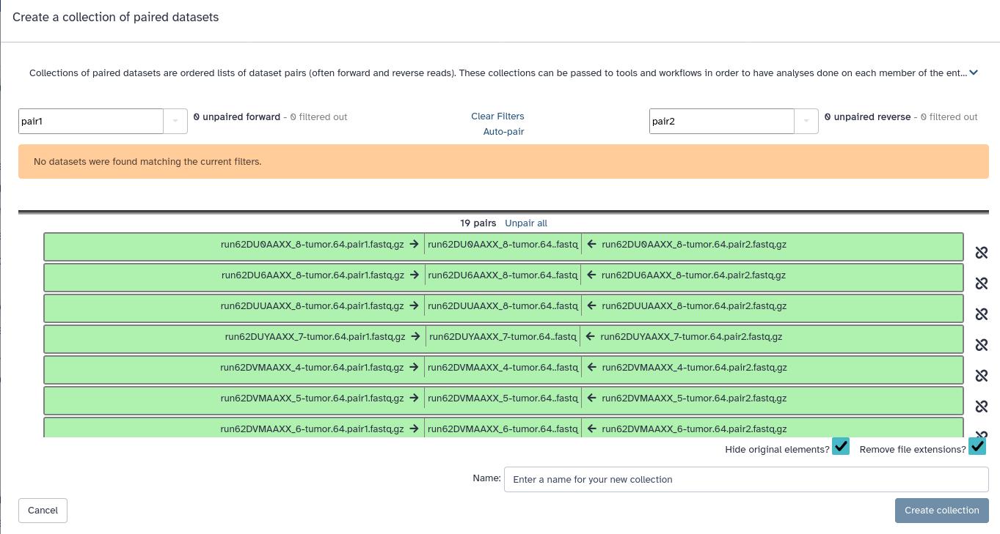

In this tutorial, we will present the main steps that are commonly used to process and to analyze cancer sequencing data. We will focus only on whole genome data and show tools that allow creating high quality alignment files usable for variant detection. This workshop will show you how to launch individual the first steps of a complete DNA-Seq SNV pipeline using to analyze cancer data


> <agenda-title></agenda-title>
>
> In this tutorial, we will cover:
>
> 1. TOC
> {:toc}
>
{: .agenda}


# Data Import

We will be working on a [CageKid](http://www.cng.fr/cagekid/) sample pair, patient `C0098`. The CageKid project is part of ICGC and is focused on renal cancer in many of it’s forms. The raw data can be found on EGA and calls, RNA and DNA, can be found on the [ICGC](https://dcc.icgc.org/) portal.

For practical reasons we sub-sampled the reads from the sample because running the whole dataset would take way too much time and resources.


> <question-title> Sequencing Data </question-title>
>
> 1. So you’ve just received an email saying that your data is ready for download from the sequencing center of your choice. **What should you do?**
>
> > <solution-title></solution-title>
> > 1. The first thing to do is to import the data. The second thing to do is to verify the quality of the data.
> {: .solution}
{: .question}


TODO: a CYOA step that uses the rule-based uploader?

> <hands-on-title>Obtaining our data</hands-on-title>
>
> 1. Make sure you have an empty analysis history. Give it a good name.
>
>    
>
> 2. **Import Sample Data**
>    - Import the sample FASTQ files to your history, either from a shared data library (if available on your Galaxy),
>      or from Zenodo using the URLs listed in the box below (click  to expand):
>
>      > <details-title>List of Zenodo URLs</details-title>
>      > ```
>      > {{page.zenodo_url}}/files/run62DPDAAXX_8-normal.64.pair1.fastq.gz
>      > {{page.zenodo_url}}/files/run62DPDAAXX_8-normal.64.pair2.fastq.gz
>      > {{page.zenodo_url}}/files/run62DU0AAXX_8-tumor.64.pair1.fastq.gz
>      > {{page.zenodo_url}}/files/run62DU0AAXX_8-tumor.64.pair2.fastq.gz
>      > {{page.zenodo_url}}/files/run62DU6AAXX_8-tumor.64.pair1.fastq.gz
>      > {{page.zenodo_url}}/files/run62DU6AAXX_8-tumor.64.pair2.fastq.gz
>      > {{page.zenodo_url}}/files/run62DUUAAXX_8-tumor.64.pair1.fastq.gz
>      > {{page.zenodo_url}}/files/run62DUUAAXX_8-tumor.64.pair2.fastq.gz
>      > {{page.zenodo_url}}/files/run62DUYAAXX_7-tumor.64.pair1.fastq.gz
>      > {{page.zenodo_url}}/files/run62DUYAAXX_7-tumor.64.pair2.fastq.gz
>      > {{page.zenodo_url}}/files/run62DVGAAXX_1-normal.64.pair1.fastq.gz
>      > {{page.zenodo_url}}/files/run62DVGAAXX_1-normal.64.pair2.fastq.gz
>      > {{page.zenodo_url}}/files/run62DVMAAXX_4-tumor.64.pair1.fastq.gz
>      > {{page.zenodo_url}}/files/run62DVMAAXX_4-tumor.64.pair2.fastq.gz
>      > {{page.zenodo_url}}/files/run62DVMAAXX_5-tumor.64.pair1.fastq.gz
>      > {{page.zenodo_url}}/files/run62DVMAAXX_5-tumor.64.pair2.fastq.gz
>      > {{page.zenodo_url}}/files/run62DVMAAXX_6-tumor.64.pair1.fastq.gz
>      > {{page.zenodo_url}}/files/run62DVMAAXX_6-tumor.64.pair2.fastq.gz
>      > {{page.zenodo_url}}/files/run62DVMAAXX_7-tumor.64.pair1.fastq.gz
>      > {{page.zenodo_url}}/files/run62DVMAAXX_7-tumor.64.pair2.fastq.gz
>      > {{page.zenodo_url}}/files/run62DVMAAXX_8-tumor.64.pair1.fastq.gz
>      > {{page.zenodo_url}}/files/run62DVMAAXX_8-tumor.64.pair2.fastq.gz
>      > {{page.zenodo_url}}/files/run62JREAAXX_3-tumor.64.pair1.fastq.gz
>      > {{page.zenodo_url}}/files/run62JREAAXX_3-tumor.64.pair2.fastq.gz
>      > {{page.zenodo_url}}/files/run62JREAAXX_4-tumor.64.pair1.fastq.gz
>      > {{page.zenodo_url}}/files/run62JREAAXX_4-tumor.64.pair2.fastq.gz
>      > {{page.zenodo_url}}/files/run62JREAAXX_5-tumor.64.pair1.fastq.gz
>      > {{page.zenodo_url}}/files/run62JREAAXX_5-tumor.64.pair2.fastq.gz
>      > {{page.zenodo_url}}/files/run62JREAAXX_6-tumor.64.pair1.fastq.gz
>      > {{page.zenodo_url}}/files/run62JREAAXX_6-tumor.64.pair2.fastq.gz
>      > {{page.zenodo_url}}/files/run62JREAAXX_7-tumor.64.pair1.fastq.gz
>      > {{page.zenodo_url}}/files/run62JREAAXX_7-tumor.64.pair2.fastq.gz
>      > {{page.zenodo_url}}/files/run62JREAAXX_8-tumor.64.pair1.fastq.gz
>      > {{page.zenodo_url}}/files/run62JREAAXX_8-tumor.64.pair2.fastq.gz
>      > {{page.zenodo_url}}/files/run62MK3AAXX_5-normal.64.pair1.fastq.gz
>      > {{page.zenodo_url}}/files/run62MK3AAXX_5-normal.64.pair2.fastq.gz
>      > {{page.zenodo_url}}/files/runA81DF6ABXX_1-normal.64.pair1.fastq.gz
>      > {{page.zenodo_url}}/files/runA81DF6ABXX_1-normal.64.pair2.fastq.gz
>      > {{page.zenodo_url}}/files/runA81DF6ABXX_2-normal.64.pair1.fastq.gz
>      > {{page.zenodo_url}}/files/runA81DF6ABXX_2-normal.64.pair2.fastq.gz
>      > {{page.zenodo_url}}/files/runAC0756ACXX_4-tumor.64.pair1.fastq.gz
>      > {{page.zenodo_url}}/files/runAC0756ACXX_4-tumor.64.pair2.fastq.gz
>      > {{page.zenodo_url}}/files/runAC0756ACXX_5-tumor.64.pair1.fastq.gz
>      > {{page.zenodo_url}}/files/runAC0756ACXX_5-tumor.64.pair2.fastq.gz
>      > {{page.zenodo_url}}/files/runAD08C1ACXX_1-tumor.64.pair1.fastq.gz
>      > {{page.zenodo_url}}/files/runAD08C1ACXX_1-tumor.64.pair2.fastq.gz
>      > {{page.zenodo_url}}/files/runBC04D4ACXX_2-normal.64.pair1.fastq.gz
>      > {{page.zenodo_url}}/files/runBC04D4ACXX_2-normal.64.pair2.fastq.gz
>      > {{page.zenodo_url}}/files/runBC04D4ACXX_3-normal.64.pair1.fastq.gz
>      > {{page.zenodo_url}}/files/runBC04D4ACXX_3-normal.64.pair2.fastq.gz
>      > {{page.zenodo_url}}/files/runBD06UFACXX_4-normal.64.pair1.fastq.gz
>      > {{page.zenodo_url}}/files/runBD06UFACXX_4-normal.64.pair2.fastq.gz
>      > {{page.zenodo_url}}/files/runBD06UFACXX_5-normal.64.pair1.fastq.gz
>      > {{page.zenodo_url}}/files/runBD06UFACXX_5-normal.64.pair2.fastq.gz
>      > {{page.zenodo_url}}/files/runBD08K8ACXX_1-tumor.64.pair1.fastq.gz
>      > {{page.zenodo_url}}/files/runBD08K8ACXX_1-tumor.64.pair2.fastq.gz
>      > ```
>      {: .details }
>
>      
>
>      
>
> 3. **Create adapters file** in the same way you uploaded the sample data, but pasting the following file contents instead of a URL.
>    - Name the file `adapters.fa`
>
>    ```
>    >PrefixTruseq/1
>    TACACTCTTTCCCTACACGACGCTCTTCCGATCT
>    >PrefixTruseq/2
>    GTGACTGGAGTTCAGACGTGTGCTCTTCCGATCT
>    ```
>
>    
>
>    > <question-title> Sequence Adapters </question-title>
>    >
>    > 1. Why are there two adapter sequences?
>    >
>    > > <solution-title></solution-title>
>    > > 1. Because both ends of the fragment don't have the same adapter.
>    > >
>    > {: .solution}
>    {: .question}
{: .hands_on}


Before we proceed, let's have a look at the data:


> <hands-on-title>Viewing our reads</hands-on-title>
>
> 1. **View**  one of the FASTQ files
>
>    
>
>    > <question-title> </question-title>
>    >
>    > 1. What did it look like?
>    >
>    > > <solution-title></solution-title>
>    > > 1. Each sequencing read is described in 4 lines:
>    > >
>    > > ```
>    > > Header 1
>    > > Sequence
>    > > Header 2
>    > > Quality Scores
>    > > ```
>    > {: .solution}
>    {: .question}
>
{: .hands_on}


## Understanding our data

Before we start, let's make sure we understand what all of these files are.

We have data from **2 samples**, a tumour sample, and a normal sample from the same patient (blood).

We performed **paired-end sequencing**, which means we will have 2 FASTQ files per sample, one with the forward reads, one with the reverse reads.

Depending on your sequencer or sequencing facility, you may receive more than these 2 FASTQ files per sample, namely 2 FASTQ files per sequencing *lane*.
These files are usuaally merged together during analysis. This is the case for our dataset as well.


These files were originally receive from the sequencing centre in a folder structure like below:

```
/home/experiment/raw_reads              # FASTQs from the sequencing center
├── normal                              # The blood sample directory
│   ├── run62DPDAAXX_8                  # Lane directory by run number.
│   │   ├── normal.64.pair1.fastq.gz    # Forward reads
│   │   └── normal.64.pair2.fastq.gz    # Reverse reads
│   ├── run62DVGAAXX_1
│   │   ├── normal.64.pair1.fastq.gz    # Forward reads
│   │   └── normal.64.pair2.fastq.gz    # Reverse reads
[..]
── tumor                                # The tumor sample directory
    ├── run62DU0AAXX_8                  # Lane directory by run number.
    │   ├── tumor.64.pair1.fastq.gz
    │   └── tumor.64.pair2.fastq.gz
    ├── run62DU6AAXX_8
    │   ├── tumor.64.pair1.fastq.gz
    │   └── tumor.64.pair2.fastq.gz
    ├── run62DUUAAXX_8
    │   ├── tumor.64.pair1.fastq.gz
    │   └── tumor.64.pair2.fastq.gz
[..]

```

If we upload all the files without renaming, the file names for each lane would be the same, and we would lose this lane information,
making it hard to know which files are a pair together. Therefore, we renamed the files to include the lane ID at the start of the file name
before uploading:

```
run62DPDAAXX_8-normal.64.pair1.fastq.gz
run62DPDAAXX_8-normal.64.pair2.fastq.gz
run62DU0AAXX_8-tumor.64.pair1.fastq.gz
run62DU0AAXX_8-tumor.64.pair2.fastq.gz
```

> <question-title> File Naming Scheme </question-title>
>
> Consider the file named `run62DPDAAXX_8-normal.64.pair1.fastq.gz`
>
> 1. Which lane did this file come from?
> 2. Which sample did this file come from (tumor or blood)?
> 3. Does this  file contain forward or reverse reads?
> 3. What is the name of the other file in this pair?
>
> > <solution-title></solution-title>
> > 1. The lane identifier is `run62DPDAAXX_8`
> > 2. This is a normal (blood) sample, we know because it has `normal` in the file name (not `tumor`)
> > 3. These are the forward reads (`pair1` in file name)
> > 4. Two files in a pair always have identical names, except for the `pair1` or `pair2` part.
> >    The other file in this pair will be named `run62DPDAAXX_8-normal.64.pair2.fastq.gz` and
> >    contain the reverse reads.
> >
> >    Note: you might also encounter other naming conventions such as `_R1` and `_R2`
> >    or `_1` and `_2` to indicate forward and reverse pairs.
> {: .solution}
{: .question}


## Organizing our data

To make our life easier in Galaxy, we will first organize our files into *dataset collections*.
These collections will let us perform analysis on all the files in the collections at once.

### Creating Dataset Collections

> <hands-on-title>Organizing our data into paired collections</hands-on-title>
>
> 1. Filter your history on the word *"tumor"* using the search bar at the top of the history panel
>
> 2. Click on the **checkmark icon**   at top of your history.
>
> 3. Select all the tumor FASTQ files (38 files in total)
>    - Click on **Select All** at the top of your history
>
> 4. Build a paired collection
>    - Click on **All 38 selected** at the top of your history
>    - Select **Build List of Dataset Pairs** from the dropdown menu
>
> 5. Change the default pairing indicator from **_1** to **pair1** in the top left text box. Do the same for the other side
>    - You should see suggested pairing in the center
>
> 6. Click on **Auto-pair** to create the suggested pairs.
>    - or you can click on "Pair these datasets" manually for all the pairs that look valid
>
>    You should now see the list of pairs that will be by Galaxy:
>    
>
> 7. **Name the pairs**
>    - The middle segment is the name for each pair.
>    - You can edit these names by clicking on them if you ever need to, but we will keep the automatic names
>
> 8. **Name your collection** at the bottom right of the screen
>    - Name your collection **Tumor Samples**
>
> 9. Click the **Create Collection** button.
>    - A new dataset collection item will now appear in your history
>
>    
>
> 10. Show your full history again by clicking on the **"x"** icon in the search bar at the top of your history to clear your filter
>    - You should see the tumor files have been moved to the new tumor collection, and the normal FASTQ files still separately. We will pair these next.
>
{: .hands_on}

Have a look at the collection in your history


AGATCGGAAGAGC


> <question-title> </question-title>
>
> 1. How many pairs are in your `Tumor Samples` collection?
> 2. How many files?
>
> > <solution-title></solution-title>
> > 1. You should have a collection containing 19 pairs
> > 2. Each pair consists of a FASTQ file with forward reads, and a FASTQ file with reverse reads, so 38 files in total
> {: .solution}
{: .question}

Now we repeat the process for the tumour files:

> <hands-on-title>Creating a paired collection for the nomal samples</hands-on-title>
>
> 1. Repeat the steps from the previous hands-on box, but for the normal samples
>    - name your collection **Normal Samples**
>
>    > <question-title> Auto-suggested pairs</question-title>
>    >
>    > 1. For this collection, Galaxy will auto-sugges 2 pairs. Are these correct? Why (not)?
>    >
>    >    
>    >
>    > > <solution-title></solution-title>
>    > > 1. These are INCORRECT PAIRS. Looking closely, you can see it matched the forward reads (`pair1` of sample `runA81DF6ABXX_1` with the forward reads of `runA81DF6ABXX_2`).
>    > >    This is because the run names contained `_1` and `_2` but these are not pairing indicators. Howver, many sequencing files use these as pairing indicators and it is
>    > >    what Galaxy searches for by default. We must **UNPAIR** these before proceeding.
>    > >
>    > {: .solution}
>    {: .question}
>
>    - **Important!** Unpair the suggested pairs by clicking on **Unpair All** in the bottom half of the box before you create the pairs.
>
>    > <question-title> </question-title>
>    >
>    > 1. How many pairs are in your normal collection?
>    > 2. How many files?
>    >
>    > > <solution-title></solution-title>
>    > > 1. You should have a collection containing 9 pairs
>    > > 2. Each pair consists of a FASTQ file with forward reads, and a FASTQ file with reverse reads, so 18 files in total
>    > {: .solution}
>    {: .question}
>
{: .hands_on}


### Tagging our data

Another thing we can do in Galaxy to simplify working with large datasets, is adding tags to our data.
Tags starting with a hash symbol (`#`) will propagate, meaning they will also be added to any outputs
of tools derived from this input data.


> <hands-on-title>Tag our collections</hands-on-title>
>
> 1. Add the tag `#normal` to the  *"Normal Samples"* collection in your history
>
>    
>
> 2. Add a tag `#tumor` to the tumor collection in the same way
>
{: .hands_on}


If you did everything correctly, your history should contain the following three items
- Tumor Samples collection (19 pairs)
- Normal Samples collection (9 pairs)
- `adapters.fa` file


## A first glance at the data

Let's have a closer look at one of the pairs

> <hands-on-title></hands-on-title>
>
> 1. Enable the Window Manager  via the top menu bar of Galaxy
>    - This will allow you to view multiple files side-by-side
>
> 2. View  both files the first pair in your normal collection
>    - Pair with name `run62DPDAAXX_8-normal.64.fastq`
>    - Click on the eye icon for both the forward and reverse file of this pair
>    - Two windows will pop up on top of Galaxy. Move these around so that you can view the two files
>      side-by-side
>
>    > <question-title> Read IDs </question-title>
>    >
>    > 1. Look at the first line of each read (header line) in both files, what do you notice?
>    > 2. How many reads are there in the forward file? how many in the reverse?
>    >
>    > > <solution-title></solution-title>
>    > > 1. The headers (read IDs) of each read are identical in the forward and reverse files, except for a `/1` and `/2` at the end.
>    > > 2. Expanding the datasets in Galaxy shows you the number of sequences in the file. Both files have 3045 sequences
>    > >
>    > >    Tools can use the read IDs to know which reads in the two files form a pair. Beware that not all tools actually use this header information, many tools blindly assume that the first read in your forward file corresponds to the first read in your reverse files. Therefore you should always be careful when filtering your FASTQ file; make sure to always filter both files of a pair at once, so that when tools discard one read in a pair for e.g. bad quality, they can remove the corresponding read in the other file of the pair as well. Otherwise a mismatch in read pairs may occur, leading to bad results.
>    > {: .solution}
>    {: .question}
>
> 3. Close the windows and disable the Window Manager  by clicking on the icon again.
>
{: .hands_on}


# Quality Control

The first step in every analysis should be quality control. For more detailed information on the topic of quality control, please see our [dedicated QC training materials]().

## Phred Scores

The quality score for each sequence is a string of characters, one for each base of the nucleic sequence, used to characterize the probability of mis-identification of each base. The score is encoded using the ASCII character table (with [some historical differences](https://en.wikipedia.org/wiki/FASTQ_format#Encoding)):


So there is an ASCII character associated with each nucleotide, representing its [Phred quality score](https://en.wikipedia.org/wiki/Phred_quality_score), the probability of an incorrect base call:

Phred Quality Score | Probability of incorrect base call | Base call accuracy
--- | --- | ---
10 | 1 in 10 | 90%
20 | 1 in 100 | 99%
30 | 1 in 1000 | 99.9%
40 | 1 in 10,000 | 99.99%
50 | 1 in 100,000 | 99.999%
60 | 1 in 1,000,000 | 99.9999%


## Assess Quality of Reads

To assess the quality of our reads, we use a tool called [FASTQC](https://www.bioinformatics.babraham.ac.uk/projects/fastqc/).


> <hands-on-title></hands-on-title>
>
> 1. {% tool [FASTQC](toolshed.g2.bx.psu.edu%2Frepos%2Fdevteam%2Ffastqc%2Ffastqc%2F0.73%2Bgalaxy0&version=0.73 galaxy0) %} with the following parameters
>    -  *"Raw read data from your current history"*: `Normal Samples`
>    -  *"Adapter list"*: `adapters.fa (as collection)`
>
> 2. View  the HTML output of FASTQC for one of the files
>
>
>    > <question-title> </question-title>
>    >
>    > 1. What stands out in the graphs?
>    >
>    > > <solution-title></solution-title>
>    > >
>    > > 1. Of the raw data we see that:
>    > >    - Some reads have bad 3' ends.
>    > >      <!-- - Some reads have adapter sequences in them.  TODO: not detecting adapters, check data or remove mention? -->
>    > >
>    > >      
>    > >
>    > >    - We didn't have many adapter sequences in our data (yay!)
>    > >    - We can also notice that the sequence content is 25% for each base type. Which is not what we expect for WGS data (GC content at 40%).
>    > >      In our case this normal because the selected region is in a coding region which are expected to be at 50%.
>    > >      
>    > >
>    > {: .solution}
>    {: .question}
{: .hands_on}


## Quality encoding

> <question-title> Quality Encoding </question-title>
>
> We saw that there are different encoding schemes possible for the FASTQ format.
>
> 1. Which encoding do we use in our data? (Hint: check FASTQC HTML output)
> 2. How does FASTQC know this?
> 3. How reliable is this?
> 4. Why is it important to know the encoding scheme used in your data?
>
> > <solution-title></solution-title>
> >
> > 1. Our data uses Illumina 1.5 quality encoding (you can see the encoding in the table at the top of FASTQC's HTML output)
> > 2. Recall the image indicating the encoding scheme:
> >    
> >    Some characters are unique to one encoding scheme, and others can be used to rule out certain encoding schemes.
> >    For example, if a quality score of `~` appears in your dataset, it must be PacBio. If a quality score of `+` appears, you know it cannot be
> >    Solexa, Illumina 1.3 or Illumina 1.5. This is the method FASTQC uses to guess your encoding scheme. But this is not always possible (for example, theoretically,
> >    if all your quality scores are `I`, we cannot know which encoding scheme was used). The more reads you have in your file, the more likely it is we can determine
> >    the quality encoding in this manner.
> > 3. It is *always* better to check with your sequencing facility which encoding is used. In Galaxy we can set the encoding scheme on our dataset
> >    so that this information is passed on to tools that need it. If you really do not know the encoding for your data, you can use the value determined by FASTQC.
> > 4. Setting the wrong encoding scheme can lead to bad calls being treated as high quality calls and vice versa, and this can severely impact your results,
> >    so always make sure it is set correctly.  In practice, for new datasets, the encoding scheme for short reads will almost always be Sanger, but if you are working with older data, be careful to check this!
> {: .solution}
{: .question}

In Galaxy we can set the FASTQ encoding scheme as metadata on our dataset, Galaxy will then pass this information on to any tools that need it. This protects you from mistakes in downstream analysis, so let's do it now:

> <hands-on-title></hands-on-title>
>
> - Set the datatype of your `Normal Samples` collection to `fastqillumina.gz`
>
>   
>
> - Do the same for your `Tumor Samples` collection
>
{: .hands_on}

Subsequent tools that use the quality scores, for example the trimming and alignments steps, will know the encoding scheme of our data, so we don't have to tell them again,
and can't accidentally provide the wrong value.


# Data Trimming & Cleaning

Since adapter are not part of the genome they should be removed. We can also perform several other data cleaning steps at this stage,
such as removal of low-quality reads, trimming of the low-quality bases at the end of reads, etc. To do that we will a tool called
**Trim Galore!** .

Because Trim Galore expects FASTQ files with the Sanger quality encoding, we will first convert our quality scores
from Illumina1.5 (Phred+64) to Sanger (Phred+33). We do this with a tool call **FastQ Groomer** 

<!-- NOTE: using trim galore rather than trimmomatic as in original tutorial due to technical reasons
(adapters not detected, problems autodetecting quality score and tool not picking up encoding setting) -->


> <hands-on-title> Data Trimming </hands-on-title>
>
> 1. {% tool [FASTQ Groomer](toolshed.g2.bx.psu.edu%2Frepos%2Fdevteam%2Ffastq_groomer%2Ffastq_groomer%2F1.1.5&version=1.1.5) %} with the following paramters
>    - *"File to groom "*: `Normal Collection`
>    - *"Input FASTQ quality scores type"*: `Illumina 1.3-1.7`
>
> 2. Repeat **FASTQ Groomer**  for the Tumor collection
>
> 3. {% tool [Trim Galore!](toolshed.g2.bx.psu.edu%2Frepos%2Fbgruening%2Ftrim_galore%2Ftrim_galore%2F0.6.7%2Bgalaxy0&version=0.6.7 galaxy0) %} with the following parameters
>    -  *"Is this library paired- or single-end?"*: `Paired Collection`
>    -  *"Select a paired collection"*: `Normal Samples`
>    -  *"Adapter sequence to be trimmed"*: `User define adapter sequence`
>      -  *"Adapter sequence to be trimmed off"*: `TACACTCTTTCCCTACACGACGCTCTTCCGATCT`
>      -  *"Adapter sequence to be trimmed off read 2"*: `GTGACTGGAGTTCAGACGTGTGCTCTTCCGATCT`
>    -  *"Advanced settings"*: `Full parameter list`
>      -  *"Trim low-quality ends from reads in addition to adapter removal (Enter phred quality score threshold)"*: `30`
>      -  *"Overlap with adapter sequence required to trim a sequence"*: `5`
>      -  *"Discard reads that became shorter than length N"*: `50`
>      -  *"Generate a report file?"*: `Yes`
>
> 4. Repeat Trim Galore step for the Tumor collection
>
> 4. View  one of the **report** output files.
>
>  > <question-title> Trimmed Data </question-title>
>  >
>  > 1. How many reads had adapters?
>  > 2. How many bases were quality trimmed?
>  > 3. How many reads were trimmed because the were too short after trimming?
>  >
>  > > <solution-title></solution-title>
>  > > Opening the report file, you will see a summary section like this:
>  > >
>  > > ```
>  > > === Summary ===
>  > >
>  > > Total reads processed:                   4,003
>  > > Reads with adapters:                         1 (0.0%)
>  > > Reads written (passing filters):         4,003 (100.0%)
>  > >
>  > > Total basepairs processed:       402,980 bp
>  > > Quality-trimmed:                  27,473 bp (6.8%)
>  > > Total written (filtered):        375,502 bp (93.2%)
>  > >
>  > > ```
>  > > In this example output, one read was found to have an adapter, and 6.8% of bases were trimmed due to quality.
>  > > None of this trimming caused any of the reads to become shorter than 50bp, becase all of the 4003 reads were
>  > > written to the output file.
>  > >
>  > {: .solution}
>  {: .question}
{: .hands_on}

Note that if you do not know which adapter sequences were used to sequence your data, many tools including Trim Galore!
and FastQC will search for adapters of some of the most popular sequencing platforms. However, if you know your adapters,
it is always best to provide them to these tools.

After all this trimming let's see if it made a noticable difference in our quality, by running **FastQC**  again


> <hands-on-title> Assess quality of reads after trimming </hands-on-title>
>
> 1. {% tool [FASTQC](toolshed.g2.bx.psu.edu%2Frepos%2Fdevteam%2Ffastqc%2Ffastqc%2F0.73%2Bgalaxy0&version=0.73 galaxy0) %} with the following parameters
>    -  *"Raw read data from your current history"*: output from **Trim Galaore** on the normal dataset
>
> 2. Enable the **Galaxy Window Manager**  on the top bar
>    - View  one of the FASTQC Webpage outputs
>    - View  the FASTQC output from **before the trimming step** for the same FASTQ
>    - The two reports should appear as window over Galaxy, drag them around so that you can easily compare the two
>
>    > <question-title> </question-title>
>    >
>    > 1. Has the quality improved?
>    >
>    > > <solution-title></solution-title>
>    > >
>    > > 1. Of the raw data we see that:
>    > >    - We can clearly tell that the quality at the ends of the reads has improved.
>    > >
>    > >      
>    > >
>    > {: .solution}
>    {: .question}
>
> 3. Disable the Galaxy Window Manage by clicking on the  icon again
>
{: .hands_on}


# Alignment


## Alignment with bwa-mem


The raw reads are now cleaned up of artefacts we can align each lane separatly.

> <question-title> Lane FASTQs </question-title>
>
> 1. Why should this be done separately?
> 2. Why is it important to set Read Group information?
>
> > <solution-title></solution-title>
> >
> > 1. For speed, you can align each lane in parallel, and also to set individual Read Group tags and track where the reads come from. <!-- TODO: SH: is it really still faster? surely tools nowadays are parallelized even if you merge lanes beforehand -->
> > 2. Many tools require it (not the best reason). To help differentiate lanes of sequencing in the final BAM. When generating metrics, many tools can use this information to generate Read Group specific metrics <!-- TODO SH: none of this explains *why* we should care about differentiating between lanes? -->
> >
> {: .solution}
{: .question}


Ok, let's perform our read alignment step!

> <hands-on-title> Read Alignment </hands-on-title>
>
> 1. {% tool [Map with BWA-MEM](toolshed.g2.bx.psu.edu%2Frepos%2Fdevteam%2Fbwa%2Fbwa_mem%2F0.7.17.2&version=0.7.17.2) %} with the following parameters
>    -  *"Using reference genome"*: `Human (Homo Sapiens): hg19 Full`
>    -  *"Single or Paired-end reads?"*: `Paired collection`
>    -  *"Select a paired collection"*: Trim Galore output for the Normal Samples
>    -  *"Set read groups information?"*: `Set read groups (SAM/BAM specification)`
>      -  *"Auto-assign"*: `Yes`
>
> 2. Repeat this for the tumor samples
>
{: .hands_on}


## Lane Merging

We now have alignments for each of the sequences lanes:

- This is not practical in it’s current form.
- What we wan’t to do now is merge the results into one BAM.

Since we identified the reads in the BAM with read groups, even after the merging them into a single file,
we can still identify the origin of each read.


> <hands-on-title> Lane Merging </hands-on-title>
>
> 1. {% tool [Samtools Merge](toolshed.g2.bx.psu.edu%2Frepos%2Fiuc%2Fsamtools_merge%2Fsamtools_merge%2F1.15.1%2Bgalaxy0&version=1.15.1 galaxy0) %} with the following parameters
>   -  *"Alignments in BAM format"*: the output of BWA-MEM for the Normal collection
>   -  *"Make @RG headers unique"*: `Yes`
>
> 2. **View**  the output and view the SAM header
>
>  > <question-title> </question-title>
>  >
>  > 1. How many Read Groups do you see in the header?
>  >
>  > > <solution-title></solution-title>
>  > >
>  > > 1. You should see lines like: `@RG ID:run62DPDAAXX_8-normal.64..fastq PL:ILLUMINA`, one for each pair (lane) in your input data.
>  > >
>  > {: .solution}
>  {: .question}
>
> 3. Repeat this step for the Tumor collection
>
{: .hands_on}


## SAM/BAM exploration

Let’s spend some time to explore our BAM files.

### Alignment stats

If we want some summary information about our alignment, we can use **Samtools Stats** 

> <hands-on-title> Alignment statistics </hands-on-title>
>
> 1. {% tool [Samtools stats](toolshed.g2.bx.psu.edu%2Frepos%2Fdevteam%2Fsamtools_stats%2Fsamtools_stats%2F2.0.4&version=2.0.4) %} with the following parameters
>   -  *"BAM file"*: the output of **Samtools Merge**  for the Normal collection
>
> 2. **View**  the output and view the SAM header
>
>  > <question-title> </question-title>
>  >
>  > 1. How many unmapped reads were there? How many mapped reads?
>  >
>  > > <solution-title></solution-title>
>  > >
>  > > 1. we have 20 unmapped reads, and 169370 mapped reads
>  > >
>  > {: .solution}
>  {: .question}
>
{: .hands_on}


### FLAG column

- A full description of the flags can be found in the [SAM specification](http://samtools.sourceforge.net/SAM1.pdf)
- You can try using picards [explain flag site](http://broadinstitute.github.io/picard/explain-flags.html
) to understand what is going on with your reads

Here you can see an example BAM/SAM file, the flag is the 2nd column

```
HISEQ9_0205:4:2206:6180:149732#TGGGGG 	113 	chr10 	1479374 	60 	84M17S 	chr9 	130579391 	0 	CATTTTATATGAATTTGTCTTCCAAAAATAATTTGGTATANATATATATACATACACTCACACACATATATATACACCCACACATATATACACACACACAT 	@AA@3EDEDAACA>@CCBDCDD>EGHGIIGFHGHCIFB7-#IHFEGHF?00CDGB00*DGGCF<IIDGGIHFGC@13+EGGHIDBA>?ADHHFDDADD@@@ 	NM:i:4 MD:Z:40C9T6A19A6 MC:Z:71M AS:i:67 XS:i:38 RG:Z:runBD06UFACXX_4-normal.64..fastq
HISEQ9_0205:4:1107:2134:169612#TCCCCA 	161 	chr10 	3351041 	60 	101M 	chr9 	130396494 	0 	GGAACTGTCTGAAACAGCCTGGGCTCTTTTCTTTCTCCTAGAACAGGGTGTCCTGCGTTGCTTTGGCTCAGTGAGCCCAATTCCCCAGGGTATAAAACCCA 	CCCFFFFFHHGHHJIIJIJJIJJJJJJJJJIIIJGGIIHIIIJIEGIJ?D@FFHGIJHIJJGJJIHHHHDFDFEEFEDDDDDDDDDDBDD5?CDFEDDBBB 	NM:i:0 MD:Z:101 MC:Z:100M AS:i:101 XS:i:0 RG:Z:runBD06UFACXX_4-normal.64..fastq
HISEQ9_0205:5:2108:4263:26908#CGGGGG 	129 	chr10 	3457024 	60 	101M 	chr9 	130271327 	0 	AGCCAGCTGGCCAAGGTCAAATCGTCCCTCCATGCGATTCCTCCCTTCTTCTGAACAGGCTCTTCCTGCGGCCTGTGTCAGCCGAGGCAGAGAGCGACAGA 	C@@FFFFFGHHHDCGFIIG>DAFEEBB?EGHFEGB?1BG>BGFHIJI;FFFGEHE@@GICHDGHC>?>A8?BBBDDCCACCCCD85>@BB?B?BAB.9<@? 	NM:i:2 MD:Z:23A49C27 MC:Z:101M AS:i:91 XS:i:20 RG:Z:runBD06UFACXX_5-normal.64..fastq
GA12-EAS1659_0014_FC:8:54:5454:10301#0 	2131 	chr10 	6503063 	27 	54H47M 	chr9 	130599612 	0 	ATCCATCCATCCATCCATCCATCCATCCACATCCATCCATTCATCCA 	DBBB@:DFE4DFEAFEB<FDBAFEEAFFAFEADFD?FFHHHHHHHHH 	NM:i:0 MD:Z:47 MC:Z:101M AS:i:47 XS:i:25 SA:Z:chr9,130600025,-,71M30S,27,0; RG:Z:run62DPDAAXX_8-normal.64..fastq
HISEQ7_0068:2:2304:15679:49109#CCCCGC 	2195 	chr10 	6503063 	0 	39H40M 	chr9 	130599825 	0 	ATCCATCCATCCATCCAACCATCCATCCACATCCATCCAT 	*9GFC9GD@EHF?3EC3+E<<ADF@FGC<FAHDDDBD@@7 	NM:i:1 MD:Z:17T22 MC:Z:101M AS:i:35 XS:i:24 SA:Z:chr9,130600040,-,58M21S,0,0; RG:Z:runBC04D4ACXX_2-normal.64..fastq
HISEQ9_0205:5:2208:6846:184698#GGGGGT 	2195 	chr10 	6503063 	24 	53H48M 	chr9 	130599604 	0 	ATCCATCCATCCATCCATCCATCCATCCACATCCATCCATTCATCCAA 	F;DF>EDD?CEH?9HD<CGFE;GCCDHHBGIGGIEHHHHDFFFDD@@@ 	NM:i:1 MD:Z:47T0 MC:Z:101M AS:i:47 XS:i:21 SA:Z:chr9,130600026,-,70M31S,24,0; RG:Z:runBD06UFACXX_5-normal.64..fastq

```


> <question-title> FLAG column </question-title>
>
> 1. What do the flags of the first 4 reads mean? Hint: use the [flag explainer](http://broadinstitute.github.io/picard/explain-flags.html)
> 2. Why the pairing information is important
>
> > <solution-title></solution-title>
> > 1. Flag 113: read is paired, read on reverse strand, mate on reverse strand, first in pair
> >    Flag 161: read is paired, mate on the reverse strand, second in pair
> >    Flag 129: read is paired, second in pair
> >    Flag 2131: read paired, read mapped in proper pair, read reverse strand, first in pair, supplementary alignment
> >
> > 2. Suppose the first read in a pair is aligned at 2 different locations. Neither of these locations shows a perfect alignment which could be considered the primary alignment.
> >    The best alignment is then determined because of the presence of the mate at the expected distance from the first read in the pair location.
> >
> {: .solution}
{: .question}


### SAM/BAM CIGAR string

Another useful bit of information in the SAM is the CIGAR string. It’s the 6th column in the file.

Another useful bit of information in the SAM is the CIGAR string. It’s the 6th column in the file.

This column explains how the alignment was achieved.

    M == base aligns *but doesn't have to be a match*. A SNP will have an M even if it disagrees with the reference.
    I == Insertion
    D == Deletion
    S == soft-clips. These are handy to find un removed adapters, viral insertions, etc.

An in depth explanation of the CIGAR can be found here

The exact details of the cigar string can be found in the SAM spec as well.

We won’t go into too much detail at this point since we want to concentrate on cancer specific issues now.


---------------------------

> <hands-on-title></hands-on-title>
>
> -   with the following parameters
>   -  *"parameter name"*: `parameter value`
>
>  > <question-title> </question-title>
>  >
>  > > <solution-title></solution-title>
>  > >
>  > {: .solution}
>  {: .question}
{: .hands_on}


> <question-title> </question-title>
>
> > <solution-title></solution-title>
> >
> {: .solution}
{: .question}

