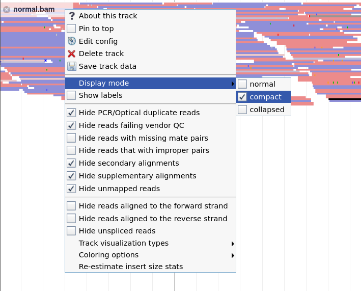
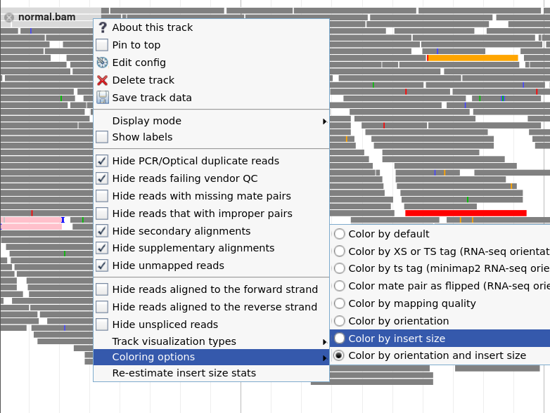

<!-- TODO add contributors. From bioinf.ca: "This lab is based on the HTS IGV lab originally by
Sorana Morrissy and was updated and modified by Heather Gibling for the Cancer Analysis workshop. " -->



# Introduction

This tutorial will introduce you to the Genome browsers; powerful tools for viewing many kinds of
genomic data, including data for DNA sequencing, RNA sequencing, microarrays, epigenetics, and
copy number alteration. For this tutorial we will use [JBrowse](https://jbrowse.org/jb2/) (), since it has a nice integration
with Galaxy, but many other Genome browsers exist, with [IGV](https://igv.org/app/) perhaps being the most widely used. TODO: link some examples/comparisons

> <agenda-title></agenda-title>
>
> In this tutorial, we will cover:
>
> 1. TOC
> {:toc}
>
{: .agenda}


# Data upload

Before we view our data in the Genome browser, let's upload it to Galaxy

> <hands-on-title> Upload data </hands-on-title>
>
> 1. Make sure you have an empty analysis history. Give it a name.
>
>    
>
> 2. Import data from Zenodo
>
>    ```
>    https://zenodo.org/record/7573435/files/normal.bam
>    https://zenodo.org/record/7573435/files/tumor.bam
>    https://zenodo.org/record/7573435/files/genes.bed
>    https://zenodo.org/record/7573435/files/dbsnp151.bed
>    https://zenodo.org/record/7573435/files/NA12878.bam
>    ```
>
>    
>
{: .hands_on}


These files are *alignment* files. This means the raw sequence reads have been mapped to the human reference genome. To learn more about this process of mapping, see our [dedicated tutorial]()


To view alignment files in a genome browser, you usually provide the BAM file, along with an *index* file, which allows the tools to quickly navigate the usually very large alignment files.
However, in our case, Galaxy automatically creates the index file whenever you upload a BAM file, and will supply it to the tools that need it behind the scenes.

TODO: note about test data we are using, scaled down for tutorial reasons, fact that it's paired-end data


# Getting familiar with JBrowse

Let's start by launching JBrowse and loading our data so that we can get a feel for JBrowe and its interface. JBrowse works just like any other tool in Galaxy, you provide your data, configure some settings, en execute. The output will be a copy of the JBrowse genome browser with your data loaded.

> <hands-on-title> Build JBrowse </hands-on-title>
>
> 1.  with the following parameters:
>    - *"Select a reference genome"*: `Human Feb. 2009 (GRCh37/hg19) (hg19)`
>    -  *"Insert Track Group"*
>      -  *"Insert Annotation Track"*
>      -  *"Track Type"*: `BAM Pileups`
>      -  *"BAM Track Data"* (hold CTRL to select multiple)
>        - `normal.bam`
>        - `tumor.bam`
>    -  Autogenerate SNP Track: `Yes`
>
{: .hands_on}


## The JBrowse interface

Let's start by opening JBrowse, just to get a feel for what it looks like.

> <hands-on-title> A first look at JBrowse </hands-on-title>
>
> 1. Click on the eye icon  to view the data in JBrowse
>
>    
>
> 2. If you need a bit more space on your screen, consider resizing Galaxy's side panels
>
>    
>
> 3. Play around in JBrowse
>
>    > <question-title> What do you see? </question-title>
>    >
>    > 1. Which part of the genome are you currently viewing?
>    > 3. Which data tracks do you see in the main panel?
>    >
>    > > <solution-title></solution-title>
>    > >
>    > > 1. Check the location bar at the top of the screen. You will see something like `chr1:10342..10677 (366b)`, This means you are currently viewing chromosome 1, from base 10342 to base 10677.
>    > >    By default, you will usually be viewing a part of chromosome 1, unless you specified a different region when starting JBrowse.
>    > > 2. The name of each data track is shown in the upper left corner of the track. By default, you should see two tracks labelled "Reference Sequence" and "GCContentXY". Tracks can be shown and hidden using the checkboxes in the left-hand panel.
>    > {: .solution}
>    {: .question}
>
>
> 4. Click on the **"Zoom in"**  button until you can see the individual bases in the reference genome track.
>    
>
>    > <question-title> What do you see? </question-title>
>    >
>    > 1. What are all the lettered rows you see?
>    > 2. What do the colours mean?
>    >
>    > > <solution-title></solution-title>
>    > > 1. The two center rows show the nucleotides of the forward and reverse strands. The three top rows show the potential amino acids, at different phasings. The bottom 3 rows show the same for the reverse strand.
>    > >
>    > > 2. Each nucleotide has a unique color. If you zoom out so far that you can not see the
>    > >  individual nucleotide letters anymore, you can still tell their identity by the color.
>    > >   Similarly, on the amino acid rows, stop codons are colored red and indicated with an asterisk (*). Start codons are coloured green.
>    > {: .solution}
>    {: .question}
>
> 5. What is the second track that is visible?
>
>    > <question-title> What do you see? </question-title>
>    >
>    > 1. What is the second track that is visible here?
>    >
>    > > <solution-title></solution-title>
>    > >
>    > > This track contains the GC content for the reference genome
>    > >
>    > {: .solution}
>    {: .question}
>
{: .hands_on}


## Navigation

There are various ways to navigate around the genome, you can:
  - Zoom in or out of the current region
  - Drag the main panel left and right to move to adjacent streches of the genome
  - Jump to specific regions by entering a location in

Later in this tutorial we will add a genes track, so that you may also enter gene names in the location bar to jump directly to your gene of interest.

Let's get a feel for this


> <hands-on-title> Navigating around the genome </hands-on-title>
>
> 1. If Jbrowse is no longer open, click on the eye icon  to open JBrowse again
>
> 2. **Navigate** around the genome by dragging the main panel left and right to move to adjacent regions. You can also zoom out if you want to view bigger regions at a time.
>
> 3. You can also specify a specific region to jump to. Paste `chr1:10200-10800` into the location bar and hit the "Go" button (or press <kbd>Enter</kbd>)
>
>
>    > <question-title> What do you see? </question-title>
>    >
>    > 1. What do you notice about the reference genome here?
>    >
>    > > <solution-title></solution-title>
>    > >
>    > > Because of the colour coding that JBrowse applies, it is easy to see the repeats that are present at the beginning of this region
>    > >
>    > > 
>    > {: .solution}
>    {: .question}
>
{: .hands_on}


## Visualising read alignments

Now that we have a feel for JBrowse, let's view some of our data!

> <hands-on-title> Viewing Read Alignments </hands-on-title>
>
> 1. Check the box next to `normal.bam`  on the left-hand side
>
> 2. Navigate to `chr9:130,620,912-130,621,487` by copying the location into the location bar and hitting <kbd>Enter</kbd>
>
>    
>
>    > <question-title> What do you see? </question-title>
>    >
>    > 1. What do you see in the data track?
>    > 2. What do the red and blue colours mean? (Hint: you can click on the reads to get more information about the read)
>    >
>    > > <solution-title></solution-title>
>    > >
>    > > 1. The `normal.bam` tracks shows the reads at the location they mapped to. Each horizontal bar signifies one read.
>    > > 2. The red reads mapped to the `+` strand, the blue reads to the `-` strand. By clicking on a read you can get more information,
>    > >    including sequence, strand, mapping score, and more.
>    > >
>    > {: .solution}
>    {: .question}
>
>    > <details-title>Read colours</details-title>
>    >
>    > You may have seen some reads not coloured red or blue, these all have special meanings:
>    >
>    > | colour | meaning|
>    > |--------|--------|
>    > | standard red | forward strand |
>    > | standard blue | reverse strand |
>    > | hard red | forward strand, missing mate |
>    > | hard blue | reverse strand, missing mate |
>    > | light red | forward strand, not proper |
>    > | light blue | reverse strand, not proper |
>    > | black | forward strand, different chr |
>    > | gray | reverse strand, different chr |
>    >
>    > More information about alignment tracks can be found in the [JBrowse documentation](https://jbrowse.org/docs/alignments.html)
>    {: .details}
>
> 3. **Zoom in**  a bit until you can see individual mismatches on the reads
>
>    
>
>    > <question-title> What do you see? </question-title>
>    >
>    > 1. What do these mismatches mean?
>    > 2. Can you find a single-nucleotide change? Is it homozygous or heterozygous? Is it an SNV or a SNP?
>    >
>    > > <solution-title></solution-title>
>    > >
>    > > 1. Any time a nucleotide in the read does not match the reference base it is mapped to, it is signified by a coloured block (colour depends on the nucleotide).
>    > >    This could signify a read error, a variant, or a mistake in the reference genome.
>    > >
>    > > 2. Whenever a mismatch occurs in many reads overlapping a position, it is most likely a true variant (rather than e.g. a sequencing error).
>    > >
>    > >    If it occurs in roughly 50% of reads, it is a heterozygous SNV/SNP, if it occurs in roughly 100% it is a homozygous SNV/SNP. In the screenshot above, the red line of `T` nucleotides represents an homozygous SNV at that location.
>    > >
>    > >    To determine if it is a polymorphism (common variant in the population, SNP) we'd need more information, e.g. from a SNP database such as dpSNP.
>    > >
>    > >    The other mismatches that only occur in a single read are most likely sequencing errors. Mismatches that occur in a handful of reads may be somatic variants, or other sequencing artefacts.
>    > >
>    > {: .solution}
>    {: .question}
>
> 4. **Click on a read** to get more detailed information
>
>    
>
>    > <question-title> What do you see? </question-title>
>    >
>    > 1. How long is the read?
>    > 2. What can you say about the base quality?
>    > 3. How about the mapping quality?
>    >
>    > > <solution-title></solution-title>
>    > >
>    > > 1. This information can be found in the `Length` field. For the example in the screenshot the length is 101 base pairs
>    > > 2. The `Sequence and Quality` field shows the basecalling quality for each nucleotide in the read.
>    > > 3. The `CIGAR` string says something about how well the read mapped. In the screenshot this is `101M`, meaning "101 (mis)matches", so this read mapped without any insertions or deletions. And because we can tell from the colouring of the read there were no mismatches, we know these were all matches, so this read aligned perfectly.
>    > >
>    > >    
>    > >
>    > {: .solution}
>    {: .question}
>
{: .hands_on}


Depending on what we might like to do (e.g. quality control, SNP calling, CNV finding), or the type of data we have (RNASeq, paird/unpaired, etc) we might like
to customize how JBrowse displays our data. There are many options to control how alignment data is shown to us. Let's play around with some of those settings:

> <hands-on-title>Customizing Alignment display</hands-on-title>
>
> 1. You can customize the way alignments are displayed in JBrowse
>    - Hover over the `normal.bam` track name in the top-left of the track
>    - Click on the dropdown button to the right of the track name to access the track settings
>
>    {: width="50%"}
>
>
> 2. **Experiment** with the various settings. Think about which would be best for specific tasks (e.g. quality control, SNP calling, CNV finding).
>
>    - You can change how many reads are visible under `Display mode`
>      - try out the `normal`, `collapsed` and `compact` modes
>
>      {: width="75%"}
>
>    - Try the different settings for `Track visualisation types`
>
>      {: width="75%"}
>
>    - Try different settings for  `Colouring options`
>
>      {: width="75%"}
>
>
{: .hands_on}


## Adding reference tracks

When we are viewing our data in a genome browser, it is often useful to include knowledge about the area we are viewing, such as genes or other features overlapping the position, or known variants or polymorphisms. To do this, we can load additional tracks into JBrowse that contain this data.


> <hands-on-title>Adding dpSNP and genes BED tracks</hands-on-title>
>
> 1. Hit the **Re-run**  button on the previous JBrowse output
>    - Scroll down past where we configured the BAM/Pileup tracks
>    -  Insert Annotation Track
>      - *"Track Type"*: `GFF/GFF3/BED Features`
>      - *"GFF/GFF3/BED Track Data"*: Select the following files (hold <kbd>CTRL</kbd> to select multiple files):
>           - `genes.bed`
>           - `dpsnp151.bed`
>
> 2. View  the new JBrowse instance
>    - Enable the `normal.bam`, `genes.bed` and `dpSNP.bed` tracks
>    - Navigate to `chr9:130630233` <!-- chr9:130610720-130610929 -->
>
>      {: width="75%"}
>
>      > <question-title> What do you see? </question-title>
>      >
>      > 1. Is this a SNP or an SNV? Is it homozygous or heterozygous?
>      > 2. Does it impact a gene?
>      >
>      > > <solution-title></solution-title>
>      > >
>      > > 1. It is present in dbSNP (`rs4226`), so it is a common polymorphism in the human popluation. It is present in 100% of our reads, so it is homozygous.
>      > > 2. In the genes track you can see the `AK1` gene overlaps this region
>      > >
>      > {: .solution}
>      {: .question}
>
> 3. Note that you can rearrange the order of tracks by clicking and dragging them by their name labels (top left of the track)
>
{: .hands-on}


# Inspecting small variants in the normal sample

## Heterozygous and Homozygous SNPs

> <hands-on-title></hands-on-title>
>
> 1. Navigate to `chr9:130607258-130607619`
>    - You should see two potential SNPs
>
>    
>
> 2. Enable the track  `normal.bam - SNPs/Coverage` and the  `dbSNP` tracks in the left-hand panel..
>    - make sure you can see both the SNPs/Coverage track as well as the alignment track. If your screen is too small to see both at once, set the alignment track (`normal.bam`) display mode to `compact`
>
>    
>
>    > <question-title></question-title>
>    >
>    > 1. Which variant is heterozygous and which is homozygous?
>    > 2. What are the variant allele frequencies for each SNP? To find out, hover over the SNP in the `SNPs/Coverage` track.
>    >
>    > > <solution-title></solution-title>
>    > > 1. Left is heterozygous (~half the reads are marked as mismatches at this location) and right is homoszygous (all are marked as mismatches)
>    > > 2. 46% (left) and 100% (right)
>    > {: .solution}
>    {: .question}
>
> 2. Make sure the reads are coloured by read strand (default colouring option). So that red reads are in the forward orientation, and blue reads are in the reverse orientation.
>
>    > <question-title></question-title>
>    > Do these look like true SNPs? What evidence is there for this?
>    >
>    > > <solution-title></solution-title>
>    > > Yes, the allele frequencies are close to what we would expect to see for heterozygous and homozygous SNPS, and all of the mismatched bases are of high quality, and there is no strand bias. Additionally, they both line up with known SNPs in the dbSNP track.
>    > {: .solution}
>    {: .question}
>
> 2. Look at the other mismatched bases in the region between the two SNPs.
>
>    > <question-title></question-title>
>    >  1. Are these sequencing errors, SNPs, or SNVs?
>    >  2. Can a normal sample have somatic SNVs?
>    >
>    > > <solution-title></solution-title>
>    > > 1. Sequencing errors and SNVs. The low quality mismatches are most likely sequencing errors. The higher quality mismatches that only occur in one or two reads are most likely somatic SNVs. They are not SNPs because they are not known germline mutations
>    > > 2. Yes! There is always a chance there will be a mutation or error during genome replication.
>    > {: .solution}
>    {: .question}
>
{: .hands_on}


## Homozygous deletion

> <hands-on-title>Deletions</hands-on-title>
>
> 1. Navigate to `chr9:130555407-130556072`
>
>    
>
> > <question-title></question-title>
> >
> > 1. How large is this deletion?
> > 2. Is it homozygous or heterozygous?
> >
> > > <solution-title></solution-title>
> > > 1. 24 basepairs. If you click on one of the reads displaying a gap across the deletion, the `CIGAR` string will show something like `38M24D61M` meaning 38 matches, 24 Deletions, 61 matches.
> > > 2. Homozygous. No reads span this region and there is a clear sharp drop in the coverage track. Hovering over the coverage track shows the deletion is present in 18 of 18 reads.
> > {: .solution}
> {: .question}
{: .hands_on}


## GC coverage

> <hands-on-title>GC Coverage</hands-on-title>
>
> 1. Navigate to `chr9:130284240-130286902`
>    - Make sure the  `GCContentXY` and  `SNPs/Coverage` tracks are enabled
>    - If your screen is too small to view all 3 tracks at the same time, set the display mode for the `normal.bam` track to `compact`
>
>    
>
> > <question-title></question-title>
> >
> > 1. What do you notice about the coverage track and GC Content track?
> > 2. What does coloring alignments by read strand (default colouring setting) tell you?
> > 3. Do you think this is a deletion? Compare this region to the previous region.
> >
> > > <solution-title></solution-title>
> > > 1. The coverage track slowly dips down to 0 and then back up, and the GC Content track has a clear drop to 0%
> > > 2. No forward reads are to the left of this dip and no reverse reads are to the right.
> > > 3. This is a loss in coverage due to no GC content, not a deletion. Regions of the genome with a low GC% are notoriously difficult to sequence. The lack of reads spanning this region indicates these fragments were not able to be sequenced at all.
> > >
> > {: .solution}
> {: .question}
{: .hands_on}


# Inspecting small somatic variants in the tumor sample

Now that we have a feel for the genome browser and how to identify variants, let's have a look at
our tumour sample.


## Somatic SNV

> <hands-on-title></hands-on-title>
>
> 1. Enable the  `tumor.bam` track on the left-hand side
>    - Make sure you can see both the `normal.bam` and `tumor.bam` tracks. You might want to set the display mode to `compact`
>
> 2. Navigate to `chr9:130633300-130633965`
>
>    
>
> > <question-title></question-title>
> >
> > 1. How many SNVs are in this region for each sample? (Hint: change the colouring settings if the red and blue of the reads are distracting you from noticing the SNVs)
> > 2. What is the variant allele frequency for the extra SNV in the tumor sample? How did it get this high?
> >
> > > <solution-title></solution-title>
> > > 1. Normal: 3, Tumor: 4.
> > >
> > >    If you had trouble seeing this, choose a different colour setting, for example colouring by mapping quality:
> > >
> > >    
> > >
> > > 2. 37% (this can be determined from the `tumor.bam - SNPs/Coverage` track).  A mutation might have occurred in a cell that had a growth advantage that led to a clone (group of related cells) making up a large proportion of the tumor sample.
> > >
> > {: .solution}
> {: .question}
{: .hands_on}


## Somatic SNP with change in heterozygosity

> <hands-on-title></hands-on-title>
>
> 1. Navigate to `chr9:130515234-130515399`
>
>    
>
> > <question-title></question-title>
> >
> > 1. What are the variant allele frequencies for each sample?
> > 2. Why are these frequencies different?
> >
> > > <solution-title></solution-title>
> > > 1. Normal: 46%, Tumor: 80% (this can be determined by hovering over the variant in the `SNPs/Coverage` track for each sample
> > > 2. Some cells experienced a loss of heterozygosity at this locus, leading to the variant being more frequent in the tumor population overall
> > {: .solution}
> {: .question}
{: .hands_on}


## Somatic indel next to SNP with change in heterozygosity

> <hands-on-title></hands-on-title>
>
> 1. Navigate to `chr9:130337806`
>
> 2. Set a **highlight** at the location by going to the `View -> Set highlight` menu at the top of JBrowse. Set the highlight to `chr9:130337806`
>
>    
>
> > <question-title></question-title>
> >
> > 1. What type of variant is in the centre (highlighted area)?
> > 2. In the normal sample there is a SNP to the right. What do you notice about this variant in the tumor sample?
> > 3. What might be an explanation for what happened?
> >
> > > <solution-title></solution-title>
> > > 1. Small deletion (1bp)
> > > 2. The variant allele is less frequent in the tumor sample and the reads with the deletion do not have the variant allele
> > > 3. Some cells experienced a loss of heterozygosity at this site, leading to the reference allele being more frequent in the tumor population overall. This LOH event might have also been associated with the occurance of a deletion nearby.
> > {: .solution}
> {: .question}
{: .hands_on}


# Inspecting structural variants in NA12878

Cancers often have large structural variants, like inversions, duplications, and translocations. We will examine some structural variants in a well-studied individual (NA12878) from
the [Platinum Genomes Project](https://www.illumina.com/platinumgenomes.html). Note that this is a normal sample, but think about how these variants might look in a tumor sample.

To examine these structural variants in JBrowse, we start a new JBrowse, and load the `NA12878.bam` file

> <hands-on-title> Build JBrowse </hands-on-title>
>
> 1.  with the following parameters:
>    - *"Select a reference genome"*: `Human Feb. 2009 (GRCh37/hg19) (hg19)`
>    -  *"Insert Track Group"*
>      -  *"Insert Annotation Track"*
>      -  *"Track Type"*: `BAM Pileups`
>      -  *"BAM Track Data"*
>        - `NA12878.bam`
>
{: .hands_on}


## Inversion

> <hands-on-title>Viewing an inversion in JBrowse</hands-on-title>
>
>
> 1. Navigate to `chrX:14728136-14732366`
>
> 2. Make the following viewing adjustments:
>    - Display mode: `compact`
>    - Track visualisation types: `View as pairs`
>    - Coloring options: `By orientation`
>
>    
>
>
> > <question-title></question-title>
> >
> > 1. What do you notice about the blue and green reads at the bottom?
> > 2. How does `View as pairs` help understand that this is an inversion?
> > 3. Is this inversion heterozygous or homozygous?
> >
> > > <solution-title></solution-title>
> > > 1. The blue read pairs are both reverse facing, whereas the green read pairs are both forward facing
> > > 2. It shows us that not all read pairs in this region are forward-reverse as expected
> > > 3. Heterozygous, as there are lots of properly oriented read pairs as well
> > {: .solution}
> {: .question}
>
{: .hands_on}


## Duplication

> <hands-on-title>Viewing a duplication in JBrowse</hands-on-title>
>
>
> 1. Navigate to `chr17:55080031-55081661`
>
> 2. Keep the same visualisation settings as in the previous step:
>    - Display mode: `compact`
>    - Track visualisation types: `View as pairs`
>    - Coloring options: `By orientation`
>
>    
>
>
> > <question-title></question-title>
> >
> > 1. What do you notice about the teal reads at the bottom?
> >
> >    **Note:** Teal reads when colored by read orientation can indicate a translocation as well as a duplication. If you activate the `SNPs/Coverage` track for the sample and zoom out,
> >    you can see there is a rise in the coverage track above the green reads, suggesting this is a duplication of the sequence at this location.
> >
> > > <solution-title></solution-title>
> > > 1. The read pairs are in the opposite orientation as expected (reverse-forward instead of forward-reverse)
> > {: .solution}
> {: .question}
>
{: .hands_on}


## Large Deletion

> <hands-on-title>Viewing a duplication in JBrowse</hands-on-title>
>
>
> 1. Navigate to `chr7:39811931-39833535`
>
> 2. Color alignments by insert size. keep the same visualisation settings as in the previous step:
>    - Display mode: `compact`
>    - Track visualisation types: `View as pairs`
>    - Coloring options: `By insert size`
>
>    
>
>
> > <question-title></question-title>
> >
> > 1. What do the red read pairs indicate?
> > 2. What other track can we look at to see that this is a deletion?
> >
> > > <solution-title></solution-title>
> > > 1. Read pairs with a larger insert size than expected. Since the senquence in between is missing in the sample, the read pairs came from an appropriately sized fragment, but when mapped to the reference genome they are much further apart than expected if the reference sequence was present
> > > 2. There is a dip in the coverage track indicating fewer reads mapped here
> > {: .solution}
> {: .question}
>
{: .hands_on}


## Conclusion

You’re done! We hope that you enjoyed the tutorial and that you continue to enjoy JBrowse.
