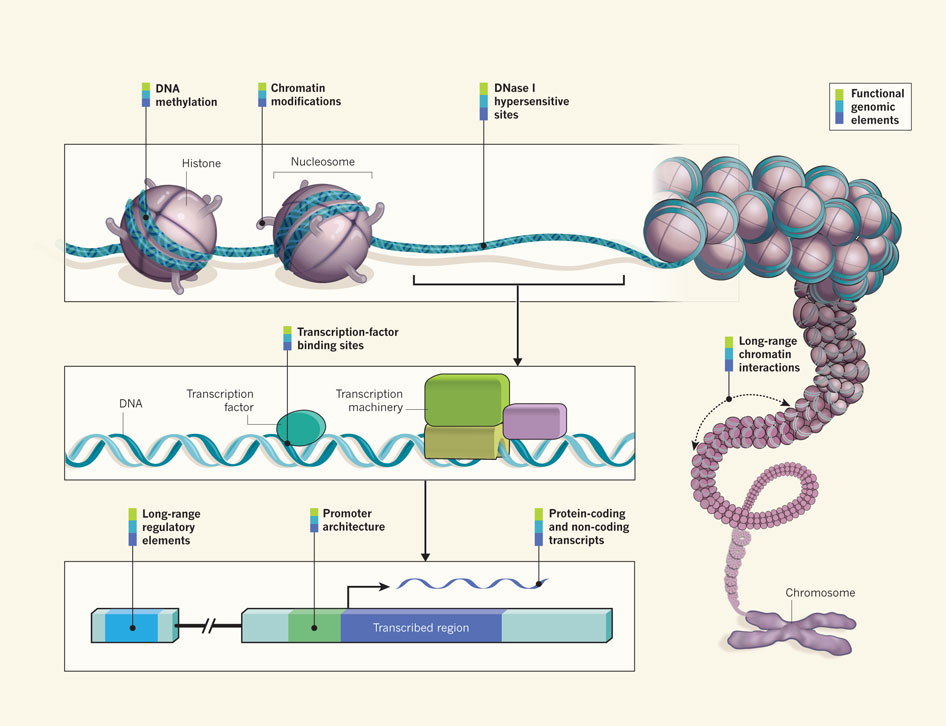
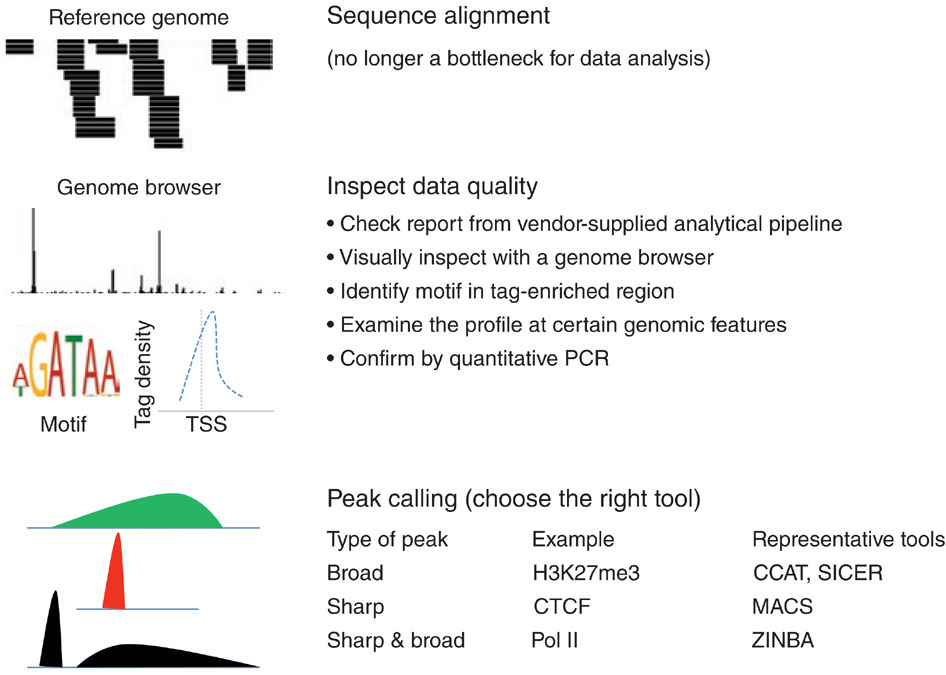

# What is ChIP sequencing?

---

### Where my data comes from?

<small>
[*Ecker et al, Nature, 2012*](http://www.nature.com/nature/journal/v489/n7414/full/489052a.html)
</small>

---

### Chromatin immuno-precipitation

[*Szalkowski & Schmid, Brief Bioinform, 2011*](http://bib.oxfordjournals.org/content/12/6/626.long)

---

## How to analyze ChIP-seq data?

---

### Common procedures for ChIP-seq data analysis

[*Kidder et al, Nature Immunology, 2011*](http://www.nature.com/ni/journal/v12/n10/full/ni.2117.html)
