# Introduction
{:.no_toc}

This tutorial uses ChIP-seq datasets from a study published by [*Wu et al.* (2014)](https://www.ncbi.nlm.nih.gov/pmc/articles/PMC4248312/). The goal of this study was to investigate "the dynamics of occupancy and the role in gene regulation of the transcription factor TAL1, a critical regulator of hematopoiesis, at multiple stages of hematopoietic differentiation."

To this end, ChIP-seq experiments were performed in multiple mouse cell types including G1E - a GATA-null immortalized cell line derived from targeted disruption of GATA-1 in mouse embryonic stem cells - and megakaryocytes.

This dataset (GEO Accession: [GSE51338](https://www.ncbi.nlm.nih.gov/geo/query/acc.cgi?acc=GSE51338)) consists of biological replicate TAL1 ChIP-seq and input control experiments.
Input control experiments are used to identify and remove sampling bias, for example open/accessible chromatin or GC bias.

Because of the long processing time for the large original files, we have downsampled the original raw data files to include only reads that align to chromosome 19 and a subset of interesting genomic loci identified by *Wu et al.* (2014).

**Table 1**: Metadata for ChIP-seq experiments in this tutorial. SE: single-end.

| Cellular state | Datatype | ChIP Ab | Replicate | SRA Accession | Library type | Read length | Stranded? | Data size (MB) |
|---|---|:-:|:-:|---|:-:|:-:|:-:|---|
| G1E | ChIP-seq | input | 1 | SRR507859 | SE | 36 | No | 35.8 |
| G1E | ChIP-seq | input | 2 | SRR507860 | SE | 55 | No | 427.1 |
| G1E | ChIP-seq | TAL1 | 1 | SRR492444 | SE | 36 | No | 32.3 |
| G1E | ChIP-seq | TAL1 | 2 | SRR492445 | SE | 41 | No | 62.7 |
| Megakaryocyte | ChIP-seq | input | 1	| SRR492453 | SE | 41 | No | 57.2 |
| Megakaryocyte | ChIP-seq | input | 2 | SRR492454 | SE | 55 | No | 403.8 |
| Megakaryocyte | ChIP-seq | TAL1 | 1 | SRR549006 | SE | 55 | No | 340.3 |
| Megakaryocyte | ChIP-seq | TAL1 | 2 | SRR549007 | SE | 48 | No | 356.9 |

> ### Agenda
>
> In this tutorial, we will deal with:
>
> 1. TOC
> {:toc}
>
{: .agenda}

# Step 1: Quality control

As for any NGS data analysis, ChIP-seq data must be quality controlled before being aligned to a reference genome. For more detailed information on NGS quality control, check out the tutorial [here]({{site.baseurl}}/topics/sequence-analysis).

> ###  Hands-on: Quality control
>
> 1. Create and name a new history for this tutorial.
> 2. Import the ChIP-seq raw data (\*.fastqsanger) from [Zenodo](https://doi.org/10.5281/zenodo.197100)
>
>    > ###  Tip: Importing data via links
>    >
>    > * Copy the link location (Right-click on the filename <i class="fa fa-long-arrow-right"></i> Copy Link Address)
>    > * Open the Galaxy Upload Manager
>    > * Select **Paste/Fetch Data**
>    > * Paste the link into the text field
>    > * Press **Start**
>    {: .tip}
>
>    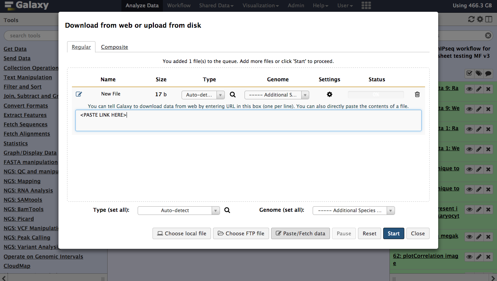
>
>    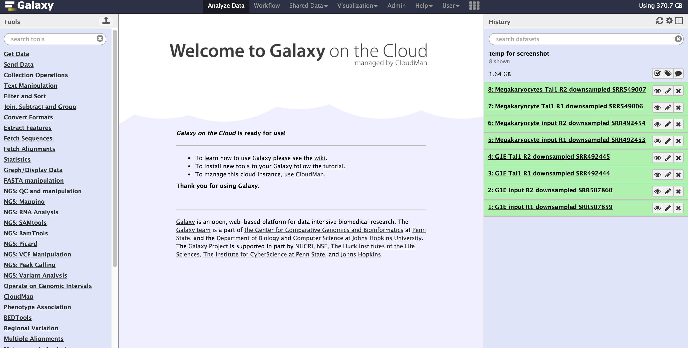
>
> 3. Examine in Galaxy the data in a FASTQ file by clicking on the eye icon.
>
>    > ###  Questions
>    >
>    > 1. What are four key features of a FASTQ file?
>    > 2. What is the main difference between a FASTQ and a FASTA file?
>    >
>    >    

>    >    
Click to view answers

>    >    <ol type="1">
>    >    <li>Sequence identifier and additonal information, the raw sequence, information about the sequence again with optional information, and quality information about the sequence</li>
>    >    <li>A fasta file contains only the description of the sequence and the sequence itself. A fasta file does not contain any quality information.</li>
>    >    </ol>
>    >    

>    {: .question}
>
> 4. **FastQC** : Run the tool **FastQC** on each FASTQ file to assess the quality of the raw data. An explanation of the results can be found on the [FastQC web page](https://www.bioinformatics.babraham.ac.uk/projects/fastqc/).
>
>    > ###  Tip: Running a tool on multiple data files
>    >
>    > You can run this tool - and many other tools - on all the FASTQ files at once!
>    > To do this, first select the "Multiple datasets" icon (two stacked pages) under the "Input FASTQ file" heading in the **FASTQC** Tool Form, then shift+click to select multiple FASTQ files.
>    {: .tip}
>
>    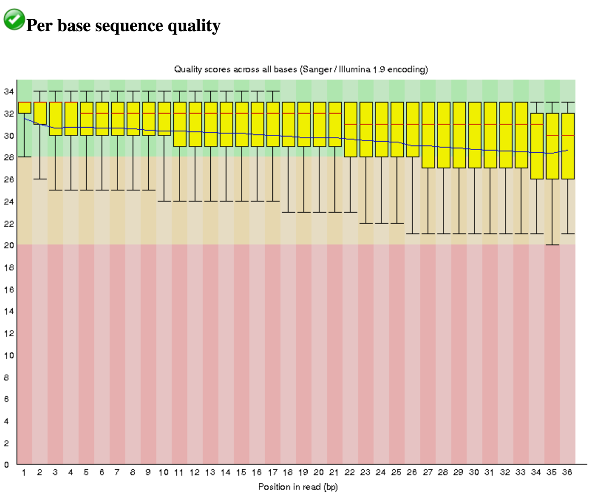
>
>    > ###  Questions
>    >
>    > 1. What does the y-axis represent in Figure 3?
>    > 2. Why is the quality score decreasing across the length of the reads?
>    >
>    >    

>    >    
Click to view answers

>    >    <ol type="1">
>    >    <li>The phred-score. This score gives the probability of an incorrect base e.g. a score of 20 means that it is likely by 1% that one base is incorrect. See <a href="https://en.wikipedia.org/wiki/Phred_quality_score"> here </a>for more information. </li>
>    >    <li>This is an unsolved technical issue of the sequencing machines. The longer the sequences are the more likely are errors. More <a href="https://www.ecseq.com/support/ngs/why-does-the-sequence-quality-decrease-over-the-read-in-illumina">information.</a></li>
>    >    </ol>
>    >    

>    {: .question}
{: .hands_on}

# Step 2: Trimming and clipping reads

It is often necessary to trim a sequenced read to remove bases sequenced with high uncertainty (*i.e.* low-quality bases). In addition, artificial adaptor sequences used in library preparation protocols need to be removed before attempting to align the reads to a reference genome.

> ###  Hands-on: Trimming and clipping reads
>
> 1. **Trimmomatic** : Run the tool **Trimmomatic** on each FASTQ file to trim low-quality bases (remember how to run tools on all files at once?). Explore the full parameter list for `Trimmomatic` in the Tool Form and set the following `Trimmomatic` parameters:
>
>    - **Paired end data?**: No
>    - **Perform initial ILLUMINACLIP?**: No
>    - **Select Trimmomatic operation to perform**: Sliding window trimming (SLIDINGWINDOW)
>    - **Number of bases to average across**: 4
>    - **Average quality required**: 20
>
>    > ###  Tip: Changing datatypes
>    >
>    > If the FASTQ files cannot be selected, check whether their format is FASTQ with Sanger-scaled quality values (*fastqsanger*). If not, you can edit the data type by clicking on the pencil symbol next to a file in the history, clicking the "Datatype" tab, and choosing *fastqsanger* as the "New Type".
>    {: .tip}
>
> 2. **FastQC** : Rerun the tool **FastQC** on each trimmed/clipped FASTQ file to determine whether low-quality and adaptor sequences were correctly removed.
>
>    > ###  Questions
>    >
>    > 1. How did the range of read lengths change after trimming/clipping?
>    > 2. What do you think could account for the enriched k-mers (**Kmer Content** heading in **FASTQC** output) observed in the Megakaryocytes TAL1 R2 ChIP-seq experiment?
>    >
>    >    

>    >    
Click to view answers

>    >    <ol type="1">
>    >    <li>Before trimming, all the reads were the same length, which reflected the number of rounds of nucleotide incorporation in the sequencing experiment. After trimming, read lengths span a range of values reflecting different lengths of the actual DNA fragments captured during the ChIP experiement.</li>
>    >    <li>Many transcription factors recognize and bind to specific sequence motifs. Since a ChIP-seq experiment enriches for DNA fragments bound by the protein being immunopurified, we might expect that protein's recognition motif to be slightly enriched in the resulting sequenced reads.</li>
>    >    </ol>
>    >    

>    {: .question}
>
>    
{: .hands_on}

# Step 3: Aligning reads to a reference genome

To determine where DNA fragments originated from in the genome, the sequenced reads must be aligned to a reference genome. This is equivalent to solving a jigsaw puzzle, but unfortunately, not all pieces are unique. In principle, you could do a BLAST analysis to figure out where the sequenced pieces fit best in the known genome. Aligning millions of short sequences this way, however, can take a couple of weeks.
Nowadays, there are many read alignment programs for sequenced DNA, `BWA` being one of them. You can read more about the BWA algorithm and tool [here](https://academic.oup.com/bioinformatics/article-lookup/doi/10.1093/bioinformatics/btp324).

> ###  Hands-on: Aligning reads to a reference genome
>
> 1. **Map with BWA** : Run the tool **Map with BWA** to map the trimmed/clipped reads to the mouse genome. Set the following **Map with BWA** parameters:
>
>    - **Using reference genome**: Mouse (mus musculus) mm10
>    - **Single or Paired-end reads**: Single
>
>    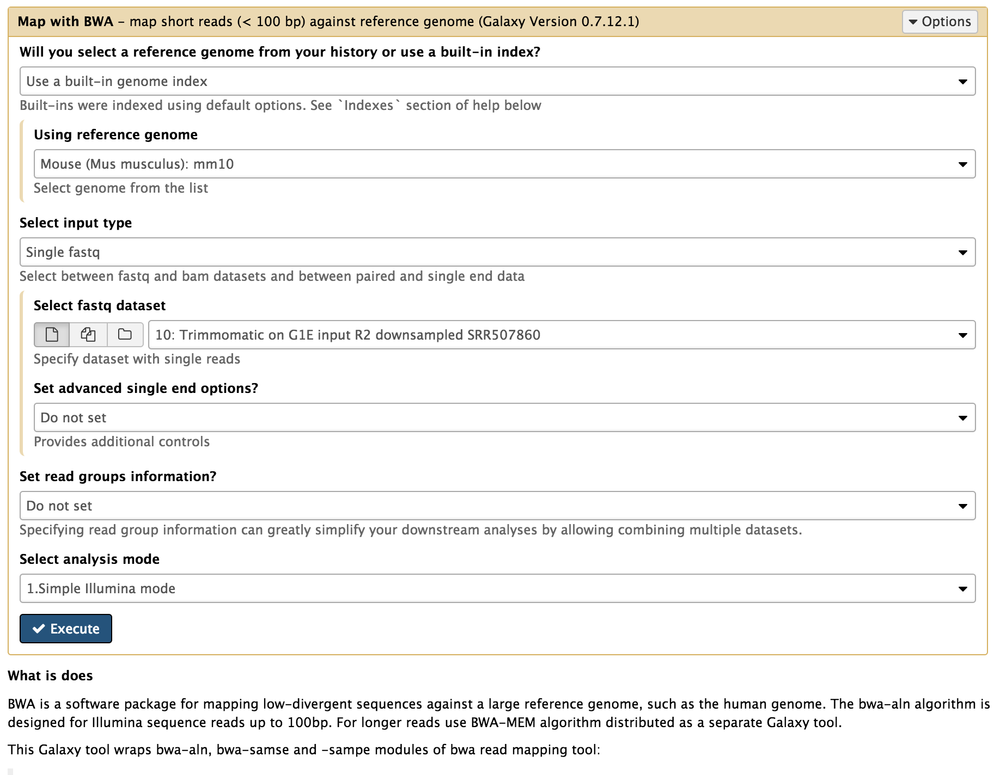
>
> 2. Rename your files after **BWA** finishes to reflect the origin and contents
> 3. Inspect a file produced by running **BWA**
>
>    > ###  Questions
>    >
>    > 1. What datatype is the `BWA` output file?
>    > 2. How many reads were mapped from each file?
>    >
>    >    

>    >    
Click to view answers

>    >    <ol type="1">
>    >    <li> The output is a BAM file.</li>
>    >    <li>Check the number of lines for each file in your history. This gives you a rough estimate.</li>
>    >    </ol>
>    >    

>    {: .question}
>
> 3. **IdxStats** : Run the tool **IdxStats** on all mapped files and look at the output (poke it in the eye!).
>
>    > ###  Questions
>    >
>    > 1. What does each column in the output represent (**Tip**: look at the Tool Form)?
>    > 2. How many reads were mapped to chromosome 19 in each experiment?
>    > 3. If the mouse genome has 21 pairs of chromosomes, what are the other reference chromosomes (*e.g.* chr1_GL456210_random)?
>    >
>    >    

>    >    
Click to view answers

>    >    <ol type="1">
>    >    <li>
>    >      Column &emsp; Description 
>    >      ------------ &emsp;------------------ 
>    >         1 &emsp; &emsp; &emsp;     Reference sequence identifier 
>    >         2 &emsp; &emsp; &emsp;     Reference sequence length 
>    >         3 &emsp; &emsp; &emsp;     Number of mapped reads 
>    >         4 &emsp; &emsp; &emsp;     Number of placed but unmapped reads  (typically unmapped partners of mapped reads)</li>
>    >    <li>This information can be seen in column 3, e.g. for Megakaryocyte_Tal1_R1 2143352 reads are mapped.</li>
>    >    <li>These are parts of chromosomes that e.g. for chr1_GL456210_random do belong to chr1 but it is unclear where exactly. There entires like chrUn that are not associated with a chromosome but it is believed that they are part of the genome. </li>
>    >
>    >    </ol>
>    >    

>    {: .question}
{: .hands_on}

# Step 4: Assessing correlation between samples

To assess the similarity between the replicates sequencing datasets, it is a common technique to calculate the correlation of read counts for the different samples.

We expect that the replicate samples will cluster more closely to each other than to other samples. We will be use tools from the package **deepTools** for the next few steps. More information on **deepTools** can be found [here](https://deeptools.readthedocs.io/en/latest/content/list_of_tools.html).

> ###  Hands-on: Assessing correlation between samples
>
> 1. **multiBamSummary** : Run the tool **multiBamSummary** from the **multiBamSummary** package
>
>    This tool splits the reference genome into bins of equal size and counts the number of reads in each bin from each sample. We set a small **Bin size** here because we are working with a subset of reads that align to only a fraction of the genome.
>
>    Set the following **multiBamSummary** parameters:
>
>     - Select all of the aligned BAM files
>     - **Bin size in bp**: 1000
>
>     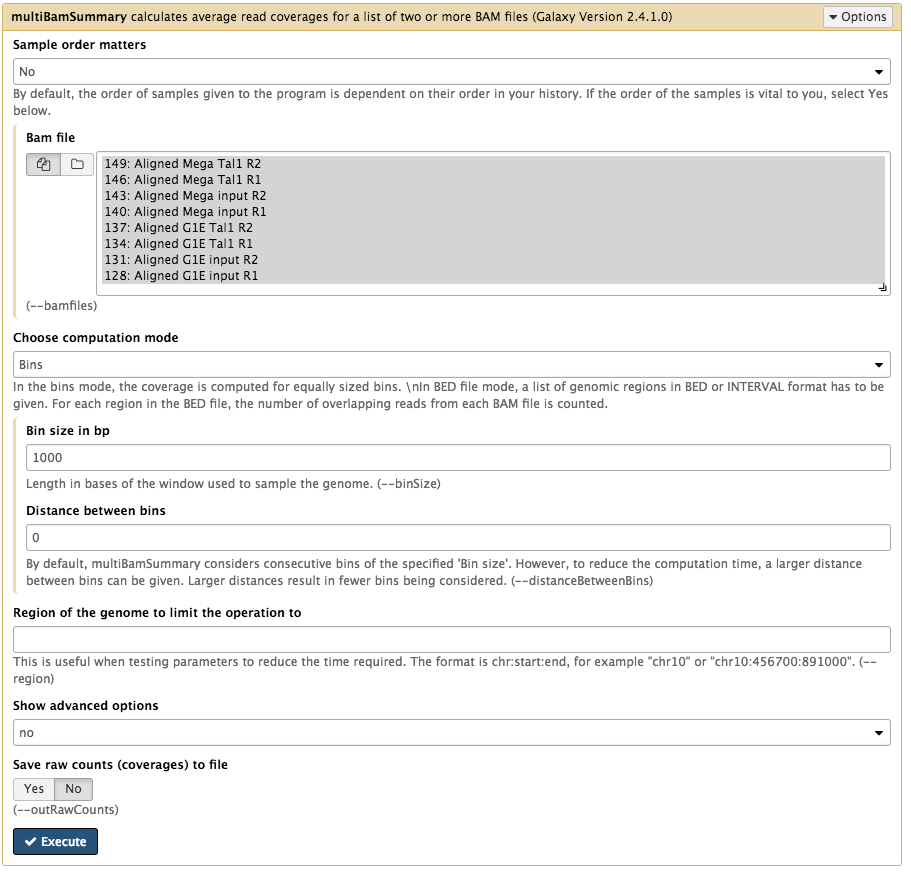
>
> 2. **plotCorrelation** : Run the tool **plotCorrelation** from the **deepTools** package to visualize the results from the previous step.
>
>    Feel free to try different parameters. To start, set the following **plotCorrelation** parameters:
>
>     - **Correlation method**: Pearson
>     - **Plotting type**: Heatmap
>     - **Plot the correlation value**: Yes
>     - **Skip zeros**: Yes
>     - **Remove regions with very large counts**: Yes
>
>     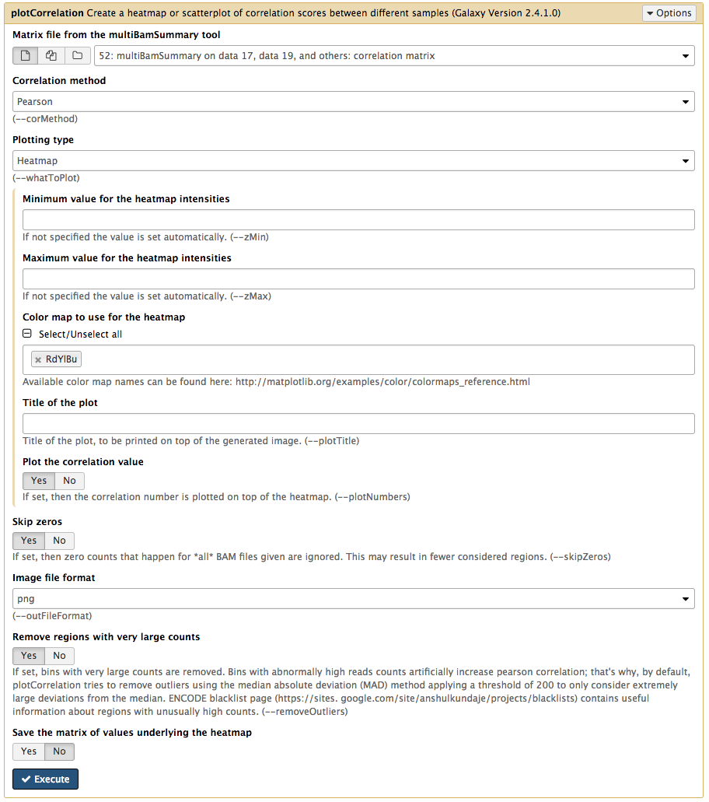
>
>     > ###  Questions
>     >
>     > 1. Why do we want to skip zeros in **plotCorrelation**?
>     > 2. What happens if the Spearman correlation method is used instead of the Pearson method?
>     > 3. What does the output of making a Scatterplot instead of a Heatmap look like?
>    >
>    >    

>    >    
Click to view answers

>    >    <ol type="1">
>    >    <li>Large areas of zeros would lead to a correlation of these areas. The information we would get out of this computation would be meaningless. </li>
>    >    <li>The clusters are different, e.g. Megakaryocyte_input_R2 and G1E_input_R2 are clustered together. <a href="http://support.minitab.com/en-us/minitab-express/1/help-and-how-to/modeling-statistics/regression/supporting-topics/basics/a-comparison-of-the-pearson-and-spearman-correlation-methods/" > More information about Pearson and Spearman correlation. </a> </li>
>    >    <li>No solution for you, just compare the different outputs. </li>
>    >    </ol>
>    >    

>     {: .question}
>
>     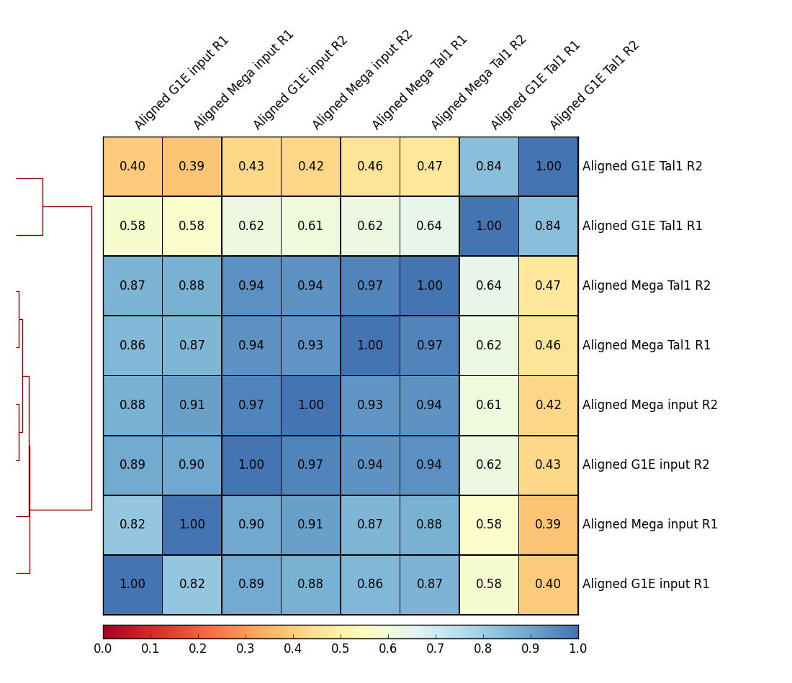
{: .hands_on}

For additional informaton on how to interpret **plotCorrelation** plots, read the information [here](https://deeptools.readthedocs.io/en/latest/content/tools/plotCorrelation.html#background)

# Step 5: Assessing IP strength

We will now evaluate the quality of the immuno-precipitation step in the ChIP-seq protocol.

> ###  Hands-on: Assessing IP strength
>
> 1. **plotFingerprint** : Run the tool **plotFingerprint** from the **deepTools** package.
>
>    - Select all of the aligned BAM files for the G1E cell type
>    - **Show advanced options**: yes
>    - **Bin size in bases**: 100
>    - **Skip zeros**: Yes
>
>    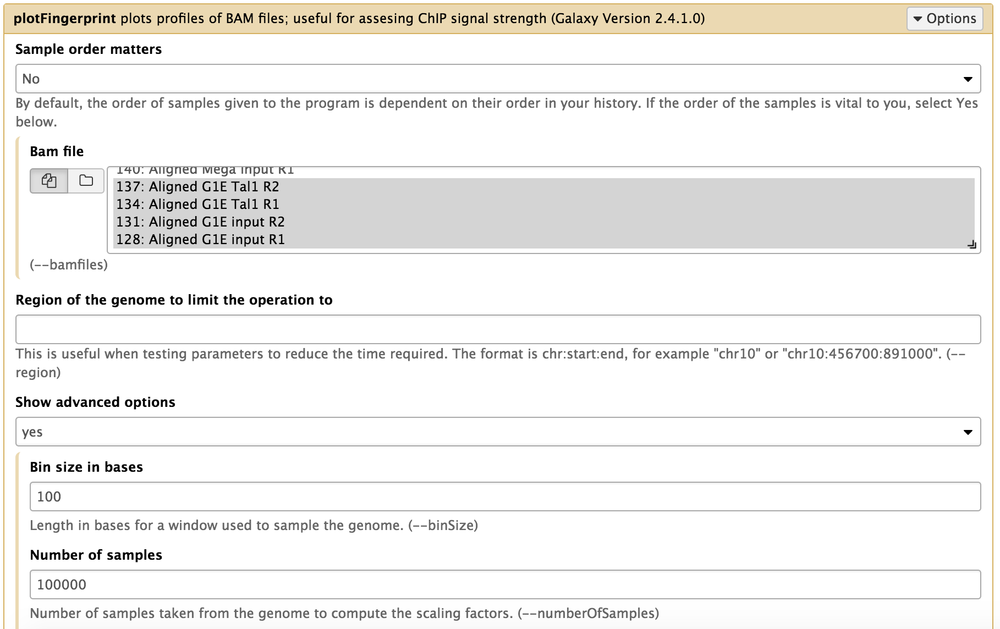
>    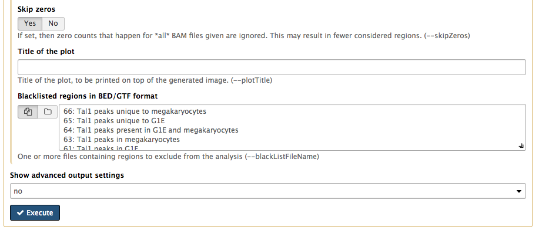
>
> 2. View the output image.
>
>    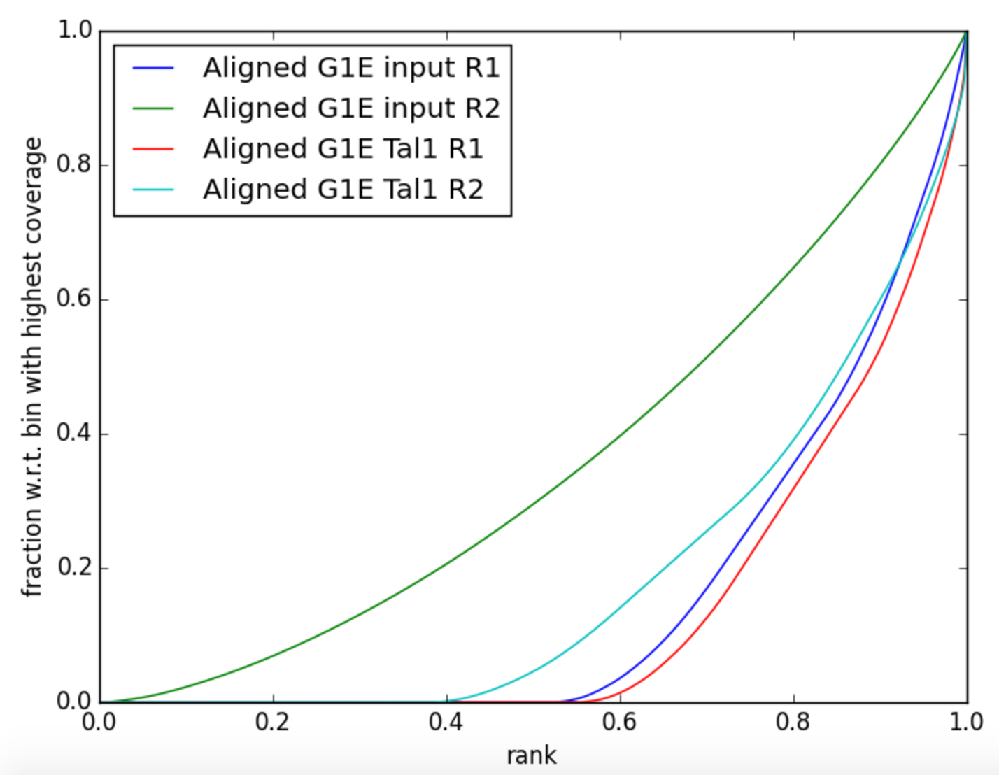
>
>    > ###  Questions
>    >
>    > 1. What does this graph in Figure 10 represent?
>    > 2. How do (or should) input datasets differ from IP datasets?
>    > 3. What do you think about the quality of the IP for this experiment?
>    > 4. How does the quality of the IP for megakaryocytes compare to G1E cells?
>    >
>    >    

>    >    
Click to view answers

>    >    <ol type="1">
>    >    <li>It shows us how good the ChIP Signal compared to the control signal is. An ideal control [input] with perfect uniform distribution of reads along the genome (i.e. without enrichments in open chromatin etc.) and infinite sequencing coverage should generate a straight diagonal line. A very specific and strong ChIP enrichment will be indicated by a prominent and steep rise of the cumulative sum towards the highest rank. </li>
>    >    <li>We expect that the control (input) signal is more or less uniform distributed over the genome (e.g. like the green line in the image above.) The IP dataset should look more like the red line but it would be better if the values for IP start to increase at around 0.8 on the x-axis. </li>
>    >    <li>The enrichment did not work as it should. Compare the blue line with the red one! For your future experiments: You can never have enough replicates! </li>
>    >    <li>The quality of megakaryocytes is better then G1E.</li>
>    >    </ol>
>    >    

>    {: .question}
{: .hands_on}

For additional information on how to interpret **plotFingerprint** plots, read the information [here](https://deeptools.readthedocs.io/en/latest/content/tools/plotFingerprint.html#background)

# Step 6: Determining TAL1 binding sites

Now that **BWA** has aligned the reads to the genome, we will use the tool **MACS2** to identify regions of TAL1 occupancy, which are called "peaks". Peaks are determined from pileups of sequenced reads across the genome that correspond to where TAL1 binds.

**MACS2** will perform two tasks:

1. Identify regions of TAL1 occupancy (peaks)
2. Generate bedgraph files for visual inspection of the data on a genome browser.

More information about **MACS2** can be found [here](https://genomebiology.biomedcentral.com/articles/10.1186/gb-2008-9-9-r137).

> ###  Hands-on: Determining TAL1 binding sites
>
> 1. **MACS2 callpeak** : Run the tool **MACS2 callpeak** with the aligned read files from the previous step as Treatment (TAL1) and Control (input).
>
>    - Select replicate **ChIP-Seq Treatment Files** for one cell type
>    - Select replicate **ChIP-Seq Control Files** for the same cell type
>
>    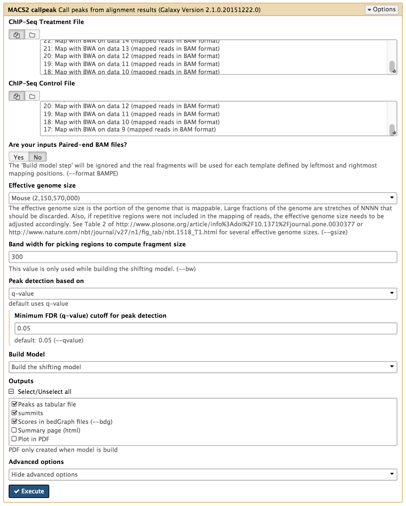
>
> 2. Rename your files after **MACS2 callpeak** finishes to reflect the origin and contents.
{: .hands_on}

# Step 7: Inspection of peaks and aligned data

It is critical to visualize NGS data on a genome browser after alignment to evaluate the "goodness" of the analysis. Evaluation criteria will differ for various NGS experiment types, but for ChIP-seq data we want to ensure reads from a Treatment/IP sample are enriched at peaks and do not localize non-specifically (like the Control/input condition).

**MACS2** generates BEDgraph and BED files that we will use to visualize read abundance and peaks, respectively, at regions **MACS2** determines to be TAL1 peaks using Galaxy's in-house genome browser, **Trackster**.

## Step 7.1: Inspection of peaks and aligned data with Trackster

First, we will reformat the peak file before we send it to Trackster, and then we will import a gene annotation file so we can visualize aligned reads and TAL1 peaks relative to gene features and positions.

> ###  Hands-on: Inspection of peaks and aligned data with Trackster
>
> 1. **Cut** : Run the tool **Cut** on the peak file choosing columns "c1,c2,c3,c4" and rename this file to reflect the origin and contents.
>
> 2. Import the gene annotations file from Zenodo 
>
> 3. Click "Visualizations" on the page header and select "New Track Browser".
>
>    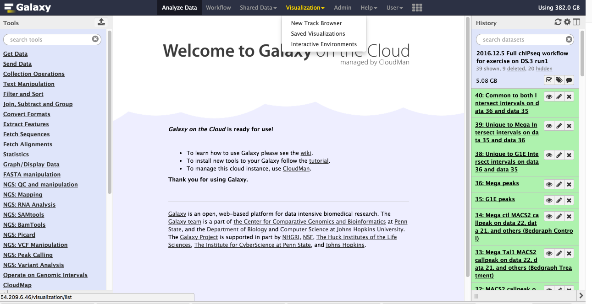
>
> 4. Give this session a descriptive name and choose "mm10" as the "Reference genome build (dbkey)".
>
>    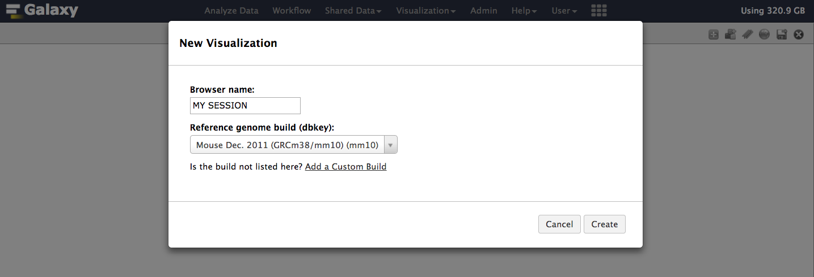
>
> 5. Click "Add Datasets to visualization" and select the history containing the data from this analysis. Select the BEDgraph files and the peak files that you renamed.
>
>    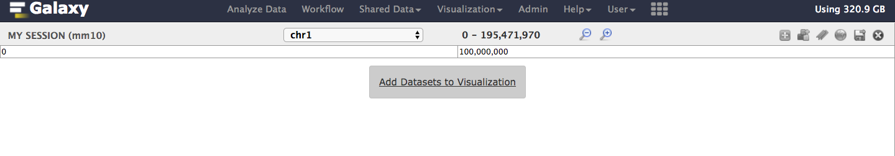
>
>    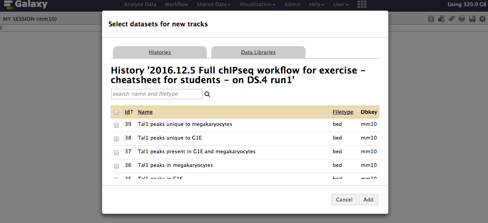
>
> 6. Navigate to the Runx1 locus (chr16:92501466-92926074) to inspect the aligned reads and TAL1 peaks.
>
>    > ###  Questions
>    >
>    > 1. What do you see at the Runx1 locus in Trackster?
>    > 2. What gene(s) other than Runx1 could be regulated by TAL1?
>    >
>    >    

>    >    
Click to view answers

>    >    <ol type="1">
>    >    <li>Directly upstream of the shorter Runx1 gene models is a cluster of 3 TAL1 peaks that only appear in the G1E cell type, but not in Megakaryocytes. Further upstream, there are some shared TAL1 peaks in both cell types.</li>
>    >    <li></li>
>    >    </ol>
>    >    

>    {: .question}
>
>    
{: .hands_on}

## Step 7.2: Inspection of peaks and aligned data with IGV
We show here an alternative to Trackster, [IGV](http://software.broadinstitute.org/software/igv/).

> ###  Hands-on: IGV
>
> 1. Open IGV on your local computer.
> 2. Click on each 'narrow peaks' result file from the MACS2 computations on 'display with IGV' --> 'local Mouse mm10'
> 3. For more information about IGV see [here]({{site.baseurl}}/topics/introduction/tutorials/igv-introduction/tutorial.html)

# Step 8: Identifying unique and common TAL1 peaks between stages

We have processed ChIP-seq data from two stages of hematopoiesis and have lists of TAL1 occupied sites (peaks) in both cellular states. The next analysis step is to identify TAL1 peaks that are *shared* between the two cellular states and peaks that are *specific* to either cellular state.

> ###  Hands-on: Identifying unique and common TAL1 peaks between states
>
> 1. **Intersect intervals** : Run the tool **Intersect intervals** to find peaks that exist both in G1E and megakaryocytes.
>
>    Select the "TAL1 G1E peaks" and "TAL1 Mega peaks" files as the inputs.
>
>    Running this tool with the default settings will return overlapping peaks of both files.
>
> 2. **Intersect intervals** : Run the tool **Intersect intervals** to find peaks that exist only in G1E.
>
>    - Select "TAL1 G1E peaks" as the first input and "TAL1 Mega peaks" as the second input file.
>    - **Report only those alignments that \*\*do not\*\* overlap the BED file**: Yes
>
> 3. **Intersect intervals** : Run the tool **Intersect intervals** to find peaks that exist only in megakaryocytes.
>
>    - Select "TAL1 Mega peaks" as the first input and "TAL1 G1E peaks" as the second input file.
>    - **Report only those alignments that \*\*do not\*\* overlap the BED file**: Yes
>
> 4. Re-name the three files we generated to reflect their contents.
>
>    > ###  Questions
>    >
>    > 1. How many TAL1 binding sites are common to both G1E cells and megakaryocytes?
>    > 2. How many are unique to G1E cells?
>    > 3. How many are unique to megakaryocytes?
>    >
>    >    

>    >    
Click to view answers

>    >    <ol type="1">
>    >    <li>1 region</li>
>    >    <li>407 regions</li>
>    >    <li>139 regions</li>
>    >    </ol>
>    >    

>    {: .question}
{: .hands_on}

# Step 9: Generating Input normalized coverage files

We will generate Input normalized coverage (bigwig) files for the ChIP samples, using **bamCompare** tool from **deepTools2**. **bamCompare** provides multiple options to compare the two files (e.g. log2ratio, subtraction). We will use log2 ratio of the ChIP samples over Input.

> ###  Hands-on: Generate Input-normalized bigwigs
>
> 1. Search for **bamCompare** in the Galaxy tool panel.
> 2. Select the treatment sample, for example "Megakaryocyte_Tal1_R2.bam", as the first sample, and the input sample "Megakaryocyte_Input_R2.bam" as the second sample.
> 3. Check that you are using log2 ratio to compare the samples, and click "Execute".
> 4. Repeat this step for all treatment and input samples: Megakaryocyte_Tal1_R1.bam and Megakaryocyte_Input_R1.bam; G1E_Tal1_R2.bam and G1E_Input_R2.bam; G1E_Tal1_R1.bam and G1E_Input_R1.bam.
>
> 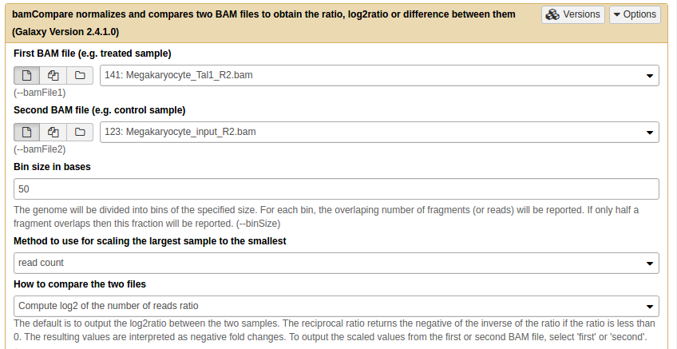
{: .hands_on}

# Step 10: Plot the signal on the peaks between samples

Plotting your region of interest will involve using two tools from the **deepTools** suite.
+ computeMatrix : Computes the signal on given regions, using the bigwig coverage files from different samples.
+ plotHeatmap : Plots heatMap of the signals using the computeMatrix output.

optionally, you can also use `plotProfile`to create a profile plot using to computeMatrix output.

### computeMatrix

> ###  Hands-on: calculate signal matrix on the MACS2 output
>
> 1. Search for **computeMatrix** in the Galaxy tool panel.
> 2. Under "Regions to plot", select the MACS2 output (narrowpeaks) for G1E cells (TAL1 over Input).
> 3. Under "Score file", select the bigWigs (log2 ratios from bamCompare).
> 4. From "computeMatrix has two main output options", select "reference point".
> 5. Under "The Reference point for plotting", select "Center of region".
> 6. For the two fields region upstream and downstream choose both times the value '5000'
>
> 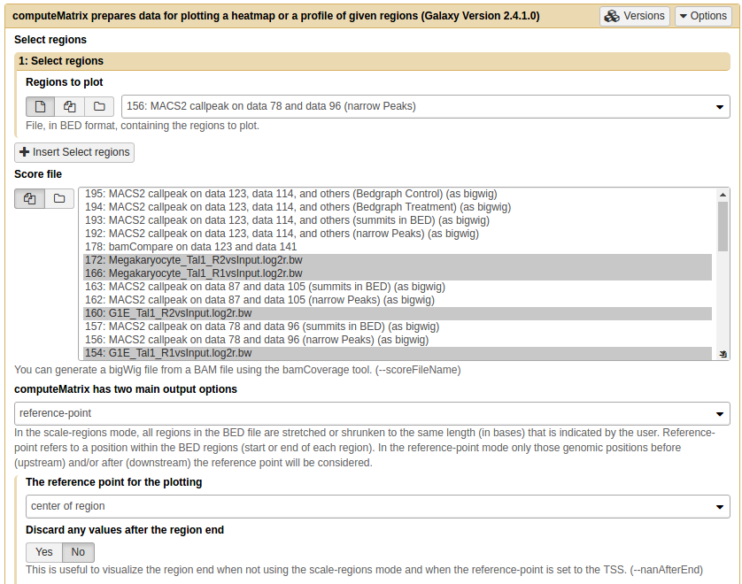
>
> 7. Under advanced options , select "Yes" for "Convert missing values to zero" and "Skip zeros".
> 8. Select "Execute"
>
> 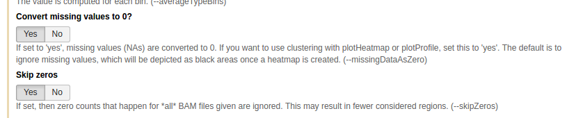
{: .hands_on}

### plotHeatmap

> ###  Hands-on: plot a Heatmap using computeMarix output
>
> 1. Select "plotHeatmap" from the Galaxy tool panel.
> 2. Select the computeMatrix output as an input.
> 3. Under advanced options, go to "Labels for the samples ", and enter sample labels (in the order you added them in compueMatrix ), separated by space.
> 4. Click "Execute"
>
> 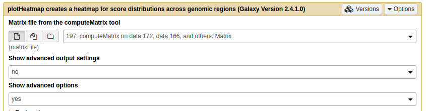
>
> The output shall look like this :
>
> 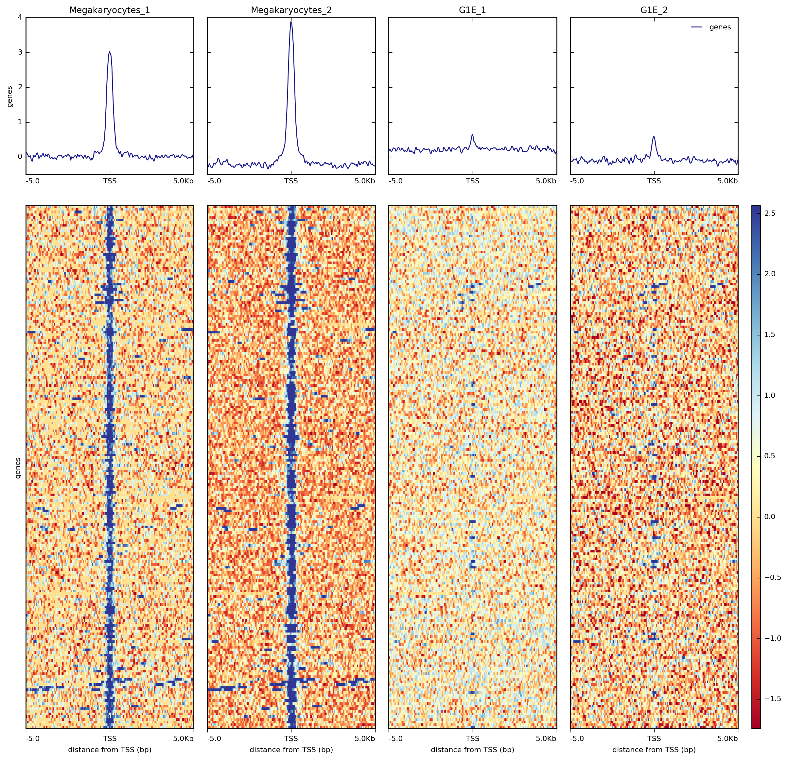
{: .hands_on}

# Additional optional analyses

## Assessing GC bias

A common problem of PCR-based protocols is the observation that GC-rich regions tend to be amplified more readily than GC-poor regions.

We will now check whether the samples have more reads from regions of the genome with high GC.

> ###  Hands-on: Assessing GC bias
>
> 1. **computeGCbias** : Run the tool **computeGCbias** from the **deepTools** package.
>
>    - First, select an aligned BAM files for an input dataset
>    - **Reference genome**: locally cached
>    - **Using reference genome**: mm10
>    - **Effective genome size**: user specified
>    - **Effective genome size**: 10000000
>    - **Fragment length used for the sequencing**: 50
>
>    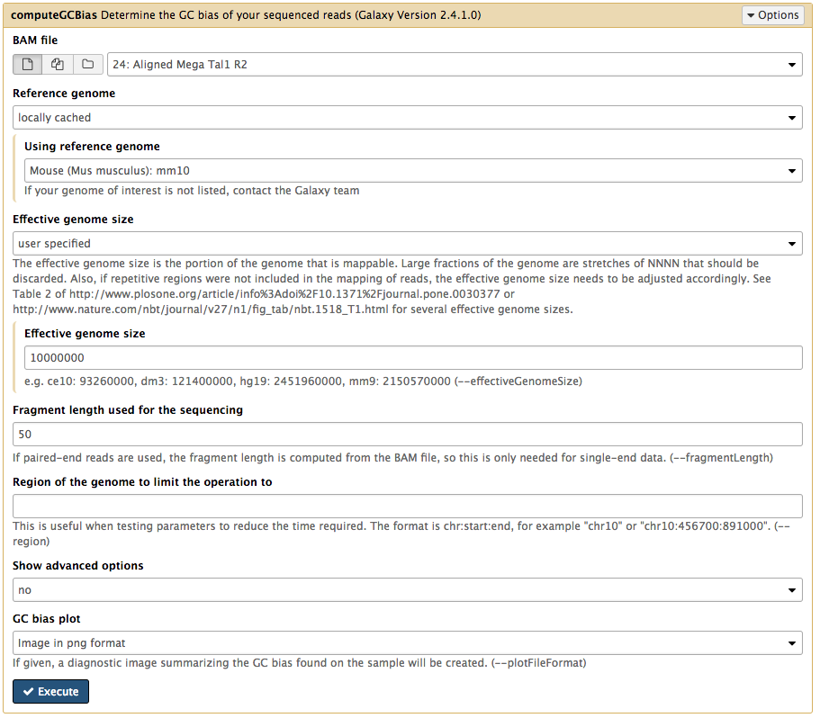
>
>    > ###  Questions
>    >
>    > 1. Why would we worry more about checking for GC bias in an input file?
>    > 2. Does this dataset have a GC bias?
>    >
>    >    

>    >    
Click to view answers

>    >    <ol type="1">
>    >    <li>In an input ChIP-seq file, the expectation is that DNA fragments are uniformly sampled from the genome. This is in contrast to an IP ChIP-seq file where it is *expected* that certain genomic regions contain more reads  (i.e. regions that are bound by the protein that is immunopurified). Therefore, non-uniformity of reads in the input sample could be a result of GC-bias, whereby more GC-rich fragments are preferentially amplified during PCR.</li>
>    >    <li>To answer this question, run the **computeGCbias** tool as described above and check out the results. What do YOU think? For more examples and information on how to interpret the results, check out the tool usage documentation [here](https://deeptools.readthedocs.io/en/latest/content/tools/computeGCBias.html#background).</li>
>    >    </ol>
>    >    

>    {: .question}
>
> 2. **correctGCbias** : Explore the tool **correctGCbias** from the **deepTools** package.
>
>    > ###  Questions
>    >
>    > 1. What does the tool **correctGCbias** do?
>    > 2. What is the output of this tool?
>    > 3. What are some caveats to be aware of if using the output of this tool in downstream analyses?
>    >
>    >    

>    >    
Click to view answers

>    >    <ol type="1">
>    >    <li>The **corectGCbias** tool removes reads from regions with higher coverage than expected (typically corresponding to GC-rich regions) and adds reads to regions with lower coverage than expected (typically corresponding to AT-rich regions).</li>
>    >    <li>The output of this tool is a GC-corrected file in BAM, bigWig, or bedGraph format.</li>
>    >    <li>The GC-corrected output file likely contains duplicated reads in low-coverage regions where reads were added to match the expected read density. Therefore, it is necessary to *avoid* filtering or removing duplicate reads in any downstream analyses.</li>
>    >    </ol>
>    >    

>    {: .question}
{: .hands_on}

For additional information on how to interpret **computeGCbias** plots, read the information [here](https://deeptools.readthedocs.io/en/latest/content/tools/computeGCBias.html)

# Conclusion
{:.no_toc}

In this exercise you imported raw Illumina sequencing data, evaluated the quality before and after you trimmed reads with low confidence scores, aligned the trimmed reads, identified TAL1 peaks relative to the negative control (background), and visualized the aligned reads and TAL1 peaks relative to gene structures and positions. Additional, you assessed the "goodness" of the experiments by looking at metrics such as GC bias and IP enrichment.
