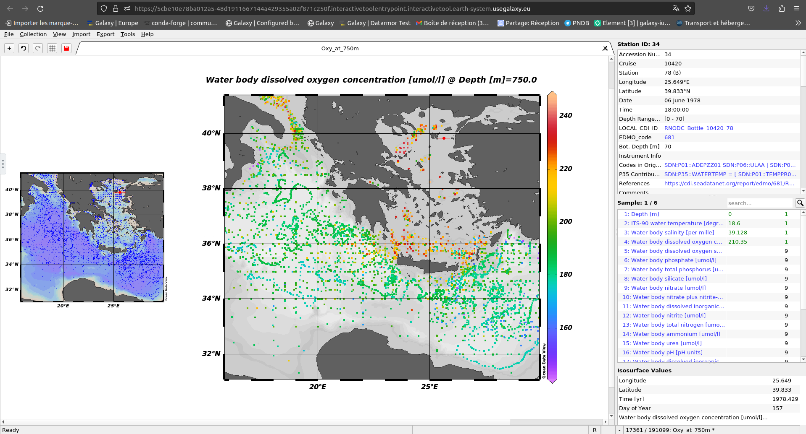
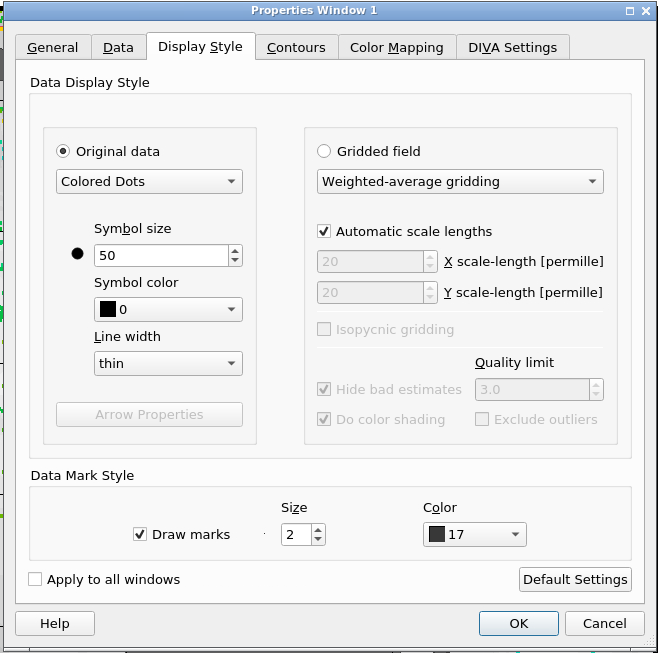

# Introduction

Through this tutorial you will learn in the first part how to import, visualise and extract data from an ODV collection through using ODV Galaxy interactive tool. In a second time you will learn to use DIVAnd using as inputs the outputs from ODV.

Ocean Data View (ODV) is a software package for the interactive exploration, analysis and visualization of oceanographic and other geo-referenced profile, time-series, trajectory or sequence data. To know more about ODV go check the [official page](https://odv.awi.de/)

DIVAnd (Data-Interpolating Variational Analysis in n dimensions) performs an n-dimensional variational analysis/gridding of arbitrarily located observations. Observations will be interpolated/analyzed on a curvilinear grid in 1, 2, 3 or more dimensions. See the [official page](https://gher-uliege.github.io/DIVAnd-presentation/#1)

> <agenda-title></agenda-title>
>
> In this tutorial, we will cover:
>
> 1. TOC
> {:toc}
>
{: .agenda}

# Managing ODV Galaxy interactive tool
ODV is now integrated in Galaxy as an interactive tool. This kind of tools is working differently than classical tools as it allows the user to interact with a dedicated graphical interface. This kind of tools is used to give access to Jupyter notebooks, RStudio or R Shiny apps for example. 

To use ODV, you need to use the , you can specify input datasets from your hisrtory you want to use in ODV, then press the **execute** button to launch a ODV instance. When the graphical user interface of ODV is ready to be used, a URL will be displayed at the top of the Galaxy center panel. If you don't see it, you can see and access it through the "Active InteractiveTools" space of the "User" menu or you can click on  on the tool in the history.

Once you finished your work on ODV, if you want to retrieve data and/or entire project, you need to save files in ODV/galaxy/outputs, then quit ODV properly through the "Project" Menu tab.

> <details-title>Short introduction on how Galaxy works</details-title>
>
> You can come back to where you left off the tutorial anytime by clicking .
>
> > <hands-on-title>Log in to Galaxy</hands-on-title>
> > 1. Open your favorite browser (Chrome, Safari or Firefox as your browser, not Internet Explorer!)
> > 2. Browse to your [Galaxy instance](https://earth-system.usegalaxy.eu/)
> > 3. On the top pannel go to **Login or Register**
> >
> >
> {: .hands_on}
>
> The Galaxy homepage is divided into three panels:
> * Tools on the left
> * Viewing panel in the middle
> * History of analysis and files on the right
>
> 
>
> The first time you use Galaxy, there will be no files in your history panel.
{: .details}

> <hands-on-title>Deploy your own ODV instance</hands-on-title>
>
> 1. Create a new history for this tutorial nd give it a name (example: “Ocean's variables”) for you to find it again later if needed.
>
>    
> 
> 2. Import a ODV collection data locally as a zip folder.
>
>    
>
>  
> 3.  with the following parameters:
>    - *"Select if you are using a ODV collection in a zip folder or if you have your own raw data"*: `The data you are using are a ODV collection in a zip folder`
>    - *"ODV collection in a zip folder."*: `Eutrophication_Med_profiles_2022_unrestricted_SNAPSHOT_2023-10-24T16-39-44.zip`
>
> 
>
> 4. Click on **Run Tool**
>
> 
>
{: .hands_on}

> <details-title> Some complementary information about your data </details-title>
>
{: .details}

# Ocean Data View
## Visualise your Data 

> <tip-title>Copy pasting between computer and ODV</tip-title>
> You can expand the ODV left panel (where there are 3 dots, vertically) to access the "clipboard" menu, and paste the content you want to paste on a ODV form. From there you can copy paste everything from one side to the other. Then, click outside of this panel to collapse it.
> 
> 
{: .tip}

> <tip-title>ODV - Disconnected</tip-title>
> If at one point your ODV interface becomes grey with a red panel on the top "X ODV - Disconnected", do NOT panic ;) you just need to reload your tab (circular arrow top left)
{: .tip}

> <hands-on-title>Loading data</hands-on-title>
>
> 1. Click on close of the pop-up screen for the check for Updates
> 2. Go the top left and click on **File**, then on **Open...**
> 3. On the pop-up screen on the left pannel select **ODV**, then the folder **galaxy**, then **data**. 
> You should see a folder open it (doucl clicking)
> 4. Select the file with a .odv extension 
> 
> 5. Click on **Open** in th bottom right
> 
> There your data should be openning an you can now visualise them !
{: .hands_on}

> <question-title></question-title>
>
> 1. What are the longitude and latitude of the red dot ?
>
> > <solution-title></solution-title>
> >
> > 1. On the to right window you can read Longitude 34°E and Latitude 32.332°N.
> >
> {: .solution}
>
{: .question}

## Subset Data

> <hands-on-title>Create a subset</hands-on-title>
> 1. On the left smaller map right click and select **Zoom**
> 2. Then move your cursor on the map you should see a red rectangle moving along
> 3. Reduce the rectangular to have the selection you want on the map. It can be something similar to the following image (no need to be exactly the same)
> 
> 4. Once you're happy with your selection click on **Enter** on your keyboard.
> 
>
> Here you have created a a subset of your data. 
{: .hands_on}

> <tip-title>Change your visualisation properties</tip-title>
> 1. Go on the central map 
> 2. Click right and select **Properties...**
> 3. For example make your data dots bigger in "Display Style" increase the number below "Symbol Size" to 50, click **OK**
> 
>
> You can now see bigger dots representing your data.
> 
>
> If you want to save it now that you already saved it once in the right folder outputs you just have to click lef on te save icon top left when it's red.
{: .tip}

## Save Data


> <hands-on-title>Save your subset view</hands-on-title>
> 1. On the top left of your screen you can see a red save button. Right click on it.
> 2. In the pop-up screen go to the folder **ODV**, **galaxy**, **outputs**.
> 3. In **File name** rename your view (for example subset_Eutrophication_Med_profiles_2022), and **Save**.
{: .hands_on}

> <hands-on-title>Save your subset map</hands-on-title>
> 1. Click right on the map select **Save Plot As...**
> 2. In the pop-up screen go to the folder **ODV**, **galaxy**, **outputs**.
> 3. In **File name** rename your view (for example subset_Eutrophication_Med_profiles_2022_1)
> 4. In **Files of type** select `PNG (*.png *.PNG)` and **Save** then **OK** and **OK**.
{: .hands_on}

> <hands-on-title>Extract your variables in netcdf data</hands-on-title>
> Now we want to extract and save the right parameters of your data in netcdf format.
> 1. Go to the the left and click on **Export**, **Data** and **NetCDF File...**
> 2. In the pop-up screen go to the folder **ODV**, **galaxy**, **outputs**.
> 3. Click **Save**
> 4. A new pop-up window opens "Select Extended Metadata Varaiables for Export" Let the 56 items selected and click **OK**
> 5. "Select Data Varaiables for Export"  `here you need to select 1: Depth[m]`, ̀`4: Water body dissolved oxygen concentration [umol/l]`, `6: Water body phosphate [umol/l]` and click **OK**
> 
> 6. "NetCDF File Properties" change the **Longitude range** to `[-180 ... 180] degrees_E`, then select `Export metadata quality flags` and `Export data quality flags` and **OK**.
> 7. And **OK** again
>
> You now know how to export and save the right variables on ODV to netCDF data.
{: .hands_on}

Now, if you have finished with your analysis you can exit ODV. To do so you need to do it properly. 

> <hands-on-title>Exit ODV and go back on Galaxy</hands-on-title>
> 1. On th top left click on **File** select **Exit**
> 2. If you want to save the other window also click on **Yes**. Here we don't need it so click **No**.
>
> You can now go back on your Galaxy instance.
> Now, after waiting for everything to turn green in your history, you can see 3 new outputs
> 
>
> In the history panel click on the  (eye) icon of your output.
>
> You can now visualize the outputs in galaxy middle pannel. 
> 
> 
> 
{: .hands_on}

# Conclusion

Great you now know how to extract ocean's variables from an ODV collection.

# Extra information
Coming up soon follow ups tutorials on Coastal Water Dynamics workflow (and other Earth-System related trainings). Keep an  open if you are interested !

