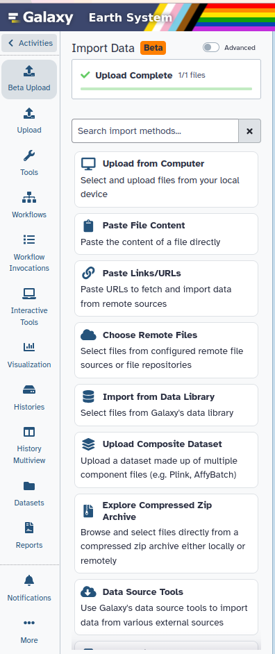
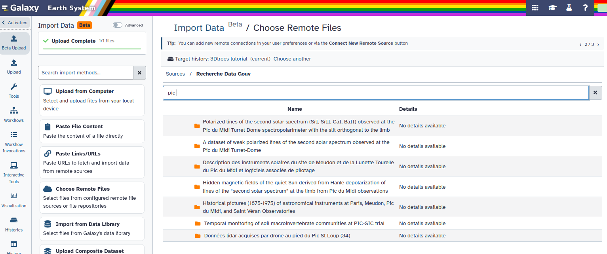
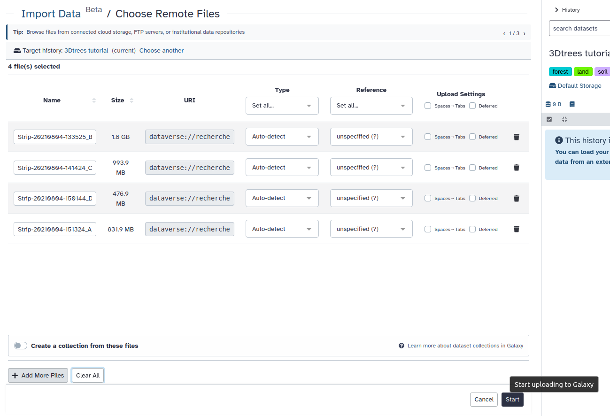
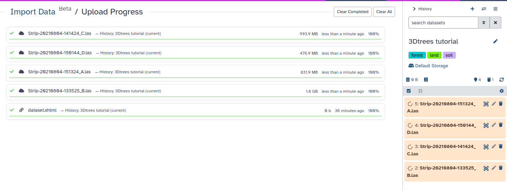
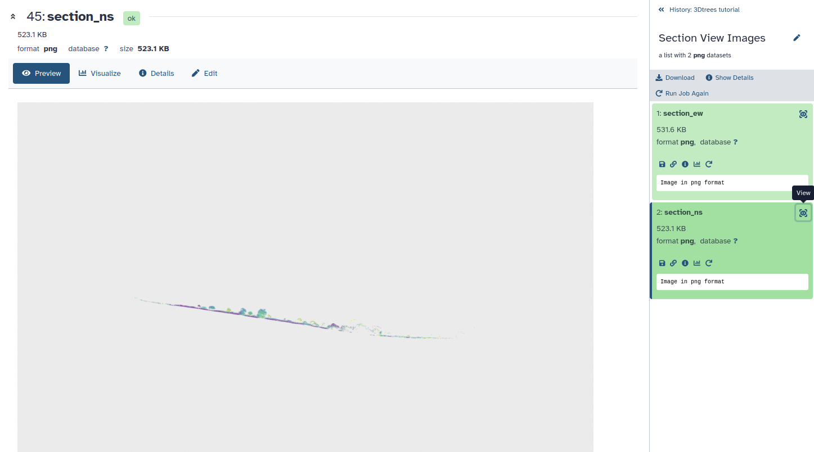
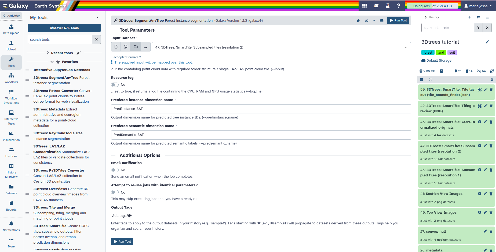
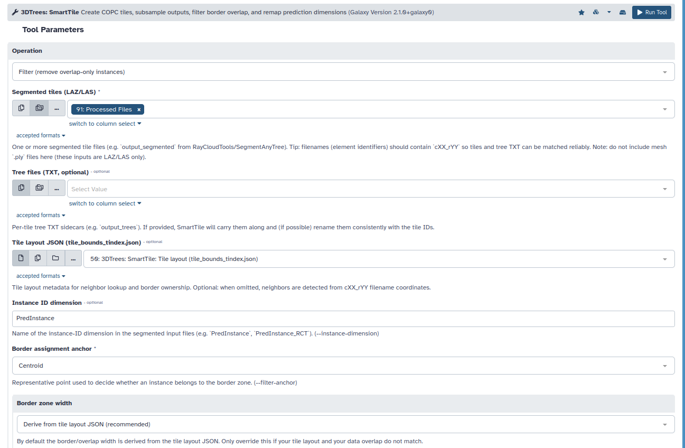
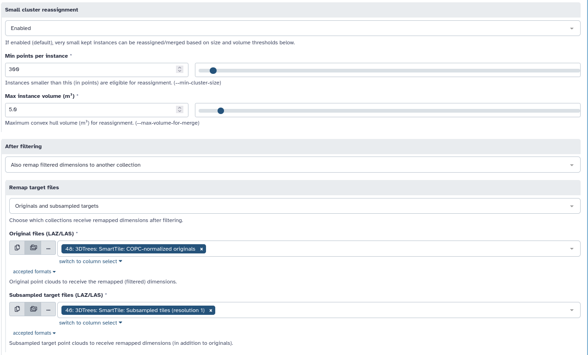
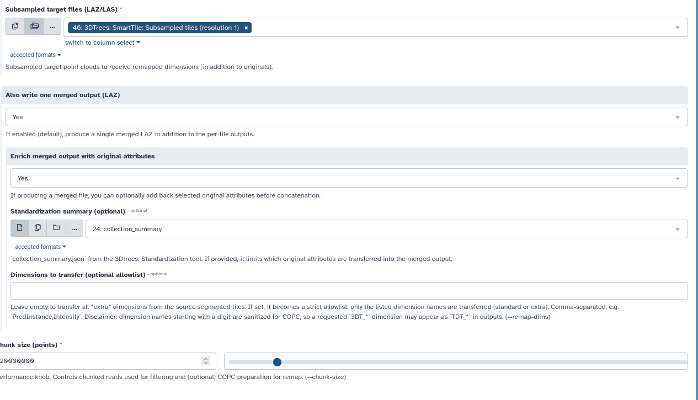

Forests are three-dimensional. A view from above shows the canopy, but tells us less about the
vegetation layers below it. LiDAR (Light Detection and Ranging) uses laser pulses to measure
positions on vegetation and the ground. These measurements form a *point cloud*: a set of points
with horizontal coordinates and an elevation.

LiDAR collected from an aircraft or drone can help ecologists study tree height, crown size,
canopy gaps, and changes in forest structure. To study individual trees, we first need to group
the points that belong to each tree. This is called *individual-tree segmentation*.

This tutorial is for interested beginners, ecology students, and ecologists. You will use the
3Dtrees tools in Galaxy to prepare one point cloud and predict individual trees with
SegmentAnyTree (SAT). At the end, you will have a point cloud with tree labels and an interactive
Potree view for inspecting the results in your browser.

> <tip-title>New to Galaxy?</tip-title>
>
> If Galaxy is new to you, first try [Galaxy Basics for everyone]().
>
{: .tip}

> <agenda-title></agenda-title>
>
> In this tutorial, we will cover:
>
> 1. TOC
> {:toc}
>
{: .agenda}

# From point clouds to individual trees

We will import one file, standardize it, and make quick overview images. Next, we will prepare
smaller processing units, predict trees, and transfer the predictions to a denser point cloud.
Finally, we will inspect the result in 3D. Each step prepares an output for the next one.

## Get data

The data were collected by drone near Pic Saint-Loup in southern France. We use only the smallest
file, `Strip-20210804-150144_D.las` (about 455 MB), to keep the tutorial manageable. LAS is a common
format for LiDAR points; LAZ is its compressed form. Both can store extra information for each
point, such as color or a predicted tree identifier.

> <details-title>About the Pic Saint-Loup dataset</details-title>
>
> The data were collected in June 2021 with a YellowScan Surveyor scanner on a DJI Matrice 600 Pro
> drone. The dataset has about 200--250 points per square metre and is available under the Etalab
> Open License 2.0.
>
> The four files total approximately 3.8 GB. The associated paper states that they match four flight
> areas. A and B are spatially separate, while the published bounding boxes of C and D overlap;
> consequently, these files should not be treated as four non-overlapping tiles of one continuous
> survey.
>
> See the [dataset record](https://entrepot.recherche.data.gouv.fr/dataset.xhtml?persistentId=doi%3A10.15454%2FDMYWPB)
> and [dataset documentation](https://pmc.ncbi.nlm.nih.gov/articles/PMC10884421/) for provenance and
> reuse information.
>
{: .details}

> <hands-on-title>Import one flight-area file</hands-on-title>
>
> 1. Create a new history for this tutorial.
>
>    
>
> 2. Open **Upload**, then select ** Choose Remote Files**.
> 
> 
>
> 3. Search for `recherche`, then open **Recherche Data Gouv**.
> 4. Search for `pic`, then open **Données lidar acquises par drone au pied du Pic St Loup (34)**.
>
> 
>
> 5. Select only `Strip-20210804-150144_D.las`, then select **Start**.
>
> 
>
> 6. Wait for the dataset to turn green in the history.
>
> 
>
> > <tip-title>Check the file type</tip-title>
> >
> > Check that Galaxy recognizes the datatype as **las**.
> >
> >  
> {: .tip}
> 
> 7. Rename the dataset to `Strip-20210804-150144_D.las` if the remote import did not preserve its
>    filename. Do not build a four-file collection for this tutorial.
>
>    
{: .hands_on}

# Standardize the point cloud

Files from different scanners can store point information in different ways. Standardization
checks the file and prepares a consistent format for the next tools. It checks the file header,
spatial bounds, point density, and coordinate reference system, which describes where the points
are located on Earth.

The tool writes a standardized LAZ file, a metadata summary, and a footprint showing the area
covered by the survey. This helps prevent file-format problems later; it does not identify trees.

> <hands-on-title>Standardize the example LAS file</hands-on-title>
>
> 1.  with the following parameters:
>    - *"Mode"*: `Single File Standardization`
>        -  *"Point Cloud File"*: `Strip-20210804-150144_D.las`
>
>
>    > <comment-title>Choose the output for the next step</comment-title>
>    >
>    > Use `pc_standardized`, the standardized point cloud, in the next tools. Keep the metadata and
>    > footprint as supporting information about the input.
>    {: .comment}
>
{: .hands_on}

> <question-title>Why standardize a point cloud?</question-title>
>
> Select all correct statements.
>
> - [ ] It checks file information and prepares a consistent format for the next tools.
> - [ ] It creates a summary and a footprint of the input.
> - [ ] It assigns every tree a unique identifier.
> - [ ] It proves that later segmentation results are accurate.
> - [ ] It turns unrelated flight areas into one continuous survey.
>
> > <solution-title></solution-title>
> >
> > The first two statements are correct. Tree identifiers are created later by the segmentation
> > model. Standardization cannot prove that those predictions are accurate or make separate flight
> > areas into one continuous survey.
> >
> {: .solution}
>
{: .question}

The standardized point cloud, its metadata, and its footprint should now appear in the history.

# Get a first impression with overview images

Before predicting trees, take a quick look at the input. The Overviews tool creates images you
can open directly in Galaxy, without a 3D viewer. Top views show the survey shape and canopy gaps.
Side views help you recognize the ground, taller vegetation, and layers within the forest.

> <hands-on-title>Create and inspect overview images</hands-on-title>
>
> 1.  with the following parameters:
>    -  *"Point Cloud Collection"*: `pc_standardized` (output of **3DTrees: LAS/LAZ Standardization** )
>
> 2. Open the **Top View Images** and **Section View Images** collections in the history and view
>    their images. With the default settings, expect four images in total.
>
>    > <comment-title>Reading the overview</comment-title>
>    >
>    > The input field is called **Point Cloud Collection**, but select only `pc_standardized` for
>    > this tutorial. The output collections simply group the overview images.
>    {: .comment}
>
{: .hands_on}

> <question-title>What can the overview tell you?</question-title>
>
> Which view helps you spot canopy gaps, and which helps you see vegetation above the ground?
>
> > <solution-title></solution-title>
> >
> > The top view helps reveal gaps in the canopy. A side view shows the vertical arrangement of
> > points above the ground. These images give a first impression; they do not yet identify trees.
> >
> {: .solution}
>
{: .question}

# Prepare the data for segmentation

Large point clouds can be too big to process at once. SmartTile can divide them into smaller
spatial *tiles*. When tiles are created, an overlapping margin, or *buffer*, gives the model more
context around trees near each edge.

SmartTile also reduces the number of points, a step called *subsampling*. The default coarse
resolution is 0.1 m: points are reduced using a grid of 10 cm cubes. This reduces processing work,
but also removes fine detail. A denser version is kept for transferring the predictions later.

Keep the default settings for this tutorial. The **Skip tiling below (MB)** setting means that a
small single file such as this one may stay as one processing unit. Subsampling still takes place;
you do not need multiple tiles to continue.

> <hands-on-title>Prepare processing units and subsampled points</hands-on-title>
>
> 1.  with the following parameters:
>    - *"Operation"*: `Tile (COPC normalize + tile + subsample)`
>        -  *"Input point clouds (LAZ/LAS)"*: `pc_standardized` (output of **3DTrees: LAS/LAZ Standardization** )
>
> Five outputs should appear: the normalized source cloud, two subsampled collections, a layout
> preview, and a tile-layout JSON file describing the processing boundaries.
>
>    > <comment-title>Keep the outputs for later steps</comment-title>
>    >
>    > Use the coarse `output_subsampled_res2` collection for SAT. Keep `output_subsampled_res1`,
>    > `output_original_copc`, and `output_tile_bounds_json` for post-processing. These collections
>    > come from your single input file; they are not the four original flight areas.
>    {: .comment}
>
{: .hands_on}

> <question-title>Why use overlapping processing tiles?</question-title>
>
> 1. Why is a buffer useful when a tree crosses a processing boundary?
> 2. What trade-off is introduced by increasing the buffer width?
>
> > <solution-title></solution-title>
> >
> > 1. It gives the model points from beyond the tile edge, reducing the chance of cutting off a
> >    tree's surrounding context. A buffer does not guarantee that every tree is fully included.
> > 2. A wider buffer provides more context, but repeats more points and increases processing work.
> >    The same tree may then be predicted in neighboring tiles.
> >
> {: .solution}
>
{: .question}

# Identify individual trees with SegmentAnyTree

SegmentAnyTree is a trained deep-learning model that adds two predictions to each point.
*Semantic segmentation* assigns a class: `PredSemantic` distinguishes tree from non-tree points.
*Instance segmentation* separates individual trees: `PredInstance` gives the points belonging to
each predicted tree a shared identifier.

For example, two neighboring trees can have the same semantic class but different instance IDs.
Ground points belong to the non-tree class; SAT does not provide a detailed vegetation-type map.

> <hands-on-title>Predict trees on the coarse point cloud</hands-on-title>
> 
> 1.  with the following parameters:
>    -  *"Input Dataset"*: `output_subsampled_res2` (output of **3DTrees: SmartTile** )
>    - *"Predicted instance dimension name"*: `PredInstance`
>    - *"Predicted semantic dimension name"*: `PredSemantic`
>
> Select the `output_subsampled_res2` collection as the input so Galaxy runs SAT on each processing
> unit. Check the form before running; processing time depends on the data and server availability.
>
> 
>
>    > <comment-title>What SAT adds to the point cloud</comment-title>
>    >
>    > The output collection contains point clouds with `PredSemantic` and `PredInstance` added.
>    > These labels are model predictions, not measurements made by the LiDAR sensor.
>    {: .comment}
>
{: .hands_on}

> <question-title>Instance and semantic predictions</question-title>
>
> 1. Two neighboring crowns are both predicted as trees but have different `PredInstance` values.
>    What does each prediction dimension tell you?
> 2. Are `PredSemantic` and `PredInstance` measured directly by the LiDAR sensor?
>
> > <solution-title></solution-title>
> >
> > 1. `PredSemantic` describes the class. `PredInstance` identifies the individual tree.
> > 2. No. SAT adds them to the point cloud as predictions.
> >
> {: .solution}
>
{: .question}

# Combine predictions and restore point attributes

If processing tiles overlap, the same tree can appear in more than one prediction. SmartTile uses
the saved tile layout to remove instances belonging only to a tile's overlap margin. This step
addresses processing-tile overlap, not overlap between separate drone flights.

The settings below also transfer the prediction labels to denser points and combine the result
into one LAZ file. Attribute enrichment brings back available original information, such as RGB
colors. Transferring labels adds detail to the displayed cloud, but does not independently predict
or validate every added point.

> <hands-on-title>Filter overlap predictions and prepare the final cloud</hands-on-title>
>
> 1.  with the following parameters:
>    - *"Operation"*: `Filter (remove overlap-only instances)`
>        -  *"Segmented tiles (LAZ/LAS)"*: `output` (output of **3Dtrees: SegmentAnyTree** )
>        -  *"Tile layout JSON (tile_bounds_tindex.json)"*: `output_tile_bounds_json` (output of **3DTrees: SmartTile** )
>        - *"Border zone width"*: `Derive from tile layout JSON (recommended)`
>        - *"Small cluster reassignment"*: `Enabled`
>        - *"After filtering"*: `Also remap filtered dimensions to another collection`
>            - *"Remap target files"*: `Originals and subsampled targets`
>                -  *"Original files (LAZ/LAS)"*: `output_original_copc` (output of **3DTrees: SmartTile** )
>                -  *"Subsampled target files (LAZ/LAS)"*: `output_subsampled_res1` (output of **3DTrees: SmartTile** )
>            - *"Also write one merged output (LAZ)"*: `Yes`
>                - *"Enrich merged output with original attributes"*: `Yes`
>                - *"Standardization summary (optional)"*: leave unset for this single-file run
>
>
>    > <comment-title>Check the complete tool form</comment-title>
>    >
>    > 
>    > 
>    > 
>    {: .comment}
>
{: .hands_on}

Use `output_merged_with_originals` for visualization. It combines the predictions with available
original point attributes. Here, "merged" refers to outputs derived from file D, not to combining
the four flight areas.

# Inspect the result in Potree

The overview images gave us a quick first look. Potree now lets us rotate and zoom into the final
point cloud in a browser. We can inspect whether predicted tree boundaries look plausible and
look for missed trees, trees joined together, or one tree split into several instances.

> <hands-on-title>Create and open the interactive view</hands-on-title>
>
> 1.  with the following parameters:
>    -  *"Point Cloud Files"*: `output_merged_with_originals` (output of **3DTrees: SmartTile** )
>    - *"Generate interactive Viewer"*: `Yes`
>
> 2. When the tool finishes, open the **Potree Visualization** HTML output using its view icon.
> 3. Inspect a few neighboring trees from above and from the side. Compare colors by
>    `PredInstance` with the tree/non-tree classes in `PredSemantic`. If RGB is available, also
>    compare the original colors.
>
>    > <comment-title>Compare three views</comment-title>
>    >
>    > RGB shows the original colors, `PredSemantic` shows predicted classes, and `PredInstance`
>    > separates predicted trees. Instance colors represent identifiers, not species or confidence.
>    {: .comment}
>
{: .hands_on}

> <question-title>Does the segmentation look plausible?</question-title>
>
> Tick the observations that would support a plausible segmentation.
>
> - [ ] Most instance colors follow recognizable tree crowns rather than scattered patches.
> - [ ] Neighboring, visibly separate crowns usually have different instance identifiers.
> - [ ] Visible ground points are generally assigned to the non-tree class in `PredSemantic`.
> - [ ] Large numbers of crowns are split exactly along straight processing boundaries.
> - [ ] One instance identifier spans many unrelated crowns.
>
> Why is this only a visual inspection and not a quantitative accuracy analysis? Select all correct
> statements.
>
> - [ ] A result can look plausible and still contain missed, merged, or split trees.
> - [ ] This exercise does not compare predictions with independently labelled reference trees.
> - [ ] Measuring accuracy requires reference labels and a method for comparing them with predictions.
> - [ ] Potree automatically proves that every displayed tree is correct.
>
> > <solution-title></solution-title>
> >
> > In the first list, the first three observations support a plausible result. Straight splits at
> > processing boundaries and one ID covering unrelated crowns suggest errors.
> >
> > - [x] A result can look plausible and still contain missed, merged, or split trees.
> > - [x] This exercise does not compare predictions with independently labelled reference trees.
> > - [x] Measuring accuracy requires reference labels and a method for comparing them with predictions.
> > - [ ] Potree automatically proves that every displayed tree is correct.
> >
> > Potree helps you find visible problems. It does not calculate segmentation accuracy for you.
> >
> {: .solution}
>
{: .question}

> <warning-title>Results depend on the input</warning-title>
>
> Results may change with forest type, point density, and survey method. A result that looks good
> may still be wrong. Measuring accuracy requires labelled reference trees.
>
{: .warning}

# Optional next steps

Once the predictions have been checked, individual-tree labels can support studies of tree
height, crown size, and tree density. The wider point cloud also provides information about canopy
gaps and forest structure.

Other 3Dtrees models available through Galaxy extend the workflow:

- 
  offers an alternative for individual-tree segmentation and can also separate leaf and wood points.
- 
  can predict tree species from segmented trees, within the classes supported by its trained model.

These optional steps could be covered in future Galaxy tutorials.

> <details-title>Working with multiple point-cloud files</details-title>
>
> The appropriate workflow depends on what the files represent:
>
> - Process independent scans or flight areas separately.
> - Files that are true tiles of one survey may be processed together after checking their coordinate
>   systems, shared boundaries, and attributes.
> - Overlapping drone flights need their own alignment and overlap checks. SmartTile only handles
>   overlap between the tiles it creates.
>
> The Pic Saint-Loup files are four flight areas, not ready-made tiles. A and B are separate, while
> C and D overlap. This tutorial therefore uses only file D.
>
{: .details}

# Conclusion

You turned one drone LiDAR file into a point cloud with predicted tree labels and an interactive
view. Along the way, you checked the input, reduced processing work, predicted trees, and prepared
the result for inspection.

`PredSemantic` tells you the predicted class; `PredInstance` tells you which predicted tree a point
belongs to. These labels provide a starting point for ecological analysis. Your visual checks can
reveal obvious errors; measuring accuracy requires independently labelled reference trees.
