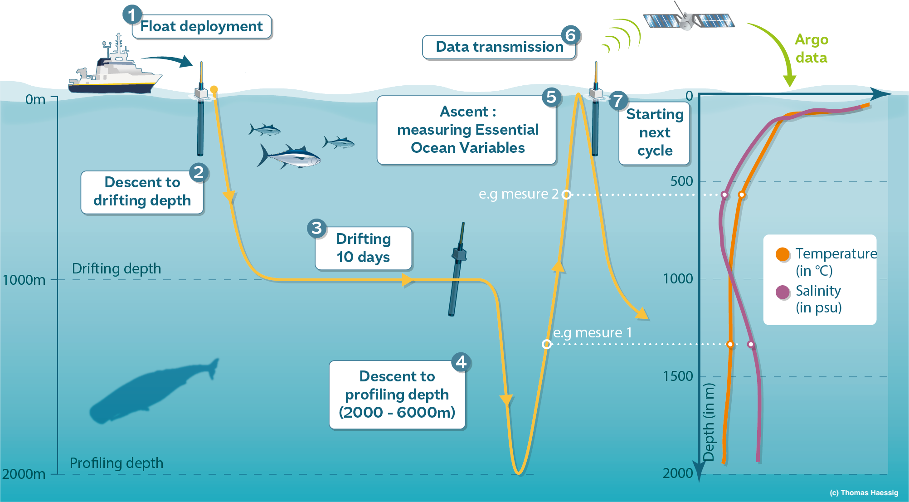
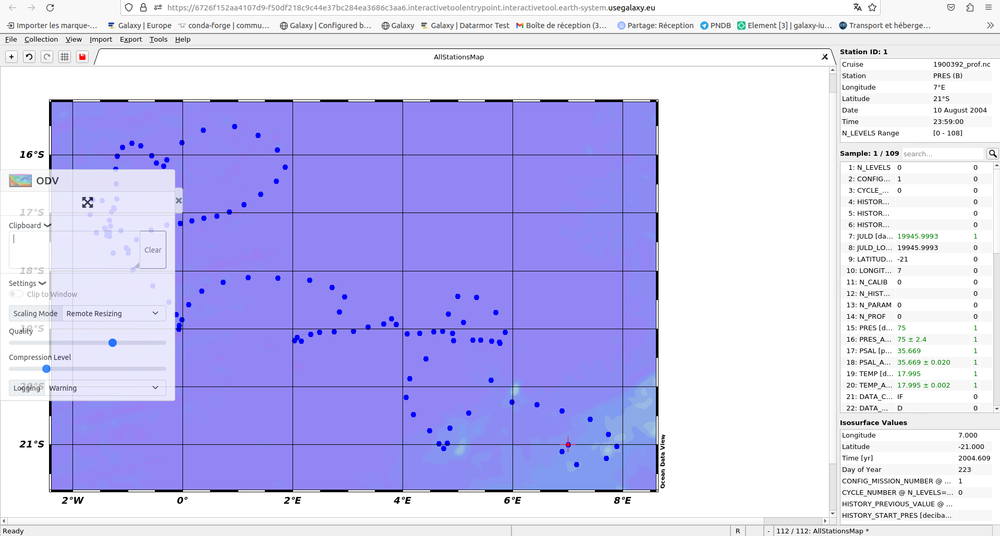
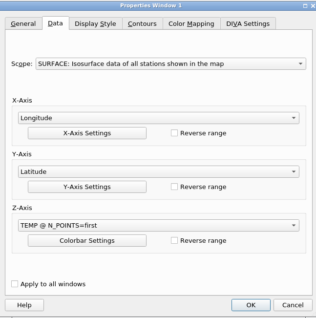
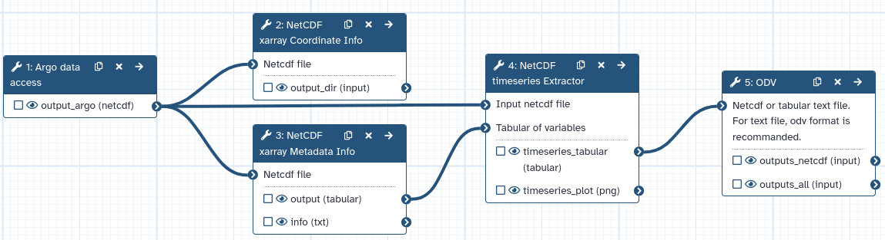

The ocean is a key component of the Earth's climate system. It thus needs continuous real-time monitoring to help scientists better understand its dynamics and predict its evolution.
All around the world, oceanographers have managed to join their efforts and set up a Global Ocean Observing System among which Argo is a key component.
Argo is an international program that collects information from inside the ocean using a fleet of robotic instruments that drift with the ocean currents and move up and down between the surface and a mid-water level. 

The data used in this tutorial are from the Argo gliders network. We are interested in the following variables: water temperature, latitude, longitude and time.
Our main objective is to plot the water temperature with respect to time. For this, we will be using the netCDF xarray tools available in the Galaxy Europe (or your favourite Galaxy Instance) server.

These tools are part of the Pangeo ecosystem in which the next generation of open-source analysis tools for ocean, atmosphere and climate science can be developed, distributed,
and sustained. These tools must be scalable to meet the current and future challenges of big data, and these solutions should leverage the existing expertise outside of
the geoscience community.

This tutorial is part of a set of tutorials on the [Galaxy Earth System](https://earth-system.usegalaxy.eu/) supported by the [EOSC FAIR-EASE project](https://fairease.eu/).

> <agenda-title></agenda-title>
>
> In this tutorial, we will cover:
>
> 1. TOC
> {:toc}
>
{: .agenda}

> <details-title>Short introduction on how Galaxy works</details-title>
>
> You can come back to where you left off the tutorial anytime by clicking .
>
> > <hands-on-title>Log in to Galaxy</hands-on-title>
> > 1. Open your favorite browser (Chrome, Safari or Firefox as your browser, not Internet Explorer!)
> > 2. Browse to your [Galaxy instance](https://earth-system.usegalaxy.eu/)
> > 3. On the top go to **Login or Register**
> >
> >
> {: .hands_on}
>
> The Galaxy homepage is divided into three panels:
> * Tools on the left
> * Viewing panel in the middle
> * History of analysis and files on the right
>
> 
>
> The first time you use Galaxy, there will be no files in your history panel.
{: .details}
---

# Argo gliders data
Argo is a global network of nearly 4000 autonomous probes measuring pressure, temperature and salinity from the surface to 2000m depth every 10 days.
The localisation of these probes is nearly random between the 60th parallels. All probes data are collected by satellite in real-time, processed by several data
centers and finally merged in a single dataset (collecting more than 2 million vertical profiles) made freely available to anyone through an FTP server or monthly zip snapshots.

Each Argo probe is an autonomous, free drifting, profiling float, i.e. a probe that can’t control its trajectory but can control its buoyancy and thus move up and down the water
column as it wishes. Argo floats continuously operate the same program, or cycle, illustrated in the figure below. After 9 to 10 days of free drift at a parking depth of about 1000m,
a typical Argo float dives down to 2000m and then shoals back to the surface while measuring pressure, temperature and salinity. Once it reaches the surface,
the float sends by satellite its measurements to a data center where they are processed in real-time and made freely available on the web in less than 24h00.

Here we will focus on the Caribbean Sea surrounding the Antilles during April and May. On the 9th of April 2021 an eruption of the volcano La Soufriere Saint Vincent (Antilles) occurred. 
Another tutorial on this event is available on the [Galaxy Training Network]().

## Get Argo data

> <tip-title> History set up on Galaxy </tip-title>
> > <hands-on-title> History management </hands-on-title>
> >
> > Create a new history for this tutorial and give it a name (example: “Argo data with Pangeo”) for you to find it again later if needed.
> > 
> > 
> {: .hands_on}
{: .tip}

> <hands-on-title> Arge data fetching </hands-on-title>
>
>
> 1.  with the following parameters:
>    -  *"We have preconfigured some mode of operations for you. What mode do you want to use?"*: `🊠standard mode simplifies the dataset, removes most of its jargon and returns a priori good data` 
>    -  *"How do you want to select your data of interest ?"*: `🗺 For a space/time domain` 
>        - *"Input longitude min (+east/-west)"*: `-75.0` 
>        - *"Input longitude max (+east/-west)"*: `-45.0` 
>        - *"Input latitude min (+north/-south)"*: `20.0` 
>        - *"Input latitude max (+north/-south)"*: `30.0`
>        - *"Input pressure min (db)"*: `0.0` 
>        - *"Input pressure max (db)"*: `10.0` 
>        - *"Input starting date"*: `2021-04` 
>        - *"Input ending date"*: `2021-06` 
>    -  *"Which kind of dataset do you want ?"*: `Physical parameters: temperature, salinity, pressure` 
>
> 2. **Run Tool**
> 3. After a couple of minutes, an `Argo data` output will appear green in your history.
> 4. Check that your data are in netcdf format with , it should be `netcdf`
>
> 
{: .hands_on}

# Argo data analysed, managed, and visualised by the Pangeo tools

## Xarray tools

First, we'll use 2 xarray netcdf tools. xarray, formerly known as xray, is a Python package which enables us to play with gridded data.
This package shares most of its features from numpy, but in a more convenient manner by keeping track of labels in arrays.
The gridded data is mainly available in netCDF data format. Thus xarray comes in very handy while dealing with netCDF files.

## Knowing more about hour data
After fetching the required Argo data, the following stage is to obtain the meta info or metadata of the file.
The very purpose of these steps is to obtain information about dimensions, variables, global attributes, etc. The coordinate info helps to
know about the actual data entries present under the various variables.

## Get metadata

> <hands-on-title> NetCDF dataset with Xarray metadata Galaxy Tool </hands-on-title>
>
> 1.  with the following parameters:
>    -  *"Netcdf file"*: `output_argo` (output of **Argo data access** )
>
{: .hands_on}

In the info output file, we can identify 4 different sections:

1. Dimensions: name of dimensions and corresponding number of elements;
2. Coordinates: contains coordinate arrays (longitude, latitude, level and time) with their values.
3. Data variables: contains all the variables available in the dataset. Here, we only have one variable. For each variable, we get information on its shape and values.
4. Global Attributes: at this level, we get the global attributes of the dataset. Each attribute has a name and a value.

## Coordinates information

> <hands-on-title> Get Coordinate information with Xarray Coordinate </hands-on-title>
>
> 1.  with the following parameters:
>    -  *"Netcdf file"*: `output_argo` (output of **Argo data access** )
>
{: .hands_on}

View  the 5 generated outputs:

1. latitude: a tabular file containing all the latitude values of our Xarray dataset;
2. longitude: a tabular file containing all the longitudes values;
3. level: this file contains information on all the different levels (here, we have surface data so level=0 meter);
4. time: this tabular file contains all the forecast times. In our case, these are relative to December 22, 2021;
5. version: this is a text file returning the Xarray package version. It is useful when publishing your Galaxy workflow.

## Timeseries visualisation

> <hands-on-title> NetCDF timeseries Extractor </hands-on-title>
>
> 1.  with the following parameters:
>    -  *"Input netcdf file"*: `output_argo` (output of **Argo data access** )
>    -  *"Tabular of variables"*: `output` (output of **NetCDF xarray Metadata Info** )
>    - *"Choose the variable to plot"*: ``
>    - *"Datetime selection"*: `No`
>    - In *"Advanced Plotting Options"*:
>        - *"Plot title"*: `Temperature`
>        - *"Label for x-axis"*: `Time`
>        - *"Label for y-axis"*: `Temperature`
>
>
{: .hands_on}

# Visualisation mapping with a Galaxy Earth System's tool

The Earth System is a complex and dynamic system that encompasses the interactions between the atmosphere, oceans, land, and biosphere.
Understanding and analyzing data from the Earth System Model (ESM) is essential, for example, to predict and mitigate the impacts of climate change.
The ESM that the project tries to implement includes coastal water dynamics, ocean bio-geochemical in-situ data, marine omics observations, volcano activities and land degradation.

To know more keep an  open for all related blogs on the [Galaxy Community Hub](https://galaxyproject.org/news/) or go try the tools directly on [Galaxy Earth System](https://earth-system.usegalaxy.eu/). 

## Ocean Data View (ODV)
Ocean Data View (ODV) is a software package for the interactive exploration, analysis and visualization of oceanographic and other geo-referenced profile, time-series, trajectory or sequence data. To know more about ODV go check the [official page](https://odv.awi.de/).

ODV is now integrated with Galaxy as an interactive tool. This kind of tool works differently than classical tools as it allows the user to interact with a dedicated graphical interface. Those tools are used to give access to Jupyter Notebooks, RStudio or R Shiny apps for example.

> <hands-on-title> Launch ODV</hands-on-title>
>
> 1.  with the following parameters:
>    - *"Select if you are using a ODV collection in a zip folder or if you have your own raw data"*: `The data you are using are Netcdf or tabular text files`
>        -  *"Netcdf or tabular text file. For text file, odv format is recommanded."*: `timeseries_tabular` (output of **NetCDF timeseries Extractor** )
>
> 2. Click on **Run Tool**
>
> 
>
> > <tip-title>ODV - Disconnected</tip-title>
> > If at one point your ODV interface becomes grey with a red panel on the top "X ODV - Disconnected", do NOT panic ;) you just need to reload your tab (circular arrow on top left)
> {: .tip}
>
> > <tip-title>Copy pasting between computer and ODV</tip-title>
> > You can expand the ODV left panel (where there are 3 dots, vertically) to access the "clipboard" menu, and paste the content you want to paste on an ODV form. From there you can copy-paste everything from one side to the other. Then, click outside of this panel to collapse it.
> >
> > 
> {: .tip}
{: .hands_on}

> <hands-on-title> Visualise with ODV </hands-on-title>
>
> In the new tab in ODV.
> 1. Click on close of the pop-up screen for the check for Updates
>
> 2. Go the top left and click on **File**, then on **Open...**
>
> 3. On the pop-up screen on the left panel select **ODV**, then the folder **galaxy**, then **data**. 
> You should see a folder open it (double clicking)
>
> 4. In the bottom of the pop-up window in **Files of type** select **All Files (*)**
>
> 5. Click on **Open** in the bottom right
>
> 6. On the left smaller map right click and select **Zoom**
>
> 7. Then move your cursor on the map you should see a red rectangle moving along
>
> 8. Reduce the rectangular to have the selection you want on the map. It can be something similar to the following image (no need to be exactly the same).
>
> 9. Once you're happy with your selection click on **Enter** on your keyboard.
>
> There your data should be opening and you can now visualise them!
>
{: .hands_on}

> <hands-on-title> Visualise the temperature on a map with ODV </hands-on-title>
> 1. Go on the big **+** on the top left
> 2. Select "1 SURFACE Window"
> 3. On the central white rectangular next to the map click right and and select **Properties...**
> 4. Go to the **Data** tab of the pop-up window 
> 5. Select for **Z-axis** the variable **TEMP @ N POINTS=first** as the following image.
> 
> 6. Then, click on **OK**.
> 
> > <tip-title>Change your visualisation properties</tip-title>
> > 1. Go to the central map 
> > 2. Click right and select **Properties...**
> > 3. For example, make your data dots bigger in "Display Style" increase the number below "Symbol Size" to 30, and click **OK**
> >
> > You can now see bigger dots representing your data.
> {: .tip}
{: .hands_on}

> <hands-on-title>Save your visualisation map</hands-on-title>
> 1. Click right on the map select **Save Plot As...**
> 2. In the pop-up screen go to the folder **ODV**, **galaxy**, **outputs**.
> 3. In **File name** rename your view (for example subset_temp_argo_data)
> 4. In **Files of type** select `PNG (*.png *.PNG)` and **Save** then **OK** and **OK**.
> Once you're finished with ODV :
> 5. On th top left click on **File** select **Exit**
> 6. If you want to save the other window also click on **Yes**. Here we don't need it so click **No**.
{: .hands_on}

# Conclusion

Awesome! You now know how to get Argo data, then get metadata and other information within the Pangeo ecosystem and finally visualise these data with an Earth System tool,
Ocean Data View.

# Extra information
Coming up soon even more tutorials on and other Earth-System related trainings. Keep an  open if you are interested!
