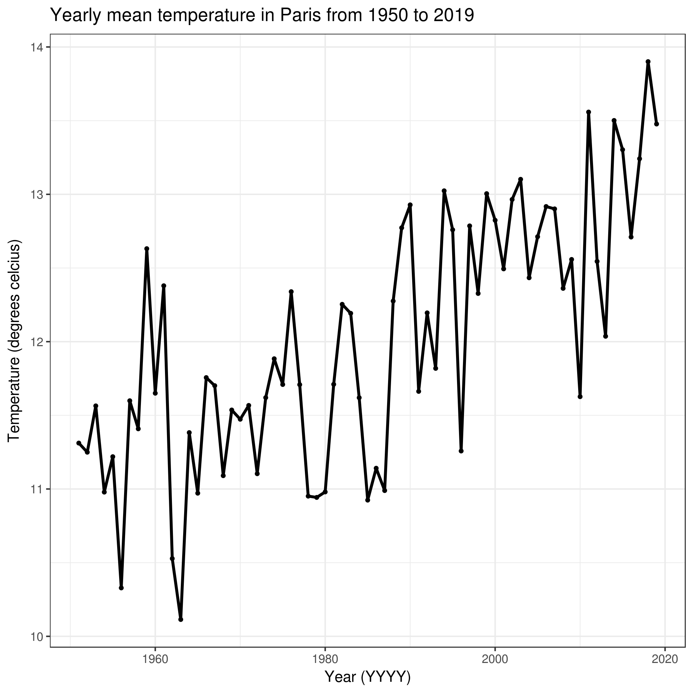
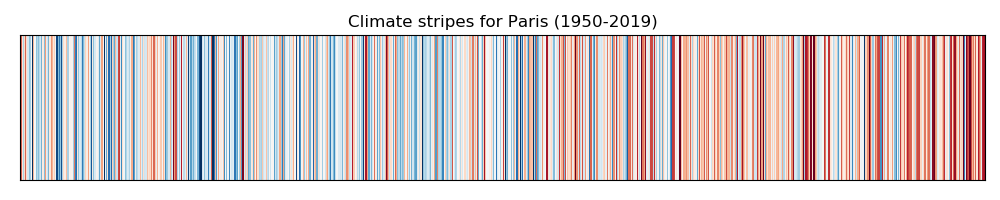
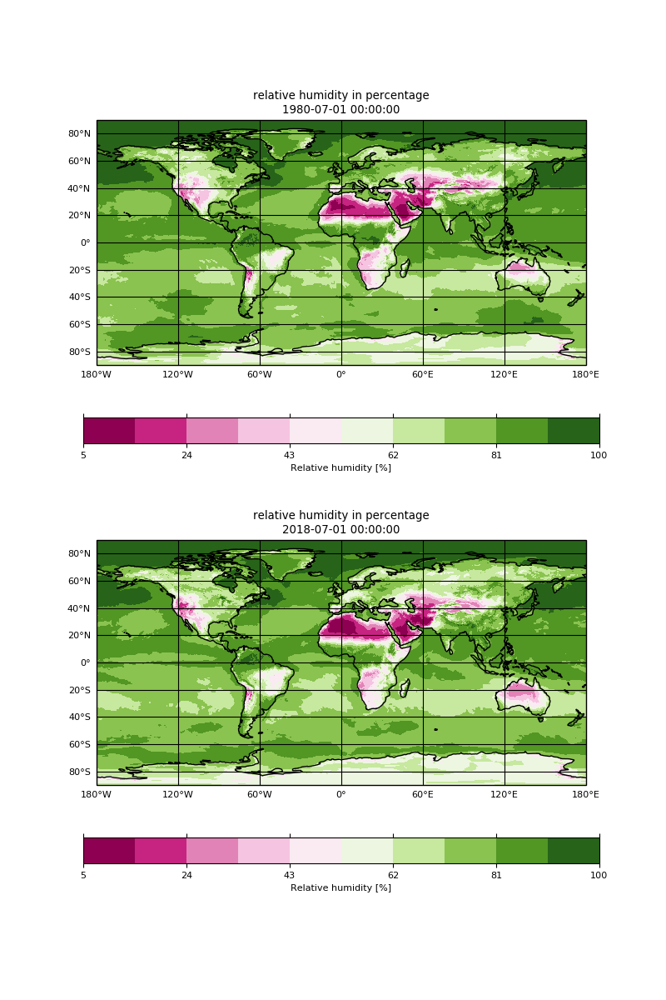

# Introduction


> <comment-title></comment-title>
>
> This tutorial is significantly based on [Getting your hands-on Climate data](https://nordicesmhub.github.io/climate-data-tutorial/).
>
{: .comment}

The practical aims at familiarzing you with Climate Science and the terminology used by climate scientists. The target audience is not a climate scientist but
anyone interested in learning about climate.

> <agenda-title></agenda-title>
>
> In this tutorial, we will cover:
>
> 1. TOC
> {:toc}
>
{: .agenda}

> <comment-title>Background</comment-title>
>
> [European Copernicus Climate Change Service (C3S)](https://climate.copernicus.eu/) provide authoritative information about the past, present
> and future climate. C3S is one of the many services provided by Copernicus, the European Union's Earth Observation Programme, looking
> at our planet and its environment for the ultimate benefit of all European citizens.
> The C3S [Climate Data Store (CDS)](https://cds.climate.copernicus.eu/#!/home) provides a single point of access to a wide range of
> quality-assured climate datasets distributed in the cloud.
> Access to the CDS data is open, free and unrestricted.
> We will be using freely available datasets from the CDS, including
> observations, historical climate data records, estimates of Essential Climate Variables (ECVs) derived from Earth observations,
> global and regional climate reanalyses of past observations, seasonal forecasts and climate projections.
{:  .comment}

For the purpose of this tutorial, sample datasets have been created from data downloaded from [C3S](https://climate.copernicus.eu/) through
[Copernicus Climate Data Store](https://cds.climate.copernicus.eu/#!/home):
- [E-OBS daily gridded meteorological data for Europe from 1950 to present derived from in-situ observations](https://cds.climate.copernicus.eu/cdsapp#!/dataset/insitu-gridded-observations-europe?tab=overview)
- [Essential climate variables for assessment of climate variability from 1979 to present](https://cds.climate.copernicus.eu/cdsapp#!/dataset/ecv-for-climate-change?tab=overview)

To reduce the volume of data, the data resolution (in space and/or time) has been significantly reduced and/or data has been selected on sample locations (Paris, Oslo and
Freiburg). The data format may also have been changed (for instance to tabular) to ease processing.

## Get data

> <hands-on-title>Data upload</hands-on-title>
>
> 1. Create a new history for this tutorial. If you are not inspired, you can name it *climate101*.
>
>    
>
> 2. Import the files from [Zenodo](https://doi.org/10.5281/zenodo.3776500) or from the shared data library
>
>    ```
>    https://zenodo.org/record/3776500/files/tg_ens_mean_0.1deg_reg_v20.0e_Paris_daily.csv
>    https://zenodo.org/record/3776500/files/ts_cities.csv
>    ```
>
>    
>
>    
>
> 3. Check that the datatype is **tabular**
>
>    
>
>    If it is not `tabular` make sure to convert it using the Galaxy built-in format converters.
>
>    
>
> 4. Rename Datasets
>
>    As "`https://zenodo.org/record/3776500/files/tg_ens_mean_0.1deg_reg_v20.0e_Paris_daily.csv`" is not a beautiful name and can give errors for some tools, it is a good practice to change the dataset name by something more meaningful.
>    For example by removing `https://zenodo.org/record/3776500/files/` to obtain `tg_ens_mean_0.1deg_reg_v20.0e_Paris_daily.csv` and `ts_cities.csv`, respectively.
>
>    
>
> 5. Add a tag to the dataset corresponding to `copernicus`
>
>    
>
{: .hands_on}

# What is climate?

According to [wikipedia](https://en.wikipedia.org/wiki/Climate),
Climate is defined as the average state of everyday's weather condition **over a period of 30 years**. It is measured by assessing
the patterns of variation in temperature, humidity, atmospheric pressure, wind, precipitation, atmospheric particle count and
other meteorological variables in a given region over a long period of time (usually 20 or 30 years).
Climate differs from weather, in that weather only describes the short-term conditions of these variables in a given region.


## Climate versus Weather

Quantities that climate scientists are interested in are similar to those used to assess the weather (temperature, precipitation, etc.).
But there is a big difference between climate and weather: **weather** varies from hour to hour and from day to day whereas **climate**
is defined as the average of weather over several decades or longer.

The figure below shows a woman walking her dog and we can use it to make an analogy to illustrate the difference between weather and climate.
if you focus your attention on the dog, you can see that it is all over the place, sometimes upwards, sometimes downwards: this can represent the weather and its
variability. The dog (weather) is not following a fully random pattern and varies around a main direction (trend) that is given by the woman: the woman is representing
the climate and gives us an indication of where both the woman and dog are likely to be in the future.

 

*Source: [Animated short introduction to statistics in climate research](https://youtu.be/e0vj-0imOLw) from Norwegian infotainment program Siffer. Produced by TeddyTV for NRK. Animation by Ole Christoffer Haga*


You can also watch an animated illustration of the difference between climate and weather:

<div class="embed-responsive embed-responsive-16by9"><iframe src="https://www.youtube.com/embed/e0vj-0imOLw" webkitallowfullscreen mozallowfullscreen allowfullscreen></iframe></div>


# What is the weather like in Paris?

In order to answer this question, we are going to inspect and visualize the dataset `tg_ens_mean_0.1deg_reg_v20.0e_Paris_daily.csv` using simple galaxy tools.

> <hands-on-title>Daily temperature time series</hands-on-title>
>
>    > <comment-title>Tip: search for the tool</comment-title>
>    >
>    > Many different tools can be used to answer to the questions. Here we give you some guidelines to help you to choose.
>    > Use the **tools search box** at the top of the tool panel to find **Select lines that match an expression**  and **Datamash** .
>    {: .comment}
>
>    > <question-title></question-title>
>    >
>    > 1. What was the average temperature in Paris on the 14th of July 2003?
>    > 2. What is the minimum and maximum temperatures in Paris?
>    > 3. On which date did the minimum temperature occured?
>    > 4. On which date did the maximum temperature occured?
>    >
>    > > <solution-title></solution-title>
>    > > 1. The average temperature in Paris on the 14th of July 2003 was 26.73 degrees Celcius. It can be found by using **Select lines that match an expression**  with parameter **"the pattern"** set to 2003-07-14.
>    > > 2. The minimum temperature in Paris is -11.6799995 degrees celcius and the maximum temperature in Paris is 33.579998 degrees celcius. To find out, you can use **Datamash**  with the following parameters:
>    > >      -  *"Input tabular dataset"*: `tg_ens_mean_0.1deg_reg_v20.0e_Paris_daily.csv`
>    > >      - *"Input file has a header line"*: `Yes`
>    > >      - *"Print header line"*: `Yes`
>    > >      - "Print all fields from input file": `No`
>    > >      - In *"Operation to perform on each group"*:
>    > >          -  *"Insert Operation to perform on each group"*
>    > >              - *"Type"*: `minimum`
>    > >              - *"On column"*: `c2`
>    > >          -  *"Insert Operation to perform on each group"*
>    > >              - *"Type"*: `maximum`
>    > >              - *"On column"*: `c2`
>    > >
>    > > 3. The minimum temperature (-11.6799995 degrees celcius) was observed on January 16 1985.
>    > >     You can use different Galaxy tools to find out the solution and here we show you how to use **Datamash**   with the following parameters:
>    > >      -  *"Input tabular dataset"*: `tg_ens_mean_0.1deg_reg_v20.0e_Paris_daily.csv`
>    > >      - *"Input file has a header line"*: `Yes`
>    > >      - *"Print header line"*: `Yes`
>    > >      - "Print all fields from input file": `Yes`
>    > >      - In *"Operation to perform on each group"*:
>    > >          -  *"Insert Operation to perform on each group"*
>    > >              - *"Type"*: `minimum`
>    > >              - *"On column"*: `c2`
>    > >
>    > > 4. The maximum temperature (33.579998 degrees celcius) was observed on July 25 2019. For the **maximum**, repeat **Datamash**   with the following parameters:
>    > >
>    > >      -  *"Input tabular dataset"*: `tg_ens_mean_0.1deg_reg_v20.0e_Paris_daily.csv`
>    > >      - *"Input file has a header line"*: `Yes`
>    > >      - *"Print header line"*: `Yes`
>    > >      - "Print all fields from input file": `Yes`
>    > >      - In *"Operation to perform on each group"*:
>    > >          -  *"Insert Operation to perform on each group"*
>    > >              - *"Type"*: `maximum`
>    > >              - *"On column"*: `c2`
>    > {: .solution}
>    {: .question}
>
{: .hands_on}

# What is the climate in Paris?

To get some information about the (past and current) climate in Paris, we will first look at monthly averages.

## Seasonality

> <hands-on-title>What is the monthly climatological temperature in Paris?</hands-on-title>
>
>   To answer to this question, we will compute the global average temperatures over the entire period 1950 and 2019 for each month (January, February, etc.). Indeed,
>   this period of time is sufficiently long for computing monthly climatological temperature (more than 30 years).
>    > <question-title></question-title>
>    >
>    > 1. What is the warmest summer month e.g. between June, July and August (JJA) in Paris?
>    > 2. What is the coolest winter month e.g. between December, January and February (DJF) in Paris?
>    >
>    > > <solution-title></solution-title>
>    > > 1. The warmest summer month in Paris is July (19.921018171429 degrees celcius). However, it is interesting to remark that on our dataset we see very little difference in the mean temperature between July and August.
>    > > 2. The coolest winter month in Paris is January (4.4669169722484 degrees celcius).
>    > >
>    > >     Below, we show you how we found these results.
>    > >     We will first split all the dates (first column) from YYYY-MM-DD (where YYYY is the year, MM the month and DD the day) to three column to get 3 columns: one for the year, one for the month and one for the day. Use **Text reformatting with awk**  with parameters:
>    > >      - **File to process**: `tg_ens_mean_0.1deg_reg_v20.0e_Paris_daily.csv`
>    > >      - **AWK Program**: `gsub(/-/,"\t",$1){$1=$1} {print}`
>    > >
>    > >     Rename the resulting file to `split_dates_Paris.csv`.
>    > >
>    > >     Then use **Datamash**   with the following parameters:
>    > >      -  *"Input tabular dataset"*: `split_dates_Paris.csv`
>    > >      - *"Group by fields"*: 2
>    > >      - *"Input file has a header line"*: `Yes`
>    > >      - *"Print header line"*: `No`
>    > >      - "Sort input": `Yes`
>    > >      - "Print all fields from input file": `No`
>    > >      - In *"Operation to perform on each group"*:
>    > >          -  *"Insert Operation to perform on each group"*
>    > >              - *"Type"*: `Mean`
>    > >              - *"On column"*: `c4`
>    > >
>    > >     Rename the resulting file to `climatology_Paris.csv`.
>    > >     Then use again **Datamash** to get the month where the minimum and maximum temperatures are found:
>    > >      -  *"Input tabular dataset"*: `climatology_Paris.csv`
>    > >      - *"Group by fields"*:
>    > >      - *"Input file has a header line"*: `No`
>    > >      - *"Print header line"*: `No`
>    > >      - "Print all fields from input file": `Yes`
>    > >      - In *"Operation to perform on each group"*:
>    > >             -  *"Insert Operation to perform on each group"*
>    > >                 - *"Type"*: `minimum`
>    > >                 - *"On column"*: `c2`
>    > >
>    > >     Look at the resulting file and the first field will give you the month (07 e.g. July) where the maximum temperature is found.
>    > >
>    > >     For the **maximum**, repeat **Datamash**   with the following parameters:
>    > >      -  *"Input tabular dataset"*: `climatology_Paris.csv`
>    > >      - *"Group by fields"*: ``
>    > >      - *"Input file has a header line"*: `Yes`
>    > >      - *"Print header line"*: `No`
>    > >      - "Print all fields from input file": `Yes`
>    > >      - In *"Operation to perform on each group"*:
>    > >          -  *"Insert Operation to perform on each group"*
>    > >              - *"Type"*: `maximum`
>    > >              - *"On column"*: `c2`
>    > >
>    > >    The result is in the first column of the resulting file which indicates `01` e.g. January.
>    > >
>    > >    Please note that you may use other Galaxy tools to reach the same results.
>    > >    Results can be slightly different when using different source of climate information. However, you will always observe the same pattern e.g. cool month in winter and warm month on summer. We can also clearly see that Paris has a mild climate with on average no extreme temperatures.
>    > {: .solution}
>    {: .question}
>
{: .hands_on}

> <tip-title>Using existing climatologies</tip-title>
>
> In this tutorial, we compute manually the monthly climatological temperatures to explain you the algorithm used behing.
> However, many data providers have pre-computed climatologies and can be directly downloaded. For instance, on the [CDS](https://cds.climate.copernicus.eu/cdsapp#!/search?type=dataset), climatologies are provided for [Essential climate variables for assessment of climate variability from 1979 to present](https://cds.climate.copernicus.eu/cdsapp#!/dataset/ecv-for-climate-change?tab=overview).
{: .tip}


## Yearly average

> <hands-on-title>What is the trend (cooling/warming) in the climate for Paris between 1950 and 2019?</hands-on-title>
>
>  To answer to this question, we will compute yearly mean of the temperature in Paris and visualize it.
>
>    1. Use **Datamash**   with the following parameters:
>        -  *"Input tabular dataset"*: `split_dates_Paris.csv`
>        - *"Group by fields"*: 1
>        - *"Input file has a header line"*: `Yes`
>        - *"Print header line"*: `No`
>        - *"Print all fields from input file"*: `No`
>        - *"Sort input"*: `Yes`
>        - In *"Operation to perform on each group"*:
>        -  *"Insert Operation to perform on each group"*
>              - *"Type"*: `Mean`
>              - *"On column"*: `c4`
>
>    2. Rename the resulting file to `yearly_mean_Paris.csv`.
>
>    3. To make a plot, you can use **Scatterplot w ggplot2**   with the following parameters:
>        - *"Input in tabular format"*: `yearly_mean_Paris.csv`
>        - *"Column to plot on x-axis"*: 1
>        - *"Column to plot on y-axis"*: 2
>        - *"Plot title"*: Yearly mean temperature in Paris from 1950 to 2019
>        - *"Label for x axis"*: Year (YYYY)
>        - *"Label for y axis"*: Temperature (degrees celcius)
>        - And finally in `Advanced Options` change `Type of plot` to **Points and Lines**.
>
>    4. **View**  the resulting plot:
>
>    
>
>    > <question-title></question-title>
>    >
>    > Can we easily observe a trend?
>    >
>    > > <solution-title></solution-title>
>    > >
>    > > The plot clearly shows a slight increase in the yearly mean temperature between 1950 and 2019. Even though it looks no more than a few degrees celcius, it is
>    > > quite significant.
>    > >
>    > {: .solution}
>    {: .question}
>
{: .hands_on}

## Anomalies

In climate change studies, temperature **anomalies** are more important than **absolute** temperature. A temperature anomaly is the difference from an average, or baseline,
temperature. The baseline temperature is typically computed by averaging 30 or more years of temperature data. A *positive anomaly* indicates the observed temperature was *warmer* than the baseline, while a *negative anomaly* indicates the observed temperature was *cooler* than the baseline.

> <hands-on-title>Climate stripes for Paris</hands-on-title>
>    Computing temperature anomalies is out of scope of this tutorial and we will therefore use pre-computed temperature anomalies `ts_cities.csv`.
>    A simple way to visualize anomalies and highlight cooling/warming over the years,  is to use **climate stripes from timeseries**  with the following parameters:
>    - *"timeseries to plot"*: `ts_cities.csv`
>    - *"column name to use for plotting"*: `tg_anomalies_paris`
>    - *"plot title"*: `Climate stripes for Paris (1950-2019)`
>
>    **View**  the resulting plot:
>
>    
>
>    > <question-title>do you observe a warming or cooling between 1950 and 2019?</question-title>
>    >
>    > > <solution-title></solution-title>
>    > >
>    > > The climate stripes clearly show a warming between 1950 and 2019.
>    > {: .solution}
>    {: .question}
>
{: .hands_on}

> <tip-title>Copernicus Climate Bulletin</tip-title>
>
> [Copernicus Climate Bulletins](https://climate.copernicus.eu/climate-bulletins) presents the current condition of the climate using key climate change indicators.
> They also provide data, analysis of the maps and guidance on how they are produced. Datasets for temperature anomalies can be found and are
> regularly updated (with recent dates). For instance, in March 2020, the corresponding dataset can be found [here](https://climate.copernicus.eu/sites/default/files/2020-04/ts_1month_anomaly_Global_ea_2t_202003_v01.csv).
>
{: .tip}

# Climate variables

*Temperature* is often the first variable that comes to mind when we talk about climate. However, it is insufficient to fully characterize the climate, and scientists have agreed on a number of variables to systematically observe Earth`s changing climate.

That is what we call *Essential Climate Variables*.

## Essential Climate Variables

The [Global Climate Observing System](https://gcos.wmo.int/) (GCOS) and its GCOS expert panels maintain definitions of [Essential Climate Variables](https://gcos.wmo.int/en/essential-climate-variables) (ECVs).

GCOS is co-sponsored by the [World Meteorological Organization](https://public.wmo.int/en) (WMO), the [Intergovernmental Oceanographic Commission of the United Nations Educational, Scientific and Cultural Organization](http://www.ioc-unesco.org/) (IOC-UNESCO), the [United Nations Environment Programme](https://www.unenvironment.org/) (UN Environment), and the [International Science Council](https://council.science/) (ISC). It regularly assesses the status of global climate observations of the atmosphere, land and ocean and produces guidance for its improvement.

At the moment, there are [54 ECVs](https://gcos.wmo.int/en/essential-climate-variables).

*Source: [https://gcos.wmo.int/en/essential-climate-variables](https://gcos.wmo.int/en/essential-climate-variables)*

> <hands-on-title>Essential Climate Variables</hands-on-title>
>
> We will look at the [Water Vapor Essential Climate Variable ](https://gcos.wmo.int/en/essential-climate-variables/surface-vapour/):
> *The humidity of air near the surface of the Earth affects the comfort and health of humans, livestock and wildlife, the swarming behaviour of insects and the occurrence of plant disease. The humidity of air near the surface affects evaporation and the strength of the hydrological and energy cycles. Evaporation from the surface of the earth is the source of water in the atmosphere and so is responsible for important feedbacks in the climate system due to clouds and radiation.*
>
>    1. **Copernicus Essential Climate Variables**  with the following parameters:
>        - *"Variable(s)"*: surface_air_relative_humidity
>        - *"Select type of data"*: Monthly mean
>        - *"Select year(s)"*: `1980` and `2018`
>        - *"Select month"*: `July`
>        Rename the resulting file to `rh_mean_july_1980_2018.nc`
>    2. **map plot gridded (lat/lon) netCDF data**  with the following parameters:
>        - *"input with geographical coordinates (netCDF format)"*: `rh_mean_july_1980_2018.nc`
>        - *"variable name as given in the netCDF file"*: `R`
>        - And finally in `Advanced Options` change:
>            - *"multiple times"*: `Yes`
>            - *"comma separated list of indexes for fields to plot"*: 0,1
>            - *"number of rows for subplot grid"*: 2
>            - *"subplot title (repeated on each subplot)"*: relative humidity in percentage
>            - *"colormap"*: PiYG
>    3. **View**  the resulting plot:
>
>    
>
>
>    > <question-title>Relative humidity</question-title>
>    >
>    > 1. Do you observe any significant changes relative humidity in France from 1979 to 2018?
>    > 2. Do we have sufficient information to make any conclusions on the change in climate?
>    >
>    > > <solution-title></solution-title>
>    > > 1. We can see significant changes on the plot over France. The relative humidity of air near the surface of the Earth is lower in July 2018 than in July 1980.
>    > > 2. We do not have sufficient information to draw any conclusions about the change in climate. In our analysis, we only used two different months (July 1980 and July 2018) and can only discuss the average changes in weather during these two periods (July 1980 and July 2018). We learnt that to draw any conclusions on the climate, we would need to make statistics over a long period of time e.g. we would need to download about 30 years of data and for instance compute anomalies in relative humidity to check if there is any trend. These aspects will be discussed further in other Galaxy tutorials.
>    > >
>    > {: .solution}
>    {: .question}
>
{: .hands_on}


## Past, present and future climate?


When we talk about climate data, the type of data can vary significantly. We have very little actual observations at the scale of climate and usually not covering a large area. In addition to observations, we can make use of:
- Re-analyses where observations and numerical modelling are combined together.
- Climate models.

Observations and re-analyses provide information about the past and current climate while climate models can provide past, current and future climate information.
When it comes to future climate, we usually need to make some assumptions (such as how much CO2 emissions, etc.) and simulate different scenarios e.g. we run climate models using different assumptions and look at future trends under each of these scenarios: this is what we call **climate projections**. Climate projections will be discussed in a separate Galaxy tutorial.


# Conclusion


We have learnt to differentiate climate from weather and got an overview of the terminology used by climate scientists to identify the
various source of climate data.
