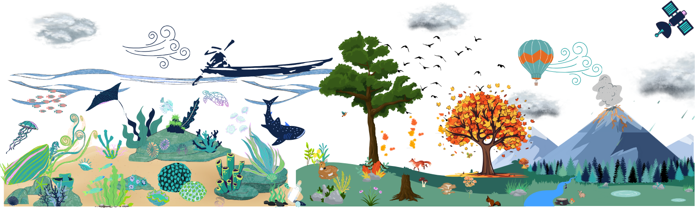

This tutotrial aims at familiarzing you with Earth Science and discovering the earth data available on Galaxy. The target audience is not a scientist but
anyone interested in learning about Earth system.

> <agenda-title></agenda-title>
>
> In this tutorial, we will cover:
>
> 1. TOC
> {:toc}
>
{: .agenda}
🌍🌏🌎

The Earth System is a complex and dynamic system that encompasses the interactions between the atmosphere, hydrosphere, geoshpere, and biosphere. Understanding and analyzing data from the Earth System Model is essential, for example to predict and mitigate the impacts of climate change. Currently, [Galaxy Earth System](https://earth-system.usegalaxy.eu/) uses 4 usecases to have an overview of an earth System: ocean, land, atmosphere, and biodiversity.
Of course, these components cross over each other thus, we have data that can fit two or more compartiments.

Next we will see for each compartiment which kind of data (and how to get them) are availabe on Galaxy Earth System

# 🌊 Ocean 🌊

The ocean is a key component of the Earth’s climate system. Thus, it needs continuous real-time monitoring to help scientists better understand its dynamics and predict its evolution. 

## The Argo program
All around the world, oceanographers have managed to join their efforts and set up a Global Ocean Observing System among which Argo is a key component. Argo is an international program that collects information from inside the ocean using a fleet of robotic instruments that drift with the ocean currents and move up and down between the surface and a mid-water level.

The data available here are from the Argo gliders network. They contain the folowing variables: 
- latitude, longitude, and time
- physcical parameters: water temperature, pressure, and salinity
- biogeochemical parameters: chlorophyll, oxygen, and nitrate

To access those data you can use the [Argo data access](toolshed.g2.bx.psu.edu/repos/ecology/argo_getdata/argo_getdata/0.1.15+galaxy0) tool. 

For more information follow the tutorial related to it called [Analyse Argo data](https://training.galaxyproject.org/training-material/topics/climate/tutorials/argo_pangeo/tutorial.html) or use the workflow Full Analyse Argo data `https://earth-system.usegalaxy.eu/u/marie.josse/w/full-analyse-argo-data`

## Copernicus Data Space Ecosystem

The Copernicus Data Space Ecosystem provides access to Earth observation data.
The goal of the **Sentinel-3 mission** is to accurately and reliably measure sea surface topography, sea and land surface temperature, and ocean and land surface color. This data will support ocean forecasting systems, environmental monitoring, and climate monitoring.

To access those data you can use the [Copernicus Data Space Ecosystem](https://usegalaxy.eu/root?tool_id=interactive_tool_copernicus_notebook) tool. 

For more information follow the tutorial related to it called [Sentinel 5P data visualisation](https://training.galaxyproject.org/training-material/topics/climate/tutorials/sentinel5_data/tutorial.html). 

Once you get into the Jupyterlab go in the left pannel in `samples > openeo > Sentinel_3.ipynb `. Yhis way you have an example on how to get Sentinel 3 data.

# 🏜️ Land 🏞️

This component comprehend all from the solid part of earth land, rock, volcano activities to the deragation of the land surface. This compartiment amis at assessing land and soil degradation, such as erosion, loss of organic matter and soil biodiversity, compaction, salinization, landslides, contamination, sealing, desertification and climate change.

## Copernicus Data Space Ecosystem

The Copernicus Data Space Ecosystem provides access to Earth observation data.

The Copernicus Sentinel-2 mission consists of two polar-orbiting satellites that are positioned in the same sun-synchronous orbit, with a phase difference of 180°.

It aims to monitor changes in land surface conditions. The satellites have a wide swath width (290 km) and a high revisit time. This capability will support monitoring of changes on the Earth's surface.

The Sentinel-2 twin satellites provide image data that largely contribute to existing and ongoing multispectral observations.

These satellites support a variety of services and applications offered by Copernicus, including:
- Land monitoring
- Agriculture
- Emergency management
- Risk mapping
-  Security
- Forestry
- Climate change
- Disaster control
- Marine
- Humanitarian relief operations

The Scene Classification algorithm uses the reflective properties of scene features to establish the presence or absence of clouds in a scene. It is based on a series of threshold tests that use as input: TOA reflectance of several Sentinel-2 spectral bands, band ratios and indexes like Normalised Difference Vegetation Index (NDVI) and Normalised Difference Snow and Ice Index (NDSI). For each of these threshold tests, a level of confidence is associated. It produces at the end of the processing chain a probabilistic cloud mask quality indicator and a snow mask quality indicator. The most recent version of the SCL algorithm includes also morphological operations, usage of auxiliary data like Digital Elevation Model and Land Cover information and exploit the parallax characteristics of Sentinel-2 MSI instrument to improve its overall classification accuracy.

The NDVI ratio can be determined from the contribution of visible wavelength and near-infra-red wavelengths. Strong and well-nourished vegetation will absorb most of the visible wavelengths that it receives and will reflect back a large proportion of the near-infra-red light, whereas poor condition vegetation or thin areas, will reflect more visible wavelength light and less near-infra-red light.

To access those data you can use the [Copernicus Data Space Ecosystem](https://usegalaxy.eu/root?tool_id=interactive_tool_copernicus_notebook) tool. 

For more information follow the tutorial related to it called [From NDVI data with OpenEO to time series visualisation with Holoviews](https://training.galaxyproject.org/training-material/topics/ecology/tutorials/ndvi_openeo/tutorial.html). 

## QGIS (Geographical Information System)

Based on a [QGIS official tutorial](https://docs.qgis.org/2.18/en/docs/training_manual/online_resources/wfs.html), you can learn how to access, filter and import GIS data through WFS web service using [QGIS Galaxy interactive tool](https://usegalaxy.eu/root?tool_id=interactive_tool_qgis)

In the Geographical Information System landscape, there is existing standards to help users deal with remote data. The most common web services are Web Map Services (WMS) and Web Feature Services (WFS). If WMS allows users only to access and display maps stored remotely, WFS is giving access to the features of data so you can modify it and create your own data and maps.

To learn more on how to do that folow [QGIS Web Feature Services](https://training.galaxyproject.org/training-material/topics/ecology/tutorials/QGIS_Web_Feature_Services/tutorial.html)

# ☁️ Atmosphere 🌫️

This component represents the layer of gas around the Earth.

## Copernicus Data Space Ecosystem

The Copernicus Data Space Ecosystem provides access to Earth observation data. 
The Copernicus **Sentinel-5 Precursor** mission is the first Copernicus mission that focuses on monitoring our atmosphere. It is the result of a close partnership between ESA, the European Commission, the Netherlands Space Office, industry, data users and scientists.

To access those data you can use the [Copernicus Data Space Ecosystem](https://usegalaxy.eu/root?tool_id=interactive_tool_copernicus_notebook) tool. 

### Volcano 🌋

You can get atmospheric data on volcanic activity by taking a subset of Sentinel 5P L2 data  for instance,  from the 1st of April to the 30th of may 2021 of the Antilles. Especially of the La Soufriere Saint Vincent (Antilles) where a volcaninc erruption occured 9th of April. This dataset is focused on the dioxide sulfur (SO2) and Aerosol index (AI) spread out. Indeed, the knowledge of volcanic activity at a high temporal resolution is crucial for robustly determining large-scale impacts of volcanoes on atmosphere (air quality, air traffic) and climate. As such, this platform will be also of interest for scientists involved in the field of volcanic impacts at large, including institutions in charge of the monitoring of air quality and aviation safety.
 
For more information follow the tutorial related to it called [Sentinel 5P data visualisation](https://training.galaxyproject.org/training-material/topics/climate/tutorials/sentinel5_data/tutorial.html). 

## Climate Data Store

Dive into this wealth of information about the Earth's past, present and future climate with the [Climate Data Store](toolshed.g2.bx.psu.edu/repos/climate/c3s/c3s/0.2.0). With this tool you can have acces to atmospheric data such as ERA5 data. ERA5 provides a snapshot of the atmosphere, land surface and ocean waves for each hour from 1959 onwards (for 1950 to 1958 a preliminary version is available). It includes an uncertainty estimate which highlights the considerable evolution of the observing system, on which reanalysis products rely.

# 🐙 Biodiversity 🐿️

This englobes the part of the land, ocean, and athmosphere in which organisms are able to live.

## Marine biodiversity 🐳

European marine microbial biodiversity is a poorly understood and under-exploited component of continental biodiversity. This component aims to provide a set of tools for the analysis
of spatial- and time-comparable marine microbial metagenomics data sets for the exploration of biodiversity and its correlations with environmental quality.

### OBIS Ocean Biodiversity Information System

OBIS is a global open-access data and information clearing-house on marine biodiversity for science, conservation and sustainable development. In order to get occurences of marine biodiversity from OBIS you can use the [OBIS occurences](https://usegalaxy.eu/root?tool_id=toolshed.g2.bx.psu.edu/repos/ecology/obis_data/obis_data/0.0.2) tool.

For more information follow the tutorial related to it called [OBIS marine indicators](https://training.galaxyproject.org/training-material/topics/ecology/tutorials/obisindicators/tutorial.html) or use the workflow Marine omics visualisation `https://usegalaxy.eu/u/marie.josse/w/marine-omics-visualisation`

# Conclusion 
Here you have an overview of what's is currently available in terms of data accessibility in Galaxy Earth System. This an on going work more is to come !

# Extra information

Coming up soon even more tutorials on and other Earth-System related trainings. Keep an  open if you are interested!
