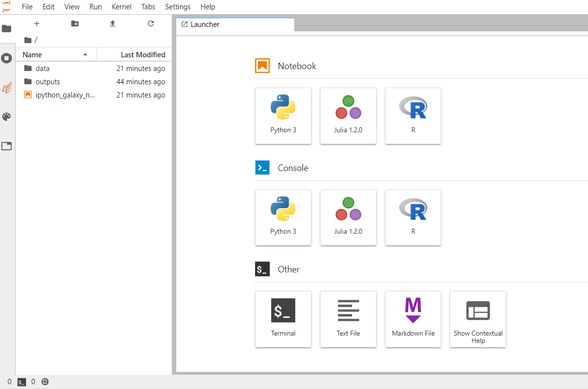
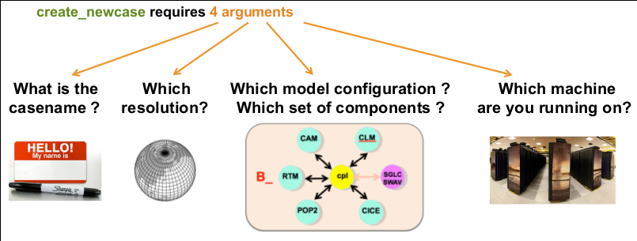
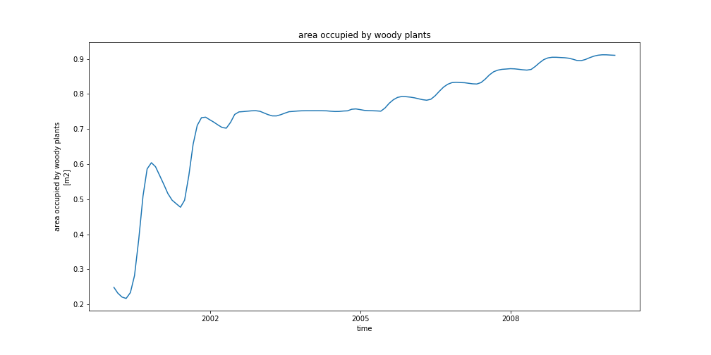
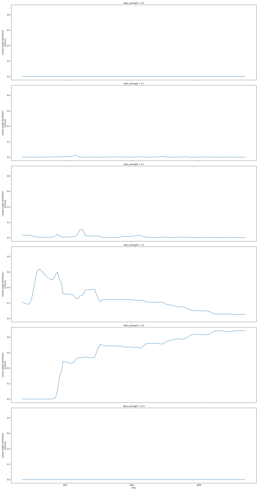

# Introduction

The practical aims at familiarizing you with running CLM-FATES within Galaxy Climate JupyterLab.

> ## Agenda
>
> In this tutorial, we will cover:
>
> 1. TOC
> {:toc}
>
{: .agenda}

> <comment-title>Background</comment-title>
>
> FATES is the “Functionally Assembled Terrestrial Ecosystem Simulator”.
> FATES needs what we call a "Host Land Model" (HLM) to run and in this tutorial
> we will be using the [Community Land Model](http://www.cesm.ucar.edu/models/clm/)
> of the [Community Terrestrial Systems Model](https://github.com/ESCOMP/CTSM) (CLM-CTSM).
> FATES was derived from the CLM Ecosystem Demography model (CLM(ED)), which was documented in
> .
> and this technical note was first published as an appendix to [that paper](https://pdfs.semanticscholar.org/396c/b9f172cb681421ed78325a2237bfb428eece.pdf).
> The [FATES documentation](https://fates-docs.readthedocs.io/en/latest/index.html) will provide some more insight on FATES too.
>
{:  .comment}

## Motivation

In this tutorial, we will be using a Galaxy interactive tool called Galaxy Climate JupyterLab for running CLM-FATES.
This interactive tool is only available from [LiveGalaxy.eu](https://live.usegalaxy.eu/).

This platform is meant to be used for:
- preparing new input datasets;
- testing new versions of fates, including code changes;
- developing new notebooks for analyzing and showing the model results;
- creating interactive publications (notebooks);
- teaching purposes.

The main advantage over the Galaxy CLM-FATES tool is that you can run any versions of FATES, including developments
that are not released yet. However, it is not recommended to run more than a few decades of simulation time.
In that particular case, we would suggest to use the Galaxy CLM-FATES Galaxy tool.

> <comment-title>CML-FATES in JupyterLab versus CLM-FATES Galaxy tool</comment-title>
> Do not use the interactive Galaxy Climate JupyterLab for running long and "operational" simulations and
> do not forget that you need to save back your results to your Galaxy history or local machine before
> stopping your JupyterLab.
>
{: .comment}

# Step-1: Get data

> <hands-on-title> Data upload </hands-on-title>
>
> 1. Create a new history for this tutorial. If you are not inspired, you can name it *fates-jupyterlab*.
>
>    
>
> 2. Import the files from [Zenodo](https://doi.org/10.5281/zenodo.4108341) or from the shared data library
>
>    ```
>    https://zenodo.org/record/4108341/files/inputdata_version2.0.0_ALP1.tar
>    ```
>
>    
>
>    
>
> 3. Check the datatype is **tar**
>
>    
>
> 4. Rename Datasets
>
>    As "https://zenodo.org/record/4108341/files/inputdata_version2.0.0_ALP1.tar" is not a beautiful name and can give errors for some tools,
>    it is a good practice to change the dataset name by something more meaningfull. For example by removing `https://zenodo.org/record/4108341/files/` to obtain `inputdata_version2.0.0_ALP1.tar`, respectively.
>
>    
>
> 5. Add a tag to the dataset corresponding to `fates-jupyterlab`
>
>    
>
{: .hands_on}

# Step-2: Opening up Climate JupyterLab

> <hands-on-title> Launch JupyterLab for Ocean / Atmosphere / Land / Climate Python ecosystem in Galaxy </hands-on-title>
>
> Currently JupyterLab for Ocean / Atmosphere / Land / Climate Python ecosystem in Galaxy is available on [Live.useGalaxy.eu](https://live.usegalaxy.eu) only. JupyterLab for Ocean / Atmosphere / Land / Climate Python ecosystem and not the default JupyterLab in Galaxy contains all the python packages and additional software we need for running Earth System Model, including Functionally Assembled Terrestrial Ecosystem Simulator (FATES). The default JupyterLab in Galaxy would not be sufficient for executing all the tasks in th
> is tutorial.
>
> 1. Open the  or opening directly on [live.usegalaxy](https://live.usegalaxy.eu/?tool_id=interactive_tool_climate_notebook)
> 2. Click Execute
> 3. The tool will start running and will stay running permanently
> 4. Click on the "User" menu at the top and go to "Active Interactive Tools" and locate the JupyterLab instance you started.
> 5. Click on your JupyterLab instance (please not that it may take a few minutes before you can click on the link to your jupyterLab instance).
>
{: .hands_on}


You should now be looking at a page with the JupyterLab interface:




# Step-3: Create a new session CLM-FATES in JupyterLab

## Import input data to JupyterLab

In this part of the tutorial, we will be using the existing Jupyter Notebook called **ipython_galaxy_notebook.ipynb**

> <hands-on-title>Open a JupyterLab Terminal</hands-on-title>
> To open **ipython_galaxy_notebook.ipynb**, double click on it.
> More information on the JupyterLab interface can be found on the [JupyterLab documentation](https://jupyterlab.readthedocs.io/en/stable/user/interface.html).
>
> Import the FATES input dataset from your history:
> - In a new code cell:
>
> ```
> %%bash
>
> get -i inputdata_version2.0.0_ALP1.tar -t name
>```
>
> By default code cells execute Python 3 code (default kernel) so to execute the Shell command lines
> we will use `%%bash`.  In that case the cell runs with bash in a subprocess.
>
> Then untar this file:
>
> ```
> %%bash
> mkdir $HOME/inputdata
> tar xf /import/inputdata_version2.0.0_ALP1.tar --directory $HOME/inputdata
> ```
{: .hands_on}

> <comment-title>Direct download in JupyterLab from Zenodo</comment-title>
>
> You may also download the input dataset directly from Zenodo.
> - Open a JupyterLab Terminal and enter the following command:
> ```
> %%bash
> cd /import
> wget https://zenodo.org/record/4108341/files/inputdata_version2.0.0_ALP1.tar
> ```
{:  .comment}

> <comment-title>Using JupyterLab Terminal</comment-title>
>
> Most of the tutorial (except visualization) can be executed from a JupyterLab Terminal. In that case,
> you should not add `%%bash` to your commands. More on JupyterLab Terminal can be found on [Read the Docs](https://jupyterlab.readthedocs.io/en/stable/user/terminal.html).
{:  .comment}

## Get CLM-FATES EMERALD release

> <hands-on-title>Clone CLM-FATES for Nordic sites</hands-on-title>
>
> ```
> %%bash
> conda create --name fates -y fates-emerald=2.0.1
> ```
> The command above is required once only. It creates a new conda environment called **fates** and
> install **fates-emerald** version 2.0.1 conda package. It is important to always specify the version of
> CLM-FATES you would like to use as it needs to match your input dataset.
> Now a new **fates** conda environment has been
> created in your current JupyterLab session and can be use every time you activate it.
>
> Then to activate this new conda environment:
>
> ```
> %%bash
> source activate fates
> ```
> Please note that you would need to activate **fates** environment in every new code cell (because it starts a new Shell subprocess).
>
{: .hands_on}


## Create CLM-FATES new case

> <hands-on-title>Create CLM-FATES new case for ALP1 site</hands-on-title>
>
> ```
> %%bash
> source activate fates
>
> create_newcase --case $HOME/ctsm_cases/fates_alp1 --compset 2000_DATM%1PTGSWP3_CLM50%FATES_SICE_SOCN_MOSART_SGLC_SWAV --res 1x1_ALP1 --machine espresso --run-unsupported
> ```
>
{: .hands_on}

> <warning-title>Command not found!</warning-title>
> If you get an error when invoking `create_newcase` make sure you have switch to fates conda environment:
> ```
> %%bash
> source acticate fates
> create_newcase --help
> ```
{: .warning}

The 4 main arguments of create_newcase are explained on the figure below: .

- **case**: specifies the name and location of the case being created. It creates a new case in `$HOME/ctsm_cases/` and its name is `fates_alp1`. make sure to give a meaningful name to your FATES experiments.
- **res**: specifies the model resolution (resolution of the grid). Here **1x1_ALP1** corresponds to a single point resolution.
- **compset**: specifies the component set, i.e., component models, forcing scenarios and physics options for those models.
  - The long name of the compset we have chosen is `2000_DATM%1PTGSWP3_CLM50%FATES_SICE_SOCN_MOSART_SGLC_SWAV`
  - The notation for the compset longname is: `TIME_ATM[%phys]_LND[%phys]_ICE[%phys]_OCN[%phys]_ROF[%phys]_GLC[%phys]_WAV[%phys][_BGC%phys]`
  - The compset longname has the specified order: **atm, lnd, ice, ocn, river, glc wave cesm-options** where:
    - **Initialization Time**:2000
    - **Atmosphere**: Data atmosphere DATM%1PTGSWP3
    - **Land**: CLM50%FATES
    - **Sea-Ice**: SICE Stub ICE
    - **Ocean**: SOCN Stub ocean
    - **River runoff**:MOSART: MOdel for Scale Adaptive River Transport
    - **Land Ice**: SGLC Stub Glacier (land ice) component
    - **Wave**-   SWAV Stub wave component
   See also the [list of available component sets](http://www.cesm.ucar.edu/models/cesm2/config/compsets.html).
- **mach**: specifies the machine where CLM-FATES will be compiled and run. We use `espresso` which is the local setup (see `$HOME/.cime/` folder).

## Setup, build and submit your first simulation

> <hands-on-title>Setup, build and submit</hands-on-title>
>
> Check the content of the directory and browse the sub-directories:
> - CaseDocs: namelists or similar
> - SourceMods: this is where you can add local source code changes.
> - Tools: a few utilities (we won’t use them directly)
> - Buildconf: configuration for building each component
> For this tutorial, we  wish to have a “cold” start as we are mostly interested in setting up our model.
> When ready to run in production, the model needs to be spin-up (run for several centuries until it reaches some kind of equilibrium).
>
> We will first make a short simulation (6 months):
>
> ```
> %%bash
> source activate fates
>
> cd $HOME/ctsm_cases/fates_alp1
> ./case.setup
> ./case.build
> ./xmlchange STOP_OPTION=nmonths            # set the simulation periods to "nmonths"
> ./xmlchange STOP_N=6                       # set the length of simulation, i.e, how many months
> ./case.submit > case_submit.out 2>&1
> ```
> The step above can take a lot of time because it needs to compile and run the FATES model.
> Therefore we suggest you make a break and come back later (or the following day) before you continue the
> tutorial.
{: .hands_on}

## Check your run

> <hands-on-title>check your simulation</hands-on-title>
>
> 1. From a new code cell:
>
> ```
> %%bash
>
> cd $HOME/work/fates_alp1
> ls -la
> ```
> You should see two folders:
> - bld: contains the object and CESM executable (called cesm.exe) for your configuration
> - run: this directory will be used during your simulation run to generate output files, etc.
>
> The **bld** folder contains the model executable (called `cesm.exe`) while **run** contains all the files used for running CLM-FATES (and not already archived).
> Once your run is terminated, many files are moved from the **run** folder to the **archive** folder:
>
> ```
> %%bash
> cd $HOME/archive/fates_alp1
> ls lnd/hist
> ```
>
> We are interested in the "history" files from the CLM-FATES model and these files are all located in `lnd/hist` folder.
> You can also check other model components in the archive directory (atm, etc.): in our case, it is not of a great interest as
> we are running the CLM-FATES component.
> We have run a very short simulation and get one file only, called `fates_alp1_t.clm2.h0.2000-01.nc`. The
> CLM-FATES model outputs are stored in netCDF format.
>
> > <comment-title>What is a netCDF file?</comment-title>
> >
> > Netcdf stands for “network Common Data Form”. It is self-describing, portable, metadata friendly, supported by many languages
> > (including python, R, fortran, C/C++, Matlab, NCL, etc.), viewing tools (like panoply, ncview/ncdump) and tool suites of file operators (in particular NCO and CDO).
> {: .comment}
>
> 2. Create a new Jupyter Notebook for analyzing your results:
>   - From the **File Menu** --> **New** --> **Notebook**:
>      - Rename your notebook to **check_analysis.ipynb**
>      - All the analysis of the 6 month FATES simulation will be done from this notebook
>
> 3. Get metadata
> In a Code cell:
>
> ```
> import os
> import xarray as xr
> xr.set_options(display_style="html")
> %matplotlib inline
>
> case = 'fates_alp1'
> path = os.path.join(os.getenv('HOME'), 'archive', case, 'lnd', 'hist')
> dset = xr.open_mfdataset(path + '/*.nc', combine='by_coords')
> dset
> ```
> As shown above, we are now using Python 3 for analyzing the results and [xarray](http://xarray.pydata.org/en/stable/) which
> is a Python package that can easily handle [netCDF](https://en.wikipedia.org/wiki/NetCDF) files.
> we opened all the history files we have produced and print metadata.
>
> 4. Plotting 1D variables (timeseries)
>
> You can select a variable by using its short name (see metadata above) and then calling the plot method:
> ```
> dset['AREA_TREES'].plot()
> ```
> As we ran 6 months only, we have very little points in our timeseries!
>
> To plot 2D variables such as **CANOPY_AREA_BY_AGE**, you can use the *col_wrap* option when plotting:
>
> ```
> dset['CANOPY_AREA_BY_AGE'].plot(aspect=3, size=6, col='fates_levage', col_wrap=1)
> ```
> In the plot above, we have one plot per row (*col_wrap=1*) and we will have a plot for each value of the *fates_levage* dimension.
> We also changed the aspect of the plot (aspect=3, size=6).
{: .hands_on}

## Customize your run

> <hands-on-title>Run 10 years</hands-on-title>
>
> ```
> %%bash
> source activate fates
> cd $HOME/ctsm_cases/fates_alp1
>
> ./xmlchange RUN_STARTDATE=0001-01-01      # set up the starting date of your simulation
> ./xmlchange STOP_OPTION=nyears            # set the simulation periods to "years"
> ./xmlchange STOP_N=5                      # set the length of simulation, i.e, how many years
> ./xmlchange CONTINUE_RUN=TRUE             # if you want to continue your simulation from restart file, set it to TRUE
> ./xmlchange RESUBMIT=1                    # set up how many times you want to resubmit your simulation.
>                                           # e.g, STOP_N=5, RESUBMIT=1, you will have simulation for 5+5*1=10
> ./xmlchange DATM_CLMNCEP_YR_START=1901    # set up the start year of the atmospheric forcing
> ./xmlchange DATM_CLMNCEP_YR_END=1910      # set up the end year of the atmospheric forcing
> ./case.submit > case_submit_sontinue_run.out 2>&1
> ```
> This step will take several hours.
{: .hands_on}

# Analysis

In this section, we will be able to analyze your 10 year simulation only when the run is terminated (note that data will be moved to the archive folder every 5 years).

## Analyzing FATES-CLM model outputs

> <hands-on-title>Open a new Python notebook</hands-on-title>
> - Create a notebook by clicking the `+` button in the file browser and then selecting a kernel in the new Launcher tab:
> - Rename your notebook to **analyse_case.ipynb**
> Get more information online at [JupyterLab notebooks](https://jupyterlab.readthedocs.io/en/stable/user/notebook.html).
{: .hands_on}

### Use `xarray` to read and plot

In this section, we give additional examples on how to visualize your results using `xarray`:

```
import xarray as xr
xr.set_options(display_style="html")
%matplotlib inline

case = 'fates_alp1'
path = os.path.join(os.getenv('HOME'), 'archive', case, 'lnd', 'hist')
dset = xr.open_mfdataset(path + '/*.nc', combine='by_coords')
dset
```
As you can see, we are now using `open_mfdataset` to read all the netCDF files available in the history folder.
The option `combine='by_coords')` is used to tell the method `open_mfdataset` how to combine the different files
together.

You can use the same `plot` method as before for plotting any variable. For instance:

```
dset['AREA_TREES'].plot(aspect=3, size=6)

```

For saving your plot, for instance in a *png* file format:

```
import matplotlib.pyplot as plt
fig = plt.figure(1, figsize=[14,7])
ax = plt.subplot(1, 1, 1)
dset['AREA_TREES'].plot(ax=ax)
ax.set_title(dset['AREA_TREES'].long_name)
fig.savefig('AREA_TREES.png')
```



In the plot above, we create a figure (with specific dimension [14,7]) and one subplot with one row and one column.
The last argument of *subplot* is the index (1) of this particular subplot.

Finally, the resulting figure is saved in a file called 'AREA_TREES.png'.


To plot 2D variables and save the resulting plot in a png file, for instance **CANOPY_HEIGHT_DIST**:

```
p = dset['CANOPY_HEIGHT_DIST'].plot(aspect=3, size=6, col_wrap=1, col='fates_levheight')
p.fig.savefig('CANOPY_HEIGHT_DIST.png')
```



# Save your results to your Galaxy history

> <hands-on-title>Put your data to your Galaxy history</hands-on-title>
>
> ```
> %%bash
> cd $HOME
> tar cvf archive_emerald_fates_test.tar archive
> ```
> Then you are now ready to put your dataset into Galaxy. As it can be large, we recommend to use FTP:
>
> ```
> curl -T {"archive_emerald_fates_test.tar"} ftp://ftp.usegalaxy.eu --user USER:PASSWORD --ssl
> ```
> Where you replace `USER` by your galaxy username (what you used to login to Galaxy i.e. usually your email address
> and `PASSWORD` by your Galaxy login password.
>
> To get `archive_emerald_fates_test.tar` in your history:
>  - Open the Galaxy Upload Manager ( on the top-right of the tool panel)
>  - Click on **Choose FTP files** and select `archive_emerald_fates_test.tar` to import it into your history.
>
> And make sure to save all your notebooks to your Galaxy history too:
>
> ```
> %%bash
> put -p ipython_galaxy_notebook.ipynb
> put -p check_analysis.ipynb
> put -p analyse_case.ipynb
> put -p AREA_TREES.png
> put -p CANOPY_HEIGHT_DIST.png
> ```
{: .hands_on}

> <warning-title>Danger: You can lose data!</warning-title>
> If you do not copy data (FATES model results, jupyter notebooks, plots, etc.) before you stop your Galaxy climate
> JupyterLab tool, all your results will be lost!
{: .warning}


# Share your work

One of the most important features of Galaxy comes at the end of an analysis. When you have published striking findings, it is important that other researchers are able to reproduce your in-silico experiment. Galaxy enables users to easily share their workflows and histories with others.

To share a history, click on the  icon in the history panel and select `Share or Publish`. On this page you can do 3 things:

1. **Make History Accessible via Link**. This generates a link that you can give out to others. Anybody with this link will be able to view your history.
2. **Make History Accessible and Publish**. This will not only create a link, but will also publish your history. This means your history will be listed under `Shared Data → Histories` in the top menu.
3. **Share with a user**. This will share the history only with specific users on the Galaxy instance.

> <comment-title>Permissions</comment-title>
> Different servers have different default permission settings. Some servers create all of your datasets completely private to you, while others make them accessible if you know the secret ID.
>
> Be sure to select **Also make all objects within the History accessible** whenever you make a history accessible via link, otherwise whomever you send your link to might not be able to see your history.
{: .comment}

> <hands-on-title>Share history</hands-on-title>
>
> 1. Share your history with your neighbour.
> 2. Find the history shared by your neighbour. Histories shared with specific users can be accessed by those users under their top masthead "User" menu under `Histories shared with me`.
{: .hands_on}


> <comment-title>Clone CLM-FATES release for Nordic site from github (advanced)</comment-title>
>
> You may also get the CLM-FATES release 2.0.1 directly from github:
>
> ```
> %%bash
> cd $HOME
> git clone -b release-emerald-platform2.0.1 https://github.com/NordicESMhub/ctsm.git
> cd ctsm
> ./manage_externals/checkout_externals
> ```
> This approach may be interesting if you wish to run another release or development version of CLM-FATES.
> All the tutorial shown can be done with your local version. In that case, you would need to use the
> local command such as `create__newcase` which then require the following steps:
> - locate the command on your local folder; for instance to locate `create_newcase`:
>
> ```
> %%bash
> cd $HOME/ctsm
> find . -name create_newcase
> ```
> The command above will give you the location of `create_newcase`:
> ```
> ./cime/scripts/create_newcase
> ```
> Be aware that it is a relative path. Then to create a new case:
>
> ```
> ./cime/scripts/create_newcase --case $HOME/ctsm_cases/fates_alp1_local --compset 2000_DATM%1PTGSWP3_CLM50%FATES_SICE_SOCN_MOSART_SGLC_SWAV --res 1x1_ALP1 --machine espresso --run-unsupported
>
> ```
> Finally, if you wish to make changes to the source code, we recommend first to add your changes in different folder and use the option `--user-mods-dir` when
> creating your case. In addition, you should make sure to use version control to save your changes.
> If you are not familiar with `git`, you could also save your changes in the corresponding Galaxy history.
{:  .comment}

# Conclusion

We have learnt to run single-point simulations with FATES-CLM through the Galaxy Climate JupyterLab.
