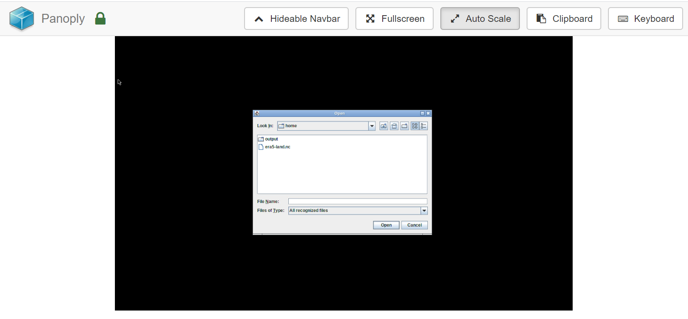
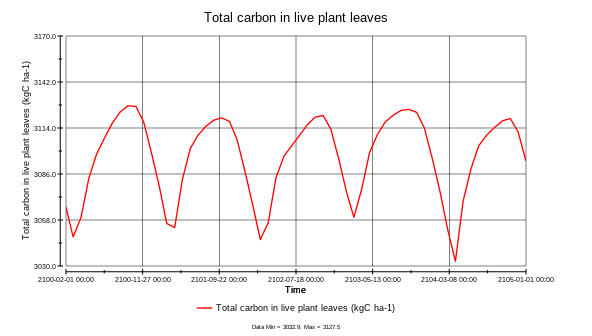
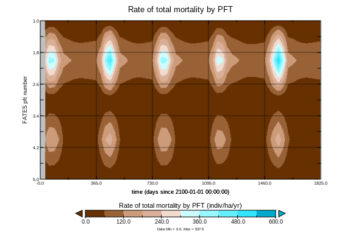
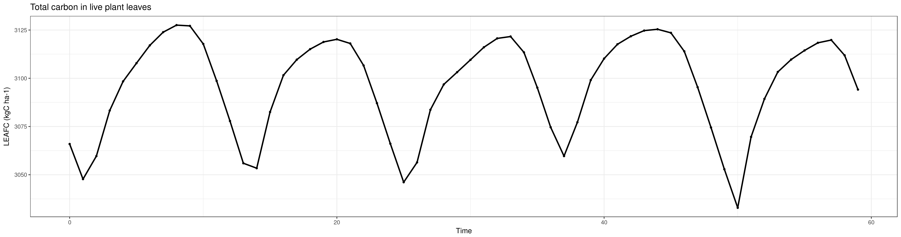
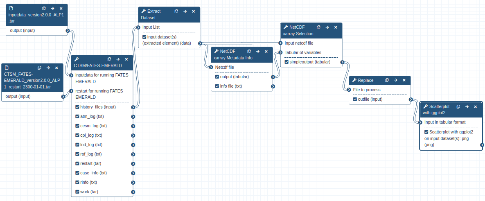
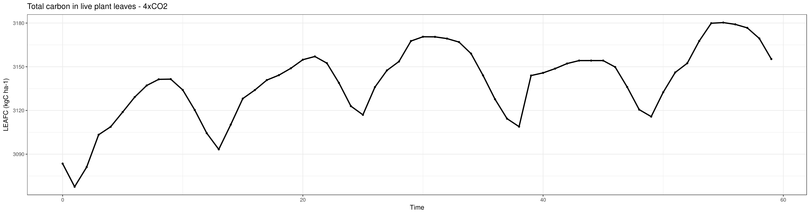

# Introduction


Terrestrial ecosystem models have been widely used to study the impact of climate changes on vegetation and terrestrial biogeochemical cycles in climate modelling community. They are also more and more applied in ecological studies to help ecologists to better understand the processes. But the technical challenges are still too high for most of the ecologists to use them. This practical aims at familiarizing you (especially ecologists) with running a terrestrial ecosystem model (i.e., CLM-FATES) at site-level in Galaxy and analyzing the model results.
It will also teach you on how to create Galaxy workflow for your site-level CLM-FATES simulations to make your research fully reproducible. We hope this tutorial will promote the use of CLM-FATES and other terrestrial ecosystem models by a broader community.

> <agenda-title></agenda-title>
>
> In this tutorial, we will cover:
>
> 1. TOC
> {:toc}
>
{: .agenda}

> <comment-title>Background</comment-title>
>
> FATES is the “Functionally Assembled Terrestrial Ecosystem Simulator”, which is a vegetation demographic model ().
> FATES needs what we call a "Host Land Model" (HLM) to run and in this tutorial
> we will be using the [Community Land Model](http://www.cesm.ucar.edu/models/clm/)
> of the [Community Terrestrial Systems Model](https://github.com/ESCOMP/CTSM) (CLM-CTSM).
> FATES was derived from the CLM Ecosystem Demography model (CLM(ED)), which was documented in
>  and .
> And this technical note was first published as an appendix to [that paper](https://pdfs.semanticscholar.org/396c/b9f172cb681421ed78325a2237bfb428eece.pdf).
> The [FATES documentation](https://fates-docs.readthedocs.io/en/latest/index.html) will provide some more insight on FATES too.
>
{:  .comment}

# Get CLM-FATES input data

Preparing CLM-FATES input data is out of scope for this tutorial. We assume the input data tarball contains the following folders:

```
atm   cpl   lnd   share
```

Each sub-folder will then contain all the necessary inputs for running your CLM-FATES case. For instance, 'atm' contains all the meteorological forcing data for running CLM-FATES. 'lnd' contains the data required to describe surface conditions (e.g., soil depth) for the model. More details about the model inputdata can be found in [CLM and FATES documentation](https://escomp.github.io/ctsm-docs/versions/master/html/tech_note/Ecosystem/CLM50_Tech_Note_Ecosystem.html#model-input-requirements).
For the purpose of this tutorial, input data for a single point location (ALP1) on the Norwegian alpine tundra ecosystem (Latitude: 61.0243N, Longitude: 8.12343E, Elevation: 1208 m) has been prepared and is ready to use. This is a site included in the modelling platform developed under [EMERALD project] (https://www.mn.uio.no/geo/english/research/projects/emerald/). More details about the sites can be found in  and  

> <hands-on-title>Data upload</hands-on-title>
>
> 1. Create a new history for this tutorial. If you are not inspired, you can name it *fates*.
>
>    
>
> 2. Import the [input data](https://doi.org/10.5281/zenodo.4108341) and the [restart dataset from Zenodo](https://doi.org/10.5281/zenodo.4126404)
>    or from the shared data library. Restart dataset will be used if you want to initialize the model from exisiting experiments rather than running the model from a cold start to shorten spin-up time needed for the model.
>
>    ```
>    https://zenodo.org/record/4108341/files/inputdata_version2.0.0_ALP1.tar
>    https://zenodo.org/record/4126404/files/CTSM_FATES-EMERALD_version2.0.0_ALP1_restart_2300-01-01.tar
>    ```
>
>    
>
>    
>
> 3. Check the datatype (for both files) is **tar**
>
>    
>
> 4. Rename  datasets
>      - Dataset names are the full URL, but this is not very nice to work with, and can even give errors for some tools
>      - It is good practice to change the dataset names to something more meaningful and without any special characters
>        -  E.g. by stripping off the beginning of the URL
>      - Example: rename `https://zenodo.org/record/4108341/files/inputdata_version2.0.0_ALP1.tar` to `inputdata_version2.0.0_ALP1.tar`
>      - Do the same for the other dataset
>
>    
>
{: .hands_on}

# Setting up a CLM-FATES simulation

We will be using the CTSM/FATES-EMERALD Galaxy tool.This tool is based on the version of [CLM-FATES](https://github.com/NordicESMhub/ctsm/tree/fates_emerald_api) that have been adapted to run at the sites included in the EMERALD project. More details about this model version can be found in [README_fates_emerald_api](https://github.com/NordicESMhub/ctsm/blob/fates_emerald_api/README_fates_emerald_api)

> <comment-title>Tip: Finding your tool</comment-title>
>
> Different Galaxy servers may have tools available under different sections, therefore it is often useful to use the **search bar** at the top of the tool panel to find your tool.
>
> Additionally different servers may have multiple, similarly named tools which accomplish similar functions. When following tutorials, you should use precisely the tools that they describe. For real analyses, however, you will need to search among the various options to find the one that works for you.
>
{: .comment}

> <comment-title>Tip: Pre-selected tool parameters</comment-title>
>
> When selecting a tool, Galaxy will pre-fill the tool parameters, selecting the first dataset with the corresponding type in your history.
> Be aware that very often, the default pre-selection is incorrect and do not correspond to the required dataset.
> So always check and update accordingly the tool parameters!
>
{: .comment}

> <hands-on-title>Creating a new CTSM/FATES-EMERALD case</hands-on-title>
>
> 1.  with the following parameters:
>    -  *"inputdata for running FATES EMERALD"*: `inputdata_version2.0.0_ALP1.tar` file from your history
>    - *"Name of your case"*: ALP1_exp
>    - In section *"Customize the model run period"*:
>        -  *"Determines the model run initialization type:*: `hybrid`
>          - *"Reference case for hybrid or branch runs"*: `ALP1_refcase`
>          - *"Reference date for hybrid or branch runs (yyyy-mm-dd)"*: `2300-01-01`
>          - *"Run start date (yyyy-mm-dd). Only used for startup or hybrid runs"*: `0001-01-01`
>          -  *"Restart for running FATES EMERALD"*: `CTSM_FATES-EMERALD_version2.0.0_ALP1_restart_2300-01-01.tar`
>        - *"Provides a numerical count for STOP_OPTION"*: `5`
>        - *"Sets the run length along with STOP_N and STOP_DATE"*: `nyears`
>
>    > <comment-title>Startup versus Hybrid</comment-title>
>    >
>    >  When using **startup**, the FATES model will start from some arbitrary baseline state that is not linked to any previous run.
>    > Startup runs are typically initialized using a start date of 0001-01-01 except if you change it (start date option).
>    > For any scientific study, starting from an arbitraty baseline state implies you would need to run the model for a long period (between 100 and 200 years)
>    > before being able to use the model outputs. For this reason, we usually make a first simulation (spin-up) in **startup** mode and reuse this case as a baseline
>    > for our scientific study. We then use **hybrid** type and give additional inputs (restart files) to our simulation case. It is then important to specify the dates
>    > of your restart files. This is what we do in this tutorial.
>    >
>    {: .comment}
>
> 2. Check that the datatype  of your outputs (history file) is **[netcdf](https://en.wikipedia.org/wiki/NetCDF)**
>      - If this is not the case, please change the datatype now
>
>    > <comment-title>About CLM-FATES history files</comment-title>
>    > All the CLM-FATES history files are organized in a collection.
>    >
>    {: .comment}
>
>    > <comment-title>About datatypes</comment-title>
>    >
>    > All the history files contain gridded data values written at specified times during the model run.
>    > Depending on the length of your simulation, you may have one or more history files that you can recognize from their names:
>    >`ALP1_exp.clm2.h0.yyyy-mm-dd-sssss.nc` (for non-monthly history files).
>    > Datatypes are, by default, automatically guessed. Here, as the prefix is `.nc`, the format is not always recognized as `netcdf` files.
>    > To cope with that, one can change the datatype manually, as shown below.
>    {: .comment}
>
>    
>
> 3. **Rename**  the output dataset (history file) to `ALP1_exp.nc`
>
>    Our FATES model has run for 5 years only, so we get a single output file. As previously, we recommend
>    to rename all netCDF files so that they do not contain any special characters or dots (except for the file extension) or slashes. Some tools, in
>    particular Panoply, won't be able to recognize your file if not named properly.
>
>    
>
> 4.   to get metadata information for CLM-FATES netCDF outputs:
>      -  *"Netcdf file"*: `ALP1_exp.nc`
>
> 5. **Inspect**  the generated output files
>      - Identify which variables would provide you some insights about canopy transpiration.
>
>    > <question-title></question-title>
>    >
>    > 1. What are the short names of the relevant variables? Which one will you pick if you want a result in **mm/s**?
>    > 2. What are the dimensions of these variables?
>    >
>    > > <solution-title></solution-title>
>    > > 1. **FCTR** is the canopy transpiration in W/m^2 and **QVEGT** is in mm/s. Therefore, we would select the latter.
>    > > 2. These variables are stored as a function of time and lndgrid and since we have only one grid cell, lngrid=1, hence the time series.
>    > {: .solution}
>    {: .question}
>
{: .hands_on}

# Quick visualization with Panoply

## Opening up Panoply

> <hands-on-title>Launch Panoply</hands-on-title>
>
>  [Panoply](https://www.giss.nasa.gov/tools/panoply/) plots geo-referenced and other arrays from netCDF and is available as a Galaxy interactive environment and may not be available on all Galaxy servers.
>
> > <tip-title>Only on UseGalaxy.eu</tip-title>
> > Currently Panoply in Galaxy is available on useGalaxy.eu instance, on the "Interactive tools" tool panel section or,
> > as all interactive tools, from the dedicated useGalaxy.eu subdomain: [live.useGalaxy.eu](https://live.usegalaxy.eu).
> > You may have to login again to [live.usegalaxy.eu](https://live.usegalaxy.eu) (use the same username and password than on other useGalaxy.eu subdomains)
> > and switch to the correct history.
> >
> > You can access the tool by clicking [here](https://live.usegalaxy.eu/?tool_id=interactive_tool_panoply)
> {: .tip}
>
> 1. Open the 
> 2. Check **ALP1_exp.nc** dataset selected in the netcdf input field
> 3. Click Execute
> 4. The tool will start running and will stay running permanently
> 5. Click on the "User" menu at the top and go to "Active Interactive Tools" and locate the Panoply instance you started.
> 6. Click on your Panoply instance
>    
> 7. Click on **ALP1_exp.nc** dataset
{: .hands_on}

## Inspect metadata

> <hands-on-title>Inspect dataset</hands-on-title>
>
> 1. Inspect dataset content
>
>    Here you can look at the dataset (`ALP1_exp.nc`) and related variables (FSDS, FSA, AREA_TREE, BIOMASS_CANOPY, etc.)
>
>    > <question-title></question-title>
>    >
>    > 1. What is the long name of **MORTALITY**?
>    > 2. What is its physical unit?
>    >
>    > > <solution-title></solution-title>
>    > > 1. Rate of total mortality per PFT (Plat functional types)
>    > > 2. indiv/ha/yr
>    > {: .solution}
>    {: .question}
>
>
> 2. Plot the total carbon in live plant leaves (**LEAFC**)
>
>    Cutomize your plot and save it as **png** file in the output folder. Remember that
>    if you do not save in the output folder, your plot will get lost.
>    > <question-title></question-title>
>    > 1. Can you observe any pattern? Does it make any sense?
>    >
>    > > <solution-title></solution-title>
>    > > 1. We can clearly see a seasonal cycle.
>    > > 
>    > {: .solution}
>    {: .question}
>
>
> 3. Plot the rate of total mortality per PFT (MORTALITY)
>
>    Select a 2D plot with time as x-axis and colored by the rate of total mortality per PFT (Plant functional type).
>    Make sure to adjust the y-axis and save your plots in the output folder (as png file).
>    > <question-title></question-title>
>    > 1. Can you observe any pattern? Does it make any sense?
>    >
>    > > <solution-title></solution-title>
>    > > 1. We can clearly see a seasonal cycle of PFT2.
>    > > 
>    > {: .solution}
>    {: .question}
>
>    > <comment-title>Quit Panoply properly to save your plots!</comment-title>
>    >
>    > To make sure all your plots stored in **outputs** folder  get exported to Galaxy, you need to quit panoply: **File** --> **Quit Panoply**.
>    {: .comment}
{: .hands_on}

# Using Galaxy tools for analysing your CLM-FATES simulation

Panoply is a great tool for exploring the results of your simulations but what we would like is to automate the generation of the plots
so that we can reuse it for any simulations.

> <hands-on-title>Select and plot <b>LEAFC</b></hands-on-title>
>
> 1.  to select the total carbon in live plant leaves (**LEAFC**)
>      -  *"Input netcdf file"*: ALP1_exp.nc
>      -  *"Tabular of variables"*: Metadata info from `ALP1_exp.nc` (output of **NetCDF xarray Metadata Info** )
>      -  *"Choose the variable to extract"*: `LEAFC`
>
> 2. **Rename**  dataset to `NetCDF xarray Selection on ALP1_exp.nc`
>
>    
>
> 3.  to clean date column for plotting:
>      -  *"File to process"*: NetCDF xarray Selection on ALP1_exp.nc
>      -  *"Find pattern"*: `00:00:00`
>      - *"Find-Pattern is a regular expression"*: `No`
>      - *"Replace all occurences of the pattern"*: `Yes`
>      - *"Case-Insensitive search"*: `No`
>      - *"Find whole-words"*: `Yes`
>      - *"Ignore first line"*: `Yes`
>      -  *"Find and Replace text in"*: `entire line`
>
> 4. **Rename**  dataset to `LEAFC_clean.tabular`
>
>    
>
> 5. **Scatterplot w ggplot2**   to plot the total carbon in live plant leaves (**LEAFC**):
>      -  *"Input in tabular format"*: `LEAFC_clean.tabular`
>      - *"Column to plot on x-axis"*: 1
>      - *"Column to plot on y-axis"*: 4
>      - *"Plot title"*: `Total carbon in live plant leaves`
>      - *"Label for x axis"*: `Time`
>      - *"Label for y axis"*: `LEAFC (kgC ha-1)`
>      - In `Advanced Options`
>          -  *"Type of plot"*: `Points and Lines`
>      - In `Output options`
>          - *"width of output"*:`19.0`
>          - *"height of output"*: `5.0`
>
>
> 6. **View**  the resulting plot:
>
>    
>
{: .hands_on}

# Convert your analysis history into a Galaxy workflow

> <hands-on-title>Extract workflow</hands-on-title>
>
> 1. Go to the **History Options menu**   menu
>    - Select the **Extract Workflow** option.
>    - Remove any unwanted steps, in particular all steps with Panoply as we do not want to have interactive tools in our automated workflow..
>
> 2. **Rename** the workflow to something descriptive
>    - For example: `CLM-FATES_ ALP1 simulation (5 years)`.
>    - If there are any steps that shouldn't be included in the workflow, you can **uncheck** them.
>
> 3. Click "Create Workflow"
>    - Click on "edit" and check your workflow
>    - Check all the steps
>
{: .hands_on}

# Change your CLM-FATES case and rerun your workflow

We would like to run a CLM-FATES case where the atmospheric Carbon Dioxyde Concentration (CO2) is increased by a factor of 4.

> <hands-on-title>Compare the two simulations</hands-on-title>
>
>  Using the results from your two CLM-FATES simulations and the generated plots, assess the impact
>  of an increase in the atmosperhic CO2 on the outputs of the model.
>
> 1. Open the **workflow editor**
>
>    
>
> 2. Edit your workflow and customize it to run your new CO2 experiment. For this you would need to:
>      - In "Advanced customization", change "Atmospheric CO2 molar ratio (by volume) only used when co2_type==constant (umol/mol)" from 367.0 to 1468.0.
>      - Add an extra step to extract the first history file from the history collection: 
>        and make sure to select "netcdf" in the change datatype field.
>      - Generate the corresponding plot.
>    The final workflow would be similar to the one shown below:
>
>    
>
>    > <question-title></question-title>
>    > 1. Is the model response to this significant increase of atmospheric CO2 what you expected?
>    >   Justify your answer.
>    > 2. Is the current workflow (in particular the variables selected for the plots) the best choice?
>    >   What changes/additions would you recommend?
>    >
>    > > <solution-title></solution-title>
>    > > 1. Running 5 years is already sufficient to highlight significant changes.
>    > > 
>    > > 2. Many suggestions can be given here. One simple addition can be the generation of plots where
>    > > both simulations are represented on the same plot.
>    > {: .solution}
>    {: .question}
>
{: .hands_on}

# Share your work

One of the most important features of Galaxy comes at the end of an analysis. When you have published striking findings, it is important that other researchers are able to reproduce your in-silico experiment. Galaxy enables users to easily share their workflows and histories with others.

To share a history, click on the  icon in the history panel and select `Share or Publish`. On this page you can do 3 things:

1. **Make History Accessible via Link**. This generates a link that you can give out to others. Anybody with this link will be able to view your history.
2. **Make History Accessible and Publish**. This will not only create a link, but will also publish your history. This means your history will be listed under `Shared Data → Histories` in the top menu.
3. **Share with a user**. This will share the history only with specific users on the Galaxy instance.

> <comment-title>Permissions</comment-title>
> Different servers have different default permission settings. Some servers create all of your datasets completely private to you, while others make them accessible if you know the secret ID.
>
> Be sure to select **Also make all objects within the History accessible** whenever you make a history accessible via link, otherwise whomever you send your link to might not be able to see your history.
{: .comment}

> <hands-on-title>Share history</hands-on-title>
>
> 1. Share your history with your neighbour (ask for his/her galaxy username).
> 2. Find the history shared by your neighbour. Histories shared with specific users can be accessed by those users under their top masthead "User" menu under `Histories shared with me`.
{: .hands_on}


> <comment-title>Publish your history to https://workflowhub.eu/</comment-title>
> One step further is to share your workflow on [https://workflowhub.eu](https://workflowhub.eu) where it
> will be stored in a Galaxy workflow format as well as in [Common Workflow Language](https://www.commonwl.org/).
> It provides standardised workflow identifiers and descriptions needed for workflow discovery, reuse, preservation, interoperability and monitoring and metadata harvesting using standard protocols.
> Please note that [https://workflowhub.eu](https://workflowhub.eu) is still under active development.
{:  .comment}

# Conclusion


We have learnt to run single-point simulations with FATES-CLM and generate workflows for multi-site scenarios.
