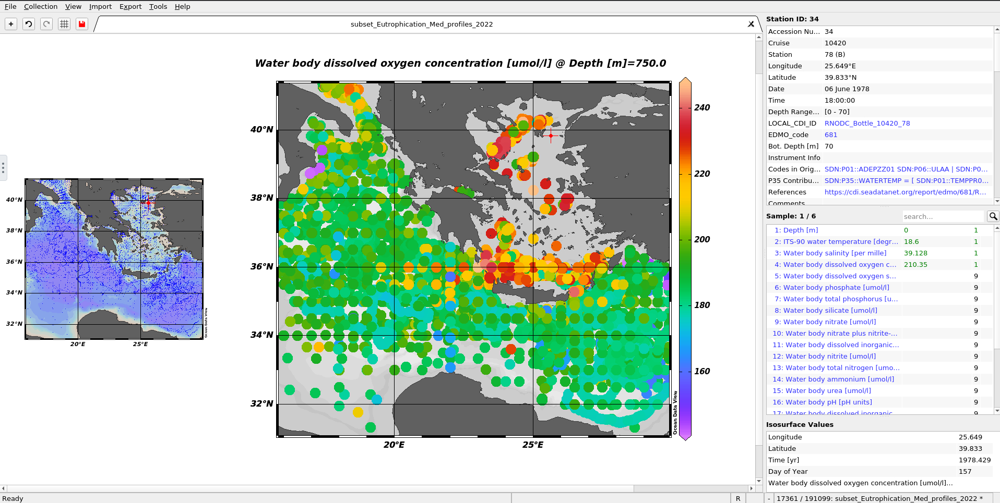
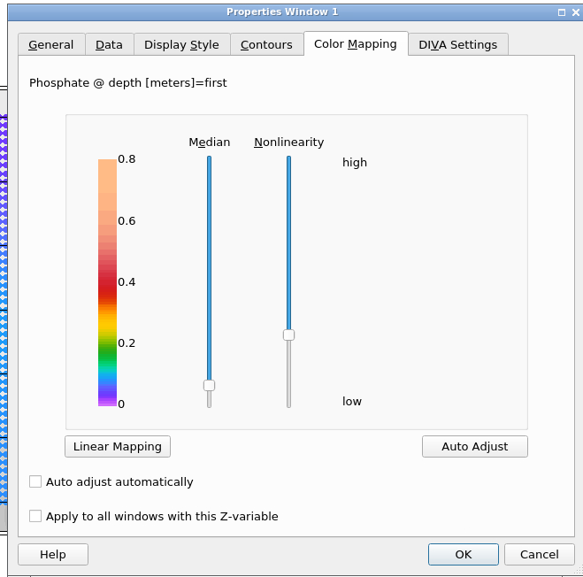

# Introduction


Through this tutorial, you will learn in the first part how to import, visualise, and extract data from an ODV collection by using the ODV Galaxy interactive tool.
In the second part, you will learn how to use DIVAnd using the inputs the outputs from ODV.

Ocean Data View (ODV) is a software package for the interactive exploration, analysis and visualization of oceanographic and other geo-referenced profile, time-series, trajectory,
or sequence data. To know more about ODV go check the [official page](https://odv.awi.de/)

DIVAnd (Data-Interpolating Variational Analysis in n dimensions) performs an n-dimensional variational analysis/gridding of arbitrarily located observations.
Observations will be interpolated/analyzed on a curvilinear grid in 1, 2, 3 or more dimensions. See the [official page](https://gher-uliege.github.io/DIVAnd-presentation/#1)

> <agenda-title></agenda-title>
>
> In this tutorial, we will cover:
>
> 1. TOC
> {:toc}
>
{: .agenda}

> <details-title> Some complementary information about your data </details-title>
> The data here are Mediterranean Sea - Eutrophication and Acidity aggregated datasets
> EMODnet Chemistry aims to provide access to marine chemistry datasets and derived data products concerning eutrophication, acidity, and contaminants. The importance of the selected substances and other parameters relates to the Marine Strategy Framework Directive (MSFD). This aggregated dataset contains all unrestricted EMODnet Chemistry data on eutrophication and acidity and covers the Mediterranean Sea. Data were aggregated and quality controlled by the 'Hellenic Centre for Marine Research, Hellenic National Oceanographic Data Centre (HCMR/HNODC)' in Greece. To get more ODV collection and other data please  [search the sextant catalogue](https://sextant.ifremer.fr/eng/Data/Catalogue#/search?isTemplate=n&from=1&to=30&sortBy=dateStamp&sortOrder=desc&languageStrategy=searchInDetectedLanguage&any=EMODnet%20Chemistry) or the [EMODnet Chemistry catalogue](https://emodnet-chemistry.webodv.awi.de/).
>
>  ITS-90 water temperature and water body salinity variables have also been included ('as are') to complete the eutrophication and acidity data. If you use these variables for calculations, please refer to SeaDataNet for the quality flags: https://www.seadatanet.org/Products/Aggregated-datasets.
>
> Regional datasets concerning eutrophication and acidity are automatically harvested, and the resulting collections are aggregated and quality-controlled using ODV Software and following a common methodology for all sea regions . Parameter names are based on P35 vocabulary, which relates to EMODnet Chemistry aggregated parameter names and is available at: https://vocab.nerc.ac.uk/search_nvs/P35/.
>
> When not present in the original data, water body nitrate plus nitrite was calculated by summing all nitrate and nitrite parameters. The same procedure was applied for water body dissolved inorganic nitrogen (DIN), which was calculated by summing all nitrate, nitrite, and ammonium parameters. Concentrations per unit mass were converted to a unit volume using a constant density of 1.025 kg/L. 
>
{: .details}



<div class="Workflow" markdown="1">

# Manage your data

> <hands-on-title>Prepare your history</hands-on-title>
> 1. Create a new history for this tutorial and give it a name (for example “Ocean's variables”) for you to find it again later if needed.
>
>    
>
> 2. Import an ODV collection as a zip folder.
>
>    Use this link `https://github.com/fair-ease/Data-for-Galaxy-/raw/main/Eutrophication_Med_profiles_2022_unrestricted_SNAPSHOT_2023-10-24T16-39-44.zip` in the folowing instructions.
>    And **Name** it **Eutrophication_Med_profiles_2022_unrestricted_SNAPSHOT_2023-10-24T16-39-44.zip**
>
>    
>
> 3. Get the Bathymetry
> First you need to download a bathymetry file you can use this link <https://dox.ulg.ac.be/index.php/s/U0pqyXhcQrXjEUX/download> with the folowing Hands-on box where you can name this dataset **bathymetry.nc**
>
> 
>
> Check that the file is in netcdf !
>
> 
>
{: .hands_on}

# Import and launch the workflow
> <hands-on-title>Import the workflow</hands-on-title>
>   - Click on Workflow on the top menu bar of Galaxy. You will see a list of all your workflows.
>   - Option 1: use the URL
>   	- Click on  Import at the top-right of the screen
>   	- Paste the URL of the workflow into the box labelled “Archived Workflow URL” `https://earth-system.usegalaxy.eu/u/marie.josse/w/oceans-var-v2`
>   - Option 2: use the workflow name
>   	- Click on **Public workflows** at the top-right of the screen
>       - Search for **Ocean's variables 2.0**
>       - In the workflow preview box click on  Import
>   - Click the Import workflow button
{: .hands_on}

> <hands-on-title>Run the workflow</hands-on-title>
>    - Click on Workflow on the top menu bar of Galaxy. You will see a list of all your workflows.
>    - Click on the  (Run workflow) button next to your workflow
>    - /!\ Select **Yes** for **Workflow semi automatic**
>    - Configure the workflow as needed with the 2 datasets you uploaded right before (**Eutrophication_Med_profiles_2022_unrestricted_SNAPSHOT_2023-10-24T16-39-44.zip** and **gebco_30sec_8.nc**
>    - Click the Run Workflow button at the top-right of the screen
>    - You may have to refresh your history to see the queued jobs
{: .hands_on}

# Workflow human in the loop

Now you've got your workflow running, however this workflow is composed of both interactive and non interactive tools. Thus, for the interactive tools we need you !

## Ocean Data view: Managing an interactive tool
ODV is now integrated in Galaxy as an interactive tool. This kind of tool works differently than classical tools as it allows the user to interact interactively with your data.
This kind of tool is used to give access to Jupyter Notebooks, RStudio or R Shiny apps for example.

To use ODV, you need to use the , you can specify input datasets from your history you want to use in ODV,
then press the **execute** button to launch an ODV instance. When the graphical user interface of ODV is ready to be used, a URL will be displayed at the top of the
Galaxy center panel. If you don't see it, you can see and access it through the "Active InteractiveTools" space of the "User" menu or you can click on  on
the tool in the history.

Once you finish your work on ODV, if you want to retrieve data and/or the entire project, you need to save files in ODV/galaxy/outputs, then quit ODV properly through
the "Project" Menu tab.

To get in the interactive tool do the folowing



### Visualise your Data

> <tip-title>Copy pasting between computer and ODV</tip-title>
> You can expand the ODV left panel (where there are 3 dots, vertically) to access the "clipboard" menu and paste the content you want to paste on an ODV form. From there you can copy-paste everything from one side to the other. Then, click outside of this panel to collapse it.
>
> 
{: .tip}

> <tip-title>ODV - Disconnected</tip-title>
> If at one point your ODV interface becomes grey with a red panel on the top "X ODV - Disconnected", do NOT panic ;) you just need to reload your tab (circular arrow top left)
{: .tip}

> <hands-on-title>Loading data</hands-on-title>
>
> 1. Click on close of the pop-up screen for the check for Updates
> 2. Go the top left and click on **File**, then on **Open...**
> 3. On the pop-up screen on the left panel select **ODV**, then the folder **galaxy**, then **data**.
> You should see a folder open it (double clicking)
> 4. Select the file with a .odv extension
> 	
> 5. Click on **Open** in the bottom right
>
> There your data should be opening an you can now visualise them!
{: .hands_on}


> <question-title></question-title>
>
> 1. What are the longitude and latitude of the red dot?
>
> > <solution-title></solution-title>
> >
> > 1. On the to right window you can read Longitude 34°E and Latitude 32.332°N.
> >
> {: .solution}
>
{: .question}

### Subset Data

> <hands-on-title>Create a subset</hands-on-title>
> 1. On the left smaller map right click and select **Zoom**
> 2. Then move your cursor on the map you should see a red rectangle moving along
> 3. Reduce the rectangular to have the selection you want on the map. It can be something similar to the following image (no need to be exactly the same)
>	
> 4. Once you're happy with your selection click on **Enter** on your keyboard.
>	
>
> Here you have created a a subset of your data.
{: .hands_on}

> <tip-title>Change your visualisation properties</tip-title>
> 1. Go to the central map
> 2. Click right and select **Properties...**
> 3. For example, make your data dots bigger in "Display Style" increase the number below "Symbol Size" to 50, and click **OK**
> 
>
> You can now see bigger dots representing your data.
> 
>
> If you already saved it once you just have to click left on the save icon (top left) when it's red.
{: .tip}

### Save Data



<div class="xview" markdown="1">
> <hands-on-title>Save your subset view</hands-on-title>
> 1. On the top left of your screen, you can see a red save button. Right-click on it.
> 2. In the pop-up screen go to the folder **ODV**, **galaxy**, **outputs**.
> 3. In **File name** rename your view (for example Eutrophication_Med_profiles_2022_unrestricted_SNAPSHOT_2023-10-24T16-39-44), and **Save**.
{: .hands_on}
</div>
<div class="png" markdown="1">
> <hands-on-title>Save your subset map</hands-on-title>
> 1. Click right on the map and select **Save Plot As...**
> 2. In the pop-up screen go to the folder **ODV**, **galaxy**, **outputs**.
> 3. In **File name** rename your view (for example Eutrophication_Med_profiles_2022_unrestricted_SNAPSHOT_2023-10-24T16-39-44)
> 4. In **Files of type** select `PNG (*.png *.PNG)` and **Save** then **OK** and **OK**.
{: .hands_on}
</div>


> <hands-on-title>Extract your variables in netcdf data</hands-on-title>
> Now we want to extract and save the right parameters of your data in netcdf format.
> 1. Go to the the left and click on **Export**, **Data** and **NetCDF File...**
> 2. In the pop-up screen go to the folder **ODV**, **galaxy**, **outputs**.
> 3. Click **Save**
> 4. A new pop-up window opens "Select Extended Metadata Variables for Export" Let the 56 items selected and click **OK**
> 5. "Select Data Variables for Export"  `here you need to select 1: Depth[m]`, ̀`4: Water body dissolved oxygen concentration [umol/l]`, `6: Water body phosphate [umol/l]` and click **OK**
>	
> 6. "NetCDF File Properties" change the **Longitude range** to `[-180 ... 180] degrees_E`, then select `Export metadata quality flags` and `Export data quality flags` and **OK**.
> 7. And **OK** again
>
> You now know how to export and save the right variables on ODV to netCDF data.
{: .hands_on}

Now, if you have finished with your analysis you can exit ODV. To do so you need to do it properly.

> <hands-on-title>Exit ODV and go back on Galaxy</hands-on-title>
> 1. On the top left click on **File** select **Exit**
> 2. If you want to save the other window also click on **Yes**. Here we don't need it so click **No**.
>
> You can now go back to your Galaxy instance.
{: .hands_on}

## DIVAnd: Data-Interpolating Variational Analysis in n dimensions
You can see now in your Galaxy history that ODV turned green and that the folowing step launched itself.
This tool DIVAnd is not interactive. It will create a climatology in netcdf that will then be used as input in the next step which is ODV again.
Once, DIVAnd finished ODV get started and there we need you again !


## BONUS: Even more ODV

Do you want to go even further and visualise your new netcdf data? (Because this tutorial is fascinating and you want to keep reading ;))

> <hands-on-title>Open your Netcdf data in ODV</hands-on-title>
>
> 
>
> 1. Click on close of the pop-up screen for the check for Updates
> 2. Go the top left and click on **File**, then on **Open...**
> 3. On the pop-up screen on the left panel select **ODV**, then the folder **galaxy**, then **data**.
> You should see a file open it (double clicking)
> 4. Click on **Open** in the bottom right. Then click on **Next** until you can click on **Finish** you can keep everything by default.
>
> There your data should be opening and you can now visualise them!
> 
>
{: .hands-on}

> <hands-on-title>Visualise your Phosphate variable</hands-on-title>
> 1. Go on the big **+** on the top left
> 2. Select "1 SURFACE Window"
>	
> 3. Press right on the new plot and select **Properties...**
>	
> 4. In the tab "Display Style" increase the "Symbol size" to 22 for instance
> 5. In the tab "Color Mapping" increase the level of the "Median" part and lower the "Nonlinearity" such as in the following picture
> 	
> 6. Then, click on **OK**, and you can see the Phosphate repartition.
>
> 7. Click right on the map and select **Save Plot As...**
> 8. In the pop-up screen go to the folder **ODV**, **galaxy**, **outputs**.
> 9. In **Files of type** select `PNG (*.png *.PNG)` and **Save** then **OK** and **OK**.
>
> If you want to have a visualisation of the Phosphate according to the depth, you can do the following.
> 10. Go on the big **+** on the top left
> 11. Select "1 STATION Window" in the new tab, in the plot press enter on your keyboard.
> 12. Same as before to save it, click right on the map and select **Save Plot As...**
> 13. In **Files of type** select `PNG (*.png *.PNG)` and **Save** then **OK** and **OK**.
>
> You can now safely exit ODV.
> 14. On the top left click on **File** select **Exit**
> 15. If you want to save the other window also click on **Yes**. Here we don't need it so click **No**.
{: .hands-on}
</div>

<div class="Tools" markdown="1">
# Managing ODV Galaxy interactive tool

ODV is now integrated in Galaxy as an interactive tool. This kind of tool works differently than classical tools as it allows the user to interact interactively with your data.
This kind of tool is used to give access to Jupyter Notebooks, RStudio or R Shiny apps for example.

To use ODV, you need to use the , you can specify input datasets from your history you want to use in ODV,
then press the **execute** button to launch an ODV instance. When the graphical user interface of ODV is ready to be used, a URL will be displayed at the top of the
Galaxy center panel. If you don't see it, you can see and access it through the "Active InteractiveTools" space of the "User" menu or you can click on  on
the tool in the history.

Once you finish your work on ODV, if you want to retrieve data and/or the entire project, you need to save files in ODV/galaxy/outputs, then quit ODV properly through
the "Project" Menu tab.

> <details-title>Short introduction on how Galaxy works</details-title>
>
> You can come back to where you left off the tutorial anytime by clicking .
>
> > <hands-on-title>Log in to Galaxy</hands-on-title>
> > 1. Open your favorite browser (Chrome, Safari or Firefox as your browser, not Internet Explorer!)
> > 2. Browse to your [Galaxy instance](https://earth-system.usegalaxy.eu/)
> > 3. On the top panel go to **Login or Register**
> >
> >
> {: .hands_on}
>
> The Galaxy homepage is divided into three panels:
> * Tools on the left
> * Viewing panel in the middle
> * History of analysis and files on the right
>
> 
>
> The first time you use Galaxy, there will be no files in your history panel.
{: .details}


> <hands-on-title>Deploy your own ODV instance</hands-on-title>
>
> 1. Create a new history for this tutorial and give it a name (for example “Ocean's variables”) for you to find it again later if needed.
>
>    
>
> 2. Import an ODV collection as a zip folder.
>
>    Use this link `https://github.com/fair-ease/Data-for-Galaxy-/raw/main/Eutrophication_Med_profiles_2022_unrestricted_SNAPSHOT_2023-10-24T16-39-44.zip` in the folowing instructions.
>    And **Name** it **Eutrophication_Med_profiles_2022_unrestricted_SNAPSHOT_2023-10-24T16-39-44.zip**
>
>    
>
>
> 4.  with the following parameters:
>    - *"Select if you are using an ODV collection in a zip folder or if you have your own raw data"*: `The data you are using are an ODV collection in a zip folder`
>    - *"ODV collection in a zip folder."*: `Eutrophication_Med_profiles_2022_unrestricted_SNAPSHOT_2023-10-24T16-39-44.zip`
>
>	
>
> 4. Click on **Run Tool**
>
> 
>
{: .hands_on}

# Ocean Data View
## Visualise your Data

> <tip-title>Copy pasting between computer and ODV</tip-title>
> You can expand the ODV left panel (where there are 3 dots, vertically) to access the "clipboard" menu and paste the content you want to paste on an ODV form. From there you can copy-paste everything from one side to the other. Then, click outside of this panel to collapse it.
>
> 
{: .tip}

> <tip-title>ODV - Disconnected</tip-title>
> If at one point your ODV interface becomes grey with a red panel on the top "X ODV - Disconnected", do NOT panic ;) you just need to reload your tab (circular arrow top left)
{: .tip}

> <hands-on-title>Loading data</hands-on-title>
>
> 1. Click on close of the pop-up screen for the check for Updates
> 2. Go the top left and click on **File**, then on **Open...**
> 3. On the pop-up screen on the left panel select **ODV**, then the folder **galaxy**, then **data**.
> You should see a folder open it (double clicking)
> 4. Select the file with a .odv extension
> 	
> 5. Click on **Open** in the bottom right
>
> There your data should be opening an you can now visualise them!
{: .hands_on}


> <question-title></question-title>
>
> 1. What are the longitude and latitude of the red dot?
>
> > <solution-title></solution-title>
> >
> > 1. On the to right window you can read Longitude 34°E and Latitude 32.332°N.
> >
> {: .solution}
>
{: .question}

## Subset Data

> <hands-on-title>Create a subset</hands-on-title>
> 1. On the left smaller map right click and select **Zoom**
> 2. Then move your cursor on the map you should see a red rectangle moving along
> 3. Reduce the rectangular to have the selection you want on the map. It can be something similar to the following image (no need to be exactly the same)
>	
> 4. Once you're happy with your selection click on **Enter** on your keyboard.
>	
>
> Here you have created a a subset of your data.
{: .hands_on}

> <tip-title>Change your visualisation properties</tip-title>
> 1. Go to the central map
> 2. Click right and select **Properties...**
> 3. For example, make your data dots bigger in "Display Style" increase the number below "Symbol Size" to 50, and click **OK**
> 
>
> You can now see bigger dots representing your data.
> 
>
> If you already saved it once you just have to click left on the save icon (top left) when it's red.
{: .tip}

## Save Data



<div class="xview" markdown="1">
> <hands-on-title>Save your subset view</hands-on-title>
> 1. On the top left of your screen, you can see a red save button. Right-click on it.
> 2. In the pop-up screen go to the folder **ODV**, **galaxy**, **outputs**.
> 3. In **File name** rename your view (for example Eutrophication_Med_profiles_2022_unrestricted_SNAPSHOT_2023-10-24T16-39-44), and **Save**.
{: .hands_on}
</div>
<div class="png" markdown="1">
> <hands-on-title>Save your subset map</hands-on-title>
> 1. Click right on the map and select **Save Plot As...**
> 2. In the pop-up screen go to the folder **ODV**, **galaxy**, **outputs**.
> 3. In **File name** rename your view (for example Eutrophication_Med_profiles_2022_unrestricted_SNAPSHOT_2023-10-24T16-39-44)
> 4. In **Files of type** select `PNG (*.png *.PNG)` and **Save** then **OK** and **OK**.
{: .hands_on}
</div>


> <hands-on-title>Extract your variables in netcdf data</hands-on-title>
> Now we want to extract and save the right parameters of your data in netcdf format.
> 1. Go to the the left and click on **Export**, **Data** and **NetCDF File...**
> 2. In the pop-up screen go to the folder **ODV**, **galaxy**, **outputs**.
> 3. Click **Save**
> 4. A new pop-up window opens "Select Extended Metadata Variables for Export" Let the 56 items selected and click **OK**
> 5. "Select Data Variables for Export"  `here you need to select 1: Depth[m]`, ̀`4: Water body dissolved oxygen concentration [umol/l]`, `6: Water body phosphate [umol/l]` and click **OK**
>	
> 6. "NetCDF File Properties" change the **Longitude range** to `[-180 ... 180] degrees_E`, then select `Export metadata quality flags` and `Export data quality flags` and **OK**.
> 7. And **OK** again
>
> You now know how to export and save the right variables on ODV to netCDF data.
{: .hands_on}

Now, if you have finished with your analysis you can exit ODV. To do so you need to do it properly.

> <hands-on-title>Exit ODV and go back on Galaxy</hands-on-title>
> 1. On the top left click on **File** select **Exit**
> 2. If you want to save the other window also click on **Yes**. Here we don't need it so click **No**.
>
> You can now go back to your Galaxy instance.
> Now, after waiting for everything to turn green in your history, you can see 2 new outputs
> 
>
> In the history panel in the output **ODV all outputs** click on the  (eye) icon of your output.
>
> You can now visualize the outputs in Galaxy middle panel.
>
> 
> 
{: .hands_on}

# DIVAnd: Data-Interpolating Variational Analysis in n dimensions

> <tip-title>Check Datatype</tip-title>
> Go to your output 'data_from_Eutrophication_Med_profiles_2022_unrestricted'
>
> Check if the datatype is **netcdf** if not :
>
> 
{: .tip}



<div class="New user" markdown="1">

You chose New user ! Thus, you'll be running a batch tool, you just have to fill in the input like explained below.

## Get the Bathymetry
First you need to download a bathymetry file you can use this link <https://dox.ulg.ac.be/index.php/s/U0pqyXhcQrXjEUX/download> with the folowing Hands-on box where you can name this dataset **bathymetry.nc**



Check that the file is in netcdf !



## Use DIVAnd
> <hands-on-title> Create a climatology </hands-on-title>
>
> 1.  with the following parameters:
>    -  *"Input your netcdf data"*: `ODV netcdf outputs` (output of **Ocean Data View** )
>    -  *"Input your bathymetry netcdf file"*: `bathymetry.nc`
>    - *"Input longitude min (+east/-west)"*: `19.0`
>    - *"Input longitude max (+east/-west)"*: `30.0`
>    - *"Input latitude min (+north/-south)"*: `32.0`
>    - *"Input latitude max (+north/-south)"*: `38.0`
>    - *"Input starting date"*: `1950-01-01`
>    - *"Input ending date"*: `2017-12-31`
>    - *"Write the name of the variable of the analysis"*: `phosphate`
>    - *"Minimum of the salinity"*: `0`
>    - *"Maximum of the salinity"*: `100`
>
> 2. **Run Tool**
> 3. After a couple minutes an `DIVAnd netcdf output` output will appear green in your history.
> 4. Check that your data are in netcdf format with , it should be `netcdf`
>
> 
{: .hands_on}
</div>

<div class="Experimented user" markdown="1">

You chose Experimented user ! Thus, you'll be launching a Jupyterlab and you'll need to interact with it.

## Launch DIVAnd

Use ODV outputs as DIVAnd input.
> <hands-on-title>Run DIVANnd</hands-on-title>
>
> 1. Use  with the following parameters:
>    - *"Do you already have a notebook"*: `Start with a fresh notebook`
>    - *"Include data into the environment"*: `ODV netcdf outputs` (output of **Ocean Data View** )
> 2. **Run tool**
>
>    
{: .hands_on}

> <hands-on-title>Navigate the jupyterlab</hands-on-title>
> 1. Once in the Jupyterlab, go to the **Notebooks** folder.
> 2. There open a terminal window and write :
>    ```bash
>    wget https://raw.githubusercontent.com/fair-ease/Divand-Galaxy-ext/main/90-analysis-shorten.ipynb
>    ```
> 3. **Run the entire notebook.**
>
>    In the first 'outputs' folder (at the root of the Jupyterlab folders), you should now have one netcdf file "Water_body_Phosphate_Mediterranean".
>
>    So, you can now properly close the Jupyter notebook.
>
> 4. On the top left click on **files** and then on **Shut down**.
> 5. Go back to your Galaxy instance.
{: .hands-on}

After a couple of minutes, your outputs should appear in your Galaxy history.
</div>

# BONUS: Even more ODV

Do you want to go even further and visualise your new netcdf data? (Because this tutorial is fascinating and you want to keep reading ;))

> <hands-on-title>Open your Netcdf data in ODV</hands-on-title>
>   with the following parameters:
>    - *"Select if you are using an ODV collection in a zip folder or if you have your own raw data"*: `The data you are using are Netcdf or text tabular files`
>    - *"Netcdf or tabular text file. For text file, odv format is recommanded."*: `DIVAnd netcdf outputs` (output of **DIVAnd** )
>
> Click on **Run Tool**
>
> 
>
> 1. Click on close of the pop-up screen for the check for Updates
> 2. Go the top left and click on **File**, then on **Open...**
> 3. On the pop-up screen on the left panel select **ODV**, then the folder **galaxy**, then **data**.
> You should see a file open it (double clicking)
> 4. Click on **Open** in the bottom right. Then click on **Next** until you can click on **Finish** you can keep everything by default.
>
> There your data should be opening and you can now visualise them!
> 
>
{: .hands-on}

> <hands-on-title>Visualise your Phosphate variable</hands-on-title>
> 1. Go on the big **+** on the top left
> 2. Select "1 SURFACE Window"
>	
> 3. Press right on the new plot and select **Properties...**
>	
> 4. In the tab "Display Style" increase the "Symbol size" to 22 for instance
> 5. In the tab "Color Mapping" increase the level of the "Median" part and lower the "Nonlinearity" such as in the following picture
> 	
> 6. Then, click on **OK**, and you can see the Phosphate repartition.
>
> 7. Click right on the map and select **Save Plot As...**
> 8. In the pop-up screen go to the folder **ODV**, **galaxy**, **outputs**.
> 9. In **Files of type** select `PNG (*.png *.PNG)` and **Save** then **OK** and **OK**.
>
>    If you want to have a visualisation of the Phosphate according to the depth, you can do the following.
> 10. Go on the big **+** on the top left
> 11. Select "1 STATION Window" in the new tab, in the plot press enter on your keyboard.
> 12. Same as before to save it, click right on the map and select **Save Plot As...**
> 13. In **Files of type** select `PNG (*.png *.PNG)` and **Save** then **OK** and **OK**.
>
>     You can now safely exit ODV.
> 14. On the top left click on **File** select **Exit**
> 15. If you want to save the other window also click on **Yes**. Here we don't need it so click **No**.
{: .hands-on}

</div>

# Conclusion

Great you now know how to extract ocean variables from an ODV collection and use these extracted data in DIVAnd.
From there you can grid the phosphate variable on the subset extracted create a netcdf file and visualise it on ODV again.
We finished with the last results visible on the galaxy instance in the output **ODV all outputs** :


# Extra information

Coming up soon even more tutorials on and other Earth-System related trainings. Keep an  open if you are interested!
