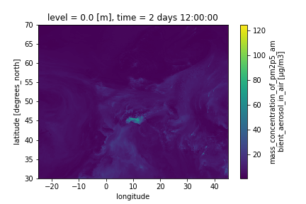
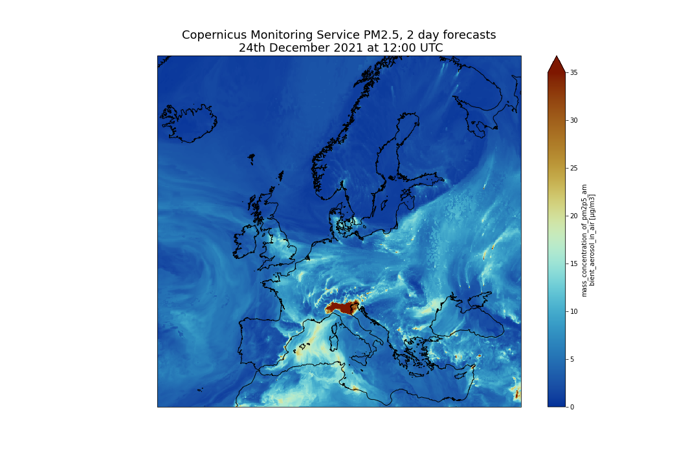
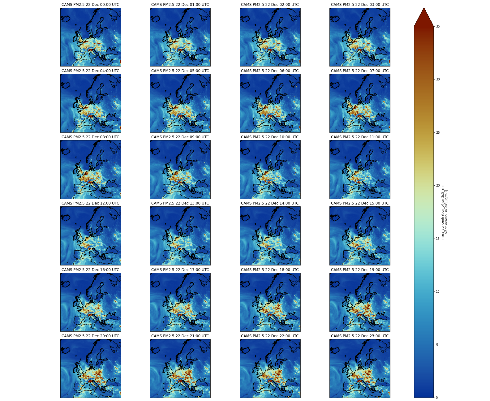
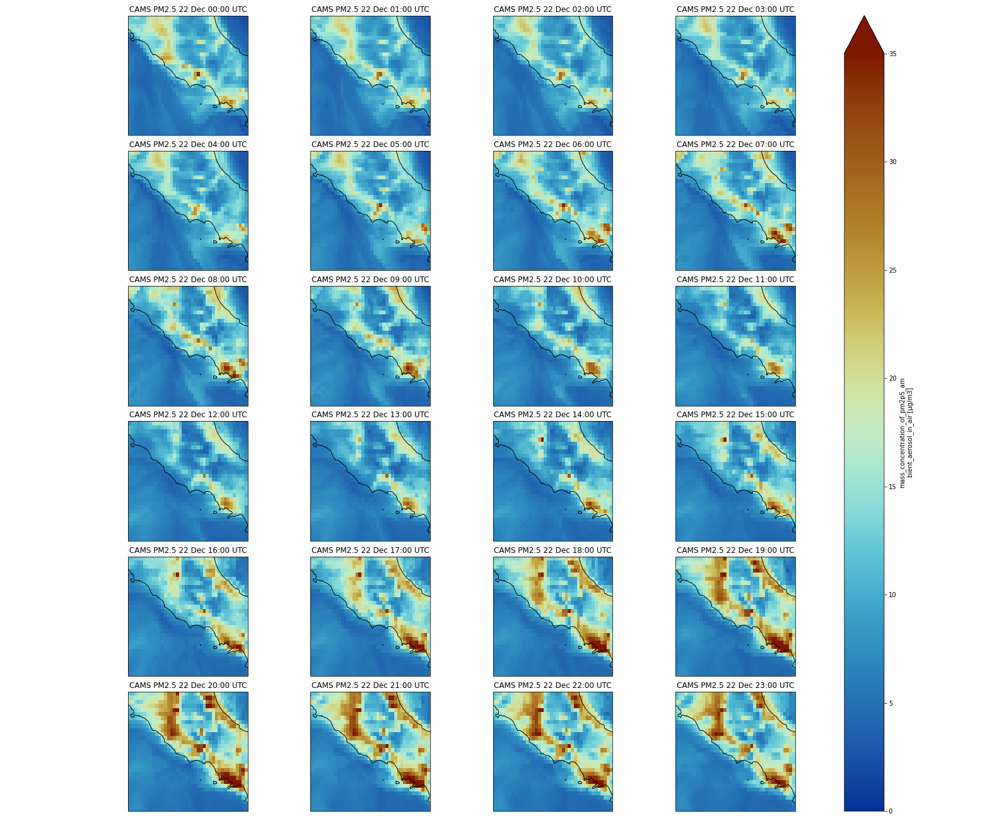
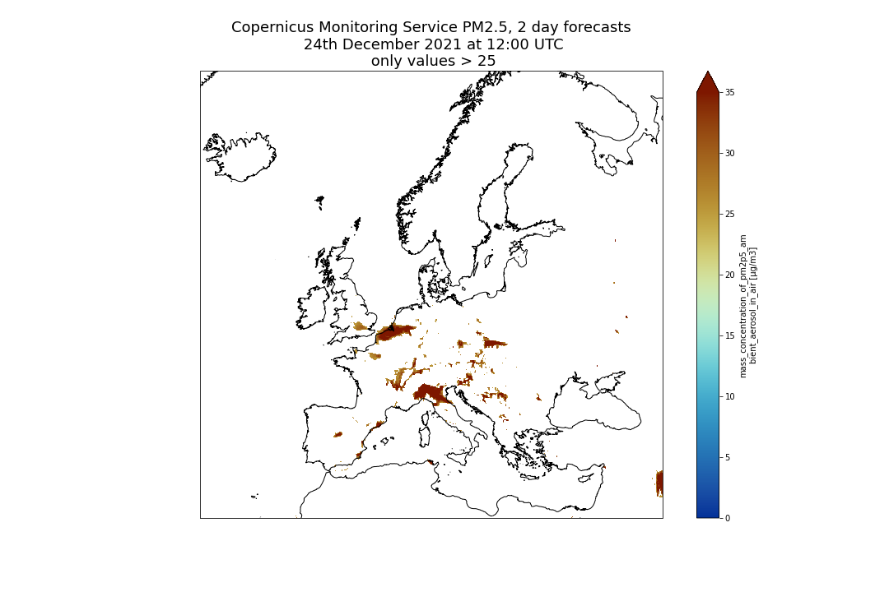
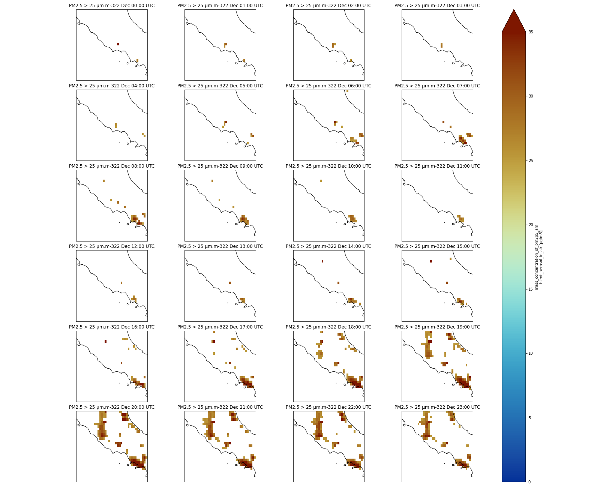

# Introduction


In this tutorial, we will learn about [Xarray](https://xarray.pydata.org/), one of the most used Python library from the [Pangeo](https://pangeo.io/) ecosystem.

We will be using data from [Copernicus Atmosphere Monitoring Service](https://ads.atmosphere.copernicus.eu/)
and more precisely PM2.5 ([Particle Matter < 2.5 μm](https://en.wikipedia.org/wiki/Particulates#Size,_shape_and_solubility_matter)) 4 days forecast from December, 22 2021. Parallel data analysis with Pangeo is not covered in this tutorial.

> <comment-title>Remark</comment-title>
>
> This tutorial uses data on a regular latitude-longitude grid. More complex and irregular grids are not discussed in this tutorial. In addition,
> this tutorial is not meant to cover all the different possibilities offered by Xarrays but shows functionalities we find useful for day to day
> analysis.
>
{: .comment}

> <agenda-title></agenda-title>
>
> In this tutorial, we will cover:
>
> 1. TOC
> {:toc}
>
{: .agenda}


# Analysis

## Import Python packages

Some packages may need to be installed first. For example `cmcrameri` is missing, so we need to install it by entering the following command in a new cell of your Jupyter Notebook:

```python
pip install cmcrameri
```

Then we need to import all the necessary packages in our Jupyter Notebook.

```python
import numpy as np
import xarray as xr
import cartopy.crs as ccrs
import matplotlib.pyplot as plt
import cmcrameri.cm as cmc
import pandas as pd
```

## Open and read metadata

The netCDF dataset can now be opened with Xarray:

```python
dset = xr.open_dataset("data/CAMS-PM2_5-20211222.netcdf")
```

Once opened, we can get metadata using `print` statement.

```python
print(dset)
```

Below is what you should get if everything goes fine.

> <code-out-title></code-out-title>
> ```
>  <xarray.Dataset>
>  Dimensions:     (longitude: 700, latitude: 400, level: 1, time: 97)
>  Coordinates:
>    * longitude   (longitude) float32 -24.95 -24.85 -24.75 ... 44.75 44.85 44.95
>    * latitude    (latitude) float32 69.95 69.85 69.75 69.65 ... 30.25 30.15 30.05
>    * level       (level) float32 0.0
>    * time        (time) timedelta64[ns] 00:00:00 01:00:00 ... 4 days 00:00:00
> Data variables:
>   pm2p5_conc  (time, level, latitude, longitude) float32 0.4202 ... 7.501
> Attributes:
>   title:        PM25 Air Pollutant FORECAST at the Surface
>   institution:  Data produced by Meteo France
>   source:       Data from ENSEMBLE model
>   history:      Model ENSEMBLE FORECAST
>   FORECAST:     Europe, 20211222+[0H_96H]
>   summary:      ENSEMBLE model hourly FORECAST of PM25 concentration at the...
>   project:      MACC-RAQ (http://macc-raq.gmes-atmosphere.eu)
> ```
{: .code-out}

> <tip-title>Command not found</tip-title>
> If you get an error with the previous command, first check the location of the input file `CAMS-PM2_5-20211222.netcdf`:
> it needs to be in the same directory as your Jupyter Notebook.
{: .tip }

We can identify 4 different sections:
1. **Dimensions**: name of dimensions and corresponding number of elements;
2. **Coordinates**: contains coordinate arrays (longitude, latitude, level and time) with their values.
3. **Data variables**: contains all the variables available in the dataset. Here, we only have one variable. For each variable, we get information on its shape and values.
4. **Attributes**: at this level, we get all the attributes of the dataset.

We can also get metadata information for each coordinate and data variables using "." followed by the coordinate or data variable name.

```python
print(dset.time)
```

> <question-title>CAM PM2.5 Dataset</question-title>
>
> What is the name of the variable for Particle matter < 2.5 μm and its physical units?
>
> > <solution-title></solution-title>
> > 1. To get metadata information from `pm2p5_conc` Data variable, we use its variable name and print it. Printing it will only print metadata, not the values.
> >      - Variable name: `mass_concentration_of_pm2p5_ambient_aerosol_in_air`
> >      - Units: `µg/m3`
> >
> > > <code-in-title>Python</code-in-title>
> > > ```python
> > > print(dset.pm2p5_conc)
> > > ```
> > {: .code-in}
> >
> > > <code-out-title></code-out-title>
> > > ```bash
> > >    <xarray.DataArray 'pm2p5_conc' (time: 97, level: 1, latitude: 400, longitude: 700)>
> > >    [27160000 values with dtype=float32]
> > >    Coordinates:
> > >      * longitude  (longitude) float32 335.0 335.1 335.2 335.4 ... 44.75 44.85 44.95
> > >      * latitude   (latitude) float32 69.95 69.85 69.75 69.65 ... 30.25 30.15 30.05
> > >      * level      (level) float32 0.0
> > >      * time       (time) timedelta64[ns] 00:00:00 01:00:00 ... 4 days 00:00:00
> > >    Attributes:
> > >        species:        PM2.5 Aerosol
> > >        units:          µg/m3
> > >        value:          hourly values
> > >        standard_name:  mass_concentration_of_pm2p5_ambient_aerosol_in_air
> > > ```
> > {: .code-out}
> {: .solution }
{: .question }

> <comment-title>Different ways to access Data variables</comment-title>
>
> To access a variable or coordinate, we can use "." or specify its name as a string between squared brackets "[" "]". For example:
>
> ```python
> print(dset['pm2p5_conc'])
> # or alternatively
> print(dset.pm2p5_conc)
> ```
>
> When we print a variable or coordinate, we do not get all the individual values but a `DataArray` that contains a lot of very useful metadata such as coordinates (if they have some), all the attributes such as the name, the physical units, etc.
>
{: .comment}
## Select / Subset from coordinates

We often want to select elements from the coordinates for instance to subset a geographical area or select specific times or a specific time range.

There are two different ways to make a selection:
- by index
- by value

### Select elements from coordinate by index

```python
print(dset.isel(time=0))
```

You should see that the coordinate `time` "disappeared" from the `Dimensions` and now the variable `pm2p5_conc` is a 3D field with longitude, latitude and level.

### Select elements from coordinates by value

When selecting elements by the value of the coordinate, we need to use the same datatype. For instance, to select an element from
`time`, we need to use `timedelta64`. The code below will give the same result as `isel(time=0)`.

```python
print(dset.sel(time=np.timedelta64(0)))
```

The output will be very similar to what we did previously when selecting from coordinates by index.

> <question-title>Select a single time for PM2.5</question-title>
>
> How to select the forecast for December, 24th 2021 at 12:00 UTC?
>
> > <solution-title></solution-title>
> > Data starts on December, 22nd 2021 at 00:00 UTC so we need to add 2 days and 12 hours to select the correct time index.
> >
> > > <code-in-title>Python</code-in-title>
> > > ```python
> > > print(dset.sel(time=(np.timedelta64(2,'D')+ np.timedelta64(12,'h'))))
> > > ```
> > {: .code-in}
> >
> > > <code-out-title></code-out-title>
> > > ```bash
> > > <xarray.Dataset>
> > > Dimensions:     (longitude: 700, latitude: 400, level: 1)
> > > Coordinates:
> > >   * longitude   (longitude) float32 -24.95 -24.85 -24.75 ... 44.75 44.85 44.95
> > >   * latitude    (latitude) float32 69.95 69.85 69.75 69.65 ... 30.25 30.15 30.05
> > >   * level       (level) float32 0.0
> > >     time        timedelta64[ns] 2 days 12:00:00
> > > Data variables:
> > >     pm2p5_conc  (level, latitude, longitude) float32 0.4499 0.4421 ... 10.71
> > > Attributes:
> > >     title:        PM25 Air Pollutant FORECAST at the Surface
> > >     institution:  Data produced by Meteo France
> > >     source:       Data from ENSEMBLE model
> > >     history:      Model ENSEMBLE FORECAST
> > >     FORECAST:     Europe, 20211222+[0H_96H]
> > >     summary:      ENSEMBLE model hourly FORECAST of PM25 concentration at the...
> > >     project:      MACC-RAQ (http://macc-raq.gmes-atmosphere.eu)
> > > ```
> > {: .code-out}
> {: .solution }
{: .question }


## Plotting

To plot a map, you need to select a variable with data on geographical coordinates (latitude, longitude). In addition, coordinates need to be sorted, and preferably in increasing order. This is not the case for the coordinate "longitude" which is given between 360 and 0.

Let's shift the longitudes by 180 degrees so that they come in the range of -180 to 180.

### Shift longitudes

We print the longitudes before and after shifting them so we can see what is happening.

```python
print(dset.longitude)
```

The longitude values are between `335.05` and `44.95` degrees.


Let's now shift the longitudes to get values between `-180`, `180` degrees.

```python
dset.coords['longitude'] = (dset['longitude'] + 180) % 360 - 180
print(dset.longitude)
```

Indeed, the longitudes have been shifted and now the values are between `-24.95` and `44.95`.

### Visualize on a map PM2.5 for December, 24th 2021 at 12:00 UTC

```python
dset.sel(time=(np.timedelta64(2,'D')+ np.timedelta64(12,'h'))).pm2p5_conc.plot()
```
We will get a figure like the one below:




> <comment-title>What about `level`</comment-title>
> Note that in the previous plot, we did not need to select `level` because there is one value only. However, if we had more than one level, we would need to add a selection on the level before plotting
>
{: .comment}

### Customize your plot

There are many ways to customize your plots and we will only detail what we think is important for creating publication ready figures:
- Define the size of the figure
- Choose to project data on a different projection.
- Add coastline
- Set the min and max values for plotting
- Add a title, change colorbar title
- Save figure into png

```python
fig = plt.figure(1, figsize=[15,10])

# We're using cartopy to project our data.
# (see documentation on cartopy)
ax = plt.subplot(1, 1, 1, projection=ccrs.Mercator())
ax.coastlines(resolution='10m')

# We need to project our data to the new projection and for this we use `transform`.
# we set the original data projection in transform (here PlateCarree)
dset.sel(time=(np.timedelta64(2,'D') + np.timedelta64(12,'h')))['pm2p5_conc'].plot(ax=ax,
                                                                                    transform=ccrs.PlateCarree(),
                                                                                    vmin = 0, vmax = 35,
                                                                                    cmap=cmc.roma_r)
# One way to customize your title
plt.title("Copernicus Atmosphere Monitoring Service PM2.5, 2 day forecasts\n 24th December 2021 at 12:00 UTC", fontsize=18)
plt.savefig("CAMS-PM2_5-fc-20211224.png")
```
>    {: .code-in}

And you should get the following plot:



### Multi-plots

Now, we will plot several times on the same figure in different sub-plots; we will not plot all the times (too many) but the first 24 forecasted values.

Firstly, we need to create a list of times and convert it to `pandas datetime` in order to make it easier to format times when plotting:

```python
list_times = np.datetime64('2021-12-22') + dset.time.sel(time=slice(np.timedelta64(0),np.timedelta64(1,'D')))
print(pd.to_datetime(list_times).strftime("%d %b %H:%S UTC"))
```

Secondly, we need to use the same plotting method as earlier, but we pass additional parameters:

- `vmin = 0`and `vmax = 35` to set the minimum and maximum values when plotting (this is useful to highlight features in your plot)
- `subplot_kws={"projection": proj_plot}` to project data on a non-default projection. See [cartopy projection](https://scitools.org.uk/cartopy/docs/v0.15/crs/projections.html) for more information about projections.
- `col='time'` because we will plot several `time`;
-  `col_wrap=4` to have a maximum of 4 plots per row. If we have more times to plot, then the next figures will be on another row.
- `robust=True` and `aspect=dset.dims["longitude"] / dset.dims["latitude"]` are additional parameters to make each subplot with a "sensible" figsize.
- `cmap=cmc.roma_r` to select a non-default and color-blind friendly colormap (see [scientific colormaps](https://www.fabiocrameri.ch/colourmaps/)).


```python
fig = plt.figure(1, figsize=[10,10])

# We're using cartopy to project our data.
# (see documentation on cartopy)
proj_plot = ccrs.Mercator()

# We need to project our data to the new projection and for this we use `transform`.
# we set the original data projection in transform (here PlateCarree)
p = dset.sel(time=slice(np.timedelta64(1,'h'),np.timedelta64(1,'D')))['pm2p5_conc'].plot(transform=ccrs.PlateCarree(),
                                                                                       vmin = 0, vmax = 35,
                                                                                       subplot_kws={"projection": proj_plot},
                                                                                       col='time', col_wrap=4,
                                                                                       robust=True,
                                                                                      aspect=dset.dims["longitude"] / dset.dims["latitude"],  # for a sensible figsize
                                                                                       cmap=cmc.roma_r)
# We have to set the map's options on our axes
for ax,i in zip(p.axes.flat,  (np.datetime64('2021-12-22') + dset.time.sel(time=slice(np.timedelta64(0),np.timedelta64(1,'D')))).values):
      ax.coastlines('10m')
      ax.set_title("CAMS PM2.5 " + pd.to_datetime(i).strftime("%d %b %H:%S UTC"), fontsize=12)
# Save your figure
plt.savefig("CAMS-PM2_5-fc-multi.png")
```
In the second part of our plot, we are going to customize each subplot (this is why we loop for each of them and get their axes) by adding:

-  `coastlines`: we pass a parameter `10m` to get coastlines with a high resolution (non-default);
- `set_title` to set a title for each subplot.




> <question-title>PM2.5 over Italy</question-title>
>
> Using a Multi-plot between Rome and Naples, can you tell us if the forecasted PM2.5 will increase or decrease during the first 24 hours?
>
> > <solution-title></solution-title>
> > We will select a sub-area: 11. East to 15.0 East and 40. N to 43. N. PM2.5 will increase and reach values close to 35 μm.m-3.
> > We will use `slice` to select the area and we slice latitudes with `latitude=slice(47.3, 36.5)` and not `latitude=slice(36.5, 47.3)`.
> > The reason is that when using slice, you need to specify values using the same order as in the coordinates. Latitudes are specified in
> > decreasing order for CAMS.
> >
> > > <code-in-title>Python</code-in-title>
> > > ```python
> > > fig = plt.figure(1, figsize=[10,10])
> > >
> > > # We're using cartopy to project our data.
> > > # (see documentation on cartopy)
> > > proj_plot = ccrs.Mercator()
> > >
> > > # We need to project our data to the new projection and for this we use `transform`.
> > > # we set the original data projection in transform (here PlateCarree)
> > > p = dset.sel(time=slice(np.timedelta64(1,'h'),np.timedelta64(1,'D'))).sel(latitude=slice(43., 40.),
> > >                                                                           longitude=slice(11.,15.))['pm2p5_conc'].plot(transform=ccrs.PlateCarree(),
> > >                                                                                      vmin = 0, vmax = 35,
> > >                                                                                      subplot_kws={"projection": proj_plot},
> > >                                                                                      col='time', col_wrap=4,
> > >                                                                                      robust=True,
> > >                                                                                      aspect=dset.dims["longitude"] / dset.dims["latitude"],  # for a sensible figsize
> > >                                                                                      cmap=cmc.roma_r)
> > > # We have to set the map's options on all axes
> > > for ax,i in zip(p.axes.flat,  (np.datetime64('2021-12-22') + dset.time.sel(time=slice(np.timedelta64(0),np.timedelta64(1,'D')))).values):
> > >     ax.coastlines('10m')
> > >     ax.set_title("CAMS PM2.5 " + pd.to_datetime(i).strftime("%d %b %H:%S UTC"), fontsize=12)
> > > # Save your figure
> > > plt.savefig("CAMS-PM2_5-fc-multi-Italy.png")
> > > ```
> > {: .code-in}
> >
> >  
> >
> {: .solution }
{: .question }


## How to use the **where** method

Sometimes we may want to make more complex selections with criteria on the values of a given variable and not only on its coordinates. For this purpose,  we use the `where` method. For instance, we may want to only keep PM2.5 if values are greater than 25 μm.m-3 (or any threshold you would like to choose).

### Mask values that do not meet a criteria with `Where`

```python
print(dset.where(dset['pm2p5_conc'] > 25))
```

> <comment-title>What happened?</comment-title>
> Each element of the dataset where the criteria within the `where` statement is not met, e.g. when PM2.5 <= 25, will be set to `nan`.
> You may not see any changes when printing the dataset but if you look carefuly at `pm2p5_conc` values, you will see many `nan`.
>
{: .comment}

Let's plot one time to better see what happened:

```python
######################
# Plotting with mask #
######################

fig = plt.figure(1, figsize=[15,10])

# We're using cartopy to project our data.
# (see documentation on cartopy)
ax = plt.subplot(1, 1, 1, projection=ccrs.Mercator())
ax.coastlines(resolution='10m')

# We need to project our data to the new projection and for this we use `transform`.
# we set the original data projection in transform (here PlateCarree)
dset.where(dset['pm2p5_conc'] > 25).isel(time=0)['pm2p5_conc'].plot(ax=ax,
                                                                     transform=ccrs.PlateCarree(),
                                                                     vmin = 0, vmax = 35,
                                                                     cmap=cmc.roma_r)
# One way to customize your title
plt.title("Copernicus Atmosphere Monitoring Service PM2.5, 2 day forecasts\n 24th December 2021 at 12:00 UTC\n only values > 25", fontsize=18)
plt.savefig("CAMS-PM2_5-fc-20211224-25.png")
```



We can then make the same multi-plot as earlier (over Italy) but with a `where` statement to mask values lower than 25 μm.m-3:

### Multi-plot over Italy using a mask

```python
fig = plt.figure(1, figsize=[10,10])

# We're using cartopy to project our data.
# (see documentation on cartopy)
proj_plot = ccrs.Mercator()

# We need to project our data to the new projection and for this we use `transform`.
# we set the original data projection in transform (here PlateCarree)
p = dset.where(dset['pm2p5_conc'] > 25).sel(time=slice(np.timedelta64(1,'h'),np.timedelta64(1,'D'))).sel(latitude=slice(43., 40.),
                                                                           longitude=slice(11.,15.))['pm2p5_conc'].plot(transform=ccrs.PlateCarree(),
                                                                                      vmin = 0, vmax = 35,
                                                                                     subplot_kws={"projection": proj_plot},
                                                                                     col='time', col_wrap=4,
                                                                                     robust=True,
                                                                                     aspect=dset.dims["longitude"] / dset.dims["latitude"],  # for a sensible figsize
                                                                                     cmap=cmc.roma_r)
# We have to set the map's options on all four axes
for ax,i in zip(p.axes.flat,  (np.datetime64('2021-12-22') + dset.time.sel(time=slice(np.timedelta64(0),np.timedelta64(1,'D')))).values):
     ax.coastlines('10m')
     ax.set_title("PM2.5 > 25 μm.m-3" + pd.to_datetime(i).strftime("%d %b %H:%S UTC"), fontsize=12)
# Save your figure
plt.savefig("CAMS-PM2_5-fc-multi-Italy-25.png")
```




## Reduction operations
We often want to compute the mean of all our datasets, or along a dimension (for instance time). If you do not pass any argument to the operation then it is done over all dimensions.

### Details on the **mean** method
When we do not specify any parameters, we get a single value.

```python
print(dset.sel(latitude=slice(43., 40.), longitude=slice(11.,15.)).mean())
```

> <code-out-title></code-out-title>
> ```bash
> <xarray.Dataset>
> Dimensions:     ()
>  Data variables:
>     pm2p5_conc  float32 9.118
>```
{: .code-out}


> <question-title>Maximum PM2.5 over Italy</question-title>
>
> What is the maximum forecasted PM2.5 value over the Rome-Naples region?
>
> > <solution-title></solution-title>
> >  We  select the same sub-area: 11. East to 15.0 East and 40. N to 43. N and compute the maximum with `max`. The maximum PM2.5 value is **59.13694382** μm.m-3 (that is rounded to **59.14**).
> >
> > > <code-in-title>Python</code-in-title>
> > > ```python
> > > dset.sel(latitude=slice(43., 40.), longitude=slice(11.,15.)).max()
> > > ```
> > {: .code-in}
> >
> > > <code-out-title></code-out-title>
> > > ```bash
> > > xarray.Dataset
> > > Dimensions:
> > > Coordinates: (0)
> > > Data variables:
> > > pm2p5_conc
> > > ()
> > > float64
> > > 59.14
> > > array(59.13694382)
> > > Attributes: (0)
> > > ```
> > {: .code-out}
> {: .solution }
{: .question }

> <question-title>Find when the maximum PM2.5 is forecasted</question-title>
>
> When is the maximum PM2.5 value forecasted?
>
> > <solution-title></solution-title>
> > We will select a sub-area: 11. East to 15.0 East and 40. N to 43. N and average over the entire selected area and search where the maximum PM2.5 value of 59.13694382 μm.m-3 is found. The maximum PM2.5 value occurs on 2021-12-22 at 20:00 UTC.
> >
> > > <code-in-title>Python</code-in-title>
> > > ```python
> > > dset_tmean = dset.sel(latitude=slice(43., 40.), longitude=slice(11.,15.)).max(dim=('latitude', 'longitude'))
> > > dset_tmean_max = dset_tmean.where(dset_tmean['pm2p5_conc'] == 59.13694382, drop=True)
> > > print(dset_tmean_max)
> > > ```
> > {: .code-in}
> >
> > > <code-out-title></code-out-title>
> > > ```bash
> > > <xarray.Dataset>
> > > Dimensions:     (time: 1, level: 1)
> > > Coordinates:
> > >   * level       (level) float32 0.0
> > >   * time        (time) timedelta64[ns] 20:00:00
> > > Data variables:
> > >     pm2p5_conc  (time, level) float32 59.14
> > > ```
> > {: .code-out}
> {: .solution }
{: .question }

> <comment-title>Pixel size when averaging</comment-title>
> We average over a relatively small area so we do not make a weighted average. Use weighted averages when averaging over the entire globe or over a large area where the pixel sizes may vary (depending on the latitude).
>
{: .comment}


## Details on the **resample** method

### 1 day Resampling

 The resampling frequency is lower than our original data, so we would need to apply a global operation on the data we group together such as mean, min, max:

```python
print(dset.resample(time='1D').mean())
```

> <code-out-title></code-out-title>
> ```bash
> <xarray.Dataset>
> Dimensions:     (time: 5, longitude: 700, latitude: 400, level: 1)
> Coordinates:
>   * time        (time) timedelta64[ns] 0 days 1 days 2 days 3 days 4 days
>   * longitude   (longitude) float32 -24.95 -24.85 -24.75 ... 44.75 44.85 44.95
>   * latitude    (latitude) float32 69.95 69.85 69.75 69.65 ... 30.25 30.15 30.05
>   * level       (level) float32 0.0
> Data variables:
>     pm2p5_conc  (time, level, latitude, longitude) float32 0.4298 ... 7.501
> ```
{: .code-out}


### 30 minute resampling

When the resampling frequency is higher than the original data, we need to indicate how to fill the gaps, for instance, interpolate and indicate which interpolation method to apply or select nearest values, etc.:

```python
print(dset.resample(time='30min').interpolate('linear'))
```

> <comment-title>Be careful when sub-sampling!</comment-title>
> Increasing the frequency of your data e.g. artificially creating data may not be scientifically relevant. Please use it carefully! Interpolating is not always scientifically relevant and sometimes you may prefer to choose a different method, like taking the nearest value for instance:
>
>    > <code-in-title>Python</code-in-title>
>    >  ```python
>    >  dset.resample(time='30min').nearest()
>    >  ```
>    {: .code-in}
>
{: .comment}


> <question-title>PM2.5 over Italy in the next 4 days</question-title>
>
> Using a Multi-plot between Rome and Naples, and making averages per day, can you tell us if forecasted PM2.5 will increase or decrease?
>
> > <solution-title></solution-title>
> > PM2.5 over Italy is overall decreasing over the next 4 forecasted days.
> >
> > > <code-in-title>Python</code-in-title>
> > > ```python
> > > fig = plt.figure(1, figsize=[10,10])
> > >
> > > # We're using cartopy to project our data.
> > > # (see documentation on cartopy)
> > > proj_plot = ccrs.Mercator()
> > >
> > > sub_dset = dset.sel(latitude=slice(43., 40.), longitude=slice(11.,15.)).resample(time='1D').mean()
> > > # We need to project our data to the new projection and for this we use `transform`.
> > > # we set the original data projection in transform (here PlateCarree)
> > > p = sub_dset['pm2p5_conc'].plot(transform=ccrs.PlateCarree(),
> > >                                 vmin = 0, vmax = 35,
> > >                                 subplot_kws={"projection": proj_plot},
> > >                                 col='time', col_wrap=5,
> > >                                 robust=True,
> > >                                 aspect=dset.dims["longitude"] / dset.dims["latitude"],  # for a sensible figsize
> > >                                 cmap=cmc.roma_r)
> > > # We have to set the map's options on all axes
> > > for ax,i in zip(p.axes.flat,  (np.datetime64('2021-12-22') + dset.time.sel(time=slice(np.timedelta64(0),np.timedelta64(1,'D')))).values):
> > >     ax.coastlines('10m')
> > >     ax.set_title("CAMS PM2.5 " + pd.to_datetime(i).strftime("%d %b %H:%S UTC"), fontsize=12)
> > > # Save your figure
> > > plt.savefig("CAMS-PM2_5-fc-multi-Italy-mean-per-day.png")
> > > ```
> > {: .code-in}
> >
> > 
> {: .solution }
{: .question }


> <comment-title>`Grouby` versus `resample`</comment-title>
>
> Use `groupby` instead of `resample` when you wish to group over a dimension that is not `time`. `groupby` is very similar to resample but can be applied to any coordinates and not only to time.
>
{: .comment}


# Conclusion


Well done! [Pangeo](https://pangeo.io/) is a fantastic community with many more resources for learning and/or contributing! Please, if you use any Python packages from the Pangeo ecosystem, do not forget to cite Pangeo , ,  and !

Have a look at the [Pangeo Tutorial Gallery](https://gallery.pangeo.io/repos/pangeo-data/pangeo-tutorial-gallery/) to pick up your next Pangeo training material!
