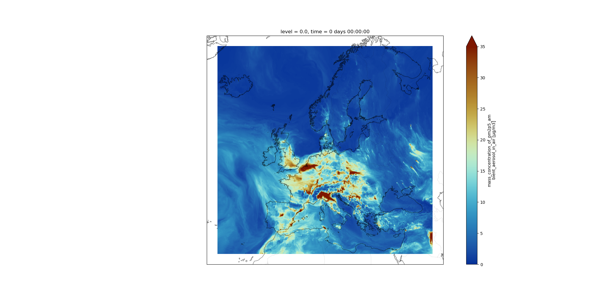
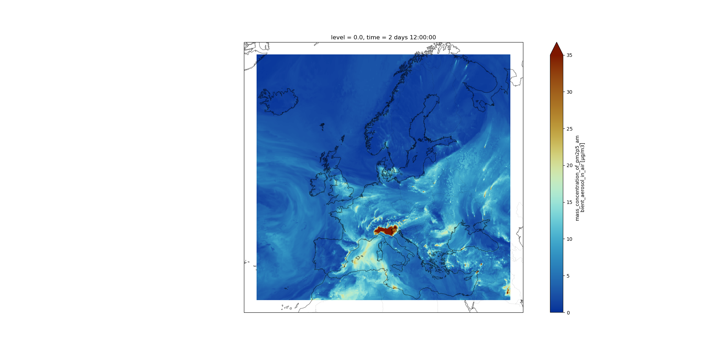
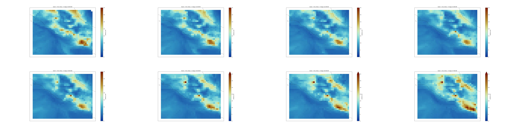
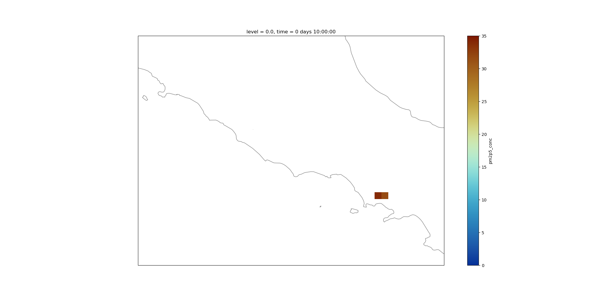
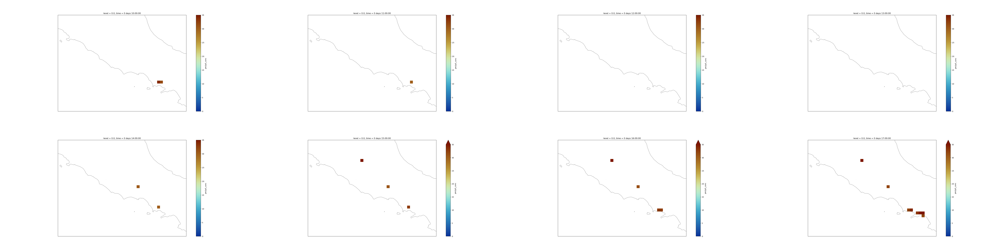
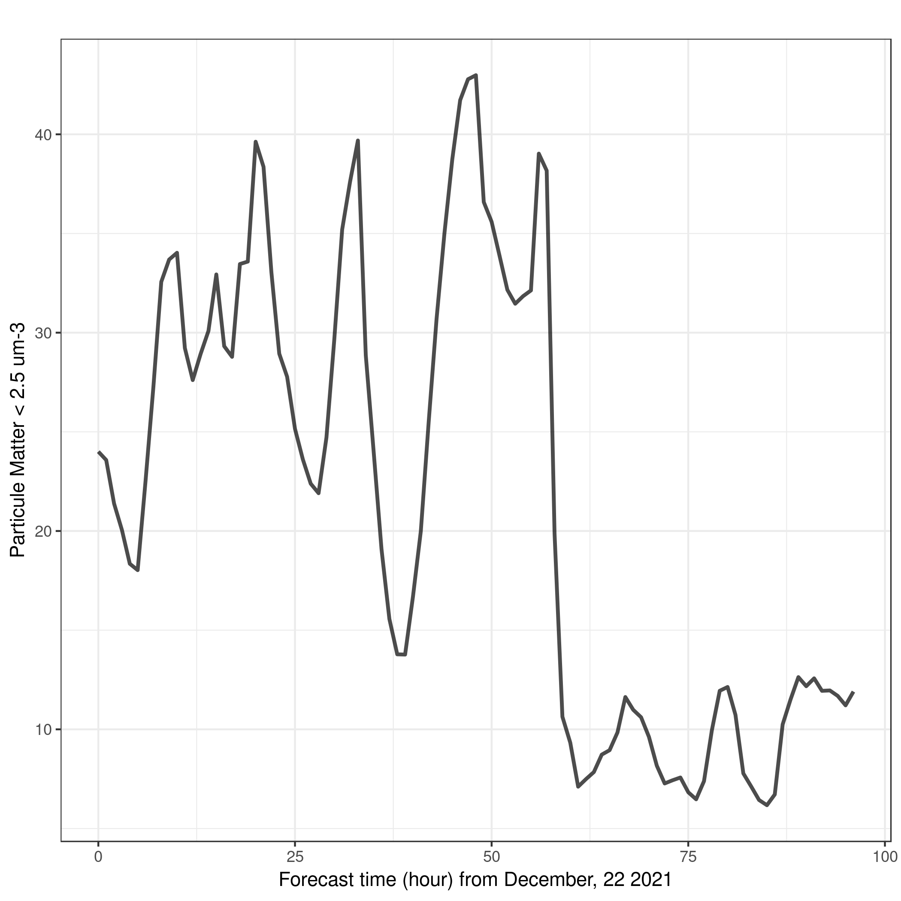
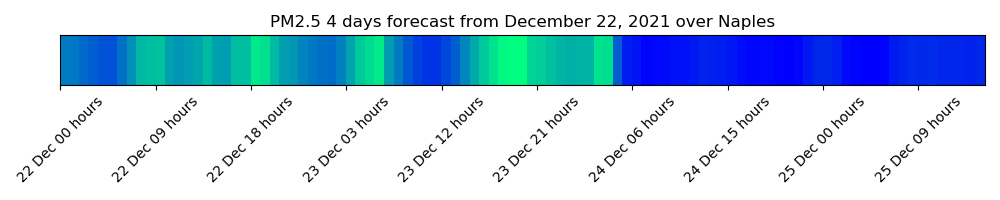

# Introduction


<!-- This is a comment. -->

[Pangeo](https://pangeo.io/) is a project that effectively began in 2016 with a workshop at Columbia University. The mission for Pangeo developed at that workshop is still valid nowadays:

*Our mission is to cultivate an ecosystem in which the next generation of open-source analysis tools for ocean, atmosphere and climate science can be developed, distributed, and sustained. These tools must be scalable in order to meet the current and future challenges of big data, and these solutions should leverage the existing expertise outside of the geoscience community.*

In this tutorial, you will learn how to manipulate [netCDF](https://en.wikipedia.org/wiki/NetCDF) data files using [Xarray](https://xarray.pydata.org/en/stable/) Galaxy Tools.  NetCDF stands for **network Common Data Form** and is one of the most popular file format in climate science. It is used for storing multidimensional scientific data variables such as temperature or humidity, and metadata can be added to facilitate sharing of netCDF data. netCDF is widely used outside the Climate Science community and each community has its own set of conventions, especially for metadata. The [Climate and Forecast metadata convention](https://cfconventions.org/), also called CF-convention is used by the Climate community and is designed to promote the processing and sharing of netCDF files.


> <comment-title>Xarray and Earth Science</comment-title>
> Xarray works with labelled multi-dimensional arrays and can be used for a very wide range of data and data formats. In this training material, we focus on the usage of Xarray for Earth Science data following the [CF-Convention](https://cfconventions.org/). However, some Galaxy Tools also work for non Earth Science datasets, and if needed current Xarray Galaxy Tools could be extended to accommodate new usage.
{: .comment}

In this tutorial, we will be using data from [Copernicus Atmosphere Monitoring Service](https://ads.atmosphere.copernicus.eu/) (CAMS).

CAMS produces daily [European air quality forecasts](https://ads.atmosphere.copernicus.eu/cdsapp#!/dataset/cams-europe-air-quality-forecasts?tab=overview) over Europe at a resolution of 0.1 degrees (which corresponds approximately to 10km). 
It is produced from an ensemble of nine air quality forecasting models across Europe: the nine models can be combined together and the spread between these models are used to provide an extimate of the forecast uncertainty. The analysis combines model data with observations provided by the [European Environment Agency](https://www.eea.europa.eu/) (EEA).

Several variables are generated and we will be using PM2.5 ([Particle Matter < 2.5 μm](https://en.wikipedia.org/wiki/Particulates#Size,_shape_and_solubility_matter)) 4 days forecast from December, 22 2021. Particle Matter < 2.5 μm (PM2.5) are fine particules that remain suspended for a long time and exposure to high concentration of PM2.5 (yearly mean values greater than 25 µg/m3) can have multiple short term and long term health impacts such as eye irritation, asthma and chronic bronchitis. Information on air quality standards in Europe can be found [here](https://ec.europa.eu/environment/air/quality/standards.htm).
The dataset we will be using in this tutorial is very small and there is no need to parallelize our data analysis. Parallel data analysis with Pangeo is not covered in this tutorial. 

 
> <agenda-title></agenda-title>
>
> In this tutorial, we will cover:
>
> 1. TOC
> {:toc}
>
{: .agenda}

# Create a history

> <hands-on-title>Create history</hands-on-title>
>
> 1. Make sure you start from an empty analysis history.
>
>    
>
> 2. **Rename your history** to be meaningful and easy to find. For instance, you can choose **Pangeo 101 for everyone - Xarray** as the name of your new history.
>
>    
>
{: .hands_on}


##  Upload CAMS PM2.5 data

> <hands-on-title>Data upload</hands-on-title>
>
> 1. Import the files from [Zenodo]({{ page.zenodo_link }}) or from
>    the shared data library (`GTN - Material` -> `{{ page.topic_name }}`
>     -> `{{ page.title }}`):
>
>    ```
>    https://zenodo.org/record/5805953/files/CAMS-PM2_5-20211222.netcdf
>    ```
>
>
>    
>
>    
>
> 2. If needed rename the datasets to `CAMS-PM2_5-20211222.netcdf`
> 3. Check that the datatype is `netcdf`
>
>    
>
> 4. Add a tag corresponding to ads (for Atmosphere Data Service)
>
>    
>
{: .hands_on}


# Understanding our dataset


> <details-title>More information about CAMS PM2.5 forecast datasets</details-title>
>
> Our CAMS PM2.5 forecast dataset is in [netCDF](https://en.wikipedia.org/wiki/NetCDF) format. You could find the same dataset in different formats such as [GRIdded Binary or General Regularly-distributed Information in Binary form (GRIB)](https://en.wikipedia.org/wiki/GRIB) or [geoTIFF](https://en.wikipedia.org/wiki/GeoTIFF). The same Xarray Tools can be used with these other data formats. More information about this particular data set can be found on the [CAMS European air quality forecast webpage](https://ads.atmosphere.copernicus.eu/cdsapp#!/dataset/cams-europe-air-quality-forecasts?tab=overview). As mentioned earlier, we use netCDF data format because it is the most popular among climate scientists.
{: .details}


To understand what is contained in our dataset, we will first use Xarray metadata Galaxy Tool. That will give us all the metadata information about the dataset.


## Get metadata

### Global metadata information

> <hands-on-title>netCDF dataset with Xarray metadata Galaxy Tool</hands-on-title>
>
> 1.  with the following parameters:
>
>    -  *"Netcdf file"*: `CAMS-PM2_5-20211222.netcdf`
> 2. View  the two generated outputs:
>    - `Metadata infos` is a `tabular` providing the list of variables, their dimension names and number of elements per dimension. This file is used by other Xarray Tools. 
>    - The second file `info file` provide a summary of the **Xarray Dataset** contained in your netCDF file.
{: .hands_on}

In `info file` output file, we can identify 4 different sections:
1. **Dimensions**: name of dimensions and corresponding number of elements;
2. **Coordinates**: contains coordinate arrays (longitude, latitude, level and time) with their values.
3. **Data variables**: contains all the variables available in the dataset. Here, we only have one variable. For each variable, we get information on its shape and values.
4. **Global Attributes**: at this level, we get the global attributes of the dataset. Each attribute has a name and a value. 


> <question-title>CAM PM2.5 Dataset</question-title>
>
> What is the name of the variable for Particle matter < 2.5 μm and its physical units?
>
> > <solution-title></solution-title>
> > 1. Information about variable names and units can be found in **info file** that was generated by Xarray metadata Galaxy Tool. 
> >      - Variable name: `mass_concentration_of_pm2p5_ambient_aerosol_in_air`
> >      - Units: `µg/m3`
> >
> > 
> > > <code-out-title></code-out-title>
> > > ```bash
> > > xarray.Dataset {
> > > dimensions:
> > > 	latitude = 400 ;
> > > 	level = 1 ;
> > > 	longitude = 700 ;
> > > 	time = 97 ;
> > > 
> > > variables:
> > > 	float32 longitude(longitude) ;
> > > 		longitude:long_name = longitude ;
> > > 		longitude:units = degrees_east ;
> > > 	float32 latitude(latitude) ;
> > > 		latitude:long_name = latitude ;
> > > 		latitude:units = degrees_north ;
> > > 	float32 level(level) ;
> > > 		level:long_name = level ;
> > > 		level:units = m ;
> > > 	timedelta64[ns] time(time) ;
> > > 		time:long_name = FORECAST time from 20211222 ;
> > > 	float32 pm2p5_conc(time, level, latitude, longitude) ;
> > > 		pm2p5_conc:species = PM2.5 Aerosol ;
> > > 		pm2p5_conc:units = µg/m3 ;
> > > 		pm2p5_conc:value = hourly values ;
> > > 		pm2p5_conc:standard_name = mass_concentration_of_pm2p5_ambient_aerosol_in_air ;
> > > 
> > > // global attributes:
> > > 	:title = PM25 Air Pollutant FORECAST at the Surface ;
> > > 	:institution = Data produced by Meteo France ;
> > > 	:source = Data from ENSEMBLE model ;
> > > 	:history = Model ENSEMBLE FORECAST ;
> > > 	:FORECAST = Europe, 20211222+[0H_96H] ;
> > > 	:summary = ENSEMBLE model hourly FORECAST of PM25 concentration at the Surface from 20211222+[0H_96H] on Europe ;
> > > 	:project = MACC-RAQ (http://macc-raq.gmes-atmosphere.eu) ;
> > > }
> > > ```
> > {: .code-out}
> {: .solution }
{: .question }

### Coordinates information

> <hands-on-title>Get Coordinate information with Xarray Coordinate</hands-on-title>
>
> 1.  with the following parameters:
>    -  *"Netcdf file"*: `CAMS-PM2_5-20211222.netcdf`
>
> 2. View  the 5 generated outputs:
>    - `latitude`: a tabular file containing all the latitude values of our Xarray dataset;
>    - `longitude`: a tabular file containing all the longitudes values;
>    - `level`: this file contains information on all the different levels (here, we have surface data so level=0 meter);
>    - `time`: this tabular file contains all the forecast times. In our case, these are relative to December 22, 2021;
>    - `version`: this is a text file returning the Xarray package version. It is useful when publishing your Galaxy workflow.
>
>    > <comment-title></comment-title>
>    >
>    > This tool returns as many tabular files as the number of coordinate variables present in your input file. The values are decoded from the netCDF input file and no further processing is done. So units for instance for latitudes, longitudes, level and time may vary from one file to another depending on how it was coded in the original input file.
>    {: .comment}
>
{: .hands_on}


> <question-title>Understanding PM2.5 forecast coordinates</question-title>
>
>  1. What is the unit of the `time` coordinate?
>  2. What is the frequency of PM2.5 forecasts? 
>  3. What is the range of values for latitudes and longitudes?
>
> > <solution-title></solution-title>
> > 1. `info file` tells us that `time` is coded as `timedelta64[ns]` e.g. as differences in times (here in nanoseconds). Here the reference time is December 22, 2021. If we look at the tabular file named `time` (generated by `NetCDF xarray Coordinate Info`), we see that these times are automatically converted to human readable time format when printed:
> >
> > > <code-out-title></code-out-title>
> > > ```bash
> > > 0	0 days 00:00:00
> > > 1	0 days 01:00:00
> > > 2	0 days 02:00:00
> > > 3	0 days 03:00:00
> > > 4	0 days 04:00:00
> > > ```
> > {: .code-out}
> > This tells us that we have hourly forecast data. The last forecast time is `4 days 00:00:00` which means that the last forecast is in 4 days at 00:00 UTC (from December 22, 2021).
> {: .solution }
{: .question }

# Plotting our dataset on a geographical map

> <hands-on-title>Map plot</hands-on-title>
>  We will use Xarray mapplot Galaxy Tool to plot PM2.5 on December 22, 2021.
>
> 1.  with the following parameters:
>    -  *"Netcdf file"*: `CAMS-PM2_5-20211222.netcdf`
>    -  *"Tabular of variables"*: `Metadata infos from CAMS-PM2_5-20211222.netcdf`
>    - *"Choose the variable to plot"*: `pm2p5_conc`
>    - *"Name of latitude coordinate"*: `latitude`
>    - *"Name of longitude coordinate"*: `longitude`
>    - *"Datetime selection"*: `Yes`
>        -  *"Tabular of time values"*: `time` 
>        - *"Choose the times to plot"*: `0 days 00:00:00`
>    - *"Shift longitudes [0,360] --> [-180,180]"*: `Yes`
>    - *"Range of values for plotting e.g. minimum value and maximum value (minval,maxval) (optional)"*: `0,35`
>    - *"Add country borders with alpha value [0-1] (optional)"*: `0.2`
>    - *"Add coastline with alpha value [0-1] (optional)"*: `0.5`
>    - *"Specify which colormap to use for plotting (optional)"*: `roma_r`
>    - *"Specify the projection (proj4) on which we draw e.g. {"proj":"PlateCarree"} with double quote (optional)"*: `{'proj': 'Mercator', 'central_longitude': 12.0}`
>
>   
>
>    > <comment-title>Why shifting longitudes?</comment-title>
>    >
>    > Longitudes are coded from 0 to 360 degrees. As we do not have global data but only covering Europe, we need to shift longitudes so that `NetCDF xarray map plotting` can plot properly our dataset. 
>    {: .comment}
>
> 
{: .hands_on}


> <question-title>Visualize and Compare</question-title>
>
> Make a plot to Visualize the forecast for December, 24th 2021 at 12:00 UTC. Do you see any obvious differences with the plot from December 22, 2021 at 00:00 UTC?
>
> > <solution-title></solution-title>
> > 
> > Data starts on December, 22nd 2021 at 00:00 UTC so we need to add 2 days and 12 hours to select the correct time index. We reuse the same `NetCDF xarray map plotting` with a different selection for time:
> >
> >  with the following parameters:
> >    -  *"Netcdf file"*: `CAMS-PM2_5-20211222.netcdf`
> >   -  *"Tabular of variables"*: `Metadata infos from CAMS-PM2_5-20211222.netcdf`
> >   - *"Choose the variable to plot"*: `pm2p5_conc`
> >   - *"Name of latitude coordinate"*: `latitude`
> >   - *"Name of longitude coordinate"*: `longitude`
> >   - *"Datetime selection"*: `Yes`
> >       -  *"Tabular of time values"*: `time` 
> >       - *"Choose the times to plot"*: `2 days 12:00:00`
> >   - *"Shift longitudes [0,360] --> [-180,180]"*: `Yes`
> >   - *"Range of values for plotting e.g. minimum value abd maximum value (minval,maxval) (optional)"*: `0,35`
> >   - *"Add country borders with alpha value [0-1] (optional)"*: `0.2`
> >   - *"Add coastline with alpha value [0-1] (optional)"*: `0.5`
> >   - *"Specify which colormap to use for plotting (optional)"*: `roma_r`
> >   - *"Specify the projection (proj4) on which we draw e.g. {"proj":"PlateCarree"} with double quote (optional)"*: `{'proj': 'Mercator', 'central_longitude': 12.0}`
> >   
> {: .solution }
{: .question }

# Select / Subset from coordinates


> <hands-on-title>NetCDF xarray operations manipulate xarray from netCDF and save back to netCDF</hands-on-title>
>
> 1.  with the following parameters:
>    -  *"Netcdf file"*: `CAMS-PM2_5-20211222.netcdf`
>    -  *"Tabular of variables"*: `Metadata infos from CAMS-PM2_5-20211222.netcdf`
>    - *"Choose the variable to extract"*: `pm2p5_conc`
>    - In *"additional filter"*:
>        -  *"Insert additional filter"*
>            - *"Dimensions"*: `time`
>            - *"Comparator"*: `slice(threshold1,threshold2)`
>                - *"Choose the start value for slice"*: `0 days 00:00:00`
>                - *"Choose the end value for slice"*: `1 days 00:00:00`
> 2. Rename the output dataset to `CAMS-PM2_5-20211222_fc0-23h.netcdf`
> 3.  Add a tag corresponding to `0-23h` (do not forget to add `#` in front of the tag)
> 4.  with the following parameters:
>    -  *"Netcdf file"*: `CAMS-PM2_5-20211222_fc0-23h.netcdf`
> 5. Check the generated outputs and in particular `time`. We see that the tabular file `time` only contains **24** lines with times from `0 days 00:00:00` to `0 days 23:00:00`
>
>    > <comment-title>slice <i>threshold2</i> not included in selection</comment-title>
>    >
>    > You may have noticed already but when selecting a range with `slice` the upper limit (here `1 days 00:00:00`) is not included.
>    {: .comment}
>  
>
{: .hands_on}


> <question-title>PM2.5 over Italy region</question-title>
>
> Using a selection and making plots of PM2.5 over Italy (latitudes: 43.N, 40.N and longitudes: 11.E,15.E), can you tell us if the forecasted PM2.5 will increase or decrease during the next 24 hours between 10:00 UTC and 17:00 UTC? Over which town in Italy do you see high values?
>
> > <solution-title></solution-title>
> > 1.  with the following parameters:
> >   -  *"Netcdf file"*: `CAMS-PM2_5-20211222.netcdf`
> >   -  *"Tabular of variables"*: `Metadata infos from CAMS-PM2_5-20211222.netcdf`
> >   - *"Choose the variable to extract"*: `pm2p5_conc`
> >   - In *"additional filter"*:
> >       -  *"Insert additional filter"*
> >           - *"Dimensions"*: `time`
> >           - *"Comparator"*: `slice(threshold1,threshold2)`
> >               - *"Choose the start value for slice"*: `0 days 10:00:00`
> >               - *"Choose the end value for slice"*: `0 days 18:00:00`
> >       -  *"Insert additional filter"*
> >           - *"Dimensions"*: `latitude`
> >           - *"Comparator"*: `slice(threshold1,threshold2)`
> >               - *"Choose the start value for slice"*: `43.05`
> >               - *"Choose the end value for slice"*: `40.05`
> >       -  *"Insert additional filter"*
> >           - *"Dimensions"*: `longitude`
> >           - *"Comparator"*: `slice(threshold1,threshold2)`
> >               - *"Choose the start value for slice"*: `11.05`
> >               - *"Choose the end value for slice"*: `15.05`
> > 2. Rename the output dataset to `CAMS-PM2_5-20211222_fc10-17h_Italy.netcdf`
> > 3.  Add a tag corresponding to `0-23h-Italy`
> > 4.  with the following parameters:
> >   -  *"Netcdf file"*: `CAMS-PM2_5-20211222_fc10-17h_Italy.netcdf`
> > 5.  with the following parameters:
> >   -  *"Netcdf file"*: `CAMS-PM2_5-20211222_fc10-17h_Italy.netcdf`
> > 6.   with the following parameters:
> >   -  *"Netcdf file"*: `CAMS-PM2_5-20211222_fc10-17h_Italy.netcdf`
> >   -  *"Tabular of variables"*: `Metadata infos from CAMS-PM2_5-20211222_fc10-17h_Italy.netcdf`
> >   - *"Choose the variable to plot"*: `pm2p5_conc`
> >   - *"Name of latitude coordinate"*: `latitude`
> >   - *"Name of longitude coordinate"*: `longitude`
> >   - *"Datetime selection"*: `Yes`
> >   -  *"Tabular of time values"*: `time`
> >   - *"Choose the times to plot"*: **Tick Select all**
> >   - *"Shift longitudes [0,360] --> [-180,180]"*: `No`
> >   - *"Range of values for plotting e.g. minimum value abd maximum value (minval,maxval) (optional)"*: `0,35`
> >   - *"Add country borders with alpha value [0-1] (optional)"*: `0.2`
> >   - *"Add coastline with alpha value [0-1] (optional)"*: `0.5`
> >   - *"Specify which colormap to use for plotting (optional)"*: `roma_r` 
> >   - *"Specify the projection (proj4) on which we draw e.g. {"proj":"PlateCarree"} with double quote (optional)"*: `{'proj': 'Mercator', 'central_longitude': 12.0}`
> > 8.  with the following parameters:
> >   -  *"Images"*: `Map plots`
> >   -  *"# of images wide"*: `4`
> > 
> > 
> >
> > From the plot there is no obvious trend over this entire region of Italy. However, we clearly see that PM2.5 is always higher over Naples and tends to spread in the South-East direction by the end of the day (on that particular date).
> {: .solution }
{: .question }

> <comment-title> `latitude=slice(43.05, 40.05)` and not `latitude=slice(40.05, 43.05)`</comment-title>
> Why did we slice latitudes with `latitude=slice(43.05, 40.05)` and not `latitude=slice(40.05, 43.05)`?
> - because when using slice, you need to specify values using the same order as in the coordinates. Latitudes are specified in 
> decreasing order for CAMS.
>
{: .comment}

# Masking with Where statement

- Sometimes we may want to make more complex selections with criteria on the values of a given variable and not only on its coordinates. For this we use `where`.
- For instance, we may want to only keep PM2.5 if values are greater than a chosen threshold.

> <hands-on-title>Plot where PM2.5 is greater than 30 μm.m<sup>-3</sup></hands-on-title>
> 1.   with the following parameters:
>   -  *"Netcdf file"*: `CAMS-PM2_5-20211222_fc10-17h_Italy.netcdf`
>   -  *"Tabular of variables"*: `Metadata infos from CAMS-PM2_5-20211222_fc10-17h_Italy.netcdf`
>   - *"Choose the variable to plot"*: `pm2p5_conc`
>   - *"Name of latitude coordinate"*: `latitude`
>   - *"Name of longitude coordinate"*: `longitude`
>   - *"Datetime selection"*: `Yes`
>   -  *"Tabular of time values"*: `time` 
>   - *"Choose the times to plot"*: `0 days 10:00:00` 
>   - *"Shift longitudes [0,360] --> [-180,180]"*: `No`
>   - *"Range of values for plotting e.g. minimum value and maximum value (minval,maxval) (optional)"*: `0,35`
>   - *"Do not plot values below this threshold (optional)"*: `30`
>   - *"Add country borders with alpha value [0-1] (optional)"*: `0.2`
>   - *"Add coastline with alpha value [0-1] (optional)"*: `0.5`
>   - *"Specify which colormap to use for plotting (optional)"*: `roma_r`
>   - *"Specify the projection (proj4) on which we draw e.g. {"proj":"PlateCarree"} with double quote (optional)"*: `{'proj': 'Mercator', 'central_longitude': 12.0}`
>    
> Now we clearly see that values of PM2.5 >  30 μm.m<sup>-3</sup> are only found over Naples on December 22, 10:00 UTC.
>
{: .hands_on}


> <question-title>PM2.5 over Italy over 30 μm.m<sup>-3</sup></question-title>
>
> Using the same geographical region over Italy, can you tell us if the forecasted PM2.5 will exceed
> 30 μm.m<sup>-3</sup> 
> between 10:00 UTC and 17:00 UTC on december 22, 2021? 
>
> > <solution-title></solution-title>
> > 1.   with the following parameters:
> >   -  *"Netcdf file"*: `CAMS-PM2_5-20211222_fc10-17h_Italy.netcdf`
> >   -  *"Tabular of variables"*: `Metadata infos from CAMS-PM2_5-20211222_fc10-17h_Italy.netcdf`
> >   - *"Choose the variable to plot"*: `pm2p5_conc`
> >   - *"Name of latitude coordinate"*: `latitude`
> >   - *"Name of longitude coordinate"*: `longitude`
> >   - *"Datetime selection"*: `Yes`
> >         -  *"Tabular of time values"*: `time` 
> >         - *"Choose the times to plot"*: **Tick Select all** 
> >   - *"Shift longitudes [0,360] --> [-180,180]"*: `No`
> >   - *"Range of values for plotting e.g. minimum value and maximum value (minval,maxval) (optional)"*: `0,35`
> >   - *"Do not plot values below this threshold (optional)"*: `30`
> >   - *"Add country borders with alpha value [0-1] (optional)"*: `0.2`
> >   - *"Add coastline with alpha value [0-1] (optional)"*: `0.5`
> >   - *"Specify which colormap to use for plotting (optional)"*: `roma_r`
> >   - *"Specify the projection (proj4) on which we draw e.g. {"proj":"PlateCarree"} with double quote (optional)"*: `{'proj': 'Mercator', 'central_longitude': 12.0}`
> >   
> > 7.  with the following parameters:
> >   -  *"Images"*: Browse the dataset and manually select all images (png files) 
> >   -  *"# of images wide"*: `4`
> > 
> > 
> > Using thresholds, we can clearly identify areas if anywhere there are "high" values of PM2.5. On that particular day there are a few pixels where PM2.5 values exceed 30 μm.m<sup>-3</sup>.
> {: .solution }
{: .question }

# From Xarray to Tabular Data

> <hands-on-title>Xarray selection</hands-on-title>
> 
> We will select a single location: Naples (40.8518° N, 14.2681° E) and select the grid point that is closest to Naples.
> 1.  with the following parameters:
>    -  *"Netcdf file"*: `CAMS-PM2_5-20211222.netcdf`
>    -  *"Tabular of variables"*: `Metadata infos from CAMS-PM2_5-20211222.netcdf`
>    - *"Choose the variable to extract"*: `pm2p5_conc`
>    - In *"additional filter"*:
>        -  *"Insert additional filter"*
>            - *"Dimensions"*: `latitude`
>            - *"Comparator"*: `slice(threshold1,threshold2)`
>                - *"Choose the start value for slice"*: `40.95`
>                - *"Choose the end value for slice"*: `40.85`
>        -  *"Insert additional filter"*
>            - *"Dimensions"*: `longitude`
>            - *"Comparator"*: `slice(threshold1,threshold2)`
>                - *"Choose the start value for slice"*: `14.25`
>                - *"Choose the end value for slice"*: `14.35`
> 2. Rename the output dataset to `CAMS-PM2_5-20211222_Naples.netcdf`
> 3.  Add a tag corresponding to `Naples`
> 4.  with the following parameters:
>    -  *"Netcdf file"*: `CAMS-PM2_5-20211222_Naples.netcdf`
>    - *"Choose the variable to extract"*: `pm2p5_conc`
>    - *"Source of coordinates"*: `Manually enter coordinates`
>        - *"Geographical area"*: `Whole available region`
>    - In *"Select Time series"*:
>        - *"Datetime selection"*: `No`
>
> 5. Rename the output dataset to `CAMS-PM2_5-20211222_Naples.tabular`
> 6. View  the generated file. It is a tabular with timeseries of PM2.4 concentrations over Naples. The total number of lines is 97 but we only print the first 5 lines.
>
>    > <code-out-title></code-out-title>
>    > ```bash
>    > 	time	level	latitude	longitude	pm2p5_conc
>    > 	0	0 days 00:00:00.000000000	0.0	40.95000076293945	14.25	24.00212
>    > 	1	0 days 01:00:00.000000000	0.0	40.95000076293945	14.25	23.5767
>    > 	2	0 days 02:00:00.000000000	0.0	40.95000076293945	14.25	21.383186
>    > 	3	0 days 03:00:00.000000000	0.0	40.95000076293945	14.25	20.04839
>    > 	4	0 days 04:00:00.000000000	0.0	40.95000076293945	14.25	18.347801
>    > ```
>    {: .code-out}
>
{: .hands_on}


> <question-title>PM2.5 at Naples over the 4 forecasted days</question-title>
>
> From a qualitative point of view, can you say if PM2.5 may increase or decrease over the 4 forecasted days?
>
> > <solution-title></solution-title>
> >  We can make a simple plot using Scatterplot with ggplot2 ot climate stripes:
> > 1.  with the following parameters:
> >   -  *Input in tabular format"*: `CAMS-PM2_5-20211222_Naples.tabular`
> >   - *"Column to plot on x-axis"*: `1`
> >   - *"Column to plot on y-axis"*: `6`
> >   - *"Label for x axis"*: `Forecast time (hour) from December, 22 2021`
> >   - *"Label for y axis"*: `Particule Matter < 2.5 μm.m-3`
> >   - In *"Advanced Options"*:
> >       - *"Type of plot"*: `Lines only `
> >       - *"Data point options"*: `User defined point options`
> >           - *"Transparency of points (On a scale of 0-1; 0=transparent, 1=default)"*: `0.7`
> >       - *"Plotting multiple groups"*: `No thanks - just plot the data as one group`
> >       - *"Axis title options"*: `Default`
> >       - *"Axis text options"*: `Default`
> >       - *"Plot title options"*: `Default`
> >       - *"Axis scaling"*: `Automatic axis scaling`
> >     
> > 2.  with the following parameters:
> >   -  *"Select cells from"*: `CAMS-PM2_5-20211222_Naples.tabular`
> >   - *"using column"*: `c2`
> >   - In *"Check"*:
> >       -  *"Insert Check"*
> >           - *"Find Regex"*: `0 days`
> >           - *"Replacement"*: `20211222`
> >       -  *"Insert Check"*
> >           - *"Find Regex"*: `1 days`
> >           - *"Replacement"*: `20211223`
> >       -  *"Insert Check"*
> >           - *"Find Regex"*: `2 days`
> >           - *"Replacement"*: `20211224`
> >       -  *"Insert Check"*
> >           - *"Find Regex"*: `3 days`
> >           - *"Replacement"*: `20211225`
> >       -  *"Insert Check"*
> >           - *"Find Regex"*: `4 days`
> >           - *"Replacement"*: `20211226`
> > 3. Rename your dataset to `CAMS-PM2_5-20211222_Naples_with_dates.tabular`
> > 4.  with the following parameters:
> >   - *"column name to use for plotting"*: `pm2p5_conc`
> >   - *"plot title"*: `PM2.5 4 days forecast from December 22 2021 over Naples`
> >   - In *"Advanced Options"*:
> >       - *"column name to use for x-axis"*: `time`
> >       - *"format for input date/time column"*: `%Y%m%d %H:%M:%S.%f`
> >       - *"format for plotting dates on the x-axis"*: `%d %b %H hours`
> >       - *""*: `winter`
> >  
> > From December 24, 2021 at 00:00 UTC and onwards, PM2-5 concentration are much lower than at the beginning. This is bothe visible on the 1D plot and stripes.
> {: .solution }
{: .question }


# Conclusion


 Well done! In this tutorial, Xarray Galaxy Tools have been introduced and we learned to use these tools on a real dataset from Copernicus Atmosphere Monitoring Service. We encourage you to try with your own datasets. 
