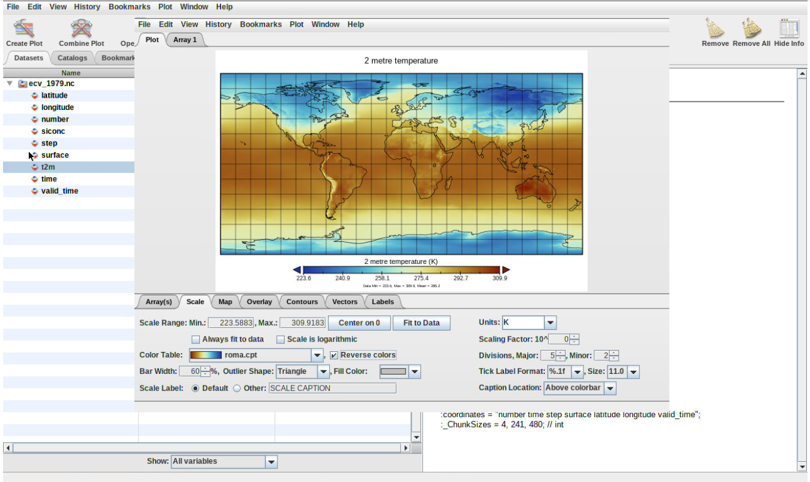
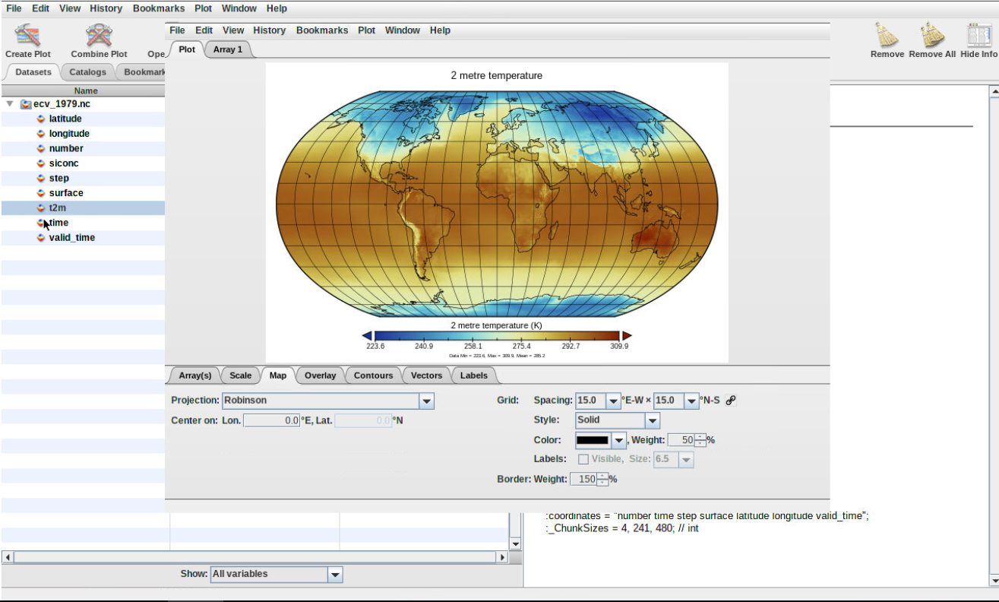

# Introduction


> <comment-title></comment-title>
>
> This tutorial is significantly based on [the Panoply documentation](https://www.giss.nasa.gov/tools/panoply/help/) ["Quick View Data with Panoply"](https://disc.gsfc.nasa.gov/information/howto?title=Quick%20View%20Data%20with%20Panoply) section.
>
{: .comment}

The practical aims at familiarzing you with the [Panoply](https://www.giss.nasa.gov/tools/panoply/) Galaxy interactive environment. Panoply is among the most popular tool to visualize geo-referenced data stored in [Network Common Data Form](https://en.wikipedia.org/wiki/NetCDF) (netCDF). It provides a graphical interface for inspecting (show metadata) and visualizing netCDF data. It supports many features to customize your plots and we will introduce some of them in this lesson.

In this tutorial, you will learn to:
- Plot geo-referenced latitude-longitude, latitude-vertical, longitude-vertical, time-latitude or time-vertical arrays.
- Use any of numerous color tables for the scale colorbar
- Save plots to GIF, JPEG, PNG or TIFF bitmap images or as PDF or PostScript graphics files.
- Export animations as MOV or AVI videos


> <agenda-title></agenda-title>
>
> In this tutorial, we will cover:
>
> 1. TOC
> {:toc}
>
{: .agenda}

> <comment-title>Background</comment-title>
>
>There are many online services to get climate data, and it is often difficult to know which ones are up-to date and which resources to trust.
> Different services provide different Application Programming Interfaces (API), use different terminologies, different file formats etc., which make it difficult for new users to master them all.
> Therefore in this tutorial, we will be focusing on the usage of Climate data in [Network Common data Form](https://en.wikipedia.org/wiki/NetCDF) (netCDF) because it is the most common data format for storing Climate data.
> We will be using a freely available dataset containing Essential Climate Variables (sea ice area fraction, surface temperature) from [Copernicus Climate Data Store](https://cds.climate.copernicus.eu/#!/home). We will learn to use panoply to visualize the sea ice area fraction over the poles (southern and northern poles) and surface temperatures for two different years (1979 and 2018).
{:  .comment}

## NetCDF format

[NetCDF](https://en.wikipedia.org/wiki/NetCDF) data format is a binary format and to be able to read or visualize it, we would need to use dedicated software or libraries that can handle this "special" format. It is self-describing and machine-independent data format that supports the creation, access, and sharing of array-oriented scientific data. NetCDF files usually have the extension *.nc* or *.netcdf*.

For climate and forecast data stored in NetCDF format there are (non-mandatory) conventions on metadata ([CF Convention](http://cfconventions.org/)).

In this tutorial, we will be using data from the [Copernicus Climate Data Store](https://zenodo.org/record/3695482/files/era5-land.nc?download=1) and more precisely a [reanalysis ERA5-Land monthly averaged dataset](https://cds.climate.copernicus.eu/cdsapp#!/dataset/reanalysis-era5-land-monthly-means?tab=overview) for 2019. Data from Copernicus Climate Data Store is freely available but may require [free registration](https://cds.climate.copernicus.eu/user/register?destination=%2Fcdsapp%23!%2Fdataset%2Freanalysis-era5-land-monthly-means%3Ftab%3Doverview) and license agreement.

## Get data

> <hands-on-title>Data upload</hands-on-title>
>
> 1. Create a new history for this tutorial. If you are not inspired, you can name it *Panoply* for example...
>
>    
>
> 2. Import the file from [Zenodo](https://doi.org/10.5281/zenodo.3697454) or from the shared data library
>
>    ```
>    https://zenodo.org/record/3697454/files/ecv_1979.nc
>    https://zenodo.org/record/3697454/files/ecv_2018.nc
>    ```
>
>    
>
>    
>
> 3. Check that the datatype is **netcdf**
>
>    Files you uploaded are in netcdf format. In Galaxy, Datatypes are, by default, automatically guessed. Here, as netcdf is a derivative of the h5 format, Galaxy automatically affect the h5 datatype to netcdf files. To cope with that, one can change the datatype manually, once datasets uploaded (as shown below) OR you can directly specify datatype on the upload tool form so Galaxy will not try to automatically guess it.
>
>    
>
> 4. Rename Datasets
>
>    As "https://zenodo.org/record/3697454/files/ecv_1979.nc" is not a beautiful name and can give errors for some tools, it is a good practice to change the dataset name by something more meaningfull. For example by removing `https://zenodo.org/record/3697454/files/` to obtain `ecv_1979.nc` and `ecv_2018.nc`, respectively.
>
>    
>
> 5. Add a tag to the dataset corresponding to `copernicus`
>
>    
>
{: .hands_on}

# Panoply

## Opening up Panoply

> <hands-on-title>Launch Panoply</hands-on-title>
>
>  Panoply is available as a Galaxy interactive environment and may not be available on all Galaxy servers.
>
> > <tip-title>Launch Panoply in Galaxy</tip-title>
> > Currently Panoply in Galaxy is available on useGalaxy.eu instance, on the "Interactive tools" tool panel section or, as all interactive tools, from the dedicated usGalaxy.eu subdomain: [Live.useGalaxy.eu](https://live.usegalaxy.eu)
> >
> > 1. Open the  [on UseGalaxy.eu](https://live.usegalaxy.eu/?tool_id=interactive_tool_panoply)
> > 2. Check **ecv_1979.nc** dataset selected in the netcdf input field
> > 3. Click Execute
> > 4. The tool will start running and will stay running permanently
> > 5. Click on the "User" menu at the top and go to "Active Interactive Tools" and locate the Panoply instance you started.
> > 6. Click on your Panoply instance
> >    
> > 7. Click on **ecv_1979.nc** dataset
> {: .tip}
{: .hands_on}

## Inspect metadata

> <hands-on-title>Inspect dataset</hands-on-title>
>
> 1. Inspect dataset content
>
>    Here you can look at the dataset (ecv_1979.nc) and related variables (`latitude`, `longitude`, `number`, `siconc`, etc)
>
>    > <question-title></question-title>
>    >
>    > what is the unit of the `sea ice area fraction` variable (**siconc**) variable?
>    >
>    > > <solution-title></solution-title>
>    > >
>    > > The unit of **siconc** is (0-1) e.g. a real value between 0 (no ice) and 1 (fully coverted by ice).
>    > {: .solution}
>    {: .question}
>
>
> 2. Inspect the surface temperature (**t2m**) variable
>
>    > <question-title></question-title>
>    >
>    > what is the unit of this variable and its shape?
>    >
>    > > <solution-title></solution-title>
>    > >
>    > > The unit of **t2m** is Kelvin (K). **t2m** is a 3D array (time, latitude, longitude).
>    > {: .solution}
>    {: .question}
>
{: .hands_on}

## Create Geo-referenced Longitude-Latitude plot

> <hands-on-title>geographical map</hands-on-title>
>
> 1. Double click on the variable **t2m** and click on **Create**
>    
>
>    > <question-title></question-title>
>    >
>    > 1. What does it show?
>    > 2. What is the date of the generated plot?
>    > 3. Can you plot other dates?
>    >
>    > > <solution-title></solution-title>
>    > >
>    > > 1. The plot represent the surface temperature over the entire world.
>    > >    
>    > >
>    > > 2. The date of the default plot is 1st January 1979 at 00:00:00.
>    > >
>    > > 3. To plot another date, change either:
>    > > - Initial time of forecast (give a value between 1 and 12, corresponding to each month of year 1979.
>    > > - Click on the date and scroll down to select the date of your choice.
>    > {: .solution}
>    {: .question}
>
> 2. Save your plot
>    - Click on the tab **File** (from your plot window) to store your plot by selecting **Save Image As**
>    - Double click on the folder *outputs* to enter this folder and save your plot.
>    You need to make sure to save all your plot in the *outputs* folder otherwise you can loose all your plots once to close panoply.
>
> 3. Change colormap
>    **Always make sure you use color blind friendly palettes.**
>    - To change the default colormap, click on tab "**Scale**" (bottom of your plot window) and select another "**Color Table**" (you can scroll down to go through all the different available colormap).
>    - Save your plot using **Save Image As** and make sure to choose another name to avoid overwritting your preceding plot.
>    
{: .hands_on}


## Changing map projection

> <hands-on-title>Change projection</hands-on-title>
>
> 1. From your previous plot window, click on Tab **Map** and change **Projection**. Try a few of them and save each of your plot with **File** --> **Save Image As**.
>
>    
>
> 2. Create another plot window for sea ice area fraction (**siconc**) and make a new geo-referenced map
>
>    > <question-title></question-title>
>    >
>    > 1. What kind of colormap could you use to highlight the extent of sea-ice?
>    > 2. What projection would be best to use for showing the extent of sea-ice over the two poles?
>    >
>    > > <solution-title></solution-title>
>    > >
>    > > 1. Any colormap that shows low values (close to 0) in light color so we can focus on values that are close to 1. For instance, **CP_PuBu_08.cpt**.
>    > >    
>    > > 2. Using *Orthographic* projection is best for showing the northern and southern poles. One advantage is that you can choose to center the plot over 90 degrees latitude. To have both the northern and southern poles at the same time, choose **Stereographic (Two hemispheres)**.
>    > >
>    > > 
>    > {: .solution}
>    {: .question}
{: .hands_on}

## Export Animation

> <hands-on-title>Export animation</hands-on-title>
>
> 1. From your previous plot window, click on **File** and select **Export Animation**. Save your plot using either **MOV** or **AVI** format.
>  It goes through each plot e.g. for each month and create an animation where you can see the evolution of sea-ice extent from January 1979 to December 1979.
> You will be able to download the resulting movie from Galaxy once you quit Panoply.
{: .hands_on}

## Create timeseries

> <hands-on-title>Create 1D plot</hands-on-title>
>
> 1. Double click on the variable **t2m**, click on **Create** and select **Create horizontal line plot along time axis** (make sure to switch to **time**).
> 
>
>    > <question-title></question-title>
>    >
>    > 1. What was the maximum temperature in Oslo (latitude: 60 degrees North, longitude: 10.75 East) in 1979?
>    > 2. Which month was the warmest in Oslo?
>    >
>    > > <solution-title></solution-title>
>    > >
>    > > 1. The maximum temperature is about 288 K so about 15 degrees Celsius (`288 - 273.15`).
>    > > 2. The warmest month in 1979 was July.
>    > > 
>    > {: .solution}
>    {: .question}
{: .hands_on}

## Quit Panoply


> <hands-on-title>Quit Panoply to keep your plots</hands-on-title>
>
> 1. To make sure all your plots stored in **outputs** folder get exported to Galaxy, you need to quit panoply:
>  **File** --> **Quit Panoply**.
> 2. Go back to your current Galaxy history and you should find **Panoply outputs**
>  
>
{: .hands_on}

# Conclusion


We have now learnt how to analyze climate data using Panoply. We only use one of the two datasets so we strongly encourage you to do the same exercises with the second dataset **ecv_2018.nc**. Please note that when comparing surface temperature or sea-ice area fraction from 1979 and 2018, you would not be able to conclude anything regarding climate change. For any climate studies, long term timeseries (between 20 to 30 years) are necessary to establish climate trends.


