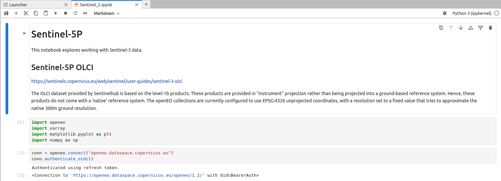
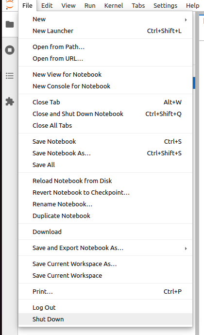
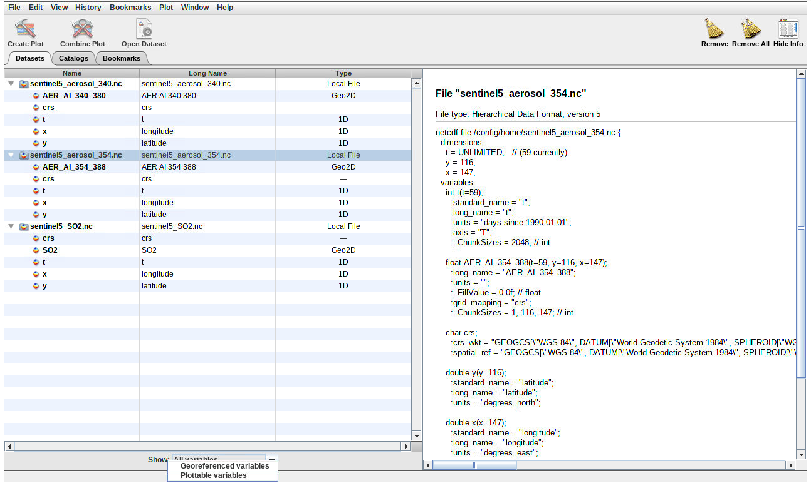
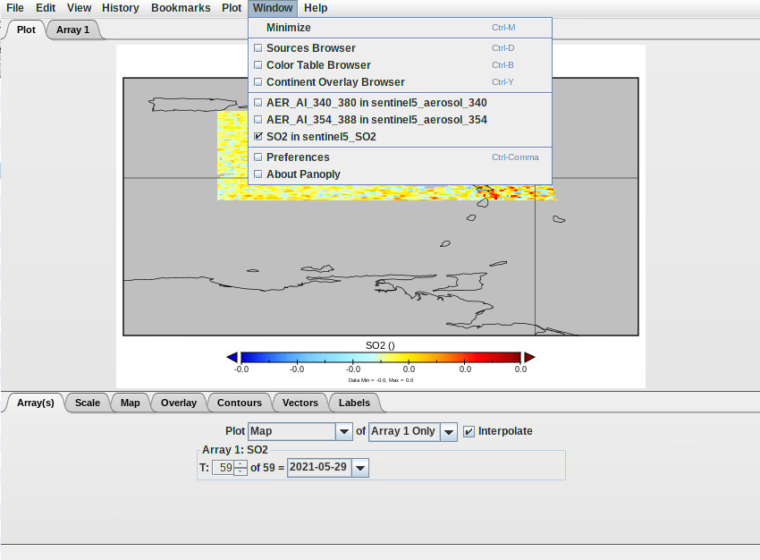
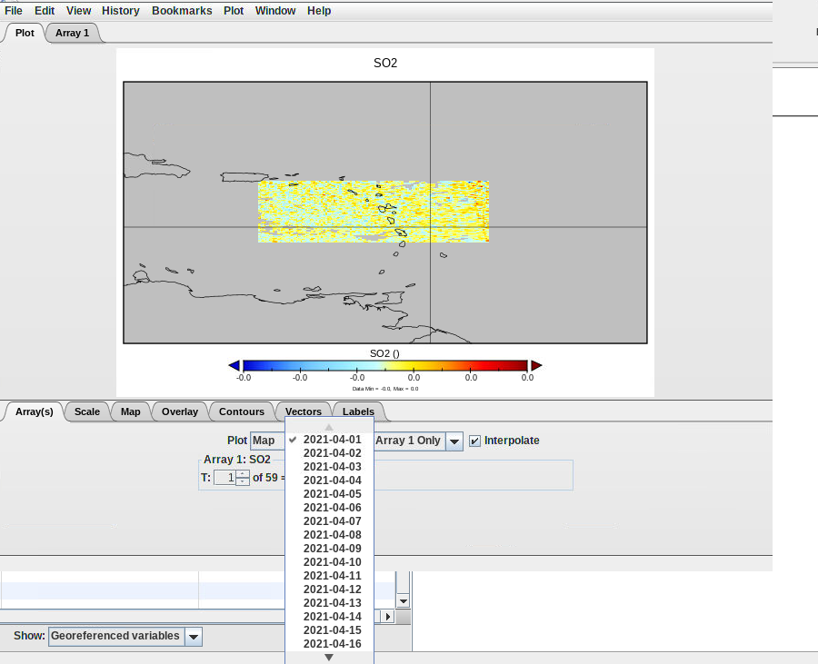
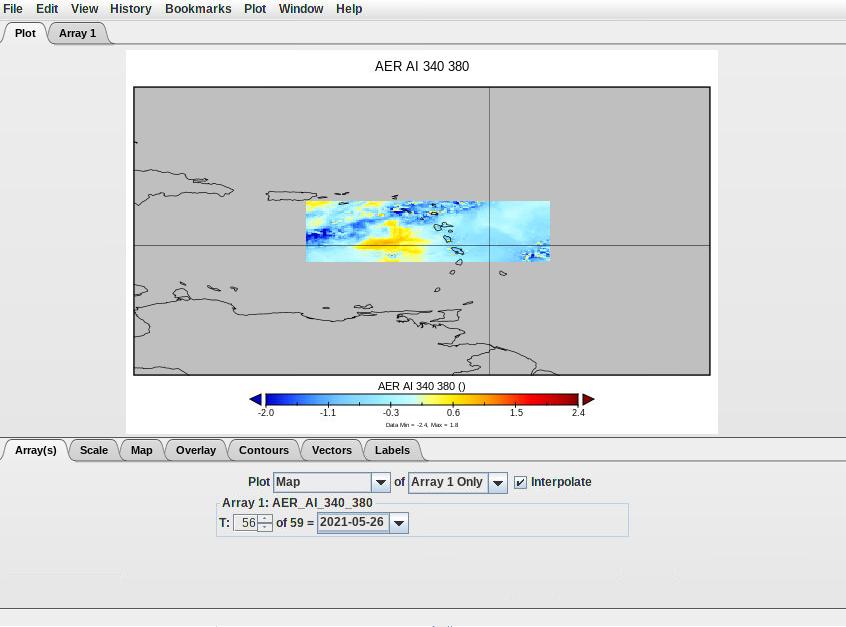
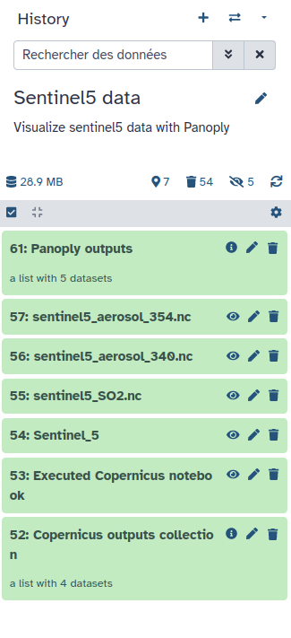
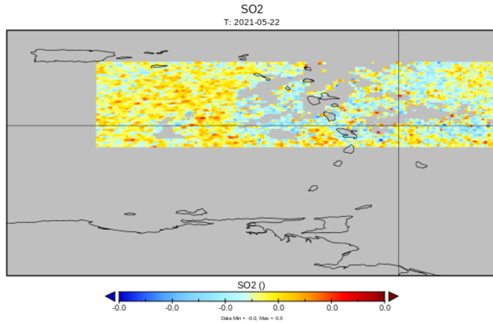

Through this tutorial you will learn here how to access and download Copernicus Data Space Ecosystem (CDSE) data through a jupyterlab Galaxy interactive tool :

This tool enables you to leverage the Copernicus Data Space Ecosystem services and access data effortlessly.
The JupyterLab service allows you to dive into data exploration, visualization, and analysis without the hassle of installing dependencies or downloading large data sets.

Then, you can visualise these data and process them with Panoply (plots geo-referenced and other arrays from netCDF, HDF, GRIB, and other datasets).

The purpose of this tutorial is to propose a user-friendly, interactive and efficient way to explore and jointly analyze remote sensing observations, from both the atmosphere and solid earth communities, for the monitoring of the volcanic activity in case of eruption and the multi-scale impact of volcanic emissions on the atmosphere.

> <details-title>What about the data used here</details-title>
> Dataset of Sentinel 5P L2 from the 1st of April to the 30th of may 2021 of the Antilles. Especially of the La Soufriere Saint Vincent (Antilles) where a volcaninc erruption occured 9th of April. This dataset is focused on the dioxide sulfur (SO2) and Aerosol index (AI) spread out. Indeed, the knowledge of volcanic activity at a high temporal resolution is crucial for robustly determining large-scale impacts of volcanoes on atmosphere (air quality, air traffic) and climate. As such, this platform will be also of interest for scientists involved in the field of volcanic impacts at large, including institutions in charge of the monitoring of air quality and aviation safety.
{: .details}

> <agenda-title></agenda-title>
>
> In this tutorial, we will cover:
>
> 1. TOC
> {:toc}
>
{: .agenda}

## Context on Galaxy
Interactive tools are working differently than classical tools as it allows the user to interact with a dedicated graphical interface. This kind of tools is used to give access to Jupyter notebooks, RStudio or R Shiny apps for example. 

> <details-title>Short introduction on how Galaxy works</details-title>
>
> You can come back to where you left off the tutorial anytime by clicking .
>
> > <hands-on-title>Log in to Galaxy</hands-on-title>
> > 1. Open your favorite browser (Chrome, Safari or Firefox as your browser, not Internet Explorer!)
> > 2. Browse to your [Galaxy instance](https://earth-system.usegalaxy.eu/)
> > 3. On the top pannel go to **Login or Register**
> >
> >
> {: .hands_on}
>
> The Galaxy homepage is divided into three panels:
> * Tools on the left
> * Viewing panel in the middle
> * History of analysis and files on the right
>
> 
>
> The first time you use Galaxy, there will be no files in your history panel.
{: .details}
---


# Copernicus Data Space Ecosystem

> <hands-on-title> Launch the interactive tool </hands-on-title>
>
> 1.  with the following parameters:
>    - *"Do you already have a notebook?"*: `Start with a fresh notebook`
>    - *"Include data into the environment - optional "*: You don't need anything
> 2. Click on **Run Tool**
>
> 3. 
{: .hands_on}

> <hands-on-title> Navigate the jupyterlab </hands-on-title>
> 1. Go in the **notebooks** folder and open a Bash window 
> 2. Write the following: 
> > <code-in-title>Download the notebook</code-in-title>
> > ```bash
> > wget https://raw.githubusercontent.com/fair-ease/Copernicus-Data-Space-Ecosystem/main/Sentinel_5.ipynb
> > ```
> {: .code-in}
> 3. Open the new notebook that appeared on the left
> 4. You can start running your notebook. To do so you can go go on the pannel displaying button right above the notebook and click on the . 
>    Everytime you press this button you can excecute a one by one the cells. 
> 5. In the **Setup** section when you execute the connection cell you'll have some actions to conduct.
> 6. First click ont the link appearing, you're notebook should look like the following :
>      
> 7. Once you clicked a new window opens. If you don't have a copernicus account please create one and follow the instructions given. 
> 8. If you have an account sign in and then press the green **YES**
>      
> 9. You'll be redirected to a page letting you know the connection was a success
>      
> 10. Now, you can go back on your jupyterlab and execute the rest of the notebook.
> 11. Once you executed the entire notebook you should have a new file in the left pannel named **sentinel5.nc**.
> 12. Select the file there and click right, and then copy
>      
> 13. Then go back to the root of your path and go in the **ouputs** folder. There you can click right and paste the file. 
>      
> 14. This part is now finished you just have to correctly close this notebook. On the top left click on **files** and then on **Shut down**.
>      
>
> > <details-title> Some complementary info on the notebooks </details-title>
> > In the jupyterlab go to :
> >   - **notebooks**
> >   - Then, **openeo** 
> >   - Open the notebook **Sentinel_3.ipynb**
> > You can see it's relatively similar to the one you just worked on. You can adapt it as you want to retrieve Sentinel data of all kind.
> {: .details}
{: .hands_on}

Go back on your Galaxy window. After a couple minutes you should see your outputs turning green in your history.

> <hands-on-title>Clean your data</hands-on-title>
> Firstly, you'll can change the name of your new items by adding the extension at the end **sentinel5_SO2** of your history into **sentinel5_SO2.nc** (for the 2 others **sentinel5_aerosol_354.nc** and **sentinel5_aerosol_340.nc**). 
> 
> 
> 
> Check that your data are in netcdf format with , it should be `netcdf`
> 
> 
> 
{: .hands-on} 


# Visualise Sentinel 5

## Global view 
> <hands-on-title> Visualise Sentinel 5 data with Panoply </hands-on-title>
>
> 1.  with the following parameters:
>    - *"netcdf"*: select `sentinel5_SO2.nc`, `sentinel5_aerosol_340.nc` and `sentinel5_aerosol_354.nc`
> 2. **Run Tool**
> 3. Access Panoply
> 
> 
> 
> > <tip-title>Panoply - Disconnected</tip-title>
> > If at one point your Panoply interface becomes blank, do NOT panic ;) you just need to reload your tab (circular arrow top left)
> {: .tip}
> 
> Once in the Panoply interface :
> 5. In the pop-up window go select the 3 netcf files `sentinel5_SO2.nc`, `sentinel5_aerosol_340.nc` and `sentinel5_aerosol_354.nc` and then Open.
> 6. In the bottom of this window you have the possibilty to select what you want to **Show** go there and select "Georeferenced variables"
>      
> 7. Select one of the 3 possible data and then on the top left press **Create Plot**
> 8. In the pop-up window stay on the default choice "Create georeferenced Longitude-Latitude plot" and press **Create**
>      
> 
> You will obtain a world map like the folowing
>      
> You should see a colored spot in the Atlantic.
> 9. On your keyboard press `ctrl` (or `cmd` on Mac) and select a rectangle around the colored spot to zoom in.
> 10. In the "Overlay" tab in "Overlay 1:" select **MWDB_Coasts_Countries_1.cnob**, in order to see the islands delimitation on your map.
>      
> 11. Save your plot. Go on the top left to "File" then "Save Image As ..." go in the **output** folder and save.
{: .hands_on}

You can do the same plot for each data subset.

> <tip-title>Switch from one graph to another</tip-title>
> In the top of your graph there is a tab **Window** click on it there you should see the other graph made.
> An example here with the SO2 graph selected but you could switch to the AER_AI ones by checking one of their box.
> 
{: .tip}

> <hands-on-title> Visualise data through out time </hands-on-title>
> ## Georeferenced plot through time
> - On you graph window in the "Array(s)" you can select the day you want too see.
> 
> Some examples with changing the date :
> 
> 
> 
> 
> ## Create an animation through time
> From one of your previous plot window (the S02 one for instance), click on **File** and select **Export Animation**. Save your plot in "outputs" using either **MOV** or **AVI** format. It goes through each plot e.g. for each month and create an animation where you can see the evolution of SO2 variable from the 1st of April to the 30th of May 2021. You will be able to download the resulting movie from Galaxy once you quit Panoply.
>
> ## Create a timeserie plot
> 1. In the first tabular select the "SO2" variable and click on **Create Plot**
> 2. There you need to check the box "Create horizontal line plot along t axis" and create
> Here, you should see  timeserie as for the georeferenced plot you can swith from one day to another and also extract it as an animation through time.
{: .hands_on}

> <hands-on-title> Quit Panoply correctly </hands-on-title>
> 1. Go on the top left in **File** 
> 2. Select **Quit Panoply**
> 3. Go back to your current Galaxy history and you should find Panoply outputs
>      
> 4. On the top of the galaxy page click on the  to activate the multi view.
> 5. Then in the panoply outputs click on the  of each of the png images.
> You should be able to rearrange the windows to see each outputs
>      
> 6. For the animated file go on 
> Then, in your downloads you should have a small video that you can visualise on your computer.
>      
{: .hands_on}

# Conclusion
Now you have finished this tutorial. You leearned how to use a jupyterlab tool with OpenEO technologies to download data and how to visualise them with Panoply.
