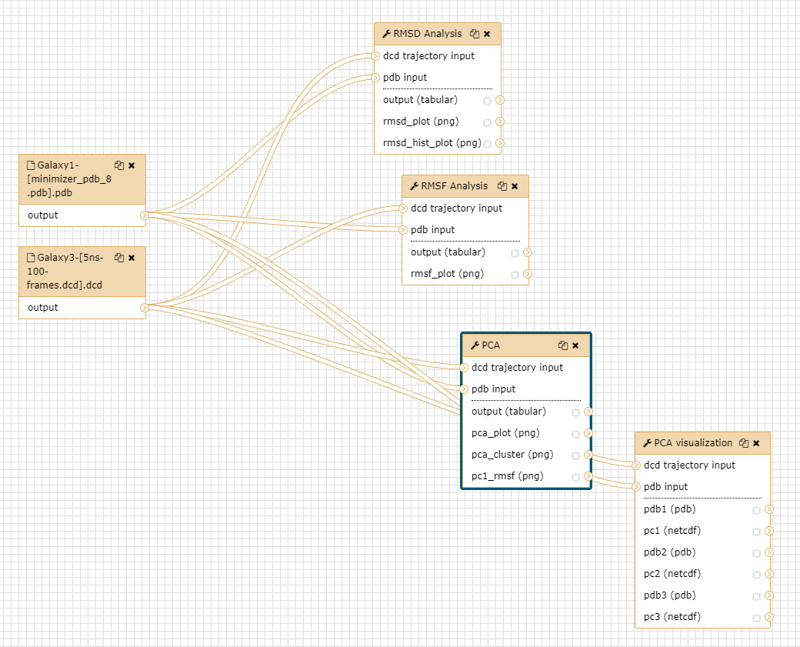

# Introduction
{:.no_toc}

We illustrate some of the analytical tools able to investigate conforma-
tional changes by analysis of a typical short protein simulation such as
for CBH1.

Protein conformational changes can be investigated in greater detail
using tools in the statistical analyses module. Here PCA was used to
discover the statistically meaningful conformations in the CBH1
trajectory. The principal motions within the trajectory and
the vital motions needed for conformational changes were identified.
Two distinct groupings along the PC1 plane indicating a non-periodic conformational change are identified. The groupings along the PC2 and PC3 planes do not completely cluster separately implying that these global motions are periodic. The PC1 is linked to an active site motion that limits the motion to a key glycosidic bond.

There are other analysis tools available you are encourage to try these out too. 

> ### Agenda
>
> In this tutorial, we will cover:
>
> 1. TOC
> {:toc}
>
{: .agenda}

# Get data

The data required will need to be generated by completing the previous tutorial.
Access it from your history.

# Analysis with BIO3D

As per the slides we'll carry out some basic analysis by calculating RMSD, RMSF and PCA.

## **bio3d_rmsd**

> ###  Hands-on: Task description
>
> 1. **bio3d_rmsd/2.3**  with the following parameters:
>
{: .hands_on}

## **bio3d_rmsf**

> ###  Hands-on: Task description
>
> 1. **bio3d_rmsf/2.3**  with the following parameters:
>
{: .hands_on}

## **bio3d_pca**

> ###  Hands-on: Task description
>
> 1. **bio3d_pca/2.3**  with the following parameters:
>
>
{: .hands_on}

# Further analysis

Explore further analyses, try out the advanced analysis workflow.

# Conclusion
{:.no_toc}

