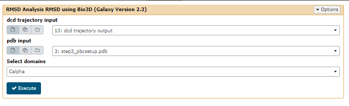
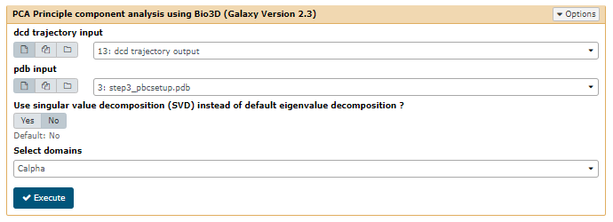
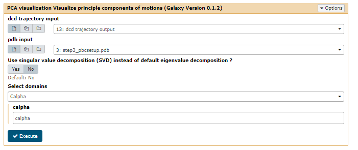

# Introduction
{:.no_toc}

Molecular dynamics simulations return highly complex data. The Cartesian positions of each atom of the system (thousands or even millions) are recorded at every time step of the trajectory; this may again be thousands to millions of steps in length. Therefore, some kind of further analysis is needed to extract useful information from the data.

In this tutorial, we illustrate some of the analytical tools able to investigate conformational changes by analysis of a typical short protein simulation, such as for CBH1.

There are other analysis tools available; you are encouraged to try these out too. 

> ### Agenda
>
> In this tutorial, we will cover:
>
> 1. TOC
> {:toc}
>
{: .agenda}

# Get data

The data required can be generated by completing the [NAMD simulation tutorial](../md-simulation-namd/tutorial.html).  Access it from your history. Alternatively, download the data from the Zenodo link provided, or from the [dataset provided](https://usegalaxy.eu/u/tsenapathi/h/example-md-dataset---cellulase).

> ###  Hands-on: Data upload
>
> **Option 1**
> Upload the file in Galaxy from the Zenodo link: 
>
> **Option 2**
> Import from your previous history, where you completed the [NAMD simulation tutorial](../md-simulation-namd/tutorial.html).
>
> **Option 3**
> Import the data from the public history [on usegalaxy.eu](https://cheminformatics.usegalaxy.eu/u/tsenapathi/h/example-md-dataset---cellulase)
>
> 2. Import the files, either from the Zenodo link provided, or from your history, if you completed the simulation tutorial. 
>
>    
>    
>
{: .hands_on}

# Analysis with BIO3D

We'll carry out some basic analysis by calculating RMSD, RMSF and PCA. The tools use the [Bio3D package](http://thegrantlab.org/bio3d/index.php), developed by the [Grant lab](http://thegrantlab.org/).

## Workflow vs. individual tools
You can choose to use the existing workflow shown above, or use tools one by one (see below).

Have a look at the published workflows (and histories) by navigating to 'Shared Data' in the upper tab on usegalaxy.eu and in the dropdown menu selecting 'Workflows'. Search for 'Bio3d' in the search box and choose 'MD Analysis using Bio3D'.

## RMSD

RMSD, or root-mean-square deviation, is a standard measure of structural distance between coordinates. It measures the average distance between a group of atoms (e.g. backbone atoms of a protein). If we calculate RMSD between two sets of atomic coordinates - for example, two time points from the trajectory - the value is a measure of how much the protein conformation has changed. [Wikipedia](https://en.wikipedia.org/wiki/Root-mean-square_deviation_of_atomic_positions) provides more information.

> ###  Hands-on: Calculate RMSD
>
> **bio3d_rmsd**  with the following parameters:
>    -  *"dcd trajectory input"*: Trajectory file
>    -  *"pdb input"*: Structure file
>    - *"Select domains"*: `Calpha` (calculate RMSD only for the C-alpha domain of the protein)
>
{: .hands_on}

> > ###  Question
> >
> > What can we learn from the RMSD analysis?
> >
> > > ###  Solution
> > > The increase in the RMSD plot with time shows the protein steadily deviates from its original conformation.
> > >
> > > The three peaks visible in the histogram suggests the presence of three main conformations which are accessed during the trajectory.
> > {: .solution}
> {: .question}

## RMSF

The root-mean-square fluctuation (RMSF) measures the average deviation of a particle (e.g. a protein residue) over time from a reference position (typically the time-averaged position of the particle). Thus, RMSF analyzes the portions of structure that are fluctuating from their mean structure the most (or least). 

> ###  Hands-on: Calculate RMSF
>
> 1. **bio3d_rmsf**  with the following parameters:
>    -  *"dcd trajectory input"*: Trajectory file
>    -  *"pdb input"*: Structure file
>    - *"Select domains"*: `Calpha` (calculate RMSF only for the C-alpha domain of the protein)
>
{: .hands_on}

> > ###  Question
> >
> > What can we learn from the RMSF analysis?
> >
> > > ###  Solution
> > > Higher RMSF values most likely are loop regions with more conformational flexibility, where the structure is not as well defined.
> > >
> > > This allows a link with experimental spectroscopic techniques which detect the secondary structure of a protein.
> > {: .solution}
> {: .question}

## PCA

Principal component analysis (PCA) converts a set of correlated observations (movement of all atoms in protein) to a set of principal components which are linearly independent (or uncorrelated). Mathematically, it is a transformation of the data to a new coordinate system, in which the first coordinate represents the greatest variance, the second coordinate represents the second most variance, and so on.

You can read more about PCA on [Wikipedia](https://en.wikipedia.org/wiki/Principal_component_analysis). In a nutshell, PCA takes a complex dataset with many variables and tries to distill the variables down to a few 'principal components' which still preserve most of the differences between the data.

In summary:
- The **bio3d_pca/2.3**  tool will calculate and return a PCA to determine the relationship between statistically meaningful conformations (major global motions) sampled during the trajectory. THe tool returns several images of the PCA and the raw data in tab-separated format.
- The **pcavis**  tool will carry out PCA and return a trajectory of the selected principle component. This trajectory is useful for visualisation and further investigating the interesting modes and changes that occur within a selected principle component. 

> ###  Hands-on: Calculate PCA
>
> 1. **bio3d_pca/2.3**  with the following parameters:
>    -  *"dcd trajectory input"*: Trajectory file
>    -  *"pdb input"*: Structure file
>    - *"Use singular value decomposition (SVD) instead of default eigenvalue decomposition ?"*: `No`
>    - *"Select domains"*: `Calpha`
>
> 1. **pcavis**  with the following parameters:
>    -  *"dcd trajectory input"*: Trajectory file
>    -  *"pdb input"*: Structure file
>    - *"Use singular value decomposition (SVD) instead of default eigenvalue decomposition ?"*: `No`
>    - *"Select domains"*: `Calpha`
>    - *"Principal component id"*: `Calpha`
>
> PCA visualisation: This tool can generate small trajectories of the first three principal components. The .pdb of the .nc files can be visualized using a visualization software such as VMD.
>
{: .hands_on}

> > ###  Question
> >
> > What can we learn from the PCA?
> >
> > > ###  Solution
> > > Here, PCA shows the statistically meaningful conformations in the CBH1 trajectory. The principal motions within the trajectory and the vital motions needed for conformational changes can be identified. Two distinct groupings along the PC1 plane, indicating a non-periodic conformational change, are identified. The groupings along the PC2 and PC3 planes do not completely cluster separately, implying that these global motions are periodic. The PC1 is linked to an active site motion that limits the motion to a key glycosidic bond.
> > {: .solution}
> {: .question}

# Further analysis

Further analyses are available; try out the [MDAnalysis workflow](https://usegalaxy.eu/u/tsenapathi/w/analysis-using-mdanalysis), which includes a Ramachandran plot and various timeseries.

# Conclusion
{:.no_toc}

