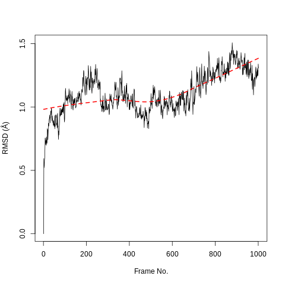
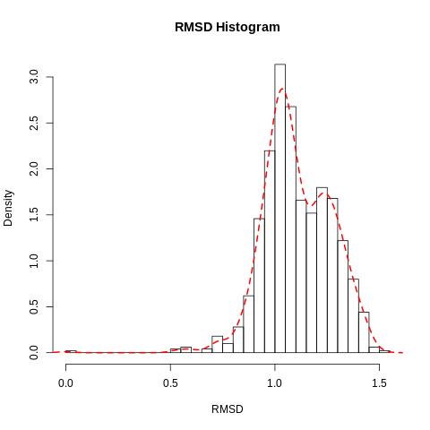
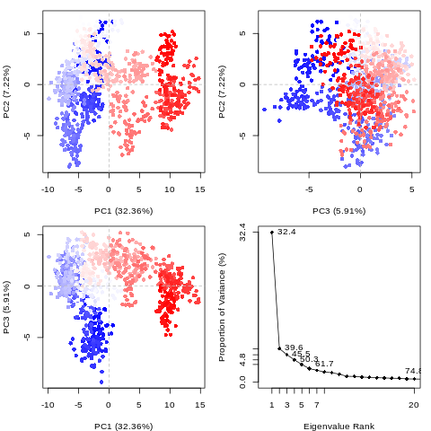
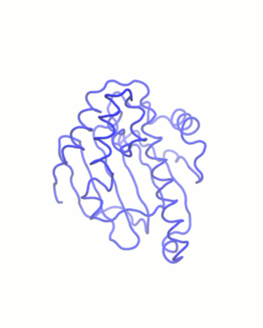

# Introduction


This tutorial provides an introduction to using high-throughput molecular dynamics to study protein-ligand interaction, as applied to the N-terminal domain of Hsp90 (heat shock protein 90).


> <agenda-title></agenda-title>
>
> In this tutorial, we will cover:
>
> 1. TOC
> {:toc}
>
{: .agenda}


# Background

## What is high-throughput molecular dynamics?
Molecular dynamics (MD) is a method to simulate molecular motion by iterative application of Newton's laws of motion. It is often applied to large biomolecules such as proteins or nucleic acids. A common application is to assess the interaction between these macromolecules and a number of small molecules (e.g. potential drug candidates). This tutorial provides a guide to setting up and running a high-throughput workflow for screening multiple small molecules, using the open-source GROMACS tools provided through the Galaxy platform. Following simulation, the trajectory data is analyzed using a range of tools to investigate structural properties and correlations over time.


## Why is Hsp90 interesting to study?
The 90 kDa heat shock protein (Hsp90) is a chaperone protein responsible for catalyzing the conversion of a wide variety of proteins to a functional form; examples of the Hsp90 clientele, which totals several hundred proteins, include nuclear steroid hormone receptors and protein kinases (). The mechanism by which Hsp90 acts varies between clients, as does the client binding site; the process is dependent on post-translational modifications of Hsp90 and the identity of co-chaperones which bind and regulate the conformational cycle ().

Due to its vital biochemical role as a chaperone protein involved in facilitating the folding of many client proteins, Hsp90 is an attractive pharmaceutical target. In particular, as protein folding is a potential bottleneck to cellular reproduction and growth, blocking Hsp90 function using inhibitors which bind tightly to the ATP binding site of the NTD could assist in treating cancer; for example, the antibiotic geldanamycin and its analogs are under investigation as possible anti-tumor agents (, ).

In the structure which will be examined during this tutorial, the ligand of concern is a resorcinol, a common class of compounds with affinity for the Hsp90 N-terminal domain. It is registered in the PubChem database under the compound ID 135508238 (). As can be seen by viewing the PDB structure, the resorcinol part of the structure is embedded in the binding site, bound by a hydrogen bond to residue aspartate-93. The ligand structure also contains a triazole and a fluorophenyl ring, which lie nearer to the surface of the protein.

")


## Get data

As a first step, we create a new Galaxy history and then we download a crystal structure for the Hsp90 protein from the Protein Data Bank (PDB). The structure is provided under accession code `6HHR` () and shows Hsp90 in complex with a ligand belonging to the resorcinol class.

> <hands-on-title>Data upload</hands-on-title>
>
> 1. Create a new history for this tutorial
> 2. Search Galaxy for the  tool. Request the accession code ```6hhr```.
> 3. Rename the dataset to 'Hsp90 structure'
> 4. Check that the datatype is correct (PDB file).
>
>    
>
{: .hands_on}


# Simulation

## Topology generation

Now we have downloaded a PDB structure of the protein we wish to study, we will start preparing it for MD simulation; this process may also be referred to as parameterization or topology generation.

GROMACS distinguishes between constant and dynamic attributes of the atoms in the system. The constant attributes (e.g. atom charges, bonds connecting atoms) are listed in the topology (TOP file), while dynamic attributes (attributes that can change during a simulation, e.g. atom position, velocities and forces) are stored in structure (PDB or GRO) and trajectory (XTC and TRR) files.

The PDB file we start from only explicitly states atom element (i.e.carbon, oxygen, and so on) and 3D Cartesian coordinates of each atom; additionally, it will usually not include hydrogen atoms. Therefore, before beginning simulation, we need to calculate the rest of the information contained within the topology file. Parameterization needs to be done separately for the ligand and protein. Therefore, the first step is to separate the PDB file into two sets of coordinates - one for the ligand and one for the protein.


### Extract protein and ligand coordinates

Parameterization needs to be done separately for the ligand and protein. Therefore, the first step is to separate the PDB file into two sets of coordinates - one for the ligand and one for the protein. Here, we can make use of the simple text manipulation tools integrated into Galaxy.

> <question-title></question-title>
>
> 1. Why do protein and ligand need to be parameterized separately?
>
> > <solution-title></solution-title>
> >
> > 1. Protein and small molecules are constructed differently. A protein is made up of 20 different building blocks (amino acids) - therefore, to construct a protein topology, amino acid topologies simply need to be combined appropriately. By contrast, the structure of small molecules is far more flexible and needs to be calculated for each different structure.
> >
> {: .solution}
>
{: .question}

> <hands-on-title>Separate protein and ligand coordinates</hands-on-title>
>
> 1.  with the following parameters:
>    - *"Select lines from"*: 'Hsp90 structure'
>    - *"that"*: `Don't Match`
>    - *"Regular Expression"*: `HETATM`
> 2. Rename output to 'Protein (PDB)'
> 3.  with the following parameters:
>    - *"Select lines from"*: 'Hsp90 structure'
>    - *"that"*: `Match`
>    - *"Regular Expression"*: `AG5E`
> 4. Rename output to 'Ligand (PDB)'
>
{: .hands_on}

Here, we simply filter the original PDB twice: once for lines which do not match `HETATM`, which returns a PDB file containing only protein, not ligand and solvent; and once for lines which match the ligand's identity code `AG5E`, which returns a PDB file containing only the ligand.

If you inspect the PDB file, you will see that two different ligands are listed: `AG5E` and `BG5E`. These are the same compound (`G5E`); they refer to two possible conformations it could adopt, both of which would be compatible with the crystallographic data. We choose to take the coordinates from `AG5E` for our simulations, though you could just as well enter `BG5E` instead. For the purpose of this tutorial, you should consider this as a minor technical detail arising from the nature of protein crystallography.

### Set up protein topology

Firstly, we need to calculate the topology for the protein file. We will use the **GROMACS initial setup**  tool.

> <hands-on-title>Generate protein topology</hands-on-title>
>
> 1.  with the following parameters:
>    - *"PDB input file"*: 'Protein (PDB)' file
>    - *"Force field"*: `AMBER99SB`
>    - *"Water model"*: `TIP3P`
>    - *"Generate detailed log"*: `Yes`
>
>    > <comment-title></comment-title>
>    > A force field is essentially a function to calculate the potential energy of a system, based on various empirical parameters (for the atoms, bonds, charges, dihedral angles and so on). There are a number of families of forcefields; some of the most commonly used include CHARMM, AMBER, GROMOS and OpenFF (for a recent, accessible overview see ().
>    >
>    >
>    > A wide range of models exist for modeling water. Here we are using the common TIP3P model, which is an example of a 'three-site model' - so-called because the molecule is modeled using three points, corresponding to the three atoms of water. (Four- and five-site models include additional 'dummy atoms' representing the negative charges of the lone pairs of the oxygen atom).
>    {: .comment}
>
{: .hands_on}

The tool produces four outputs: a GRO file (containing the coordinates of the protein), a TOP file (containing other information, including on charges, masses, bonds and angles), an ITP file (which will be used to restrain the protein position in the equilibration step later on), and a log for the tool.

Please note all GROMACS tools output a log. Generally, you only need to look at this when a job fails. These provide useful information for debugging if we encounter any problems.


### Generate a topology for the ligand

To generate a topology for the ligand, we will use the **acpype**  tool (). This provides a convenient interface to the AmberTools suite and allows us to easily create the ligand topology in the format required by GROMACS.

Inspecting the contents of the `Ligand (PDB)` file shows that it contains no hydrogen atoms. These need to be added before the topology can be calculated. The **Compound conversion**  (which is based on OpenBabel) can be used to achieve this.

> <hands-on-title>Generate ligand topology</hands-on-title>
>
> 1.  with the following parameters:
>    - *"Molecular input file"*: 'Ligand (PDB)'
>    - *"Output format"*: `Protein Data Bank format (pdb)`
>    - *"Add hydrogens appropriate for pH"*: `7.0`
> 2. Rename the output file to `Hydrated ligand (PDB)`.
> 3.  with the following parameters:
>    - *"Input file"*: 'Hydrated ligand (PDB)'
>    - *"Charge of the molecule"*: `0`
>    - *"Multiplicity"*: `1`
>    - *"Force field to use for parameterization"*: `gaff`
>    - *"Charge method"*: `bcc (default)`
>    - *"Save GRO file?"*: `Yes`
>
{: .hands_on}

Here, we use GAFF (general AMBER force field), which is a generalized AMBER force field which can be applied to almost any small organic molecule.

We select charge and multiplicity as appropriate. The ligand studied here is neutral, so the charge is 0. The multiplicity is 1, which will be the case for every simple organic molecule we encounter; only if we deal with more exotic species such as metal complexes or carbenes will we need to consider higher values.

Having generated topologies, we now need to combine them, define the box
which contains the system, add solvent and ions, and perform an energy
minimization step.

<!-- ## Solvation and energy minimization -->


## Combine topology and GRO files

While we have separate topology and structure files for both protein and ligand, we need to combine them into a single set of files to continue with the simulation setup. A dedicated Galaxy tool is provided for this, using the Python library ParmEd ().

> <hands-on-title>Combine GRO and topology files</hands-on-title>
>
> 1.  with the following parameters:
>    -  *"Protein topology (TOP) file"*: `TOP` file created by the **GROMACS initial setup** tool
>    -  *"Ligand topology (TOP or ITP file)"*: `Topology` created by the **acpype** tool
>    -  *"Protein structure (GRO) file"*: `GRO` file created by the **GROMACS initial setup** tool
>    -  *"Ligand structure (GRO) file"*: `Structure file (GRO format)` created by the **acpype** tool
>
{: .hands_on}


## Create the simulation box

The next step, once combined coordinate (GRO) and topology (TOP) files have been created, is to create a simulation box in which the system is situated.

> <hands-on-title>Create simulation box</hands-on-title>
>
> 1.  with the following parameters:
>    -  *"Input structure"*: `System GRO file` (Input dataset)
>    - *"Configure box?"*: `Yes`
>        - *"Box dimensions in nanometers"*: `1.0`
>        - *"Box type"*: `Triclinic`
>    - *"Generate detailed log"*: `Yes`
>
>
>    > <comment-title></comment-title>
>    >
>    > This tool returns a new GRO structure file, containing the same coordinates as before, but defining a simulation box such that every atom is a minimum of 1 nm from the box boundary. A distance of at least 1 nm is recommended to avoid interactions between the protein and its mirror image. On the other hand, increasing the box size too far will increase the simulation time, due to the greater number of solvent molecules which need to be treated. A variety of box shapes are available to choose: we select triclinic, as it provides the most efficient packing in space and thus fewer computational resources need to be devoted to simulation of solvent.
>    {: .comment}
>
{: .hands_on}


## Solvation

The next step is solvation of the newly created simulation box - as we are simulating under biological conditions, we use water as the solvent. Note that the system is charged (depending on the pH) - the solvation tool also adds sodium or chloride ions (replacing existing water molecules) as required to neutralize this.

> <hands-on-title>Solvation</hands-on-title>
>
> 1.  with the following parameters:
>    -  *"GRO structure file"*: output of **GROMACS structure configuration** 
>    -  *"Topology (TOP) file"*: `TOP` output of **Merge GROMACS topologies**
>    - *"Water model for solvation"*: `SPC (generic three-point model)`
>    - *"Add ions to neutralize system"*: `Yes, add ions`
>    - *"Specify salt concentration (sodium chloride) to add, in mol/liter"*: `0`
>    - *"Generate detailed log"*: `Yes`
> 2. Rename the outputs to `Solvated GRO` and `Solvated TOP`.
>
{: .hands_on}


## Energy minimization

After the solvation step, parameterization of the system is complete and preparatory simulations can be performed. The first of theses is energy minimization, which can be carried out using the **GROMACS energy minimization**  tool.

> <question-title></question-title>
>
> 1. What is the purpose of energy minimization?
>
> > <solution-title></solution-title>
> >
> > 1. Running an energy minimization (EM) algorithm relaxes the structure by removing any steric clashes or unusual geometry which would artificially raise the energy of the system.
> >
> {: .solution}
>
{: .question}


> <hands-on-title>Energy minimization</hands-on-title>
>
> 1.  with the following parameters:
>    -  *"GRO structure file."*: GRO output of **GROMACS solvation and adding ions** 
>    -  *"Topology (TOP) file."*: TOP output of **GROMACS solvation and adding ions** 
>    - *"Parameter input"*: `Use default (partially customisable) setting`
>        - *"Number of steps for the MD simulation"*: `50000`
>        - *"EM tolerance"*: `1000.0`
>    - *"Generate detailed log"*: `Yes`
>    - Rename output to `Minimized GRO file`
>
{: .hands_on}

The EM tolerance here refers to the maximum force which will be allowed in a minimized system. The simulation will be terminated when the maximum force is less than this value, or when 50000 steps have elapsed.

As an aside, we can use the `Extract energy components` tool to plot the convergence of the potential energy during the minimization.

> <hands-on-title>Checking EM convergence</hands-on-title>
>
> 1.  with the following parameters:
>    -  *"EDR file."*: EDR output of **GROMACS energy minimization** 
>    - *"Terms to calculate"*: `Potential`
>    - *"Output format"*: `Galaxy tabular`
> 2. On the output tabular file, click on the 'Visualize this data' icon. This provides a range of visualization options. Select 'Line chart (jqPlot)'.
> 3. In the visualization window which appears, click on `Select data.` Enter the following parameters:
>    - *"Provide a label"*: `Energy potential`
>    - *"Values for x-axis"*: `Column: 1`
>    - *"Values for y-axis"*: `Column: 2`
>
{: .hands_on}

The resulting plot should resemble the figure below. The system first drops rapidly in energy, before slowly converging on the minimized state.


## Equilibration

We now carry out equilibration in two stages: NVT and NPT. This is discussed at greater length in the basic GROMACS tutorial. Equilibration requires restraining the protein structure - we use the ITP file produced by the initial setup tool for this.

Simulation under the NVT ensemble allows the solvent to be brought to the desired temperature, while simulation under the NPT ensemble bring the solvent to the correct pressure.

> <comment-title>More detail about equilibration</comment-title>
>
> At this point equilibration of the solvent around the solute (i.e. the protein) is necessary. This is performed in two stages: equilibration under an NVT (or isothermal-isochoric) ensemble, followed by an NPT (or isothermal-isobaric) ensemble. Use of the NVT ensemble entails maintaining constant number of particles, volume and temperature, while the NPT ensemble maintains constant number of particles, pressure and temperature.
>
> For equilibration, the protein must be held in place while the solvent is allowed to move freely around it. This is achieved using the position restraint file (ITP) we created in system setup. When we specify this restraint, protein movement is not forbidden, but is energetically penalized.
>
{: .comment}


> <hands-on-title>NVT equilibration</hands-on-title>
>
> 1.  with the following parameters:
>    -  *"GRO structure file"*: `Minimized GRO file` (from energy minimization step)
>    -  *"Topology (TOP) file"*: `Solvated TOP`
>    - In *"Inputs"*:
>        -  *"Position restraint (ITP) file"*: ITP file produced by initial setup step.
>    - In *"Outputs"*:
>        - *"Trajectory output"*: `Return .xtc file (reduced precision)`
>        - *"Structure output"*: `Return .gro file`
>        - *"Produce a checkpoint (CPT) file"*: `Produce CPT output`
>        - *"Produce an energy (EDR) file"*: `Produce EDR output`
>    - In *"Settings"*:
>        - *"Parameter input"*: `Use default (partially customisable) setting`
>            - *"Bond constraints (constraints)"*: `All bonds (all-bonds).`
>            - *"Temperature /K"*: `300`
>            - *"Step length in ps"*: `0.001`
>            - *"Number of steps that elapse between saving data points (velocities, forces, energies)"*: `1000`
>            - *"Number of steps for the simulation"*: `50000`
>    - *"Generate detailed log"*: `Yes`
>
>
{: .hands_on}

Once the NVT equilibration is complete, it is worth using the `Extract energy components` tool again to check whether the system temperature has converged on 300 K. This can be done as described for energy minimization, this time specifying `Temperature` under `Terms to calculate` rather than `Potential`. The plot should show the temperature reaching 300 K and remaining there, albeit with some fluctuation.

Having stabilized the temperature of the system with NVT equilibration,
we also need to stabilize the pressure of the system. We therefore
equilibrate again using the NPT (constant number of particles, pressure,
temperature) ensemble.

Note that we can continue where the last simulation left off (with new
parameters) by using the checkpoint (CPT) file saved at the end of the
NVT simulation.

> <hands-on-title>NPT equilibration</hands-on-title>
>
> 1.  with the following parameters:
>    -  *"GRO structure file"*: GRO output of **GROMACS simulation**  (NVT equilibration)
>    -  *"Topology (TOP) file"*: `Solvated TOP`
>    - In *"Inputs"*:
>        -  *"Checkpoint (CPT) file"*: Output of **GROMACS simulation**  (NVT equilibration))
>        -  *"Position restraint (ITP) file"*: ITP file produced by initial setup step.
>    - In *"Outputs"*:
>        - *"Trajectory output"*: `Return .xtc file (reduced precision)`
>        - *"Structure output"*: `Return .gro file`
>        - *"Produce a checkpoint (CPT) file"*: `Produce CPT output`
>        - *"Produce an energy (EDR) file"*: `Produce EDR output`
>    - In *"Settings"*:
>        - *"Ensemble"*: `Isothermal-isobaric ensemble (NPT)`
>        - *"Parameter input"*: `Use default (partially customisable) setting`
>            - *"Bond constraints (constraints)"*: `All bonds (all-bonds).`
>            - *"Temperature /K"*: `300`
>            - *"Step length in ps"*: `0.001`
>            - *"Number of steps that elapse between saving data points (velocities, forces, energies)"*: `1000`
>            - *"Number of steps for the simulation"*: `50000`
>    - *"Generate detailed log"*: `Yes`
>
>
{: .hands_on}

After the NPT equilibration is complete, **Extract energy components**  can be used again to view the pressure of the system. This is done as described for energy minimization, specifying `Pressure` under `Terms to calculate`. The plot should show convergence on 1 bar and remain there, although some fluctuation is expected.

## Production simulation

We can now remove the restraints and continue with the production simulation. The simulation will run for 1 million steps, with a step size of 1 fs, so will have a total length of 1 ns. This is rather short compared to the state-of-the-art, but sufficient for the purposes of a tutorial. For longer-scale simulations, the tool can be used multiple times (with the checkpoint file) to continue the existing simulation.

> <hands-on-title>Hands-on</hands-on-title>
>
> 1.  with the following parameters:
>    -  *"GRO structure file"*: Output of **GROMACS simulation**  (NPT equilibration)
>    -  *"Topology (TOP) file"*: `Solvated TOP`
>    - In *"Inputs"*:
>        -  *"Checkpoint (CPT) file"*: Output of **GROMACS simulation**  (NPT simulation))
>    - In *"Outputs"*:
>        - *"Trajectory output"*: `Return .xtc file (reduced precision)`
>        - *"Structure output"*: `Return .gro file`
>        - *"Produce a checkpoint (CPT) file"*: `Produce CPT output`
>    - In *"Settings"*:
>        - *"Ensemble"*: `Isothermal-isobaric ensemble (NPT)`
>        - *"Parameter input"*: `Use default (partially customisable) setting`
>            - *"Temperature /K"*: `300`
>            - *"Step length in ps"*: `0.001`
>            - *"Number of steps that elapse between saving data points (velocities, forces, energies)"*: `1000`
>            - *"Number of steps for the simulation"*: `1000000`
>    - *"Generate detailed log"*: `Yes`
>
>
{: .hands_on}


# Analysis

After the completion of the simulation, the following questions arise: 1) is the simulation converged enough, and 2) what interesting molecular properties are observed. To answer these questions, an analysis of the GROMACS simulation outputs (structure and trajectory file) will be carried out using Galaxy tools developed for computational chemistry () based on popular analysis software, such as MDAnalysis (), MDTraj (), and  Bio3D (). These tools output both tabular files as well as a variety of attractive plots.


## Create PDB file needed by most analysis tools

Before beginning a detailed analysis, the structure and trajectory files generated previously need to be converted into different formats. First, convert the structural coordinates of the system in GRO format into PDB format. This PDB file will be used by most analysis tools as a starting structure.  Next, convert the trajectory from XTC to DCD format, as a number of tools (particularly those based on Bio3D) only accept trajectories in DCD format.

> <hands-on-title>Convert coordinate format</hands-on-title>
>
> 1.  with the following parameters:
>    - *"Output format"*: `PDB file`
>    - *"Configure box?"*: `No`
>
>    > <comment-title></comment-title>
>    >
>    > This tool can also be used to carry out initial setup (as discussed in the simulation methods section) for GROMACS simulations and convert from PDB to GRO format.
>    {: .comment}
>
{: .hands_on}


## Convert trajectory to DCD format

Convert from XTC to DCD format. A number of the analysis tools being used have been built to analyse trajectories in CHARMM's DCD format.

> <hands-on-title>Convert trajectory format</hands-on-title>
>
> 1.  with the following parameters:
>    - *"Output format"*: `DCD file`
>
>    > <comment-title></comment-title>
>    >
>    > This tool can also be used to interconvert between several trajectory formats.
>    {: .comment}
>
{: .hands_on}


## RMSD analysis - protein

The Root Mean Square Deviation (RMSD) and Root Mean Square Fluctuation (RMSF) are calculated to check the stability and conformation of the protein and ligand through the course of the simulation.
RMSD is a standard measure of structural distance between coordinate
sets that measures the average distance between a group of atoms. The
RMSD of the Cα atoms of the protein backbone is calculated here and
is a measure of how much the protein conformation has changed between different time points in the trajectory.


> <hands-on-title>RMSD Analysis</hands-on-title>
>
> 1. {% tool [RMSD Analysis](toolshed.g2.bx.psu.edu/repos/chemteam/bio3d_rmsd/bio3d_rmsd/2.3.4) with the following parameters:
>    - *"Select domains"*: `C-alpha`
>
>    > <comment-title></comment-title>
>    >
>    > Note that for more complex systems, you may need to consider a more focused selection. For example, if you have a ligand that is a protein consider modifying this selection.
>    {: .comment}
>
{: .hands_on}





The RMSD time series for the protein shows a thermally stable and equilibrated structure that plateaus at 1.0Å with an average RMSD between 0.8Å and 1.0Å. There are no large conformational changes during the simulation. The RMSD histogram confirms this. Note these graphs are automatically created by Galaxy as part of the tool's outputs.


## RMSD analysis - ligand

Calculating the RMSD of the ligand is necessary to check if it is stable in the active site and to identify possible binding modes. If the ligand is not stable, there will be large fluctuations in the RMSD.

For the RMSD analysis of the ligand, the `Select domains` parameter of the tool can for convenience be set to `Ligand`; however, this automatic selection sometimes fails. The other alternative, which we apply here, is to specify the `Residue ID` in the textbox provided. In this example the ligand's Residue ID is `G5E`. The output is the requested RMSD data as a time series, the RMSD plotted as a time series and as a histogram.


> <hands-on-title>RMSD analysis</hands-on-title>
>
> 1. {% tool [RMSD Analysis](toolshed.g2.bx.psu.edu/repos/chemteam/bio3d_rmsd/bio3d_rmsd/2.3.4) with the following parameters:
>    -  *"DCD trajectory input"*: `output` (output of **MDTraj file converter** )
>    -  *"PDB input"*: `output` (output of **GROMACS structure configuration** )
>    - *"Select domains"*: `Residue ID`
>        - *"Residue ID"*: `G5E`
>
>
{: .hands_on}

In our case the ligand is stable with a single binding mode. The RMSD fluctuates around 0.3Å, with a slight fluctuation near the end of the simulation. This is more clearly seen in the histogram. The conformation seen during simulation is very similar to that in the crystal structure and the ligand is stable in the active site.

")

")


## RMSF analysis

The Root Mean Square Fluctuation (RMSF) is valuable to consider, as it represents the deviation at a reference position over time. The fluctuation in space of particular amino acids in the protein are considered. The Cα of the protein, designated by `C-alpha`, is a good selection to understand the change in protein structure. Depending on the system these fluctuations can be correlated to experimental techniques including Nuclear Magnetic Resonance (NMR) and M\"{o}ssbauer spectroscopy (, ). The output from the tools is the requested RMSF data and the RMSF plotted as a time series.

> <hands-on-title>RMSF analysis</hands-on-title>
>
> 1. {% tool [RMSF Analysis](toolshed.g2.bx.psu.edu/repos/chemteam/bio3d_rmsf/bio3d_rmsf/2.3.4) with the following parameters:
>    -  *"DCD trajectory input"*: `output` (output of **MDTraj file converter** )
>    -  *"PDB input"*: `output` (output of **GROMACS structure configuration** )
>    - *"Select domains"*: `C-alpha`
>
>
{: .hands_on}

 vs the residue position. Large fluctuations occur at various positions, which correspond to flexible loop regions on the surface of the protein.")

When considering the RMSF, fluctuations greater than 1.0Å are of interest; for example see the fluctuations near residue positions 50, 110 and 160.  Inspecting the structure with molecular visualization software such as VMD, these can be seen to correspond to flexible loop regions on the protein surface. In addition, very large fluctuations are seen for the C-terminus; this is common and no investigation is needed.

Note that the first few residues of this protein are missing in the PDB, and therefore residue position 0 in the RMSF corresponds to position 17 in the Hsp90 FASTA primary sequence. This is a fairly common problem that can occur with molecular modeling of proteins, where there may be missing residues at the beginning or within the sequence.


## PCA analysis

Principal component analysis (PCA) converts a set of correlated
observations (movement of selected atoms in protein) to a set of principal
components (PCs) which are linearly independent (or uncorrelated). Here several related tools are used.
The PCA tool calculates the PCA in order to determine the relationship between statistically meaningful conformations (major global motions) sampled during the trajectory. The Cα carbons of the protein backbone are again a good selection for this purpose.  Outputs include the PCA raw data and figures of the relevant principal components (PCs) as well as an eigenvalue rank plot which is used to visualize the proportion of variance due to each principal component (remembering that the PCs are ranked eigenvectors based on the variance).
Having discovered the principal components usually these are visualized. The PCA visualization tool will create trajectories of specific principal components which can be viewed in a molecular viewer such as VMD () or NGL viewer (). We also consider the PCA cosine content which when close to 1 indicates that the simulation is not converged and a longer simulation is needed. For values below 0.7, no statement can be made about convergence or lack thereof.

> <hands-on-title>PCA</hands-on-title>
>
> 1.  with the following parameters:
>    -  *"DCD trajectory input"*: `output` (output of **MDTraj file converter** )
>    -  *"PDB input"*: `output` (output of **GROMACS structure configuration** )
>    - *"Select domains"*: `C-alpha`
>
>
{: .hands_on}




The first three principal components are responsible for 32.8% of the total variance, as seen in the eigenvalue rank plot. The first principal component (PC1) accounts for 15.4% of the variance (see PC1 vs PC2 and eigenvalue rank plots). Visualization of PC1 using VMD shows a rocking motion and wagging of the C-terminus.


> <hands-on-title>PCA cosine content calculation</hands-on-title>
>
> 1.  with the following parameters:
>    -  *"DCD/XTC trajectory input"*: `output` (output of **MDTraj file converter** )
>    -  *"PDB/GRO input"*: `output` (output of **GROMACS structure configuration** )
>
>
{: .hands_on}

The PCA cosine content of the dominant motion related to PC1 is 0.93, indicating that the simulation is not fully converged. This is expected due to the short simulation length. For production level simulations, it is the norm to extend simulations to hundreds of nanoseconds in length, if not microseconds. As this tutorial is designed to be carried out on public webservers, we limit simulations to 1 ns, as we cannot provide a large amount of computational resources for training purposes.

> <hands-on-title>PCA visualisation</hands-on-title>
>
> 1.  with the following parameters:
>    -  *"DCD trajectory input"*: `output` (output of **MDTraj file converter** )
>    -  *"PDB input"*: `output` (output of **GROMACS structure configuration** )
>    - *"Select domains"*: `C-alpha`
>
>
{: .hands_on}



## Hydrogen bond analysis

Hydrogen bonding interactions contribute to binding and are worth investigating, in particular persistent hydrogen bonds. All possible hydrogen bonding interactions between the two selected regions, here the protein and the ligand, are investigated over time using the VMD hydrogen bond analysis tool included in Galaxy. Hydrogen bonds are identified and in the output the total number of hydrogen bonds and  occupancy over time is returned.

> <hands-on-title>Hydrogen bond analysis</hands-on-title>
>
> 1.  with the following parameters:
>    -  *"DCD/XTC trajectory input"*: `output` (output of **MDTraj file converter** )
>    -  *"PDB/GRO input"*: `output` (output of **GROMACS structure configuration** )
>    - *"Selection 1"*: `protein`
>    - *"Selection 2"*: `resname G5E`
>
>
{: .hands_on}

The active site of this protein is quite hydrophobic, yet multiple hydrogen bonds were identified. The hydrogen bond between aspartate-93 and the ligand (as identified in the crystal structure) was found to be persistent, meeting the hydrogen bond criteria for 89.22% of the simulation. A hydrogen bond between the ligand and the carbonyl group of glycine-97 was found to have a 15.27% occupancy. Hydrogen bonding interactions with threonine-184, asparagine-51 and lysine-58 were also observed but these are not persistent and only present for a minority of the simulation. These values can be accessed from the 'Percentage occupancy of the H-bond' output of the hydrogen bond analysis tool.


# Optional: Automating high throughput calculations
Up until this step, Galaxy tools have been applied sequentially to datasets. This is useful to gain an understanding of the steps involved, but becomes tedious if the workflow needs to be run on multiple protein-ligand systems. Fortunately, Galaxy allows entire workflows to be executed with a single mouse-click, enabling straightforward high-throughput analyses.

We will demonstrate the high-throughput capabilities of Galaxy by running the workflow detailed so far on a further three ligands.

> <hands-on-title>High-throughput MD</hands-on-title>
>
> 1. Create a new history for running the high-throughput workflow and name it `Hsp90 HTMD simulation`
> 2. Upload the SD-file containing the new ligand structures from Zenodo  and rename it `Ligands (SDF)`
> 3. Import the simulation workflow from the European () or the South African Galaxy server ().
> 4. Run the imported workflow with the following parameters:
>    - *"Send results to a new history"*: `Yes`
>    - *"History name results to a new history"*: `Hsp90 HTMD analysis`
>    - *"GRO input"*: 'Collection of GRO files produced by simulation workflow'
>    - *"XTC input"*: 'Collection of XTC files produced by simulation workflow'
>
{: .hands_on}


This process runs the entire simulation and analysis procedure described so far on the new set of ligands. It uses Galaxy's [collection feature]() to organize the data; each item in the history is a collection (essentially a directory containing multiple individual datasets) containing one file corresponding to each of the input ligands.

Note that the SD-file needs to contain ligands with the correct 3D coordinates for MD simulation. The easiest way to obtain these is using a molecular docking tool such as Autodock Vina () or rDock (); tutorials and workflows are available for both of these from the Galaxy Training Network. As an example, the history in which the SD-file used in the HTMD workflow is generated (using AutoDock Vina) is provided ().

Apart from manual setups or collections, there are several other alternatives which are helpful in scaling up workflows. Galaxy supports and provides training material for converting [histories to workflows](), using [multiple histories](), and the [Galaxy Application Programming Interface (API)](). For beginners and users who prefer a visual interface, automation can be done using multiple histories and collections with the standard Galaxy user interface.

If you are able to write small scripts, you can automate everything you have learned here with the Galaxy API. This allows you to interact with the server to automate repetitive tasks and create more complex workflows (which may have repetition or branching). The simplest way to access the API is through the Python library BioBlend (). An example Python script, which uses BioBlend to run the GROMACS simulation workflow for each of a list of ligands, is given in the hands-on box below.

> <hands-on-title>Bioblend script</hands-on-title>
>
>    ```
>from bioblend import galaxy
>
># Server and account details
>API_KEY = 'YOUR USEGALAXY.EU API KEY'
>gi = galaxy.GalaxyInstance(key=API_KEY,
>    url='https://usegalaxy.eu/')
>
># ID for GROMACS workflow
>workflow_id = 'adc6d049e9283789'
>
># Dataset IDs for ligands to dock
>ligands = {
># ligand_name: dataset ID,
>'lig1': '11ac94870d0bb33a79c5fa18b0fd3b4c',
># ...
>}
>
># Loop over ligands, invoking workflow
>for name, _id in ligands.items():
>    inv = gi.workflows.invoke_workflow(
>        workflow_id,
>        inputs={
>            '1': {'src': 'hda', 'id': _id}
>        },
>        history_name=f'HTMD run on {name}'
>    )
>    ```
>
{: .hands_on}

Another option is to use the Planemo command-line tool. Planemo has a very wide range of functions, including the ability to run Galaxy workflows from the command line. For a full overview, see the [tutorial](https://planemo.readthedocs.io/en/latest/running.html).

Assuming you have Planemo installed, you can create a file with the name `htmd-job.yml` with the following contents:

```
SDF file with (docked) ligands:
  class: File
  galaxy_id: '11ac94870d0bb33a79c5fa18b0fd3b4c'
  # path: ligands.sdf

```

You can specify the dataset either using its Galaxy ID, or with the path of a local file. The Galaxy ID is associated with the specific server you are using - in
this case `usegalaxy.eu`. You can get this ID by clicking on the `View details` icon of a dataset in your Galaxy history - it is provided in the `Dataset Information`
table as `History Content API ID`. Then run:

```
planemo run adc6d049e9283789 htmd-job.yml --galaxy_url https://usegalaxy.eu --galaxy_user_key YOUR_USEGALAXY_EU_API_KEY --history_name "HTMD with planemo"
```

Here `adc6d049e9283789` is the Galaxy ID associated with the workflow on `usegalaxy.eu`, but the `planemo run` command can also use a local workflow file.

If you now return to the web-browser, you should see a new history should have been created named `HTMD with planemo` and it should begin to fill with datasets.


# Conclusion


This tutorial provides a guide on how to study protein-ligand interaction using molecular dynamics in Galaxy. Performing such analyses in Galaxy makes it straightforward to set up, schedule and run workflows, removing much of the difficulty from MD simulation. Thus, the technical barrier to performing high-throughput studies is greatly reduced. Results are structured in the form of Galaxy histories or collections, and include ready-plotted diagrams, which ensure data can be easily understood and reproduced if necessary. Apart from streamlining the process for existing MD users, this tutorial should also prove useful as a pedagogical guide for educating students or newcomers to the field.

After completing the tutorial, the user will be familiar at a basic level with a range of MD analysis techniques, and understand the steps required for a typical MD simulation. Thus, they will be equipped to apply these tools to their own problems.


# Glossary and abbreviations

* Concepts:
  * **MD** - molecular dynamics simulation.
  * **NVT** - isothermal-isochoric ensemble, in which number of atoms (N), volume (V) and temperature (T) are kept constant. 
  * **NPT** - isothermal-isobaric ensemble, in which number of atoms (N), pressure (P) and temperature (T) are kept constant. 
  * **RMSD** - Root Mean Square Deviation
  * **RMSF** - Root Mean Square Fluctuation
  * **PCA** - Principal Component Analysis
* Software:
  * **GROMACS** (Groningen Machine for Chemical Simulation) - a molecular dynamics package mainly designed for simulations of proteins, lipids and nucleic acids. 
  * **NAMD** (Nanoscale Molecular Dynamics) - a molecular dynamics software designed for high-performance simulation of large biomolecular systems.
  * **CHARMM** (Chemistry at Harvard Macromolecular Mechanics) - a molecular modeling and simulation program for many-particle systems. It includes a comprehensive set of force fields to simulate biomolecules.
  * **VMD** (Visual Molecular Dynamics) - a molecular visualisation program. 
  * **ACPYPE** (AnteChamber Python Parser interface) - a tool that simplifies the generation of small molecule topologies and parameters for a variety of molecular dynamics programs, like GROMACS and CHARMM. It is based on the Antechamber software provided by AmberTools.
* Filetypes:
  * **PDB** - a commonly used filetype for storing 3-dimensional structural data of large biomolecules such as proteins and nucleic acids. Also stands for the Protein Data Bank, an online repository for such data.
  * **GRO** - a filetype similar to PDB, which contains a molecular structure in a format supported by GROMACS.
  * **DCD** - a trajectory file format supported by CHARMM and NAMD.
  * **TOP** - a GROMACS filetype for representing molecular topologies.
  * **ITP** - another GROMACS filetype for representing molecular topologies.
  * **TRR** - a lossless GROMACS trajectory file, storing coordinates, forces and velocity. 
  * **XTC** - a compressed GROMACS trajectory file, storing coordinates. 
* Force fields and water molecules:
  * **GROMOS** (GROningen Molecular Simulation) - the name of a force field for molecular dynamics simulation.
  * **AMBER** (Assisted Model building with Energy Refinement) - a set of molecular mechanical force fields for the simulation of biomolecules.
  * **OpenFF** (Open Force Field) - a Python toolkit used for the development and application of modern molecular mechanics force fields.
  * **GAFF** (General AMBER Force Field) - a force field developed to augment the other AMBER force fields, allowing augmentation of most pharmaceutical molecules. 
  * **TIP3P** - a water model that specifies rigid water molecules with charges and Lennard-Jones parameters assigned to each of the 3 atoms.
* Biological concepts:
  * **Hsp90** - Heat shock protein 90, a chaperone protein.
  * **ATP** - Adenosine triphosphate, the primary carrier of energy in cells.
  * **NTD** - N-Terminal Domain, the start of a protein or polypeptide chain where the free amine group is located.
  * **NMR** (Nuclear Magnetic Resonance) - an experimental technique for determining 3D molecular structure.
