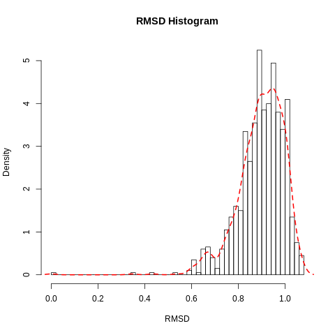
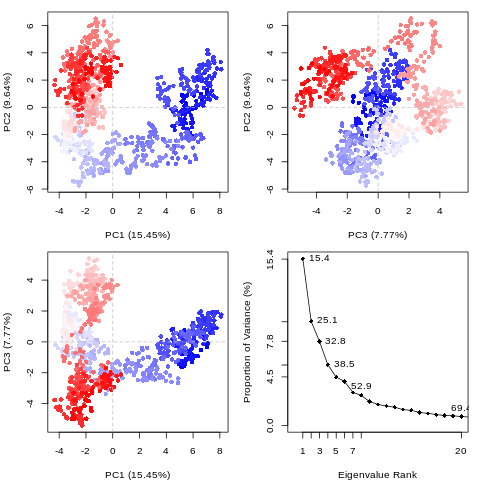
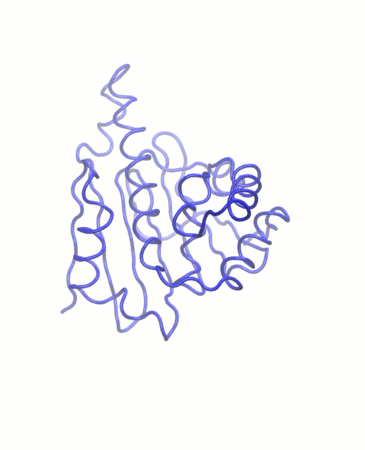

# Introduction
{:.no_toc}

This tutorial provides an introduction to using high-throughput molecular dynamics to study protein-ligand interaction, as applied to N-terminus of Hsp90 (heat shock protein 90).


<!-- This is a comment. -->

<!-- General introduction about the topic and then an introduction of the
tutorial (the questions and the objectives). It is nice also to have a
scheme to sum up the pipeline used during the tutorial. The idea is to
give to trainees insight into the content of the tutorial and the (theoretical
and technical) key concepts they will learn.

You may want to cite some publications; this can be done by adding citations to the
bibliography file (`tutorial.bib` file next to your `tutorial.md` file). These citations
must be in bibtex format. If you have the DOI for the paper you wish to cite, you can
get the corresponding bibtex entry using [doi2bib.org](https://doi2bib.org).

With the example you will find in the `tutorial.bib` file, you can add a citation to
this article here in your tutorial like this:
 ``.
This will be rendered like this: , and links to a
[bibliography section](#bibliography) which will automatically be created at the end of the
tutorial. -->


<!-- **Please follow our
[tutorial to learn how to fill the Markdown]({{ site.baseurl }}/topics/contributing/tutorials/create-new-tutorial-content/tutorial.html)** -->

> ### Agenda
>
> In this tutorial, we will cover:
>
> 1. TOC
> {:toc}
>
{: .agenda}

# Background

## What is high-throughput molecular dynamics?
Molecular dynamics (MD) is a method to simulate molecular motion by iterative application of Newton’s laws of motion. It is often applied to large biomolecules such as proteins or nucleic acids. A common application is to assess the interaction between these macromolecules and a number of small molecules (e.g. potential drug candidates). This tutorial provides a guide to setting up and running a high-throughput workflow for screening multiple small molecules, using the open-source GROMACS tools provided through the Galaxy platform.


## Why is Hsp90 interesting to study?
The 90 kDa heat shock protein (Hsp90) is a chaperone protein responsible for catalyzing the conversion of a wide variety of proteins to a functional form; examples of the Hsp90 clientele, which totals several hundred proteins, include nuclear steroid hormone receptors and protein kinases. The mechanism by which Hsp90 acts varies between clients, as does the client binding site; the process is dependent on post-translational modifications of Hsp90 and the identity of co-chaperones which bind and regulate the conformational cycle.

Due to its vital biochemical role as a chaperone protein involved in facilitating the folding of many client proteins, Hsp90 is an attractive pharmaceutical target. In particular, as protein folding is a potential bottleneck to slow cellular reproduction and growth, blocking Hsp90 function using inhibitors which bind tightly to the ATP binding site could assist in treating cancer; for example, the antibiotic geldanamycin and its analogs are under investigation as possible anti-tumor agents.

")


## Get data

First of all, download the required data.

> ###  Hands-on: Data upload
>
> 1. Create a new history for this tutorial
> 2. Search Galaxy for the 'Get PDB' tool. Request the accession code ```6hhr```.
> 3. Rename the dataset to 'Hsp90 structure'
> 4. Check that the datatype is correct (PDB file).
>
>    
>
{: .hands_on}


# Simulation

## Topology generation

Now we have downloaded a PDB structure of the protein we wish to study, we will start parameterizing it for MD simulation.

GROMACS distinguishes between constant and dynamic attributes of the atoms in the system. The constant attributes (e.g. atom charges, bonds connecting atoms) are listed in the topology (TOP file), while dynamic attributes (attributes that can change during a simulation, e.g. atom position, velocities and forces) are stored in structure (PDB or GRO) and trajectory (XTC and TRR) files.

The PDB file we start from only explicitly states atom type and position. Therefore, before beginning simulation, we need to calculate the rest of the information contained within the topology file. There are a range of force fields which perform these calculations in slightly different ways.

Parameterization needs to be done separately for the ligand and protein. Therefore, the first step is to separate the PDB file into two sets of coordinates - one for the ligand and one for the protein.

> ###  Question
>
> 1. Why do protein and ligand need to be parameterized separately?
>
> > ###  Solution
> >
> > 1. Protein and small molecules are constructed differently. A protein is made up of 20 different building blocks (amino acids) - therefore, to construct a protein topology, amino acid topologies simply need to be combined appropriately. By contrast, the structure of small molecules is far more flexible and needs to be calculated for each different structure.
> >
> {: .solution}
>
{: .question}

### Extract protein and ligand coordinates

> ###  Hands-on: Task description
>
> 1. **Search in textfiles**  with the following parameters:
>    - *"Select lines from"*: 'Hsp90 structure'   
>    - *"that"*: `Don't Match`
>    - *"Regular Expression"*: `HETATM`
> 2. Rename output to 'Protein (PDB)'
> 3. **Search in textfiles**  with the following parameters:
>    - *"Select lines from"*: 'Hsp90 structure'   
>    - *"that"*: `Match`
>    - *"Regular Expression"*: `AG5E`
> 4. Rename output to 'Ligand (PDB)'
>
{: .hands_on}


### Set up protein topology

Firstly, we need to calculate the topology for the protein file. We will use the **GROMACS initial setup**  tool.

> ###  Hands-on: Task description
>
> 1. **GROMACS initial setup**  with the following parameters:
>    - *"PDB input file"*: 'Protein (PDB)' file
>    - *"Force field"*: `gaff`
>    - *"Water model"*: `TIP3P`
>    - *"Generate detailed log"*: `Yes`
>
>    > ###  Comment
>    > A force field is essentially a function to calculate the potential energy of a system, based on various empirical parameters (for the atoms, bonds, charges, dihedral angles and so on). There are a number of families of forcefields; some of the most commonly used include CHARMM, AMBER, GROMOS and OPLS. Here, we use GAFF (general AMBER force field), which is a generalized AMBER force field which can be applied to almost any small organic molecule, not just macromolecules such as proteins.
>    >
>    >
>    > A wide range of models exist for modeling water. Here we are using the common TIP3P model, which is an example of a 'three-site model' - so-called because the molecule is modeled using three points, corresponding to the three atoms of water. (Four- and five-site models include additional 'dummy atoms' representing the negative charges of the lone pairs of the oxygen atom).
>    {: .comment}
>
{: .hands_on}

The tool produces four outputs: a GRO file (containing the coordinates of the protein), a TOP file (containing other information, including on charges, masses, bonds and angles), an ITP file (which will be used to restrain the protein position in the equilibration step later on), and a log for the tool.

Please note all GROMACS tools output a log. Generally, you only need to look at this when a job fails. It provides useful information for debugging if we encounter any problems.


### Generate a topology for the ligand

To generate a topology for the ligand, we will use the **acpype**  tool. This provides a convenient interface to the AmberTools suite and allows us to easily create the ligand topology in the format required by GROMACS.

> ###  Hands-on: Task description
>
> 1. **Generate MD topologies for small molecules**  with the following parameters:
>    - *"Input file"*: 'Ligand (PDB)'
>    - *"Charge of the molecule"*: `0`
>    - *"Multiplicity"*: `1`
>    - *"Force field to use for parameterization"*: `AMBER14SB`
>    - *"Save GRO file?"*: `Yes`
>
{: .hands_on}


## Solvation and energy minimization

Having generated topologies, we now need to combine them, define the box which contains the system, add solvent and ions, and perform an energy minimization step.

### Combine topology and GRO files

> ###  Hands-on: Combine GRO files
>
> 1. On the `Structure file (GRO format)` created by the **acpype** tool,click on the `Visualize this data` icon. Select `Editor` to open the file using the text editor integrated into Galaxy. Select all the lines starting with `1 GSE` and copy your selection.
> 2. Open the Protein GRO file by clicking on the `Visualize this data` button on the dataset.
> 3. Paste the lines from the ligand GRO file just before the last line.
> 4. If you scroll back to the top, you will see that the total number of atoms in the system is given in the second line (`3280`). You have just added 21 new atoms, so increase the value by 21 to `3301`.
> 5. Click `Export` to save your changes as a new dataset. Make sure the datatype of the new file is still `GRO`. Rename to `System GRO file`.
{: .hands_on}

> ###  Hands-on: Combine topology files
>
> 1. On the ligand `Topology` created by the **acpype** tool, right-click on the `Visualize this data` icon and open the link in a new tab. Select the first section in the file, starting with `[ atomtypes ]`, and copy the selection.
> 2. Returning to the first tab, open the protein TOP file using the text editor integrated into Galaxy by clicking on the `Visualize this data` button on the dataset.
> 3. Paste the lines from the ligand ITP file near to the top of the file, just after the line `#include "amber99sb.ff/forcefield.itp"`.
> 4. Go back to the ligand ITP file and select the rest of the file (from `[ moleculetypes ]`) onwards. Copy the selection.
> 5. In the protein TOP file, paste the selection near to the bottom of the file, before the line `; Include water topology` (and just after the position restraint file). Notice that the `[ moleculetype ]` section you just copied starts with `base` - this is the name acpype has given to the ligand. Feel free to change this to whatever you prefer - `ligand`, or `GSE`.
> 6. Finally, we need to state in the topology that we have included a new kind of molecule. Go to the final section (`[ molecules ]`) and add a new line `base` (or whatever name you gave the ligand in step 5), with a 1 in the `#mols` column.
> 5. Click `Export` to save your changes as a new dataset. Make sure the datatype of the new file is still `TOP`. Rename to `System topology`.
{: .hands_on}

If this procedure was too complicated, you can download the combined files here: LINK. However, you will find it useful to understand the information contained within topology files and learn how to make changes to it.

### Create the simulation box with **GROMACS structure configuration**

The next step, once combined coordinate (GRO) and topology (TOP) files have been created, is to create a simulation box in which the system is situated.

> ###  Hands-on: Task description
>
> 1. **GROMACS structure configuration**  with the following parameters:
>    -  *"Input structure"*: `System GRO file` (Input dataset)
>    - *"Configure box?"*: `Yes`
>        - *"Box dimensions in nanometers"*: `1.0`
>        - *"Box type"*: `Triclinic`
>    - *"Generate detailed log"*: `Yes`
>
>
>    > ###  Comment
>    >
>    > This tool simply adds a box of the required dimensions to the GRO file. A distance of at least 1.0 nm is recommended to avoid interactions between the protein and its mirror image. On the other hand, increasing the box size too far will increase the simulation time, due to the greater number of solvent molecules which need to be treated.
>    {: .comment}
>
{: .hands_on}

### Solvation

The next step is solvation of the newly created simulation box. Note that the system is charged (depending on the pH) - the solvation tool also adds sodium or chloride ions as required to neutralise this.

> ###  Hands-on: Task description
>
> 1. **GROMACS solvation and adding ions**  with the following parameters:
>    -  *"GRO structure file"*: `output` (output of **GROMACS structure configuration** )
>    -  *"System topology"*: `output`
>    - *"Generate detailed log"*: `Yes`
>
>
{: .hands_on}


### Energy minimization

The next step is energy minimization, which can be carried out using the **GROMACS energy minimization**  tool.

> ###  Question
>
> 1. What is the purpose of energy minimization?
>
> > ###  Solution
> >
> > 1. Running an energy minimization (EM) algorithm relaxes the structure by removing any steric clashes or unusual geometry which would artificially raise the energy of the system.
> >
> {: .solution}
>
{: .question}


> ###  Hands-on: Task description
>
> 1. **GROMACS energy minimization**  with the following parameters:
>    -  *"GRO structure file."*: `output1` (output of **GROMACS solvation and adding ions** )
>    -  *"Topology (TOP) file."*: `output2` (output of **GROMACS solvation and adding ions** )
>    - *"Parameter input"*: `Use default (partially customisable) setting`
>        - *"Number of steps for the MD simulation"*: `50000`
>        - *"EM tolerance"*: `1000.0`
>    - *"Generate detailed log"*: `Yes`
>    - Rename output to `Minimized GRO file`
>
{: .hands_on}


## Equilibration

We now carry out equilibration in two stages: NVT and NPT. This is discussed at greater length in the basic GROMACS tutorial. Equilibration requires restraining the protein structure - we use the ITP file produced by the initial setup tool for this.

> ###  More detail about equilibration
>
> At this point equilibration of the solvent around the solute (i.e. the protein) is necessary. This is performed in two stages: equilibration under an NVT ensemble, followed by an NPT ensemble. Use of the NVT ensemble entails maintaining constant **n**umber of particles, **v**olume and **t**emperature, while the NPT ensemble maintains constant **n**umber of particles, **p**ressure and **t**emperature. (The NVT ensemble is also known as the isothermal-isochoric ensemble, while the NPT ensemble is also known as the isothermal-isobaric ensemble).
>
> For equilibration, the protein must be held in place while the solvent is allowed to move freely around it. This is achieved using the position restraint file we created in system setup. When we specify this restraint, protein movement is not totally forbidden, but is energetically punished.
>
{: .comment}


> ###  Hands-on: NVT equilibration
>
> 1. **GROMACS simulation**  with the following parameters:
>    -  *"GRO structure file"*: `Minimized GRO file` (from energy minimization step)
>    -  *"Topology (TOP) file"*: TOP file produced by solvation step.
>    - In *"Inputs"*:
>        -  *"Position restraint (ITP) file"*: ITP file produced by initial setup step.
>    - In *"Outputs"*:
>        - *"Trajectory output"*: `Return .xtc file (reduced precision)`
>        - *"Structure output"*: `Return .gro file`
>        - *"Produce a checkpoint (CPT) file"*: `Produce CPT output`
>    - In *"Settings"*:
>        - *"Parameter input"*: `Use default (partially customisable) setting`
>            - *"Bond constraints (constraints)"*: `All bonds (all-bonds).`
>            - *"Temperature /K"*: `300`
>            - *"Step length in ps"*: `0.0002`
>            - *"Number of steps that elapse between saving data points (velocities, forces, energies)"*: `1000`
>            - *"Number of steps for the simulation"*: `50000`
>    - *"Generate detailed log"*: `Yes`
>
>
{: .hands_on}

Having stabilized the temperature of the system with NVT equilibration, we also need to stabilize the pressure of the system. We therefore equilibrate again using the NPT (constant number of particles, pressure, temperature) ensemble.

Note that we can continue where the last simulation left off (with new parameters) by using the checkpoint (CPT) file saved at the end of the NVT simulation.

> ###  Hands-on: NPT equilibration
>
> 1. **GROMACS simulation**  with the following parameters:
>    -  *"GRO structure file"*: GRO output of **GROMACS simulation**  (NVT equilibration)
>    -  *"Topology (TOP) file"*: TOP file produced by solvation step.
>    - In *"Inputs"*:
>        -  *"Checkpoint (CPT) file"*: Output of **GROMACS simulation**  (NVT equilibration))
>        -  *"Position restraint (ITP) file"*: ITP file produced by initial setup step.
>    - In *"Outputs"*:
>        - *"Trajectory output"*: `Return .xtc file (reduced precision)`
>        - *"Structure output"*: `Return .gro file`
>        - *"Produce a checkpoint (CPT) file"*: `Produce CPT output`
>    - In *"Settings"*:
>        - *"Ensemble"*: `Isothermal-isobaric ensemble (NPT)`
>        - *"Parameter input"*: `Use default (partially customisable) setting`
>            - *"Bond constraints (constraints)"*: `All bonds (all-bonds).`
>            - *"Temperature /K"*: `300`
>            - *"Step length in ps"*: `0.002`
>            - *"Number of steps that elapse between saving data points (velocities, forces, energies)"*: `1000`
>            - *"Number of steps for the simulation"*: `50000`
>    - *"Generate detailed log"*: `Yes`
>
>
{: .hands_on}


## Main simulation

We can now remove the restraints and continue with the simulation. The simulation will run for 1 million steps, with a step size of 1 fs, so wil have a total length of 1 ns.

> ###  Hands-on: Task description
>
> 1. **GROMACS simulation**  with the following parameters:
>    -  *"GRO structure file"*: Output of **GROMACS simulation**  (NPT equilibration)
>    -  *"Topology (TOP) file"*: Output of the solvation step
>    - In *"Inputs"*:
>        -  *"Checkpoint (CPT) file"*: Output of **GROMACS simulation**  (NPT simulation))
>    - In *"Outputs"*:
>        - *"Trajectory output"*: `Return .xtc file (reduced precision)`
>        - *"Structure output"*: `Return .gro file`
>        - *"Produce a checkpoint (CPT) file"*: `Produce CPT output`
>    - In *"Settings"*:
>        - *"Ensemble"*: `Isothermal-isobaric ensemble (NPT)`
>        - *"Parameter input"*: `Use default (partially customisable) setting`
>            - *"Temperature /K"*: `300`
>            - *"Step length in ps"*: `0.001`
>            - *"Number of steps that elapse between saving data points (velocities, forces, energies)"*: `1000`
>            - *"Number of steps for the simulation"*: `1000000`
>    - *"Generate detailed log"*: `Yes`
>
>
{: .hands_on}


# Analysis

Complete an analysis of the trajectory generated with Gromacs.


## Create PDB file needed by most analysis tools

Convert the structural coordinates of the system in GRO format into PDB format. This file will be used by most analysis tools as a starting structure and "it contains the topology of the system."

> ###  Hands-on: Task description
>
> 1. **GROMACS structure configuration**  with the following parameters:
>    - *"Output format"*: `PDB file`
>    - *"Configure box?"*: `No`
>
>    > ###  Comment
>    >
>    > This tool can also be used to do initial setup for GROMACS simulations and convert from PDB to GRO format.
>    {: .comment}
>
{: .hands_on}


## Convert trajectory to DCD format

Convert from XTC to DCD format. A number of the analysis tools being used have been built to analyse trajectories in CHARMM's DCD format.

> ###  Hands-on: Task description
>
> 1. **MDTraj file converter**  with the following parameters:
>    - *"Output format"*: `DCD file`
>    >
>    > ###  Comment
>    >
>    > This tool can also be used to interconvert between several trajectory formats. A downside is we are duplicating actually duplicating the data and using up storage space on the Galaxy server.
>    {: .comment}
>
{: .hands_on}


## RMSD analysis - protein

RMSD is a standard measure of structural distance between coordinate sets that measures the average distance between a group of atoms. The RMSD of the Cα atoms of the protein backbone is calculated here is and is a measire of how much the protein has changed between different time points in the trajectory.

> ###  Hands-on: Task description
>
> 1. **RMSD Analysis**  with the following parameters:
>    - *"Select domains"*: `C-alpha`
>
>    ***TODO***: *Check parameter descriptions*
>
>    ***TODO***: *Consider adding a comment or tip box*
>
>    > ###  Comment
>    >
>    > An RMSD on Cα atoms will select all protein Cα atoms. If you have a ligand that is a protein consider modifying this selection.
>    {: .comment}
>
{: .hands_on}




RMSD timeseries shows a thermally stable and equilibrated structure with an average RMSD between 1 and 1.3. There are no large conformational changes during the simulation. The RMSD histogram confirms this.


## RMSD analysis - ligand

Calculating the RMSD of the ligand is necessary to check if it is stable in the active site and to identidfy possible binding modes. If the ligand is not stable the RMSD will fluctuate excessively and there will large 'jumps' in the RMSD.

Note two RMSD's are run but only one is considered further. The tool has a ligand inference option but this may fail and instead the ligand is selected by residue ID.

> ###  Hands-on: Task description
>
> 1. **RMSD Analysis**  with the following parameters:
>    -  *"DCD trajectory input"*: `output` (output of **MDTraj file converter** )
>    -  *"PDB input"*: `output` (output of **GROMACS structure configuration** )
>    - *"Select domains"*: `Ligand`
>
>    ***TODO***: *Check parameter descriptions*
>
>    ***TODO***: *Consider adding a comment or tip box*
>
>    > ###  Comment
>    >
>    > A comment about the tool or something else. This box can also be in the main text
>    {: .comment}
>
{: .hands_on}


> ###  Hands-on: Task description
>
> 1. **RMSD Analysis**  with the following parameters:
>    -  *"DCD trajectory input"*: `output` (output of **MDTraj file converter** )
>    -  *"PDB input"*: `output` (output of **GROMACS structure configuration** )
>    - *"Select domains"*: `Residue ID`
>        - *"Residue ID"*: `UNL`
>
>    ***TODO***: *Check parameter descriptions*
>
>    ***TODO***: *Consider adding a comment or tip box*
>
>    > ###  Comment
>    >
>    > A comment about the tool or something else. This box can also be in the main text
>    {: .comment}
>
{: .hands_on}

The RMSD seems to stabilise at 1.0 and then flips back to 0.5. This is more clearly seen in the histogram. There is a bimodal distribution with centres at 0.3 and 1.0 which both have significant populations. There are two binding poses. These can be visually assessed. In this case the poses were viewed in VMD.

")

")


## RMSF analysis

> ###  Hands-on: Task description
>
> 1. **RMSF Analysis**  with the following parameters:
>    -  *"DCD trajectory input"*: `output` (output of **MDTraj file converter** )
>    -  *"PDB input"*: `output` (output of **GROMACS structure configuration** )
>    - *"Select domains"*: `C-alpha`
>
>    ***TODO***: *Check parameter descriptions*
>
>    ***TODO***: *Consider adding a comment or tip box*
>
>    > ###  Comment
>    >
>    > A comment about the tool or something else. This box can also be in the main text
>    {: .comment}
>
{: .hands_on}


When considering the RMSF fluctuations greater than 1 Angstrom are worth considering. These are seen near residue position 50, 110 and 160. Very large fluctuations are seen for the final residues i.e. the C-terminus. Fairly common and no investigation is needed. The movement could be related to binding or other motions.


## PCA analysis

Principal component analysis (PCA) converts a set of correlated observations (movement of all atoms in protein) to a set of principal components which are linearly independent (or uncorrelated).
Here we will calculate the PCA, visualise it and also calculate the cosine content.

> ###  Hands-on: Task description
>
> 1. **PCA**  with the following parameters:
>    -  *"DCD trajectory input"*: `output` (output of **MDTraj file converter** )
>    -  *"PDB input"*: `output` (output of **GROMACS structure configuration** )
>    - *"Select domains"*: `C-alpha`
>
>    ***TODO***: *Check parameter descriptions*
>
>    ***TODO***: *Consider adding a comment or tip box*
>
>    > ###  Comment
>    >
>    > A comment about the tool or something else. This box can also be in the main text
>    {: .comment}
>
{: .hands_on}

The first principal component (PC1) is most important accounting for 32.36% of the variance (see PC1 vs PC2 and Eigenvalue rank plots). More information on PCA can be found in the [BIO3D tutorial](http://thegrantlab.org/bio3d/tutorials/trajectory-analysis).



The RMSF is in good correlation with PC1.


> ###  Hands-on: Task description
>
> 1. **Cosine Content**  with the following parameters:
>    -  *"DCD/XTC trajectory input"*: `output` (output of **MDTraj file converter** )
>    -  *"PDB/GRO input"*: `output` (output of **GROMACS structure configuration** )
>
>    ***TODO***: *Check parameter descriptions*
>
>    ***TODO***: *Consider adding a comment or tip box*
>
>    > ###  Comment
>    >
>    > A comment about the tool or something else. This box can also be in the main text
>    {: .comment}
>
{: .hands_on}


The cosine content is 0.084. Non-converged simulations have a value close to 1. This value indicates that sampling is most likely sufficient.

> ###  Hands-on: Task description
>
> 1. **PCA visualization**  with the following parameters:
>    -  *"DCD trajectory input"*: `output` (output of **MDTraj file converter** )
>    -  *"PDB input"*: `output` (output of **GROMACS structure configuration** )
>    - *"Select domains"*: `C-alpha`
>
>    ***TODO***: *Check parameter descriptions*
>
>    ***TODO***: *Consider adding a comment or tip box*
>
>    > ###  Comment
>    >
>    > A comment about the tool or something else. This box can also be in the main text
>    {: .comment}
>
{: .hands_on}

*** TODO *** gif of PCA1



## Hydrogen bond analysis

Hydrogen bonding interactions contribute to binding and are worth investigating, in particular persistent hydrogen bonds.

> ###  Hands-on: Task description
>
> 1. **Hydrogen Bond Analysis using VMD**  with the following parameters:
>    -  *"DCD/XTC trajectory input"*: `output` (output of **MDTraj file converter** )
>    -  *"PDB/GRO input"*: `output` (output of **GROMACS structure configuration** )
>    - *"Selection 1"*: `protein`
>    - *"Selection 2"*: `resname UNL`
>
>    ***TODO***: *Check parameter descriptions*
>
>    ***TODO***: *Consider adding a comment or tip box*
>
>    > ###  Comment
>    >
>    > A comment about the tool or something else. This box can also be in the main text
>    {: .comment}
>
{: .hands_on}

The active site of this protein is quite hydrophobic. Only 1 hydrogen bond is seen between the ligand andHsp90, this is between Threonine 184 and the ligand. This hydogren bond is not persisent, the occupancy is small, 0.20%, the hydrogen is not present for most of the simulation (according to the criteria for hydrogen bonding).

# Conclusion
{:.no_toc}

Sum up the tutorial and the key takeaways here. We encourage adding an overview image of the
pipeline used.
