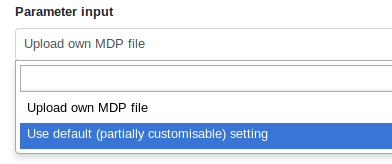

# Introduction
{:.no_toc}

Molecular dynamics (MD) is a method to simulate molecular motion by iterative application of Newton's laws of motion. It is often applied to large biomolecules such as proteins or nucleic acids.

Multiple packages exist for performing MD simulations. One of the most popular is the open-source GROMACS, which is the subject of this tutorial. Other MD packages which are also provided in Galaxy are [NAMD](../md-simulation-namd/tutorial.html) and CHARMM.

This is a introductory guide to using GROMACS in Galaxy to prepare and perform molecular dynamics on a small protein. It is based on the GROMACS tutorial provided by Justin Lemkul [here](http://www.mdtutorials.com/gmx/lysozyme/index.html) - please consult it if you are interested in a more detailed, technical guide to GROMACS. For the tutorial, we will perform our simulations on hen egg white lysozyme.

> ### Agenda
>
> In this tutorial, we will cover:
>
> 1. TOC
> {:toc}
>
{: .agenda}

# Workflow

A GROMACS workflow is provided for this tutorial [here](https://usegalaxy.eu/u/simonbray/w/molecular-dynamics-1); we will discuss the tools that make up each of the steps.

Overall, the workflow takes a PDB (Protein Data Bank) structure file as input and returns a 'trajectory'. This is a binary file that records the atomic coordinates at multiple time steps, and therefore shows the dynamic motion of the molecule. Using visualization software, we can display this trajectory as a film displaying the molecular motion of the protein.

The process can be divided into multiple stages:
 1. Setup (loading data, solvation i.e. addition of water and ions)
 2. Energy minimization of the protein
 3. Equilibration of the solvent around the protein (with two ensembles, NVT and NPT)
 4. Production simulation, which produces our trajectory.

We will discuss each tool making up the workflow in more detail.

# Getting data
To perform simulation, an initial PDB file is required. This should be 'cleaned' of solvent and any other non-protein atoms. Solvent will be re-added in a subsequent step.

A prepared file is available via Zenodo. Alternatively, you can prepare the file yourself. Download a PDB structure file from the [Protein Data Bank](https://www.rcsb.org/) and remove the unwanted atoms using [grep](https://usegalaxy.eu/?tool_id=toolshed.g2.bx.psu.edu/repos/bgruening/text_processing/tp_grep_tool). This simply removes the lines in the PDB file that refer to the unwanted atoms.

> ###  Hands-on:
> First of all, create a new history.
>
>    
>
> **Option 1**
> 1. Upload the file in Galaxy from the Zenodo link: 
>
> **Option 2**
> 1. Go to the [PDB website](https://www.rcsb.org/) and search for the code 1AKI. Download the structure and upload to Galaxy.
> 2. Use [grep](https://usegalaxy.eu/?tool_id=toolshed.g2.bx.psu.edu/repos/bgruening/text_processing/tp_grep_tool) to remove all lines that refer to non-protein atoms. Select 'Don't Match', enter 'HETATM' under 'Regular Expression'.
> 
{: .hands_on}

> ###  Background: What is the PDB (Protein Data Bank) and format?
>
> The Protein Data Bank (PDB) format contains atomic coordinates of biomolecules and provides a standard representation for macromolecular structure data derived from X-ray diffraction and NMR studies. Each structure is stored under a four-letter accession code. For example, the PDB file we will use is assigned the code [1AKI](https://www.rcsb.org/pdb/explore/explore.do?structureId=1AKI)).
>
> More resources:
>
>  -  Multiple structures are stored and can be queried at [https://www.rcsb.org/](https://www.rcsb.org/)
>  - Documentation describing the PDB file format is available from the wwPDB at [http://www.wwpdb.org/documentation/file-format.php](http://www.wwpdb.org/documentation/file-format.php).
{: .tip}

## Lysozyme
The protein we will look at in this tutorial is hen egg white [lysozyme](https://en.wikipedia.org/wiki/Lysozyme), a widely studied enzyme which is capable of breaking down the polysaccharides of many bacterial cell walls. It is a small (129 residues), highly stable globular protein, which makes it ideal for our purposes.

# Setup

The **setup**  tool uses the PDB input to create three files which will be required for MD simulation.

Firstly, a topology for the protein structure is prepared. The topology file contains all the information required to describe the molecule for the purposes of simulation - atom masses, bond lengths and angles, charges. Note that this automatic construction of a topology is only possible if the building blocks of the molecules (i.e. amino acids in the case of a protein) are precalculated for the given force field. A force field and water model must be selected for topology calculation. Multiple choices are available for each; we will use the OPLS/AA force field and SPC/E water model.

Secondly, a GRO structure file is created, storing the structure of the protein. It also defines the unit cell 'box', centered on the structure. Options include box dimensions and shape; here, while a cuboidal box may be most intuitive, rhombic dodecahedron is the most efficient option, as it can contain the protein using the smallest volume, thus reducing the simulation resources devoted to the solvent.

Finally, a 'position restraint file' is created which will be used for NVT/NPT equilibration. We will return to this later.

In summary, this tool will:
- create a 'topology' file
- convert a PDB protein structure into a GRO file, with the structure centered in a simulation box (unit cell)
- create a position restraint file

> ###  Hands-on:
>
> Run **setup**  with the following parameters:
>    -  *"PDB input file"*: `1AKI_clean.pdb` (Input dataset)
>    - *"Water model"*: `SPC/E`
>    - *"Force field"*: `OPLS/AA`
>    - *"Ignore hydrogens"*: `no`
>    - *"Box type"*: `Rectangular box with all sides equal`
>    - *"Generate detailed log"*: `yes`
>
> > ###  Question
> >
> > Why is it necessary to provide an input structure containing no non-protein molecules?
> >
> > > ###  Solution
> > > Automatic topology construction only succeeds if the components of the structure are recognized. For example, providing a structure of a protein in complex with a non-protein ligand or cofactor will result in an error.
> > {: .solution}
> {: .question}
>
{: .hands_on}

# Solvation

The next stage is protein solvation, performed using **solvate** . Water molecules are added to the structure and topology files to fill the unit cell. At this stage sodium or chloride ions are also automatically added to neutralize the charge of the system. In our case, as lysozyme has a charge of +8, 8 chloride anions are added.

This tool will:
- add water molecules to fill the box defined in the setup

> ###  Hands-on:
>
> **solvate**  with the following parameters:
>    -  *"GRO structure file"*: GRO structure file produced by setup
>    -  *"Topology (TOP) file"*: Topology produced by setup
>    - *"Water model for solvation"*: `SPC`
>    - *"Generate detailed log"*: `yes`
>
{: .hands_on}

# Energy minimization

To remove any steric clashes or unusual geometry which would artificially raise the energy of the system, we must relax the structure by running an energy minimization (EM) algorithm.

Here, and in the later steps, two options are presented under 'Parameter input'. Firstly, the default setting, which we will use for this tutorial, requires options to be selected through the Galaxy interface. Alternatively, you can choose to upload an MDP (molecular dynamics parameters) file to define the simulation parameters. Using your own MDP file will allow greater customization, as not all parameters are implemented in Galaxy (yet); however, it requires a more advanced knowledge of GROMACS. Description of all parameters can be found [here](http://manual.gromacs.org/documentation/2018/user-guide/mdp-options.html).

This tool will:
- Run an energy minimization algorithm on the system.

> ###  Hands-on: 
>
> **EM**  with the following parameters:
>    -  *"GRO structure file"*: GRO structure file
>    -  *"Topology (TOP) file"*: Topology
>    - *"Generate detailed log"*: `yes`
>    - *"Parameter input"*: `Use default (partially customisable) setting`
>    - *"Choice of integrator"*: `Steepest descent algorithm` (most common choice for EM)
>    - *"Neighbor searching"*: `Generate a pair list with buffering` (the '[Verlet scheme](https://en.wikipedia.org/wiki/Verlet_list)')
>    - *"Electrostatics"*: `Fast smooth Particle-Mesh Ewald (SPME) electrostatics`
>    - *"Distance for the Coulomb cut-off"*: `1.0`
>    - *"Cut-off distance for the short-range neighbor list"*: `1.0` (but irrelevant as we are using the Verlet scheme)
>    - *"Short range van der Waals cutoff"*: `1.0`
>    - *"Number of steps for the MD simulation"*: `50000`
>    - *"EM tolerance"*: `1000.0`
>    - *"Maximum step size"*: `0.01`
>
{: .hands_on}

# Equilibration

At this point equilibration of the solvent around the solute (i.e. the protein) is necessary. This is performed in two stages: equilibration under an NVT ensemble, followed by an NPT ensemble. Use of the NVT ensemble entails maintaining constant **n**umber of particles, **v**olume and **t**emperature, while the NPT ensemble maintains constant **n**umber of particles, **p**ressure and **t**emperature.

For equilibration, the protein must be held in place while the solvent is allowed to move freely around it. This is achieved using the position restraint file we created in system setup. When we specify this restraint, protein movement is not totally forbidden, but is energetically punished.

## NVT equilibration
Firstly, we perform equilibration using classical NVT dynamics.

> ###  Hands-on: NVT dynamics
>
> **nvt**  with the following parameters:
>    -  *"GRO structure file"*: GRO structure file
>    -  *"Topology (TOP) file"*: Topology
>    -  *"Position restraint file"*: Position restraint file produced by setup
>    - *"Parameter input"*: `Use default (partially customisable) setting`
>    - *"Choice of integrator"*: `A leap-frog algorithm for integrating Newton’s equations of motion` (A basic leap-frog integrator)
>    - *"Bond constraints"*: `Bonds with H-atoms` (bonds involving H are constrained)
>    - *"Neighbor searching"*: `Generate a pair list with buffering` (the '[Verlet scheme](https://en.wikipedia.org/wiki/Verlet_list)')
>    - *"Electrostatics"*: `Fast smooth Particle-Mesh Ewald (SPME) electrostatics`
>    - *"Temperature"*: `300`
>    - *"Step length in ps"*: `0.002`
>    - *"Number of steps that elapse between saving data points (velocities, forces, energies)"*: `5000`
>    - *"Distance for the Coulomb cut-off"*: `1.0`
>    - *"Cut-off distance for the short-range neighbor list"*: `1.0` (but irrelevant as we are using the Verlet scheme)
>    - *"Short range van der Waals cutoff"*: `1.0`
>    - *"Number of steps for the NVT simulation"*: `50000`
>    - *"Trajectory output"*: `Return no trajectory output` (we are not interested in how the system evolves to the equilibrated state, merely the final structure)
>    - *"Structure output"*: `Return the .gro structure`
>    - *"Generate detailed log"*: `yes`
{: .hands_on}

## NPT equilibration
Having stabilized the temperature of the system with NVT equilibration, we also need to stabilize the pressure of the system. We therefore equilibrate again using the NPT (constant number of particles, pressure, temperature) ensemble.

> ###  Hands-on: NPT dynamics
>
> **npt**  with the following parameters:
>    -  *"GRO structure file"*: GRO structure file
>    -  *"Topology (TOP) file"*: Topology
>    -  *"Checkpoint (TOP) file"*: Checkpoint file produced by NVT equilibration
>    -  *"Position restraint file"*: Position restraint file produced by setup
>    - *"Parameter input"*: `Use default (partially customisable) setting`
>    - *"Choice of integrator"*: `A leap-frog algorithm for integrating Newton’s equations of motion` (A basic leap-frog integrator)
>    - *"Bond constraints"*: `Bonds with H-atoms` (bonds involving H are constrained)
>    - *"Neighbor searching"*: `Generate a pair list with buffering` (the '[Verlet scheme](https://en.wikipedia.org/wiki/Verlet_list)')
>    - *"Electrostatics"*: `Fast smooth Particle-Mesh Ewald (SPME) electrostatics`
>    - *"Temperature"*: `300`
>    - *"Step length in ps"*: `0.002`
>    - *"Number of steps that elapse between saving data points (velocities, forces, energies)"*: `5000`
>    - *"Distance for the Coulomb cut-off"*: `1.0`
>    - *"Cut-off distance for the short-range neighbor list"*: `1.0` (but irrelevant as we are using the Verlet scheme)
>    - *"Short range van der Waals cutoff"*: `1.0`
>    - *"Number of steps for the NPT simulation"*: `50000`
>    - *"Trajectory output"*: `Return no trajectory output` (we are not interested in how the system evolves to the equilibrated state, merely the final structure)
>    - *"Structure output"*: `Return the .gro structure`
>    - *"Generate detailed log"*: `yes`
{: .hands_on}

> > ###  Question
> >
> > Why is the position of the protein restrained during equilibration?
> >
> > > ###  Solution
> > > The purpose of equilibration is to stabilize the temperature and pressure of the system; these are overwhelmingly dependent on the solvent. Structural changes in the protein are an additional complicating variable, which can more simply be removed by restraining the protein.
> > {: .solution}
> {: .question}

# Production simulation
Now that equilibration is complete, we can release the position restraints. We are now finally ready to perform a production MD simulation.

> ###  Hands-on: Production simulation
>
> 1. **mdrun**  with the following parameters:
>    -  *"GRO structure file"*: GRO structure file
>    -  *"Topology (TOP) file"*: Topology
>    -  *"Checkpoint (TOP) file"*: Checkpoint file produced by NPT equilibration
>    - *"Parameter input"*: `Use default (partially customisable) setting`
>    - *"Choice of integrator"*: `A leap-frog algorithm for integrating Newton’s equations of motion` (A basic leap-frog integrator)
>    - *"Bond constraints"*: `Bonds with H-atoms` (bonds involving H are constrained)
>    - *"Neighbor searching"*: `Generate a pair list with buffering` (the '[Verlet scheme](https://en.wikipedia.org/wiki/Verlet_list)')
>    - *"Electrostatics"*: `Fast smooth Particle-Mesh Ewald (SPME) electrostatics`
>    - *"Temperature"*: `300`
>    - *"Step length in ps"*: `0.002`
>    - *"Number of steps that elapse between saving data points (velocities, forces, energies)"*: `5000`
>    - *"Distance for the Coulomb cut-off"*: `1.0`
>    - *"Cut-off distance for the short-range neighbor list"*: `1.0` (but irrelevant as we are using the Verlet scheme)
>    - *"Short range van der Waals cutoff"*: `1.0`
>    - *"Number of steps for the simulation"*: `500000`
>    - *"Trajectory output"*: `Return .xtc file (reduced precision)` (this time, we save the trajectory)
>    - *"Structure output"*: `Return the .gro structure`
>    - *"Generate detailed log"*: `yes`
{: .hands_on}

# Conclusion

After completing the steps, or running the workflow, we have successfully produced a trajectory (the xtc file) which describes the atomic motion of the system. This can be viewed using molecular visualization software or analysed further; please visit the visualization and [analysis](../analysis-md-simulations/tutorial.html) tutorials for more information.

{:.no_toc}

