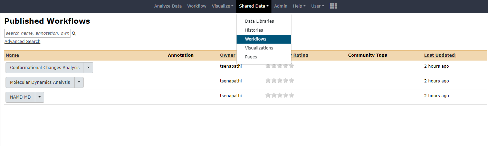
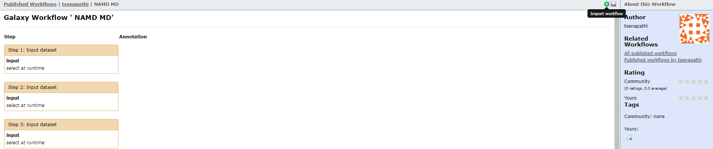
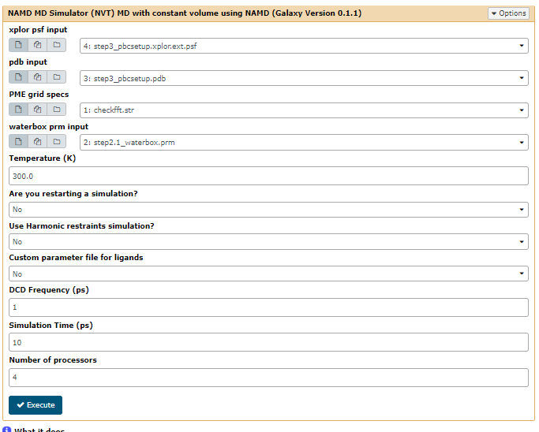

# Introduction
{:.no_toc}

> ### Agenda
>
> In this tutorial, we will cover:
>
> 1. TOC
> {:toc}
>
{: .agenda}

In this tutorial we will perform a simulation with the popular [NAMD](http://www.ks.uiuc.edu/Research/namd/) molecular dynamics software.

This tutorial is made up of two parts. In the first section, we will look at preparation of a system (solvation, charge neutralisation, energy minimisation) using CHARMM. In the second section, we will perform an equilibration and production simulation, using NAMD. If you already completed the [Setting up molecular systems](../setting-up-molecular-systems/tutorial.html) tutorial, which covers the use of the CHARMM graphical user interface (GUI), you have already prepared your system, so go straight to the [second section](#namd-md-workflow), using the files you prepared earlier.

The process can be accomplished by selecting each tool from the tools menu, or by importing the workflow. The workflow method is most efficient and the individual tools used in the workflows are discussed below. The entire workflow (preparation + simulation) is shown below for [CHARMM and NAMD](#figure-1).

> ###  NVT, NPT and statistical mechanics theory
>
> [See Statistical Mechanics, McQuarrie for more in depth theory ISBN:9781891389153](https://books.google.co.za/books/about/Statistical_Mechanics.html?id=itcpPnDnJM0C&redir_esc=y)
>
{: .details}

# System preparation with CHARMM

If you already prepared your system using the CHARMM-GUI, and saved the output files, you can skip this section.

## Setup

Initially, we need to prepare a protein-ligand system in CHARMM. 

This tool will:
- solvate the protein-ligand complex, using the TIP3P water model
- neutralise the system, using 0.05M NaCl
- conduct a short energy minimisation 

> ###  Hands-on:
>
> Run **setup**  with the following parameters:
>    -  *"psf input"*: Protein structure file of the protein-ligand system. (Input dataset)
>    -  *"crd input"*: Coordinate file of the protein-ligand system. (Input dataset)
>    - *"Buffer"*: Edge to edge distance between the protein and the edge of the water box in angstroms
>    - *"Custom topology and parameter files for ligands"* (optional)
>
{: .hands_on}

### Energy minimisation

The setup provides us with the CRD and PSF files needed to perform a simulation. In addition, we have a PRM file which defines the parameters of the unit cell. Now, we need to perform energy minimisation. This relaxes the system, removing any steric clashes or unusual geometry which could artificially raise the energy.

This tools will:
- Minimise energy using a steepest descent algorithm followed by Adopted Newton Raphson (using the defined number of steps)
- Set up periodic boundaries and generate Particle Mesh Ewald (PME)
- generate reference structures for restraints in NAMD (if selected)

> ###  Hands-on:
>
> Run **minimizer**  with the following parameters:
>    -  *"system_setup_crd"*: Coordinate file generated by the setup tool. (Input dataset)
>    -  *"system_setup_psf"*: Protein structure file generated by the setup tool. (Input dataset)
>    -  *"waterbox parameters input"*: Water box parameter file generated by the setup tool. (Input dataset)
>    - *"Minimization steps"*: `1000`
>    - *"Create reference structures for RMSD restraints for NAMD?"*: `No`
>    - *"Custom topology and parameter files for ligands"*: `No`
>
{: .hands_on}

# NAMD MD workflow

At this point we are ready to run the simulation workflow, which uses NAMD as a molecular dynamics engine. An NVT simulation is followed by an NPT simulation.

> ###  Hands-on: Access the workflow
> Access the published workflows
> 
> Choose to import the NAMD MD workflow from published workflows
> 
> Choose to run a workflow from your available workflows
> 
{: .hands_on}

### NVT

Classical NVT dynamics, maintaining constant **n**umber of particles, **v**olume and **t**emperature.

This tool runs classical molecular dynamics simulations in NAMD using an NVT ensemble. User can run the simulation in small time intervals. The coordinates, velocities and the extended system files can be use to restart the simulations. If required, harmonic restraints can be used to maintain the protein shape. These restraints, in particular RMSD harmonic restraints can be added with the NAMD collective variable module.

> ###  Hands-on: NVT dynamics
>
> 1. **namd_nvt**  with the following parameters:
>    -  *"xplor psf input"*: PSF file from CHARMM preparation (Input dataset)
>    -  *"pdb input"*: PDB file from CHARMM preparation (Input dataset)
>    -  *"PME grid specs"*: Generated by the setup tool (Input dataset)
>    -  *"waterbox prm input"*: Water box parameter file generated by the setup tool. (Input dataset)
>    - *"Temperature (K)"*: `300`
>    - *"Are you restarting a simulation?"*: `No`
>    - *"Use Harmonic restraints simulation?"*: `No`
>    - *"Custom parameter file for ligands"*: `No`
>    - *"DCD Frequency (ps)"*: `1` (Frequency to record frames in the DCD trajectory)
>    - *"Simulation Time (ps)"*: `10`
>    - *"Number of processors"*: `4`
>
> 
{: .hands_on}

### NPT
Classical NPT dynamics, maintaining constant **n**umber of particles, **p**ressure and **t**emperature.

This tool runs classical molecular dynamics simulations in NAMD using an NPT ensemble. User can run the simulation in small time intervals. The coordinates, velocities and the extended system files can be use to restart the simulations. Harmonic restraints can be used. NAMD collective variable module is used to give RMSD harmonic restraints.

> ###  Hands-on: NPT dynamics
>
> 1. **namd_npt**  with the following parameters:
>    -  *"xplor psf input"*: PSF file from CHARMM preparation (Input dataset)
>    -  *"pdb input"*: PDB file from CHARMM preparation (Input dataset)
>    -  *"PME grid specs"*: Generated by the setup tool (Input dataset)
>    -  *"waterbox prm input"*: Water box parameter file generated by the setup tool. (Input dataset)
>    - *"Temperature (K)"*: `300`
>    - *"Pressure (bar)"*: `1.01325`
>    - *"Are you restarting a simulation?"*: `Yes`
>    - *"Coordinates from the previous simulation"*:  from the NVT simulation
>    - *"Velocities from the previous simulation"*:  from the NVT simulation
>    - *"Extended system of the previous simulation"*: from the NVT simulation
>    - *"Use Harmonic restraints simulation?"*: `No`
>    - *"Custom parameter file for ligands"*: `No`
>    - *"DCD Frequency (ps)"*: `1` (Frequency to record frames in the DCD trajectory)
>    - *"Simulation Time (ps)"*: `15`
>    - *"Number of processors"*: `4`
> 
> 
{: .hands_on}

# Conclusion
After completing the steps, or running the workflow, we have successfully produced a trajectory (the xtc file) which describes the atomic motion of the system. This can be viewed using molecular visualization software or analysed further; please visit the visualization and [analysis](../analysis-md-simulations/tutorial.html) tutorials for more information.

{:.no_toc}

