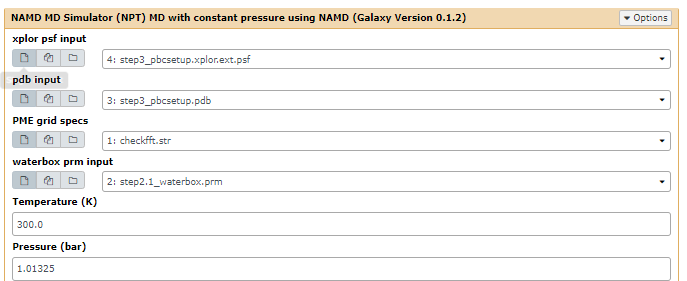
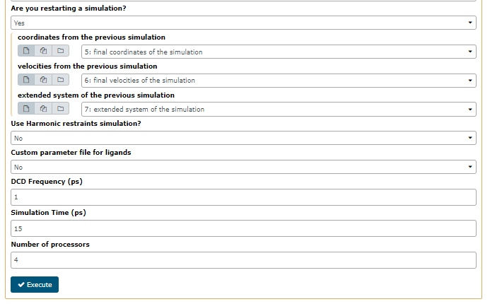

# Introduction
{:.no_toc}

> ### Agenda
>
> In this tutorial, we will cover:
>
> 1. TOC
> {:toc}
>
{: .agenda}

# Simulation with NAMD (imported from CHARMM-GUI)

This process can be accomplished by selected each tools from the tools menu or by importing the workflow. The workflow method is most efficient and the individual tools used in the workflow are discussed below. 

If you've imported from CHARMM-GUI read through the theory then skip to [NAMD_MD](#namd_md) otherwise carry on and start with [setup](#setup). The workflows as shown below for [CHARMM and NAMD](#figure-1) or [only NAMD](#figure-2) will be used.

> ###  NVT, NPT and statistical mechanics theory
>
> [See Statistical Mechanics, McQuarrie for more in depth theory ISBN:9781891389153](https://books.google.co.za/books/about/Statistical_Mechanics.html?id=itcpPnDnJM0C&redir_esc=y)
>
{: .details}

## Additional prep with CHARMM (SKIP)

### **setup**
{: #setup}

Prepare a protein ligand system in CHARMM. 
This tool will:
- solvate the protein-ligand comples in TIP3P waters
- neutralise the system by using 0.05M NaCl
- conduct a short minimisation 

> ###  Hands-on:
>
> 1. **setup**  with the following parameters:
>
>
{: .hands_on}

### **minimizer**

Reduces the energy of the system by running a minimisation algorithm. 
This tools will:
- Minimise energy using steepest descent followed by Adopted Newton Raphson (using the define number of steps_
- Setup periodic boundaries and generate Particle Mesh Ewald (PME)
- generate reference structures for restraints in NAMD (if selected)

> ###  Hands-on: 
>
> 1. **minimizer**  with the following parameters:
>
>
{: .hands_on}

## NAMD MD workflow
{: #namd_md}

This workflow uses NAMD as a molecular dynamics engine. An NVT simulation is followed by an NPT simulation.

> ###  Hands-on: Access the workflow
> Access the published workflows
> 
> Choose to import the NAMD MD workflow from published workflows
> 
> Choose to run a workflow from your available workflows
> 
{: .hands_on}

### **namd_nvt**
{: #namd_nvt}
Classical NVT dynamics.

> ###  Hands-on: NVT dynamics
>
> 1. **namd_nvt**  with the following parameters:
>
> This tool runs classical molecular dynamics simulations in NAMD using an NVT ensemble. User can run the simulation in small time intervals. The coordinates, velocities and the extended system files can be use to restart the simulations. Harmonic restraints can be used. NAMD collective variable module is used to give RMSD harmonic restraints.
> 
{: .hands_on}

### **namd_npt**
Classical NPT dynamics.

> ###  Hands-on: NPT dynamics
>
> 1. **namd_npt**  with the following parameters:
>
> This tool runs classical molecular dynamics simulations in NAMD using an NPT ensemble. User can run the simulation in small time intervals. The coordinates, velocities and the extended system files can be use to restart the simulations. Harmonic restraints can be used. NAMD collective variable module is used to give RMSD harmonic restraints.
> 
> 
{: .hands_on}

# Conclusion
{:.no_toc}

