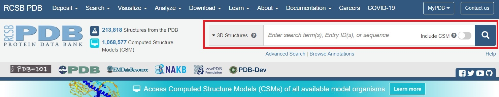
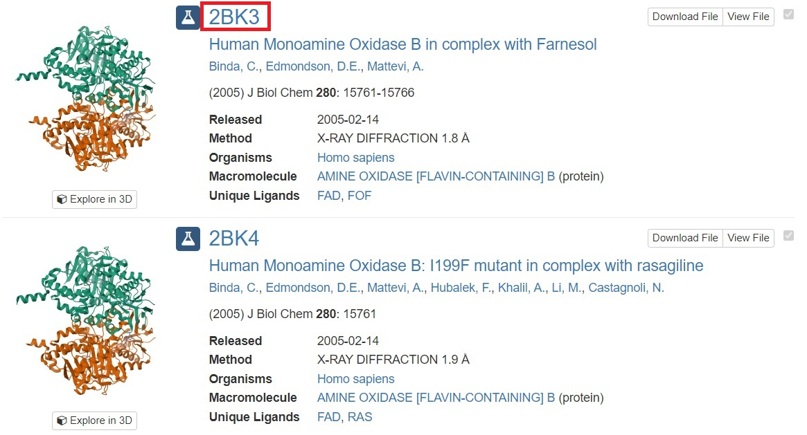

# Introduction 
The development of medicinal chemistry is more and more advancing. Big pharmaceutical companies, research institutes and universities are working on ground-breaking solutions to help patients combat all kinds of diseases. During that development process, tons of data are generated – not only from the lab environment but also from clinical trials. Given that the discovery of more potent, safer and cheaper drugs is the ultimate goal of all research bodies, we should all focus on making the data we gather FAIR: **F**indable, **A**ccessible, **I**nteroperable, and **R**eusable to push the boundaries of drug development even further. 

With the currently available methods such as artificial intelligence, machine learning, many toolkits, software and access to various databases, managing big data is now inherently linked to medicinal chemistry and helps to make this area as efficient as it can be. 

# Principles of medicinal chemistry research

## Drug-likeness
There are many factors that medicinal chemists take into account while designing new drugs. It is essential to estimate the properties of the molecule before syntesisng it in the lab, so the structures of drug candidates are usually compared to the existing drugs by so-called drug-likeness. This includes intrinsic properties of a compound that will lead to favourable ADMET (**A**bsorption, **D**istribution, **M**etabolism, **E**xcretion, **T**oxicity) characteristics. Below are some properties usually assessed:
- Lipophilicity
- Size
- Polarity
- Insolubility
- Insaturation
- Flexibility

Additionally, there have been some rules developed to help estimate drug-likeness, amongst which:
- Lipinski rule ()
- Ghose rule ()
- Veber rule ()
- Egan rule ()
- Muegge rule ()
- Abbott bioavailability score ()

As you see, the number of characteristics to consider before even synthesising the molecule is huge. One of the tools that helps to summarise all the most important information about intrinsic properties and drug-likeness of compounds is called [SwissADME](http://www.swissadme.ch/) and is a free web tool to evaluate pharmacokinetics, drug-likeness and medicinal chemistry friendliness of small molecules (). 

Below we briefly discuss two probably the most well-known rules: Lipinski's and Veber's.

## The Lipinski rule of 5

The rule of thumb developed back in 1997 by Christopher Lipinski and colleagues tries to predict the likelihood that a given small molecule can be orally active. This Lipinski rule of 5 favours molecules as potential oral drug candidates if:
-	The molecular mass is less than 500
-	calculated logarithm of the octanol−water partition coefficient (clogP) is less than 5
-	they have up to 5 H-bond donors
-	they have up to 10 H-bond acceptors

Read more about re-assessing the rule of 5: .

However, nowadays there are more and more drugs being developed which don’t comply with those rules and regardless are still effective. There are voices from the scientific community, pointing out that “We are in danger of repeating our past mistakes if we assume these new modalities are not 'drug-like' and cannot be oral drugs because they are not [rule of 5] compliant” (Michael Shultz from Novartis ). Then, in  we read "This famous "rule of 5" has been highly influential in this regard, but only about 50 % of orally administered new chemical entities actually obey it." 

## Veber's rule

In addition to the rule of 5, there are also other criteria, one of which is the Veber's rule, which helps to predict good oral bioavailability based on:
- 10 or fewer rotatable bonds
- Polar surface area no greater than 140 Å 2

# Big data for drug discovery

Have you ever wondered how new drugs are developed? It is actually quite a long and complex pathway and not only takes lots of time, but also resources. The scheme below will help you understand the scale of that process.

As you can see, to get just one drug to the market, often thousands of structures are assessed to find the most effective and safe compound. That's lots of information being generated in the whole process! The information can be stored in repositories and databases so that subsequent drug discovery process in a similar area is easier, faster and cheaper. Managing big data and using machine learning and computational chemistry methods is crucial in lead optimisation step. By reviewing chemical databases and studying molecular docking simulations, we can save much time and resources to synthesise only those compounds that are the most promising based on *in-silico* methods. Even after synthesising the optimised 'leads', we still get lots of data from tests and analyses. By using appropriate cheminformatic tools and software, we can use the results to drive forward this iterative process of lead optimisation.

## Ten Vs of big data for drug discovery

Hopefully now you have an idea of how the process of drug discovery looks like. To understand why managing data in medicinal chemistry is so challanging, let's have a closer look at "Ten Vs"  of big data:

- **V**olume: size of data. 
- **V**elocity: speed of new data generation. 
- **V**ariety: various formats of data. 
- **V**eracity: quality of data. 
- **V**alidity: authenticity of data. 
- **V**ocabulary: terminology of data. 
- **V**enue: platform of data generation. 
- **V**isualization: view of data. 
- **V**olatility: duration of data usefulness. 
- **V**alue: potential of data usefulness to reduce the cost of drug discovery and development.

It is important that medicinal chemists keep in mind those features while both searching for data and publishing it. In this way we can focus on the main aspects of data management, try to improve the availability and normalisation of data, and be aware of limitations of repositories and inconsistencies in data quality. 

## FAIR MedChem
Those are the properties that the compounds can be easily searched by if all the information is included in the database. There is a need of assessing other molecular properties. This is one of the reasons why new repositories are being developed – they are more specific and gather particular properties of interest [EXAMPLE?]. 
How much easier the life of scientists could be if the relevant data was publicly available, well-ordered and contained the needed metadata? By submitting the data with necessary information to the repository is a good way to make the data FAIR. This will make it:
- **F**indable, as the data will be given specific identifiers
- **A**ccessible, as the data will be available online, open and free where possible
-	**I**nteroperable, as the repository will often enforce the use of formalised, consistent language
-	**R**eusable, as the data will be released under a license with detailed provenance
In the repositories 

# Chemical and pharmacological databases

Currently there are lots of publicly available databases storing information about hit molecules, chemical structures and properties, drug targets, pharmaceuticals… In the recent paper  the authors collated relevant databases to advance computer-aided drug discovery and divided them into several main groups:
- Chemical collections
- Drug / drug-like compounds
- Drug targets, including genomics and proteomics data
- Biological data from assay screening, metabolism, efficacy studies
- Drug liabilities and toxicities
- Clinical databases

Below you will find the databases listed under corresponding categoories, all taken from  paper. 

There are many more databases available, and many are still being developed. They are often quite specific and contain certain types of compounds (eg. PROTACS) or are aimed at particular disease. If the listed databases are not specific enough for your research, you can try luck by searching smaller, more specific databases. 

## Chemical collections

| Database | Description | Size (as of 29 October 2019) |
|:---:|:---:|:---:|
| [Enamine REAL Database](https://enamine.net/hit-finding/compound-collections/real-database) | Tool used to find new hit molecules using largescale virtual screening   and for searching analogs to hit molecules | >700 million compounds that comply with ‘rule of 5’ and Veber   criteria |
| [ZINC](http://zinc.docking.org/) | Contains compound information including 2D/3D structure, purchasability,   target, and biologyrelated information | >230 million compounds in 3D formats and >750 million compounds for   analogsearching |
| [PubChem](https://pubchem.ncbi.nlm.nih.gov) | Contains chemical molecule (mostly small molecule) information, including   chemical structures, identifiers, chemical and physical properties,   biological activities, safety and toxicity data | 97 million compounds, 236 million substances, 268 million bioactivities |
| [ChemSpider](www.chemspider.com) | Free chemical structure database providing fast access to >78 million   structures, properties, and associated information | >78 million compound structures |
| [SCUBIDOO](http://kolblab.org/scubidoo/index.php) | Freely accessible database that currently holds 21 million virtual   products originating from small library of building blocks and collection of   robust organic reactions | 21 million virtual products |
| [ChEMBL](www.ebi.ac.uk/chembl) | Manually curated database of bioactive molecules with drug-like   properties; brings together chemical, bioactivity, and genomic data to aid   translation of genomic information into effective new drugs. | >1.9 million compounds, 1.1 million pieces of assay information |
| [TCM-Mesh](http://mesh.tcm.microbioinformatics.org/) | Integration of a database and a data-mining system for network   pharmacology analysis of all respects of traditional Chinese medicine,   including herbs, herbal ingredients, targets, related diseases, adverse   effect, and toxicity | 383 840 compounds, 6235 herbs |
| [Super Natural II](http://bioinf-applied.charite.de/supernatural_new/index.php) | Contains natural compounds, including information about corresponding 2D   structures, physicochemical properties, predicted toxicity class and   potential vendors | 325 508 natural compounds |
| [BIAdb](https://webs.iiitd.edu.in/raghava/biadb/index.html) | Comprehensive database of benzylisoquinoline alkaloids, containing   information about 846 unique benzylisoquinoline alkaloids | ~846 unique benzylisoquinoline alkaloids |

## Drug / drug-like compounds

| Database | Description | Size (as of 29 October 2019) |
|:---:|:---:|:---:|
| [AICD](http://956023.ichengyun.net/AICD/index.php) | Anti-Inflammatory Compounds Database (AICD) deposits compounds with   potential antiinflammation activities | 79 781 small molecules |
| [DrugBank](www.drugbank.ca) | Unique bioinformatics and cheminformatics resource that combines detailed   drug data with comprehensive drug target information | 13 441 drug entries |
| [ReFRAME](https://reframedb.org/) | Screening library of 12 000 molecules assembled by combining three   databases (Clarivate Integrity, GVK Excelra GoStar, and Citeline   Pharmaprojects) to facilitate drug repurposing | 12 000 molecules |
| [SuperDRUG2](http://cheminfo.charite.de/superdrug2/) | Contains approved/marketed drugs with regulatory details, chemical   structures (2D and 3D), dosage, biological targets, physicochemical   properties, external identifiers, adverse effects, and PK data | >4600 active pharmaceutical ingredients |
| [Drugs@FDA database](www.fda.gov/drugs/drug-approvals-and-databases/drugsfda-data-files) | Information about drugs from FDA | ~23 391 drug application records |
| [e-Drug3D](https://chemoinfo.ipmc.cnrs.fr/MOLDB/index.php) | Contains 1930 molecular structures approved by FDA between 1939 and 2019   with a molecular weight <2000 | 1930 drugs |

## Drug targets, including genomics and proteomics data

| Database | Description | Size (as of 29 October 2019) |
|:---:|:---:|:---:|
| [BindingDB](www.bindingdb.org/bind/index.jsp) | Public, web-accessible database of   measured binding affinities, focusing chiefly on interactions of proteins   considered to be candidate drug targets with ligands that are small,   drug-like molecules |  |
| [Supertarget](http://insilico.charite.de/supertarget/index.php?site=home) | An extensive web resource for   analyzing drugtarget interactions. |  |
| [Ligand Expo](http://ligand-expo.rutgers.edu/index.html) | Provides chemical and structural   information about small molecules within structure entries of Protein Data   Bank. |  |
| [PDBeChem](www.ebi.ac.uk/pdbe-srv/pdbechem/) | Consistent and enriched library of   ligands, small molecules, and monomers referenced as residues and hetgroups   in PDB entries |  |
| [PDBbind-CN](www.pdbbind-cn.org/) | Provides essential linkage between   energetic and structural information of biomolecular complexes, which is   helpful for various computational and statistical studies on molecular   recognition in biological systems |  |
| [STITCH](http://stitch.embl.de/) | Database integrating information   about interactions from metabolic pathways, crystal structures, binding   experiments, and drug–target relationships |  |
| [BioGRID](https://thebiogrid.org/) | The Biological General Repository   for Interaction Datasets is an open-access database on protein, genetic, and   chemical interactions for humans and all major model organisms |  |
| [Binding MOAD](http://bindingmoad.org/) | Created from a subset of Protein   Data Bank (PDB), containing every high-quality example of ligandprotein   binding. |  |
| [GPCRdb](www.gpcrdb.org) | Contains data from GPCRs, including   crystal structures, sequence alignments, and receptor mutations; can be   visualized in interactive diagrams; provides online analysis tools |  |
| [Guide to Pharmacology](www.guidetopharmacology.org/) | IUPHAR/BPS guide to pharmacology is   an openaccess, expert-curated database of molecular interactions between   ligands and their targets. |  |
| [GLASS](https://zhanglab.ccmb.med.umich.edu/GLASS/) | GPCR-Ligand Association (GLASS)   database is a manually curated repository for experimentally validated   GPCR–ligand interactions; along with relevant GPCR and chemical information,   GPCRligand association data are extracted and integrated into GLASS from literature   and public databases |  |

## Biological data from assay screening, metabolism, efficacy studies

| Database | Description | Size (as of 29 October 2019) |
|:---:|:---:|:---:|
| [HMDB](www.hmdb.ca/about) | Freely available electronic database containing detailed information   about small-molecule metabolites found in human body | 114 162 metabolite entries |
| [SMPDB](http://smpdb.ca/) | Small Molecule Pathway Database (SMPDB) is an interactive, visual   database containing >30 000 small-molecule pathways found in humans only | >30 000 small-molecule pathways |
| [TTD](http://db.idrblab.net/ttd/) | Therapeutic Target Database (TTD) is a database providing information   about known and explored therapeutic protein and nucleic acid targets,   targeted disease, pathway information and corresponding drugs directed at   each of these targets | 2589 targets, and 31 614 drugs |
| [BioCyc](https://biocyc.org/) | Collection of 7615 pathway/genome databases; each database in BioCyc   collection describes genome and metabolic pathways of a single organism | 7615 pathway/genome databases |
| [BiGG](http://bigg.ucsd.edu/) | Metabolic reconstruction of human metabolism designed for systems biology   simulation and metabolic flux balance modeling | 2004 proteins, 2766 metabolites, and 3311 metabolic and transport   reactions |
| [BRENDA](www.brenda-enzymes.org/) | Main collection of enzyme functional data available to scientific   community | At least 40 000 different enzymes from >6900 different organisms |
| [Reactome](https://reactome.org/) | Curated, peer-reviewed knowledgebase of biological pathways, including   metabolic pathways, and protein trafficking and signaling pathways | >9600 proteins, 9800 reactions, and 2000 pathways for humans |
| [BioModels Database](www.ebi.ac.uk/biomodels-main/) | Repository of computational models of biological processes; models   described from literature are manually curated and enriched with   crossreferences | 6753 patient-derived genomescale metabolic models, 112 898 metabolic   models etc. |
| [KEGG](https://www.genome.jp/kegg) | Database resource that integrates genomic, chemical, and systemic   functional information | 18 652 metabolites |
| [CARLSBAD](http://carlsbad.health.unm.edu/carlsbad/?mode=home) | Database and knowledge inference system that integrates multiple   bioactivity data sets to provide researchers with novel capabilities for   mining and exploration of available structure activity relationships (SAR)   throughout chemical biology space. | 932 852 CARLSBAD activities, 890 323 unique structure–target pairs, 3542   targets, 435 343 unique structures |
| [WOMBAT](http://dud.docking.org/wombat/) | Contains 331 872 entries, representing 1966 unique targets, with   bioactivity annotations | 268 246 unique structures |
| [Open NCI Database](https://cactus.nci.nih.gov/ncidb2.2/) | Maintained by the National Cancer Institute; contains small-molecule   information such as names, biological activities, structures; useful resource   for researchers working in cancer/AIDS fields | >250 000 compounds |
| [NPACT](http://crdd.osdd.net/raghava/npact/) | Provides information on plant-derived natural compound, including   structure, properties (physical, elemental, and topological), cancer type,   cell lines, inhibitory values (IC50, ED50, EC50, GI50), molecular targets,   commercial suppliers, and drug likeness of compounds | 1574 entries |
| [PKPB_DB](https://cfpub.epa.gov/ncea/risk/recordisplay.cfm?deid=204443) | Contains physiological parameter values for humans from early childhood   through senescence; intended to be used in physiologically based (PB) PK   modeling; also contains similar data for animals (primarily rodents) | N/A |

## Drug liabilities and toxicities

| Database | Description | Size (as of 29 October 2019) |
|:---:|:---:|:---:|
| [T3DB](www.t3db.ca/) | Unique bioinformatics resource that combines detailed toxin data with   comprehensive toxin target information | 3678 toxins |
| [DrugMatrix](https://ntp.niehs.nih.gov/data/drugmatrix/) | One of world’s largest toxicogenomic reference resources | ~ 600 drug molecules and 10 000 genes |
| [ACToR](https://actor.epa.gov/actor/home.xhtml) | Includes computational toxicology information about compounds, including   HTS, chemical exposure, sustainable chemistry (chemical structures and   physicochemical properties) and virtual tissue data | >500 000 chemicals |
| [SkinSensDB](https://cwtung.kmu.edu.tw/skinsensdb/) | Contains curated data from published AOP-related skin sensitization   assays | 710 unique chemicals |
| [SIDER](http://sideeffects.embl.de/download/) | Contains information on marketed medicines and their recorded adverse   drug reactions, including frequency, drug and adverse effect classifications | 1430 drugs with 5868 side effect information |
| [LTKB Benchmark Dataset](www.fda.gov/science-research/) | Contains drugs with potential to cause druginduced liver injury in   humans; established using FDA-approved prescription drug labels;   liver-toxicity-knowledge-base-ltkb/ ltkb-benchmark-dataset | 287 prescription drugs |
| [CTD](http://ctdbase.org/) | Comparative Toxicogenomics Database (CTD) is a premier public resource   for literature-based, manually curated associations between chemicals, gene   products, phenotypes, diseases, and environmental exposures | 13 378 unique chemicals and related information |

## Clinical databases

| Database | Description | Size (as of 29 October 2019) |
|:---:|:---:|:---:|
| [ClinicalTrials.gov](https://clinicaltrials.gov/) | Database of privately and publicly funded clinical studies conducted   around the world | ~ 324 429 research studies in all 50 US states and 209 countries |
| [AACT database](https://aact.ctti-clinicaltrials.org/) | Publicly available relational database that contains all information   (protocol and result data elements) about every study registered in   ClinicalTrials.gov. Content is downloaded from ClinicalTrials.gov daily and   loaded into AACT | ~ 324 429 research studies in all 50 US states and 209 countries |
| [EORTC Clinical Trials Database](www.eortc.org/clinical-trials/) | Contains information about EORTC clinical trials and clinical trials from   other organizations with EORTC participation | N/A |
| [Exposome-Explorer](http://exposome-explorer.iarc.fr/) | Contains detailed information on nature of biomarkers, populations and   subjects where measured, samples analyzed, methods used for biomarker   analyses, concentrations in biospecimens, correlations with external exposure   measurements, and biological reproducibility over time | 908 biomarkers |
| [PharmaGKB](www.pharmgkb.org/) | A pharmacogenomics knowledge resource that encompasses clinical   information about drug molecules | 733 drugs with their clinical information |

# Data management in chemistry using Galaxy

## Chemical file formats

Depending on the type of analysis you are going to perform, you will work with different file formats. Below are the most important data types, commonly used in cheminformatics, that you will likely see in Galaxy:
- SDF (.sd, .sdf) - stands for Structure-Data Format, and SDF files actually wrap the molfile (MDL Molfile) format. Stores information about the chemical structure and associated data of compounds in plain text. Files in SDF format can encode single or multiple molecules that are then delimited by lines consisting of four dollar signs ($$$$). SDF files are formatted ASCII files that store information about the positions of the individual atoms (either in 2D or 3D space) that make up the molecule. The data on connectivity and hybridization state are also encoded, although their use is less frequent and often inconsistent.
- MOL (.mol) - an MDL Molfile for holding information about the atoms, bonds, connectivity and coordinates of a molecule. 
- MOL2 (.mol2) - a Tripos Mol2 file is a complete, portable representation of a SYBYL molecule. It is an ASCII file which contains all the information needed to
reconstruct a SYBYL molecule
- CML (.cml) - Chemical Markup Language (ChemML or CML) is an approach to managing molecular information using tools such as XML and Java. It supports a wide range of chemical concepts including: molecules, reactions, spectra and analytical data, computational chemistry, chemical crystallography and materials
- InChI (IUPAC International Chemical Identifier) - a textual identifier for chemical substances, designed to provide a standard way to encode molecular information. The identifiers describe chemical substances in terms of layers of information — the atoms and their bond connectivity, tautomeric information, isotope information, stereochemistry, and electronic charge information ()
- SMILES (.smi) - the **s**implified **m**olecular-**i**nput **l**ine-**e**ntry **s**ystem (SMILES) is a specification in the form of a line notation for describing the structure of chemical species using short ASCII strings. A linear text format which can describe the connectivity and chirality of a molecule () 
- PDB - the Protein Data Bank (PDB) file format is a textual file format describing the three-dimensional structures of molecules held in the [Protein Data Bank](https://www.rcsb.org/), now succeeded by the mmCIF format. It contains description and annotation of protein and nucleic acid structures including atomic coordinates, secondary structure assignments, as well as atomic connectivity. In addition experimental metadata is stored. ()
- GRO (.gro) - a plain text file storing spatial coordinates and velocities (if available) of atoms during a molecular dynamics simulation, utilised by [GROMACS](https://manual.gromacs.org/archive/5.0.3/online/gro.html)

If you plan to work with molecular dynamics simulations, there are also some MD trajectory file formats that you might want to get familiar with. In Galaxy, you can convert between  xtc, trr, dcd and netcdf files using a tool called .

## Galaxy tools 

In Galaxy Chemical Toolbox there are dozens of tools that can be used for various analyses. Below we will only show a few, mostly related to data import, format conversion and some functions linked to what was discussed previously. 

Let's start with importing publicly available data. [Protein Data Bank](https://www.rcsb.org/) stores tons of three-dimensional structural data of proteins nucleic acids and other biological molecules.

> <hands-on-title>Import PDB file from Protein Data Bank</hands-on-title>
>
> 1. Open [Protein Data Bank](https://www.rcsb.org/)
> 2. Type your search term in the box *"Enter search term(s), Entry ID(s), or sequence"*: `MAO B`
> 
> 3. Choose the structure of interest and copy its accession code: 2BK3
> 
> 4. Switch to Galaxy
> 5.  with the following parameters:
>    - *"PDB accession code"*: `2BK3`
>
{: .hands_on}

This is often the first step of docking studies that you can learn about in other tutorials, for example in [Protein-ligand docking tutorial]().

You can import any molecule to Galaxy using SMILES notation. Below it's an example on benzenesulfonyl chloride and ethylamine. 

> <hands-on-title>Import SMILES</hands-on-title>
>
> 1. Copy SMILES of your molecule(s) of interest. In this example we use benzenesulfonyl chloride (SMILES: C1=CC=C(C=C1)S(=O)(=O)Cl) and ethylamine (SMILES: CCN).
> 2. Click on **"  Upload data"** button in the tools panel on the left hand side.
> 3. Click on **"  Paste/Fetch data"** button twice. Two boxes will appear.
> 4. In the first box, under **"Name"** section, enter `Benzenesulfonyl chloride` and under **"Type"**: `smi`
> 5. Below paste the SMILES of benzenesulfonyl chloride: `C1=CC=C(C=C1)S(=O)(=O)Cl`
> 6. In the second box, under **"Name"** section, enter `Ethylamine` and under **"Type"**: `smi`
> 7. Below paste the SMILES of ethylamine: `CCN`
> 8. Click **"Start"** button, then close the dialog box. Your files are being added to your history!
>    
{: .hands_on}

As you learned from the previous section, there are many different formats used in computational chemistry. Of course, Galaxy allows you to interconvert betweeen them - just have a look below!

> <hands-on-title>Convert the file format</hands-on-title>
>
> 1.  with the following parameters:
>    -  *"Molecular input file"*: click on  *Multiple datasets* icon and choose both `Benzenesulfonyl chloride` and `Ethylamine`
>    - *"Output format"* - you have many options to choose from! Not only the formats but also the associated parameters. Just scroll the list and pick the one that is relevant to your downstream analysis. Here we use `MDL MOL format (sdf, mol)`
> 2. Rename  the corresponding files `Benzenesulfonyl chloride SDF` and `Ethylamine SDF`. Make sure to check either the starting dataset numbers or the atoms in the file in order not to confuse the two files! 
>
{: .hands_on}

We intentionally chose to work on benzenesulfonyl chloride and ethylamine. Do you know why? Well, if you think about the synthesis of sulfonamides, that's exactly what you need - a sulfonyl chloride and an amine. So... let's do some computational synthesis! 

> <hands-on-title>Run the reaction</hands-on-title>
>
> 1.  with the following parameters:
>    -  *"Input file"*: `Benzenesulfonyl chloride SDF`
>    - *"Reagent options"*: Sulfonamide
>    -  *"Reagent file"*: `Ethylamine SDF`
>
{: .hands_on}

> <tip-title>  **Reaction maker** works also with SMILES!</tip-title>
>
> Above we converted the *.smi* file into *.sdf* to show how  **Compound conversion** tool works. However, it is worth pointing out that  **Reaction maker** works also with SMILES files and the conversion happens automaticaly so that your *.smi* dataset is imported as *.sdf* input.
>
{: .tip} 

> <details-title>Which reations I can run using this tool?</details-title>
>
>  **Reaction maker** works with more reaction types, such as:
> - Amides synthesis
> - Nucleophilic aromatic substitution (SNAr mechanism)
> - Urea
> - Suzuki coupling
> - Sulfonamide
> - Reductive amination
> - N-alkylation
> - Ether coupling
> - Ester coupling
> - Benzimidazole
> - Triazole
> - Benzoxazole
> - Sarah Cu
> - Sarah Quat Am
>
{: .details}

The output is the *.txt* logfile and the SDF file with the product molecule. If you have a look at that file, you'll see that there is just a list of atoms with their corresponding coordinates. To draw the resulting structure, we can use another tool.

> <hands-on-title>Visualisation of compounds</hands-on-title>
>
> 1.  with the following parameters:
>    -  *"Molecular input file"*: `SDF output for Reaction maker`
>    - *"Property to display under the molecule"* - there are many properties that you can choose from! Please note that sometimes if not enough information is provided, then the property might not be displayed. Let's choose basic but useful property: `Molecular weight`
>    - *"Format of the resulting picture"*: `SVG`
>
{: .hands_on}

Since we spoke about the drug-likeness in the previous section, let's see how it works in practice, on the example of our "synthesised" molecule.

> <hands-on-title>Estimate the drug-likeness</hands-on-title>
>
> 1.  with the following parameters:
>    -  *"Molecule data in SDF or SMILES format"*: `SDF output for Reaction maker`
>    - *"Method"* - two possible methods to weight the features are available - one based on max. weight (QEDw,max), the other on mean weight (QEDw,mo). There is also an option to leave features unweighted (QEDw,u) and we'll choose this one: `unweighted (QEDw,u)`
>    - *"Include the descriptor names as header"*:  `Yes`
>
{: .hands_on}

> <details-title>What are the assessed properties?</details-title>
>
> The eight properties used are: molecular weight (MW), octanol–water partition coefficient (ALOGP), number of hydrogen bond donors (HBDs), number of hydrogen bond acceptors (HBAs), molecular polar surface area (PSA), number of rotatable bonds (ROTBs), number of aromatic rings (AROMs) and number of structural alerts (ALERTS).
>
{: .details}

In medicinal chemistry we often base the new structures on scaffolds of existing drugs. Therefore, it is quite useful to be able to find similar structures - below is an example how to do it in Galaxy.

> <hands-on-title>Search ChEMBL database for similar compounds</hands-on-title>
>
> 1.  with the following parameters:
>    - *"SMILES input type"*: `File`
>    -  *"Input file"*: `Benzenesulfonyl chloride`
>    - *"Search type"*: `Substructure`
> 2. Rename  the output file `Benzenesulfonyl chloride substructures`
>    
{: .hands_on}

> <tip-title>  **Search ChEMBL database** works also with SDF!</tip-title>
>
> Even though the input format of the above tool is SMILES, it can automatically interconvert between sdf and smi formats, so you don't have to use  **Compound conversion** tool beforehand. 
> 
{: .tip} 

> <details-title>Parameters of  **Search ChEMBL database**</details-title>
>
>   **Search ChEMBL database** tool allows for searching the ChEMBL database for compounds which resemble a SMILES string. Two search options are possible:
> - similarity (searches for compounds which are similar to the input within a specified Tanimoto cutoff)
> - substructure (searches for compounds which contain the input substructure)
>   
> Results can be filtered for compounds which are
> 1) approved drugs
> 2) biotherapeutic
> 3) natural products
> 4) fulfil all of the Lipinski rule of five criteria
>
{: .details}

Let's repeat this step, but with applying Lipinski's Rule of Five that you learned about in the previous section of this tutorial!

> <hands-on-title>Search ChEMBL database for similar compounds using the Lipinski rule of five</hands-on-title>
>
> 1. Click  *repeat* button on the previous dataset.
> 2. You will be redirected to . Leave all the parameters as before, except for one:
>    - *"Filter for Lipinski's Rule of Five"*:  `Yes`
> 2. Rename  the output file `Benzenesulfonyl chloride Lipinski substructures`
>
{: .hands_on}

> <question-title></question-title>
>
> How many molecules have been filtered out?
>
> > <solution-title></solution-title>
> >
> > If you click on the dataset, you will see a short summary how many molecules have been found.
> > When we didn't apply any filters, the tool found 45 molecules. After applying Lipinski's Rule of Five filter, 36 molecules satisfied the rules. 
> > 
> >
> {: .solution}
>
{: .question}

# Data-driven medicinal chemistry - yesterday, today and tomorrow
