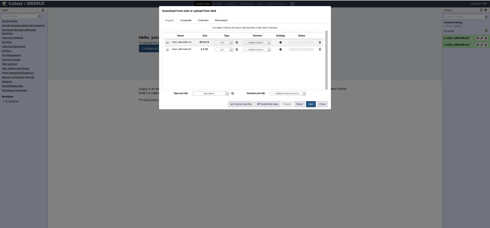
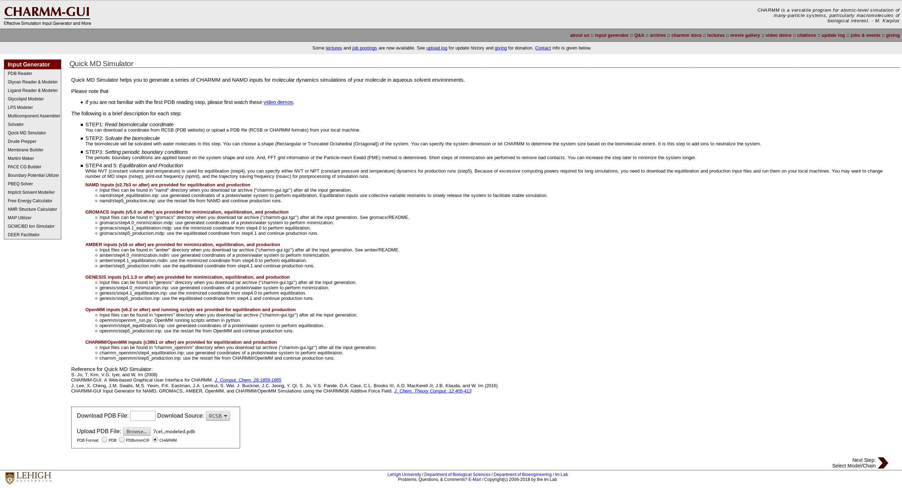
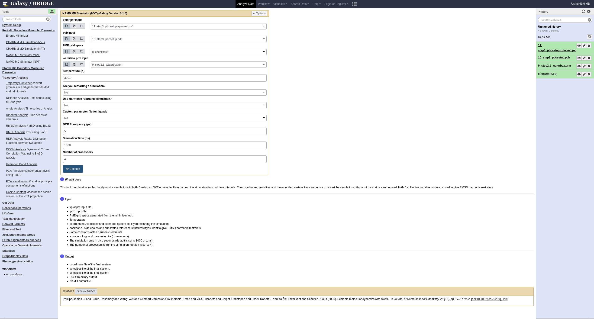

> ###  Audience
> This tutorial is intended for those who are new to the computational chemistry tools in Galaxy.
{: .comment}

# Introduction
{:.no_toc}

In this tutorial, we'll cover the basics of molecular modelling by setting up a protein and uploading this to Galaxy.

> ### Agenda
>
> In this tutorial, we will cover:
>
> 1. TOC
> {:toc}
>
{: .agenda}

# Cellulase and cellulose

To start we'll look at the PDB and find the entry for a fungal enzyme that cleaves cellulose. The enzyme is 7CEL, a hydrolase.

 ligand")

In this section we'll access the PDB, download the correct structure, import it and view in Galaxy.

> ###  Background: What is the PDB (Protein Data Bank) and format?
>
> The Protein Data Bank (PDB) format contains atomic coordinates of biomolecules and provides a standard representation for macromolecular structure data derived from X-ray diffraction and NMR studies.
> For example the `PDB`-file for a trans-sialadise with its substrate (PDB: [7CEL](https://www.rcsb.org/pdb/explore/explore.do?structureId=7CEL)):
>
> More resources:
>
>  -  Multiple structures are stored and can be queried at [https://www.rcsb.org/](https://www.rcsb.org/)
>  - Documentation describing the PDB file format is available from the wwPDB at [http://www.wwpdb.org/documentation/file-format.php](http://www.wwpdb.org/documentation/file-format.php).
{: .tip}


> ###  Background: Why choose a cellulase?
>
> Using enzymes to break down abundant cellulose into disaccharide units (cellobiose) is a method to optimise the
> biofuel process.
>
> More resources:
>
  - [https://en.wikipedia.org/wiki/Cellulase](https://en.wikipedia.org/wiki/Cellulase)
  - [https://en.wikipedia.org/wiki/Biofuel](https://en.wikipedia.org/wiki/Biofuel)
  - [Fungal Cellulases](https://pubs.acs.org/doi/full/10.1021/cr500351c)
  - [Cellobiohydrolase I Induced Conformational Stability and Glycosidic Bond Polarization ](https://pubs.acs.org/doi/10.1021/ja103766w)
{: .tip}

## Get data

The 7CEL PDB does not include a complete 8 unit substrate and some modelling is required.
The correctly modelled substrate is available. This modelling was done using VMD for atomic placement and CHARMM for minimisation.
> ###  More details about the modelling done
>
> Reversing the mutation at 217
> modelling the ligand
>
{: .details}

> ###  Hands-on: Data upload
>
> 1. Create a new history for this tutorial
> 2. Import the files from the [PDB](https://files.rcsb.org/download/7CEL.pdb) or from the shared data library
>
>    ```
>    
>    ```
>    ***TODO***: *Add the files by the ones on Zenodo here (if not added)*
>
>    ***TODO***: *Remove the useless files (if added)*
>
>    
>    
>
> 3. Rename the datasets
> 4. Check that the datatype
>
>    
>
> 5. Add to each database a tag corresponding to ...
>
>    
>
{: .hands_on}

# Modelling with CHARMM-GUI
It is convenient to setup the molecular system using a tool such as CHARMM-GUI. Alternatives are available (expand!).


> ###  More details about the theory
>
> But to describe more details, it is possible to use the detail boxes which are expandable
>
{: .details}

Reference:
 - [CHARMM-GUI](https://www.ncbi.nlm.nih.gov/pubmed/27862047)

Go to the correct section depending on which MD engine you will be using
 - [CHARMM](#CHARMM)
 - [NAMD](#NAMD)
 - [GROMACS](#GROMACS)

## CHARMM
{: #CHARMM}
Preparation in CHARMM-GUI if using CHARMM for later simulation.
### Upload the PDB to CHARMM-GUI
[Navigate to CHARMM-GUI](http://www.charmm-gui.org/?doc=input/pdbreader) and use the Input Generator, specifically the PDB Reader tool.


> ###  Hands-on: Upload the PDB to CHARMM-GUI
>
>Upload the PDB and choose CHARMM format.
{: .hands_on}

### Select both protein and ligand models
Select both the protein and the hetero residue (the ligand or glycan in this case).


### Manipulate the system
Rename the hetero chain to BGLC and add disulfide bonds.


### Download the output
The output is a .tgz file (a tarball or zipped tarball). Inside the archive you will see all inputs and outputs from CHARMM-GUI.


### Upload to Galaxy
Upload the step1_pdbreader.psf and step1_pdbreader.crd to your BRIDGE instance and run the system setup tool.



### Run the setup tool
FIXME

## NAMD
{: #NAMD}
Preparation in CHARMM-GUI if using NAMD for later simulation.
### Upload the PDB to CHARMM-GUI
[Navigate to CHARMM-GUI](http://www.charmm-gui.org/?doc=input/mdsetup) and use the Input Generator, specifically the Quick MD Simulator tool.



### Manipulate the system
Rename the hetero chain to BGLC and add disulfide bonds.


### Setup the waterbox and add ions
Set up a waterbox. Use Size (!) and cubic.


> ###  More details about the theory
>
> Why is 10 Angstrom a fair choice for the buffer?
> Why choose 0.15M NaCl and not neutralise?
>
{: .details}

### Generate the FFT automatically


### Download the output
The output is a .tgz file (a tarball or zipped tarball). Inside the archive you will see all inputs and outputs from CHARMM-GUI.


### Upload to Galaxy
Upload the following files to your BRIDGE instance:
 - step3_pbcsetup.xplor.ext.psf -> xplor psf input (psf format)
 - step3_pbcsetup.pdb -> pdb input (pdb format)
 - Checkfft.str -> PME grid specs (txt format)
- step2.1_waterbox.prm -> waterbox prm input (txt format)


### Ready to run the NAMD workflow
That's the next tutorial.
Preview below.


## GROMACS
{: #GROMACS}
Preparation in CHARMM-GUI if using GROMACS for later simulation.
Gromacs setup tools in Galaxy are not yet able to setup protein/ligand systems, for more discourse see the tutorial by the [Bevan Lab](http://www.bevanlab.biochem.vt.edu/Pages/Personal/justin/gmx-tutorials/complex_old/01_pdb2gmx.html)

In the meantime use CHARMM-GUI and select GROMACS outputs. In future FEsetup tools (to be added to BRIDGE/Galaxy) may be able to resolve.


# Conclusion
{:.no_toc}

 Well done! You have started modelling a cellulase protein and uploaded it into Galaxy.
