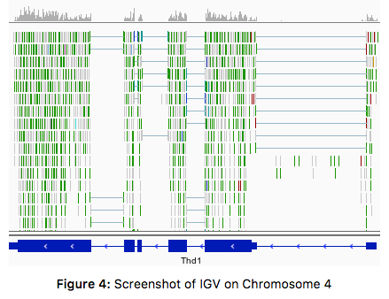

# Introduction
{:.no_toc}

Once we have set up the infrastructure, we are ready to write the tutorial.

> ### Agenda
>
> In this tutorial, we will cover:
>
> 1. TOC
> {:toc}
>
{: .agenda}

The tutorial's content should be placed in the file `tutorial.md`. Its syntax and structure are simple, and will have the following structure:

```markdown
---
layout: tutorial_hands_on

title: Title of the tutorial
zenodo_link: ''
questions:
- Which biological questions are addressed by the tutorial?
- Which bioinformatics techniques are important to know for this type of data?
objectives:
- The learning objectives are the goals of the tutorial
- They will be informed by your audience and will communicate to them and to yourself
  what you should focus on during the course
- They are single sentences describing what a learner should be able to do once they
  have done completed tutorial
- You can use Bloom's Taxonomy to write effective learning objectives
time_estimation: ''
key_points:
- The take-home messages
- They will appear at the end of the tutorial
contributors:
- contributor1
- contributor2
---
# Introduction
{:.no_toc}

blabla

# Section 1

blabla

## Subsection 1

blabla

# Section 2

blabla

## Subsection 2

blabla

# Conclusion
{:.no_toc}

blabla
```

# Metadata

The `tutorial.md` needs to start with some metadata at the top:

- `layout: tutorial_hands_on`: keep the default
- `title`: title of the tutorial (it will appear on the tutorial page and the topic page)
- `enable`: `false` to hide your tutorial from the topic page (optional)
- `zenodo_link`: link on Zenodo to the input data for the tutorial

> ###  Hands-on: Fill the basic metadata
>
> 1. Update the tutorial information in the header section of your tutorial:
>
>     ```
>     title: "Similarity search with BLAST"
>     ```
> 2. (Optional) Add the Zenodo link (if created)
>
{: .hands_on}

This information is used to display the data from the topic and tutorial page. They are also used to check which information are missing for the tutorials.

We also define metadata related to the pedagogical content of the tutorial, which will appear in the top ("Overview" box) and bottom of the online tutorial:

- `requirements`: list of resources that the reader of the material should be familiar with before starting this training:
    - `type`: the type of link (`internal` or `external`)

    For internal, i.e. inside the Galaxy Training Material:
    - `topic_name`: name of the topic
    - `tutorials`: list of required tutorials inside of the topic

    For external:
    - `title`: title of the external resource
    - `link`: URL to the external resource
- `time_estimation`: an estimation of the time needed to complete the hands-on
- `questions`: list of questions that will be addressed in the tutorial
- `objectives`: list of learning objectives for the tutorial

    A learning objective is a single sentence describing what a learner will be able to do once they have done the tutorial

- `key_points`: list of take-home messages

    This information will appear at the end of the tutorial

- `follow_up_training`: list of resources that the reader of the material could follow at the end of the tutorial

    - `type`: the type of link (`internal` or `external`)

    For internal, i.e. inside the Galaxy Training Material:
    - `topic_name`: name of the topic
    - `tutorials`: list of required tutorials inside of the topic

    For external:
    - `title`: title of the external resource
    - `link`: URL to the external resource

    They will be displayed at the end of a tutorial.

For this category of metadata, we have taken inspiration from what Software Carpentry has done and particularly what they described in their [Instructor training](https://swcarpentry.github.io/instructor-training/).

> ###  Hands-on: Fill out the pedagogical metadata
>
> 1. Define 2 questions that will be addressed during the tutorial and add them to the metadata
> 2. Define 2 learning objectives for the tutorial and add them to the metadata
{: .hands_on}

> ###  When filling the pedagogical metadata
> We recommend that you fill out the *questions* and the *learning objectives* before starting writing the tutorial content. You can still refine them afterwards, but it will help to guide you in developing your tutorial, and gives you some time to think beforehand on what topics are worth being covered.
>
> For the take-home messages, it is easier to define them once the tutorial is written and you identified the issues.
{: .comment}


# Content

The tutorial's content is written directly after the section of metadata. This is written in Markdown, a simple markup language.

> ###  Tip: Markdown
>
> Check [this cheatsheet](https://github.com/adam-p/markdown-here/wiki/Markdown-Cheatsheet) to learn more how to use Markdown.
{: .tip}

The Markdown content is then transformed into a user friendly webpage through a templating system. With this approach, there is no need to add the name of every tutorial each time, since they are automatically added based on the tutorial's metadata.

To help developing the tutorial, we recommend to create a workflow of the different steps of the tutorial inside Galaxy first, and then you can create the structure of the tutorial automatically from that:

> ###  Hands-on: Create the structure of the tutorial from a workflow
>
> 1. Create a small workflow with one or two steps on a running Galaxy instance
> 2. Get the workflow id
>    1. Go the "Share" page of the workflow
>    2. Copy the information after `id=` in the URL of the page
> 3. Get your API key for this Galaxy instance
>    1. Click on **User** --> **Preferences**
>    2. Click on **Manage API key**
>    3. Click on **Create a new key** (if none is available)
>    4. Copy the API key
> 4. Generate the skeleton of the tutorial locally
>
>    ```
>    $ planemo training_generate_from_wf \
>             --topic_name "my-topic" \
>             --tutorial_name "my-new-tutorial" \
>             --galaxy_url "URL to Galaxy instance in which you created the workflow" \
>             --galaxy_api_key "Your API key on the Galaxy instance" \
>             --workflow_id "ID of the workflow on the Galaxy instance" \
>             --zenodo_link "URL to the Zenodo record (Optional)"
>    ```
>
>    > ###  Using a local worklfow
>    > It is also possible to download the workflow locally (with the `.ga` extension), and then run a slightly different command:
>    >
>    > ```
>    > $ planemo training_generate_from_wf \
>    >          --topic_name "my-topic" \
>    >          --tutorial_name "my-new-tutorial" \
>    >          -- workflow PATH/to/the/file.ga \
>    >          --zenodo_link "URL to the Zenodo record (Optional)"
>    > ```
>    {: .comment}
>
> 5. Inspect the generated `tutorial.md`
{: .hands_on}

The generated tutorial is structured with:

- An introduction, to give an overview of the tutorial with its use cases, data, and methods
- Multiple sections representing the steps of the analysis, complete with automatically generated hands-on blocks, as practicing is a vital part of the learning process
- A conclusion to summarize what has been done in the tutorial (with a graphic)

> ###  Hands-on: Filling out the structure of the tutorial
>
> 1. Fill out the "Introduction" with a general introduction of the tutorial and a small description of the dataset (goals)
> 2. Rename/restructure the sections with several levels and more explication
> 3. Add some theory about the tool used to introduce each section
> 4. Add a small conclusion and relate the results to the original question
>
{: .hands_on}

> ###  Adding images with captions
> To add an image in Markdown file, we need to use the markdown syntax for this: ``.
>
> We have also added a small plugin to handle captions for each image:
>
> <!-- Adding a space to the caption to not trigger figurigy skip_titles -->
>
> The prefix "Figure 1." is automatically added before its caption. This is done with the following Markdown syntax:
>
> ```markdown
> 
> ```
>
> We can also cross-reference images inside our Markdown with an anchor. For example, we can link to [the previous figure](#figure-1) using `[the display text](#figure-nb)` (changing `nb` with the image's number).
{: .comment}


> ###  Writing mathematical expressions
>
> Mathematical expressions can be written in LaTeX, and are automatically rendered with [MathJax](https://www.mathjax.org/).
>
> Surround your math expression with two `$` signs on each side (like in LaTeX math blocks):
>
> - inline expressions, *e.g.* `$$ 5 + 5 $$` will be rendered as $$ 5 + 5 $$
> - block expressions, *e.g.* `$$ 5 + 5 $$` will be rendered in its own line block as
>
>    $$ 5 + 5 $$
>
> Dollar signs are therefore *reserved characters* for instructing the templating system to open/close LaTeX math blocks. If you want to use a `$` within your expression, you will need to *escape* it: `$$ a + 3\$ = 5\$ $$` will be rendered as: $$ a + 3\$ = 5\$ $$
>
>
> LaTeX code that uses the pipe symbol `|` in inline math statements may lead to a line being recognized as a table line by the templating system.
> This can be avoided by using the `\vert` command instead of `|`
{: .comment}

# Improving the learning experience

To improve the learning experience in our tutorial, we define some boxes to highlight content.

These boxes are defined always with the same structure:


```markdown
> ###  Type of box: Name of the box
> list
{: .type_of_box}
```


You must follow this structure exactly for it to be rendered correctly.

## **Overview** box

This box at the top of each tutorial is automatically generated using the metadata we defined in the topic's metadata file:

> ### Overview
>
> ** Questions**
> - Which biological questions are addressed by the tutorial?
> - Which bioinformatics techniques are important to know for this type of data?
>
> ** Objectives**
> - The learning objectives are the goals of the tutorial
> - They will be informed by your audience and will communicate to them and to yourself what you should focus on during the course
> - They are single sentences describing what a learner should be able to do once they have done completed tutorial
> - You can use Bloom's Taxonomy to write effective learning objectives
>
>  Requirements
> - [Galaxy introduction]({{ site.baseurl }}/topics/introduction/)
>
>  Time estimation: '1H'
>
{: .overview}

> ###  Hands-on: Checking the metadata
>
> 1. Check that the metadata added previously are correctly filling the overview box
>
>    > ###  Questions
>    >
>    > What metadata hasn't been added to this box?
>    >
>    > > ###  Solution
>    > >
>    > > The take-home messages are not added to this box but into the last box of the tutorial
>    > {: .solution}
>    {: .question}
>
{: .hands_on}

## **Agenda** box

In most tutorials, the second box is the agenda box, placed at the end of the introduction. It shows the table of contents for the tutorial


```markdown
> ### Agenda
>
> In this tutorial we will deal with:
>
> 1. TOC
> {:toc}
>
{: .agenda}
```


There is no need to fill out the list; this will be done automatically based off of your tutorial's section title.

To avoid adding the "Introduction" and "Conclusion" sections in the agenda, you can add `{:.no_toc}` below the section name. This will be rendered as follows:

> ### Agenda
>
> In this tutorial we will deal with:
>
> 1. TOC
> {:toc}
>
{: .agenda}

## **Hands-on** box

We find that having users walk through the tutorial, doing all of the steps is important for learning the concepts taught. We therefore emphasize this by regularly adding hands-on sections, where trainees are encouraged to do the analysis by themselves. We have designed some special boxes to make these sections easier to find.


```markdown
> ###  Hands-on: Spliced mapping
>
> 1. **RNA STAR** : Map your reads on the reference genome with
>    - *"Single-end or paired-end reads"*:  `Paired-end (as individual datasets)`
>    - *"RNA-Seq FASTQ/FASTA file, forward reads"*: the generated `trimmed reads pair 1` files (multiple datasets)
>    - *"RNA-Seq FASTQ/FASTA file, reverse reads"*: the generated `trimmed reads pair 2` files (multiple datasets)
>    - *"Custom or built-in reference genome"*: `Use a built-in index`
>    - *"Reference genome with or without an annotation"*: `use genome reference without builtin gene-model`
>    - *"Select reference genome"*: `Drosophila Melanogaster (dm6)`
>    - *"Gene model (gff3,gtf) file for splice junctions"*: the imported `Drosophila_melanogaster.BDGP6.87.gtf`
>    - *"Length of the genomic sequence around annotated junctions"*: `36`
>
>        This parameter should be length of reads - 1
>
> 2. **MultiQC** : Aggregate the STAR logs with
>      - *"Which tool was used generate logs?"*: `STAR`
>      - *"Type of FastQC output?"*: `Log`
>      - *"STAR log output"*: the generated `log` files (multiple datasets)
{: .hands_on}
```


For consistency please use:

- `` icon to define that is an hands-on
- Short imperative sentences to make it easy to identify the tasks
- Name of the tool in bold followed by `` icon to make it easy to identify a Galaxy tool
- Parameters for the tool as a sublist

This will be rendered like:


> ###  Hands-on: Spliced mapping
>
> 1. **RNA STAR** : Map your reads on the reference genome with
>    - *"Single-end or paired-end reads"*:  `Paired-end (as individual datasets)`
>    - *"RNA-Seq FASTQ/FASTA file, forward reads"*: the generated `trimmed reads pair 1` files (multiple datasets)
>    - *"RNA-Seq FASTQ/FASTA file, reverse reads"*: the generated `trimmed reads pair 2` files (multiple datasets)
>    - *"Custom or built-in reference genome"*: `Use a built-in index`
>    - *"Reference genome with or without an annotation"*: `use genome reference without builtin gene-model`
>    - *"Select reference genome"*: `Drosophila Melanogaster (dm6)`
>    - *"Gene model (gff3,gtf) file for splice junctions"*: the imported `Drosophila_melanogaster.BDGP6.87.gtf`
>    - *"Length of the genomic sequence around annotated junctions"*: `36`
>
>        This parameter should be length of reads - 1
>
> 2. **MultiQC** : Aggregate the STAR logs with
>      - *"Which tool was used generate logs?"*: `STAR`
>      - *"Type of FastQC output?"*: `Log`
>      - *"STAR log output"*: the generated `log` files (multiple datasets)
{: .hands_on}

There are also some predefined **parameter icons** available which can be used to indicate the *type* of parameter. These are optional,
but may be helpful in some cases (for example to distinguish between single file inputs and collection inputs).

The available icons are:


```markdown
> ###  Hands-on: My Step
>
> 1. **My Tool**  with the following parameters
>    -  *"My text parameter"*: `my value`
>    -  *"My input file"*: `my file`
>    -  *"My multiple file input or collection"*: `my collection`
>    -  *"My select menu"*: `my choice`
>    -  *"My check box"*: `yes`
>    -  **My repeat parameter**
>      - *"param1"*: `42`
{: .hands_on}
```


which, when rendered, look like:

> ###  Hands-on: My Step
>
> 1. **My Tool**  with the following parameters
>    -  *"My text parameter"*: `my value`
>    -  *"My input file"*: `my file`
>    -  *"My multiple file input or collection"*: `my collection`
>    -  *"My select menu"*: `my choice`
>    -  *"My check box"*: `yes`
>    -  **My repeat parameter**
>      - *"param1"*: `42`
{: .hands_on}


## **Questions** and **solution** boxes

Questions can be added to force trainees to think about what they are currently doing, and to put things in perspective.
They can also help the instructors by exposing and clarifying common scenarios, errors, or applications.


```markdown
> ###  Questions
>
> 1. Why are some tests filtered?
> 2. Does it improve the *p*-value distribution?
>
> > ###  Solution
> >
> > 1. Sol for the first question
> > 2. Sol for the second question
> >
> {: .solution}
{: .question}
```


Which will be rendered as:

> ###  Questions
>
> 1. Why are some tests filtered?
> 2. Does it improve the *p*-value distribution?
>
> > ###  Solution
> >
> > 1. Sol for the first question
> > 2. Sol for the second question
> >
> {: .solution}
{: .question}

Questions should be quick to answer. You can directly ask a question and expect an answer, or you can provide some answers and create multiple choices questions (MCQs).
With well chosen wrong answers, MCQs can do much more than just measure how much someone knows, such as exposing common misconceptions and mistakes.

In the box below, initially hidden, we add the correct answer and possibly any additional explanation. Self-trainees can then check the solution and its explanation.


## **Tips** box


```markdown
> ###  Tip: Importing data via links
>
> * Copy the link location
> * Open the Galaxy Upload Manager
> * Select **Paste/Fetch Data**
> * Paste the link into the text field
> * Press **Start**
{: .tip}
```


Rendered:

> ###  Tip: Importing data via links
>
> * Copy the link location
> * Open the Galaxy Upload Manager
> * Select **Paste/Fetch Data**
> * Paste the link into the text field
> * Press **Start**
{: .tip}

## **Comments** boxes


```markdown
> ###  Comments
> - Edit the "Database/Build" to select "dm3"
> - Rename the datasets according to the samples
{: .comment}
```


Rendered:

> ###  Comments
> - Edit the "Database/Build" to select "dm3"
> - Rename the datasets according to the samples
{: .comment}

## **Details** box

The detail box is used to give more background explanation on the subject. By default the box is collapsed, trainees can expand it if they wish to know extra information about a topic.


```markdown
> ###  More details on the ....
>
> Add more details in Markdown...
>
{: .details}
```


Rendered:

> ###  More details on the ....
>
> Add more details in Markdown...
>
{: .details}

## **Key points** box

This last box of the tutorial is automatically created with the take-home messages defined in the topic's metadata

To render the boxes correctly, the syntax needs to be correct. If it doesn't work, have a look at similar tutorials and get inspiration.

## Nested boxes

Boxes can be nested, *e.g.* for having tips inside a hands-on:


```markdown
> ###  Hands-on: Defining the topic for the tutorial
>
> 1. Search for NCBI Blast+ on the [ToolShed](https://toolshed.g2.bx.psu.edu/)
> 2. Check in which category it is
>
>    > ###  Questions
>    >
>    > In which topic will you put the tutorial?
>    >
>    > > ###  Solution
>    > >
>    > > If we search for [NCBI Blast+ in the ToolShed](https://toolshed.g2.bx.psu.edu/view/devteam/ncbi_blast_plus/7538e2bfcd41), it is attributed to 2 categories (bottom): "Next Gen Mappers" and "Sequence Analysis".
>    > > We decided to put it in "Sequence analysis" because this is the most general one for this tutorial.
>    > {: .solution}
>    {: .question}
{: .hands_on}
```


# Conclusion
{:.no_toc}
