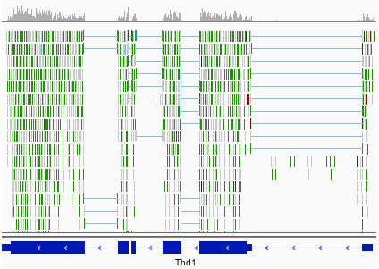

# Introduction
{:.no_toc}

Once we have set up the infrastructure, we are ready to write the tutorial.

> ### Agenda
>
> In this tutorial, we will cover:
>
> 1. TOC
> {:toc}
>
{: .agenda}

The tutorial's content should be placed in the file `tutorial.md`. Its syntax and structure are simple, and will have the following structure:

```markdown
---
layout: tutorial_hands_on

title: Title of the tutorial
zenodo_link: ''
questions:
- Which biological questions are addressed by the tutorial?
- Which bioinformatics techniques are important to know for this type of data?
objectives:
- The learning objectives are the goals of the tutorial
- They will be informed by your audience and will communicate to them and to yourself
  what you should focus on during the course
- They are single sentences describing what a learner should be able to do once they
  have done completed tutorial
- You can use Bloom's Taxonomy to write effective learning objectives
time_estimation: ''
key_points:
- The take-home messages
- They will appear at the end of the tutorial
contributors:
- contributor1
- contributor2
---
# Introduction
{:.no_toc}

blabla

# Section 1

blabla

## Subsection 1

blabla

# Section 2

blabla

## Subsection 2

blabla

# Conclusion
{:.no_toc}

blabla
```

# Metadata

The `tutorial.md` needs to start with some metadata at the top:

- `layout: tutorial_hands_on`: keep the default
- `title`: title of the tutorial (it will appear on the tutorial page and the topic page)
- `level`: `Introductory`, `Intermediate` or `Advanced`
- `enable`: `false` to hide your tutorial from the topic page (optional)
- `zenodo_link`: link on Zenodo to the input data for the tutorial

> ###  Hands-on: Fill the basic metadata
>
> 1. Update the tutorial information in the header section of your tutorial:
>
>     ```
>     title: "Similarity search with BLAST"
>     ```
> 2. (Optional) Add the Zenodo link (if created)
>
{: .hands_on}

This information is used to display the data from the topic and tutorial page. They are also used to check which information is missing for the tutorials.

We also define metadata related to the pedagogical content of the tutorial, which will appear at the top ("Overview" box) and bottom of the online tutorial:

- `requirements`: list of resources that the reader of the material should be familiar with before starting this training:
    - `type`: the type of link (`internal` or `external`)

    For internal, i.e. inside the Galaxy Training Material:
    - `topic_name`: name of the topic
    - `tutorials`: list of required tutorials inside of the topic

    For external:
    - `title`: title of the external resource
    - `link`: URL to the external resource
- `time_estimation`: an estimation of the time needed to complete the hands-on
- `questions`: list of questions that will be addressed in the tutorial
- `objectives`: list of learning objectives for the tutorial

    A learning objective is a single sentence describing what a learner will be able to do once they have done the tutorial

- `key_points`: list of take-home messages

    This information will appear at the end of the tutorial

- `follow_up_training`: list of resources that the reader of the material could follow at the end of the tutorial

    - `type`: the type of link (`internal` or `external`)

    For internal, i.e. inside the Galaxy Training Material:
    - `topic_name`: name of the topic
    - `tutorials`: list of required tutorials inside of the topic

    For external:
    - `title`: title of the external resource
    - `link`: URL to the external resource

    They will be displayed at the end of the tutorial.
- `subtopic`: if the topic has [multiple subtopics defined]({{ site.baseurl }}/topics/contributing/tutorials/create-new-topic/tutorial.html#adapt-the-metadata-for-your-topic), you can assign your tutorial to one of those subtopics here. Without this, the tutorial will appear in the "Other tutorials" section on the topic page.

For this category of metadata, we have taken inspiration from what Software Carpentry has done and particularly what they described in their [Instructor training](https://swcarpentry.github.io/instructor-training/).

> ###  Hands-on: Fill out the pedagogical metadata
>
> 1. Define 2 questions that will be addressed during the tutorial and add them to the metadata
> 2. Define 2 learning objectives for the tutorial and add them to the metadata
{: .hands_on}

> ###  When filling the pedagogical metadata
> We recommend that you fill out the *questions* and the *learning objectives* before starting writing the tutorial content. You can still refine them afterwards, but it will help to guide you in developing your tutorial, and gives you some time to think beforehand on what topics are worth being covered.
>
> For the take-home messages, it is easier to define them once the tutorial is written and you identified the issues.
{: .comment}


# Content

The tutorial's content is written directly after the section of metadata. This is written in Markdown, a simple markup language.

> ###  Markdown
>
> Check [this cheatsheet](https://github.com/adam-p/markdown-here/wiki/Markdown-Cheatsheet) to learn more how to use Markdown.
{: .comment}

The Markdown content is then transformed into a user friendly webpage through a templating system. With this approach, there is no need to add the name of every tutorial each time, since they are automatically added based on the tutorial's metadata.

To help developing the tutorial, we recommend to create a workflow of the different steps of the tutorial inside Galaxy first, and then you can create the structure of the tutorial automatically from that:

> ###  Hands-on: Create the structure of the tutorial from a workflow
>
> 1. Create a small workflow with one or two steps on a running Galaxy instance
> 2. Add the topic name as Tag and the tutorial title as Annotation/Notes to the workflow using the workflow editor.
> 3. Get the workflow id
>    1. Go the "Share" page of the workflow
>    2. Copy the information after `id=` in the URL of the page
> 4. Get your API key for this Galaxy instance
>    1. Click on **User** --> **Preferences**
>    2. Click on **Manage API key**
>    3. Click on **Create a new key** (if none is available)
>    4. Copy the API key
> 5. Generate the skeleton of the tutorial locally
>
>    ```
>    $ planemo training_generate_from_wf \
>             --topic_name "my-topic" \
>             --tutorial_name "my-new-tutorial" \
>             --galaxy_url "URL to Galaxy instance in which you created the workflow" \
>             --galaxy_api_key "Your API key on the Galaxy instance" \
>             --workflow_id "ID of the workflow on the Galaxy instance" \
>             --zenodo_link "URL to the Zenodo record (Optional)"
>    ```
>
>    > ###  Using a local workflow
>    > It is also possible to download the workflow locally (with the `.ga` extension), and then run a slightly different command:
>    >
>    > ```
>    > $ planemo training_generate_from_wf \
>    >          --topic_name "my-topic" \
>    >          --tutorial_name "my-new-tutorial" \
>    >          -- workflow PATH/to/the/file.ga \
>    >          --zenodo_link "URL to the Zenodo record (Optional)"
>    > ```
>    {: .comment}
>
> 6. Inspect the generated `tutorial.md`
{: .hands_on}

The generated tutorial is structured with:

- An introduction, to give an overview of the tutorial with its use cases, data, and methods
- Multiple sections representing the steps of the analysis, complete with automatically generated hands-on blocks, as practicing is a vital part of the learning process
- A conclusion to summarize what has been done in the tutorial (with a graphic)

> ###  Hands-on: Filling out the structure of the tutorial
>
> 1. Fill out the "Introduction" with a general introduction of the tutorial and a small description of the dataset (goals)
> 2. Rename/restructure the sections with several levels and more explication
> 3. Add some theory about the tool used to introduce each section
> 4. Add a small conclusion and relate the results to the original question
>
{: .hands_on}

## Adding images with captions
To add an image in Markdown file, we need to use the markdown syntax for this: ``.

We have also added a small plugin to handle captions for each image:

<!-- Adding a space to the caption to not trigger figurigy skip_titles -->

The prefix "Figure 1." is automatically added before its caption. This is done with the following Markdown syntax:

```markdown

```

We can also cross-reference images inside our Markdown with an anchor. For example, we can link to [the previous figure](#figure-1) using `[the display text](#figure-nb)` (changing `nb` with the image's number).

### Guidelines on Alt vs Figcaption Text

> While both the alt attribute and the figcaption element provide a way to
> describe images, the way we write for them is different. **`alt` descriptions
> should be functional; `figcaption` descriptions should be editorial or
> illustrative.**
>
> [*via thoughtbot.com*](https://thoughtbot.com/blog/alt-vs-figcaption)
{: .quote}

As an example for this image:


```markdown

```

Field          | Appropriate Contents
----           | -----
alt text       | Image of cell membrance with an embedded protein with central pore. DNA is shown splitting and entering the pore, an electrical signal comes out reading A C T or G.
figure caption | Using nanopore sequencing, a single molecule of DNA or RNA can be sequenced without the need for PCR amplification or chemical labeling of the sample. (Image from: <a href="https://nanoporetech.com/sites/default/files/s3/white-papers/WGS_Assembly_white_paper.pdf?submissionGuid=40a7546b-9e51-42e7-bde9-b5ddef3c3512">Nanopore sequencing: The advantages of long reads for genome assembly</a>)

## Writing mathematical expressions

Mathematical expressions can be written in LaTeX, and are automatically rendered with [MathJax](https://www.mathjax.org/).

Surround your math expression with two `$` signs on each side (like in LaTeX math blocks):

- inline expressions, *e.g.* `$$ 5 + 5 $$` will be rendered as $$ 5 + 5 $$
- block expressions, *e.g.* `$$ 5 + 5 $$` will be rendered in its own line block as

   $$ 5 + 5 $$

Dollar signs are therefore *reserved characters* for instructing the templating system to open/close LaTeX math blocks. If you want to use a `$` within your expression, you will need to *escape* it: `$$ a + 3\$ = 5\$ $$` will be rendered as: $$ a + 3\$ = 5\$ $$


LaTeX code that uses the pipe symbol `|` in inline math statements may lead to a line being recognized as a table line by the templating system.
This can be avoided by using the `\vert` command instead of `|`

## Tables and Matrices

Tables can be generated using markdown by using the `|` symbol to indicate column dividers, and `--` for table headers:


```markdown
|       | Obs1 | Obs2 | Obs3 |
|------ |--------------------|
| Feat1 | 0    | 1    | 2    |
| Feat2 | 1    | 2    | 3    |
| Feat3 | 2    | 3    | 4    |
```


When rendered, they will take the full width of the page:

|       | Obs1 | Obs2 | Obs3 |
|------ |--------------------|
| Feat1 | 0    | 1    | 2    |
| Feat2 | 1    | 2    | 3    |
| Feat3 | 2    | 3    | 4    |

This does not appear to be visually appealing when representing matrices, which is why a matrix box can be used instead:


```markdown
> |       | Obs1 | Obs2 | Obs3 |
> | ----- |--------------------|
> | Feat1 | 0    | 1    | 2    |
> | Feat2 | 1    | 2    | 3    |
> | Feat3 | 2    | 3    | 4    |
{: .matrix}
```


The rendered table is then given as a minimum-width and centred matrix:

> |       | Obs1 | Obs2 | Obs3 |
> | ----- |--------------------|
> | Feat1 | 0    | 1    | 2    |
> | Feat2 | 1    | 2    | 3    |
> | Feat3 | 2    | 3    | 4    |
{: .matrix}

# Improving the learning experience

To improve the learning experience in our tutorial, we define some boxes to highlight content.

These boxes are defined always with the same structure:


```markdown
> ###  Type of box: Name of the box
> list
{: .type_of_box}
```


You must follow this structure exactly for it to be rendered correctly.

## **Overview** box

This box at the top of each tutorial is automatically generated using the metadata we defined in the topic's metadata file:

> ### Overview
>
> ** Questions**
> - Which biological questions are addressed by the tutorial?
> - Which bioinformatics techniques are important to know for this type of data?
>
> ** Objectives**
> - The learning objectives are the goals of the tutorial
> - They will be informed by your audience and will communicate to them and to yourself what you should focus on during the course
> - They are single sentences describing what a learner should be able to do once they have completed the tutorial
> - You can use Bloom's Taxonomy to write effective learning objectives
>
>  Requirements
> - [Galaxy introduction]()
>
>  Time estimation: '1H'
>
{: .overview}

> ###  Hands-on: Checking the metadata
>
> 1. Check that the metadata added previously are correctly filling the overview box
>
>    > ###  Questions
>    >
>    > What metadata hasn't been added to this box?
>    >
>    > > ###  Solution
>    > >
>    > > The take-home messages are not added to this box but into the last box of the tutorial
>    > {: .solution}
>    {: .question}
>
{: .hands_on}

## **Agenda** box

In most tutorials, the second box is the agenda box, placed at the end of the introduction. It shows the table of contents for the tutorial


```markdown
> ### Agenda
>
> In this tutorial we will deal with:
>
> 1. TOC
> {:toc}
>
{: .agenda}
```


There is no need to fill out the list; this will be done automatically based off of your tutorial's section title.

To avoid adding the "Introduction" and "Conclusion" sections in the agenda, you can add `{:.no_toc}` below the section name. This will be rendered as follows:

> ### Agenda
>
> In this tutorial we will deal with:
>
> 1. TOC
> {:toc}
>
{: .agenda}

## **Hands-on** box

We find that having users walk through the tutorial, doing all of the steps is important for learning the concepts taught. We therefore emphasize this by regularly adding hands-on sections, where trainees are encouraged to do the analysis by themselves. We have designed some special boxes to make these sections easier to find.


```markdown
> ###  Hands-on: Spliced mapping
>
> 1. **RNA STAR** : Map your reads on the reference genome with
>    - *"Single-end or paired-end reads"*:  `Paired-end (as individual datasets)`
>    - *"RNA-Seq FASTQ/FASTA file, forward reads"*: the generated `trimmed reads pair 1` files (multiple datasets)
>    - *"RNA-Seq FASTQ/FASTA file, reverse reads"*: the generated `trimmed reads pair 2` files (multiple datasets)
>    - *"Custom or built-in reference genome"*: `Use a built-in index`
>    - *"Reference genome with or without an annotation"*: `use genome reference without builtin gene-model`
>    - *"Select reference genome"*: `Drosophila Melanogaster (dm6)`
>    - *"Gene model (gff3,gtf) file for splice junctions"*: the imported `Drosophila_melanogaster.BDGP6.87.gtf`
>    - *"Length of the genomic sequence around annotated junctions"*: `36`
>
>        This parameter should be length of reads - 1
>
> 2. : Aggregate the STAR logs with
>      - *"Which tool was used generate logs?"*: `STAR`
>      - *"Type of FastQC output?"*: `Log`
>      - *"STAR log output"*: the generated `log` files (multiple datasets)
{: .hands_on}
```


For consistency please use:

- `` icon to define that is an hands-on
- Short imperative sentences to make it easy to identify the tasks
- Name of the tool in bold followed by `` icon to make it easy to identify a Galaxy tool
- Parameters for the tool as a sublist

This will be rendered like:


> ###  Hands-on: Spliced mapping
>
> 1. **RNA STAR** : Map your reads on the reference genome with
>    - *"Single-end or paired-end reads"*:  `Paired-end (as individual datasets)`
>    - *"RNA-Seq FASTQ/FASTA file, forward reads"*: the generated `trimmed reads pair 1` files (multiple datasets)
>    - *"RNA-Seq FASTQ/FASTA file, reverse reads"*: the generated `trimmed reads pair 2` files (multiple datasets)
>    - *"Custom or built-in reference genome"*: `Use a built-in index`
>    - *"Reference genome with or without an annotation"*: `use genome reference without builtin gene-model`
>    - *"Select reference genome"*: `Drosophila Melanogaster (dm6)`
>    - *"Gene model (gff3,gtf) file for splice junctions"*: the imported `Drosophila_melanogaster.BDGP6.87.gtf`
>    - *"Length of the genomic sequence around annotated junctions"*: `36`
>
>        This parameter should be length of reads - 1
>
> 2. : Aggregate the STAR logs with
>      - *"Which tool was used generate logs?"*: `STAR`
>      - *"Type of FastQC output?"*: `Log`
>      - *"STAR log output"*: the generated `log` files (multiple datasets)
{: .hands_on}

There are also some predefined **parameter icons** available which can be used to indicate the *type* of parameter. These are optional,
but may be helpful in some cases (for example to distinguish between single file inputs and collection inputs).

The available icons are:


```markdown
> ###  Hands-on: My Step
>
> 1. **My Tool**  with the following parameters
>    -  *"My text parameter"*: `my value`
>    -  *"My input file"*: `my file`
>    -  *"My multiple file input or collection"*: `my collection`
>    -  *"My select menu"*: `my choice`
>    -  *"My check box"*: `yes`
>    -  **My repeat parameter**
>      - *"param1"*: `42`
{: .hands_on}
```


which, when rendered, look like:

> ###  Hands-on: My Step
>
> 1. **My Tool**  with the following parameters
>    -  *"My text parameter"*: `my value`
>    -  *"My input file"*: `my file`
>    -  *"My multiple file input or collection"*: `my collection`
>    -  *"My select menu"*: `my choice`
>    -  *"My check box"*: `yes`
>    -  **My repeat parameter**
>      - *"param1"*: `42`
{: .hands_on}

## Tool Links

With the new [GTN in Galaxy Webhook](https://github.com/galaxyproject/galaxy/pull/10024), trainees can view training directly within Galaxy. As part of this, we enable those trainees to click on tools, and have those tools directly activated in Galaxy, enabling for a seamless training experience for trainees.

, they click a blue button and the tool is activated in Galaxy, and the overlay is closed. The student can reactivate the overlay at any time and return to their place in the tutorial.")

To enable these in your tutorial you can use the following syntax:


```
- 
- 
- 
```


Which will be rendered as:

- 
- 
- 

When viewed through Galaxy, students will see:

<span data-tool="upload1" title="Tested with upload1" class="tool galaxy-proxy-active"><strong>Import some data</strong> <i class="fas fa-wrench" aria-hidden="true"></i><i aria-hidden="true" class="fas fa-cog"></i><span class="visually-hidden">Tool: upload1</span></span>

### How to find these IDs?

The easiest way is to use planemo to generate the training from a workflow. In recent versions of planemo, this is managed automatically.

The alternative is to figure out the ID for the tool you want to use:

1. Find your tool in Galaxy, and click to access the tool form.
2. Click on Options at the top right
3. Click on Share
4. The URL shown will be something like `https://usegalaxy.eu/root?tool_id=toolshed.g2.bx.psu.edu/repos/galaxyp/mz_to_sqlite/mz_to_sqlite/2.0.4+galaxy1`
5. Keep only the part after the `=`, so `toolshed.g2.bx.psu.edu/repos/galaxyp/mz_to_sqlite/mz_to_sqlite/2.0.4+galaxy1` in this example


## **Questions** and **solution** boxes

Questions can be added to force trainees to think about what they are currently doing, and to put things in perspective.
They can also help the instructors by exposing and clarifying common scenarios, errors, or applications.


```markdown
> ###  Questions
>
> 1. Why are some tests filtered?
> 2. Does it improve the *p*-value distribution?
>
> > ###  Solution
> >
> > 1. Sol for the first question
> > 2. Sol for the second question
> >
> {: .solution}
{: .question}
```


Which will be rendered as:

> ###  Questions
>
> 1. Why are some tests filtered?
> 2. Does it improve the *p*-value distribution?
>
> > ###  Solution
> >
> > 1. Sol for the first question
> > 2. Sol for the second question
> >
> {: .solution}
{: .question}

Questions should be quick to answer. You can directly ask a question and expect an answer, or you can provide some answers and create multiple choices questions (MCQs).
With well chosen wrong answers, MCQs can do much more than just measure how much someone knows, such as exposing common misconceptions and mistakes.

In the box below, initially hidden, we add the correct answer and possibly any additional explanation. Self-trainees can then check the solution and its explanation.


## **Tips** box

Tips boxes are really just for 'tips', usually hints regarding Galaxy operations that users may or may not be familiar with. If you want to provide extended discussion or links to external materials then consider the comment and detail boxes instead.


```markdown
> ###  Tip: Importing data via links
>
> * Copy the link location
> * Open the Galaxy Upload Manager
> * Select **Paste/Fetch Data**
> * Paste the link into the text field
> * Press **Start**
{: .tip}
```


Rendered:

> ###  Tip: Importing data via links
>
> * Copy the link location
> * Open the Galaxy Upload Manager
> * Select **Paste/Fetch Data**
> * Paste the link into the text field
> * Press **Start**
{: .tip}

## **Comments** boxes


```markdown
> ###  Comments
> - Edit the "Database/Build" to select "dm3"
> - Rename the datasets according to the samples
{: .comment}
```


Rendered:

> ###  Comments
> - Edit the "Database/Build" to select "dm3"
> - Rename the datasets according to the samples
{: .comment}

## **Details** box

The detail box is used to give more background explanation on the subject. By default the box is collapsed, trainees can expand it if they wish to know extra information about a topic.


```markdown
> ###  More details on the ....
>
> Add more details in Markdown...
>
{: .details}
```


Rendered:

> ###  More details on the ....
>
> Add more details in Markdown...
>
{: .details}

## **Key points** box

This last box of the tutorial is automatically created with the take-home messages defined in the topic's metadata

To render the boxes correctly, the syntax needs to be correct. If it doesn't work, have a look at similar tutorials and get inspiration.

## **Warning** box


```markdown
> ###  Danger: You can lose data!
> Something really bad can happen here!
{: .warning}
```


Rendered:

> ###  Danger: You can lose data!
> Something really bad can happen here!
{: .warning}


## Nested boxes

Boxes can be nested, *e.g.* for having tips inside a hands-on:


```markdown
> ###  Hands-on: Defining the topic for the tutorial
>
> 1. Search for NCBI Blast+ on the [ToolShed](https://toolshed.g2.bx.psu.edu/)
> 2. Check in which category it is
>
>    > ###  Questions
>    >
>    > In which topic will you put the tutorial?
>    >
>    > > ###  Solution
>    > >
>    > > If we search for [NCBI Blast+ in the ToolShed](https://toolshed.g2.bx.psu.edu/view/devteam/ncbi_blast_plus/7538e2bfcd41), it is attributed to 2 categories (bottom): "Next Gen Mappers" and "Sequence Analysis".
>    > > We decided to put it in "Sequence analysis" because this is the most general one for this tutorial.
>    > {: .solution}
>    {: .question}
{: .hands_on}
```


## **Code** box

We have added code in/out boxes to help you show commands, and their effects, when running command line commands.

Normally a single column, with the boxes above one another, it will automatically split side-by-side over a given width (1200px);


```markdown
> > ###  Input: Bash
> > ```bash
> > cat /tmp/test.ini
> > ```
> {: .code-in}
>
> > ###  Output
> > The file should look like:
> >
> > ```ini
> > [example]
> > server_name = Dogs!
> > listen = 192.168.0.2
> > apikey = super-secret-api-key-wow!
> > ```
> {: .code-out}
{: .code-2col}
```


Rendered (try it! resize your browser)

> > ###  Input: Bash
> > ```bash
> > cat /tmp/test.ini
> > ```
> {: .code-in}
>
> > ###  Output
> > The file should look like:
> >
> > ```ini
> > [example]
> > server_name = Dogs!
> > listen = 192.168.0.2
> > apikey = super-secret-api-key-wow!
> > ```
> {: .code-out}
{: .code-2col}

If you leave off the `{: .code-2col}`, it will render as a single column always.


```markdown
> ###  Input: Bash
> ```bash
> cat /tmp/test.ini
> ```
{: .code-in}

> ###  Output
> The file should look like:
>
> ```ini
> [example]
> server_name = Dogs!
> listen = 192.168.0.2
> apikey = super-secret-api-key-wow!
> ```
{: .code-out}
```


Rendered:

> ###  Input: Bash
> ```bash
> cat /tmp/test.ini
> ```
{: .code-in}

> ###  Output
> The file should look like:
>
> ```ini
> [example]
> server_name = Dogs!
> listen = 192.168.0.2
> apikey = super-secret-api-key-wow!
> ```
{: .code-out}


## FAQs (snippets)

Many common questions or instructions may be useful to share between different tutorials. For example instructions on how to start a new history or importing data. To make these types of snippets easier to re-use and avoid duplication, they are available in the form of *snippets*.

### Finding snippets
These are available in folders named `faqs`, either at the project level, topic level, or tutorial level.

- **Project-level FAQs:** `faqs/`
  - `faqs/galaxy/` for general Galaxy questions
  - `faqs/gtn/` for questions regarding the GTN website itself

- **Topic-level FAQs:** `topics/<topic>/faqs/`
  - for questions pertaining to that specific topic

- **Tutorial-level FAQs:** `topics/<topic>/tutorials/<tutorial>/faqs/`
  - for questions pertaining to that specific tutorial
  - if this is present, it is linked to from the tutorial overview box at the top, and from the end of the tutorial


### Including FAQs/snippets in your tutorials

To include one of these snippets in your tutorial, you can use the following syntax:

```

```

Which will be rendered as:



The advantage of this approach is that when the Galaxy interface updates, we only have to update the snippet, rather than every tutorial. Please try to use snippets whenever you can!

You could also specify the box type you want the snippet to be rendered in:

```

```



or without a box altogether:

```

```




### Creating new FAQs/snippets

Do you want to include something in your tutorial that you think might be useful in other tutorials as well? Or are you answering a frequently asked question? Consider creating a snippet for it

Each snippet (question) is a separate file, with some metadata, residing in one of the `faqs` folders:

```yaml
---
title: How do I run a workflow?
area: workflows      # FAQs will be grouped by these areas on the FAQ page
box_type: tip        # tip/comment/hands_on; optional, if you want the content to be in a box
layout: faq          # if you set this the snippet will get its own page and be included in the FAQs page
---

Here you can write the snippet / answer to the FAQ in Markdown

- Go to `Workflows` on the top menu bar
- Click on ..
- ..

```

### FAQ pages

All FAQs will also be collected on their own page, this makes it easy for and teachers to prepare the session, and for participants to quickly find the answers to common questions.


To do this, create a file named `index.md` inside the faq folder:

```yaml
---
layout: faq-page
---
```

If you would like to enforce an order of the faq areas, you can do so:

```yaml
---
layout: faq-page
area_order: [introduction, learners, instructors, contributors, other]
---
```

(just make sure you list all existing areas in the folder)

If a tutorial-level FAQ page exists (`topics/<topic>/tutorials/<tutorial>/faqs/index.md`) it will be automatically linked to from the overview box at the top of the tutorial, and at the end of the tutorial. Have a look at this tutorial to see it in action.

## Footnotes

> > ###  Input: Markdown
> >
> > ```
> > Footnotes[^1] can be used to insert more content or explanation as reference material to your content. You can use the same footnote reference multiple time, and the footnote will include backlinks to return to the correct place in the text.[^1]
> > ```
> > {: .pre-break-lines}
> {: .code-in}
>
> > ###  Output
> > Footnotes[^1] can be used to insert more content or explanation as reference material to your content. You can use the same footnote reference multiple time, and the footnote will include backlinks to return to the correct place in the text.[^1]
> {: .code-out}
{: .code-2col}


## Icons

To use these icons, take the name of the icon, 'details' in this example, and write something like this in your tutorial:

```markdown

```

<div class="row">

	<div class="col-md-2 col-sm-3" style="text-align: center">
		<div style="font-size: 400%"></div>
		<div>{{ icon[0] }}</div>
	</div>

</div>

## Abbreviations

Oftentimes there are terms you'll use over and over again where there is an acronym or abbreviation you'll use consistently. However for learners new to the material, they might need to scroll up to the first definition every time to remember what it meant. It would be annoying as an author to have to re-define it every time, so we've implemented some very simple syntax to allow you to create a list of definitions and then use those in the text.

In your tutorial metadata you can add an abbreviations section like:

```yaml
---
title: My awesome tutorial
...
abbreviations:
  API: Application Programming Interface
  JSON: JavaScript Object Notation
---
```

And in your text you can use braces to refer to the term

> > ###  Input: Markdown
> > <code>
> > The `/jobs` &lbrace;API&rbrace; will return &lbrace;JSON&rbrace;. When we call the &lbrace;API&rbrace; we'll get back this result &lbrace;JSON&rbrace;.
> > </code>
> {: .code-in}
>
> > ###  Output
> >
> > The `/jobs` {API} will return {JSON}. When we call the {API} we'll get back this result {JSON}.
> >
> {: .code-out}
{: .code-2col}


# Citations
If you would like to cite any articles, books or websites in your tutorial, you can do so by adding a file called `tutorial.bib` next to your `tutorial.md` file. In this file you may enter [bibtex](http://www.bibtex.org/Using/) formatted citations. An example is given below:


```
@article{batut2018community,
  title={Community-driven data analysis training for biology},
  author={Batut, B{\'e}r{\'e}nice and Hiltemann, Saskia and Bagnacani, Andrea and Baker, Dannon and Bhardwaj, Vivek and Blank, Clemens and Bretaudeau, Anthony and Brillet-Gu{\'e}guen, Loraine and {\v{C}}ech, Martin and Chilton, John and others},
  journal={Cell systems},
  volume={6},
  number={6},
  pages={752--758},
  year={2018},
  publisher={Elsevier},
  doi={10.1016/j.cels.2018.05.012}
}

@misc{galaxy-training-materials,
  url = {https://training.galaxyproject.org},
  note = {Accessed 2019-04-08},
  title = {Galaxy Training materials website}
}

@online{Galaxy-P_Metaproteomics,
  author = {Galaxy-P Team},
  title = {Galaxy-P Metaproteomics instance},
  url = {https://proteomics.usegalaxy.eu/},
  urldate = {2020-10-13}
}
```


You can use this in your tutorial as follows:


```
For more information please look at this great article ,
and the corresponding website 
```


Rendered:

For more information please look at this great article , and the corresponding website 


A bibliography will automatically be appended to the end of your tutorial (scroll down to the end of this tutorial to see how it looks! or [jump there directly](#bibliography))

> ###  Tip: Getting a bibtex citation from a doi
> If you have a DOI for a paper, you can easily obtain the bibtex citation using [doi2bib.org](https://www.doi2bib.org/).
{: .tip}


# Automatic Jupyter Notebooks

If your tutorial is primarily focused on teaching students how to write code (Bash, Python, SQL, etc) you can take advantage of the GTN's ability to automatically export Jupyter Notebooks from the tutorial content. In this system, you pick a single language for your tutorial, and then all code blocks tagged with that language become runnable. E.g.

    Here is some explanation

    ```bash
    some code that students should execute
    ```

To use this system, you need to take care of a few things:

- Do **not** use hands-on boxes for segments that should be executed (code needs to be left aligned!)
- Do not use snippets
- Do not use the built in citation system
- Do not use a terminal or prompt character
- Avoid including output when you can, it doesn't render nicely especially when the cells will become runnable.

And be aware that the output will look a little bit different than the GTN, e.g. solution boxes cannot be hidden by default.

## Enabling the system

Add metadata to your `tutorial.md` header like:


```
notebook:
  language: python
```


# Spanish Translation Project

We have started [a trial for translating tutorials into Spanish]({{site.baseurl}}/news/2021/05/20/spanish_project_begins.html). Below are instructions on how to add translations of slides and/or hands-on tutorials in Spanish.

1. **Add a new file** with the translated material, next to the English version.
   - Add suffix `_ES` suffix
       - i.e. `tutorial_ES.md` or `slides_ES.html`


2. **Add metadata** to the **English version** (at the top of the file):
     ```yaml
     tags:
       - español
     translations:
       - es
     ```

3. **Add metadata** to the **translated version** of the file:
     ```yaml
     lang: es
     translations:
       - en
     ```

If all worked well, it should look something like this, with a dropdown menu on the slides and/or tutorial showing the presence of a curated tutorial:


## Other Languages
Would you like to add a different language to the GTN? Please contact us first (e.g. on [Gitter]({{site.gitter_url}})), to discuss a long-term sustainability plan!

# Conclusion
{:.no_toc}


## Footnotes (Rendered)

[^1]: The wikipedia definition of a footnote is: "A note is a string of text placed at the bottom of a page in a book or document or at the end of a chapter, volume or the whole text. The note can provide an author's comments on the main text or citations of a reference work in support of the text. Footnotes are notes at the foot of the page while endnotes are collected under a separate heading at the end of a chapter, volume, or entire work. Unlike footnotes, endnotes have the advantage of not affecting the layout of the main text, but may cause inconvenience to readers who have to move back and forth between the main text and the endnotes."


